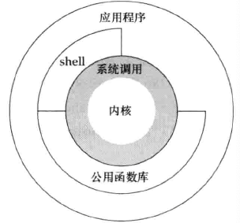

##  引言
- <font color = red>OS</font>是管理`计算机资源`的一款软件, 这其中的资源有:
    - 硬件
        - 磁盘
        - 键盘
        - 屏幕
        - 等
    - 软件
        - 运行过程中的进程
        - 内存
        - 网络通信
        - 等
> ps: 总之, 它管理一切

- 提供的基本服务 
    - <font color = green>执行新程序</font>
    - <font color = green>打开文件</font>
    - <font color = green>读取文件</font>
    - <font color = green>分配内存</font>
    - <font color = green>获取当前时间</font>
    - ...

## 体系结构


- 由图中可以看出, <font color = red>OS</font>的核心是 <font color = red>kernel</font>, 它占据的的位置虽小, 但最核心
- kernel提供的接口被称为<font color = yellow>syscall</font>, 所有的<font color = yellow>stdlib</font>以及<font color = yellow>shell</font>都调用的是<font color = yellow>syscall</font>
- <font color = yellow>app</font>位于最上层, 可以调用<font color = yellow>shell, syslib, stdlib</font>等


## 文件和目录
#### 文件系统
- unix 的 <font color = red>file-system</font>是 `目录` 和 `文件` 的一种层次结构, 所有东西的起点 **称为**<font color = yellow>根(root)</font>的目录, 用字符`/`表示

- 目录(<font color = green>directory</font>)是一个包含`目录项`的<font color = red>文件</font>. 在逻辑上, 可以认为<font color = yellow>每个目录项都包含一个文件名, 同时还包含说明该文件属性的信息.</font>
    - 文件属性指
        - 文件类型(<font color = green>是目录还是普通文件等</font>)
        - 文件大小
        - 文件所有者
        - 文件权限
        - 文件最后修改的时间
        - ...

- 文件名
    - 目录中的各个名称称为<font color = yellow>文件名</font>
    - 文件名不能只包含:
        - `/`
        - ` `(空格)

    - 创建新目录后, 会自动创建2个文件名
        - `.` 表示当前目录
        - `..` 表示上一级目录, 即父级目录
    
<br>

- 路径名
> 由<font color = yellow>斜线分隔</font>的<font color = yellow>一个</font>或<font color = yellow>多个</font>**文件名** 构成

- 绝对路径 
    - 以`/`开头
- 相对路径
    - 不以`/`开头的路径


#### case 列出目录中的所有文件
- 可以使用shell下的`ls`
- 在程序上如下:(<font color = red>文件 main.cpp</font>)
```cpp
#include<dirent.h>
#include<cerrno>
#include<cstdio>


int main(int args, char** argv){
    if(args != 2){
        fprintf(stderr, "usage: ./case <path>\n");
        return -1;
    }


    DIR* dp;
    struct dirent* dirp;
    if((dp = opendir(argv[1])) == nullptr){
        perror("opendir()");
        return -1;  
    }

    int count = -1;
    while((dirp = readdir(dp))){
        printf("%d 文件名: %s\n", ++count, dirp->d_name);       
    }
    closedir(dp);
    return 0;
}
```
> 编译
```shell
make case

./case /etc
# 展示etc下所有的文件, 但不会递归
```

<br>

#### 工作目录
- 每个进程都有1个工作目录, 也叫当前工作目录. <font color = yellow>所有的`相对路径名`都从工作目录开始解释</font>进程可以调用`chdir`函数更改工作目录
> 一般程序可执行文件所在的目录就是工作目录

#### 起始目录
- 登录unix时, 工作目录设置为起始目录, 该起始目录从口令文件中相应用户的登录项中取得


## 输入输出 
#### 文件描述符
- 是一个非负的整数, kernel用以标识一个特定进程正在访问的文件. 当kernel打开一个现有文件时, 会返回一个新的文件描述符, 在读写文件时, 使用这个文件描述符

#### 标准输入输出出错
- 惯例, 当运行一个新的程序时, 所有的shell都为其打开3个fd:
    - standard input
    - standard output
    - standard err
    > 它们默认都链接向终端


#### sysio
- 函数
    - open
    - read
    - write
    - lseek
    - close
> 以上这些函数提供了不带缓冲的IO,这些函数使用的是fd

#### case(非缓冲IO)
```cpp
#include<iostream>
#include<unistd.h>


using namespace std;


static const int BUFF_SIZE  = 4096;

int main(int args, char** argv){

    int n = 0;
    char buf[BUFF_SIZE] = {'0'};

    while ((n == read(STDIN_FILENO, buf, BUFF_SIZE)) > 0){
        if(write(STDOUT_FILENO, buf, n) != n)
            cerr << "write error\n";
    }

    if (n < 0)
        cerr << "read error\n";
    else
        cout << "buf is:\t" << buf << std::endl;


    return 0;
}
```

### stdio(标准IO)
- 标准IO底层封装了系统IO, 但提供了合适的缓冲区, 使得系统调用的IO效率得到提高
- 标准IO简化了对行输入的处理, 如`fgets`读取完整的行, 但使用read读取键盘输入时, 自己要做行处理
```cpp
#include<stdio.h>
#include<unistd.h>


int main(int args, char** argv){
    int c = 0;
    
    // 这个循环 若是在 shell中 通过手动输入, 效果是:
    /// 输入一句, 输出之前的输入
    /// 再等待继续, 不会结束
    while ((c = getc(stdin)) != EOF){
        if(putc(c, stdout) == EOF)
            fprintf(stderr, "output error\n");
    }

    /// 到这里来表示 stdin 断开
    ///// 可能是 shell 重定向了 stdin是文件, 读取到了 文件末尾EOF, 所以能来这
    ///// 也可能是 读取出错(-1), 因为EOF是-1, 所以标准库提供了 文件流出错的检查函数
    if(ferror(stdin))
        fprintf(stderr, "input error\n");
    return 0;
}
```

<br>

## 程序VS进程
#### 程序
- <font color = red>存储在磁盘上的</font>可执行文件, 它是静态的
- kernel使用`exec`将函数读入内存, 并执行

#### 进程
- 被kernel执行的程序被称为进程,是动态的, 也叫任务 
- 进程被kernel动态管理, 它的标识被称为<font color = yellow>pid(进程ID)</font>

#### case-获取进程id
```cpp
#include<unistd.h>
#include<iostream>
int main(void){
    std::cout << "process id is :" << getpid() << std::endl;
}
```
> 编译多次运行后, 每次打印的id是不同的
- pid的类型是`pid_t`(<font color = yellow>整形</font>), 它的大小在各个平台上是不一样的, 但标准会<font color = red>保证它能存储在一个长整中</font>, 所以<font color = yellow>若用printf来打印时, 可以强制转化成`%ld`</font>


### 进程控制 
- 有3个用于进程控制的主要函数
    - fork
    - exec
    - waitpid 
> 这3个函数构成了unix的世界, 后面细说

### case-(excl)
```cpp
这里实现一个简单的 few 模式的程序
```


