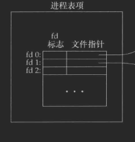
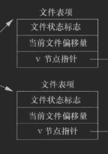
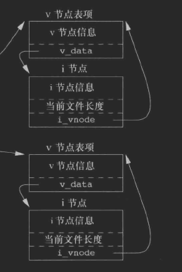
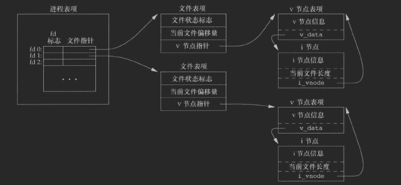
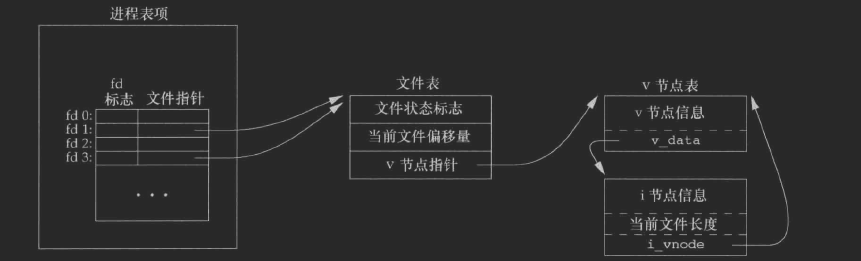

## 引言
- 文件相关的操作, 从用户的操作角度来总结, 就以下几个功能
    - 创建新文件 
    - 打开文件
    - 获取文件内容
    - 修改文件内容
    - copy文件到新文件 
    - 删除文件
    > 其中修改文件, 包含修改文件内容, 文件名, 文件所属者等

- 由用户操作的角度来看, 操作系统提供了几个基本的函数, 由这几个函数, 可以组合完成用户需要的功能
    <font color = yellow>
    - open
    - read
    - write
    - lseek
    - close
    </font>

- 这里说一下, 这里的<font color = red>read 和 write</font>是不带缓冲的IO, 所谓的不带缓冲,即<font color = green>调用read 和 write时, 它们内部不会做缓冲区优化</font>(<font color = red>当然不同的操作系统会做别的处理, 如linux中会做预读功能, 这也算是一种优化
</font>)
- 不带缓冲, 并不是说内核的程序员做不出来, 是因为标准(<font color = green>POSIX等</font>)


### 文件描述符
- 内核对于打开的文件, 都会在对应的进程中保存一个整数来做关联, 所有对文件的操作在调用系统接口时, 都通过这个整数来内部操作, 这个整数就是所谓的文件描述符
- 它由<font color = red>open函数产生</font>, 后续读写都传递这个数字

### 标准输入输出出错
- 目前基本所有的进程在开始时, 它们都默认打开了3个文件描述符, 这3个文件描述符关联到了2个设备
    - 键盘(<font color = green>标准输入</font>)
    - 屏幕(<font color = green>标准输出</font>)
- 在程序中使用3个常量来表示这3个文件描述符
    - 0(<font color = green>标准输入</font>)
    - 1(<font color = green>标准输出</font>)
    - 2(<font color = green>标准出错</font>)
    > 需要说明的是 标准出错关联的设备也是屏幕

- 程序中也可以使用常量标识
    - STDIN_FILENO(<font color = green>标准输入</font>)
    - STDOUT_FILENO(<font color = green>标准输出</font>)
    - STDERR_FILENO(<font color = green>标准出错</font>)

### case-最大打开文件的数量
```cpp
#include<cstdio>
#include<cstdlib>
#include<cerrno>
#include<unistd.h>      
#include<fcntl.h>     


int main(void){
    int a = 0;
    while(1){
        auto fd = open("./test", O_RDONLY |  O_CREAT, S_IRUSR);
        if(fd < 0){
            perror("open fail");
            break;
        }
        ++a;
    }
    printf("最多打开:%d\n",a);
}
```
> 结论: 1. <font color = yellow>一个进程打开文件的数量是有限的</font>
> 结论: 2. <font color = yellow>一个进程可以打开同一个文件多次</font>

### 配置文件描述符的上限
- 可以使用`ulimit -a`查看到文件描述符的上限, 同样可以配置`ulimit -n 1024`, 再次运行程序, 发现`a的值是1021`

### open
- 函数原型
```cpp
#include<fcntl.h>  // 头文件位置
int open(const char* path, int oflag, ...);
int openat(int fd, const char* path, int oflag, ...);

// 返回值
// 成功返回0
// 出错返回-1, 并设置errno
// ps: 它们问题返回 当前可用的最小的文件描述符
```
> 这2个函数都是可变的, 仅当<font color = red>oflog有O_CREAT选项时, 才必须指定第3个参数, 它的作用是创建的文件所赋于的权限</font>

#### path
- 可以是<font color = red>绝对路径</font>, 也可以是<font color = red>相对路径</font>

#### oflag
- 它是一个位操作, 也就是说可以多选

|选项|说明|
|:-:|:-:|
|O_RDONLY|对打开的文件只有读的功能, 不能写|
|O_WRORLY|对打开的文件只有写的功能, 不能读|
|O_RDWR|对打开的文件有读写的功能|
|O_APPEND|对打开的文件每次写时, 都追加在文件的最后(<font color = yellow>忽视lseek</font>)|
|O_CREAT|若要打开的文件不存在, 则创建它, 此时必须指定第3个参数|
|O_EXCL|若同时指定了O_CREAT, 此时文件若存在, 则报错, 用这个功能可以查看一个文件是否存在|
|O_TRUNC|打开文件后,截断所有的内容从0开始操作|

> 其他的选项后面遇到场景后再说

#### openat
- 它相于于open函数多了1个参数, 意义是<font color = red>在指定的目录下打开对应path下的文件</font>, 所以:
    - 当<font color = green>path是相对路径时, 同时指定了fd, 则以fd代表的目录为起点, 打开path</font>
    - 同样当<font color = green>path是绝对路径时, fd失效</font>
    - 当<font color = green>fd是特殊值`AT_FDCWD`</font>时, openat相当于open

#### 补充同步的选项
- `O_SYNC`
    - 每次调用write等待物理IO完成, 包括(文件的亚数据更新)
    - 也就是说, 调用write后, 一定会等到磁盘驱动将数据真正写到磁盘中, 并更新修改的时间后才返回给用户   
    - 一般数据库会调用这个函数来完成数据的同步

- `O_DSYNC`
    - 和`O_SYNC`不同的是, 它不必等到<font color = red>文件亚数据更新完毕</font>

- `O_RSYNC`
    - 这个不是标准, 所以这个不说了, 若支持这个选项的系统, 它的功能就相当于读写锁
    

#### case-返回最小fd
```cpp
#include<cstdio>
#include<cstdlib>
#include<cerrno>
#include<unistd.h>
#include<fcntl.h>

#include<iostream>

using namespace std;

int main(void){
    // 先打开一个文件
    auto fd_3 = open("b.txt", O_RDONLY);
    if(fd_3 < 0){
        perror("open fail");
        exit(1);
    }
    cout << fd_3 << endl;

    auto fd_4 = open("b.txt", O_RDONLY);
    // 这里忽略错误的检查
    cout << fd_4 << endl;

    close(fd_3);

    auto fd_5 = open("b.txt", O_RDONLY);
    // 这里忽略错误的检查
    cout << "fd_5: " <<fd_5 << endl;
}
```
> 这个程序先打开了`fd_3, fd_4`, 占据了`3,4`, 然后关闭了`fd_3`, 又打开了`fd_5`, 发现`fd_5`的值是复用的3

#### case-检查文件是否存在
```cpp
#include<cstdio>
#include<cstdlib>
#include<cerrno>
#include<unistd.h>
#include<fcntl.h>
#include<cstring>

#include<iostream>

using namespace std;

int main(void){
    // 先打开一个文件
    auto fd_3 = open("b.txt", O_RDONLY | O_CREAT | O_EXCL, S_IRUSR);

    // 因为同时指定了 O_CREAT 和 O_EXCL, 所以当文件已经存在后, 则报错
    if(fd_3 < 0){
        cerr << strerror(errno) << endl;
        exit(1);
    }

    // 创建文件成功
}
```
#### case-append忽略lseek
- 当以O_APPEND打开文件时, 则lseek定位后,写入后还是追加在文件末尾
```cpp
#include<cstdio>
#include<cstdlib>
#include<cerrno>        
#include<unistd.h>      
#include<fcntl.h>      
#include<cstring>      

#include<iostream>

using namespace std;    

int main(void){
    // 先打开一个文件
    auto fd_3 = open("b.txt", O_RDWR | O_CREAT | O_APPEND, S_IRUSR);    // __code_0
    
    // 忽略错误的检查
    
    auto str = "hello world";
    write(fd_3, str, __builtin_strlen(str));

    getchar();
    lseek(fd_3, SEEK_SET, 0);

    auto str_1 = "after";
    write(fd_3, str_1, __builtin_strlen(str_1));
}
```
> 当`__code_0`没有添加`O_APPEND`时, b.txt的内容是"after world", 当添加了后, 则内容`hello worldafter`

#### case-openat
```cpp
#include<iostream>
#include<fcntl.h>
#include<unistd.h>
#include<cerrno>
#include<cstdio>


int main(void){
    // 先打开一个目录
    auto dir_fd_0 = open("./tmp0", O_DIRECTORY);

    // 打开的是 ./tmp0/test.txt
    // 原来这里写的是 O_RDONLY,所以写会出错, 这里改了写
    auto tmp0_file_test = openat(dir_fd_0, "test.txt", O_WRONLY);
    write(tmp0_file_test, "hello", 5);

    // 打开的是 ./test.txt
    auto file_test = openat(AT_FDCWD, "test.txt", O_WRONLY);
    write(file_test, "world", 5);
    return 0;
}
```
> 该程序测试了openat的用法, 注意打开文件时选项


### creat
- 它的作用是创建一个新的文件
```cpp
#include<fcntl.h>
int creat(const char* path, mode_t mode);

// 成功返回 0
// 出错返回-1, 并设置errno
```
> 这个函数出现和open的版本有关, 在早期open函数并不能创建文件, 所以只能用这个函数来创建文件
- 它的第2个参数和`open指定O_CREAT时, 第3个参数是一样的, 后面说`
- 用它来创建文件在多任务并发时, 有安全问题, 因为creat函数返回的fd, 只有写功能, 当创建一个临时文件时, 又要对这个文件进行读, 则根据creat的功能, 必须先调用creat创建一个临时文件, 再close后, 再open以读写的方式打开这个临时文件, 这中间creat和close的操作并不是一气呵成的, 在多进程并发 或 多线程并发时, 就会有问题
    
#### case-creat创建的文件,不能读
```cpp
#include<fcntl.h>
#include<unistd.h>
#include<iostream>
#include<cstring>

using namespace std;

int main(void){
    // 创建的文件可读可写
    auto fd = creat("./creat_tmp0.txt", S_IWUSR | S_IRUSR);
    if(fd < 0){
        std::cerr << "creat fail:" << strerror(errno) << std::endl;
        return -1;
    }

    char buf[1024] = {0};

    auto r_len = read(fd, buf, sizeof(buf));
    if(r_len < 0){
        std::cerr << "read fail:" << strerror(errno) << std::endl;
 //       return -1;
     }else
        std::cout << buf << std::endl;

    auto w_len = write(fd, "hello", 5);
    if(w_len < 0){
        std::cerr << "write fail:" << strerror(errno) << std::endl;
        return -1;
    }
}
```

#### case-creat并发时注意的问题
```cpp
#include<fcntl.h>
#include<unistd.h>
#include<iostream>
#include<cstring>

using namespace std;

int main(void){

    // 这里用进程来演示
    auto pid = fork();

    if(pid < 0){
        cerr << "fork fail" << strerror(errno) << endl;
        return -1;
    }

    // 这里以 父进程 和子进程来创建 tmp.txt文件
    // 为了说明这个问题, 特意让父进程阻塞
    // 子进程创建后, 立即向文件中写入 hello world
    if(pid == 0){
        auto fd = creat("tmp.txt", S_IRUSR | S_IWUSR);
        // 忽略出错的情况
        write(fd, "hello", 5);
        exit(0);
    }

    int a = 0;
    cin >> a;       // 这2句代码,就是为了阻塞, 没别的意思
    auto fd = creat("tmp.txt", S_IRUSR | S_IWUSR);
    lseek(fd, 5, SEEK_END);     // 移到最后, 添加 world 5个字符
    write(fd, "world", 5);
    wait(0);    // 等待子进程结束
}
```

### close
- 关闭一个文件, 它只断开指定文件描述符的关联, 其他已经打开相同文件的fd不受影响
```cpp
#include<unistd.h>
int close(int fd);

// 成功返回 0
// 出错返回-1, 并设置errno
```
> 当进程结束后,内核会自动清理该进程打开的所有文件, 但最好养成关闭文件的习惯

### lseek
```cpp
#include<unistd.h>

off_t lseek(int fd, off_t offset, int where);

// 成功返回的是新的文件的偏移量
// 出错返回-1, 并设置errno
```
- 每打开一个文件, 内核就会有个记录这个fd的偏移, 用来表示文件开始处的长度, 通常读写就是从这个偏移开始
- 文本编辑器中光标的定位都必须用到这个函数
- 并不是所有的文件都能设置偏移
    - unix中有一句话, 一切旨文件, 这句话在编程的世界里已经成为了哲学
    - 从字面理解来说就是, 所有的IO都是通过fd来操作, fd背后所关联的可能是一个普通文件, 也可能是一台设备, 也可能是远程的一台计算机, 但作为调用层的我们来看, 我们只用操作文件描述符

#### offset
- 它与第3个参数有关
    - 若`where = SEEK_SET`, 表示从<font color = red>文件开始 距离offset个字节的地方</font>
    - 若`where = SEEK_CUR`, 表示从<font color = red>文件当前位置, 距离offset个字节的地方</font>, offset可为负
    - 若`where = SEEK_END`, 表示从<font color = red>文件开结尾,距离offset个字节的地方</font>, 同样offset可为负
- 返回值是新的文件偏移量


#### case-获取文件的长度
- 可以用这个函数获取一个普通文件的长度
```cpp
#include<unistd.h>
#include<fcntl.h>
#include<cerrno>

#include<iostream>

int main(int args, char** argv){
    using namespace std;
    if(args != 2){
        cerr << "usage lseek <path> \n";
        return -1;
    }
    auto fd = open("/etc/passwd", O_RDONLY);
    if(fd < 0){
        perror("open fail");
        return -1;
    }
    auto len = lseek(fd, 0, SEEK_END);
    if(len < 0){
        perror("seek fail");
        return -1;
    }
    cout << "文件长度是:" << len << endl;
}
```
#### case-汉字多字节编码的情况
```cpp
#include<unistd.h>
#include<fcntl.h>
#include<cerrno>

#include<iostream>


int main(int args, char** argv){
    using namespace std;

    // 打开文件, 假设文件已经存在
    auto fd = open("tmp.txt", O_RDWR);

    // 从文件开始的第2个字节(注意是字节)开始
    lseek(fd, 1, SEEK_SET);
    char buf[1024] = {0};

    read(fd, buf, sizeof(buf));
    cout << buf << endl;
}
```

#### 空洞文件 
- 因为lseek可以在`文件末尾设置偏移`, 当为正数时, 则可以在末尾和设置的偏移中间形成空洞
> 举个简单的例子, 当前文件10个字节, 调用`lseek(fd, 1000, SEEK_END)`后, 会在10个字节的后面的1000个字节会形成空洞,但事实上这个文件在磁盘空间中并不占据这1000个字节
```cpp
#include<unistd.h>
#include<fcntl.h>
#include<cerrno>

#include<iostream>


int main(int args, char** argv){
    using namespace std;

    // 打开文件, 假设文件已经存在
    auto fd = open("tmp.txt", O_RDWR);

    // 在文件末尾 到 1000个字节中形成空洞
    lseek(fd, 1000, SEEK_END);

    // 再在1000后, 写入 hello world
    write(fd, "hello world", 11);
}
```

### read
- 主要功能是根据fd, 读取文件的内容
```cpp
#include<unistd.h>

ssize_t read(int fd, void* buf, size_t nbytes);

// 成功返回 读取的字节数
// 读取结束 返回0(非低速设备, 如普通文件)
// 出错返回 -1, 并设置errno
```

#### read返回的字节少于参数要读取的字节
- 读取普通文件时, 到达文件末尾的会作一次单独返回
    - 如文件有10个字节, 读取时传入的参数是11, 则read会分2次, 一次读取10, 返回, 另一次是将完毕单独返回0
- 读取终端设备时, 一次最多读取一行
- 读取低速设备时(<font color = red>管道, socket, 打印机等</font>)
- <font color = yellow>read会被系统的信号打断</font>这个时候, 并不代表读取失败, 而应该是重新再读取

#### case-read读取到文件末尾时单独返回
```cpp
#include<unistd.h>
#include<fcntl.h>
#include<iostream>


int main(void){
    auto fd = open("tmp.txt", O_RDONLY);

    char buf[1024] = {0};

    ssize_t r_len = 0;

    auto count = 0;
    while((r_len = read(fd, buf, 1024)) >= 0){
        ++count;
        std:: cout << "这一次读取的内容是:" << buf  << std::endl;
        __builtin_memset(buf, 0, r_len);      // 不要影响输出

        // 读取完毕, 上面的count会++, 记会记录读取完毕的这一次
        if(r_len == 0){
            break;
        }
    }
    std::cout << "读取的次数是:" << count << std::endl;

   return 0;
}
```

### write
- 向指定的fd中写入内容
```cpp
#include<unistd.h>

ssize_t write(int fd, const void* buf, size_t nbytes);

// 成功返回 写入的字节数, 一般来说 返回值 会等于 nbytes, 但不绝对,还有被信号中断的情况 

// 出错返回-1, 并设置errno
// 一般文件满了(长度被限制), 磁盘满了都会出错 
```

#### case-copy文件
```cpp
#include<unistd.h>
#include<fcntl.h>
#include<iostream>

using namespace std;

int main(int args, char** argv){
    if(args != 3){
        cout << "usage copy file1 file2" << endl;
        return -1;
    }

    auto sfd = open(argv[1], O_RDONLY);
    auto dfd = open(argv[2], O_WRONLY);

    char buf[10] = {0};
    int r_len = 0;
    while((r_len = read(sfd, buf, sizeof(10)))){
       if(r_len < 0){
           cerr << "read fail" << strerror(errno) << endl;
           return -1;
       }
       if(r_len == 0){
            cout << "over write\n";
       }

       // 这里没有检查 write返回值 != r_len的情况
       if(write(dfd, buf, r_len) < 0){
           cerr << "write fail" << strerror(errno) << endl;
           return -1;
       }
    }

   return 0;
}
```

### read-write第3个参数
- 这2个函数的第3个参数是指定多大的缓冲区, 这个cache 大小是有讲究的
- 这里直接借apue的案例说明这一点, 就不写例子了
    - 缓冲区大小最合适的数值并不是像4096这样固定的数字, 这个大小和磁盘系统有关, 可以使用stat函数, 对一个文件获取到最合适的缓冲区大小
    - 后续项目中所有的缓冲区大小, 为了方便, 取的是1024或4096, 这里说一下
    - 在使用标准库时, 标准库IO内部已经作好的最佳的缓冲区, 并且标准库IO的效率很高,建议用


### 文件共享
- 所谓的共享, 就是
    - 同一进程中, 多次打个同一个文件, 这种情况下, 该进程会有不同的文件描述符来指向这个文件
    - 不同进程中, 打开同一个文件, 这种情况下从本质上来讲也和上面的第1种情况是一样的
    > 需要说明的是, 并发时, 对同一文件的操作会有竞争的风险, 这个时候针对不同的情况, 会有不同的处理机制, 如<font color = red>多线程并发时, 可以用线程同步</font>, <font color = yellow>多进程并发时, 可能用文件锁, 进程间同步(`信号量`)</font>

#### unix进程中文件的逻辑结构
> 众所周知, 进程虽然打开了文件, 但在用户层面并不直接操纵磁盘文件, 因为OS屏蔽了这一切, 只能通过提供的系统调用来间接操纵文件
> 而在unix的内核中, 对于进程打开的文件, 也是有一套自己的体系机制来完成磁盘文件的读写

- 在内核层面, 有3种结构来表示打开的文件
    - 文件描述符表(<font color = yellow>file descriptor table</font>), 这个<font color = red>处于最上层</font>
    - 文件表(<font color = yellow>file table</font>)
    - v结点(<font color=yellow>真正的磁盘文件关联的结构</font>)

#### fd table(文件描述符表)
- 这一层在最上层, 身为用户层面的我们, 只能获取到一个 <font color=red>整数值</font>
- 它背后的结构如下图:
   

> aupe书籍中用 <font color=red>进程表项</font>, 这里本人习惯用 <font color=yellow>fd-table来描述</font>
```txt
    从这图可以总结出这几个东西
        1. 在代码层面, fd-table 的每一项是一个strcut, 假设是:
            struct fd_item_t {
                int fd_flag;     // 文件描述符标志
                void* file_ptr;    // 文件指针, 指向下一层
            }

    当我们向 read等函数提供 fd时, 内核会根据当前进程, 到fd-table中找到对应的 fd_item
    然后通过 file_ptr 到下一层结构中 找文件

    ps: 至于内核的 fd-table是 数组还是链接, 还是什么hash表, 这里就不讨论了
```

#### file-table(文件表)
- fd-table会找到这一层, 它的结构如下图
   

```txt
    根据这张图, 也可以给出一个简单的数据结构:
        struct file_item_t{
            int file_sta_flag;      // 文件状态标志
            offset_t offset;        // 文件偏移量
            void* _disk_file_ptr;   // 描述磁盘上这个文件的 结构指针
        };


    接上一步, 当通过 file_ptr 找到 file_item时, 又会通过 _disk_file_ptr找到真正的磁盘文件映射的结构

    到这一步, 从unix设计上来看, 可以推测出1个结论出来:
        当进程中, 打开同一文件2次, 则事实上, 至少会产生4个对象
            1. fd_item_1
            2. file_item_1
            3. fd_item_2
            4. file_item_2
            
        再一个推测的结论:
            磁盘文件 _disk_file_item 整个内核中, 应该只有一份, 换句说, 会产生5个对象
            1. fd_item_1
            2. file_item_1
            3. fd_item_2
            4. file_item_2
            5. _disk_file_item        // 真正的磁盘文件
            
        _disk_file_item中记录的信息应该是 磁盘文件相关的信息
            如: 文件大小
                文件位置
                文件修改的时间, 创建时间, 访问时间
                文件的权限, 所属人, 所属组
                文件的磁盘块
                ...
            因为这些东西对所有的用户来说是公有的


        根据图, file_item中的 文件偏移仅是当前用户申请fd所对应的偏移
        不同的fd, 虽然可能最终指向同一块磁盘文件, 但它们文件偏移是自己
        独有的, 所以出现并发时, 不同的fd对同一文件写操作时, 就会因为竞争
        产生不可预料的结果
            这里要说一点, 即使是多进程或多线程并发时, 对同1个 _disk_file_item写入时, 也是原子的
            就是说 当前正在写磁盘的过程一定是 独占的, 之所以最终产生写入错乱的现象, 是在用户层面
            因为并发时, 不同的fd, 在写入前, 偏移值是自己独有的一份,由于并发, 其他fd写入后导致_disk_file_item的文件大小发生了改变,同时会更新这些file_item的偏移, 但当前fd的偏移还是原来的,fd写入时可能就直接覆盖了其他fd已经写入的内容, 所以本质原因是, 并发造成了 _disk_file_item 不断被覆盖, 最终的效果就是错乱

    文件锁的原理应该是, 内核设置一个临界区, 在这个临界区内, 用户将 read-write-update 这3步 连起来操作, 形成独占的
        1. 获取文件大小, 更新自己的 偏移
        2. 从最新的偏移处开始write(write调用完毕后, 内部会更新file_item的偏移)
```

#### v结点
- 它的逻辑结构如下:
       
> 它的结构就不细说了, 各家平台有自己的实现, 但原理如上在同所说, 大同小异


#### 整个fd相关的结构图
   

#### 父子进程下的file-table
- 当进程调用 <font color=red>fork</font>(`后面会说`)后, 产生子进程, 内核并不是完全copy出一份一模一样的副本给子进程, 在 <font color=yellow>file-table这一点来看, 内核只是指针复制</font>, 也就是说 <font color=yellow>父子进程共享同一个`file-item`</font>
- 还有个函数`dup, dup2`也是和`fork`一样的道理, 后面说
> <font color = green size = 5>但当2个进程不是父子进程时, 却打开了同一个文件, 则它们有自己独有的`file-item`, 它们的结构大致如下图</font>,

   


#### case-并发追加文件错乱
```cpp
#include<unistd.h>
#include<fcntl.h>
#include<iostream>
#include<pthread.h>
#include<cstdlib>

using namespace std;


static void* sub_thread(void* arg_ptr){
    char* path = (char*)arg_ptr;
    auto fd = open(path, O_RDWR);
    if(fd < 0){
        perror("open fail");
        pthread_exit(nullptr);
    }

    auto pself = pthread_self();

    // 随机一个数字
    time_t t;
    time(&t);
    unsigned seed = t ^ (time_t)pself;
    auto result = rand_r(&seed) % 1000 + 1;

    
    printf("当前长度是%lld\n", lseek(fd, 0, SEEK_END));
    char buf[100] = {0};
    snprintf(buf, 100, "%ud\n", result);
      
    write(fd, buf, __builtin_strlen(buf));
    
    sleep(1);
    return 0;
}


int main(int args, char** argv){
    if(args != 2){
        cerr << "please give a path\n";
        return -1;
    }
    // 20 threads read-write
    static const int num_threads = 20;
    
    pthread_t thread_arr[num_threads] = {0};

    for(int i = -1; ++i < num_threads;){
        pthread_create(&thread_arr[i], NULL, sub_thread, argv[1]);
    }

    int count = num_threads;
    while(count){
        pthread_join(thread_arr[--count], nullptr);
    }
    return 0;
}
```
> 该程序以 <font color=yellow>多线程打开同一文件, 使用lseek做追加写时</font>,验证错误覆盖的情况, 以下是编译运行后, 终端的输出, 以及tmp-txt的内容
```shell
make ./file_concurrency #编译
rm -f b.txt; touch b.txt;       # 新建文件
./file_concurrency | cat -n     # 利用管道, 输出行以便观察
1	当前长度是0
2	当前长度是5
3	当前长度是5
4	当前长度是10
5	当前长度是10
6	当前长度是15
7	当前长度是15
8	当前长度是15
9	当前长度是20
10	当前长度是20
11	当前长度是0
12	当前长度是24
13	当前长度是5
14	当前长度是29
15	当前长度是34
16	当前长度是34
17	当前长度是38
18	当前长度是44
19	当前长度是44
20	当前长度是49

# 通过测试打印, 可以发现, 多线程在lseek时, 可能获取到相同的 偏移, 这一定
# 会导致这2次的写入操作是后1次的write, 覆盖前1次的, 所以相应的文件的内容一定
# 小于20行

cat -n b.txt
1	343d
2	708d
3	873d
4	837d
5	1d
6
7	413d
8	636d
9	36d
10	1000d
11	176d
12	164d
```
> 错乱的原因, 已经讨论过了, 不过<font color = red>从错乱的打印也能得出另1个结论: write的系统调用一定是独占的</font>, <font color = yellow>为文件每一行的打印是完整的, 这和前面猜测的是一样的</font>

### 文件锁初探
> 这里只简单看下`lokcf`, 其他的也是类似的, 建议用(`fcntl函数`)
- 上面的例子中, 多线程并发并没有添加任何同步机制, 所以出现了错乱的写入, 解决方法也很简单:
    - 利用线程同步(<font color=yellow>mutext</font>)
    - 这种同步机制是由 <font color=red>POSIX标准保证的</font>
- 除了用线程间的同步锁外, 还可以用其他方式:
    - 信号量
    > 这里说下, 不能用文件锁(<font color=red>原因在测试程序中说了</font>)
> 这2种同步机制(信号量和文件锁), 本来是针对进程的, 但<font color = red>操作系统在实现锁同步时, 说白了只有一套机制, 不管是以进程为单位, 还是以线程为单位, 都走的是同样的处理机制, 所以多线程之间的同步,也可以用信号量, <font color=yellow>但不同标准下的锁机制不能混用, 如线程下锁机制是通过全局变量来的, 但放到多进程就不行, 因为2个进程的空间是独立的, 即是父子进程, 同样相同的全局变量, 它们的内存地址也不一样</font></font>

- 文件锁的原理,本质是将锁运用在了 <font color=red>最底层的`_disk_file_item`( <font color=yellow>前面v结点说过</font>)</font>, 所以:
    - 不同进程对同一文件加锁时, 事实上锁是公用的, 因为磁盘文件的映射结构只有一个 
    - 同一进程不同的文件描述符对应同一文件时, 并发时也是同样的原理

#### case-文件锁同步进程
```cpp
#include<unistd.h>
#include<fcntl.h>
#include<iostream>
#include<pthread.h>
#include<cstdlib>
#include<sys/file.h>

using namespace std;

static void* sub_thread(void* arg_ptr){
    char* path = (char*)arg_ptr;
    auto fd = open(path, O_RDWR | O_APPEND);        // __code_0
    if(fd < 0){
        perror("open fail");
        pthread_exit(nullptr);
    }

    
    auto pself = pthread_self();                    // __code_1

    // 随机一个数字
    time_t t;
    time(&t);
    unsigned seed = t ^ (time_t)pself;
    auto result = rand_r(&seed) % 1000 + 1;


    
    printf("time:%ld tid:%ld seed:%d 随机值 %d当前长度是%lld\n",t, (time_t)pself, seed,  result, lseek(fd, 0, SEEK_END));  // __code_lseek
    
    //fflush(NULL);                                 // __code_flush

    char buf[100] = {0};
    snprintf(buf, 100, "%d\n", result);
    auto l_res = lockf(fd, F_LOCK, 0);              // __code_2
    write(fd, buf, __builtin_strlen(buf));
    sleep(1);
    lockf(fd, F_ULOCK, 0);                          // __code_3
    close(fd);

    return 0;
}


int main(int args, char** argv){
    if(args != 2){
        cerr << "please give a path\n";
        return -1;
    }

    // 多进程并发
#if 0
    for(int i = -1; ++i < 20;){
        auto pid = fork();
        if(pid < 0){
            return -1;
        }

        if(pid == 0){
            sub_thread(argv[1]);
            return 0;
        }
    }

    for(int i = -1; ++i < 20;){
        wait(0);
    }


    // 多线程并发
#elif 1
    // 20 threads read-write
    static const int num_threads = 20;

    pthread_t thread_arr[num_threads] = {0};

    for(int i = -1; ++i < num_threads;){
        pthread_create(&thread_arr[i], NULL, sub_thread, argv[1]);
    }

    int count = num_threads;
    while(count){
        pthread_join(thread_arr[--count], nullptr);
    }
#endif
    return 0;
}

/**
    说明一下, 这个程序注意的地方 
    
        临界区:
            __code_2 
                临界区
            __code_3

        
        __code_0  
            1. 当不使用 O_APPEND 追加模式时, 
                __code_lseek 必须放在 __code_2 和 __code_3中间
            2. 当使用追加模式时, __code_lseek失效,write函数内部自动获取文件末尾
                所以此时 __code_lseek 不用放在临界区
                但在测试打印时, 会在终端输出 重叠的长度值, 但事实上写入文件是没有问题的

        __code_1
            当使用多线程测试时, pthread_self的值都是不同的
            当使用多进程测试时, pthread_self的值是一样的,但程序的逻辑上是没有问题的,为了更能理解, 建议多进程下应该调用getpid()


   关于测试也这这样几个现象:
        多进程测试:
            1. 注释 __code_flush & O_APPEND
                程序是1秒1秒的输出, 直到20秒结束
            原因: printf函数在 标准输出时, 遇到换行才会 冲掉缓冲区调用write
                  但代码中 __code_lseek 这句printf代码虽然最后有\n
                  但当前的shell环境是zsh, 所以测试的结果是并未立即输出 __code_lseek这一行, 别的shell环境下并未做测试, 但从标准来说, __code_lseek应该是立即输出的

            2. 打开 __code_flush & O_APPEND
                程序是瞬间输出, 然后等待20秒(此时终端什么都不会输出)
                这20秒的时间就是临界区 每个进程睡眠1秒累加的

            这2种情况下, 文件的写入都是没有问题的

        

        多线程下测试:
            1. 注释 __code_flush & O_APPEND
                程序是1秒后, 输出所有的内容, 立即结束(不会等20秒);

            2. 打开 __code_flush & O_APPEND
                程序立即输出20行, 等1秒后, 立即结束(不行等20秒)

            ps:经过测试, __code_2 和 __code_3 之间对于线程来说, 并不是所谓的临界
                所以 这种测试时, 整个程序大概1秒左右就结束了
                write函数 我写了其他的测试程序, 只出现过一次不符合的情况, 所以这种所谓的临界区, 对线程来说最好不要使用

    测试如下
*/
```

> 以下用进程来测试的,线程使用文件锁有问题(<font color=red>打开fllush</font>)
```shell
rm -f b.txt ; touch b.txt       # 创建一个新的空文件
make file_concurrency_safe      # 编译生成程序文件
./file_concurrency_safe b.txt | cat -n      # 利用管道 cat 打印出每行的行号

## __begin_
1	time:1672644736 tid:140704299989184 seed:972344688 随机值 689当前长度是0
2	time:1672644736 tid:140704299989184 seed:972344688 随机值 689当前长度是4
3	time:1672644736 tid:140704299989184 seed:972344688 随机值 689当前长度是8
4	time:1672644736 tid:140704299989184 seed:972344688 随机值 689当前长度是12
5	time:1672644736 tid:140704299989184 seed:972344688 随机值 689当前长度是16
6	time:1672644736 tid:140704299989184 seed:972344688 随机值 689当前长度是20
7	time:1672644736 tid:140704299989184 seed:972344688 随机值 689当前长度是24
8	time:1672644736 tid:140704299989184 seed:972344688 随机值 689当前长度是28
9	time:1672644736 tid:140704299989184 seed:972344688 随机值 689当前长度是32
10	time:1672644736 tid:140704299989184 seed:972344688 随机值 689当前长度是32
11	time:1672644736 tid:140704299989184 seed:972344688 随机值 689当前长度是40
12	time:1672644736 tid:140704299989184 seed:972344688 随机值 689当前长度是44
13	time:1672644736 tid:140704299989184 seed:972344688 随机值 689当前长度是48
14	time:1672644736 tid:140704299989184 seed:972344688 随机值 689当前长度是52
15	time:1672644736 tid:140704299989184 seed:972344688 随机值 689当前长度是56
16	time:1672644736 tid:140704299989184 seed:972344688 随机值 689当前长度是56
17	time:1672644736 tid:140704299989184 seed:972344688 随机值 689当前长度是64
18	time:1672644736 tid:140704299989184 seed:972344688 随机值 689当前长度是68
19	time:1672644736 tid:140704299989184 seed:972344688 随机值 689当前长度是72
20	time:1672644736 tid:140704299989184 seed:972344688 随机值 689当前长度是76
## __ing_

## 测试后, __begin_ 到 __ing_ 的这20行是瞬间打印完毕的, 因为使用的是 O_APPEND模式, 并且 __code_lseek在临界区外
### __ing_ 后, 程序会等待20秒,结束
```

#### 线程不要用文件锁的做同步
- 上面的案例中, 在做多线程测试时, <font color = red>所谓的临界区, 不起作用</font>, 仔细想想, 文件锁是 <font color=yellow>同步进程的, 所以当在一个进程中用多线程进入文件锁的临界区时, 发现是同一进程, 就没有所谓的锁的概念, 也就不能做同步</font>
> 但有一点要提出来,  <font color=red>即使是多线程在文件锁的临界区不能做同步时, 但在临界区的write本身还是安全的, 利用这一点, 多线程在某些场合也可以使用文件锁</font>
> 上面使用线程测试追加文件, 满足了以下条件
> <font color=green>1. 进入临界区</font>
> <font color=green>2. 向write的传递的缓冲区是局部的</font>
> <font color=green>3. `O_APPEND`模式(write内部自己管理文件偏移量,是原子性的操作)</font>
> 本人测试了多次, 追加内容到同一文件中时, 数量都没有问题, 我记得好像只有1次对不上, 所以这里持保留意见
> 但 apue 书籍中已明确说了, `O_APPEND`是原子性的操作, 所以感觉还是能用这种场景的


### pread和pwrite函数
- 前面说了并发时读取写入文件时有竞争所导致的文件写入安全品题, 除了用相应的同步机制来处理外, unix还单独提供了2个函数, 使<font color = red>设置文件偏移 及 后续的 read-write 这整个过程保证是原子性安全的</font>

```cpp
#include<unistd.h>
ssize_t pread(int fd, void* buf, size_t nbytes, off_t offset);

// 成功返回 读取的字节数目
// 结束返回0
// 失败返回-1, 并设置errno


ssize_t pwrite(int fd, counst void* buf, size_t nbytes, off_t offset);

// 成功返回 写入的字节数目
// 若 返回 != nbytes, 则也是一种出错(非低速设备)
// 失败返回-1, 并设置errno


// ps: 其中 offset表示从哪里开始, 对于pread来说, 文件开始的第offset个字节处读起
// 对于pwrite来说, 文件开始的第offset字节处写起
```
> <font color=red>它们并不修改文件偏移,忽略append模式</font>


#### pwrite安全写入文件
- 利用这2个函数可以将上面的文件锁同步中的文件锁函数去掉
```cpp
#include<unistd.h>
#include<fcntl.h>
#include<iostream>
#include<pthread.h>
#include<cstdlib>
#include<sys/file.h>

using namespace std;

static void* sub_thread(void* arg_ptr){
    char* path = (char*)arg_ptr;

    // pwrite函数无视 O_APPEND
    auto fd = open(path, O_RDWR);
    if(fd < 0){
        perror("open fail");
        pthread_exit(nullptr);
    }
    auto pself = pthread_self();

    // 随机一个数字
    time_t t;
    time(&t);
    unsigned seed = t ^ (time_t)pself;
    auto result = rand_r(&seed) % 1000 + 1;


    fflush(0);
    char buf[100] = {0};
    snprintf(buf, 100, "%d\n", result);

    // 这里是测试, 文件的内容不会大于 1024 个字节
    char file_len_buf[1024] = {0};

    // 一次性会读取完
    auto r_len = pread(fd, file_len_buf, 1024, 0);
    printf("file content: %s", buf);
    printf("file length: %ld", r_len);

    auto w_len = __builtin_strlen(buf);
    pwrite(fd, buf, w_len, r_len);

    sleep(1);

    close(fd);

    return 0;
}


int main(int args, char** argv){
    if(args != 2){
        cerr << "please give a path\n";
        return -1;
    }
#if 0
    for(int i = -1; ++i < 200;){
        auto pid = fork();
        if(pid < 0){
            return -1;
        }

        if(pid == 0){
            sub_thread(argv[1]);
            return 0;
        }
    }

    for(int i = -1; ++i < 20;){
        wait(0);
    }

#elif 1
    // 20 threads read-write
    static const int num_threads = 20;

    pthread_t thread_arr[num_threads] = {0};

    for(int i = -1; ++i < num_threads;){
        pthread_create(&thread_arr[i], NULL, sub_thread, argv[1]);
    }

    int count = num_threads;
    while(count){
        pthread_join(thread_arr[--count], nullptr);
    }
#endif
    return 0;
}
```
> <font color=red>这2个函数的特殊机制, 可以以同一个文件为桥梁,做进程间的同步, 或线程间的同步, 这里就不测试了</font>


### dup和dup2(id_dup2)
- 它们的作用是复制一个文件描述符
```cpp
#include<unistd.h>
int dup(int fd);

int dup2(int fd, int fd2);


// 成功返回 新的fd
// 出错返回 -1, 并设置errno
```
- 对于dup
    - 一定返回当前可用的最小的文件描述符

- 对于dup2
    - 若原本fd2 == fd时, 直接返回fd
    - 若原本fd != fd2
        1. close-if(fd2)
        2. fd2 = copy(fd) 
        3. 关闭 FD_CLOEXEC(<font color=red>这个标记是在fd-item中</font>), 进程调用excl变成别的进程时, fd2会被复制到新进程的文件描述符表中, 不用再新的进程中再1次创建fd2, 这种机制就是重定向的原理
        3. 返回fd2
> 它们完成后, 会有2个不同的fd, 指向同一文件表项(<font color=red>file table</font>)




#### 模拟shell的重定向
- 在交互shell时, 有时候会频繁的使用重定向, 它的原理就是`few`机制
    - fork
    - execl
    - wait

> 这3个函数是 <font color=red>unix世界的基础, 所有的进程都是被fork出来的, 第1个进程是内核启动后就存在的, 后续某个时刻会fork出init进程, init进程会再fork出其他进程, 一直到shell, 前面编写的程序在shell中运行时, 都是被shell所fork出来, 现在先不具体探究few的机制, 这里先用到 execl, 利用dup来做一个重定向的案例</font>

```txt
    2个程序
        1. dup01
        2. dup_ex_pro

    dup01主要的任务是 变成 dup_ex_pro程序, 这要用到 exec函数族
    在exec前, 先做好重定向, 将 dup_ex_pro的 stdout 定向到文件

    这样 dup_ex_pro 被 dup01唤起时, 输出的内容就到文件中了,并不是屏幕上
```

```cpp
// dup01
#include<unistd.h>
#include<fcntl.h>


int main(void){
    // 复制 标准输出到4
    auto file_fd = open("b.txt", O_RDWR);

    // 复制 file_fd到 STDOUT_FILENO(标准输出上);
    auto stdout_fd = dup2(file_fd, STDOUT_FILENO);

    // exec后, 标准输出会是打开的状态, 但在当前进程中已经定向到 file_fd(文件中)
    execl("./dup_ex_pro", "dup_ex", "b.txt", NULL);
    return 0;
}


// dup_ex_pro
#include<unistd.h>
#include<iostream>


int main(void){
    std::cout << "i am sukker, tierey";
    return 0;
}
```
> 当单独运行`dup_ex_pro时`, 它是向终端输出了内容, 但当这样调用时
```shell
./dup01 
### 屏幕上并未输出任何内容, 查看b.txt发现内容是 dup_ex_pro的cout打印内容
```

### sync, fsync, fdatasync
> <font color=red>传统的unix</font>在实现IO时,内核中<font color=red>有缓冲区高速缓存或页高速缓存</font>, 所以内核在做磁盘IO时有自己的优化机制, 这里的缓冲区和标准库IO的缓冲区并不是一个东西, 标准IO的缓冲区是在用户层面自己在一块内存区域管理输入输出, 在缓冲区没有满时, 尽量不系统调用, 减少系统IO的压力, 标准库也是一套标准, 它的IO操作要配合自己的crt系统, 如正常退出进程时, crt会刷新所有的IO缓冲区, 一次性调用内核, 内核自己处理磁盘IO时, 也是一样的道理, 为了效率, write也是将数据先复制到缓冲区, 然后排队写入, 这种情况下就会出现延迟写, 对于数据库这样的软件程序来说, 是不行了, 它必须保证立即写入, 所以unix提供了刷新缓冲区的3个函数

```cpp
#include<unistd.h>

void sync(void);

int fsync(int fd);

int fdatasync(int fd);

// sync 只是将缓冲区的 排入写队列, 然后直接返回, 不等待磁盘IO结束
// unix中有个守护进程 updade 每隔30秒会调用这上 sync函数, 冲洗缓冲区到写队列

// fsync 对指定的fd排入写队列, 并等待磁盘IO结束, 包括文件的亚数据
// 很明显, 对数据库来说就必须调用这个函数,保证数据立即到磁盘

// fdatasync 和 fsync一样, 但它不等待文件的亚数据


// fsync 和 fdatasync 返回
// 成功返回0
// 出错返回-1, 并设置errno
```
> <font color=yellow>当前的系统(`macOS, 即Free BSD`并不支持fdatasync)</font>


### fcntl
- 前面所涉及的都是 <font color=red>在打开文件描述时, 提前设置相关的文件描述符标志</font>, 但实际在开发的过程中, 通常会对已经打开的文件描述符做其他标志的修改, 包括文件描述符表的本身的状态标志, 或文件表项中相关的修改
- fcntl的功能不仅仅可以修改, 它还可以完成如
    - 复制fd
    - 对异步IO所有权的修改
    - 对记录锁的修改

```cpp
#include<fcntl.h>

int fcntl(int fd, int cmd, .... /* int arg */);

/**
    函数根据 cmd(要做的操作),  操作所对应的值(arg)

    它的返回值
        成功, 返回值依赖于cmd
        出错, 返回-1, 并且设置errno
*/
```

| cmd | arg | retv(<font color=yellow>返回值</font>) | 功能说明 |
|  ----  |  ----  |  ----  |  ----  |
| `F_DUPFD` | 要复制的fd,fd未打开 | 新的fd | 作用是复制fd(<font color=red>arg</font>), 相当于dup2[here](#id_dup2)的功能[^ann_0], <font color=red>和fd共享`file-item`</font>, 但自己有 <font color=red>独立的fd-item</font>, 清除`FD_CLOEXEC`标记, 这样exec时还是处于打开状态|
| `F_DUPFD_CLOEXEC`|同上 | 同上| 同上, 但`FD_CLOEXEC`被设置, 这样exec时,被关闭|
| `F_GETFD`|无| 返回`fd-item`的标志 | 获取fd的标志|
| `F_SETFD`|要设置fd标志的值| 返回0 | 设置fd的`fd-item`的标志|
|  `F_GETFL`  |  无  |  返回fd的文件状态的标志  |  获取fd文件状态的标志  |
|  `F_SETFL`  |  要设置的值  |  返回0  |  设置文件状态标志  |
|  `F_GETOWN`  |  无  |  返回进程ID或进程组ID  |  获取当前接收`SIGIO, SIGURG`信号的进程ID或进程组ID  |
|  `F_SETOWN`  |  要设置这2个信号的进程ID或进程组ID|  返回0 | arg为正时设置的是进程id, arg为负时设置的是`绝对值arg`的进程组id |
|  `F_GETPATH`  | 缓冲区(<font color=red>最小MAXPTHLEN</font>)  | 返回0   |  获取fd对应的文件(<font color=red>这个是查看man手册来的</font>), 若文件是链接, 则直接获取一真实的磁盘文件  |
|  `F_GETPATH_NOFIRMLINK`  | 同上  | 返回0   | 若是链接, 则获取的是链接的信息 | 

> 其他的可以自己看man手册
> 这里要说明一下 <font color=red>表中的返回值都是正确时候的返回</font>, 下面来具体一个一个小节的细说(<font color=yellow>关于信号的后面到信号时再说</font>)

#### `F_DUPFD`
> 这里忽略掉`F_DUPFD_CLOEXEC`
- 首先和`dup2`不一样的是, 它不会发生重定向的功能
```txt
    当 fd == arg时, 直接返回arg
    当 arg没打开时,  返回值就是复制完毕的fd,即arg, 此时已经打开了文件 
    当 arg打开时, 返回值是复制出来的新的new_fd, arg并未关闭, new_fd != arg
```

```cpp
#include<unistd.h>
#include<fcntl.h>
#include<iostream>

namespace log
{
#include<cstdlib>
template<typename _err>
void log_err(_err err_str){
    perror(err_str);
    exit(1);
}
}
int main(void){
    auto fd = open("b.txt", O_RDWR);
    if(fd < 0){
        log::log_err("open");
    }
    
    // 复制fd到 标准输出上, 但这里并不会发生重定向
    // result是复制后新的文件描述符
    auto result = fcntl(fd, F_DUPFD, STDOUT_FILENO);
    if(result < 0){
        log::log_err("fcntl");
    }

    // 还是向屏幕上输出
    // cout底层是系统调用read, 进程启动时, cout绑定的是标准输出
    // 所以是向屏幕上输出
    std::cout << "result :" << result << std::endl;     

    // 向文件b.txt写入数据
    if(write(result, "world", 5) < 0){                 
        log::log_err("write");
    }
    return 0;
}
```

#### `F_GETFD F_SETFD`
- 文件描述符状态标志, 目前只有 <font color=red>FD_CLOEXEC</font>, 它的作用是
    - <font color=yellow>当前进程调用exec</font>后, 对应的fd在新的程序中是否是打开的
    - 若fd有这个标志, 则fd在新的进程中不被保留
    - 否则fd会存在新的进程中
> 所有默认打开的fd没有标记它
```cpp
#include<unistd.h>
#include<fcntl.h>
#include<iostream>

namespace log
{
#include<cstdlib>

template<typename _err>
void log_err(_err err_str){
    perror(err_str);
    exit(1);
}
}
int main(void){
    auto fd = open("b.txt", O_RDWR);
    if(fd < 0){
        log::log_err("open");
    }

    // 先获取原来的文件标志
    auto ofds = fcntl(fd, F_GETFD);

#if 0
    // 清除掉 FD_CLOEXEC, exec时, 在新的进程中它是被打开的
    // 但实际上, fd默认中本来就没有这个标识
    //fcntl(fd, F_SETFD, ofds & ~FD_CLOEXEC);
#else

    // 打开这个标识,
    //fcntl(fd, F_SETFD, 1);

    fcntl(fd, F_SETFD, ofds | FD_CLOEXEC);
#endif

    auto spid = fork();
    if(spid < 0){
        fcntl(fd, F_SETFD, ofds);
        log::log_err("fork");
    }

    if(spid == 0){      // child process
        // 这里为了简单, fd打开的值是最小的3
        execl("./fct02_exec", "fc_exec", "3", NULL);

        // 到这里一定出错了, 先还原 文件描述状态标志
        // 这样写的目的是为了养成良好的习惯, 关闭相关资源
        fcntl(fd, F_SETFD, ofds);
        close(fd);
        log::log_err("exec");
    }

    wait(0);            // wait child process

    std::cout << "over\n";

    fcntl(fd, F_SETFD, ofds);

    close(fd);

    return 0;
}


// 子进程代码   
#include<unistd.h>
#include<fcntl.h>
#include<iostream>

namespace log
{
#include<cstdlib>

template<typename _err>
void log_err(_err err_str){
    perror(err_str);
    exit(1);
}
}
int main(int args, char** argv){

    auto fd = atoi(argv[1]);
    std::cout << "fd:" << fd << std::endl;
    auto w_len = write(fd, "exec hello", 9);

    if(w_len != 9){
        log::log_err("write");
    }
    sleep(2);
    return 0;
}
```

#### `文件表相关的状态修改`
> `F_GETFL 和 F_SETFL`

| 文件状标志 | 说明 |
|  ----  |  ----  |
| `O_RDONLY` | 只读打开 |
| `O_WRONLY` | 只写打开 |
| `O_RDWR` | 读写打开 |
| `O_EXEC` | 执行打开 |
| `O_SEARCH` | 搜索目录打开 |
| `O_APPEND` | 追加写 |
| `O_NONBLOCK` | 对于低速设备读写时,不要阻塞 |
| `O_SYNC` | 等磁盘IO完成,包括亚数据 |
| `O_DSYNC` | 等磁盘IO完成,不包括文件属性的亚数据 |

> 其实还有很多其它的属性, 这个可以具体查看man手册

- 这里面不能用简单的位运算去获取对应的bit位
- 访问模式
    - `O_RDONLY`
    - `O_WRONLY`
    - `O_RDWR`
    - `O_EXEC`
    - `O_SEARCH`
    > 这5个是互斥的, 也就是说文件打开时, 这5个只能选1个,对于它们的判断要用特殊的方法, 需要说明的是 <font color=yellow>O_RDONLY为0, O_WRONLY为1, O_RDWR为2</font>, 对于标准的比较应该与`O_ACCMODE`配合

- 当要修改时, <font color=yellow> 不能修改访问模式</font>,  其他的能修改


#### case-判断当前的文件访问模式
```cpp
#include<unistd.h>
#include<fcntl.h>
#include<iostream>

namespace log
{
#include<cstdlib>

template<typename _err>
void log_err(_err err_str){
    perror(err_str);
    exit(1);
}
}

using namespace std;


int main(void){
    auto fd = open("b.txt", O_RDWR);
    if(fd < 0){
        log::log_err("open");
    }

    auto ofilesta = fcntl(fd, F_GETFL);
    if(ofilesta < 0){
        log::log_err("fcntl getfl fail");
    }
    
    // 文件访问模式的判断
    switch(ofilesta & O_ACCMODE){
        case O_RDONLY:
            cout << "read only\n";
            break;

        case O_WRONLY:
            cout << "write only\n";
            break;

        case O_RDWR:
            cout << "readwrite\n";
            break;

        case O_SEARCH:
            cout << "directory search\n";
            break;

        case O_EXEC:
            cout << "exce file\n";
            break;

        default:
            log::log_err("unknown access mode");
    }

    if(ofilesta & O_APPEND){
        cout << "追加写\n";
    }
    
    if(ofilesta & O_NONBLOCK){
        cout << "非阻塞\n";
    }
    
    close(fd);
    return 0;
}
```

#### 修改文件表项的状态
> 这里要注意的一点是, 不能在进程中修改文件的访问权限
```cpp
#include<unistd.h>
#include<fcntl.h>
#include<iostream>
#include<pthread.h>

using namespace std;


static void thread_clear_fd(void* fd_ptr){
	if(fd_ptr == nullptr)
		return;
	close(*(int*)fd_ptr);
}

int main(void){
	auto fd = open("b.txt", O_RDWR);
	if(fd < 0){
		perror("open");
		return -1;
	}

	pthread_cleanup_push(thread_clear_fd, &fd);


	// 用户原来的设置
	auto old = fcntl(fd, F_GETFL);

	// 添加非阻塞模式
	auto res = fcntl(fd, F_SETFL, old | O_NONBLOCK);
	// 当前是获取文件状态, 错误的判断可以用-1来判断
	if(res < 0){
		perror("set file state noblock");
		pthread_exit(nullptr);
	}

	
	// 移出原来的同步模式
	// 注意这里的位运算
	res = fcntl(fd, F_SETFL, old & (~O_SYNC));
	if(res < 0){
		perror("set file state no-sync");
		pthread_exit(nullptr);
	}

	pthread_cleanup_pop(1);


	return 0;
}
```
> 当前程序使用了线程钩子函数, 就是出现异常的情况下, 一定会调用 <font color = red>关闭文件描述符的函数</font>


#### 获取文件路径
```cpp
#include<unistd.h>
#include<fcntl.h>

#include<iostream>
using namespace std;

int main(int args, char** argv){
    if(args != 2){
        cerr << "usage xxx <path>\n";
        return -1;
    }

    auto fd = open(argv[1], O_RDONLY);
    if(fd < 0){
        perror("open fail");
        return -1;
    }

    char buf[1024] = {0};
    auto result = fcntl(fd, F_GETPATH, buf);
    if(result < 0){
        perror("fcntl getpath fail");
       return -1;
    }
    cout << "fd的路径是:"buf << endl;
    return 0;
}
```


[^ann0]: 相当于`close(arg); fcntl(fd, F_DUPFD, arg);`, 所以fcntl复制fd时,它本身并不关闭arg,若用fcntl实现重定向, 则要自己先close, 但在并发中会出现 close和fcncl之间不是原子性的, 所以最好用dup2来做重定向


