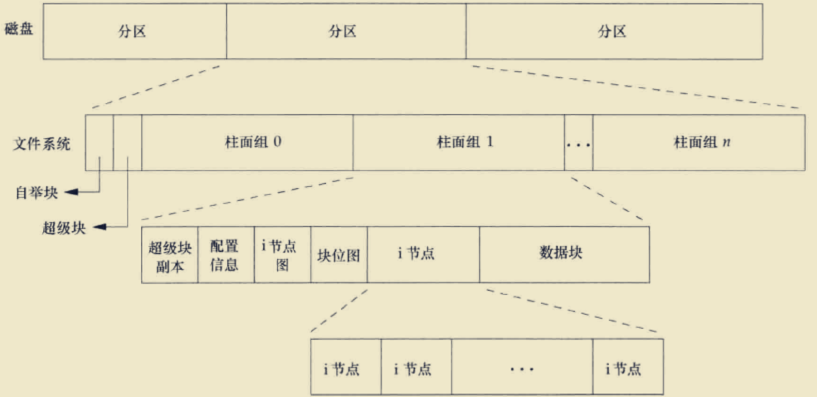

# 引言
- 在上一章(<font color=deeppink>系统IO</font>)的学习中,从最开始的用户使用的角度切入, 介绍了系统提供的几个基本的IO函数:
    - open
    - read
    - write
    - lseek
    - close
    
<br/>
    
> 这几个函数主要是对<font color = deeppink>文件内容</font>进行IO操作, 在对这几个函数作出探讨前, 先简单介绍了文件描述符是什么 概念, 标准的输入输出, 然后相继介绍了这几个函数的用法, 中间也穿插了一些额外的内容(<font color=green>进程,锁,线程,同步,文件状态等</font>). 当然这也远远不够用户在实际使用中所要用的功能 

<br/>

- 本章将从unix文件系统的架构来稍微深入学习另外相关的文件操作函数, 这些包括了前面提到的 <font color=deeppink> 文件亚数据</font>的操作, 怎么在代码中赋于新文件的权限, 怎么通过文件系统的体系架构来理解文件权限的本质含义</font>(<font color=green> 这将更有助于理解shell中用户权限操作相关的命令</font>)

<br/>

- 本章学习的模式不会仅仅停留在单调的代码层面, 会更加贴合实际的从shell的操作来结合代码, 这样会更加形象

<br/>

---

<br/>

## 文件属性
- 白话就是文件<font color = deeppink>本身的数据信息</font>. 本人建议在这里将<font color = deeppink>文件属性</font>的信息和文件存储的<font color = deeppink>用户数据</font>分开, 本人也称为<font color = deeppink>文件的元数据(`这有点类比OOP编程中类和实例的概念`)</font>, 也可以称为 <font color=deeppink>亚数据</font>


> <font color = red>注意这个图啥也不是, 是本人在逻辑上区分出来的. 真正的文件系统的图, 会在后面学习时给出来</font>

<br/>


- 文件元数据包括了以下几个基本内容
    - 文件类型
    - 文件所有者,所有组, 以及相关的权限描述
    - 文件所处的文件系统
    - 文件在内核中的编号(<font color=green> i-node</font>)
    - 文件的内容的修改时间, 文件属性的修改时间, 文件的访问时间
    - 该文件当前最佳的IO大小
    - 文件被分配的磁盘块数量 
> 上述这些内容, 对于没接触系统编程的用户角度来看, 的确有几个是必须的(<font color = green>如文件磁盘大小,时间等</font>), 其他的<font color = green>如编号,IO大小等是辅助性</font>, 后面会从这几个方面来展开

<br/>

### 文件??
- 在开始讨论前, 这里先细说一下文件在unix中的抽象概念.
> 前面学习的过程中, 并没有上来就将<font color = deeppink>unix中的哲学---一切旨文件</font>拿出来, 是的这句话出自unix, 并不出自于<font color = deeppink>linux</font>. 以我现在的知识程度来说, 我觉得对这句话的理解有3种境界: 1. 普通用户(<font color = green>可能unix, linux都没使用过的群体</font>)大概只是从听的层面, 反正那些高大上的程序员都这样说; 2. 使用shell工作的用户(<font color = green>基本上用的是mac或linux</font>)对系统有一定程度的了解, 在linux上设备居然也是一种文件, 感觉比较新奇, 比windows高大上, 逼格挺高(<font color = green>并无说有装逼的贬低</font>); 3. 系统层面的开发者可能理解的深刻点了,这是unix设计的系统调用规范,是编程的一种架构, 随着学习的深入会有越来越深刻的体会.

<br/>


### unix中的文件类型
| 类型 | 说明 |
|  -- |  --  |
| 普通文件[^ann-rfile-type] | 这里的文件就是具体的东西了, 类比window上的txt等  |
| 目录 | 文件夹|
| 块文件 | 一种<font color = deeppink>带缓冲访问</font>的设备文件, 如磁盘(<font color=green>free BSD上没有这种文件, 用的是字符设备</font>) |
| 字符特殊文件 |一种不带缓冲访问的设备文件 |
|管道| 一种访问可能会阻塞的文件, 主要用于<font color = deeppink>一台主机上</font>进程间的通信|
|socket| 和管道一样, 但用于<font color = deeppink>不同主机上</font>进程间的通信|
|符号链接|有<font color = deeppink>硬链接和软链接</font>, `软`链接相当于windows上的快捷方式|

<br/>


### 普通文件(<font color=green>regular file</font>)
- 这是最常用的文件, 不多说了, 一般在读取这种文件时, read函数是不会阻塞的, 这种文件也会有读取结束的情况
> 需要说明一点的是, 可执行文件要有内核规定的格式. 这里有2种情况: 1. 会话登录时, 内核会为当前登录的用户指定一个C程序(<font color = green>绝大部分是shell程序</font>); 2. 已经在命令行中, 通过shell来执行相关的可执行文件时, shell必须知道这个可执行文件是什么类型的可执行文件(<font color = green>如shell脚本, python脚本或C++,C语言的程序文件</font>), 所以一般脚本文件的第一行都是`#!/bin/shell`或`#!/bin/python`, 这就是告诉shell要用哪个程序来来解释当前这个脚本. 其他的可执行文件会当作内核已经编译好的二进制文件直接调用相关的exec函数,由内核处理

```shell
# 可以为 一个用户指定 会话登录后的 程序
## 如 linux中, 为sb这个用户设置登录后的程序是 /bin/top
## 则以 root用户登录, 修改 passwd中 sb用户这一行数据的最后一项为 /bin/top
## 这样sb在登录后, 会直接在终端启动 top程序, sb用户无法调用其他的服务
### 这种场景一般是银行的操作系统中, 对职员作权限限制时, 他们只能操作相关的服务
```


</br>


### 目录(<font color=green>directory</font>)
- 它也是一种文件, 主要包含了:
    1. 目录中的文件名
    2. 这些文件名所指向的文件信息的指针
> 这里多说一点, 在目录的权限中, <font color=red>可执行表示可以通过该目录,往下一层级去搜索</font>, 这个在说后面的权限时会具体来探讨


</br>

### 块文件(<font color=green> block special file</font>)
- 主要读写对象是设备, 但读写设备时, 主要是带缓冲的访问, 即每次访问以固定的长度为单位进行
- 如磁盘
> 在free BSD中是不支持这种设备文件的, 它们全部是字符设备文件

</br>

### 字符特殊文件(<font color=green>character special file</font>)
- 主要读写也是设备, 但不提供带缓冲的访问, 每次访问的长度是可变的
> <font color = red>一般来说系统中的设备文件要么是字符文件, 要么是块文件</font>

</br>

### 管道(<font color=green> FIFO</font>)
- `FIFO`固名思义, 它有队列[^ann-fifo-0]的性质, 所以管道也具有这种特点:一端读取, 一端写入. 读取管道的时候可能阻塞, 此时会等待写入的一方在将来的某一刻写入数据
> 这里用shell来举个案例, 更形象一点
```bash
# cerat pipe
cd /tmp; mkfifo test.pipe       ## 忽略后缀, 这里只是该文件从名字上看是一个管道文件

l   test.pipe
prw-r--r--  1 liubo  wheel     0B  1  9 10:33 test.pipe
## 在zsh下, 直接l, 表示 ls -lah
### 输出的记录下, 第0个字符 p 就表示当前的文件是管道(命名管道)


# 测试1
### 1.读取管道
### 2.在另一shell中写入管道
cat < test.pipe     ### shell_code_0
                    ### 此时会阻塞在这里, 因为管道当前没有内容

### 在新的shell中, 写入这个管道
date > test.pipe
### 当写入完毕后, ### shell_code_0会解除阻塞,立即输出 date的命令结果


#######################################
#######################################
#######################################


# 测试2
### 1. 写入管道
### 2. 在另一shell中读取管道
date > test.pipe        ### 同理, 这里也会阻塞, 等待另一方写入

### 在新的shell中, 读取这个管道
cat < test.pipe         ### 因为管道中有内容, 所以这里会立即输出date的结果
```


<br/>


### 套接字(<font color=green> socket</font>)
- 这种类型的文件主要用于不同主机上的2个进程间的通信, 当然也可用于一台主机上2个不同的进程间通信, 但不有必要
- 后面有单独的一章来讨论它


</br>

### 符号链接
- 这种类型的文件主要指向另一文件, 但在unix中有2种:
    - 硬链接, 在同一文件系统中, 有文件计数器, 只有共享的计数器清零后,文件才会真正的删除
    - 软链接, 可以在不同的文件系统中, 删除它并不会删除真正的磁盘文件, 它类比于windows上的快捷方式 
    
<br/>


### 相关函数
```cpp
#include<sys/stat.h>        // 注意这里又是另一个模块了, 不再是标准的unistd.h


int stat(const char* pathname, struct stat* buf);
int fstatat(int fd, struct stat* buf);
int lstat(const char* pathnam,struct stat* buf);
int fstatatat(int fd, const char* pathname, struct buf, int flag);


// 所有的4个函数的返回值, 若成功返回0, 若出错返回-1, 并设置errno
```
> <font color=red>buf是成功后,文件信息填充的空间</font>

<br/>

#### lstat
- 它是和`stat`函数一样的功能, 但是当fd是一个 <font color=deeppink> 符号链接</font>时, 它能获取到 <font color=deeppink> 符号本身的信息</font>,而不是指向的文件的信息

#### fstatat
- 这个函数像极了以遇到过的`opetat`, 所以它的fd参数也是一样的功能
    - 当fd为`AT_FDCWD`时, 函数的功能和stat一样, 但它比stat有个额外的功能-- <font color=deeppink> 可以用flag指定是获取符号链接本身的信息还是它指向的文件的信息</font>
        - 当`flag == AT_SYMLINK_NOFOLLOW`时, 获取的是符号本身的信息
        - 当`flag == AT_SYMLINK_FOLLOW`时, 获取的是指向的文件的信息
        
    <br/>
        
    > 可以自己man一下, 具体定义在fcntl.h中, 本人从xcode的头文件中找到的, 这里总结到这里

<br/>

### 文件信息的结构(`struct stat`) <a id = "id-stat-info"></a>
- 在apue的书上, 给出一了个结构, 但书籍中也说了, 这个结构并不是标准的, 不同的系统在实现中 , 结构可能有点出入,  下面的图片是apue中给出的结构, 后面的结构是摘取当前系统中的数据


```shell
man fstatatat         # 查看相关的定义
```
```cpp
struct stat { /* when _DARWIN_FEATURE_64_BIT_INODE is NOT defined */
     dev_t    st_dev;    /* device inode resides on */
     ino_t    st_ino;    /* inode's number */
     mode_t   st_mode;   /* inode protection mode */
     nlink_t  st_nlink;  /* number of hard links to the file */
     uid_t    st_uid;    /* user-id of owner */
     gid_t    st_gid;    /* group-id of owner */
     dev_t    st_rdev;   /* device type, for special file inode */
     struct timespec st_atimespec;  /* time of last access */
     struct timespec st_mtimespec;  /* time of last data modification */
     struct timespec st_ctimespec;  /* time of last file status change */
     off_t    st_size;   /* file size, in bytes */
     quad_t   st_blocks; /* blocks allocated for file */
     u_long   st_blksize;/* optimal file sys I/O ops blocksize */
     u_long   st_flags;  /* user defined flags for file */
     u_long   st_gen;    /* file generation number */
 };

 // 注意上面的结构是在宏(_DARWIN_FEATURE_64_BIT_INODE)没有定义时的结构
 // 若定义了这个宏, 则结构的又长这样:

 struct stat { /* when _DARWIN_FEATURE_64_BIT_INODE is defined */
     dev_t           st_dev;           /* ID of device containing file */
     mode_t          st_mode;          /* Mode of file (see below) */
     nlink_t         st_nlink;         /* Number of hard links */
     ino_t           st_ino;           /* File serial number */
     uid_t           st_uid;           /* User ID of the file */
     gid_t           st_gid;           /* Group ID of the file */
     dev_t           st_rdev;          /* Device ID */
     struct timespec st_atimespec;     /* time of last access */
     struct timespec st_mtimespec;     /* time of last data modification */
     struct timespec st_ctimespec;     /* time of last status change */
     struct timespec st_birthtimespec; /* time of file creation(birth) */
     off_t           st_size;          /* file size, in bytes */
     blkcnt_t        st_blocks;        /* blocks allocated for file */
     blksize_t       st_blksize;       /* optimal blocksize for I/O */
     uint32_t        st_flags;         /* user defined flags for file */
     uint32_t        st_gen;           /* file generation number */
     int32_t         st_lspare;        /* RESERVED: DO NOT USE! */
     int64_t         st_qspare[2];     /* RESERVED: DO NOT USE! */
 };
```
<br/>

> 可以看出, apue中定义的结构, 在当前系统上大部分都有, 这里就以书本上的来依次说.
> <font color=red>在系统定义的结构中,可以看到很多在c语言中没见过的类型, 要么是typedef出来的, 要么是define出来的, 但在其实在系统层面, 它为了效率一般都会是整型,因为计算机就喜欢整数</font>. 以1个简单的例子来说明一下这个情况

<br/>

#### case-stat中的类型
> 以stat结构中的`st_gen`来说
```cpp
#include<unistd.h>
#include<sys/stat.h>
#include<iostream>
#include<type_traits>
using namespace std;

int main(void){
    struct stat sta;
    auto res = stat("b.txt", &sta);
    if(res < 0){
        perror("stat");
        return -1;
    }


    // 如上在所说的, 如果定义了这个宏, 那sta.st_gen的类型就是u_long
#ifdef _DARWIN_FEATRUE_64_BIT_INODE
    // 定义了这个宏, sta.st_gen成员的类型才是u_long
    cout << typeid(sta.st_gen).name() << endl;
    cout << typeid(u_long).name() << endl;


    // 没有定义这个宏, 则类型是uint32_t
#else
    cout << typeid(sta.st_gen).name() << endl;
    cout << typeid(uint32_t).name() << endl;
#endif
    // MARK: typeid后输出的名是编译器自己定的
    ///// 同样的类型可能windows上用VS输出的结果是不一样的

    // 判断一下sta.st_gen的类型是不是 整型
    cout << is_integral<decltype(sta.st_gen)>::value << endl;

    return 0;
}
```

<br/>

> 当前案例中用到了cpp中的type-traits, 利用编译器来做编译时的类型判断, typeid不是函数, 是编译器的操作符,可以类比sizeof, 输出的name是当前编译器自己定义的对应类型的编码字符串, is_integral是用来判断当前指定的类型是不是整型, 当前打印的结果是1, 说明st_gen的类型是整型

<br/>

#### stat结构在POSIX中的定义
- POSIX.1未要求有`st_rdev, st_blksize, st_blocks`字段, 但 Single UNIX Specification XSI扩展了它们
- timespec定义的是秒和纳秒的结构体
    ```cpp
        time_t tv_sec;      // 秒
        time_t tv_nsec;     // 纳秒
    ```
- 这里面没见过的类型, 都是基本系统的数据类型, 如上面说的, 计算机喜欢大整数

<br/>

## 数据结构-`struct stat中st_mode`
### 获取文件类型
- 我们在终端下经常使用的<font color = deeppink>ls</font>它就是调用stat相关的函数来实现展示的.相应的 <font color=deeppink> shell中也有一个同名的命令stat, 它的功能就是函数的功能</font>  文件类型相关的信息存储在`st_mode`成员中, 因为它是1个整数, 内核一般用位操作来实现, 所以可以利用下面的宏来位操作后判断类型:
    
| 宏 | 文件类型 |
|  :-  |  :-  |
| `S_ISREG()` | 普通文件 |
| `S_ISDIR()` | 目录文件 |
| `S_ISCHR()` | 字符特殊(<font color=green>也可称为字符设备</font>)文件 |
| `S_ISBLK()` | 块设备文件 |
| `S_ISFIFO()` | 管道或FIFO |
| `S_ISLNK()` | 符号链接 |
| `S_ISSOCK()` | 套接字 |
    
> 这里需要注意的是, 在这些文件类型中 <font color=red> 管道, 套接字</font>是进程间通信用到的文件(<font color=green>如上面的</font>), 其中管道可以认为是消息队列的一种, 同时还有信号量, 这些都可以说明为文件, 当文件用于进程间通信时, 还要进一步知道是什么类型的通信文件, 则需要 <font color=red> stat的指针传递给下面的宏</font>

| 宏 | 对象的类型 |
|  :- |  :-  |
| `S_TYPEISMQ()` | 消息队列 |
| `S_TYPEISSEM()` | 信号量 |
| `S_TYPEISSHM()` | 共享存储对象 |

> 注意, apue书中说, 它们在某些系统上不是文件

<br/>

 
### case-shell中查看当前文件的类型
- 可以用`ls`命令, 也可以用`stat`
```shell
mkdir dir1
touch a.txt
mkfifo c.pipe                   # 管道
ln -s a.txt ref-a               # 软链接,指向的是普通文件a.txt
ln -s dir1 ref-dir1             # 软链接,指向的是目录文件dir1


l           # zsh中直接使用l
total 0
drwxr-xr-x   5 liubo  wheel   160B  1 11 17:06 .
drwxrwxrwt  10 root   wheel   320B  1 11 17:06 ..
-rw-r--r--   1 liubo  wheel     0B  1 11 17:06 a.txt
prw-r--r--   1 liubo  wheel     0B  1 11 17:06 c.pipe
drwxr-xr-x   2 liubo  wheel    64B  1 11 17:06 dir1
lrwxr-xr-x   1 liubo  wheel     5B  1 11 17:15 ref-a -> a.txt
lrwxr-xr-x   1 liubo  wheel     3B  1 11 17:15 ref-dir1 -> dir1

## 输出时最开始的字符代码的就是文件类型
### d表示目录文件(directory)
### -表示普通文件(regular)
### p表示管道文件(pipe)
### l表示符号链接文件(symbol link)
```
> 下面用程序来测试一把, 需要说明一点的是, 当前程序名是main, 它也会在当前目录下书写, 编译, 因为makefile会生成lldb调试文件, 所以当main编译成功后会多出3个文件`main main.cpp main.dSYM`
```cpp
#include<unistd.h>
#include<fcntl.h>
#include<sys/stat.h>
#include<sstream>           
#include<iostream>           
using namespace std;

int main(int args, char** argv){
    if(args < 2){
        cerr << "usage xxx <path1> <path2> <path3> ...\n";
        return -1;
    }

    struct stat sta_buf = {0};

   // 复用的缓冲区
   ostringstream log_buf(std::ios::app);                                                                // __code_0
   
    auto lambda = [&sta_buf, &log_buf](const char* path) throw(decltype(nullptr)) -> void{              // __code_1
        if(nullptr == path){
            throw nullptr;
        }

        log_buf << path << ' ';

        if(S_ISREG(sta_buf.st_mode)){
            log_buf << "type is regular\n";
        }else if(S_ISDIR(sta_buf.st_mode)){
            log_buf << "type is directory\n";
        }else if(S_ISCHR(sta_buf.st_mode)){
            log_buf << "type is character special\n";
        }else if(S_ISBLK(sta_buf.st_mode)){
            log_buf << "type is block special\n";
        }else if(S_ISFIFO(sta_buf.st_mode)){
            log_buf << "type is pipe\n";
        }else if(S_ISSOCK(sta_buf.st_mode)){
            log_buf << "type is socket\n";
        }else if(S_ISLNK(sta_buf.st_mode)){
            log_buf << "type is symbolic link\n";
        }else {
            log_buf << "unknow mode\n";
        }
        cout << log_buf.str();
        log_buf.str("");
        log_buf.clear();
    };


    while(--args){
        auto file_path = argv[args];
        
        if(stat(file_path, &sta_buf) < 0){                                                              // __code_2        
            perror("stat");
            continue;
        }


        try{
            lambda(file_path);
        }catch(decltype(nullptr) e){
            if(e == nullptr){
                cerr << "err-->null\n";
            }else{
                cerr << "err-->other\n";
            }
        }

        __builtin_memset(&sta_buf, 0, sizeof(struct stat));                                             // __code_3

    }
    return 0;
}
/**
    程序的功能
        通过命令行传递的文件, 来判断这个文件的类型

        需要说明的是, 这里不会打印出第0个命令行参数, 其实第0个参数是当前进程可执行文件的路径
        所以没有必要打印出来, 外界传递什么文件, 就打印什么文件类型


    语法说明
        当前程序用了c++比较深入的代码, 如lambda, ostringstream, try-catch等

        __code_0:
            就理解为可变长的字符串,  log_buf << xxx, 相当于将xxx追加到字符串后
            cout << log_buf.str()无参的是获取字符串, 由cout输出这个结果

            因为每次调用lambda, 都是新的信息, 所以在lambda内, 最后打印完毕, 要清空log_buf以供下次使用不出问题
            但log_buf清空字符串有个坑, log_buf.clear() 并不是清空内部的字符串, 它是清空错误标记, 真正清空的操作是
            log_buf.str(""), 这个函数没有返回值

        
        __code_1:
            c++的lambda表达式, 可以理解为函数指针, 但在c++中可以在内部写入这种表达式, 但根据语法规则
            要想在lambda内部使用到外部变量, 必须在 [] 内引用它们, 语法就是 &log_buf 等
            这里不多说了

        __code_2:
            这里使用的函数是 stat, 根据上面的函数介绍, stat函数中若路径下的文件是符号链接, 则获取的是链接指向的文件信息, 下面的测试可以看出
            若这里使用lstat,则对应的获取的是符号链接本身的信息, 自己可以测试一下


        __code_3:
            这里 调用了 clang编译器的内置函数, 很像标准库中的memset,不错. 在clang中有很多内置函数都是以 __builtin_xxx 开头的用于区分标准库函数, 它们的
            作用是 让编译器在当前位置展开代码(内联一样, 但要看编译器做不做内联), 可能clang内置的对应标准库的函数效率要高一点
            正确的做法应该先用宏判断当前编译器支不支持这种调用, 这里就不说了
*/
```
> <font color=red> 测试过程</font>
```shell
## 查看当前目录下所有的文件
ls -lah
total 120
drwxr-xr-x  10 liubo  wheel   320B  1 11 19:43 .
drwxrwxrwt  10 root   wheel   320B  1 11 19:36 ..
-rw-r--r--   1 liubo  wheel     0B  1 11 17:06 a.txt
prw-r--r--   1 liubo  wheel     0B  1 11 17:06 c.pipe
drwxr-xr-x   2 liubo  wheel    64B  1 11 17:06 dir1
-rwxr-xr-x   1 liubo  wheel    53K  1 11 19:43 main
-rw-r--r--   1 liubo  wheel   1.8K  1 11 19:43 main.cpp
drwxr-xr-x   3 liubo  wheel    96B  1 11 18:02 main.dSYM
lrwxr-xr-x   1 liubo  wheel     5B  1 11 17:15 ref-a -> a.txt
lrwxr-xr-x   1 liubo  wheel     4B  1 11 19:18 ref-dir1 -> dir1
### 可以看到, 当前目录下所有的文件


### 测试1, 只查看当前目录下非隐藏文件
ls | xargs .main                            # __shell_xarg

ref-dir1 type is directory
ref-a type is regular
main.dSYM type is directory
main.cpp type is regular
main type is regular
dir1 type is directory
c.pipe type is pipe
a.txt type is regular

#### __shell_xarg 利用了 ls 命令, 它只显示出所有的文件名,不会附加其他信息
#### 所以这非常适合 xargs 将所有的文件名打包成命令行参数传递给我们的程序


### 测试2, 只查看原来的文件(即除了程序相关的3个mainxxx文件)
find . -maxdepath 1 ! -name "main*" | xargs ./main         # __shell_find
./dir1 type is directory
./ref-a type is regular
./ref-dir1 type is directory
./a.txt type is regular
./c.pipe type is pipe
. type is directory

#### __shell_find 下的命令是:
####### 在当前目录查找出 除main相关的文件, 深度最多1层(不递归)
####### 事实上找的是 上面所说的5个原文件以及当前目录(".")
####### 再用xargs将找到的文件名打包成命令行参数给 main程序
```
> 上面测试的输出是用 <font color=red>stat函数 </font>, 若改用 <font color=red>fstat</font>, 则对应的输出会是链接文件本身的信息

<br/>


### 文件类型的真正实现
- apue中说到这一点
```cpp
#define S_ISDIR(mode)  (((mode) & S_IFMT) == S_IFDIR)

// 这一点也可以从man手册上找到, 但本是这里借助的是xcode, 更直观一点, 下面是截图
```


<br/>


## 权限(shell层面来看)
> 虽然这里学习的是apue, 但为了对权限讲解更形象, 这里要先从应用层shell的角度来看待unix的权限, 这样会比较直观(<font color = green>不会深入,有基础的伙伴可以跳过</font>)<font color=red>因为当前mac上没有useradd等unix下熟知的命令,所以这里连1个centos的系统来做演示</font>

<br/>

### 用户和组
- unix是多用户的操作系统(<font color=green> 当然也是多任务的</font>), unix为了高效合理的管理用户, 做了一套权限体系. 在unix中 <font color=deeppink> 用户之间是隔离的, 从文件系统上来看一个用户独立一个自己的目录</font>, 因为权限机制, 一般情况下不同用户之间是不允许交互的, 但在实际场景中, 用户之间不可能完全独立, 所以又有了组的概念, 组的存在使得不同用户可以在适当的情形下进行交互

<br/>

#### 用户的分类
- unix中对某用户放开了所有的权限, 这种用户就是 <font color=deeppink> 超级管理员,也常称为root</font>, 相对的, 被限制了权限的用户则为 <font color=deeppink> 普通用户</font>,在linux中还有一种系统用户, 但事实上可以归类为普通用户
> unix中只能有1个root用户,其他普通用户可以任意个

<br/>

#### 添加用户 
- 基本的命令
```txt
1. useradd 用户名

    功能:
        创建一个普通用户

    家目录:
        会在 /home 目录下生成一个与用户名一样的目录作用为该用户的家目录

    


2. useradd -d 家目录 用户名
    
    功能:
        同上

    家目录:
        同上, 但名字是创建时指定 -d 后的参数值
```
> 演示<a id="link-creat-user-0">添加用户</a>
```shell
useradd user_zs         
### 该命令未指定家目录, 但unix会在home下生成 /home/user_zs


useradd -d lisi-home lisi       # error
# 上面这条指令错误, 本来是想创建lisi, 并指定家目录是 lisi-home
### 但该命令要求 -d后的值是一个 绝对路径, 所以应该改为
useradd -d /home/lisi-home lisi
```

<br/>

#### 用户密码
- [前面](#link-creat-user-0)在创建用户后, 可以直接登录, 因为没有设置密码, 所以这里来设置一下密码`passwd 用户名`
> 需要说明的是 passwd任何用户都可以用,不同的是当前用户是没有权限为指定的用户名设置密码. 若不指定用户名直接回车, 输入密码后就是为当前用户所设置密码

```txt
    测试步骤:
        1. 查看当前用户
        2. 若不是root, 则切换到root
        3. 设置 lisi的密码
        4. 退出root,回到之前的用户
        5. 在当前用户下登录lisi
```


<br/>

#### 删除用户
- 删除用户时, 有2种
    - 删除与用户相关的资源(<font color=green> 包括家目录,邮件目录等</font>)
    - 只删除用户, 不删除家目录
> 只有root可以执行删除用户的操作
```txt
    userdel 用户名  
        这种删除 会保留家目录

    userdel -r 用户名
        连同家目录一起删除 
```

#### 查询用户的信息
```text
    id 用户名
        若用户不存在, 则返回无此用户

    所有的用户都可以调用这个命令

```
```shell
echo $USERS             # 查看当前登录的用户
liubo                       
id liubo                # 自己查询自己的信息
uid=1000(liubo) gid=1000(liubo) groups=1000(liubo)

id lisi                 # 当前liubo查询lisi
uid=1002(lisi) gid=1006(lisi) groups=1006(lisi)


id ergou
id: ergou: no such user         # 当前系统中没有这个用户
```


<br/>

### 组的概念
- 组分类对用户进行管理, 在同一个组的成员一般对文件有相同的权限


<br/>

#### 创建组
- 有2种方法创建组
    - 创建用户时, 忽略组名(<font color=green>成功后会自动创建一个新的组, 它的名字和用户名是一样的</font>,组id是系统自动生成的
    - 单独去创建组, 此过程不涉及用户的操作
    ```shell
    groupadd SB         # 创建一个傻逼组
    
    useradd sb01        ## 创建一个新用户, 成功后, 生成的组名是sb01
    ```

<br/>

#### 查看用户的组信息
- `/etc/passwd`
- `id 用户名`

```shell
id lisi
uid=1002(lisi) gid=1006(lisi) groups=1006(lisi)


### 找到lisi的组
tmp cat /etc/passwd | grep "lisi"  | xargs -d : -n 1 | sed "4p" -n
1006
### passwd的信息见下面的图
#### cat 读取passwd
#### grep 过虑出是lisi的这一行
#### xargs 以 : 切割, 每次取1(效果就是 一行被分割的字符串换成了换行取)
#### sed 取换行后的内容, 第4行表示是组, -n则取消默认输出
```


<br/>

#### 修改用户的组(主组)
```shell
id lisi
uid=1002(lisi) gid=1006(lisi) groups=1006(lisi)

groupadd SB             # 创建傻逼
sudo usermod lisi -g SB     # 这样用户lisi就被修改为别的组了
uid=1002(lisi) gid=1007(SB) groups=1007(SB)
```

<br/>

#### 主组和附加组
- 前面所说的都有用户的主组
    - 创建用户时, 指定的组(<font color = green>若未指定, 则自动生成同用户名同名的组</font>)

- 而附加组对用户来说是次要的, 删除它并不关心是否属于用户
    - 附加组可以添加任意用户, 用户被删除时附加组不会有影响

```shell
id lisi
uid=1001(lisi) gid=1008(lisi) groups=1008(lisi)
### groups就是所谓的附加组, 若有多个, 则会一一列举出来
```

<br/>

#### 对用户添加附加组
- 有3种场景
    - 新建时, 指定附加组
    - 修改用户的 附加组(<font color=green>注意修改会清空以前的</font>)
    - 增加或减少用户的 附加组

```shell
groupadd SB             ## 手动创建1个组
useradd sb -G SB        ### 创建用户时, 指定了 sb的一个附加组(SB)

id sb
uid=1001(sb) gid=1006(sb), groups=1006(sb),1005(SB) 
## 注意, 此时新的sb用户, 有2个附加组


groupadd SD             ## 再手动创建1个组
usermod sb -G SD        ## 这里是修改用户的附加组, 所以原来的 1005(SB)已经没有了, 但1006(sb)还在

id sb
uid=1001(sb) gid=1006(sb), groups=1006(sb),1007(SD) 


### sb新增加一个组
gpasswd -a sb SB
### 在前面的操作中, sb已经没有附加组1005(SB), 但这一步是添加新的附加组SB
id sb
uid=1001(sb) gid=1006(sb), groups=1006(sb),1005(sb),1007(SD) 
### 结果是新加上了, 并没有删除1007


### usermod -G时, 若想实现追加附加组, 可以用 usermod -G g1,g2,g3... 写完整


### 删除附加组 gpasswd 组 -d 用户1, 用户2, ...
```

<br/>

#### 删除组
- 删除组有2种情况
    - 主动删除
    - 被动删除

- 主动删除(`groupdel 组名`)
    - 若 <font color=deeppink>当前要删除的组是某个用户的主组</font>, 则会删除失败
        - 因为用户还在, 不能删除
    - 若 <font color=deeppink>要删除的组不是任何用户的主组, 却是某些用户的附加组, 则直接删除, <font color=deeppink>所有与该组相关的附加用户也被同时移出了这个组</font></font>
    - 上面2个都不成立, 也是直接删除组
- 被动删除
    - 删除用户时, 该用户的主组<font color = deeppink>一般</font>会同时删掉
    > 这里有一种情况: <font color=red>当创建了一个组g1, 又同时将用户的主组g0改变到这个组g1, 则删除用户时, 用户原来的组g0不会被删除, g1也不会被删除 </font>

```shell
#### 做这前先清空所有测试的组(SB,SD,sb), 以及用户(sb)
groupadd SB                 
useradd sb                  
usermod sb -g SB
userdel sb

### 最后 SB和sb这2个组都没有被删除
```


<br/>

### 文件的权限<a id = "file-permission"></a>
- 说完了用户和组, 这里就可以学习文件的权限了
- 文件是资源, 对文件的操作从用户层面来看就是
    - 读
    - 写
    - 执行(一种特殊的文件)
- 这3种基本操作对应着3类角色
    - 文件所有者
    - 非所有者,但有所属组
    - 上面2者都不是其他人
    > 每一种角色都有这3种操作

- 文件权限就是来针对这3类角色对这3种操作的限制

<br/>

#### 查看文件权限信息
```shell
ls -al file         
-rw-r--r--@ 1 liubo  staff    15K  1  2 09:47 03-01.png

## 这里权限相关的信息在 最前面的10个字符

### 第1个
###### 文件类型(-表示普通文件, d目录, l链接, p管道, c字符设备, s是socket)

### 第2~4个
###### 表示 文件所有者对应的权限
######### 第2个r-->readable             读
######### 第3个w-->writeable            写
######### 第4个"-"-->exec-noable        执行, 若可以执行, 则为x


### 第5~7个
###### 表示 文件所属组对应的权限
######### 第5个r-->readable             读
######### 第6个"-"-->writ-noable        写 这里不能写
######### 第7个"-"-->exec-noable        执行, 若可以执行, 则为x


### 第8~10个
###### 表示 其他人(非文件所有人, 非所属组)的权限
######### 第8个r-->readable             读
######### 第9个"-"-->writ-noable        写 这里不能写
######### 第10个"-"-->exec-no-able      执行, 若可以执行, 则为x


### 当前也可看到文件的所有者 liubo, 文件所属组 staff
```
<br/>

> 当前这个文件的权限所表示的:
>   - `liubo`可以`read, write`, 但不可以执行(<font color=green>它不是一个有意义的可执行文件, 前面说过可执行文件要遵循一定的格式,这里展示的文件是张图片</font>)
>   - `staff`这个组内的所有用户, 只能`read`
>   - `其他用户`也只能读


<br/>

#### rwx对应的数字
- rwx是可读性比较好的,shell提供了数字来管理. 因为 <font color = deeppink> rwx的一个操作最多有8种情况, 刚好可以有八进制来表示</font>

- `0`: `---`<font color=deeppink>没有任何权限</font> 
- `1`: `--x`<font color=deeppink>只执行</font>
- `2`: `-w-`<font color=deeppink>只写</font>
- `3`: `-wx`<font color=deeppink>写,执行</font>
- `4`: `r--`<font color=deeppink>只读</font>
- `5`: `r-x`<font color=deeppink>读,执行</font>
- `6`: `rw-`<font color=deeppink>读写</font>
- `7`: `rwx`<font color=deeppink>读写和执行</font>
    
> 在表示时不用写八进制的前缀, 直接写数字, shell命令会认识的

<br/>

#### 3种角色对应的字母
| 角色 | 字母 |
|  ----  |  ----  |
| a | 同时指3种角色  |
| u | 文件<font color=deeppink>第1角色</font>所有者  |
| g | 文件<font color=deeppink>第2角色</font>所有组  |
| o | 文件<font color=deeppink>第3角色</font>其他  |


#### 修改文件的权限
- 可以使用字母(`[a, u, g, o] [+, -, =], [r, w, x]`)
- 可以使用数字(`[0~7][0~7][0~7]`)
```shell
# b.txt  sb(所有者)  sb(所属组)   rw-r--r--

chmod u=rwx  b.txt               # 修改文件 所者的权限是 rwx

# 还原
chmod u+x b.txt                  # 添加文件 所有者的权限 x

# 还原
chmod u-w b.txt                 # 在原来的权限里去掉 所有者的w

# 还原
chmod g+w b.txt                 # 添加文件 所有组的权限是 w

# 还原
chmod g-r b.txt                  # 在原来的权限里去掉 所有组的r

# 还原
chmod o+w b.txt                  # 添加文件 其他角色的w


# 还原
chmod a-r b.txt                # 同时指定所有角色, 删除他们的r权限


# 还原
chmod u=rw,g=r,o=r b.txt       # 同时对3种角色指定不同的权限


############# 使用数字
# 还原
chmod 777 b.txt                 # 统一对所有角色设置 rwx 
chmod 644 b.txt                 # u=rw-     g=r--   o=r--                 
```

<br/>


#### 修改文件的所有者\组<a id="chown-id-0"></a>
- 文件的所有者和所有组也可以修改
```txt
chown new-user 文件(包括目录)
    改变文件的所有者

chown new-user:new-grp 文件(包括目录)
    改变文件的所有者和所有组
    
ps: -R 针对目录, 其目录下所有子文件全生效(递归)


chgrp new-grup 文件(包括目录)
    改变文件的所有组, 它也有上面-R的功能
```

<br/>

#### 目录的权限
- 目录的权限这里只简单的总结一下, 它比较特殊, 这里只说明它所代表的意义

| 权限 | 意义 |
|  ----  |  ----  |
| r | 可以读取目录(<font color=green>获取该目录下的文件列表</font>) |
| w | 可以修改目录(<font color=green>可以添加或删除该目录下的文件</font>) |
| x | 可以通过该目录(<font color=green>进入到目录的子级目录</font>) |

> 目录的权限将在后面的unix中详情来学习

<br/>

### shell结束, 一个问题(抛砖引玉)<a id="shell-ques-0"/>
- 结合前面的shell的基本学习, 来看一个奇怪的现象
```txt
    passwd 
        该命令的功能用来为用户设置密码
        所有的用户都可以执行这条命令
        但该程序一定会向 /etc/passwd 或/etc/shadow 这个文件写入内容 

    问题:
        /etc/passwd 对应的权限是  rw- r-- r--   root(用户) root(组)
        /etc/shadow 对应的权限是  --- --- ---   root(用户) root(组)
            shadow文件甚至都不让用户看
            
            这意味着, 只有root才能写这2个文件

        
        那么对于普通用户来说, 调用passwd成功后, 它一定修改了这2个文件, 至少修改了shadow
        为什么普通用户 调用passwd, 最终修改了 完全无任何权限的shadow文件?

        首先unix肯定不会做特殊化, 专门对单个 /etc/shawdow 来搞一个特殊, 它是操作系统, 是世界上最复杂的软件天花板之一, 它肯定不会随意改已经成型的权限系统,这个答案后面会站在unix进程的层面来说明这个问题
```

<br/>

## 进程相关的ID
> 进程是由存储在磁盘上的可执行文件启动后产生的, 所以从本质上来看 <font color=red>进程也是有权限限制的, 即用户对这个可执行文件有执行权限</font>, 当产生进程后, 进程本身也会在代码中打开其他文件, 此时必须遵守unix的权限机制, 所以运行的进程必须在被启动时,记录下自己当前是谁(`谁打开了我`), 然后代码中调用相关的文件操作函数时, 内核会根据当前进程是谁, 来检查该进程对文件是否有对应操作的权限
> 上面这句话有点拗口, 但这是从内核实现权限机制来看的, 前面在shell中所涉及到的不同用户对文件操作时所被限制的原理, 也是这样
```shell
# sb创建了文件 /tmp/sb.txt  sb(所有组) rw- r-- ---
# ergou想 读 sb.txt
ergou$ cd tmp ; cat sb.txt
## 失败, 没有权限

### 这里的cat内部在执行时, 也是上面所说的原理 

### 1. cat被shell exec
### 2. cat内部记录下 自己是 ergou
### 3. cat内部调用open函数时, open函数(内核)发现当前进程是ergou, 对sb.txt作
###### 权限检查, 发现 ergou 对该文件没有任何权限, 所以直接报错返回

##### ps: shell这个程序的本身记录的也是 ergou这个用户 
##### ergou登录到unix时, unix从口令文件(/etc/passwd/)帮助ergou创建出shell这个程序, 并将 ergou相关的id信息给了shell
##### shell在以后的交互中, 在exec其他的进程时, 也会继续传递 ergou
###### 所以一般情况下, 进程记录自己是谁基本就是当前登录到unix这次会话的用户, 特殊情况下,后面说
```

<br/>

### 设置用户ID和设置组ID
- 上面简单分析了一个进程在启动时, 为了权限检验, 自己会记录相关的用户, 但事实上内核在实现权限时, 进程往往记录的用户信息绝不是简单的会话[^ann-session-0]用户信息

- 一个进程在启动后, 往往关联的id有6个或更多

| ID | 说明 |
|  ----  |  ----  |
| 实际用户ID,实际组ID | 实际上是谁 |
| 有效用户ID,有效组ID,附属组ID | 作权限校验 |
| 保存的设置用户ID, 保存的设置组ID | 由exec保存 |

<br/>

#### 实际ID
- 这2个ID是用户登录到unix中, 当前会话的ID, 是从 <font color=deeppink> 口令文件</font>(`/etc/passwd`)中取到. 通常在整个会话期间不会改变(<font color=green> root用户进程可以改变</font>).

<br/>

#### 有效ID([问题](#shell-ques-0))
- 主要做文件权限检查. 在当前进程的代码内部操作文件时, 内核通过这个id来作权限校验

- 它的值一般和实际ID对应(<font color=green> 注意是一般情况下</font>), 它可能不和实际ID一样

```txt
    每个文件有一个所有者和组所有者, 所有者由stat结构中的st_uid指定,所有组则由st_gid指定

    当执行一个文件时, 进程的有效用户ID通常就是实际用户ID, 有效组ID通常是实际组ID.这是一般情况下

    当文件模式中(st_mode)中可以设置一个 标志
        标志目的是:
            当执行此文件时, 将进程的 有效用户ID 设置为 文件所有者ID

    当文件模式中(st_mode)中也可以设置另一个标志
        这个标志的目的是:
            当执行此文件时, 将进程的 有效组ID 设置为 文件所有组ID
            
    这2个标志就是所谓的 设置用户ID 和 设置组ID, 它们是2个位

    在前面的shell中并没有提到这些内容, 但事实上 设置id位也是整个权限中的一部分


   
   注意这里的变身:
        是 文件本身的信息中, 已经被设置了这2个设置ID位, 它们已经是文件信息的一部分
        并不是说在代码中对获取到的stat的st_mode去设置好它们
    

   所以当进程真的被exec后, 它的有效id为文件的所有者id, 那就可以做权限越位操作
   试想, 一个普通的用户在执行一个程序文件时, 该文件有设置id位, 当程序运行后
   该程序的 有效id为文件的所有者, 当文件所有者是root时, 那在程序中就变成了root,
   这样进程在运行中, 就有了root的权限, 它可以改任何东西

   所以前面shell抛出的问题在这里就有了答案, 具体说一下流程:
    
    假如文件的所有者是root, 并且 设置了 passwd的 的设置id位(如下图)
```


```txt
    所以 当前进程(shell), 实际是一个普通用户在调用passwd后, 会将有效id设置为root
    于是就是了权限, 可以对 /etc/passwd /etc/shadow 这2个文件进行写入
```

<br/>

#### 在shell下启用文件的设置ID位
```shell
chmod u+s  xx.txt       # 对xx.txt设置id位, 该文件必须是一个可执行文件
```

<br/>

#### 代码中测试文件是否设置了ID位
- 这2个位的判断包含在`st_mode`中
    - `S_ISUID`
    - `S_ISGID`

<br/>

#### case-测试设置ID功能
> 本程序在 <font color=green>centos中测试</font>
> 2个用户
>   - root
>   - tierry(<font color=green>普通用户</font>)
> 测试流程
```txt
    1. 登录 root
    2. 创建2个文件
        /home/tierry/tmp/main       rwx r-x r-x     root    root
        /home/tierry/tmp/a.txt      rw- r-- r--     root    root
        main的功能是向 a.txt写入内容(hello)

    4. 切换用户 tierry
    5. cd ~/tmp/code
    6. 执行 ./main a.txt            执行main程序
        - 查看执行结果
    7. 查看a.txt的内容


    第6步已经失败, 第7步查看的内容是空


    8. 切换 root, 并 cd /home/tierry/tmp
    9. 对文件 main 添加设置ID位 
        chmod u+s main
    10.切换tierry, 并 cd ~/tmp
    11.执行程序
        ./main a.txt
    12.查看a.txt的内容
```
> 相关的c代码

```cpp
#include<iostream>
#include<unistd.h>
#include<fcntl.h>

using namespace std;

int main(void){
	auto fd = open("a.txt", O_RDWR);
	if(fd < 0){
		perror("open");
		return -1;
	}

	if(write(fd, "hello", 5) != 5){
		perror("write");
		return -1;
	}
	return 0;
}
```
> 测试步骤就是上面的12步

<br/>

#### 查看文件设置ID位的信息
> 在 <font color=red> centOS环境下编写</font>
```cpp
#include<fcntl.h>
#include<unistd.h>
#include<sys/stat.h>
#include<iostream>
#include<bitset>


int main(int args, char** argv){
	if(args != 2){
		std::cerr << "usage xxx process-filepath\n";
		return -1;
	}
	auto fd = open(argv[1], O_RDONLY);
	if(fd < 0){
		perror("open");
		return -1;
	}
	struct stat buf;
	auto info = fstat(fd, &buf);
	if(info < 0){
		perror("fstat");
		return -1;
	}
	std::cout 	<< "s_uid flag:"
			<< std::bitset<sizeof(S_ISUID)*8>(S_ISUID)
			<< std::endl;

	std::cout 	<< "s_gid flag:"
			<< std::bitset<sizeof(S_ISGID)*8>(S_ISGID)
			<< std::endl;

	std::cout 	<< "f_mod flag:"
			<< std::bitset<sizeof(buf.st_mode)*8>(buf.st_mode)
			<< std::endl;

	std::cout << argv[1] << ' ' << ((buf.st_mode & S_ISUID) ? "is set uidflag\n" : "no set uidflag\n");
	std::cout << argv[1] << ' ' << ((buf.st_mode & S_ISGID) ? "is set gidflag\n" : "no set gidflag\n");
	return 0;
}
```

<br/>

> 测试结果 <a id = "st-flag-uidset"></a>
```shell
[tierry@localhost code]$ ls -alh /bin/passwd
-rwsr-xr-x. 1 root root 28K 4月   1 2020 /bin/passwd
[tierry@localhost code]$ ./cat-passwdprocess /bin/passwd
s_uid flag:00000000000000000000100000000000                     # 为1的位表示S_ISUID的标志
s_gid flag:00000000000000000000010000000000                     # 为1的位表示S_ISGID的标志
f_mod flag:00000000000000001000100111101101                     # 当前st_mode的各个标志
/bin/passwd is set uidflag
/bin/passwd no set gidflag
```
> <font color=red> 关于代码中biset的使用, 这里为了方便, 将 `S_ISUID, S_ISGID, 文件mode`以二进制的格式打印出来, 显得更直观</font>

<br/>

> 这里说一点, 怎么快捷的将linux中的文件内容传递过来, 主要是利用nc
> <font color = red>最好是当前mac作临时服务器, 远程linux作客户端</font>, 步骤:
>   1. mac上`nc -v -l 1994`
>   2. linux上`nc -v  mac的ip地址 1994`
>       具体的命令(在linux中)`nc -v 192.168.1.4 < cat-passwdprocess.cpp`
>       ps: 这个ip地址瞎写的
>   3. 回到mac, 文件内容已经在控制台


<br/>

## 文件访问权限(`文件系统层面`) [shell介绍过](#file-permission)
- 文件的<font color = deeppink>权限有3种</font>, 针对着<font color=deeppink> 3种角色</font>. 它们被记录在文件信息里(`st_mode`)

### 数据标志常量
| 屏蔽位[^ann-stmode-shielding] | 含义 |
|  ----  |  ----  |
| `S_IRUSR` | 所有者读  |
| `S_IWUSR` | 所有者写  |
| `S_IXUSR` | 所有者执行  |
| `S_IRGRP` | 所有组读  |
| `S_IWGRP` | 所有组写  |
| `S_IXGRP` | 所有组执行  |
| `S_IROTH` | 其他读  |
| `S_IWOTH` | 其他写  |
| `S_IXOTH` | 其他执行  |

> 这些宏的定义在`<sys/stat.h>`

<br/>

#### 权限位对比
```cpp
#include<fcntl.h>
#include<unistd.h>
#include<sys/stat.h>
#include<iostream>
#include<bitset>

template<typename _N>
static void st_print(_N num, const char* pre){
	std::cout 	<< pre << " flag:"  
			<< std::bitset<sizeof(_N)*8>(num) 
			<< std::endl;
}

int main(int args, char** argv){
	auto fd = open(argv[1],O_RDONLY);
	// if error
	//
	struct stat buf;
	auto info = fstat(fd, &buf);
	if(info < 0){
		perror("fstat");
		return -1;
	}
	st_print(S_IRUSR, "read(IRU)\t");
	st_print(S_IWUSR, "write(IWU)\t");
	st_print(S_IXUSR, "exec(IXU)\t");

	st_print(S_IRGRP, "read(IRG)\t");
	st_print(S_IWGRP, "write(IWG)\t");
	st_print(S_IXGRP, "exec(IXG)\t");


	st_print(S_IROTH, "read(IRO)\t");
	st_print(S_IWOTH, "write(IWO)\t");
	st_print(S_IXOTH, "exec(IXO)\t");

	st_print(buf.st_mode, "file(mod)\t");
	return 0;
}
```

<br/>

> /st-mode-shielding /bin/passwd          # 该程序是 st-mode-shielding
```shell
read(IRU)	 flag:00000000000000000000000100000000      # 第9位 user-read
write(IWU)	 flag:00000000000000000000000010000000      # 第8位 user-write
exec(IXU)	 flag:00000000000000000000000001000000      # 第7位 user-exec
read(IRG)	 flag:00000000000000000000000000100000      # 第6位 grp -read
write(IWG)	 flag:00000000000000000000000000010000      # 第5位 grp -write
exec(IXG)	 flag:00000000000000000000000000001000      # 第4位 grp -exec 
read(IRO)	 flag:00000000000000000000000000000100      # 第3位 oth -read
write(IWO)	 flag:00000000000000000000000000000010      # 第2位 oth -write
exec(IXO)	 flag:00000000000000000000000000000001      # 第1位 oth -exec
file(mod)	 flag:00000000000000001000100111101101      # 当前文件的st_mode, _shell_mod_here


ls -alh /bin/passwd         
-rwsr-xr-x. 1 root root 28K 4月   1 2020 /bin/passwd    # _shell_0
```

<br/>

> 当在centOS下测试的, 还是打印出了bit位, 可以明显的看出<font color=red> 3种角色对应的标志位占据了整数的低9位</font>. 对比`_shell_0`, 它所对应的权限(`rws r-x r-x`)和mod中是对应的. 要说明一点, 这里通过`ls -alh /bin/passwd`后, 用户设置了id位(<font color=deeppink>s</font>), 这一位不可能对应`第7位 user-exec`, 它在`st_mode`中是有其他标识的, 可以测试一下:

<br/>


```shell
# 使用程序查看
./st-mode-shielding ./st-mode-shielding
read(IRU)	 flag:00000000000000000000000100000000
write(IWU)	 flag:00000000000000000000000010000000
exec(IXU)	 flag:00000000000000000000000001000000
read(IRG)	 flag:00000000000000000000000000100000
write(IWG)	 flag:00000000000000000000000000010000
exec(IXG)	 flag:00000000000000000000000000001000
read(IRO)	 flag:00000000000000000000000000000100
write(IWO)	 flag:00000000000000000000000000000010
exec(IXO)	 flag:00000000000000000000000000000001
file(mod)	 flag:00000000000000001000000111111101              # _shell_mod_1


ls -alh ./st-mode-shielding         # 在当前目录下查看自己写的程序
-rwxrwxr-x. 1 tierry tierry 59K 1月  15 14:25 ./st-mode-shielding
```
> 对应这次测试中的(`_shell_mod_1`)与上次测试中的(`_shell_mod_here`), 它们只是在所有者上的执行位上显示不一样,  对应一下, 发现`st_mod`的 <font color=red>第12位为1时应该就是表示当前这个文件设置了ID位</font>. 也可以从[这里看出](#st-flag-uidset)


<br/>

### 目录的权限(`rwx`)的意义
#### 目录的执行权限
- 以一个场景来说

> - 当用名字打开任一类型的文件时,对该名字所包含的每一个目录(<font color=green> 包括它所隐藏的目录</font>), 都必须有执行权限. <font color=deeppink> 这也是为什么对于目录其执行权限位常被称为搜索位的原因</font>(不要纠结, 这是规定)
>     - 想打开文件 `/usr/include/stdio.h`
>     - 需要对`/,  /user,   /user/include`具有 <font color=deeppink>执行权限</font>, 要先通过这些目录
>     - 对`stdio.h`文件的权限, 取决于代码中的访问模式(<font color=deeppink> 打开文件时指定的访问模式</font>). 

<br/>


#### 目录的读-写权限
- 读取目录其实可以从逻辑上来理解, 就是读取目录的内容, 而目录的内容就是来引用文件名的
- 写目录就是对这些所引用的文件名进行增删改
- 对于一个文件的读权限, 对应着open函数中`O_RDONLY, O_RDWR`
- 对于一个文件的写权限, 对应着open函数中`O_WRONLY, O_RDWR`
- 对一个文件指定`O_TRUNC`, 则必须对该文件有写权限
- 在 <font color=deeppink>在目录中创建文件</font>,必须对该目录有 <font color=deeppink>写权限和读权限</font> 
- 在 <font color=deepink>在目录中删除文件</font>,必须对该目录有 <font color=deeppink>写权限和读权限</font>, 对要删除文件的本身不需要权限(<font color=green> 不用管当前这个文件的所有者</font>)

> 因为现在没有删除的函数, 这里以shell来简单演示一下


<br/>

### 文件权限校验过程
- 进程每次 <font color=deeppink> 打开,创建,删除一个文件时</font>,都会做文件访问权限测试, 这种测试涉及到:
    - 文件本身的 <font color=deeppink> 所有者</font>(`s_uid, s_gid`), 进程的<font color = deeppink>有效id</font>(`有效id, 有效组id和附属组id`)
        - 其中所有者id是文件自身的性质, 有效id则是运行的进程的性质
    - 校验的步骤:
        1. 若进程的<font color = deeppink>有效用户id</font>是0(<font color = green>root</font>), 则 <font color=deeppink> 该进程当前相当于root</font>, 对文件有任意的权限(<font color=green>如文件不的3种角色都不能写, 当前进程也可以写</font>)
        2. 上面不成立, 若进程的 <font color=deeppink>有效用户id</font>为 <font color=deeppink>文件所有者id</font>, 则对文件有适当的访问权限
             - 进程要读, 文件所有者读的位必须是1
             - 进程要写, 文件所有者写的位必须是1
             - 进程要执行, 文件所有者执行的位必须是1(`exec`)
                
        3. 上面不成立, 若进程的 <font color=deeppink> 有效组id或附属组id</font>等于 <font color=deeppink> 文件组id</font>, 则对文件有适当的访问权限
             - 进程要读, 文件所有组读的位必须是1
             - 进程要写, 文件所有组写的位必须是1
             - 进程要执行, 文件所有组执行的位必须是1(`exec`)
             
        4. 上面不成立, 则表示当前进程对文件来说是其他人, 判断逻辑和上面一样

    > ps: 这里有一个注意的地方, 若sb用户(SB(组),ERGOU(组))对a.txt文件的权限是`r-- rw- r-- sb(用户) ERGOU(组)`,则表示sb用户不能对a.txt写入,  即使文件允许ERGOU组中的成员写入, sb用户也是ERGOU组的成员, 但sb用户还是不能对a.txt写, 因为根据上面的4步逻辑, 会在第2步中发现当前文件的所有者是sb用户, 但他没有写的权限, 所以就直接报错返回了, 不会到第3步的组检查
    > 同样的, 当组没有适当的权限后, 也不会往第4步去检查

```txt
自己可以在shell中测试一下
```

<br/>

### 新文件及目录的所有权<a id = "direct-new-gid-0"/>
- open函数在打开文件时, 当指定`O_CREAT`选项时 <font color=deeppink> 必须指定第3个参数</font>权限位(<font color = green>至于它指定的规则, 在后面的umask会单独来细说</font>), 当函数返回时, 内核已经自动为新建的文件创建好的所有者和所有组
    - 文件的所有者id为该进程的有效用户ID
    - 文件组id是什么要看情况(某些系统下):
        - 看当前新文件的目录是否设置了组id
            - 若<font color = deeppink>设置</font>了, 则新文件的组id为 <font color=deeppink> 目录组id</font>
            - 若<font color = deeppink>未设置</font>, 则新文件的组id为 <font color=deeppink> 进程有效组id</font>

            > 对于组id是什么, 是POSIX.1标准的规定, 在不同的系统上做法不一样, 在Mac OSX上, 只取目录组id, 在linux上, 则会根据判断目录的设置组id的情况来选择

> <font size = 4>
> 理解, 为什么不同的系统要做这样的设置, 它们最后效果是一样的吗? <br/>
> <font color=red>首先, 新文件所有者id为用户为进程的有效用户id, 这个很容易理解, 说白了就是谁创建的文件, 该文件就属于谁</font>. 对于新文件所有组id的设置, 要等来补充一点:当在一个目录下创建文件时, 比较特殊的是目录(`mkdir xxx`), 新文件xxx所有组默认情况下和目录的组id是一样的, 这样能保证组id能往后面递归传递. <font color=red>这样的好处是一个目录下所有的文件(`包括递归`),目录等权限和起点目录是一致的</font>便于管理, 权限不会混乱. 在linux中因为有选择, 所以mkdir的默认内部的实现是强制将新文件(目录)的组id设置为所属目录的组id,并强制标记新目录的设置组id位 这样后续创建的子级目录的组id是前面传递过来的, 并且已经设置组id位
> </font> 

```txt
    1. root在 /tmp 下创建一个目录test(rwxrwsr-x)
    2. 切换用户 sb1, 创建:
        > /tmp/test/sb1-dir/
        > /tmp/test/sb1-dir/sb1.txt
    3. 查看  sb1-dir以及 sb1.txt    
```
> 以下在centOS中演示的结果
```shell
# root loging
cd      /tmp
mkdir   test
chmod   775 test
chmod   g+s test
# 以上 test的权限是  rwxrwsr-x,  root, root


# sb1
cd      /tmp/test
mkdir   sb1-dir
cd      sb1-dir         
touch   sb1.txt
ls -alh
drwxrwsrwx. 3 root  root 19 Jan 15 20:21 ..                 # sb1-dir
-rw-r--r--. 1 sb1   root  0 Jan 15 20:22 sb1.txt             

## 发现当设置 test目录的 设置组id时
### 后续创建的目录  sb1-dir   它的设置组id位也是被设置了, 它的组id就是test目录的组id
```


<br/>


### 校验进程的实际id
- 当进程调用open打开文件时, 内核以进程的 <font color=deeppink> 有效用户id和有效组id为基础</font>来做权限校验. 但因为进程的有效id可能会被改变, 如当前变成 root, 但此时也想在进程中测试实际用户对指定文件的权限. unix中提供了函数
```cpp
#include<unistd.h>
int access(const char* pathname, int mode);
int faccessat(int fd, const char* pathname, int mode, int flag);

// 成功都返回0
// 出错返回-1, 并设置errno
```
> 关于mode, 这里有4个常用选项

| 选项 | 说明 |
|  ----  |  ----  |
| `R_OK` | 是否有读权限 |
| `W_OK` | 是否有写权限 |
| `X_OK` | 是否执行限 |
| `F_OK` | 测试文件是否存在|


#### faccessat函数
- 当 <font color=deeppink> 参数pathanem是绝对路径时</font>, 它的功能和access函数一样
- 当 <font color=deeppink> 参数pathaname是相对路径, 并且fd为`AT_FDCWD`</font>时, 它的功能也和access函数一样
- 当 <font color=deeppink> 上面2个条件不成立时</font>, 表示从fd所关联的路径(<font color=green> 必须是一个目录</font>)下找pathname这个文件
- 关于flag的取值有这几种:


| flag选项| 说明 |
|  ----  |  ----  |
| `AT_EACCESS` | 用进程的有效ID作校验  |
| `0` | 用进程的实际ID作校验  |
| `AT_SYMLINK_NOFOLLOW` | 校验的是符号链接本身  |


<br/>

#### case-access的用法 
- 对进程中的有效id和实际id进行测试, 查看是否对一件有权限

```txt
    2个用户: liubo, tierry

    2个文件:
        /tmp/main.cpp       rw- r-- --- liubo liubo
        /tmp/main           rwg r-x r-x liubo liubo

    main.cpp是 liubo编写的程序源代码, 其他人 没有任何权限
    main是编译后的文件, 但设置了用户id位

    0. 编写代码, 并对文件设置相应的权限 (用AT_EACCESS)
    1. 切换tierry
    2. 执行 /tmp/main main.cpp
    
    查看打印, 看main中的有效用户id(liubo), 是不是有权限

    3. 切换回libuo, 并修改代码, 将AT_EACCESS 改为0
    4. 切换到tierry,再次执行 /tmp/main main.cpp
    查看打印, 看一下这次的结果
```

```cpp
#include<unistd.h>
#include<fcntl.h>
#include<sys/stat.h>
#include<iostream>
using namespace std;

int main(int args, char** argv){
	if(args != 2){
		cerr << "usage xxx path1\n";
		return -1;
	}

    // 这里用了 faccessat函数, 但指定的是 AT_FDCWD, 效果从当前目录(测试时是/tmp)下找argv[1]
	if(faccessat(AT_FDCWD, argv[1], R_OK, AT_EACCESS) < 0){     // __code_0
		perror("faccessat");
		return -1;
	}
	cout << "can read\n" << endl;
	return 0;
}
```
> 第一次测试时,将`__code_0`设置为`AT_EACCESS`, 则当前进程的有效用户就是liubo, 可以访问main.cpp文件; 修改为`0`后, 再登录到tierry后, 不能访问该文件


<br/>

### umask
- 前面有提到过, 在创建文件时, 当指定`O_CREAT`时, open函数的第3个参数是文件的权限, 但内核并不会直接使用这个用户所传递的值来设置新文件的权限. <font color=deeppink> 它会先与一个预先设置好的屏蔽位做比较, 若已经屏蔽了, 则即使参数是指定的, 最终所创建的文件也不会设置为要指定的权限</font>, 设置这个屏蔽位的函数就是umask函数(<font color=green> shell中也是umask命令, 是一样的效果</font>)

```cpp
#include<sys/stat.h>

mode_t umask(mode_t cmask);

// 返回之前所设置的数字
// 注意它并不出错

/** 
    这里需要提一点, umask函数是设置 屏蔽位, 它接收的参数:
        S_IXUSR, S_IXGRP, S_IXOTH
    等对应的9个权限, 它的返回值是上一次设置的umask, 即屏蔽位
    所以若umask返回 0, 则表示 000 000 000即没有屏蔽位,即:
        rwx rwx rwx 

    若umask返回 02,则表示 000 000 010中只有 其他组的写被屏蔽,即:
        rwx rwx r-x 


    所以可以根据当前umask的值来直接推导出文件被放开的权限位
        ~umask
    
    这就是可能有些小伙伴在学习shell时, 常听见的, 文件的权限是 与umask取反后 做且运算
*/

```

<br/>


#### 在shell中umask的命令
- shell中的umask命令要提一下. <font color=deeppink> 它是shell的内置命令</font>

| umask命令选项 | 说明 |
|  ----  |  ----  |
| `-S` | 人性化打印(<font color=green>如u=rwx,g=rx,o=rx</font>),它显示出来的结果表示的是放开的权限|
| `-p` | 配合S选项, 将`umask -S`的输出结果拼接字符串化,一般用在shell脚本中|
| `mode` | 若没有S选项, 和chmod一样的数字来设置屏蔽位; 若有S选项, 和chmod一样的字母模式来设置屏蔽位|

> 当umask没有任何选项时, 返回的是一个整数, <font color=red> 这个整数是屏蔽位, 和S选项不一样</font>

```shell
############### 查看umask

### 1. 查看屏蔽位
umask
022        # 八进制 000, 010, 010, 权限是: rwx r-x r-x          __shell_0


### 2.直接查看权限
umask -S
u=rwx,g=rx,o=rx         # S选项打印出的是放开的权限, 同 __shell_0的分析


### 3.p选项(bash中, zsh不行)
umask -pS
umask -S u=rwx,g=rwx,o=rx       # bash环境中, 输出的内容, 一般在脚本中这样用
echo    $?                      # 打印上一次的返回, 0表示成功


### 4.设置屏蔽位(用数字)
umask 027                       # 设置 所有组不能写, 其他人无权限
umask -S
u=rwx,g=rx,o=               


### 5.设置放开的权限(用字母), 原始是 rwx rwx rx
umask -S g-w                    # 设置屏蔽位所有组不能写, 所以对应的umask的值是 022
umask 
022                             # 屏蔽位


### 测试
#### touch命令创建文件时, 默认的是 rw- r-- r--
su - tierry                     #切换到用户 
cd /tmp
touch a.txt                     # rw- r-- r-- tierry tierry

umask -S                        # 查找umask
u=rwx,g=rx,o=rx                 
umask -S o-r                    # 屏蔽其他是的 r

touch b.txt                     # rw- r-- ---, 新文件因为屏蔽了其他是的读,所以权限也是如此
```
> umask是进程独有的, 所以即使当子进程中修改了umask, 父进程也不被影响. 放到shell中就是使用shell打开了子shell, 在子shell中设置了umask, 父shell中没有变


<br/>


#### 代码中调用umask
- 本质是和shell一样的, umask的内置命令在内部也会调用 <font color=deeppink> 系统调用umask</font>, 功能是一样的, 但自己调用函数时, 就要自己写屏蔽位

```cpp
#include<unistd.h>
#include<sys/stat.h>
#include<fcntl.h>
#include<iostream>
using namespace std;

int main(int args, char** argv){
	if(args != 3){
		cerr << "usage xxx file1 file2\n";
		return -1;
	}
	umask(0);			// 没有屏蔽任何位

#define URWX_GRX_ORX  (S_IRUSR | S_IWUSR | S_IXUSR | S_IRGRP | S_IXGRP | S_IROTH | S_IXOTH)
	if(creat(argv[1], URWX_GRX_ORX) < 0){
		perror("creat");
		return -1;
	}		// rwx r-x r-x

	umask(S_IXGRP | S_IXOTH | S_IROTH);		// 组和其他不能执行, 并且其他人也不能读取
	if(creat(argv[2], URWX_GRX_ORX) < 0){
		perror("creat");
		return -1;
	}		// rwx r-- r--
	
	
	return 0;
}
```
> 测试 

```shell
## 编译
make main
## 运行
./main a.txt b.txt
-rwxr-xr-x. 1 liubo liubo 0 Jan 16 20:53 ./a.txt
-rwxr-----. 1 liubo liubo 0 Jan 16 20:53 ./b.txt

### 因为在c代码中, 指定了文件权限是 rwx r-x r-x
### 但对shell的第1个参数(a.txt)设置的没有屏蔽位, 所以创建出来的a.txt没有问题
### shell中的第2个参数(b.txt)设置了组不能执行, 其他人不能读和执行, 所以b.txt的权限也是意料之中的
```

<br/>

### chmod类函数
- 这些函数对应 <font color=deeppink> shell中的chmod命令</font>
```cpp
#include<sys/stat.h>
int chmod(const char* pathname, mode_t mode);
int fchmod(int fd, mode_t mode);
int fchmodat(int fd, const char* pathname, mode_t mode, int flag);

// 成功都返回0, 出错返回-1, 并设置errno
```


#### fchmodat
- 它的调用和前面的`openat`
    - 当`pathname`是绝对路径时, 功能和chmod一样
    - 当`pathname`为相对路径 并且 fd为`AT_FDCWD`时, 也和chmod一样
    - 当fd是一个打蔫的目录 并且 `pathname`是相对路径时, 则从fd这个目录下找文件
    - 当`flag == AT_SYMLINK_NOFOLLOW`时, 修改的是符号本身的权限
    - 当`flag == AT_SYMLINK_FOLLOW`时, 修改的是指向的文件的权限

> 根据 <font color=red> shell的chmod命令</font>mode参数的意义也是一样的,也有如下这些值可以设置,但这里在代码还是要自己指定数字(<font color=green> 按位与</font>)

| mode | 说明 |
|  ----  |  ----  |
| `S_ISUID` | 执行时调用户ID |
| `S_ISGID` | 执行时调用户组ID |
| `S_ISVTX` | 保存正文(粘着位) |
| `S_IRWXU` | 同时设置文件所有者的`rwx`|
| `S_IRUSR` | 文件所有者为r|
| `S_IWUSR` | 文件所有者为w|
| `S_IXUSR` | 文件所有者为x|
| `S_IRWXG` | 同时设置组`rwx`|
| `S_IRGRP` | 文件所有组为r|
| `S_IWGRP` | 文件所有组为x|
| `S_IXGRP` | 文件所有组为w|
| `S_IRWXO` | 同时其他人`rwx`|
| `S_IROTH` | 文件其他人为r|
| `S_IWOTH` | 文件其他人为x|
| `S_IXOTH` | 文件其他人为w|


#### case-代码修改文件的权限
```cpp
#include<unistd.h>
#include<fcntl.h>
#include<sys/stat.h>
#include<iostream>
#include<cmath>
#include<map>

// #define _TEST 1
// #define C_MODE 1

#define BASE_O 8L

#if C_MODE
    #include<cstring>
#else
    #include<string>
#endif


#if _TEST
    #include<bitset>
#endif


using namespace std;
using o_int = int;	//八进制的类型


// 将八进制的字符串转化成十进制的数字
static o_int stodi(const char* dnum_str);


// 命令行解析
static auto cmd(char* op, char* val) -> decltype(S_IRUSR);


// 格式1: mychmod  file octal-digital
// 格式2: mychmod  file -S [u=rwx 或 u=rx 或u=wx 或u=rxg, 不能连用, 其他角色一样的用法]
int main(int args, char** argv){

	if(args < 3){
		cerr << "usage xxx file <op mode>\n";
		return -1;
	} 

	// 只有3个参数时, 表示通过数值整体设置
	if(args == 3){
		auto num = stodi(argv[2]);
#if _TEST
		cout << "user will set: \t" << bitset<sizeof(S_IRUSR) * 8>(num) << endl;
#endif
		// 设置权限
		chmod(argv[1], num);

		return  0;
	}


    // 4个参数的模式
	struct stat file_info;
	stat(argv[1], &file_info);
    // 这里要注意的是, 要保证其他角色的权限不能更改
	chmod(argv[1], file_info.st_mode | cmd(argv[2], argv[3]));

	return 0;
}


#pragma mark - 工具函数
static o_int stodi(const char* dnum_str){

	if(dnum_str == nullptr){
		cerr << "num format error\n";
		exit(-1);
	}

	
	int o_num = 0;
#if C_MODE
	auto len = __builtin_strlen(dnum_str);
	int e = 0;
	do{
		auto idx = len - 1;				// 当前 字符的位置
		o_num += (dnum_str[idx] - '0') * pow(BASE_O, e++);	
	}while(--len);


#else

    // 用c++的reverse iterator
	auto str = string(dnum_str);

	auto rit_begin = str.crbegin();

	int e = 0;
	cout << "str: " << str  << endl;
	do{
		cout <<  "rit_bgin: " << *rit_begin << endl;
		o_num += (*rit_begin - '0') *  pow(BASE_O, e++);
	}while(++rit_begin != str.crend());
#endif
	

#if _TEST && C_MODE
	cout << "result octal num is: " << dnum_str << endl;
#endif
	return o_num;
}


#pragma mark - 简单的解析命令行
static auto cmd(char* op, char* val) -> decltype(S_IRUSR){
	if(__builtin_strcmp(op, "-S") != 0){
		cerr << "option err. usage xxx -S " "u=rwg or u = rx" << endl;
		exit(-1);
	}


	map<char, decltype(S_IRUSR)> role_dic; 

	for(unsigned long len = __builtin_strlen(val), i = -1; ++i < len;){

		switch(val[i]) {
			// 正确的格式是出现一次u, 而初始化时是0, 若遇见 r, w, x, g时, 则一定是u已经遍历过了
			// 再来到这里,表示用户的参数中有多个u, 则格式错误
			// 同理 g,o也是一样的
			case 'u':
			case 'g':
			case 'o':
				// 不能同时设置多个角色
				if(role_dic.size()){
					cerr << "val error,  more " << val[i] << endl;;
					exit(-1);
				}

				// 初始化
				role_dic['R'] = '=';			
				role_dic['r'] = val[i] == 'u' ? S_IRUSR : (val[i] == 'g' ? S_IRGRP : S_IROTH);
				role_dic['w'] = val[i] == 'u' ? S_IWUSR : (val[i] == 'g' ? S_IWGRP : S_IWOTH);
				role_dic['x'] = val[i] == 'u' ? S_IXUSR : (val[i] == 'g' ? S_IXGRP : S_IXOTH);
				role_dic['s'] = val[i] == 'u' ? S_ISUID : (val[i] == 'g' ? S_ISGID : -1);		// 其他角色没有设置位, 以-1, 表示		
#if _TEST
				cout << "init: " << (char)role_dic['R']
					 << "\n r" << role_dic['r']
					 << "\n w" << role_dic['w']
					 << "\n x" << role_dic['x']
					 << "\n s" << role_dic['s']
					 << endl;
#endif
			break;

			// 一定要有等号		
			case '=':
				// = 一定要在角色的后面
				if(role_dic['R'] == '='){
					// 这个时候才初始化
					role_dic['R'] = 0;
					break;
				}
                cerr << "more = \n";
                exit(-1);
			break;

			case 'r':
			case 'w':
			case 'x':
			case 's':
				if(role_dic['R'] == '='){
					cerr << "val error, uasge " << role_dic['R'] << " =rwx";
					exit(-1);
				}
				role_dic['R'] |= (role_dic[val[i]]); 
			break;
			
	
			// 遇见逗号, 等其他的字符直接继续
			default: 		
			break;
		}
	}
	if(role_dic.size() == 0){
		cerr << "val not null\n";
		exit(-1);
	}
#if _TEST
	cout << "symbol is: " << bitset<sizeof(S_IRUSR) * 8>(role_dic['R']) << endl;
#endif 
	return role_dic['R'];
}
```

<br/>

> 该程序的功能是实现简单的chmod功能. 可以在命令行中输入`./main a.txt 0754`来设置`a.txt`的权限; 也可以`./main a.txt -S g=rx`以可视化的参数来设置. 因为是简单的实现, 若用可视化的模式时: 1. 必须以`ugo=`开头; 2. 不能一次性同时设置多个角色; 3. `ugo=`只能出现一次
> 程序里对于`./main a.txt 0754`的实现时有2种方案: 1. 典型的循环来逆序取出字符串出的字符, 再做成10进制; 2. 利用c++中的佚代器, 比较方便. 若可以指定一个`_TEST`宏来测试程序

<br/>

```shell
# 编译(centOS)
g++ -std=c++11 -ggdb -D_TEST=1 -DC_MODE=1 main.cpp -o main
### ./main a.txt时, 使用经典的循环来取字符串


g++ -std=c++11 -ggdb -D_TEST=1 main.cpp -o main
### 使用cpp的佚代器
```

<br/>

> 可以自己建个文件来测试


#### chmod注意点
- 该函数只是更改 <font color=deeppink>文件的亚数据中的修改时间</font>, 所以用`ls -l`查看时, 它所修改的`a.txt`会在最开始
- 该函数可能会 <font color=deeppink> 清除2个权限位</font>
    - 粘着位(<font color=green>下节说</font>)
    - 操作目标文件的设置组ID

> 清除设置组ID所具备的条件:
>   1. 目标文件`test.txt rw- r-S r-- liubo tierry`
>   2. liubo(`liubo(所有组)`)调用`chmod g+w tets.txt`
>   3. 结果完成后, 文件的权限变为`test.txt rw- rw- r-- liubo tierry`,发现组设置位被清空了
>   4. 调用chmod时, 该用户不是超级用户
>   <font color=red> 至于为什么要这样做, 本人暂时还没搞懂</font>
> 在如今的大多数系统中, 当一个没有root进程去写一个文件, 则会自动清空该文件的设置用户ID位和设置组ID位


<br/>


### 粘着位
- 首先来说一下 <font color=deeppink>现今的unix中tmp目录的原理</font>:
    - 所有用户可以在这个目录下 <font color=deeppink> 创建,编辑,删除</font>自己的文件
    - 不能删除其他用户创建的文件(<font color=green>即使用户拥有目录的写权限和执行权限也不行</font>)


> 它的历史: 在虚拟内存的技术还未有时, 系统对进程的优化取决于粘着位. 当这一位被设置时,程序会被缓存在 <font color=red>硬盘中的一块区域</font>, 下一次来执行时, 直接从这块区域里加载. 那 <font color=red> 这里可能有小伙们问了--> 程序缓存在磁盘中, 那还叫什么缓存, 磁盘中的IO效率不是都一样吗?第1次从磁盘中加载, 和第2次从所谓的缓冲区加载效率会有变化吗?</font> 对于这类问题, 首先感谢一下, 说明小伙伴在认真从视频里学习, 而且还在思考. 这里来说明一下. 磁盘中文件的存储并不是大家想像的一个文件存储在同一块区域, 而是分开在磁盘的不同地方(<font color=green> 当然这些不用我们管, 文件系统已经实现了</font>), 所以加载文件的过程总是`磕磕碰碰`的, 需要在不同的磁盘区域将该文件找出来, 然后拼好给用户.另一方面, 磁盘距离cpu越远,IO周期越长. 所以当时系统做进程优化时, 有了`交换区`技术, 它的原理是 <font color=red>系统在距离cpu比较近的地方, 开辟一块连续的空间用来缓存内存中的数据</font>, 这样相对来说从交换区加载就要快一点. 但交换区的空间是有限共享的, 操作系统并不会将每个进程都存储在这里, 所以当为可执行文件设置粘着位时, 操作系统就会将进程缓存在交换区. 需要提一点的是, 缓存的是程序的代码指令部分, 并不是整个进程


<br/>

#### 现在的意义
- 现在系统有虚拟内存技术, 所以最开始的粘着位的作用现在已经变了, 若对一个目录设置粘着位,则删除目录下的文件就必须:
    - 所有该文件
    - 或 拥有此目录
    - 或 root

<br/>

> 这就是如今`/tmp`目录的实现原理, 用户只可以在该目录下创建,删除自己的文件, 其他人不能删除, 因为目录下的`wx`权限涉及到删除该目录下文件的操作, 所以 <font color=red>粘着位被设置后, 通过命令查看时显示在x位,用t表示(<font  color=green>命令选项是k</font>)</font>


<br/>

### chown类函数
- 前面是通过shell来操作([here](#chown-id-0)), 这里通过函数来说明它的原理.

```cpp
#include<unistd.h>
int chown(const char* pathname, uid_t owner, gid_t group);
int fchown(int fd, uid_t owner, gid_t group);
int fchownat(int fd, uid_t owner, gid_t group, int flag);
int lchown(const char* pathname, uid_t owner, gid_t group);

// 成功返回0, 出错返回-1, 并设置errno
// 若当前是 非root调用, 成功后, 会清空 文件的设置用户ID和设置组ID
```

> 这4个函数, 除了引用的文件是符号链接外, 功能是类似的. `chown, fchown`对于符号链接来说, 修改的是它相向指向的文件; `lchown`对于符号链接来说, 修改的是链接本身的权限; 若 <font color=red> owner或group的任意一个是-1, 则对应的ID不变</font>


<br/>


#### fchownat
- 当`pathname`为绝对路径时, 功能和`chown`一样
- 当`pathname`为相对路径时并且fd为`AT_FDCWD`时,功能也和`chown`一样
- 当`pathname`为相对路径时并且fd为打开的目录时, 表示从打开的目录下找到文件修改它的权限
- 当`flag 为 AT_SYMLINK_NOFOLLOW`, 修改的是链接本身的权限
- 当`flag 为 AT_SYMLINK_FOLLOW`, 修改的是链接所指向文件的权限

> 基于BSD的系统只有root才能更改一个文件的所有者; 在System V标准中, 则允许任一用户修改(<font color=green> 只能修改自己拥有的文件的所有者</font>). 对于这2种模棱两可的情况, 标准为了统一, 又定义了一个常量(`_POSIX_CHOWN_RESTRICTED`), 在运行时对文件进行检查, 获取到当前系统目前的选择是什么(<font color = green>这里涉及到第2章节的内容</font>). 当常量生效时: 1. 只有root可以改文件的所有者ID; 2. 当前进程拥有文件(<font color=green>有效ID为文件用户ID</font>), 在调用`chown`时若参数`owner = -1, group = 当前进程的有效组ID或附属组ID`,则可以修改成功

<br/>

```cpp
#include<unistd.h>
#include<fcntl.h>
#include<iostream>
using namespace std;

int main(int args, char** argv){

#ifdef _PC_CHOWN_RESTRICTED                                 // __code_1
	auto res = pathconf(argv[1],_PC_CHOWN_RESTRICTED);      // __code_2
	if(res < 0){
		perror("conf");
		return -1;
	}
	cout << res << endl;
	res = chown(argv[1], -1, atoi(argv[2]));                // __code_3
	if(res < 0){
		perror("chown");
		return -1;
	}
                                                            
#endif
}
```

> `__code_1`用来判断当前系统中是否有改文件所有者的功能选项,(<font color = green>在POSIX的unix类系统下都会定义这个宏</font>). 但因为标准下规定这个功能是可选的, 这就意味着 <font color=red> 必须在运行时调用函数来动态判断</font>, 并且因为该选项是对不同的文件有不同的结果, 所以要调用`pathconf`(即`__code_2`). 当前只考虑了生效的情况. <font color=red>举个案例</font>

<br/>

> 场景

```txt
    系统: centOS(linux)

    用户:
        liubo(名)  liubo(组,1000) SB(附属组,1005)

    文件:
        /tmp/main           liubo liubo
        /tmp/a.txt          liubo SB
        
    
    当前a.txt 所有组是 SB, 是liubo的附属组
```

<br/>

```shell
## 已经登录到liubo, 并编写好上述程序
cd /tmp

sudo gpasswd -a liubo SB        # 将liubo添加到SB组

id liubo
uid=1000(liubo) gid=1000(liubo) groups=1000(liubo),1005(SB)


### 创建 a.txt
touch a.txt             # liubo(用户) liubo(组)
sudo chgrp SB a.txt     # 先用root将文件的组改为 SB


./main a.txt 1000       # 上述代码中的 __code_3 会调用 chown修改a.txt的组为1000(liubo)

ls -alh a.txt 
-rw-r--r--.  1 liubo liubo    0 Jan 18 12:29 a.txt  # 所有组已经变为了liubo
```

<br/>

> 分析: liubo执行 `./main a.txt 1000`, 所以1. 进程拥有a.txt. 因为有效用户ID是liubo; 2. 传递的数 owner = -1, 并且group为1000(<font color green>这个1000是liubo的所有组id, 因为liubo在运行当前进程, 所以进程的有效组ID也是1000</font>), 最终修改成功了. 这里还可以再这样测试一下, 若文件`a.txt 本来是 liubo SB(1000)`, 然后调用`./main a.txt 1005`,  即liubo修改文件的所有组为自己的附属组, 是不成功的. 所以结论是 <font color=red> 用户可以修改自己文件的所有组(`不等于用户的所有组`)为自己的所有组. 但不能修改为自己的附加组</font>


<br/>


## 文件长度
### 长度的实际意义
- stat结构([stat数据结构](#id-stat-info))中的`st_size`表示以字节为单位的文件长度. 此字段只对 <font color=deeppink> 普通文件, 目录文件和符号链接</font>有意义

    > FreeBSD等其他系统中对管道也定义了长度, 但表示的是可以从管道中读取的字节数目


| 文件类型 | 长度 | 
|  --  |  ----  |
| 普通文件 | 可以是0, read函数读取结束时, 会单独以0返回|  
| 目录 | 是某个数的整数倍(<font color=green>如16或512</font>)|  
| 符号链接 | 就是文件名这个字符串的节节数, 注意是字节数|

<br/>

> 对于符号链接文件名长度, 如`lib -> usr/lib`, 长度是`7`, 不包含所谓的`\0`. 


<br/>


## 文件截断
- open函数的`O_TRUNC`可以将一个文件清空, 但这并不适用其他场景. unix中提供了文件截断的函数

```cpp
#include<unistd.h>
int truncate(const char* pathname, off_t length);
int ftruncate(int fd, off_t length);

// 成功返回0, 出错返回-1, 并设置errno
```
> 以 <font color=red> 文件起点为基准</font>将文件大小设置为指定的 <font color=red> length</font>. 当文件的`old_lenth` 大于 length时,表示文件被截断, 超过length的部分不能访问; 否则会新成空洞. <font color=red>  这里所说的截取是针对普通文件, 不能对</font>, 遗憾的是这个函数只有截断功能, 并不能删除文件中的某个部分


<br/>

## 文件系统
### 回顾
- 回顾上章的进程中文件结构, 本人提出了一个名词`_disk_file_ptr`, 它所指向的结构就是磁盘文件在内存中的映射结构, 这里从文件系统来看这个东西 

<br/>

### UFS系统
- 目前在使用的unix的文件系统有多种实现
    - 传统的基于BSD的unix文件系统`UFS`
    - 读写DOS格式软盘的文件系统`PCFS`
    - 读CD的文件系统`HSFS`
    
<br/>

> apue中给出的是UFS系统. 这里提一点, 不同的文件系统有自己的特征, 如在大部分unix中文件系统的大小写有严格的区分, 但在MacOS中则不是. `file.txt ===> File.TXt, fILe.txT, FILE.txt, ...`


### UFS逻辑结构
- <font color=deeppink>UFS将磁盘分成若干个分区</font>. 每个分区可以包含一个文件系统(<font color=red> 即一个磁盘上可以有多个文件系统, 记住这一点</font>). 它的结构大致如下:



<br/>

> 这张图中出现了一个熟悉的`i节点`, 它对应的是`stat中的inode`, 这个在文件系统中是一个唯一的东西, 文件锁就是加在它上面. 

<br/>

### i结点
- 放大上面图中的i结点, 它大致如下:


<br/>

> 首先直观的来看这张图, 可以知道: 
>   `1.` i结点先如一个数组一样, 在数据块前面; 
>   `2.` i结点引用数据, 虽然图中没有i结点指向目录的情况, 但想想也明白, i结点也记录目录
>   `3.` 目录引用i结点
>   `4.` 不同目录可能指向同一个结点
>   `5.` 数据块并不是连在一起, 是分开的,由i结点记录. 同样的目录与目录,目录与数据都可能是分开不连续的
>   ps: i结点中记录文件所有的信息

<br/>

### 硬链接
- 上图中有多个目录指向同一i结点的情况, 而i结点是唯一的, 这也就意味着文件可能被多个文件(`目录`)所引用. i结点内部会有个数来记录有多少引用. 所以UFS的文件删除意味着该i结点的引用计数器清零

- 在对应的`stat`结构中的`nlink_t`就代表这个记数器. 它就是 <font color=deeppink> 硬链接</font>. 一个系统中对于硬链接数目有最大的上限(`LINK_MAX`)

<br/>


<br/>

> 以shell来演示一遍
```shell
## liubo  
cd /tmp

touch a.txt
ln a.txt ref-a.txt      # 创建一个硬链接指向a.txt

echo hello >> a.txt      
cat a.txt   
hello

cat ref-a.txt
hello                   # 说明是同一文件

echo world >> ref-a.txt 
cat a.txt
hello
world                   # 也能通过硬链接来写入相同的文件


rm a.txt
cat ref-a.txt           # 再次查看
cat ref-a.txt           
hello
world               
```


<br/>


### 符号链接1<a id = "symbol-link-0"></a>
- 也称为软链接. 它的实际内容(<font color=green> 在数据块</font>)包含了该符号链接所指向的文件中的名字.
> 如`lib -> urs/lib`, `lib`是符号链接, 因为unix中符号链接也是文件, 所以它必定会指向一个i结点(`S_IFLNK软链接`), 该i结点所指向的数据块的内容(`文件`)是`urs/lib`, 在解析时, i结点知道是符号链接, 找到对应的文件, 读取内容(`usr/lib`)后再找到真实的文件

<br/>


<br/>


### 硬链接限制
- 由于<font color = deeppink>硬链接是被所指向的i结点所记录</font>, i结点是唯一的, 但<font color=deeppink>不同的文件系统中的i结点可能不一样 </font> , 所以这就意味着 <font color=deeppink> 硬链接不能跨文件系统</font>, 这就是ln命令在做硬链接时不能跨文件系统的根本原因(<font color=green> 不是软链接</font>)


<br/>

### 进程引用已经删除的文件<a id = "pro-ref-file-case"></a>
> 现在思考一个场景, 进程打开了一个文件, 但在进程运行的过程中, 用户删除了这个文件, 然后进程写入这个文件, 会有什么问题吗?

```cpp
#include<unistd.h>
#include<fcntl.h>
#include<sys/stat.h>
#include<sys/types.h>
#include<iostream>

int main(void){
	int fd = -1;
	if((fd = open("a.txt", O_RDWR)) < 0){
		return -1;
	}

	struct stat file;

	fstat(fd, &file);
	auto lnum = file.st_nlink;

	std::cout << "inode:" << file.st_ino << " 链接计数是:" << lnum << std::endl;

	int tmp;
	std::cin >> tmp;


	fstat(fd, &file);
	lnum = file.st_nlink;
	std::cout << "inode:" << file.st_ino << " 链接计数是:" << lnum << std::endl;


	std::cout << "will write\n";
	if(write(fd,"hello", 5) != 5){
		perror("write");
		return -1;
	}


	std::cin >> tmp;

	char buf[100] = {0};
	lseek(fd, 0, SEEK_SET);
	if(read(fd, buf, 1024) < 0){
		perror("read");
		return -1;
	}

	std::cout << "内容是:" << buf << std::endl;
	std::cin >> tmp;

	return 0;
}
```

<br/>


<br/>

> 测试流程
>   1. shell中创建文件(`a.txt 20202(if-inode)`)
>   2. shell中添加内容(`world`)
>   3. 运行进程(`./main`)
>   4. 进程读取了文件的inode(`20202`), 链接数显示的是`1`
>   5. 进程阻塞
>   6. shell中删除a.txt
>   7. 解除进程的阻塞, 并又读取到`20202`, 接着写入`world`
>   8. 进程阻塞
>   9. shell中查看`20202`的文件, 但没找到
>   10. 解除阻塞, 读取`20202`内容, 并输出了`world`;
>   11. 最后一次阻塞基本是多余的
>
>
> 结论:
>   1. 进程不占有文件的链接计数
>   2. 当进程引用的文件删除后, 但由于进程在引用, 内核不会删除该文件(`inode`)
>   3. 由于2, 进程在打开文件后, 即使被删除, 也不有问题, 因为inode还没删除
>   4. 进程结束后, 内核才会删除这个inode, 此时文件被彻底删除

<br/>

### 文件重命名
- 根据UFS的结构以及原理, 当为一个文件命名时(<font color=green> 在同一文件系统中</font>), 底层做的事情是: 构造一个新的指向现在i结点的目录项[^ann-diritem-0], 并删除旧的目录项. 它们的链接计数不会变. 实际文件内容并未移动. 这也是mv命令所干的事

<br/>


### 目录的链接计数
- 前面据说的链接计数, 对于非目录来说比较好解理. 但链接计数对于目录来说就是些要注意的地方
- 一个空的目录(<font color=green> 没有任何子目录和文件</font>), 事实上它所指向的i结点所记录的链接计数有3个
    - 该目录下的`.`(<font color=green> 指向当前目录, 所以它也指向同一个i结点</font>)
    - 该目录的`子目录`下的`..`(<font color=green> 指向当前目录</font>), 这个也不必多说
    - 该目录的`父目录`下的`目录项`, 其实也属于这个目录的列表文件
 
> 如在`tierry在有2个目录 /tmp/sb, /tmp/sb/sub`, 则对应的文件系统的大致结构如下

<br/>


<br/>


## 链接计数修改
### link簇函数 <a id = "hard-link-0"/>
```cpp
#include<unistd.h>
int link(const char* existingpath, const char* newpath);
int linkat(int efd, const char* existingpath, int nfd, const char* newpath, int flag);

// 成功返回0, 出错返回-1, 并设置errno
```
<br/>

- 这2个函数都创建一个新目录项`newpath`, 要求:
    - `existingpath`必须存在
    - `newpath`路径中除最后一个分量外, 其他路径必须存在

<br/>

### linkat
- 这个函数的参数比较多, 但原理是和`openat`一样, 前2个参数是对`existingpath`的指定;后2个参数是对`对newpath`的指定
    - <font color=deeppink>existingpath</font>:
        - 当`existingpath`为绝对路径时, 忽略`efd`
        - 当`existingpath为相对路径 且 efd为AT_FDCWD`时, 表示existinngpath是以当前目录为起始点
        - 当`existingpath为相对路径 且 efd为打开的文件描述符`时, existingpath的起始路径是以efd为基准的
        
    <br/>

    > 同理newpath也是一样的

- flag参数创建的是 <font color=deeppink>硬链接</font> (`AT_SYMLINK_FOLLOW`)还是<font color=deeppink>软链接</font>(`AT_SYMLINK_NOFLLOW`)

<br/>

> 创建新目录项和添加计数器的2个操作是一个原子操作, 不会被打断的


<br/>


### 解除链接
- 解除链接是对指定的目录项做计数器减1的操作(`i结点计数器`)并同时删除该目录项[^ann-diritem-0], 但并不表示删除了文件, 因为可能有多个目录项指向同一个i结点. 只有当计数器为0时, 才会真正删除这个文件, 所以计数器操作和删除目录项的操作以及涉及到文件删除的操作是原子的

<br/>

```cpp
#include<unistd.h>
int unlink(const char* pathname);
int unlinkat(int fd, const char* pathname, int flag);

// 成功返回0, 出错返回-1, 并设置errno
```

- 因为解除链接的操作是删除目录项(<font color=green>目录名可看作是文件名</font>), 如前面所说的, 删除一个文件必须要有一定的权限:
    - 拥有该文件
    - 所有该文件所在的目录
    - 具有root权限

> 满足其中一个就可以了. 只有当链接计数器为0时, 才会真正的删除文件. 另外, 当进程打开该文件时(不增加链接计数器[here][#pro-ref-file-case]), 其内容也不会被删除, 当进程关闭该文件时,内核会检查计数器, 若为0, 就直接删除了; <font color=red>该函数不能删除目录</font>


<br/>


#### unlinkat
- 和`linkat`一样的道理:
    - 当`pathname为绝对路径`时, 和unlink是一样的功能
    - 当`pathname为相对路径 且 fd为AT_FDCWD`时, 和unlink一样的功能
    - 当`pathname为相对路径 且 fd为打开的文件描述符`时, 是以指定路径fd所关联的目录下的pathname文件

- flag参数 <font color=deeppink> 这里不再牵涉到是否是符号链接</font>, 当要操作的文件是目录时, 必须指定`AT_REMVOEDIR`, 功能和`rmdir`一样. 若是操作的文件是非目录, 则指定为0

<br/>

> 测试在进程中删除文件, 并重新设置硬链接

<br/>

```txt 
    有1个文件
        /tmp/lb/a.txt  liubo(所有者), liubo(所有组)    普通文件
```

<br/>


```cpp
#include<unistd.h>
#include<fcntl.h>
#include<sys/stat.h>
#include<sys/types.h>
#include<iostream>

int main(void){
	int fd = -1;
	if((fd = open("a.txt", O_RDWR)) < 0){
		return -1;
	}
	struct stat file;
	fstat(fd, &file);
	auto lnum = file.st_nlink;
	std::cout << "inode:" << file.st_ino << " 链接计数是:" << lnum << std::endl;
	
	if(unlinkat(AT_FDCWD, "a.txt", 0) < 0){
		perror("unlink");
		exit(-1);
	}

	char ch;
	std::cin >> ch;

	write(fd, "hello", 5);

	if(link("a.txt", "b.txt") < 0){             // 已经删除了a.txt,所以这里的执行时a.txt这个目录项找不到, 会报错
		perror("link");
		return -1;
	}

	return 0;
}
```

<br/>

> 程序的主要功能: 打开`a.txt`后, 读取相关的信息(`inode和计数`), 然后立即删除目录项(`计数-1`), 阻塞住,在shell中查看文件目录项已经被删除. 但其实进程由于被阻塞, 还引用着文件, 所以底层i结点没有删除, 所以write还能向文件中写入内容, 当进程关闭后, 内核才删除i结点

<br/>


<br/>


### 无函数能删除符号链接的目标文件
- 若`unlink`中参数`pathname`是一个 <font color=deeppink> 符号链接</font>, 则该函数删除的是 <font color=red> 符号链接的本身, 并不是它所指向的文件</font>. 目前没有函数能直接删除符号链接所指向的文件
 

<br/>

```cpp
#include<unistd.h>
#include<fcntl.h>
#include<sys/stat.h>
#include<sys/types.h>
#include<iostream>

int main(void){
	int fd = -1;
	if((fd = open("ref-a.txt", O_RDWR)) < 0){
		return -1;
	}
	struct stat file;
	fstat(fd, &file);
	auto lnum = file.st_nlink;
	std::cout << "inode:" << file.st_ino << " 链接计数是:" << lnum << std::endl;
	
	if(unlinkat(AT_FDCWD, "ref-a.txt", 0) < 0){             // __code_0
		perror("unlink");
		exit(-1);
	}

	char ch;
	std::cin >> ch;

	write(fd, "hello", 5);

	if(link("a.txt", "b.txt") < 0){                         //  __code_1
		perror("link");
		return -1;
	}

	return 0;
}
```

<br/>

> `a.txt`是普通文件, `ref-a.txt`是指向它的软链接. 当`__code_0`被执行成功后, 软链接已经被删除. 说明unlink删除的是目录项, 即使要操作的文件是符号链接(<font color=green>软链接</font>)也是删除这个软链接本身. 最后的`__code_1`又对`a.txt`所指向的i结点添加了一个新的目录项, 计数器+1, 所以`a.txt`和`b.txt`是同一个文件(<font color=green>inode相同</font>)

<br/>


<br/>

### remove(<font color=green> 标准库函数</font> )
- 标准库有一个功能一样的函数, 底层调用的是系统调用`unlink`. 所以它也是一样的道理, 可能不会直接删除文件

```cpp
#include<stdio.h>                   // 注意标准库的头文件
int remove(const char* pathname);

// 成功返回0, 出错返回-1, 并设置errno
```

<br/>


### 重命名文件(<font color=green> 标准库函数</font> )
- unix提供了2个函数用来对文件做重命名. 原理是添加一个新的目录项,删除旧的目录项,保持计数器不变, 这整个过程是原子的

```cpp
#include<stdio.h>
int rename(const char* oldname, const char* newname);
int renameat(int ofd, const char* oldname, int nfd, const char* newname);

// !!!: 注意这是标准库函数
// 成功返回0, 出错返回-1, 并设置errno
```
> 原本`rename`函数是不处理目录的, 但在`POSIX.1`中扩展了它的功能, 所以基本现在这个函数在所有的类unix系统上支持修改目录和符号链接

<br/>

#### 普通文件重命名
- `oldname`为非目录(<font color=green> 普通文件或符号链接等</font>)
    - 若`newname`存在(<font color=green>不能是目录</font>). 此时:
        1. 必须有`oldname父目录`的`wx`权限
        2. 必须有`newname文件父目录`的`wx`权限
        3. 删除`newname`目录项
        4. 新建`newname`目录项, 并指向`oldname`的i结点
        5. 删除`oldname`的目录项
        
        <br/>

    - 若`newname`不存在, 则:
        1. 必须有`oldname父目录`的`wx`权限
        2. 必须有`newname文件父目录`的`wx`权限
        3. 新建`newname`目录项, 并指向`oldname`的i结点
        4. 删除`oldname`的目录项

```cpp
#include<unistd.h>
#include<fcntl.h>
#include<sys/stat.h>
#include<sys/types.h>
#include<iostream>

int main(void){
	if(rename("a.txt", "b.txt") < 0){       // b.txt不能是目录
		perror("rename");
		return -1;
	}
	return 0;
}
```

<br/>

> 该程序将`a.txt`重命名为`b.txt`(<font color=green> 它们在同一目录下</font>). 有2种情况: 1. 当`b.txt`不存在时, 则直接将`a.txt`命名为`b.txt`; 2. 若`b.txt`存在, 则先删除`b.txt`, 再将`a.txt`命名为`b.txt`.

<br/>


<br/>


#### 目录的重命名
- `oldname`是一个目录时(如`/tmp/lb/dir1`)
    - `newname`存在, 必须引用的是一个 <font color=deeppink> 空目录</font>[^empty-directory]
        1. 必须对`oldename`父目录有`wx`权限
        2. 必须对`newname`父目录有`wx`权限
        3. 删除`newname`的目录项
        4. 新建`newname`的目录项,并指向`oldname`的i结点
        5. 删除`oldname`目录项

        > newname不能包含oldname作为路径前缀(`如 /tmp/lb/dir 修改为 /tmp/lb/dir/new-dir是不允许的`)
    
    <br/>

    - `newname`不存在, 则:
        1. 必须对`oldename`父目录有`wx`权限
        2. 必须对`newname`父目录有`wx`权限
        3. 新建`newname`的目录项,并指向`oldname`的i结点
        4. 删除`oldname`目录项


<br/>


## 符号链接2([上一部分](#symbol-link-0))
- 它相当于一个文件的间接指针. 引入符号链接是为了避开硬链接的一些限制:
    - 硬链接通常要求链接和文件在<font color = deeppink>同一文件系统中</font>
    - 中有超级用户才能创建指向目录的硬链接(<font color=green> 需要底层文件系统的支持</font>)

- 符号链接没有文件系统的限制, 同时任何用户都可以创建符号链接. 前面所列出的函数`不带at`的都不处理符号链接(<font color=green>直接到最终的文件</font>). 具体要用时, 查看相关的函数说明

<br/>


<br/>

> 需要说明一点, 在使用`open`函数时若传递了`O_CREAT | O_EXCL`时, 若要打开的是一个符号链接, 则会出错, errno被设置为`EEXIST`. 这是个特例

<br/>


### 造成循环的符号链接
- 符号链接可能在逻辑上形成一个无限循环
```txt
    文件: 
        /tmp/dir
        /tmp/dir/a.txt
        /tmp/dir/ref-dir    --> dir
```


> 这种情况在遍历目录的文件时, 就会出现死循环的情况(<font color=red>该函数若不处理符号链接, 则一定会死循环</font>). 在linux中的ftw相关的函数已经作了处理, 不会出现这种情况, 其他的系统要看情况

<br/>

- 面对这样样的情况, 其实解决也很简单: 直接`unlink`删除`/tmp/dir/ref-dir`, 因为`unlink`处理符号链接, 它删除的是链接的本身, 如果 <font color=deeppink>这样循环的情况是硬链接, 则就很难消除(`现在本人也太知道什么原因, 所以具体的例子没法演示出来, 以后遇到了再回来补`)</font>


<br/>


### 创建符号链接
- 前面的函数([link](#hard-link-0))本质是修改inode的链接计数器, 这种是硬链接. 若要为文件(<font color=green>包括目录</font>)创建软链接, 则可以使用以下函数

```cpp
#include<unistd.h>

int symlink(const char* actualpath, const char* symbolpath);
int symlinkat(const char* actualpath, int fd, const char* symbolpath);


// 成功返回0, 出错返回-1, 并设置errno
```

<br/>

> 函数的功能是为`actualpath`创建一个符号链接的新目录项`sympath`. `actualpath`并不一定要存在, 也不需要2者在同一文件系统中

```shell
ln -s $(pwd)/xxx.txt $(pwd)/ref-xxx.txt         # xxx是不存在的一个文件

# 命令会执行成功

cat ref-xxx.txt                                 # 查看
cat: ref-xxx.txt: No such file or directory     # 没有文件
```


#### symlinkat
- 这个fd是对`sympath`控制的:
    - 当`sympath为绝对路径`时, 功能和`symlink`一样
    - 当`sympath为相对路径 且 fd为AT_FDCWD`时, 功能也和`symlink`一样
    - 当`sympath为相对路径 且 fd为打开的目录`时, sympath的路径前缀从fd关联的目录中开始找


<br/>

#### 读取符号链接
- 符号链接也是一种文件, 但`open`函数并不处理符号链接, 所以unix提供了读取符号链接的函数.但只能读, 不能改, 因为修改符号链接的操作相当于修改名, 有专门的函数(<font color=green>rename</font>)

```cpp
#include<unistd.h>

ssize_t readlink(const char* pathname, char* buf, size_t bufsize);
ssize_t readlinkat(int fd, const char* pathname, char* buf, size_t bufsize);


// 成功后, 将符号链接文件中的内容填充到buf
// 出错返回-1, 并设置errno
```
> buf中的字节并不是`null`终止, 符号链接指向i结点所引用的内容其实就是`它指向文件名`

<br/>


<br/>

```cpp
#include<unistd.h>
#include<fcntl.h>
#include<sys/stat.h>
#include<iostream>
#include<bitset>

using namespace std;
int main(int args, char** argv){
	if(args != 2){
		cerr << "usage xxx path\n";
		exit(-1);
	}
	struct stat file;

	auto res_stat = lstat(argv[1], &file);      // __code_0
	if(res_stat < 0){
		perror("stat");
		exit(-1);
	}
	
	cout << argv[1] << endl;
	cout << "file:" << file.st_ino << " " << bitset<sizeof(S_IRUSR) * 8>(file.st_mode) << endl;
	if(S_ISLNK(file.st_mode) == 0){
		cerr << "not a symbol file\n";
		exit(-1);
	}
	char buf[100] = {0};
	auto fd = readlink(argv[1], buf, 100);
	if(fd < 0){
		perror("readlink");
		exit(-1);
	}
	cout << "symbol link file content:" << buf << endl;     // __code_1

	close(fd);
	return 0;
}
```

<br/>

> 该代码是读取一个符号链接文件的的内容.
> 测试1: 
>   1. `/tmp/a.txt`是原文件
>   2. `/tmp/alink.txt`是指向a的链接文件
>   3. `/tmp/main alink.txt`
>   4. 最后输出`a.txt`
>   ps: 这里要注意最后的输出结果并不会给`a.txt`的全路径, 当前进程的处于`/tmp`下, 所以就省略了`/tmp`
>
> 测试2:
>   1. `/tmp/dir/a.txt`是原文件
>   2. `/tmp/alink.txt`是指向a的链接文件
>   3. `/tmp/main alink.txt`
>   4. 最后输出`dir/a.txt`
>   ps: 一样的道理, 省略了当前的路径`/tmp`

<br/>


<br/>

## 文件时间
- 在`stat`结构中存在3个时间
    - 文件最后访问时间
    - 文件内容最后修改的时间
    - 文件i结点状态最后更改的时间

<br/>

| 字段 | 说明 | 例子 | ls选项 |
|  ----  |  ----  |  ----  |  ----  |
| `st_atim` | 文件数据的最后访问时间[^id-file-acctime] | read  | `-u` |
| `st_mtim` | 文件数内容最后修改时间 | write  | 默认 |
| `st_ctim` | i结点状态最后更改时间 | chmod等  | `-c` |

> 这里要注意`st_ctim`和`st_mtim`, 前者是i结点信息被修改的时间(如`文件长度, 链接计数, 文件拥有ID, 权限等`), 它们并不影响文件的内容. 后者是文件内容最后一次发生改变的时间. 所以在第1章`open`函数若指定了`O_DSYNC`后, 当write时, 只是当文件内容变化后,就返回, 不会等到i结点更新完毕. 可能这中间小伙伴会问了, 若并发时都是以`O_DSYNC`操作时, i结点的状态(如<font color=green> 文件长度</font>)会不会错乱. 这个问题不用担心, 操作系统肯定会保证这个顺序不会出错的. 系统也不会维护对一个i结点的最后一次访问时间,所以stat函数不会修改`st_atim`

<br/>


### 系统调用对文件时间的影响
- 目前为止有很多函数的执行都会对文件的时间有所影响

<br/>


<br/>

### ls的关于时间的排序

| 选项 | 说明 |
|  ----  |  ----  |
| `-t` | 按文件内容修改时间(<font color=green>默认</font>) |
| `-c` | 按文件i结点修改时间|
| `-u` | 按文件内容被访问的时间|


<br/>

### 修改时间
- 上面的3种文件时间在unix中规定只能主动修改`st_atim, st_mtim`, i结点状态更改的时间不能手动改. 虽然不能修改, 但当相关的函数触发其他2种时间的修改后, i结点的时间会自动更新

```cpp
#include<sys/stat.h>

int futimens(int fd, const struct timespec times[2]);
int utimensat(int fd, const char* path, const struct timespec times[2], int flag);


// 成功返回0, 出错返回-1, 并设置errno
```

<br/>

> 其中`struct timespec`是一个数组: 第1个元素是 <font color=red>修改文件内容访问的时间</font>; 第2个元素是 <font color=red>文件的修改时间</font>

<br/>


#### struct timespec
- 文件时间相关的结构是一个struct, 支持 <font color=deeppink>秒, 纳秒</font>

```cpp
struct timespec{
    time_t  tv_sec;          // 秒
    long    tv_nsec;         // 纳秒(不足秒的部分)
};

// 不足秒的部分有 tv_nsec来表示
// 环境是centOS
```

<br/>

> 对于`tv_nsec`由秒和纳秒的换算关系, `tv_nsec`的最大值一定小于 <font color=red>1000,000,000</font>, 用一个`int`就足够表示, 但`int`在不同的cpu环境下字节空间是不一样的,所以linux中用了long来保证大小和机器字长是一样的. 在32位下足够纳秒, 在64位上虽然有多余, 但属于机器字长, 读取效率会高, 并且未来可能硬件足够强悍后, 精度会超过纳秒. 对于`tv_sec`在不同的机器上标识的名字可能不一样, 甚至空间大小也不一样, 但标准规定了它是一个整型,在MacOS中定义如下:

<br/>

```cpp
struct timespec{
    __darwin_time_t     tv_sec;     // 秒
    long                tv_nsec;    // 纳秒
};

// 环境是MacOS
```

<br/>

> 比较一下2个类型

```cpp
#include<iostream>
#include<type_traits>
#include<sys/stat.h>


int main(void){
    using namespace std;
    
    cout << typeid(struct timespec).name() << endl;
    cout << typeid(time_t).name() << endl;
    cout << sizeof(struct timespec) << endl;
    cout << sizeof(time_t) << endl;

    return 0;
}
```

> 输出如下:

<br/>

```shell
8timespec                   # struct __darwin_time_t的编译标识
l                           # long的编译标识
16                          # 系统下的占据16个字节, 说明除去long(tv_nsec)的8字节后, tv_sec也是8字节(long)
8                           # long是当前机器字长(64位)
```

<br/>

#### 时间的指定
- 若<font color=deeppink>times是一个空指针</font>, 则2个对应的时间为当前的时间
- 若 <font color=deeppink>数组中的任一一个元素的`tv_nsec`为`UTIME_NOW`</font>, 则对应的时间戳为当前时间, 此时忽略`tv_sec`这个字段.
- 若 <font color=deeppink>数组中的任一一个元素的`tv_nsec`为`UTIME_OMIT`</font>, 则对应的时间戳不变, 此时忽略`tv_sec`这个字段.
- 其他的情况下, 将文件时间设置对应的时间

|  | 秒(`tv_sec`) | 纳秒(`tv_nec`) | 功能 | 权限|
|  ---- |  ----  |  ----  |  ----  | ---- |
| `st_atim`格式1 | 指定| `UTIME_NOW` | atime为当前时间, 忽略`tv_sec` | 拥有文件;或root;或对文件有写权限(`auth_0`)| 
| `st_atim`格式2 | 指定| `UTIME_OMIT` | atime不变, 忽略`tv_sec` | 见脚注[^file-time-auth-0] | 
| `st_atim`格式3 | 指定| 不满秒的整数 | atime被设置为这2个值 | 拥有文件;或root(<font color=green>这里就不能只有写的权限了</font>)(`auth_1`)| 
| `st_mtim`格式1 | 指定| `UTIME_NOW` | mtime为当前时间, 忽略`tv_sec` | 同`auth_0` | 
| `st_mtim`格式2 | 指定| `UTIME_OMIT` | mtime不变, 忽略`tv_sec` | 见脚注[^file-time-auth-0]| 
| `st_mtim`格式3 | 秒级的时间戳| 不满秒的整数 | mtime被设置为这2个值 | `auth_1` | 
| timespec指定为空| 无| 无 | 对应时间设置为当前时间 | 同`auth_0`|

<br/>

#### utimensat
- 当`path是绝对路径`时, 功能和`ftimens`一样
- 当`path是相对路径 且 fd = AT_FDCWD`时, 功能和`ftimens`一样
- 当`path是相对路径 且 fd是打开的目录`时, 文件的起始路径从fd关联的目录开始找
- 当`flag = AT_SYMLINK_NOFOLLOW`时, 文件必须为符号链接, 此时修改的是符号链接这个i结点下对应的时间. 若`flag = AT_SYMLINK_FOLLOW`时,表示的是默认行为;

<br/>

#### case-简单的修改文件时间命令行程序
```cpp
#include<unistd.h>
#include<fcntl.h>
#include<sys/stat.h>
#include<sys/types.h>
#include<iostream>
#include<map>
#include<vector>
#include<functional>
#include<string>
#include<sstream>
#include<cstring>

using std::cerr;
using std::cout;
using std::endl;
using std::cin;
using std::string;


#define OP_TYPE_HELP			(1L)
#define OP_TYPE_ACC				(2L)
#define OP_TYPE_MOD				(3L)
#define OP_TYPE_ALL				(4L)
#define OP_TYPE_ALL_TIMENOW		(5L)
#define OP_TYPE_ACC_TIMENOW		(6L)
#define OP_TYPE_MOD_TIMENOW		(7L)


#define INIT_SEED		(0xfabc15)
#define PRIME_NUMBER	(0x9e3779b9)
#define assign_code

namespace lb{
// gernal hash-func
template<typename T>
void hash_combine(size_t&, const T&);

// special char* hash-func
void hash_combine(size_t&, const char* v);
void hash_combine(size_t&, char* v);

// call
template<typename... Types>
size_t hash_val(const Types&... );
}

static size_t operator ""_hash(const char* arg, size_t){
	return lb::hash_val(arg);
}


struct OP_TIME_INFO {
	decltype(OP_TYPE_HELP) op;
	int tcount;
	string name;
};

static std::map<size_t,  OP_TIME_INFO> OP_MAP = {
	{"-h"_hash,					{OP_TYPE_HELP, 0, string("-h")}},
	{"--help"_hash,				{OP_TYPE_HELP, 0, string("--help")}},


	{"-a"_hash,					{OP_TYPE_ACC, 2, string("-a")}},
	{"--atim"_hash,				{OP_TYPE_ACC, 2, string("--atim")}},	// 访问时间

	{"-m"_hash,					{OP_TYPE_MOD, 2, string("-m")}},
	{"--mtim"_hash,				{OP_TYPE_MOD, 2, string("--mtim")}},		// 修改时间

	{"-A"_hash,					{OP_TYPE_ALL, 4, string("-A")}},
	{"--all"_hash,				{OP_TYPE_ALL, 4, string("--all")}},		// 2组4个时间

		// 访问时间改为现在的时间
	{"-an"_hash,				{OP_TYPE_ACC_TIMENOW, 0, string("-an")}},
	{"--atim-timenow"_hash,		{OP_TYPE_ACC_TIMENOW, 0, string("--atim-timenow")}},

		// 修改时间改为现在的时间
	{"-mn"_hash,				{OP_TYPE_MOD_TIMENOW, 0, string("-mn")}},
	{"--mtim-timenow"_hash,		{OP_TYPE_MOD_TIMENOW, 0, string("--mtim-timenow")}},

		// 所有时间改为现在的时间
	{"-An"_hash,				{OP_TYPE_ALL_TIMENOW, 0, string("-An")}},
	{"--all-timenow"_hash,		{OP_TYPE_ALL_TIMENOW, 0, string("--all-timenow")}},
};


enum class HELP_INFO{
	SUC_HELP			= -1L,		// 正确的帮助
	ERR 				= 2L,
	ERR_ARGS_L_2 		= 100L,		// 参数不足以2
	ERR_HELP,						// 帮助格式不对

	ERR_OP_INVAILD,					// 未提供选项(包括非法选项)
	ERR_OP_DUP,						// 选项重复
	ERR_OP_L_VAL,					// 选项值不足

	ERR_FILE_NO,					// 未指定文件
	ERR_FILE_AMB,					// 指定了不同的文件
};

// !!!: 错误的处理
static void help_info(HELP_INFO code = HELP_INFO::SUC_HELP, const char* op = nullptr);

int main(int args, char** argv){
	if(args < 2){
		help_info(HELP_INFO::ERR_ARGS_L_2);
		return -1;
	}


	size_t op_hash			  = -1;
	decltype(OP_TYPE_HELP) op = -1;

	std::map<decltype(op), std::vector<string>> vals;

	const char* file = nullptr;					// 要操作的文件


	while(*(++argv)){
		auto try_key = lb::hash_val(*argv);
		auto try_op_info = OP_MAP[try_key];
		auto try_op		 = try_op_info.op;


		// 帮助的传递格式 只有  xx -h 或  xx --help
		if(try_op == OP_TYPE_HELP && args > 2){
			help_info(HELP_INFO::ERR_HELP);
			return -1;
		}

		// 正确的帮助格式
		if(try_op == OP_TYPE_HELP && args == 2){
			help_info(HELP_INFO::SUC_HELP);
			return 0;
		}


		// 重复的选项, 报错(op 一旦>0, 则表示已经出现了选项)
		if(op > 0 && vals.find(try_op) != vals.end()){
			help_info(HELP_INFO::ERR_OP_DUP);
			return -1;
		}


		// 又遍历到新的选项, 查看 上个选项 值传递数量 =? 所要求的( 选项没有在最后一个)
		if(op > 0 && try_op > 0 && OP_MAP[op_hash].tcount != (vals[op].size() - 1)){
			help_info(HELP_INFO::ERR_OP_L_VAL, "选项值不够");		//选项值不足
			return -1;

		}

		// 新的选项
		if(try_op > 0){
			op = try_op;
			op_hash = lb::hash_val(*argv);

			vals[op] = std::vector<string>();
			vals[op].push_back(std::to_string(op_hash));	// 第0个元素是 选项名
			continue;
		}

		// 当前是 选项的值 或 文件
		bool is_file = access(*argv, F_OK) == 0;
		if(is_file && file == nullptr){
			file = *argv;		//记录文件
			continue;
		}

		if(is_file){
			help_info(HELP_INFO::ERR_FILE_AMB, "不能区分文件");			// 重复的文件
			return -1;
		}

		// 存储选项的值
		vals[op].push_back(string(*argv));
	}

	if(file == nullptr){
		help_info(HELP_INFO::ERR_FILE_NO);	//没有文件
		return -1;
	}


	timespec at = {0, UTIME_OMIT};
	timespec mt = {0, UTIME_OMIT};
	decltype(timespec::tv_sec)* Alarr[4] = {&at.tv_sec, &at.tv_nsec, &mt.tv_sec, &mt.tv_nsec};

	std::map<decltype(OP_TYPE_HELP), decltype(timespec::tv_sec)**> result = {
		{OP_TYPE_ACC, Alarr},
		{OP_TYPE_MOD, Alarr + 2},
		{OP_TYPE_ALL, Alarr},
		{OP_TYPE_ACC_TIMENOW, Alarr},
		{OP_TYPE_MOD_TIMENOW, Alarr + 2},
		{OP_TYPE_ALL_TIMENOW, Alarr}
	};

	for(auto item : vals){
		auto first = item.second.front();
		item.second.erase(item.second.begin());
		if(item.second.size() != OP_MAP[stoull(first)].tcount){
			help_info(HELP_INFO::ERR_OP_L_VAL, "选项值不合法");
			return -1;
		}

		// 设置为当前的时间
		if(item.first > OP_TYPE_ALL){
			for(int i = -1, j = item.first == OP_TYPE_ALL_TIMENOW ? 4 : 2; ++i < j;){
				(*result[item.first])[i] = UTIME_NOW;
			}
			continue;
		}


		auto time_arr = *result[item.first];
		for(int i = -1; ++i < item.second.size();){
			time_arr[i] = stol(item.second[i]);
		}
	}

	// 未提供任何 合理的选项
	if(vals.size() == 0){
		help_info(HELP_INFO::ERR_OP_INVAILD, "请提供正确的选项");
		return -1;
	}


	cout << "atim:\t\t\t" << at.tv_sec << ":" << at.tv_nsec << endl;
	cout << "mtim:\t\t\t" << mt.tv_sec << ":" << mt.tv_nsec << endl;

	auto fd = open(file, O_RDONLY);


	// 没有权限
	if(fd < 0){
		help_info(HELP_INFO::ERR, strerror(errno));
		return -1;
	}
	timespec mod_arr[2] = {
		at,mt
	};
	if(futimens(fd, mod_arr) < 0){
		help_info(HELP_INFO::ERR, strerror(errno));
        close(fd);
		return -1;
	}
    close(fd);
	return 0;
}


namespace lb{
////////////////////////////////////////////////////////////////////
////////////////////////////////////////////////////////////////////
//////////////////////// 生成hash的通用方案/////////////////////////

template<typename T> void hash_combine(size_t& seed, const T& v){
	seed ^= std::hash<T>()(v) + PRIME_NUMBER + (seed << 6) + (seed >> 2);
}

template<typename T>
void hash_val(size_t& seed, const T& val){
	hash_combine(seed, val);
}

template<typename T, typename... Types>
void hash_val(size_t& seed, const T& val, const Types&... args){
	hash_combine(seed, val);
	hash_val(seed, args...);
}


template<typename... Types>
size_t hash_val(const Types&... args){
	size_t seed = INIT_SEED;
	hash_val(seed, args...);
	return seed;
}


void hash_combine(size_t& seed, const char* v){
	if(*v){
		seed = (*v ^ PRIME_NUMBER) * seed;
		hash_combine(seed, v+1);
	}
}
void hash_combine(size_t& seed, char* v){
	hash_combine(seed, (const char*)v);
}

}


/////// 错误处理
static void help_info(HELP_INFO code, const char* op){
	if(op){
		cerr << op << endl;
		return;
	}


	std::stringstream info;
	switch (code) {
		case HELP_INFO::SUC_HELP:
		case HELP_INFO::ERR:{
			info << "usage xx [op:(-a --atim -an --atim-timenow ..)] [vals]\n";
		}break;;

		case HELP_INFO::ERR_ARGS_L_2:{
			info << "参数格式错误\n";
		}break;;

		case HELP_INFO::ERR_HELP:{
			info << "usage xx -h or xx --help\n";
		}break;;

		case HELP_INFO::ERR_OP_INVAILD:{
			info << "选项非法\n";
		}break;;

		case HELP_INFO::ERR_OP_DUP:{
			info << "选项重复\n";
		}break;;


		case HELP_INFO::ERR_OP_L_VAL:{
			info << "选项未有足够的参数\n";
		}break;


		case HELP_INFO::ERR_FILE_NO:{
			info << "请指定文件\n";
		}break;;


		case HELP_INFO::ERR_FILE_AMB:{
			info << "文件不能区分\n";
		}break;;

		default:break;
	}
	cerr << info.str();
}
```

<br/>

> 该程序的命令行传递有2种模式 <font color=red> 简写(一个`-`)</font>和 <font color=red>全写(2个`--`)</font>

<br/>

| 选项 | 参数 | 说明 |
|  ------  |  ----  |  ----  |
| `-a`或`--atim` | 2个值, 第1个是秒的时间戳, 第2个是纳秒| 修改访问时间为指定的时间|
| `-m`或`--mtim` | 同上 | 修改文件内容的修改时间|
| `-A`或`--all` | 4个值, 前2个同`-a`, 后2个同`-m` | 修改文件的2个时间|
| `-an`或`--atim-timenow` | 无 | 修改文件访问时间为当前的时间, 内容修改时间不变|
| `-mn`或`--mtim-timenow` | 无 | 修改文件内容更改时间为当前的时间, 访问时间不变|
| `-An`或`--all-timenow` | 无 | 同是修改文件的2个时间为当前时间|
| `-h`或`--help` | 无 | 查看帮助|

<br/>

> 使用时按格式就行了, 指定文件的参数位置, 在某个完整选项的后面(`选项 + 值`).该程序使用的是c++的语法完成, 本人为了回忆, 仅供参考.<font color=red>该程序待测试</font> 

<br/>


<br/>


#### 通过路径修改文件时间(`微秒`)
- unix提供了通过路径来修改文件的时间, 只不过时间的精度是微秒.
```cpp
#include<sys/time.h>
int utimes(const char* pathname, const struct timeval times[2]);

// 成功返回0, 出错返回-1, 并设置errno
```

<br/>

> 这里的时间结构不再是`struct timespec`. 关于`struct timeval`的结构如下:

```cpp
struct timeval{
    time_t tv_sec;          //秒
    time_t tv_usec;         //毫秒
};
```
> 它使用时 <font color=red> 必须指定时间</font>


<br/>


## 创建目录
### 相关函数
```cpp
#include<sys/stat.h>
int mkdir(const char* pathname, mode_t mode);
int mkdirat(int fd, const char* pathname, mode_t mode);

// 成功返回0, 出错返回-1, 并设置errno
```
- 这两个函数创建一个新的目录. 其中`.`和`..`的目录项是内核自动创建的. mode参数和`open指定O_CREAT`时的第3个参数是一样的

- 目录一般会同时指定 <font color=deeppink> 执行位, 以供通过该目录能读取到文件列表</font>

- 关于新建目录的组ID可以回顾([go](#direct-new-gid-0))

### mkdirat
- 当`pathname是绝对路径` 时, 功能和`mkdir`一样.
- 当`pathname是相对路径 且 fd为AT_FDCWD`时, 功能和`mkdir`一样.
- 当`pathname是相对路径 且 fd为一个打开的目录`时, pathname是以指定的目录为起始点的文件


### 删除目录(`空目录`)
```cpp
#include<unistd.h>
int rmdir(const char* pathname);

// 成功返回0, 出错返回-1, 并设置errno
```

> 若调用该函数使`对应的i结点的链接计数变为0`且`当前没有进程打开此目录`, 则释放目录的i结点
> 若调用该函数使`对应计数器变为0`但其他进程打开了目录, 则该函数会删除`.`和`..`2个目录项, 打开目录的进程此时虽然没有释放该目录, 但也不能向目录中写入内容(<font color=green>如创建文件</font>). rmdir成功执行的前提是目录是空的

```cpp
#include<unistd.h>
#include<fcntl.h>
#include<sys/stat.h>
#include<sys/types.h>
#include<iostream>

using namespace std;

int main(int args, char** argv){
	if(args < 2){
		cerr << "usage xxx file\n";
		return -1;
	}
	if(rmdir(argv[1]) < 0){
		perror("rmdir");
		return -1;
	}
	return 0;
}
```
> 只能删除一个空的目录, 目录中有内容不能删除

<br/>


<br>

> 如果要删除目录中所有的内容则方案是: 递归遍历目录中所有的文件, 若是文件调用`unlink`, 若是空目录调用`rmdir`

<br/>


## 目录操作
- 目录对应文件系统中的i结点, 这个i结点指向了磁盘分区中的目录块, 而目录块中存储的是该目录项下所有的文件名和对应的i结点(<font color=green> 也就是目录项</font>). 一个目录的`wx`决定了在该目录中能否创建和删除文件, 但并不表示能否写目录本身.

> 如何理解这句话. 书中说明了: 目录的实际格式依赖于文件系统的设计. 在早期时目录块中的每一项(<font color=green>目录项</font>)占据16个字节, <font color=red> 前面的14个字节是文件名, 后面2个字节是i结点的编号</font>i结点的编号最多才`2^16`个, 所以当时的文件系统每个分区不能太大(<font color=green>i结点不够表示</font>). 后来硬件以及文件系统的发展, 现在目录中的每一项的结构也有不停改变, 若交给用户自己处理, 将是一个复杂的处理过程, 所以系统屏蔽了读取目录的操作, 这个屏蔽是从`open,read和write`函数上.

<br/>

### 打开目录
- 目录不能再用`open`函数(<font color=green>这个要看系统, 如在Mac上可以打开一个目录</font>)打开, unix提供了下面的函数:
```cpp
#include<dirent.h>

// 打开目录
DIR* opendir(const char* pathname);
DIR* fopendir(fd);
// 成功返回 DIR指针, 出错返回NULL
```
> 这2个函数返回一个内部维护的结构(`DIR`), 后续其他函数(<font color=green> 如读取目录</font>)需要传递这个参数

<br/>

```cpp
#include<unistd.h>
#include<iostream>
using namespace std;

int main(int args, char** argv){
    if(args < 2){
        cerr << "usage xx file""\n";
        return -1;
    }

    // 只读打开
    auto fd = open(argv[1], O_RDONLY);
    if(fd < 0){
        perror("open");
        return -1;
    }

    char buf[100] = {0};
    if(read(fd, buf, 100) < 0){
        perror("read");
        return -1;
    }
    return 0;
}
```

<br/>

> 上在这个程序在不同的系统中报错是不一样的

<br/>


> 在linux上直接打不开, 在mac上虽然可以打开, 但不能读取内容, 所以打开目录的有意义的方式就是使用系统提供的特定函数.这里需要说明一点, 磁盘中有所谓的目录块,数据块,i结点等, 这些是静态的数据, 即使操作系统没运行, 它们也存在. 试想一下, 操作系统在运行时, 用户查找一个文件时, 操作系统是怎样处理的呢? 是根据这个标识符去全磁盘去搜索吗?还是说它自己维护了一个像字典一样的表结构将磁盘上所有已经存在的文件的地址记录在这个表中? 其实并不是这样, unix的文件系统在使用前已经被操作系统分好了区, 所有分区的记录对于操作系统来说都是明确可找到的, 当用户指定了一个文件名, 其实也瞬间指定了这个文件的绝对路径, 所以操作系统很快就能找到.即使不是一个全路径, 但当前用户所在的工作目录对系统来说也是明确的.

<br/>


### 读取目录
- 打开目录后, 后续就要用`opendir`返回的`DIR`指针. 它是一个内部结构, 所以作为用户, 只拿来用就可以了.

```cpp
struct dirent* readdir(DIR* dp);

// 成功后返回 dirent指针(目录项), 读取完毕则返回NULL
// 出错也返回NULL
```
> 该函数只读取目录块的第1项, 若要读取后续的, 则要继续读(<font color=green><内部有一个记录当前位置的指针</font>). 每个目录项, 在不同的系统中定义的是不一样的(<font color=green>毕竟文件系统实现的方法不一样</font>), 但标准规定了必须有`ino_t d_io, char d_name[]`. 这里的`d_name`的大小是没指定的, 但它是有长度限制的(`NAME_MAX`系统限制). 同时目录项的文件名不是标准的C字符串(`以null结尾`). 通过`dirent`并不能判断读取到的目录项的文件类型, 在测试的系统中`centOS`中可以判断出文件类型(`d_type`); 同理在MacOS上也有

<br/>

#### case-读取目录项
```cpp
#include<unistd.h>
#include<fcntl.h>
#include<sys/stat.h>
#include<sys/types.h>
#include<iostream>
#include<dirent.h>

using namespace std;

int main(int args, char** argv){
	if(args < 2){
		cerr << "usage xxx file\n";
		return -1;
	}

	auto dp = opendir(argv[1]);
	if(dp == 0){
		perror("open");
		return -1;
	}

	dirent* ditem = nullptr;
	while(1){
		ditem = readdir(dp);
		if(ditem == NULL){
			break;
		}
		cout << ditem->d_ino << " ";
		cout << ditem->d_name << " ";
		cout << __builtin_strlen(ditem->d_name) << endl;
	}


	return 0;
}
```

<br/>

> 程序是读取一个目录下所有的目录项, 根据标准, 返回的目录项(`dirent*`)一定有i结点和名, 测试中发现目录项中的文件名可以直接用标准库的函数来动态计算字符串的长度. 读取时目录项的顺序并不是按字典顺序来排的. 

<br/>


<br/>


#### case-递归遍历目录的所有目录项
```cpp
#include<unistd.h>
#include<fcntl.h>
#include<sys/stat.h>
#include<sys/types.h>
#include<iostream>
#include<dirent.h>
#include<vector>

using namespace std;

int main(int args, char** argv){
	if(args < 2){
		cerr << "usage xxx directorypath\n";
		return -1;
	}

	vector<string> ldirs;

	struct stat root;
	if(stat(argv[1], &root) < 0){
		perror("");
		return -1;
	}
	if(S_ISDIR(root.st_mode) == 0){
		cerr << "is not a directory\n";
		return -1;
	}
	ldirs.push_back(string(argv[1]));
	do{
		auto dir = ldirs.front();
		ldirs.erase(ldirs.begin());

		auto dp  = opendir(dir.c_str());
		if(dp == nullptr){
				// 当前这个目录出错, 可能是权限
			perror(dir.c_str());
			continue;
		}

		vector<string> result;
		struct dirent* item = nullptr;
		do{
			item = readdir(dp);
			if(item == nullptr){
				break;
			}
				// 若是目录, 则存起来(但不是 .. )
			if(item->d_type == DT_DIR && __builtin_strcmp(item->d_name, "..") && __builtin_strcmp(item->d_name, ".")){                         // __code_dir_judge
				ldirs.push_back(string(item->d_name));
			}
			result.push_back(string(item->d_name));
		}while(1);

		if(result.size()){
			cout << dir << endl;
			for(int i = -1, j = result.size(); ++i < j;){
				cout << "\t";
				cout << result[i] << endl;
			}
			result.clear();
			cout << endl;
		}
		closedir(dp);
	}while(ldirs.size());

	return 0;
}
```

<br/>

> 该程序是简单的递归遍历目录下所有的文件, 输出的格式是按目录列表的文件输出. `__code_dir_judge`并不是标准(<font color=green>在当前的系统Mac和centOS中是有这个判断的字段的</font>)

<br/>


<br/>


### DIR转化为fd
- 标准并没有说明一个目录怎么转化成通用的文件描述符, 但不同的操作系统中提供了相应的函数来转化, 但有限制: 1. 在Mac上(<font color=green> 可以自行查看man</font>), 可以直接调用`dirfd(DIR*)`函数返回fd; 2. Mac上也允许`open`打开目录, 这个时间直接返回的就是目录的fd; 3. 在其他的系统可以`man dirfd`,这里以linux为例:
> linux中使用`dirfd`函数需要做编译选项

```cpp
Feature   Test   Macro   Requirements   for   glibc  (see  fea‐
   ture_test_macros(7)):

       dirfd():
           _BSD_SOURCE || _SVID_SOURCE
           || /* Since glibc 2.10: */
               (_POSIX_C_SOURCE >= 200809L ||
               _XOPEN_SOURCE >= 700)
```
> 以上是从`3.10.0-1160.36.2.el7.x86_64`的linux内核中截取的, 所以要看情况使用

<br/>

## 工作目录
- 每个进程都有一个当前工作目录, 此目录是搜索所有相对路径名的起点. 当用户 <font color=deeppink>登录到unix系统</font>时, 当前的工作目录就是从口令文件中用户信息中的家目录. 当前目录是进程的一个属性, 起始目录则是登录名的一个属性

- 一般执行一个文件时产生一个进程时, 该进程的工作目录就是该二进制可执行所在的路径. 进程调用`chdir`或`fchdir`可以更改当前的工作目录

```cpp
#include<unistd.h>
int chdir(const char* pathname);
int fchdir(int fd);

// 成功返回0, 出错返回-1, 并设置errno
```

> 因为当前工作目录是进程的一个属性, 所以它只影响chdir的进程本身, 不会影响其他进程. 所以shell调用起一个进程时, 进程内容调用了`chdir`后, shell是不受影响的

### 获取工作目录的路径
- 通过前面的函数, 可以自己实现出这个功能: 1. 在进程当前目录下`.`遍历找到`..`进入到上级目录; 2. 在上级目录中查找所有目录项中i结点编号和当前目录编号一样的目录, 并记录下来, 再以记录下来的目录按1, 2的步骤一直找到`/`.  


- unix提供了函数`getcwd`来直接获取当前工作目录的路径

```cpp
#include<unistd.h>
char* getcwd(char* buf, size_t size);

// 成功返回buf, 出错返回NULL
```
> 缓冲区的长度必须有足够的长度再加一个`null`字节.


[^ann-fifo-0]:队列的基本性质, 先进先出

[^ann-rfile-type]: 普通文件基本都是用户手动编辑数据的文件, 包括可执行文件的二进制文件. 在unix中, 内核并不做文本和二进制内容的区分,这些由用户开发的应用程序去自己处理. 但有一点:内核对可执行文件必须理解其格式, 因为内核最主要的任务之一是进程调度, 所以在执行可执行文件时, 启动这个文件在创建进程时, 必须按当前内核规定的格式去对文件中不同区域的内容做内存分配和管理

[^ann-session-0]: 会话是登录一次终端的过程, 并不是登录shell, 这里不细说了

[^ann-stmode-shielding]: 这里的屏蔽位其实是针对umask来说的, open函数中的第3个参数(<font color=green> 当指定了`O_CREAT`时,必须指定第3个参数</font>)时, 会创建文件, 但文件的权限并不是被赋于所传递的参数, 具体看umask


[^ann-diritem-0]: UFS(`unix文件系统`)中的目录项并不是目录, 一个普通文件在文件系统中大概是: 有文件名(`路径`), 指向i结点, 该i结点指向了文件内容在磁盘中的数据块. 一个目录: 有名(`该目录的路径`), 指向i结点, 该i结点指向了磁盘中的目录块. 所以这里说的`目录项`其实就是文件(`包括目录`)的名

[^empty-directory]: 只包含`.`和`..`的目录

 
[^id-file-acctime]: 是文件内容被读取了, 如read函数. 若只是查看文件的亚数据信息, 则这个时间不会改(<font color=green>如stat</font>)

[^file-time-auth-0]: 只有当2个元素的时间的`tv_nsec`同时为`UTIME_OMIT`时, 修改该文件时间是没有权限限制的 
