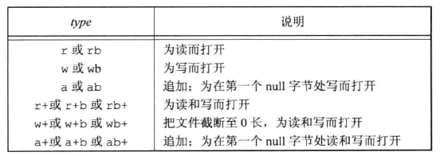

## 引言
- 前2章学习了系统IO相关的基本操作, 对操作系统也有了一个稍微深入的了解. 本章将学习标准库.

- 所谓的标准库是指标准IO库, 底层封装了操作系统的系统调用IO. <font color=deeppink> 不仅仅是unix, 这套标准在windows上也适用</font>, 标准库处理很多细节, 如缓冲区分配来优化块长度的执行等(<font color=green>如我们自己调用read或write时, 最后一个参数缓冲区的长度并不是最佳的</font>). 这些处理使用户 不必担心如何选择合适正确的块长度, 以便用户使用, 但若不深入了解IO库函数的操作, 也会带来一些问题


> 标准库是在1975年编写的, 这几十年来几乎对标准库修改过


<br/>

## 流对象(`FILE`)
- 系统IO函数是围绕 <font color=deeppink>文件描述符</font>, 当打开一个文件时, 即返回一个整数的数字, 然后后续IO相关的操作基本都是传递这个数字给对应的系统IO函数. 在标准库中, 它们则是围绕流(`stream`)进行的, 所以类似的当通过标准库打开一个文件时, 它就返回一个流对象, 后续操作是传递这个流对象给相关的函数

<br/>

## 宽字节
- 前面学习遇的字符串都单字节<font color=deeppink>一个字节占8个bit</font>. 但对于国际字符(如`汉字`)中一个字节不够存储时, 就又规定了一个字符用多个字节来存储

<br/>

### `const char*`和`char[]`
- 对于这样一种场景:
    - `char* str0 = "我"`
    - `const char* str1 = "我"`
    - `char str2[1] = "我"`
    - `char str3[] = "我"`
> 这3种情况下, 有什么不同?
> 首先这4种情况都想储存的是`我`, 是一个国际字符, 需要多字节来存储.
> 1. 第1种用一个变量来存储这个常量, 编译器会警告; 
> 2. 第2种没有问题, 但str1的长度不是一个字节, 得看当前编码;
> 3. 第3种报错, str2的容量为1个字节, 不够存储`我`;
> 4. 第4种和第2种是一样的原理;

<br/>

```cpp
#include<iostream>

char* str0 = "我";                  // 警告, 用一个变量接收一个常量
const char* str1 = "我";            // 没有问题
char str2[] = "我";                 // 同str1

int main(void){
	std::cout << __builtin_strlen(str0) << std::endl;
	std::cout << __builtin_strlen(str1) << std::endl;
	std::cout << __builtin_strlen(str2) << std::endl;
	std::cout << sizeof(str2) << std::endl;


	char str3[] = "我hello";
	char str4[sizeof(str3)];
	__builtin_memset(str4, 'A', sizeof(str4));      // __code

	std::cout << sizeof(str4) << std::endl;         // __code_0
	std::cout << str4 << std::endl;                 // __code_1
	__builtin_memcpy(str4, str3, sizeof(str4));     // __code_memcpy

	int a;
	for(ssize_t i = -1, j = sizeof(str4); ++i <= j;){   // __code_2
		std::cout << str4[i] << ":" << (int)str4[i] << '\n';    // __code_3
	}
	std::cout << std::endl;
}
```

<br/>

```shell
3
3
3
4
9                           # __shell_0
AAAAAAAAA                   # __shell_1
         @                  # __shell_1_end
�:-26
�:-120
�:-111
h:104
e:101
l:108
l:108
o:111
:0                          # __shell_2
                            # __shell_3
:11                         # __shell_4    
                            # __shell_5
```

<br/>

> 分析上面的打印: 
> 1. `__shell_0`对应的是`__code_0`, 说明编译时容量是9个字节(<font color=green>编译器会在最后附加一个空字符</font>), 汉字占据3个
> 2. `__shell_1`对应的是`str4`的内容, 因为在`__code`时被赋于了A, 但打印`str4`时, 编译器将str4当作字符串指针, 除非遇到`\0`, 所以相当于打印越界了(<font color=green> 但没有改越界的内存, 没有问题</font>), 所以一直打印遇到了@后的null`即__shell_1_end`
> 3. `__shell_1_end`到`__shell_2`是打印了`str4`的9个字符. 说明`__code_memcpy`时, 已经将null复制到了`str4`中. 但打印str4的方式是遍历打印字符, 并为了便于观察, 字符打印出对应的ASCII码, 再追加一个换行, 所以打印到`__shell_3`是正确的部分
> 4. `__shell_4 和 __shell_5`的打印是因为在`__code_2`时故意越界多打印一次,这一次的打印是一个脏字符, 再追加一个换行


### `wchar_t`
- 这个是用来存放多字节的类型, 即使是单个的ASCII字母, 也是多个字节

<br/>

```cpp
#include<iostream>
#include<cwchar>
wchar_t str2[] = L"我";

int main(void){

	std::cout << wcslen(str2) << std::endl;
	std::cout << sizeof(str2) << std::endl;
	wchar_t a = L'h';
	std::cout << sizeof(a) << std::endl;
	for(ssize_t i = -1, j = sizeof(a); ++i < j;){
		std::cout << (&a)[i] << std::endl;
	}
	return 0;
}
```

<br/>

> 测试结果

```shell
1                   // 计算 str2的长度, 只有1个字符'我', 长度是1
8                   // str2的容量, 8字节
4                   // a变量(L'h')的容量, 4个字节, 说明字母和汉字容量不一样
104                 // a内存的起始地址的第1个字符(h的ascii码)
4                   // 后面是a内存的其他数据
0
3
```

<br/>

> 这里面使用`wchar_t`时, 要使用对应的函数(如<font color =green>计算str2的长度时,不能用strlen函数, 要用对应的wcslen函数</font>)


<br/>

## 流的定向 <a id = "id-stream-direct-0"></a>
- 上面简单介绍的单字节和宽字节, 标准IO都可以处理它们. 但因为宽字节有自己的一套对应宽字节IO函数(`<wchar.h>`), 所以当前流是什么类型时, 要使用不同的函数. 这就是所谓的流定向, 流是单字节的则是 <font color=deeppink>字节定向</font>; 若是宽字节的则是 <font color=red>宽定向</font>

<br/>

> 一般 <font color=red> 流被创建时, 并未定向</font>. 当用到时才会决定是什么定向. 即 <font color=red>当未定向的流调用`多字节IO函数(<wchar.h>)`后</font>就被定向为了宽字节流; 同样的若一个未定向的流调用单字节IO函数, 则被定向为单字节流. 只有2个函数可改变流的定向. `freopen`函数用来清除一个流的定向, `fwdie`函数可用于设置流的定向


<br/>

```cpp
#include<stdio.h>
#include<wchar.h>
int fwide(FILE* fp, int mode);
```

<br/>

> 该函数的功能是<font color=red> 对一个已经定向的流做重置定向</font>, 但 <font color=red> 却不一定定向成功</font>
>   - 若`mode为负`, 试图改为`字节定向`
>   - 若`mode为正`, 试图改为`宽定向`
>   - 若`mode为0`,  不设置流的定向类型, 返回当前流的定向值
>   ps: 返回: 返回正值表示流是宽定向的; 返回负值表示流是字节定向; 返回0表示未定向. 该函数没有出错返回


<br/>

```cpp
#include<cstdio>
#include<cwchar>
int main(void){
    printf("befor call stream type: %d\n", fwide(stdout, 0));       // __code_0
    printf("----befor call stream type: %d\n", fwide(stdout, 0));   // __code_1
}
```

<br/>

> 测试结果

```shell
befor call stream type: 0
----befor call stream type: -1
```

> 简单验证了一下:
> `__code_0`表示查看stdout(`标准输出`)当前的定向情况, 因为进程开始后, 没有用到stdout, 所以输出了0, 表示当前的流未定向
> `__code_1`却输出了`-1`. 因为 `__code_0`调用了`printf`, 这个函数内部会用到`stdout`, 并且它是一个单字节流的标准IO函数, 所以stdout在`__code_0`后, 会被初始化为字节流(`负数`)
> 测试初始化为宽字节如下

<br/>

```cpp
#include<cstdio>
#include<cwchar>

int main(void){
    wprintf(L"befor call stream type: %d\n", fwide(stdout, 0));  
    wprintf(L"----befor call stream type: %d\n", fwide(stdout, 0));  
}
```
<br/>

> 结果

```shell
befor call stream type: 0
----befor call stream type: 1
```

<br/>

> 使用宽定向的函数时, 最后被初始化为了宽定向
> 这里思考一个问题: 流被定向为宽字节的意义是什么?
>   虽然现在不是特别清楚, 但这应该和标准IO的缓冲区大步, 缓冲区指针的步长有关系


<br/>

## FILE初识
- 当打开一个流时, 标准IO打开的流的函数会返回一个指针, 这个指针是一个结构体(`FILE`)对象指针. 该对象包含了标准IO为管理流需要的所有信息:
    - 流底层所关联的文件描述符
    - 流缓冲区的指针
    - 缓冲区的长度
    - 当前缓冲区的指针, 已经缓冲的长度
    - 错误标记
    - 等

- 应用程序没有必要校验FILE对象. 其他标准IO函数只需要传递相关的流指针即可


<br/>

## 标准输入,输出,错误
- 这里又谈到标准. 其实原理是一样的, 标准库的实现依赖于前面所学习的系统IO. 所以原来所说的一个进程在打开时, 默认有打开的3个文件描述符, 换成标准库IO中的流也是一样的.

| 设备 | 文件描述符 | 流指针 |
|  ----  |  ----  |  ----  |
| 标准输入 | `STDIN_FILENO`  | `stdin` |
| 标准输出 | `STDOUT_FILENO`  | `stdout` |
| 标准输入 | `STDERR_FILENO`  | `stderr` |


<br/>

## 缓冲
- 这里的缓冲是标准IO自己建立的缓冲内存, 它和`write,read`函数中缓冲是不一样的. write的缓冲是内核层面做的磁盘IO的优化, 而这里标准IO是基于应用层面的, 它的目的是减少系统IO的调用, 减轻IO的压力. 标准库缓冲的实现属于crt[^ann-crt-0]. 因为标准库IO在不同的系统上都有实现了, 所以crt环境机制可能不同, 我们现在只管用就行了, 它的细节也不是这里所要讨论的

<br/>

### 缓冲类型
- 标准库提供缓冲的目的是减少系统调用, 但总也要去调用. 一般缓冲区满了会将数据交给系统调用, 但事实上缓冲区工作机制并不是想像的这样简单(<font color=deeppink> 后面说</font>). 标准IO提供了3种类型的缓冲: 1.全缓冲; 2.行缓冲. 3. 无缓冲. 缓冲区用了`懒加载`, 只有当用到时才调用库函数`malloc`分配空间

### 全缓冲
- 这种模式下, 最容易理解, 就是当 <font color=deeppink> 缓冲区满了后调用</font>

```cpp
#include<cstdio>
int main(int args, char** avgv){
    if(args < 2){
        fprintf(stderr, "usage xxx file\n");
        return -1;
    }

    // 这里先不要管, 以写的方式打开
    auto fptr = fopen("b.txt", "w");
    if(fptr == nullptr){
        perror("fopen");
        return -1;
    }

    // 向文件中写入数据
    fprintf(fptr, "hello world");

    scanf("%d", &args);     // 阻塞住       __code_0
}
```

<br/> 

> 编译测试:

```shell
rm b.bxt; touch b.txt;              # 创建新的文件

./main 
                                    # 因为 __code_0被阻塞住


### 在新的shell中
cat b.txt
                                    # 此时是空的内容, main被阻塞住,已经调用了fprintf向文件中写入了数据,但由于缓冲没满, 并没有调用write函数


## 当在另一端的shell中输入一个整数, 并摁下回车, 则再查看b.txt后, 就有数据了
```
> 是进程结束后, 查看时才有数据, 并且进程是正常结束.

<br/>


### case-缓冲区缓冲时机
- 在上一章的学习中, 在文件亚数据的信息中有一个字段`struct stat::st_blksize`表示当前这个文件最佳IO的大小, 现在来测试一下

<br/>

```cpp
#include<cstdio>
#include<unistd.h>
#include<cstdlib>

int main(int args, char**argv){
    if(args < 3){
        fprintf(stderr, "usage file blocksize\n");
        return -1;
    }

    auto fptr = fopen(argv[1], "w");
    if(fptr == nullptr){
        perror("fopen");
        return -1;
    }

    auto buf_size = atoi(argv[2]);
    char* buf = (char*)malloc(buf_size);
    if(buf == nullptr){
        fprintf(stderr, "ne memory\n");
        return -1;
    }
    __builtin_memset(buf, 'A', buf_size);

    fprintf(fptr, "%s", buf);

    int a;
    scanf("%d", &a);
    
    free(buf);
}
```
<br/>

> 测试如下

```shell
rm b.txt; touch b.txt

# step1: 查看b.txt的最合适缓冲区
stat b.txt
16777220 106398686 -rw-r--r-- 1 liubo wheel 0 4096 "Jan 24 17:30:35 2023" "Jan 24 17:30:28 2023" "Jan 24 17:30:28 2023" "Jan 24 17:30:16 2023" 4096 8 0 b.txt
# 是4096

### 所以标准IO对b.txt文件的缓冲区也应该是4096


# step2: 以4095的缓冲区测试
./main b.txt 4095


# step3: 在另一shell中查看b.txt
cat b.txt | wc -c           # 统计b.txt有多少字节
0                           # 由于main当前是阻塞, 缓冲区是4095, 没有满4096, 所以标准IO并没有调用系统IO将数据写入b.txt, 所以是0


# step4: 输入一个数字结束main函数后,再查看 b.txt
cat b.txt | wc -c
4095                        # 没有问题


# step1: 重新指定b.txt的缓冲区为 4096
rm b.txt; touch b.txt;
./main b.txt 4096
                            # 阻塞住了

# 在另一shell中查看
cat b.txt | wc -c
4096                        # 说明缓冲区满了, 自动调用write函数, 将数据写入到了文件中, 所以统计的字节是4096
```

<br/>


<br/>

> 全缓冲一般用在普通文件中

<br/>


### 行缓冲
- 这种模式的缓冲是:
    - 1. 缓冲区满了后, 自动冲洗[^ann-flush-0]
    - 2. 缓冲区未满, 则遇到`换行符`就直接冲洗
    - 3. 只要调用了标准库相关函数, 从`不带缓冲的流`或`行缓冲流(向内核请求数据的流)`这2种流中获取到数据, 则所有的行缓冲将被冲洗<a id = "id-line-buf-type3"/>

> 第3点现在先不解释. 行缓冲主要用于终端. 这里要解释一下标准输入.
> 众所周知, <font color = red>标准输入</font>连接的设备是<font color = red>键盘</font>, 其实用户输入得到的数据并不是直接从键盘上来的. 换句话说是 <font color=red>内核屏蔽了键盘, 当用户从键盘上输入数据后, 由键盘驱动将数据先给了内核, 内核再将数据回显到终端的屏幕设备</font>, 所以屏幕上显示出来的数据是已经被内核处理了, 由于终端屏幕的特殊性, 当用户在输入了<font color = red>换行</font>时, 内核才将数据发送给<font color = red>read</font>函数. 也就是说当用户调用了`read`向键盘索取数据, 其实是阻塞的, 在阻塞的过程中, 随着用户的输入, 内核不断回显到终端屏幕, 只有当摁下回车后, read被解除阻塞, 才将这一行数据给了read, read拿到数据后再送给调用的进程

<br/>

### case-read读取标准输入<a id = "case-read-0"/>
```cpp
#include<cstdio>
#include<unistd.h>
#include<cstdlib>

int main(int args, char**argv){
    char buf[1] = {0};
    int r_len = 0;
    while((r_len = read(STDIN_FILENO, buf, 1))){
        if(r_len < 0){
            perror("read");
            return -1;
        }
        write(STDOUT_FILENO, buf, 1);
        sleep(1);
    }
    return 0;
}
```

<br/>

> 调用read后, 相当于进程被阻塞, 用户不断在键盘输入, 只有当回车后, read被解除阻塞, 获取到了一行数据, 然后1秒1个的打印. 想像一下, read内部肯定也有一个缓冲区, 因为循环是1秒打印1个, 若用户输入了3个字符和1个回车, 则read解除后从缓冲区读取到了3个字符, 打印一次,睡眠1秒后进入下一轮循环时, read不会再阻塞, 取出第2个字符再打印睡眠, 然后再不阻塞取出第3个字符, 之后发现没有了又阻塞等待用户的输入

<br/>


<br/>


### 标准IO细节1
> 若用标准IO来完成上面一模一样的功能, 则处理过程就完全不一样了, 先来说下流程:
>   1. 调用标准IO`getchar()`向键盘索取数据, 
>   2. `getchar()`内部调用`read`, 并且read函数的第3个参数缓冲区大小是很大的.
>   3. read函数阻塞
>   4. 用户输入了`abc\n`
>   5. read解除阻塞, 并在 <font color=red> 自己的缓冲区读取了`abc`</font>并交给`getchar()`
>   6. `getchar()`接收到read的数据是全部并<font color = red>存储在了`stdin`的缓冲区中</font>, 所以此时`stdin`缓冲区内容也是`abc`.
>   7. `getchar()`取出自己缓冲区的`a`给调用者
>   8. 进入循环调用`putchar(a)`
>   9. `putchar`向标准输出写数据, 会立即创建`stdout`的缓冲区, 存储`a`到缓冲区中
>   10. 睡眠1秒, 继续循环, 再调用`getchar()`
>   11. `getchar()`又从自己的缓冲区取出`b`给调用者
>   12. 重复7 到9, 一直到`getchar()`发现缓冲区取完了
>   13. 此时`getchar()`这个行缓冲(`stdin`)调用`read`向内核取数据,就会刷新所有的行缓冲流([行缓冲冲洗](#id-line-buf-type3))
>   14. 因为2的原因`putchar`的行缓冲`stdout`将被刷新, 会立调用write函数向屏幕上同时输出`abc`

<br/>

```cpp

#include<cstdio>
#include<unistd.h>
#include<cstdlib>

int main(int args, char**argv){
    char ch = 0;
    int count = 0;
    while((ch = getchar()) != EOF){
        ++count;
        putchar(ch);
        sleep(1);
        if(count == 3)          // 直接退出循环, 不触发13步 __code_0
            break;
    }
    // 向标准错误写入数据, 会立即刷新
    fprintf(stderr, "will over");
    return 0;
}
```

<br/>

> 上面这个程序的过程, 为了说明`第13步`, 这里测试的是 <font color=red>输入3个字符</font>, 然后用`count`来终止循环, 不让`getchar()`函数向`read`索取数据, 这样就 <font color=red>程序的最终结果是先打印`will over`</font>, 再连起来打印`stdout`缓冲中的`abc`,即`will overabc`. 这就说明了[行缓冲冲洗](#id-line-buf-type3)

<br/>


> 还有一点就是睡眠时间的问题, 当输入了多少字符, 循环就会走多少次, 所以是3秒. 若`__code_0`注释, 则3秒后立即打印`abc`, 并再次进入阻塞, 验证第13步,第14步


<br/>

### 无缓冲模式
- 标准IO不对字符进行缓冲, 直接调用`write`. 标准错误流就是不带缓冲的模式(如`上面代码中的 will over的打印`)


### ISOC的规定
- 只有 <font color=deeppink> 标准输入和输出并不指向交互式设备时</font>, 才是 <font color=deeppink> 全缓冲</font>的

- 标准错误一定不是全缓冲.

> 标准指出的 <font color=red> 并不表示标准输入是无缓冲或行缓冲的</font>, 但大多数标准库实现的是行缓冲; 同时标准错误也不能判断是无缓冲还是行缓冲, 但大多数标准库实现的是无缓冲


<br/>


### 更改流的缓冲类型
- 可以对一个已经打开的流重新指定缓冲模式

```cpp
#include<stdio.h>

void setbuf(FILE* fp, char* buf);
int setvbuf(FILE* fp, char* buf, int mode, size_t size);

// setvbuf 返回返回0, , 出错返回非0
```

<br/>

- `setbuf`函数的功能是 <font color=deeppink> 打开或关闭</font>缓冲机制. 参数buf必须是一个长度为 <font color=deeppink>BUSIZ的缓冲区 </font> (在`<stdio.h>`中定义).
    - 若`buf`有效, 则打开缓冲, 一般是全缓冲, 但对于终端设备来说会被设置为行缓冲
    - 若`buf`为空, 则关闭缓冲
 
- `setvbuf`可以指定缓冲类型(`mode`)
    - `_IOFBF`, 全缓冲
    - `_IOLBF`, 行缓冲
    - `_IONBF`, 无缓冲

<br/>

> 若指定`_IONBF`, 则忽略`buf`和`size`; 若指定了任意缓冲且buf不为空, 则指定缓冲的地址是buf长度是size; 若指定了缓冲但buf为空, 则标准IO自动分配缓冲区. 需要说明的是若自己指定了buf, 则要自己释放相关的内存. <font color=red> 建议在使用流前设置缓冲类型</font>

<br/>


<br/>

### case-取消stdin的缓冲[和read一样的效果](#case-read-0)

```cpp
#include<unistd.h>
#include<cstdio>

int main(void){
#if 0
    setbuf(stdin, nullptr);         // 取消缓冲模式
#else
    char buf[BUFSIZ] = {0};        
    if(setvbuf(stdin, buf, _IONBF, BUFSIZ)){
        fprintf(stderr, "setvbuf nobuf error\n");
        return -1;
    }
#endif
    char ch;
    wihel((ch = getchar())!= EOF){
        putchar(ch);
        sleep;
    }
    return 0;
}
```
> 直接取消缓冲模式后, 效果和read一样. <font color=red> 需要说明一点的是若缓冲区指定的是堆内存, 则要自己去释放, case中的是一个局部变量, 不用管</font>

<br/>


## 流刷新
- 任何时候可以强制冲洗一个流

```cpp
#include<stdio.h>

int fflush(FILE* fp);

// 成功返回0, 出错返回EOF
// 这里的出错返回要注意一下, 不是非0, 是EOF
```

<br/>


## 打开流

```cpp
#include<stdio.h>

FILE* fopen(const char* pathname, const char* type);
FILE* freopen(const char* pathname, const char* type, FILE* fp);
FILE* fdopen(int fd, const char* type);     // 非ISOC标准, 但POSIX标准有,即在windows不适用

// 成功返回文件指针, 出错返回NULL
```

<br/>


### 参数mode
- 因为标准IO是依赖系统IO的, 所以打开流的函数最终也会调用到`open`, 所以这里的mode从逻辑上来说, 是告诉open打开文件的模式, 取值有以下几种:

| type | 说明 | open对应的标志 |
|  ----  |  ----  |  ----  |
| `r`或`rb` | 只读 | `O_RDONLY`  |
| `w`或`wb` | 只写打开,有则创建, 无则清空 | `O_WRONLY \| O_CREAT \| O_TRUNC`  |
| `a`或`ab` | 追加写, 文件是否创建同`wb` | `O_WRONLY \| O_APPEND \| O_CREAT`  |
| `r+`或`r+b`或`rb+` | 读写 | `O_RDWR`  |
| `w+`或`w+b`或`wb+` | 读写打开, 文件是否创建同`wb` | `O_RDWR \| O_CREAT \| O_APPEND` |
| `a+`或`a+b`或`ab+` | 读写追加, 文件是否创建同`wb` | `O_RDWR \| O_CREAT \| O_APPEND`  |

<br/>

> 总结就是`只要指定的有r`,则不会创建文件. 这里出现的`b`是标准库的2种写模式: 1. 文本; 2. 二进制. 在unix中并不对这2种文件进行区分, 所以unix环境下没有用,但在windows上就不一样了

<br/>

### freopen
- 该函数是在一个指定的流上打开一个指定的文件
    - 若该流已打开, 则先关闭该流
    - 若该流已定向, 则清除定向
    - 若`pathname为空`, 则该函数会以 <font color=deeppink> 新模式</font>重新打开该文件, 新模式必须与旧模式兼容(<font color=green> 原来是读, 新模式也必须是读取; 原来是写, 新模式也必须是写; 原来是读写, 则新模式可以是任一模式</font>)

> 该函数将打开的流指向了新关联的文件, 同时也会关闭底层的文件描述符,并将指定的文件关联到这个文件描述符上. 一般用于将一个指定的文件打开为预定义的流[^ann-stream-default]. <font color=red>该函数也用于清除流的定向(<font color=green> 字节定向或宽定向</font>)</font>

<br/>

```cpp
#include<cstdio>
#include<unistd.h>
int main(void){
    fprintf(stdout, "hello");       // 向屏幕输出内容

    auto fp = freopen("b.txt", "w", stdout);    // 没有则创建b.txt,并将stdout对应的标准输出fd关联到b.txt
    if(fp == nullptr){
        perror("fopen");
        return -1;
    }
    fprintf(stdout, "hello");       // 实际输出到了文件
    fclose(fp);
    return 0;
}
```

<br/>

### fdopen
- 将一个已经存在的文件描述符转化为流. 一般是将`socket或管道`封装成fd, 因为标准库没有能打开这种特殊文件的函数

> 该函数的`type`可能有点不一样. 因为它是打开已经存在的文件, 所以当该函数以`写`的方式fd时, 不会截断文件


<br/>


### 标准IO细节2(`读写共用缓冲问题`)<a id = "id-stdbuf-0"/>
- 当<font color = deeppink>type</font>指定了读写(<font color=green> 带有+</font>)时, 有以下限制:
    - 在 <font color=deeppink>输出的后面</font>不能直接输入, 中间必须有`fflush, fseek, fsetpos或rewind`
    - 在 <font color=deeppink>输入未到达文件末尾时</font>后面不能直接输出, 中间必须有`fseek, fsetpos或rewind`

- 对于这2点的根本原因是读写是共用一个缓冲区的, 并且读写时流在当前文件的偏移也是共用的

> 先来看下系统IO下read和write的文件偏移是不是共用的

<br/>

```cpp
#include<cstdio>
#include<unistd.h>
#include<fcntl.h>
int main(void){
    auto fd = open("b.txt", O_RDWR);
    char ch;
    read(fd, &ch, 1);
    write(fd, "20", 2);
    close(fd);
}
```

<br/>

> 上面这个程序来验证在标准IO中的read,write的文件偏移是共用的. 事实上因为fd指向的`file-item`是同一个, 所以它们肯定共用同一个偏移


<br/>


> 读写缓冲共用

<br/>

```cpp
#include<cstdio>
#include<unistd.h>
#include<fcntl.h>

int main(void){
    auto fp = fopen("b.txt","r+");
    if(fp == nullptr){
        perror("fopen");
        return -1;
    }

    // 自己指定缓冲区
    char file_mem[BUFSIZ] = {0};
    setvbuf(fp, file_mem, _IOFBF, sizeof(file_mem));    // __code_buf

    fgetc(fp),fgetc(fp),fgetc(fp);          // __code_0
    printf("%s\n",file_mem);                // __code_print_0

    fprintf(fp, "world");                   // __code_1
    printf("%s\n",file_mem);                // __code_print_1

    fclose(fp);
    return 0;
}
```

<br/>

> 文件的原文`abcdefghijklmn`
> 上面这个程序流程:
> 1. `__code_0`时内部会 <font color=red>一次性</font>从文件中读取中很多内容到`__code_buf`
> 2. 所以`__code_print_0`打印的是`abcdefghijklmn`
> 3. 此时对于流对象来说, `__code_0`被调用(<font color=green>读取</font>)了3次, 偏移量应该是`3`. 
> 4. `__code_1`接着向文件中写入内容`world`:
>   - 但实际是往缓冲区`__code_buf`写. <font color=red> 逻辑上应该是从缓冲区中的第3个字符d开始覆盖,预想的缓冲区的内容应该是`abcworldfghijk`
>   - 最后后文件结束时则文件内容也应该是`abcworldfghijk`</font>
> 5. `__code_print_1`打印的却是`worldfghijklmn`, 最后文件的内容是`abcdefghijklmnworld`


<br/>


- 第4步中的问题2:
    - 原因是`__code_0`虽然调用了3次`fgetc`, 但因为缓冲机制, 标准IO会一次性从文件中读取很多数据出来, 对于当前的文件来说, 一次性已经读取到了文件末尾`EOF`, 所以此时`__code_1`相当于在文件末尾添加了内容`world`

<br/>

- 第4步中的问题1:
    - 读写缓冲区共用的, 但写(`__code_1`)操作并不会从文件中读取内容到缓冲区, 因为它本身是写, 所以fprintf只改变文件的偏移. 但它会将 <font color=deeppink> 写的内容覆盖的缓冲区中</font>
    - 读缓冲区 <font color=deeppink>是从当前文件偏移开始读</font>, 在最开始时`__code_0`已经将所有的文件内容读取完毕`abcdefghijklmn`,当`__code_1`时,将内容追加到文件后, 又同时将`world`覆盖的缓冲区的第0个位置开始的5个字符, 所以是`worldfghijklmn`

<br/>

> 这里出现了 <font color=red> 缓冲区内容 和 文件预想不一样的情况, 其实这就是标准IO令人疑惑的地方</font>. 因为读写都会改缓冲区, 但写操作却不将文件内容同步到缓冲区, 所以用的时候就要特别注意. 最好是在读和写之前, 将缓冲区的数据处理掉, 这也就是[这里的原因](#id-stdbuf-0)

    

<br/>

#### 测试标准IO细节
```cpp
#include<cstdio>
#include<unistd.h>
#include<fcntl.h>


int main(void){
    auto fp = fopen("b.txt","r+");
    if(fp == nullptr){
        perror("fopen");
        return -1;
    }

    char file_mem[5] = {0};
    setvbuf(fp, file_mem, _IOFBF, sizeof(file_mem));    // 未读完所有的内容
                                    //memo :  00000
                                    //fil_o:  01234    56789   ABCDE   FGHIJ   KLMNO   PQ 
                                    //fptr :  i

    fprintf(fp, "world");               
                                    //memo :  0000为空(不会读内容到缓冲区, 但会改文件偏移)
                                    //fil_o:  01234    56789   ABCDE   FGHIJ   KLMNO   PQ 
                                    //fil_c:  world    56789   ABCDE   FGHIJ   KLMNO   PQ 
                                    //fptr :  i------->i
    printf("%s\n", file_mem);


    __builtin_memset(file_mem, '&', 5);         // __code_memset
                                    //memo :  &&&&&
                                    //fil_o:  01234    56789   ABCDE   FGHIJ   KLMNO   PQ 
                                    //fil_c:  world    56789   ABCDE   FGHIJ   KLMNO   PQ 
                                    //fptr :           i
    printf("%s\n", file_mem);


    fgetc(fp);                          
                                    //memo :  56789 (从当前偏移读 56789,并写入缓冲区)
                                    //fil_o:  01234    56789   ABCDE   FGHIJ   KLMNO   PQ 
                                    //fil_c:  world    56789   ABCDE   FGHIJ   KLMNO   PQ 
                                    //fptr :           i------>i
    printf("%s\n", file_mem);

                                      
    fprintf(fp, "~~~");               
                                    //memo :  ~~~89   (写入出现, 但只改偏移, 不会读内容到缓冲区)
                                    //fil_o:  01234    56789   ABCDE   FGHIJ   KLMNO   PQ 
                                    //fil_c:  world    56789   ~~~DE   FGHIJ   KLMNO   PQ 
                                    //fptr :                   i->i
    printf("%s\n", file_mem);

    fgetc(fp);                        
                                    //memo :  DEFGH  (从偏移读取 DEFGH)
                                    //fil_o:  01234    56789   ABCDE   FGHIJ   KLMNO   PQ 
                                    //fil_c:  world    world   ~~~DE   FGHIJ   KLMNO   PQ 
                                    //fptr :                      i------>i 

    printf("%s\n", file_mem);

                                      
    fprintf(fp, "@@@");               
                                    //memo :  @@@GH  (在当前偏移处IJKLM, 改为 @@@LM)
                                    //fil_o:  01234    56789   ABCDE   FGHIJ   KLMNO   PQ 
                                    //fil_c:  world    &&&&&   ABCDE   FGH@@   @LMNO   PQ 
                                    //fptr :                              i---->i

    printf("%s\n",file_mem);          

    fclose(fp);
    return 0;
}
```

<br/>


<br/>

> 上面这个程序,演示了标准IO读写缓冲区共用以及偏移量共用的过程. 这个程序也说明了一个结论, `fprint`到缓冲区后, 在还没冲洗前, 修改缓冲区内容, 最后并不会修改fprintf的动作(`__code_memset`). 标准IO读写是依据文件偏移来的, <font color=red>每当输出后(`fprintf`), 下次的读(`fgetc`)会重新从新的文件偏移处重新读取信息到缓冲区</font>. 若`输入和输出交叉使用, 对于fprintf的输出, stdio内部会记录这一次要写入的内容和对应要插入的偏移`.
> 所以建议读写共用时, 在读之前,先冲洗缓冲区; 在写之前最好是先将读操作处理了. 说白了就是尽量分开操作


<br/>


#### 操作标准IO偏移会冲洗缓冲区
- [前面](#id-stdbuf-0)的2条规定的成因, 其实上面2个案例已经演示出来了, 这里主要看一下按规定来时, 输入(`写操作`)输出(`读操作`)中缓冲区的变化

<br/>

```cpp
#include<cstdio>
int main(void){
    auto fp = fopen("b.txt", "r+");
    if(nullptr == fp){
        perror("fopen");
        return -1;
    }

    char buf[BUFSIZ] = {0};
    if(setvbuf(fp, buf,  _IOFBF, sizeof(buf)) != 0){
        fprintf(stderr,"setvbuf\n");
        return -1;
    }
    
    fprintf(fp, "hello");
    printf("%s\n", buf);
    fseeko(fp, 0, SEEK_SET);
    fprintf(fp, "world");
    printf("%s\n", buf);
    int tmp;
    scanf("%d", &tmp);
    return 0;
}
```

<br/>


<br/>

> 以`fseeko`来测试
> 文件内容是`0123456789ABCDEFGHIJKLMNOPQ`
> 1. 先写入`hello`, 缓冲区变为`hello`, 文件偏移为`5`, 文件内容不变
> 2. 调用`fseeko`,  缓冲区还是`hello`, 文件偏移改为`0`, 文件内容`hello56789ABCDEFGHIJKLMNOPQ`
>   - 但标准IO缓冲区的指针被清零了, 意味着下次读写会重新覆盖缓冲区
> 3. 再次写入`world`, 缓冲区变为`world`,文件偏移为`5`, 文件内容不变
> 4. 进程结束, 标准IO清理所有的流缓冲区, 文件被改为`world56789ABCDEFGHIJKLMNOPQ`


<br/>

## 关闭流
- 通过标准IO打开的文件, 标准IO维护了2个对外的指针: 1. 流对象指针; 2. 缓冲区指针(<font color=green> 若指定了缓冲</font>). 所以对应的关闭也应该清理这2个指针

```cpp
#include<stdio.h>
int fclose(FILE* fp);

// 成功返回0, 出错返回EOF
```

<br/>

- 在流被关闭前, 标准IO会冲洗缓冲区, 缓冲区中的所有输入数据被丢弃, 同时将所有的缓冲写操作同步给`write系统调用`, 最后释放缓冲区和流指针.
> 当缓冲区是由外界指定, 要由用户自己来释放. 当一个进程正常终止时, crt会清理进程中所流的写操作, 并清理所有的流


## 流的读写操作
- 这里要明确一个名词`输入`. apue中这样写个人感觉`难免让人难以理解`. 其实可以换一个名词`读取`, 就是一样的意思.

> 输入和输出针对的是程序, 程序数据的来源即为`输入`,所以程序的数据来源为`文件时`, 若站在标准IO的流层面来看, 就是标准IO读取了文件, 输入给了程序. 所以`读取和输入在逻辑上是一致的`; 同理`写入和输出也是一样`. 后面以`读和写`这2个操作来讨论


<br/>

### 字符读取
- `字符`的大小并不是`char`所谓的8字节, 如`我`这个汉字, 它也是一种字符, 但不同的编码中占据的空间是不一样的, 所以这里的字符要和`字节`区分开. [前面](#id-stream-direct-0)学习了标准IO中有宽字节定向, 这里主要以`字符 == 字节`来说, 对于宽字节的函数,有一套一样的函数`<wchar.h>`

<br/>

```cpp
#include<stdio.h>
int getc(FILE* fp);
int fget(FILE* fp);
int getchar(void);

// 成功, 返回读取到的一个字节的字符的int值
```
> `getchar`等同`getc(stdin)`以及`fgetc(stdin)`. 但这2个函数签名除开函数名外都是一样的, 标准IO将其中的`getc`实现为了一个宏, 所以具体到代码中时, `getc`不能作为参数在函数之间传递.3个函数返回处理是将 <font color=red>unsigned char</font>转成了 <font color=red> int</font>. 无符号可以有`256`个有意义的字符, 但文件末尾`EOF`常被定义为`-1`, 在`unsigned char`中没有更多的情况来存储这样一种文件末尾的情况, 所以使用了int. 由于函数的文件末尾和出错返回是同样的值, 所以要区分当前读是这2种情况的某种, 则要调用`ferror`和`feof`

<br/>

```cpp
#include<stdio.h>
int ferror(FILE* fp);
int feof(FILE* fp);
 
// 返回非0(true), 表示对应的判断是真, 如ferror返回true,则表示真的是出错的情况 


void clearerr(FILE* fp);
// 清除 eof标记和errer标记
```

<br/>

#### 读取结束的正确判断

```cpp
#include<cstdio>
int main(void){
    auto fp = fopen("b.txt", "r+");
    if(nullptr == fp){
        perror("fopen");
        return -1;
    }
    
    // 因为 getc 是将 unsigned char 转化为了int, 所以正确的返回一定是 >= 0
    do{
        int rch = 0;
        rch = fgetc(fp);
        if(ferror(fp)){
            fprintf(stderr, "read faild\n");
            break;
        }

        if(feof(fp)){
            fprintf(stdout, "read over\n");
            break;
        }

        printf("%c",rch);
    }while(1);
    printf("\n", rch);
   
    clearerr(fp);
    fclose(fp);
    return 0;
}
```

<br/>


#### case-文件copy1
- 在上一章时, 曾用过系统调用实现了文件的拷贝, 这里再来一个版本

<br/>

```cpp
#include<cstdio>
int main(int args, char** argv){
    if(args != 3){
        fprintf(stderr,"usage xxx source-file detination-file\n");
        return -1;
    }

    auto sfp = fopen(argv[1], "r");
    if(sfp == nullptr){
        perror("fopen");
        return -1;
    }
    auto dfp = fopen(argv[2], "w");
    if(nullptr == dfp){
        perror("fopen");
        fclose(sfp);
        return -1;
    }
    int ch;
    while(1){
        ch = fgetc(sfp);
        if(feof(sfp)){
            fprintf(stdout, "read over\n");
            return 0;
        }

        if(ferror(sfp)){
            fprintf(stdout, "read faild\n");
            return -1;
        }
        fprintf(dfp, "%c", ch);
    }
    return 0;
}
```

<br/>

> 该程序用了标准IO来复制文件, 下面是使用系统IO也是一次性读取1个字节的复制文件, 最后测试一下2者的效率

<br/>

```cpp
#include<unistd.h>
#include<fcntl.h>
#include<cstdio>

int main(int args, char** argv){
    if(args != 3){
        const char* remind = "usage xxx source-file detination-file\n";
        write(STDERR_FILENO, remind, __builtin_strlen(remind));
        return -1;
    }

    auto sfd = open(argv[1], O_RDONLY);
    if(sfd < 0){
        perror("fopen");
        return -1;
    }
    auto dfd = open(argv[2], O_WRONLY | O_CREAT | O_TRUNC, S_IWUSR | S_IRUSR);
    if(0 > dfd){
        perror("fopen");
        close(sfd);
        return -1;
    }
    int ch;
    int r_len;
    while(1){
        r_len = read(sfd, &ch, 1);
        if(r_len < 0){
            perror("read faild\n");
            break;
        }

        if(r_len == 0){
            write(STDOUT_FILENO, "read over\n", 10);
            break;
        }
        if(write(dfd, &ch,1) != 1){
            perror("write");
            break;
        }
    }
    close(sfd);
    close(dfd);
    return 0;
}
```

<br/>

> 下面是时间测试

<br/>

```shell
read over
./std-copy /etc/passwd ./my-passwd.txt  0.00s user 0.00s system 75% cpu 0.008 total
➜  lb time ./sys-copy /etc/passwd ./my-passwd2.txt
read over
./sys-copy /etc/passwd ./my-passwd2.txt  0.01s user 0.04s system 93% cpu 0.055 total
```

<br/>

> 经过测试可以发现, 虽然复制的数据量不多, 但也看出了标准IO的效率. 但这并不能说明系统IO的效率是低下的, 原因是标准IO内部是默认有缓冲区的, 即使读取1个字节, 标准IO也会一次性读取最佳IO块的内容到缓冲区中, 后续所有的都是在缓冲区取. 而系统IO虽然内部有自己的缓冲区优化机制, 但read函数是内核函数, 并且是全局调用, 它内部处理的不仅仅是从磁盘中将内容读取出来的单个操作, 会考虑到各种安全原子性的情况, 所以可能会做锁同步的判断, 保证写入和读取不会错乱, 就会造成时间被消耗在了其他方面


<br/>

### 预读
- 当为流设置了缓冲区后, 所有的读操作是从缓冲区读的, 有一种场景是用户可能只 <font color=red>看一下下个字符是什么</font>, 这就要求了下一个字符不能被读取出来, 标准IO提供了回送机制

```cpp
#include<stdio.h>

int ungetc(int c, FILE* fp);

// 成功返回c, 出错返回EOF
```

<br/>


#### `ungetc`的一个细节
- 书中说的是将 <font color=deeppink>用户指定的单个字符回送到流中</font>. 会 <font color=deeppink> 误以为将字符回送到了缓冲区</font>, 其实自己测试一下是不对的. 先说结论:
    - 回送的字符并没有回到缓冲区
    - 回送时缓冲区当前位置指针不会增加, 只是取消了这一次的读取
    - 由于回送并不回送到缓冲区, 那回送的字符是存储在一个`stack`的结构中, 下次读取会将`stack`中所有的内容依次pop出来读取完后, 再回到缓冲区读取下一个

<br/>

> 如缓冲区`abcdef`
> 1. 读取`a`
> 2. 读取`b`
> 3. 读取`c`, 发现读出来的是`c`, 调用`ungetc('Z', ..)`, 此时缓冲区还是`abcdef`, 并且指针指向`c`, `Z`被放在了stack中`Z`
> 4. 再次读取, 则先从stack中将Z读取出来, 指针移到到缓冲区中的`d`
> 5. 继续读取
> 即其实每次读取前就会看下stack有没有内容, 若有字符, 则pop出字符, 缓冲区指针不变, 一直到所有的字符被pop完后, 缓冲区指针指向下一个, 标准IO的回送功能为什么不将字符回送到缓冲区? 因为缓冲区中的内容是连续的, 若有大量的内容, 则回送字符会将缓冲区当前指针后面的内容后移, 效率会变低, 所以搞了一个stack来辅助处理

<br/>

```cpp
#include<cstdio>

int main(void){
    auto fp = fopen("b.txt", "r");
    if(nullptr == fp){
        perror("fopen");
        return -1;
    }

    char buf[100] = {0};
    setvbuf(fp, buf, _IOFBF, sizeof(buf));

    int ch;
    do{
        ch = fgetc(fp);
        if(ferror(fp)){
            perror("fgetc");
            break;
        }
        if(feof(fp)){
            fprintf(stdout, "read over\n");
            break;
        }
        if(ch == 'a'){
            ungetc('Z', fp);
            ungetc('X', fp);
            ungetc('Y', fp);
            continue;
        }
        fprintf(stdout, "%c\n", ch);
    }while(1);

    fclose(fp);
    return 0;
}
```

<br/>


    
<br/>


### 字符写入
- 同字符输入, 所以这里的写入即为输出.

```cpp
#include<stdio.h>
int putc(int c, FILE* fp);
int fputc(int c, FILE* fp);
int putchar(int c);

// 成功返回c,  出错返回EOF
```

<br/>

> `putchar`等同于`putc(c, stdout) fputc(c, stout)`. `putc`被实现为宏. 这里要注意一点, 因为后面会学习到向流中写入字符串, 有一种闲得没事干的: 自定义缓冲区,并将写入的字符串和缓冲区是重叠的, 看下面的例子:

<br/>

```cpp
#include<cstdio>
int main(void){
    auto fp = fopen("b.txt", "r+");
    if(nullptr == fp){
        perror("fopen");
        return -1;
    }

    char buf[100] = {0};
    setvbuf(fp, buf, _IOFBF, sizeof(buf));
	
	fgetc(fp);	                                // __code_1
	fprintf(stdout,"%s\n", buf);


	buf[0] = 'A';
	buf[1]= 'A';
	buf[2] = 'A';

	fprintf(stdout,"%s\n", buf);               // __code_2
	getchar();
	fputc('T', fp);                            // __code_3
	fprintf(stdout,"%s\n", buf);
	//fprintf(fp, "%s","ATAlaoaworld");        // __code_4
	fprintf(fp, "%s",buf);                     // __code_5
	
	fprintf(stdout,"%s\n", buf);
	getchar();
    fclose(fp);
    return 0;
}
```

<br/>

> 这个程序最后的结果很难预料, 先大致说下能预测的流程:
> 文件原始内容`hellaoaworld`
> 1. `__code_1`过后, 缓冲区`hellaoaworld`, 缓冲区指针指向`1:e`
> 2. `__code_2`过后, 缓冲区`AAAlaoaworld`, 缓冲区指针指向`1:e`
> 3. `__code_3`过后, 缓冲区`ATAlaoaworld`, 缓冲区指针指向`2:A`
> 4. 若`__code_3`后直接结束, 则文件内容就是`hTllaoaworld`, 因为如前面学习的, 写入字符时, 标准IO内容会记录`1. 所要写入的字符; 2. 写入字符在缓冲区的位置, 即使缓冲区该位置的字符已经改变, 标准IO也不会写改变后的这个字符`
> 5. `__code_5`做了一件事, `写入的内容`和`缓冲区`重叠了, 这样标准IO的`fprintf`内部在处理时, 因为要写入的内容和缓冲区重叠, 在用户看来这个结果就是不可预料的(`本人没有跟踪汇编`), 所以大家可以自己测试一下
> ps:若`注释__code_5`,打开`__code_4`则最后文件的内容是预想的`hTATAlaoaworld`. 第0个`h`是由于`__code_1`造成的 <font color=red> 文件表项中的文件偏移</font>;第2个`T`是由于`__code_3`写入的; 后面的所有内容是由于`__code_3`后缓冲区变为`ATAlaoaworld`, 并且写入的是一个新的地址`__code_4`, 和原来的没有冲突, 直接附加在第2个字符后面所有的内容


<br/>


### 每次一行IO
- 标准IO为了使用更方便, 还提供了 <font color=deeppink> 每次写一行的IO函数</font>

```cpp
#include<stdio.h>
char* fgets(char* buf, int n, FILE* fp);
char* gets(char* buf);


// 成功返回buf, 出错或失败返回null
```

<br/>


- 它们都是从指定的流中获取数据到`buf`. `gets`默认向标准输入获取数据, 但它没有指定buf的长度, 就行造成`buf溢出`, 并且它 <font color=deeppink>不将换行符读取到buf中</font>
- 对于`fgets`它指定了缓冲区的长度(<font color=green> n的值不大于buf的长度,包括结尾的空字符</font>), 读取n-1个字符, 若遇到换行读入并停止, 结尾是空字符. <font color=deeppink>~~gets~~</font>已经过期, 不要再使用

<br/>

```cpp
#include<cstdio>
#include<sys/stat.h>
#include<cstdlib>
int main(int args, char** argv){
	if(args != 3){
		fprintf(stderr, "usage xxx content newline_idx\n");
		return -1;
	}

	struct stat finfo;
	if(stat(argv[1], &finfo) < 0){
		perror("stat");
		return -1;
	}
	

    auto fp = fopen(argv[1], "r+");
    if(nullptr == fp){
        perror("fopen");
        return -1;
    }
	
	char* buf = (char*)malloc(finfo.st_size);
	if(buf == nullptr){
		perror("malloc");
		return -1;
	}
	__builtin_memset(buf, 0, finfo.st_size);

	auto s = fgets(buf, atoi(argv[2]), fp);
	if(s == NULL){
		if(ferror(fp)){
			perror("fgets");
			fclose(fp);
			return -1;
		}
	}
	printf("%s", s);
	fclose(fp);
	free(buf);
	return 0;
}
```

<br/>


<br/>


### 行写出
- 与行输入对应的是行输出(`写入流对应的文件`)的函数
```cpp
#include<stdio.h>
int fputs(const char* str, FILE* fp);
int puts(const char* str);

// 成功返回 > 0. 出错返回EOF
```

- 函数fputs将一个字符串(<font color=green>以null[^ann-null]终止</font>)写到指定的流, null不写出.

- puts同`fputs`, 但它默认写的是标准输出, null不写出. 但puts总会将换行写到输出

> 需要说明的是, 函数 <font color=red> 并不会因为遇到`\n`就停止, 它一定会遇到null</font> 

<br/>


```cpp
#include<cstdio>
int main(int args, char** argv){

    if(args == 2){
        //这里返回是瞎写的
        return !puts("puts: hell\na\0bc\n");
    }

    fputs("fputs: hell\na\0bc\n",stdout);
    return 0;
}    
```

<br/>


> 通过测试可以发现, 两者都会遇到null才结束, 但`puts`会多输出一个换行


<br/>


### 标准IO效率 
- 


```cpp
#include<unistd.h>
#include<fcntl.h>
#include<cstdio>
#include<cstdlib>

int main(int args, char** argv){
    if(args != 5){
        fprintf(stderr, "usage xx src tar type val\n");
        return -1;
    }

    // 1: 系统IO, 2: 标准字符IO  3:标准行IO
    int type = atoi(argv[3]);

    // 循环次数统计
    int count = 0;


    if(type > 1){
        auto sfp = fopen(argv[1], "r");
        if(sfp == nullptr){
            perror("fopen");
            return -1;
        }
        auto dfp = fopen(argv[2], "w");
        if(nullptr == dfp){
            perror("fopen");
            fclose(sfp);
            return -1;
        }


        // std-char IO
        if(type == 2){
            auto ch = EOF;
            while(1){
                ch = fgetc(sfp);
                if(ch == EOF){
                    if(ferror(sfp)){
                        perror("fgetc");
                        fclose(sfp);    fclose(dfp);
                        return -1;
                    }
                    fclose(sfp);    fclose(dfp);
                    // over
                    break;
                }

                if(fputc(ch, dfp) == EOF){
                    fclose(sfp);    fclose(dfp);
                    perror("fputc");
                    return -1;
                }
                ++count;
            }
        }


        // std-line IO
        if(type == 3){
            auto len = atoi(argv[4]);   
            char* buf = (char*)malloc(len);
            while(fgets(buf, len, sfp)){
                if(fputs(buf, dfp) == EOF){
                    if(ferror(dfp)){
                        fclose(sfp);    fclose(dfp);
                        perror("fputs");
                        return -1;
                    }
                    fclose(sfp);    fclose(dfp);
                    // 写结束??
                    break;
                }
                ++count;
            }
            free(buf);

            if(ferror(sfp)){
                fclose(sfp);    fclose(dfp);
                return -1;
            }
        }
        fclose(sfp);
        fclose(dfp);
    }


    // sys IO
    if(type == 1){
        auto sfd = open(argv[1], O_RDONLY);
        if(sfd < 0){ perror("open"); return -1;  }

        auto dfd = open(argv[2], O_WRONLY);
        if(dfd < 0){ perror("open");  close(sfd); return -1;  }

        auto msize = atoi(argv[4]);
        char* buf = (char*)malloc(msize);
        __builtin_memset(buf, 0, msize);


        while(1){
            auto r_len = read(sfd, buf, msize); 
            if(r_len < 0){
                perror("read");
                close(sfd);
                close(dfd);
                return -1;
            }
            if(r_len == 0) break;
            if(write(dfd, buf, r_len) != r_len){
                perror("write");
                close(sfd);
                close(dfd);
                return -1;
            }
            ++count;
        }
        free(buf);
        close(sfd);
        close(dfd);
    }
    
    fprintf(stdout, "copy over %d\n", count);
    return 0;
}
```

<br/>


> 测试
> 文件`test.mp4`大小`106M`
> 命令行的参数
> 1. 源文件(`test.mp4`)
> 2. 目标写入文件
> 3. 类型(`1:系统IO, 2:标准字符IO, 3:标准行IO`)
> 4. 对应类型IO需要的参数
>   - 当类型为1时, 指定系统IO的缓冲区
>   - 当类型为3时, 指定行被读入时的缓冲区
>   - 当类型为2时, 忽略
> 测试如下:


<br/>

> 系统IO指定了最佳的IO块(`4096这个是查看了目标文件的信息输入的`), 时间很快. 
>
> 标准IO行IO时, 循环次数并不是和read一样, 因为标准IO从自己的缓冲区再读出来时, 可能遇到null字符, 导致这一次的读取结束. 所以4096的数据可能是分多次读取出来的, 但速度还是很快, 十分接近系统IO, 它慢的原因是基本是因为用户态的代码(`标准库IO的实现也是用户态`)
>
> 字符IO, 相对于其他2种来说比较慢. 原因:标准IO虽然是内部的缓冲区是最佳的(`4096`), 但字符IO时,还是从自己的缓冲区中一个一个取出来, 相当于将磁盘中的文件所有的内容按字符一个一个取出来.但它绝对比系统IO以字符IO时要快, 因为这一个一个取的过程是在内存中. 若系统IO的缓冲区指定的是1, 则最后这个时间将近100多秒, 原因是read内部虽然也有缓冲优化, 但read参数的缓冲不是合适的IO会导致每次一个字符的读取从内核态到用户态的切换频率太高, 所以时间就长了.
>
> 书籍中说了`fputs`的实现是用`memcpy`来实现的, 并不是循环一个一个字符拷贝到用户的缓冲区中, 而且为了高效用了`汇编`. 这里还要说一点, 当前时间是在`macOS`上, 不同的系统上随着系统IO和标准IO的实现不同, 时间可能也是不一样的

<br/>


### 二进制IO
- 上面有2种IO, 一个处理字符[^ann-stdio-char], 一个处理行. 在unix内核实现中,是没有所谓的文本流的, 都是字节IO, 标准IO扩展了系统IO, 并不仅仅体现在字符和行, 还提供了对象的IO操作

```cpp
#include<stdio.h>
size_t fread(void* ptr, size_t obj, size_t n, FILE* fp);
size_t fwrite(void* ptr, size_t obj, size_t n, FILE* fp);

// 函数功能:
//      写入 n*obj 字节的数据到fp中
// 返回
//      表示 读写了多少个 obj(小于n)
```

<br/>

> 这2个函数 <font color=red>慎用</font>, 因为可以写结构体. 结构涉及到内存对齐, 即使在同一个程序用同一个编译器来编译, 若编译选项不对, 则结构体的内存结构就可能不一样. 若是在不同的系统或不同的编译器生成的程序中, 它们的结构也极大可能不一样(`可以约定编译对齐`), 所以最好少用


<br/>


## 定位流
### 方案
- 前面在学习流的缓冲区中, 提到过, 标准IO在缓冲区中的操作本质上是`文件描述符对应的文件选项的中文件偏移指针`, 因为缓冲区的共用以及文件偏移的共用, 若使用不当会出现各种问题
- 标准库提供了3组函数, 针对定位用到的

### ftell及fseek
- 它们诞生很早, 只不过文件偏移量的类型是固定的, 后来的标准中改成了自定义的类型

```cpp
#include<stdio.h>
long ftell(FILE* fp);

// 返回当前文件位置, 出错返回 -1L

int fseek(FILE* fp, long offset, int where)
// 定位 文件描述符对应的文件偏移
// 用法同 系统函数`lseek`
```


#### case-和系统IO混用(`慎用`)
```cpp
#include<unistd.h>
#include<cstdio>

int main(int args, char** argv){
    auto fp = fopen("b.txt", "r+");
    if(nullptr == fp){
        perror("fopen");
        return -1;
    }
    auto ch = fgetc(fp);                    // __code_0
    fseeko(fp, 0, SEEK_SET);                // __code_1
    fputc('w', fp);                         // __code_2
    auto fd = fileno(fp);                   // __code_3
    if(write(fd, "h", 1) < 0){              // __code_4
        perror("write");
        fclose(fp);
        return -1;
    }
    fclose(fp);
    return 0;
}
```


<br/>

> 分析:
> 文件: `xfzhcll`
> 1. `__code_0`标准IO第一次读取文件, 会将文件的内容全部读取完到自己的缓冲区
> 2. 此时底层文件的偏移在文件末尾
> 3. `__code_1`用的是标准库定位的函数, 但事实上改的是底层的文件偏移, 到了第0个位置, 并且出现了fseek后, 会立即将fp流中待写入的数据全部写入write, 但很幸运在调用它前fp流并没有写入的操作
> 4. `__code_2`后, 写入的数据并不会直接文件中, 到了缓冲区, 待写入的是`w`, 待写入的位置是文件的第0个位置, 但此时没有写入, 是待写, 是待写, 是待写,并且因为没写入, 并不会改变文件偏移
> 5. `__code_3`获取到这个流对应的文件描述符
> 6. `__code_4`用系统IO向文件中写入数据, 此时是真的写了, 因为当前文件偏移是0, 所以write函数会向文件的第0个位置写入`h`, 导致文件偏移为1
> 7. 进程正常结束, crt冲洗所有的流, 所以fp待写入的`w`会最后写入文件, 它写入时文件的偏移已经变为1, 所以覆盖了原文件的第1个字符(`f`),所以最后文件的内容是`hwzhcll`

> 
```shell
echo -n "xfzhcll" > b.txt
cat b.txt
xfzhcll%
./main
cat b.txt
hwzhcll%
```

<br/>


### fseek注意的细节
- 文本内容
    - 因为`fseek`的流定位操作的本质是`底层的系统lseek`, 所以至少从是从逻辑上来看, 它的第2个参数`offset`也是基于字节的. 这样就会造成以前说过的问题(<font color=green>系统IO中lseek汉字的问题</font>), 请看下面的案例

```cpp
#include<unistd.h>
#include<cstdio>
#include<cwchar>

int main(int args, char** argv){
    auto fp = fopen("b.txt", "r+");
    if(nullptr == fp){
        perror("fopen");
        return -1;
    }
    auto ch = fgetc(fp);
    fprintf(stdout, "%lu %d\n", sizeof(ch), ch);
    fseeko(fp, 1, SEEK_SET);
    fputc('w', fp);
    auto fd = fileno(fp);
    if(write(fd, "h", 1) < 0){
        perror("write");
        fclose(fp);
        return -1;
    }
    fclose(fp);
    return 0;
}
```

<br/>

> 文件的内容是`我a`, 下面是文件磁盘的内容(<font color=green>用字符和8进制来表示</font>)

```shell
echo -n "我a" > b.txt
od -c b.txt
0000000   我  **  **   a
0000004
od -b b.txt
0000000   346 210 221 141
0000004


#### 发现 b.txt中的汉字 "我" 在当前文件编码中占据3个字节:
######### 磁盘空间地址是 00         01          02
######### 对应的数字是   346(230)   210(136)    221(145)


### 执行程序
./main
od -b b.txt
0000000   346 150 167 141
0000004

### 发现, 在程序中指定偏移的是 1
###### 由于文件中第1个内容是 多字节的汉字
###### 标准IO并没有将偏移指针偏移到汉字的后面
###### 所以最后文件的内容中 我 的内容区域被破坏, 造成的乱码
```

<br/>


<br/>

> 并不是说不能用, 意思是定位时, 要自己根据当前的编码去合理的定位偏移. 这其实就是编辑器的功能了, 当然编辑器所要完成的远远不只合理的定位这么简单


<br/>


- 二进制文件
    - 这里的二进制文件可不仅仅是 <font color=deeppink> 可执行的程序文件</font>, 还有什么图片, 视频等. 相同内容的二进制文件根据不同的编码格式, 最后文件也不一样, 所以解析时还是得依赖文件编码或约定的格式. 甚至某些系统对于`SEEK_END`有格式规定, 其二进制文件的长度要为某个固定数字的倍数, 不足的补0, 而对于用户来讲, 这些区域从逻辑上来看应该不是用户数据区域, 所以这时候定位也可能出现在补0的区域从而破坏文件


<bn/>

- 正确定位
    - 使用`SEEK_SET`定位在`0`, 即文件最开始
    - 使用`ftell或ftello`返回值配合`SEEK_CUR`, 来定位当前的位置
> 但事实上这些所谓的定位意义不大

<br/>

### fseeko和ftello
- 上面定位的偏移量是long类型, 后来标准出了自定义类型`off_t`, 配合新的函数

```cpp
#include<stdio.h>

off_t ftello(FILE* fp);
    // 成功返回文件当前的位置, 出错返回-1


int fseeko(FILE* fp, off_t offset, int where);
    // 成功返回0, 出错返回-1(可以检查errno)
```

> 这2个函数的用法和上面不带`o`的版本是一样的, off_t是一个整数,但具体多少位是不知道的

```cpp
#include<iostream>
#include<type_traits>

int main(void){

    if(std::is_integral<off_t>::value){
        std::cout << "int true\n";
    }else{
        std::cout << "int false\n";
    } 

    std::cout << sizeof(off_t) << std::endl;
}
```

<br/>


### fgetpos和fsetpos
- 这是另一个标准下的定位函数

```cpp
#include<stdio.h>
int fgetpos(FILE* fp, fpos_t* pos);
int fsetpos(FILE* fp, const fpos_t* pos);

// 成功返回0, 出错返回非0
```

<br/>

> 关于fpos_t是不是整数类型, 这里就不验证了, 直接说结果:
>   1. 在`darwin(MacOS)`上, 它是整数
>   2. 在`centOS`上, 它是结构

<br/>

```cpp
// 以下是centOS上
// stdio.h

// ...
typedef _G_fpos_t fpos_t;

typedef struct{
  __off64_t __pos;
  __mbstate_t __state;
} _G_fpos64_t;

typedef struct{
  int __count;
  union{
# ifdef __WINT_TYPE__
    __WINT_TYPE__ __wch;
# else
    wint_t __wch;
# endif
    char __wchb[4];
  } __value;		/* Value so far.  */
} __mbstate_t;
#endif
```
> 从上面的定义, 在linux中`fpos_t`的类型比较复杂, 但作有用户层面的我们, 只用到`__off_t __pos`, 注意这里只是简略的截取出来的结构 
   

<br/>

```cpp
#include<cstdio>

int main(void){
    auto fp = fopen("b.txt", "r");
    // if error

    char rbuf[10];
    fread(rbuf, 1, 2, fp);
    // if error
    
    fpos_t cur;
    fgetpos(fp, &cur);
    // if error

    // 已经从文件中读取了1个字符, 所以当前的偏移量是2
    printf("offset: %d\n",cur.__pos);

    fclose(fp);
}
```


<br/>


## 格式IO
### printf函数簇
- 事实上`printf`的实现是相当的复杂, 它的功能很强大(<font color=green>包括C++中的输出流对象的格式化也是一样的</font>).

```cpp
#include<stdio.h>

int printf(const char* format, ...);
int fprintf(FILE* fp, const char* format, ...);
int dprintf(int fd, const char* format, ...);
 
// 这3个函数成功返回输出的字符数量, 出错返回负值


int sprintf(char* buf, const char* format, ...);
int snprintf(char* buf, size_t n, const char* format, ...);

// 这2个函数, 是将结果写入指定的缓冲区中, 成功返回写入的字符数, 出错返回负值
// 自动追加 null, 但返回写入的数量中是没有计入null的
```

<br/>

> `printf`默认写到标准输出. `fprintf`输出到指定的流中. `dprintf`写到指定的`文件描述符`. <font color=red>但用dprintf时,不需要先将流转化成fd, 可以直接传递用`open`函数返回的fd</font>
> `sprintf`函数由于没有指定buf的大小, 所以调用时要保证缓冲区足够大. 现在它基本被淘汰了, 使用`snprintf`.

<br/>

```cpp
#include<cstdio>
#include<unistd.h>
#include<fcntl.h>
int main(void){
    auto fd = open("b.txt", O_RDWR);
    // if error
    
    // 直接使用open 函数返回的fd, 来写入文件
    dprintf(fd, "hello");       

    close(fd);
    return 0;
}
```

<br/>

### 输出格式
> `% [flags] [fldwidth] [precision]  [lemodifier] convtype`
> 其中最常用的是`%convtype`, 如`%d, %c, %s`

#### 输出标志

| 标志 | 说明 |
|  ----  |  ----  |
| `'` | 将整数按千分位分组(<font color = green>目前测试无效</font>)|
| `-` | 在字段内左对齐输出|
| `+` | 对于数字来说, 显示出正负号|
| ` `(`空格`) | 对于数字来说, 最前面`是一个空格`|
| `#` | 不同进制的数字输出时, 加上前缘(`如0x`)|
| `0` | 用0填充|

<br/>

```cpp
#include<cstdio>
#include<locale.h>

int main(void){

	printf("%s\n", "0123456789ABCDEF");

	printf("%%d_____________\n");
	printf("%d@@\n", 10000);

	printf("\n%% d_____________\n");
	printf("% d@@\n", 10000);

	printf("\n%%#x_____________\n");
	printf("%#x@@\n", 10000);

	printf("\n%%#X_____________\n");
	printf("%#X@@\n", 10000);


	printf("\n%%16d_____________\n");
	printf("%16d@@\n", 10000);

	printf("\n%%-16d_____________\n");
	printf("%-16d@@\n", 10000);

	printf("\n%%+16d_____________\n");
	printf("%+16d@@\n", 10000);

	printf("\n%%-+16d_____________\n");
	printf("%-+16d@@\n", 10000);

	printf("\n%%+-16d_____________\n");
	printf("%+-16d@@\n", 10000);

	printf("\n%%016d_____________\n");
	printf("%016d@@\n", 10000);
	return 0;
}
```

<br/>

> 通过测试可以发现, flag中的可以多个一起用


<br/>

#### 指定输出宽度(`fldwidth`)
- 如上面的`16`, 最后输出的结果中长度占据16位, 若指定的位数不够原内容的宽度, 则不人被截断. 默认剩余空间的内容是被`空格`填充. 指定的宽度 <font color=deeppink> 是一个非负整数或`*`</font>, 但最好不要用`*`


<br/>


#### 精确度(`precision`)
- 这个常用于输出浮点, 格式是`%m.nf`. `m`表示要输出的数字是多少位, 若不够也不会截断, `n`是精度. 


<br/>

#### 参数修饰符

| 修饰符 | 说明 |
|  ----  |  ----  |
| hh | 按`signed 或 unsigned char`输出 |
| h | 按`signed 或 unsigned short`输出 |
| l | 按`signed 或 unsigned long`输出 |
| ll | 按`signed 或 unsigned long long`输出 |
| j | `intmax_t`或`uintmax_t`|
| z | `size_t`|
| t | `ptrdiff_t`, 指针|
| t | `long double`|

> 这些修饰的意义是将参数按多少位输出, 如一个int,指定`hh`时

<br/>


#### 参数(`convtype`)

| 类型 |  |
|  ----  |  ----  |
| `d, i` | 有符号十进制  |
| `o` | 无符号八进制  |
| `u` | 无符号十进制  |
| `x, X` | 无符号十六进制  |
| `f, F` | <font color=deeppink>双</font>精度浮点  |
| `e, E` |指数双精度  |
| `g,G` | 针对浮点, 自动解释为`f, F, e E`  |
| `a, A` | 十六进制的双精度|
| `c` | 字符单字节|
| `s` | 字符串|
| `p` | 指针|
| `%` | 2个`%`来转义|
| `C` | 宽字符|
| `S` | 宽字符串|


<br/>

```cpp
int main(void){
	printf("%hhx@@\n", 0xfedcba987654321);
	printf("%hx@@\n", 0xfedcba987654321);
	return 0;
}


// 输出 
#if 0
21@@
4321@@
#endif
```

<br/>

#### 可变参数
- C语言的可变参数严格来说有2种:
    - 可变宏(`98`)
        > 注意这里是C语言中自己的特性, 不是C++中的可变模板,这里不会提,可以学习下[C语言下可变宏的高级运用](https://www.jianshu.com/p/74cb5651301f)
    - 函数可变参数

<br/>

```cpp
/// 函数可变参数

#include<cstdio>
#include<cstdarg>   // va_list

void func_vararg(int v1, ...){
    va_list v_lst;

    // 开始从栈桢中取参数
    va_start(v_lst, v1);

    // 取v1后的下一个参数, 要指定类型
    double vaule = va_arg(v_list, double);
    printf("%f", value);   

    const char* str = va_arg(v_list, const char*);
    puts(str);

    va_end(v_lst);
}

int main(void){
    func_vararg(20, 100.24, "tierry", NULL);
}
```

<br/>

> 上面这个是C语言语法支持的 <font color=red> 可变函数参数</font>, 查找相关的`va_list`定义, 是利用编译器做出来的, 所以在编译期就完成了. 基于这一点, 每次取参数(`va_arg`)时, 必须指定这个参数的类型, 因为编译器转换`va_arg`的结果实际是在运行时,运行时从<font color = red>当前函数的`栈桢`中根据类型大小去做定向偏移, 然后取得这个内存大小的数据赋值给对应的变量</font>
> 这里说的<font color = red>从当前函数(`func_vararg`)的栈桢中</font>其实是不对的. 为了说明这一点, 要扩展额外的知识:
>   1. 汇编
>   2. 函数栈桢
>   3. 函数清理
>   4. 函数调用方及函数被调用方
>
> 首先汇编, 涉及到汇编的层面的是操作系统之间约定的参数传递规则, 如`调用方`传递参数时`从左到右 或 从右到左`, 传递参数是用固定的寄存器还是直接在调方的栈桢中等
>
> 函数的栈桢这里不细说, 直白点就是<font color = red>函数本身独立的空间</font>, 在这个空间里, 存储的是该函数的局部变量, 函数返回调方的执行地址等等, 注意函数的参数并没有在自己的栈桢中
>
> 函数的清理就是:
>   1. 函数的参数空间清理
>   2. 函数本身的栈桢空间清理
>
> 函数的参数是由`主调方`来传递的, 按规定(`cdecl`), 在调用其他函数前将相应的参数从右往左压栈, 调调用完毕后, 再清理这些参数的空间
> 
> 函数本身的栈空间由函数自己去释放. 众所周知函数必须在编译期就确定大小, 这个大小指的是该函数的指令空间, 局部变量空间都是固定的. 编译器在编译函数时, 会做出这个栈空间, 函数返回时, 再清理掉. 
>
> 对于一个可变参数的函数来说, 它本身是拿不到相应的参数的, 如上面的程序中, `func_vararg`是不能拿到第2个,第3个参数的, 所以编译器提供了方法`va_arg`, 编译器能知道到`main`函数怎么传递的参数, 怎么去取这个参数. 在`fun_vararg`的代码中是不可能由程序员取到的, 因为 <font color=red>函数的参数个数, 类型都是不固定的, 所以对于具体的实现就不可能是固定的, 指令大小就不固定, 编译器就无法确定出这个函数的大小. 除非在应用层面就约定了函数参数的个数, 类型, 但这样本质上就和有限参数函数是一样的了. 在OOP下具有反射性质的语言(`如OC`), 可以约定参数的类型是`NSObject, 这样因为语言的特点, 可变参数是相当有用的</font>

<br/>

#### 可变参数的输出
- 它实现的原理就是上面说的`va_list`, 需要说明的是, 可变输出的判断类型大小其实就是传递的`format`中的`%xxx`

```cpp
#include<stdarg.h>
#include<stdio.h>

int vprintf(const char* format, va_list arg);
int vfprintf(FILE* fp, const char* format, va_list arg);
int vdfprintf(int fd, const char* format, va_list arg);

// 成功返回输出的字符数, 出错返回负值


int vsprintf(char* buf, const char* format, va_list arg);
int vsnprintf(char* buf, size_t n, const char* format, va_list arg);

// 一样的道理
```

<br/>


### scanf函数簇
```cpp
#include<stdio.h>
int scanf(const char* format, ...);
int fscanf(FILE* fp, const char* format, ...);
int sscanf(const char* buf, const char* format, ...);

/// 成功返回的是  赋值的输入项数
/// 出错或到文件末尾,返回EOF
```
- 函数的作用是分析输入的字符串, 并转换为指定类型的变量, 参数为指定的地址.它的格式同`printf`, 这里就不多说了


<br/>


## 获取流对应的文件描述符

```cpp
#include<stdio.h>
int fileno(FILE* fp);

// 返回对应的文件描述符
```

> 说明一点, 在apue的书籍中(`第三版 5.12`)中举了如何通过流对象来获取对应的缓冲类型及大小, 这里就不细说了, 因为不同的系统在实现标准IO时, 可能是不一样的, 这上点可以从书籍上看一下


<br/>

## 临时文件
- 在标准库中也提供了创建临时文件的函数, <font color=deeppink>这里吐槽一下, unix和标准库起名的问题, 学到这里也看到了, 它们取函数名和变量名都是比较简洁的, 不像Java等另外的语言见名知义, 原因是有一部分为了编译效率. 个人现在也养成了这种习惯, 起名尽量简短, 当然这也看个人习惯</font>
```cpp
#include<stdio.h>
char* tmpnam(char* ptr);
// 成功返回 唯一的路径名


FILE* tmpfile(void);

// 成功返回文件指针, 出错返回NULL
```

<br/>


### tmpnam
- 它会在`临时目录下`返回一个唯一的路径字符串, 可以将其用来创建文件
    - 若`ptr为空`, 则返回的指针地址是一个`static`变量, 每次调用会覆盖
    - 若`ptr有值`, 则将内容填充到`ptr`中并返回ptr, 但这里有风险, ptr的长度必须够长(`可以通过系统文件名长度的选项来指定`), 这也是这个函数被弃用的一个原因. 另一个原因是它返回一个字符串, 但并不创建文件, 这样在并发时, 可能其他地方使用到相同的名字先创建一个相同的文件, 这样tmpnam函数所返回的文件名就不是所谓的唯一的了

<br/>

```cpp
#include<cstdio>
#include<sys/stat.h>
#include<pthread.h>

void* pthread_sub(void* arg){
#ifdef _TEST_PTR
	char buf[100];
	auto name = tmpnam(buf);
	printf("%p %p %s\n", buf, name, name);
#else
	auto name = tmpnam(nullptr);
	printf("%p %s\n",name, name);
#endif
}

int main(void){
	pthread_t ths[10];
	for(int i = -1, j = sizeof(ths) / sizeof(pthread_t); ++i < j;){
		pthread_create(&ths[i], 0, pthread_sub, nullptr);
		pthread_join(ths[i], nullptr);
	}

	return 0;
}
```

<br/>

```shell
### 当前并不在 /tmp目录下
### 参数ptr为空(测试静态变量)
g++ -std=c++11 -lpthread main.cpp -o main

./main
0x7fb3ce367950 /tmp/filecaoYdI
0x7fb3ce367950 /tmp/fileBcDp5U
0x7fb3ce367950 /tmp/filebsF3W7
0x7fb3ce367950 /tmp/fileZrQHOk
0x7fb3ce367950 /tmp/file5IjmGx
0x7fb3ce367950 /tmp/filelI50xK
0x7fb3ce367950 /tmp/filePXdGpX
0x7fb3ce367950 /tmp/filed5Jlha
0x7fb3ce367950 /tmp/filedx208m
0x7fb3ce367950 /tmp/filetNFG0z

### 可以发现当ptr为空时, 所有的地址是一样的


g++ -std=c++11 -lpthread -D_TEST_PTR main.cpp -o main
./main
0x7f8e5ac8cea0 0x7f8e5ac8cea0 /tmp/fileyHUUKs
0x7f8e5ac8cea0 0x7f8e5ac8cea0 /tmp/filewJOLQZ
0x7f8e5ac8cea0 0x7f8e5ac8cea0 /tmp/fileRLpRWw
0x7f8e5ac8cea0 0x7f8e5ac8cea0 /tmp/fileyc9W23
0x7f8e5ac8cea0 0x7f8e5ac8cea0 /tmp/filen8e38A
0x7f8e5ac8cea0 0x7f8e5ac8cea0 /tmp/fileowF9e8
0x7f8e5ac8cea0 0x7f8e5ac8cea0 /tmp/fileZ9tglF
0x7f8e5ac8cea0 0x7f8e5ac8cea0 /tmp/file0E7mrc
0x7f8e5ac8cea0 0x7f8e5ac8cea0 /tmp/fileHu5txJ
0x7f8e5ac8cea0 0x7f8e5ac8cea0 /tmp/fileeYrBDg
```
<br/>


<br/>

> 上面的测试并没有测试出同名的, 但也不能就说这个函数产生的字符串一定是唯一的.但书籍说了, 它产生一个唯一的字符串. 所以不再纠结是否在并发下会产生相同的字符串. 注意这里函数的功能是产生一个唯一的路径, 并没有创建文件, 所以就如同上面说的, 若再用这个路径去创建文件时, 并不能保证文件是否已经存在, 因为其他情况下可能在调用该函数产生了路径后, 还没返回, 其他人刚好用了同名的路径创建了文件, 虽然这样的概率很小, 但它存在


### tmpfile
- 它的功能和`tmpnam`一样, 但它直接返回文件流, 在进程关闭的时, 自动关闭该临时文件, 打开的模式是`wb+`.

<br/>

> 它的原理是先调用`tmpnam`产生一个唯一的路径名, 再以`wb+`打开它, 再解除链接(`unlink`). 这样就会在进程正常结束后,自动删除这个文件. 所以不必担心这个文件的目录在什么地方, 因为它始终是要被释放的


<br/>


### 扩展标准下创建文件
```cpp
#include<stdlib.h>

char* mkdtemp(char* template);
    // 成功返回 目录名的指针(所以要用到 openat函数)
    // 出错返回null, 并设置errno
    
int mkstemp(char* template);
    // 成功返回fd
    // 出错返回-1
```

### mkdtemp
- 它的功能是创建一个目录(`唯一`), 它是根据`template`hash出来的,所以template是有格式的, 它的后6位必须是`XXXXXX`
- 创建的目录并不是临时的, 创建目录的权限是`S_IRUSR | S_IWUSR | S_IXUSR`, 但它内部没有以重置umask来创建, 所以当设置了umask后, 真正目录的权限可能并不是指定的这几个

```cpp
#include<cstdio>
#include<cstdlib>
#include<cstring>
#include<sys/stat.h>

int main(void){
	char buf[] = "helloXXXXXX";
	auto dp = mkdtemp(buf);
	printf("%s\n", dp);

	struct stat info;
	stat(dp, &info);
	// if error

	auto lambda = [&info](decltype(S_IRUSR) mask, const char* pre){
		if(info.st_mode & mask){
			printf("%s\n", pre);
		}
	};

	lambda(S_IRUSR, "user read");
	lambda(S_IWUSR, "user write");
	lambda(S_IXUSR, "user exec");

	lambda(S_IRGRP, "group read");
	lambda(S_IWGRP, "group write");
	lambda(S_IXGRP, "group exec");


	lambda(S_IROTH, "other read");
	lambda(S_IWOTH, "other write");
	lambda(S_IXOTH, "other exec");
	return 0;
}
```

<br/>

```shell
➜  tmp0 ./main
hellouWtQlq
user read
user write
user exec
➜  tmp0 l
total 28K
drwxr-xr-x.  4 liubo liubo   81 Feb  2 14:47 .
drwx------. 30 liubo liubo 4.0K Feb  2 14:47 ..
drwx------.  2 liubo liubo    6 Feb  2 14:47 hellouWtQlq
-rwxr-xr-x.  1 liubo liubo  16K Feb  2 14:44 main
-rw-r--r--.  1 liubo liubo  647 Feb  2 14:44 main.cpp
-rw-r--r--.  1 liubo liubo   22 Feb  2 13:20 makefile
drwxr-xr-x.  2 liubo liubo    6 Jan 15 16:02 test
```

<br/>

### mkstemp
- 它的功能是创建一个普通文件, 文件指定的权限是`S_IRUSR | S_IWUSR`, 这个函数和`mkdtemp`会保证创建出来的文件是唯一的, 所以相对于标准库提供了, 最好使用这2个函数


<br/>


## 内存流
### 它是什么 
- 前面所学习的标准库IO都是针对unix上的逻辑上存在的文件, 在后来的标准中, 标准IO支持了虚拟文件(`内存中的缓冲区`),这就是标准IO流
- 所谓虚拟是指, 标准IO并不将流对象关联到磁盘上的任何文件, 它将在内存中开辟出一块区域, 用来映像所谓的文件, 其实根本没有文件. 所以就相当于在内存中操作, 速度很己, 适合用来处理字符串
> 需要说明的是这并不是系统IO, 是标准IO流, 文件不存在, 所以没有文件描述符, 也不能用系统IO对这个区域做IO操作, 更不能做什么poll,select机制

<br/>

### 内存流函数
```cpp
#include<stdio.h>
FILE* fmemopen(void* buf, size_t size, const char* type);
// 成功返回流指针, 出错返回NULL
```

<br/>

> 其中type参数:





<br/>

> 这些取值和`打开真实文件`时有一些区别:
>   1. 若以`a或a+`打开时, 它的逻辑意义是从文件的最后开始写, 所以这里的`文件最后`就要重新定义了, 它表示`文件内容中第1个null字节所在的偏移`即`内存流第1个null的位置`, 若内存流中没有null, 则从第0个字符开始. 这里就有一个极端的问题了, 就是内存流特别大, 当以追加写时, 标准IO还要去查找出第1个null字符的位置
>   
>   2. buf可以为空, 这种情况下, 函数自己指定内存流的地址, 但这样没有意义:
>       - 若是写打开, 则不能读, 因为不知道内存流的地址
>       - 若是读打开, 则不能写, 只能尝试读取到内存流中不能确定的内容. 
>   ps:总之一般情况下, 自己指定内存流
>
>   3. 任何时候调用`fclose, fflush, fseek, fseeko, fsetpos`都会在当前的位置插入null, 除开fclose外, 其余的都会追加null字符

<br/>

> 第1点测试 
```cpp
#include<cstdio>
#include<cstdlib>
#include<cstring>
#include<sys/stat.h>

int main(void){
	char buf[1024] = {0};
	buf[0] = 'a';
	buf[1] = 'a';
	buf[2] = '\0';
	buf[3] = 'a';
	buf[4] = 'a';

	printf("%s\n", buf);
	auto fp = fmemopen(buf, 1024, "a+");
	// if error
	fputc('A',fp);
	fflush(fp);
	printf("%s\n", buf);
	fclose(fp);
	return 0;
}
```

<br/>

--- 


<br/>


> 第3点测试, 

```cpp
#include<cstdio>
#include<cstdlib>
#include<cstring>
#include<sys/stat.h>

int main(void){
	char buf[50] = {0};

	auto init_buf = [&buf](char ch){
		__builtin_memset(buf, ch, 50);
		buf[48] = '\0';
		buf[49] = '@';
	};
	
    // 以读写打开, 并不是追加写
	auto fp = fmemopen(buf, 50, "w+");      // offset:0
	if(fp == nullptr){
		return -1;
	}
	
	init_buf('A');                          // buf:AAAA ... \0@
	fprintf(fp, "hello");                   // offset:5 内存流没变             
	printf("A flush before:%s\n", buf);     // 
	fflush(fp);
	printf("A flush ended: %s\n", buf);     // offset:5  buf: hello\0AAAA....\0@


	init_buf('B');                          // offset:5  buf: BBBBB.... \0@
	fprintf(fp, "hello");                   // offset:10 buf没变
	printf("A seeko before:%s\n", buf); 
	fseeko(fp, 0, SEEK_SET);
	printf("A seeko ended: %s\n", buf);     // offset:0  buf:BBBBhello\0BBB...\0@


	init_buf('C');                          // offset:0  buf:CCCCC...\0@
	fprintf(fp, "hello");                   // offset:5  buf没变
	printf("A close before:%s\n", buf);
	fclose(fp);
	printf("A close ended: %s\n", buf);     // offset:5  buf:helloCCCCC...\0@
                                            // flcose并没有追加null

	
	return 0;
}

```

<br/>

```shell
A flush before:AAAAAAAAAAAAAAAAAAAAAAAAAAAAAAAAAAAAAAAAAAAAAAAA
A flush ended: hello
A seeko before:BBBBBBBBBBBBBBBBBBBBBBBBBBBBBBBBBBBBBBBBBBBBBBBB
A seeko ended: BBBBBhello
A close before:CCCCCCCCCCCCCCCCCCCCCCCCCCCCCCCCCCCCCCCCCCCCCCCC
A close ended: helloCCCCCCCCCCCCCCCCCCCCCCCCCCCCCCCCCCCCCCCCCCC
```

<br/>

> `fmemopen`的缺点是 <font color=red>文件的大小不能增长</font>, 所以另外还有1个内存流, 专门来解决这个问题

<br/>

#### 可增长的内存流
```cpp
#include<stdio.h>
FILE* open_memstream(char** bufp, size_t* sizep);

#include<wchar.h>
FILE* open_wmemstream(char** bufp, size_t*sizep);

// 成功返回fp, 出错返回NULL
```
> 函数与`fmemopen`的区别:
>   1. 只能写打开
>   2. 内存流由标准IO管理, 随时扩大
>   3. 关闭流后, 自动释放
>
> ps: 只有在刷新缓冲区写入内容后, 标准IO才会自动扩展内存流, 但只有调用`fclose, fflush`2个函数时, 才会扩展


[^ann-crt-0]: c运行时库(`c-runtime`)

[^ann-flush-0]: 标准库的缓冲区冲洗表示将当前缓冲区的内容冲洗到write系统调用,可能被立即写到磁盘(`写入的模式是O_DSYNC或O_SYNC`).

[^ann-stream-default]: 预定义的流一般是进程打开时默认的标准输入,输出和出错

[^ann-null]: 即空字符`\0`


[^ann-stdio-char]: 不要在意流的定向是什么, 不管是字节定向还是宽定向, 标准库提供的定位函数, 都是以字节为单位


