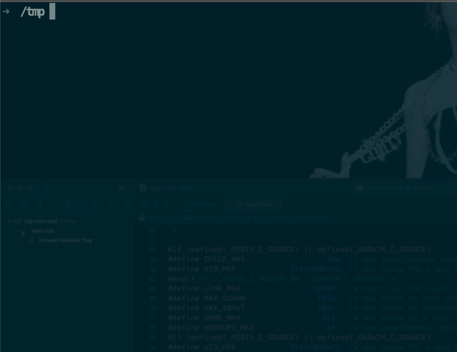

### 引言
- unix系统的正常运作需要使用大量与系统有关的数据文件, 如:
    - 口令文件`/etc/passwd, /etc/group`
- 在应用程序中, 也会要经常用到这些文件, 如`passwd`程序修改密码. 这些文件基本都是以固定格式的`ASCII`码存储. 在应用中, 我们要用这些文件时, 有2种途径:
    - 若有权限, 直接读取这些文件, 然后根据约定的格式, 应用自己解析
    - 调用操作系统的接口, 直接获取想要的内容, 操作系统内部解析的更高效,也更安全


<br/>


### 口令文件(`/etc/passwd`)
- 系统的口令文件, 也称用户数据库. 文件格式在前面的学习中已经介绍了, 这里以操作系统定义的结构再来给出以下描述

| 说明 | 成员 |
|  ----  |  ----  |
| <font color = deeppink>用户名 </font>| `char* pw_name`  |
| <font color = black>密码 </font>| `char* pw_passwd`  |
| <font color = deeppink>用户ID </font>| `uid_t pw_uid`  |
| <font color = deeppink>组ID </font>| `gid_t pw_gid`  |
| <font color = black>注释字段 </font>| `char* pw_gecos`  |
| <font color = deeppink>家目录 </font>| `char* pw_dir`  |
| <font color = deeppink>登录程序 </font>| `char* pw_shell`  |
| <font color = black>用户访问类</font>| `char* pw_class`  |
| <font color = black>下次更改口令时间 </font>| `time_t pw_change`  |
| <font color = black>账户有效期时间 </font>| `time_t pw_expire`  |

<br/>

> 表中的 <font color=deeppink>粉色</font>表示`POSIX`规定的, 但大多数平台支持的至少7种`后3种在linux的口令文件中没有`, 下面是以`Darwin`[^ann-darwin]和`linux`的部分数据

<br/>

```shell
1	_coreml:*:280:280:CoreML Services:/var/empty:/usr/bin/false
2	_sntpd:*:281:281:SNTP Server Daemon:/var/empty:/usr/bin/false
3	_trustd:*:282:282:trustd:/var/empty:/usr/bin/false
4	_mmaintenanced:*:283:283:mmaintenanced:/var/db/mmaintenanced:/usr/bin/false
5	_darwindaemon:*:284:284:Darwin Daemon:/var/db/darwindaemon:/usr/bin/false
6	_notification_proxy:*:285:285:Notification Proxy:/var/empty:/usr/bin/false
7	_avphidbridge:*:288:288:Apple Virtual Platform HID Bridge:/var/empty:/usr/bin/false
8	_biome:*:289:289:Biome:/var/db/biome:/usr/bin/false
9	_backgroundassets:*:291:291:Background Assets Service:/var/empty:/usr/bin/false
10	_oahd:*:441:441:OAH Daemon:/var/empty:/usr/bin/false

### 以上是mac, 发现只有7个字段


1	sshd:x:74:74:Privilege-separated SSH:/var/empty/sshd:/sbin/nologin
2	avahi:x:70:70:Avahi mDNS/DNS-SD Stack:/var/run/avahi-daemon:/sbin/nologin
3	postfix:x:89:89::/var/spool/postfix:/sbin/nologin
4	tcpdump:x:72:72::/:/sbin/nologin
5	liubo:x:1000:1000:liubo:/home/liubo:/bin/zsh
6	dockerroot:x:987:981:Docker User:/var/lib/docker:/sbin/nologin
7	tierry:x:1001:1003::/home/tierry:/bin/bash
8	sb01:x:1002:1004::/home/sb01:/bin/bash
9	sb:x:1003:1006::/home/sb:/bin/bash
10	ergou:x:1004:1008::/home/ergou:/bin/bash
### 以上是linux, 也是7个


###  以 : 隔开
#### 第1个: 用户名
#### 第2个: 密码, 若未设置则是空白, 若设置了会有一个标记, 如mac上是*, linux上是x, 系统会到另一个口令文件中去验证密码
#### 第3个: 用户id
#### 第4个: 组id
#### 第5个: 注释
#### 第6个: 家目录
#### 第7个: 会话的启动的程序, 这个项可以是空, 这个时候在linux上会默认为shell
```

<br/>

### 阻止登录
- 其实要实现这个功能还是很直接的,修改写一个程序, 然后直接退出
```cpp
int main(void){
    return(-1);       // 这里的返回码自己定制
}
```

> 将上面这个程序编译为`mynologin`, 然后为`tierry`的口令文件中的`程序项`指定到这个编写的程序, 那么tierry在登录后, 会直接报错返回给内核, 相当于阻止她登录
>
> 事实上linux中已经为这种相关禁止登录的需求做好了:
>   - 修改<font color = red>登录程序项</font>为`/dev/null`, 很明显它不是一个可执行文件, 但它在linux中是意义的 : <font color=red>阻止tierry登录到系统</font>.
>   - 同理修改为`/bin/false`或`/bin/nologin`这样在逻辑上也是直接阻止`tierry`登录

<br/>

### linux中的nobody
- 在口令文件中可能还见到如下的`nobody:x:99:99:Nobody:/:/sbin/nologin`或`nfsnobody:x:65534:65534:Anonymous NFS User:/var/lib/nfs:/sbin/nologin`. 它表示的意义是这2种用户登录后, 没有任何特权, 只能读取其他人赋开读写的文件, 自己不拥有任何文件


<br/>

### 获取用户信息
- 标准规定可以根据`用户id`和`用户名`来获取口令文件中对应用户的信息
```cpp
#include<pwd.h>
struct passwd* getpwuid(uid_t uid);
struct passwd* getpwnam(const char* name);

// 成功返回指针, 出错返回null
```

<br/> 

- 函数的返回值由书籍上说的, 是各自函数中的`static`变量, 所以不用关心内存的释放问题, 每次读取时, 都会重新填充

<br/> 

```cpp
#include<pwd.h>
#include<cstdio>
#include<cstdlib>

int main(int args, char** argv){
	// check args

	struct passwd* pd = getpwuid(atoi(argv[1]));
	// check error
	
	printf("uid:%d" "\n"
		   "nam:%s" "\n"
		   "pas:%s" "\n"
		   "gid:%d" "\n"
		   "hmo:%s" "\n"
		   "bas:%s" "\n",
			pd->pw_uid, 
			pd->pw_name,
			pd->pw_passwd,
			pd->pw_gid,
			pd->pw_dir,
			pd->pw_shell);

	return 0;
}
```

<br/>

```shell
id tierry
uid=1001(tierry) gid=1003(tierry) groups=1003(tierry)

/tmp ./main 1001            # 传递uid
uid:1001
nam:tierry
pas:x
gid:1003
hmo:/home/tierry
bas:/bin/bash
```

<br/>

> 可以发现, 是内核从文件中取到了数据后,转化给用户层面的我们, 并不能真正获取到密码

<br/>

### 获取口令文件的内容
- 一样的道理, 用户可以直接读取文件自己解析, 也可以调用系统提供的函数
```cpp
#include<pwd.h>
struct passwd* getpwent(void);
    
// 成功返回指针, 失败或到达文件末尾, 返回NULL

void setpwent(void);
void endpwent(void);
```
> 这3个函数要配合使用, 功能是: 遍历文件中的每一行, 返回这一行的`struct passwd`信息. 和`getpwuid`一样的返回值在`static`的空间, 不用关心释放的问题. `getpwent`是获取每一项. `setpwent`表示初始化一下, 因为并不清楚`getpwent`的当前指针, 所以一般在要读取口令文件时, 先清零从头开始.`endpwent`表示读取完毕后, 关闭文件. 需要说明的是, 遍历的顺序并不是确定的, 这个不考虑了, 由内核决定

```cpp 
#include<pwd.h>
#include<cstdio>
#include<cstdlib>

int main(int args, char** argv){
	// check args

	struct passwd* pd = nullptr;
	setpwent();
	
	while(pd = getpwent()){
		printf("%d" "<-->"
			   "%s" "<-->"
			   "%s" "<-->"
			   "%d" "<-->"
			   "%s" "<-->"
			   "%s" "\n",
				pd->pw_uid, 
				pd->pw_name,
				pd->pw_passwd,
				pd->pw_gid,
				pd->pw_dir,
				pd->pw_shell);
	}

	endpwent();
	return 0;
}
```

<br/>

> 只截取了一部分
```shell
987<-->dockerroot<-->x<-->981<-->/var/lib/docker<-->/sbin/nologin
1001<-->tierry<-->x<-->1003<-->/home/tierry<-->/bin/bash
1002<-->sb01<-->x<-->1004<-->/home/sb01<-->/bin/bash
1003<-->sb<-->x<-->1006<-->/home/sb<-->/bin/bash
1004<-->ergou<-->x<-->1008<-->/home/ergou<-->/bin/bash
```

<br/>


### 阴影口令
- 上面的口令文件中的密码项并不直接显示在文件中, 事实上unix也不会将密码存储在硬件的介质中. 它是在动态运行中, 将用户的密码经过单向的不可逆的加密后存储在另一个文件中,所以用户登录时,也是动态的验证. 校验文件是`/etc/shadow`. 该文件是不允许root之外的用户操作的

```shell
sudo cat /etc/shadow | tail -n 5
dockerroot:!!:18511::::::
tierry:$6$1P/6nzB/$3C5TbbLV9tWSKBl5kuJ.k9XMZ8TTkelxT/80uJZ63bZKeh0Hwa4YVGDfkZFpSNZUskN0Q89DvgvobmQTK7lTp0:19385:0:99999:7:::
sb01:!!:19385:0:99999:7:::
sb:$6$rg2UcH07$FjF2usNh7gMajKmG71Dl4aqw3yjRXvMoVJU03rpVRb4usUKzbGYGkygBGwPbUYgsQhcyrO3EryoAs6zXYIU711:19388:0:99999:7:::
ergou:$6$gN3SGh7u$Y/uQJ239ArOumaxIDu.Ya5OsED9mMj9MUPThSrWoVXDtyZ3RzO9bgZSjLqZ6zfAlT0kuh3VkXyNWpVQ.J2W/N1:19388:0:99999:7:::


## 第1项: 用户名
## 第2项: 加密后的字符串
## 第3项: 距离上次密码 修改成功后经历的时间(秒)
## 第4项: 几于后可以再次修改密码
## 第5项: 密码剩几天后失效(到时必须修改)
## 第6项: 密码失效后还可以用几天, 假如是失效后最多用3天, 第6项为1时, 表示还剩余1天时发警告
## 第7项: 用户不活动前剩余天数
## 第8项: 设置失效的天数
## 第9项: 保留
```
<br/>

> 相关的结构

| 说明 | spwd成员 |
|  ----  |  ----  |
| 同上面第1项  | `char* sp_namp` |
| 同上面第2项  | `char* sp_pwdp` |
| 同上面第3项  | `int sp_lstchg` |
| 同上面第4项  | `int sp_min` |
| 同上面第5项  | `int sp_max` |
| 同上面第6项  | `int sp_warn` |
| 同上面第7项  | `int sp_inact` |
| 同上面第8项  | `int sp_expire` |
| 同上面第9项  | `unsigned int sp_flag` |


<br/>

> 事实上只有用户名和密码这一项是必须的, 其他的是辅助, 限制密码更改的频率, 更安全


<br/>

### 读取阴影口令
```cpp
#include<shadow.h>
struct spwd*  getspnam(const char* name);
struct spwd*  getspent(void);
// 成功返回指针, 出错返回NULL

void setspent(void);
void endspent(void);
```
- 这几个函数的工作原理和`getpwent`是一样的


<br/>


### 组文件
- 用户拥有组相关的信息在`/etc/group`中(`linux`), 对应的结构
```cpp
#intlude<grp.h>
struct group{
    char* gr_name;              // 组名
    char* gr_passwd;            // 组密码
    int gr_gid;                 // 组id
    char** gr_name;             // 所有的附属组
};
```

<br/>

> 获取组信息

```cpp
#include<grp.h>
struct group* getgrgid(gid_t gid);
struct group* getgrnam(const char* name);

// 成功返回指针, 出错返回NULL
```

<br/>

> 获取组文件信息

```cpp
#include<grp.h>
struct group* getgrent(void);
// 成功返回指针, 出错或文件末尾返回NULL


void setgrent(void);
void endgrent(void);
```
> 这3个函数和`getpwent`一样


<br/>


### 附属组ID
- unix的权限判断用的是有效id与要操作文件的对应的id比较, 这个在上一章已经学习了. 当时提到过用户信息中有第2种类型的组, 这个组就是用户的附属组, 可以有多个, 也会参与权限的判断
- 附属组在unix最开始时,是没有的,是后来BSD加入的, 后来纳入了标准. 不同系统中用户的附加组数量是不同的, 要根据系统的选项去判断
```shell
sudo find /usr -name '*.h' | xargs -I abc grep -Hn "NGROUPS_MAX" abc
/usr/include/linux/limits.h:6:#define NGROUPS_MAX    65536

## 在linux上搜索出来的, 具体可以看下, 不同系统中的定义, 也可以调用配置函数来获取到这个值
```

<br/>

> 获取附属组id
```cpp
#include<unistd.h>
int getgroups(int gidsetsize, gid_t grouplist[]);
// 成功返回 获取到的附属id的数量, 失败返回-1


#include<unistd.h>
#include<grp.h>
int setgroups(int ngroups, const gid_t grouplist[]);     // FreeBSD, MacOS, Solaris
int initgroups(const char* uname, gid_t basegid);        // FreeBSD, MacOS

// 成功返回0, 出错返回-1
```

<br/>

### getgrops
- 获取 <font color=deeppink>当前会话用户</font> 的所属组. 参数`gidsetsize`表示数组的长度, 函数将附属组的信息填充到第2个参数`grouplist`中, 最后函数返回的是成功获取到的附属组的数量.

```cpp
#include<unistd.h>
#include<grp.h>
#include<cstdio>
#include<cstdlib>
#include<fcntl.h>
int main(int args, char** argv){
	gid_t gids[10] ={1000};
	auto num = getgroups(10, gids);
	if(num < 0){
		return -1;
	}
	while(num){
		printf("%d\n", gids[--num]);
	}
	return 0;
}
```

> 上面这个程序可以这样测试一下: 
> 程序`main` 对应的权限是`rwx r-x r-x`
> 2个用户:
>   - `liubo liubo(用户) liubo(组)`
>   - `tierry tierry(用户) tierry(组)`
> 1. `liubo`调用
> 2. `登录tierry`调用
> 3. 修改main的设置调用id位`rws r-x r-x`
> 4. `tierry`再次调用

<br/>



<br/>


### 修改用户的附加组
- 利用上面的2个函数`setgroups`和`initgroups`. 需要说明的是必须由root调用. 一般情况下`setgroups`由`initgroups`来调用. 先遍历所有的组(`/etc/groups`), 然后比对每一组与指定用户的关系, 根据需要添加


<br/>


### 其他数据文件
- 上面讨论了2种(<font color=green>口令和组文件</font>), 在unix中还有其他很多文件. 这些文件的操作和上面一样:
    - getxxx, 获取文件中的下一个记录
    - setxxx, 反绕一下, 从0开始取
    - endxxx, 关闭

<br/>

> 常用的数据文件

| 文件说明 | 数据文件 | 头文件 | 结构 | 附加的搜索函数 |
|  ----  |  ----  |  ----  |  ----  |  ----  |
| 口令文件 | `/etc/passwd`  | `<pwd.h>` | passwd | getpwnam, getpwuid |
| 组 | `/etc/group`  | `<grp.h>` | group | getgrnam, getgruid |
| 阴影 | `/etc/shadow`  | `<shadow.h>` | spwd | getspnam |
| 主机 | `/etc/hosts`  | `<netdb.h>` | hostent | getnameinfo, getaddrinfo |
| 网络 | `/etc/hosts`  | `<netdb.h>` | netent | getnetbyname, getnetbyaddr |
| 协议 | `/etc/protocols`  | `<netdb.h>` | portoent | getprotobyname, getprotobynumber |
| 服务 | `/etc/services`  | `<netdb.h>` | serent | getservbyname, getserverbyport |


### 系统标识
- 标准定义了`uname`函数, 返回与主机和操作系统相关的信息
```cpp
#include<sys/utsname.h>
int uname(struct utsname* name);
// 成功返回值 >= 0, 出错返回-1


struct utsname{
    char sysname[];         // 内核的名, 如MacOS的内核叫 Darwin
    char nodename[];        // 当前主机名
    char release[];         // 当前内核的 relase版本号
    char version[];         // 当前内核版本详细描述
    char machine[];         // cpu构架, 如X86_64等
}
```

<br/>

> 获取主机名的正确方式(`TCP\IP网络上的主机名`)
```cpp
#include<uinstd.h>
int gethostname(char* name, int namelen);
// 成功返回0, 出错返回-1
```


<br/>


### 时间和日期
- unix中有2种时间:
    - 日历时间
    - 进程时间

<br/>

### 日历时间(时间戳)
- 该时间是国际上标准的`UTC`表示 <font color=deeppink> 从公元1970年1月1日 00:00:00 到现在这一时刻经历的秒数</font>. 注意单位是秒, 用`time_t`表示, 称它为日历时间

```cpp
#include<time.h>

tiem_t time(time_t* calptr);

// 返回时间戳, 出错返回-1
```
> 可以自己指定缓冲区(`calptr`)来让unix填充. <font color=red>再次提醒这个时间的单位是秒</font>, 可以在shell中使用`date +%s`获取当前的时间戳

<br/>


### 进程时间
- 也称为CPU时间, 作用是统计CPU被占用的时间, 它的时间以`时钟滴答计算`. 历史上取过每秒`50, 60, 100`
> 使用`clock_t`来表示这种时间值, 可以使用`sysconf`来获取这个值

- 时钟滴答这里不细说, 简单理解成系统每隔多长时间来一次时钟中断, 所以:
    - 若`clock_t`为`50`, 则表示`1秒 / 50 = 1000毫秒 / 50 = 20毫秒`, 20ms一次时钟中断
    - 若`clock_t`为`100`, 则表示`1秒 / 50 = 1000毫秒 / 100 = 10毫秒`, 10ms一次时钟中断

> 上面这些值是理论上的, 不同的系统有计算这个时间间隔的宏. 标准库提供了`clock`函数获取当前进程从启动后到调用点的滴答时间(`微秒`)

<br/>

```cpp
#include<time.h>
clock_t clock(void);
// 返回当前 进程 从启动 到 调用点的 在用户态下执行的 时钟滴答时间
```

<br/>

> 统计代码运行的时间

```cpp
#include<cstdio>
#include<unistd.h>
#include<ctime>

typedef clock_t USEC_T;
#define SEC  (1)                    // __macro_0
#define USEC (1000000)              // __macro_1

int main(int args, char** argv){
	const auto tinterrupt = sysconf(_SC_CLK_TCK);           // __code_0
	printf("%d\n", tinterrupt);

	const auto cycle = USEC / tinterrupt;                   // __code_1

	USEC_T _1 = clock();                                    // __code_2

	for(int i = -1; ++i < 1e9;){}                           // __code_3

	USEC_T _2 = clock();                                    // __code_4

	auto dif = _2 - _1;                                     // __code_5
	auto ncycle = dif / cycle;                              // __code_6
	auto stime = dif * 1. / USEC;                           // __code_7
	printf("%d--%d: num-cycle:%d %f\n", _1, _2, ncycle,  stime);

	return 0;
}
``` 
> 上面这个程序:
> `__macro_0` 表示的秒
> `__macro_1` 表示 微秒
> `__code_0` 获取当前系统的时钟滴答
> `__code_1` 表示时钟滴答间隔, 当然只是理论上的(`案例是以微秒为单位`)
> `__code_2` 表示获取当前进程从运行起到这里所花的用户态时间(`微秒`)
> `__code_3` 用户态执行耗时代码
> `__code_4` 获取用户态耗时代码完毕后的时间(`微秒`)
> `__code_5 和 __cade_7`计算`__code_3`所花的时间
> `__code_6`粗略计算出被中断的次数
>
>
> ps:实际上标准库中给出了一个宏`CLOCKS_PER_SEC`, 就相当于上面的`USEC`
>
> 若知道一段代码的中断次数, 则可以大致估算出所耗的时间`num * cycle / USEC`, 这个表达式是以微秒为单位来算

<br/>

```shell
➜  /tmp time ./main
100
0--1720000: num-cycle:172 1.720000
./main  1.72s user 0.00s system 92% cpu 1.873 total
➜  /tmp time ./main
100
0--1730000: num-cycle:173 1.730000
./main  1.73s user 0.00s system 92% cpu 1.888 total
➜  /tmp time ./main
100
0--1710000: num-cycle:171 1.710000
./main  1.71s user 0.00s system 92% cpu 1.858 total
➜  /tmp
```

<br/>

### 系统时间
- 系统时间的精度要比time函数高, unix以时钟类型来获取不同的系统时间

| 标识符 | 选项 | 说明 |
|  ----  |  ----  |  ----  |
| `CLOCK_REALTIME` |  | 实时系统时间  |
| `CLOCK_MONOTONIC` | `_POSIX_MONOTONIC_CLOCK`  | 不带负跳数的实时系统时间  |
| `CLOCK_PROCESS_CPUTIME_ID` | `_POSIX_CPUTIME`  | 调用进程的CPU时间  |
| `CLOCK_THREAD_CPUTIME_ID` | `_POSIX_THREAD_CPUTIME`  | 调用线程的CPU时间  |


<br/>

> 测试代码运行的时间

```cpp
#include<cstdio>
#include<unistd.h>
#include<ctime>

#define NSEC (1000000000)
int main(int args, char** argv){


	struct timespec begin = {0};
	clock_gettime(CLOCK_PROCESS_CPUTIME_ID, &begin);
	for(int i = -1; ++i < 1e9;){}
	struct timespec end = {0};
	clock_gettime(CLOCK_PROCESS_CPUTIME_ID, &end);

	printf("before:%d -- %d\n", begin.tv_sec, begin.tv_nsec);
	printf("after :%d -- %d\n", end.tv_sec, end.tv_nsec);

	auto dif = end.tv_nsec < begin.tv_nsec ? 1 : 0;
	auto tmp = (end.tv_nsec + dif * NSEC - begin.tv_nsec);
	auto tmp2 = tmp * 1.0 / NSEC;
	auto sec = end.tv_sec - begin.tv_sec - dif + ((end.tv_nsec + dif * NSEC - begin.tv_nsec) * 1. / NSEC);

	printf("time :%f\n", sec);


	return 0;
}
```

> 测试结果
```cpp
➜  /tmp for i in {1..3}; do (time ./main; echo "---";) ; done;
before:0 -- 3269103
after :1 -- 715156725
time :1.711888
./main  1.71s user 0.00s system 92% cpu 1.863 total
---
before:0 -- 1151484
after :1 -- 669250445
time :1.668099
./main  1.67s user 0.00s system 92% cpu 1.811 total
---
before:0 -- 1136969
after :1 -- 672555244
time :1.671418
./main  1.67s user 0.00s system 92% cpu 1.815 total
---
```

<br/>

### 获取不同 <font color=deeppink>时钟精度</font>
- 不同的时钟精度是不一样的, 系统提供了函数来获取对应时钟精度. 也就是说上述提供的`clock_gettime`并不是绝对的纳秒, 在对其使用时要先获取到这对应时钟的时间精度, 如:
    - 若指定的时间精度是 <font color=deeppink>毫秒</font>, 则对应的`timespec`中纳秒的部分就为`1000,000`
    - 若指定的时间精度是 <font color=deeppink>纳秒</font>, 则对应的`timespec`中纳秒的部分就为`1`

```cpp
#include<sys/time.h>
int clock_getres(clockid_t clock_id, struct timespec* tsp);
// 成功返回0, 出错返回-1
```

<br/>


### case-获取时钟精度(<font color=green>linux和mac</font>)
```cpp
#include<iostream>
#include<sys/time.h>
#include<tuple>

using namespace std;
int main(int args, char** argv){
	using MYTuple = tuple<clockid_t, const char*>;

	MYTuple arr[] = {
		MYTuple(CLOCK_REALTIME, "实时系统时钟"),
		MYTuple(CLOCK_MONOTONIC, "不带负跳数的实时系统时间"),
		MYTuple(CLOCK_PROCESS_CPUTIME_ID, "调用进程的CPU时间"),
		MYTuple(CLOCK_THREAD_CPUTIME_ID, "调用线程的CPU时间"),
	};
	for(int i = -1, j = sizeof(arr) / sizeof(MYTuple); ++i < j;){
		auto& t = arr[i];
		timespec tme;
		auto res = clock_getres(get<0>(t), &tme);
		if(res < 0){
			cerr << get<1>(t) << " err\n";
			continue;
		}
		cout << get<1>(arr[i]) << ":" << tme.tv_nsec << endl;
	}
}
```
> 上述程序在linux及mac中执行的结果如下:

```shell
实时系统时钟:1
不带负跳数的实时系统时间:1
调用进程的CPU时间:1
调用线程的CPU时间:1

# 表示时钟的精度是纳秒


实时系统时钟:1000
不带负跳数的实时系统时间:1000
调用进程的CPU时间:1000
调用线程的CPU时间:42
#在mac中精度大部分是 微秒(1us = 1000ns)
```


### case-linux纳秒时间戳(非标准)
- 其实 <font color=deeppink>clock_gettime</font>所获取的值就是时间戳, 是纳秒级别的, 但这不是通用的, 因为国际上定义的是通用的时间戳是秒
```cpp
#include<iostream>
#include<time.h>


int main(int args, char** argv){
    using std::cout;
    using std::endl;
    using std::cerr;
    cout << "now timestamp " << time(0) << endl;
    struct timespec t;
    if(clock_gettime(CLOCK_REALTIME, &t) < 0){
        cerr << strerror(errno) << endl;
        exit(-1);
    }
    cout << "now timestamp sec(" << t.tv_sec << ") nsec:(" << t.tv_nsec << ")\n";
    return 0;
}
```
> 运行结果如下:
```shell
now timestamp 1680311501
now timestamp sec(1680311501) nsec:(547634976)
```

<br/>

### 修改系统的时钟时间
- 我们可以通过不同的方式来修改当前系统的时间
    - 桌面环境下, 以可视化的方式来修改
    - 在shell中, 也可以通过相应的命令来修改(<font color=green>一般要有系统权限</font>)
    > 上述2种方式的本质是系统调用`clock_settime`

- 下面的图是在mac中以桌面方式来设置


> 下面的的代码,通过root运行可以修改当前的系统时间(<font color=green>linux</font>)
```cpp
#include<iostream>
#include<time.h>
#include<cstring>

int main(int args, char** argv){
    using std::cout;
    using std::endl;
    using std::cerr;
	timespec t;
	clock_gettime(CLOCK_REALTIME, &t);                      
	t.tv_sec += (3600 * 72);   // add 3 day
	auto res = clock_settime(CLOCK_REALTIME, &t);               // 指定修改当前的实时时钟
	if(res < 0){
		perror("set");
		exit(-1);
	}
}
```

<br/>

### 获取微秒的时间戳(<font color=green>gettimeofday</font>)
- 上面获取高精度的时间戳得先看对应的时钟的精度, 系统提供了一个微秒级别的时间戳, 但这个函数在某些系统上已经弃用
```cpp
#include<sys/time.h>
int gettimeofday(strut timeval* t, void* tzp);
// 问题返回0
```
> 关于参数`tzp`在标准下 <font color=red>唯一合法值是NULL</font>, 在其他平台下可能被指定为时区, 所以一般情况下给一个空
> 参数`timeval`也是一个时间结构, 和前面的`timespec`是不一样的, 它表示到微秒
```cpp
struct timeval{
    long tv_sec;            // 秒
    int  tv_usec;           // 微秒
};
```

<br/>

### 时间分解
- 上述获取的时间都是时间戳, 在实际应用级别的开始中, 常常需要的是 <font color=deeppink>日期格式</font>, 系统提供了将对应的整数时间戳转化成日期的函数, 先来看看日期的结构
```cpp
struct tm{
    int     tm_sec;                             // 秒 [0, 60]
    int     tm_min;                             // 分 [0, 59]
    int     tm_hour;                            // 时 [0, 23]
    int     tm_mday;                            // 天 [1, 31]
    int     tm_mon;                             // 月 [0, 11]
    int     tm_year;                            // 年 [1900, ]
    int     tm_wday;                            // week, 从 周日(0)开始, 到周六(6)
    int     tm_yday;                            // 这一年的第几天 [0, 365]
    int     tm_isdst;                           // 夏令时, 若生效则 >0,  若非夏令时, 则为0,  不可用时为负
};

// 第可以到达60的原因是 润秒
```

<br/>

### 时间戳到`struct tm`
```cpp
#include<time.h>
struct tm* gmtime(const time_t* calptr);
struct tm* localtime(const time_t* calptr);
// 出错返回NULL
```
> <font color=red>localtime</font>将日历时间(<font color=green>时间戳</font>)转化为 <font color=red>本地日期</font>(<font color=green>考虑到时区</font>)
> 这里返回的是一个指针, 它并不是在堆空间中, 实际上是一个static变量, 每次获取都会被填充

```cpp
#include<iostream>
#include<time.h>
#include<cstring>

#define TIME_YEAR_BEGIN (1900)

int main(int args, char** argv){
    using std::cout;
    using std::endl;
    using std::cerr;

	auto tmp_time = time(0);
	auto tmp_tm_0 = gmtime(&tmp_time);
	if(!tmp_tm_0){
		perror("gmtime");
		return -1;
	}


	auto tmp_tm_1 = localtime(&tmp_time);
	if(!tmp_tm_1){
		perror("gmtime");
		return -1;
	}
	cout << tmp_tm_0 << endl;
	cout << tmp_tm_1 << endl;
	printf("%04d-%02d-%02d %02d:%02d:%02d\n", tmp_tm_0->tm_year + TIME_YEAR_BEGIN, tmp_tm_0->tm_mon + 1, tmp_tm_0->tm_mday, tmp_tm_0->tm_hour, tmp_tm_0->tm_min, tmp_tm_0->tm_sec);

}
```
> 在linux上执行的结果
```shell
0x7f9fc3edbd40
0x7f9fc3edbd40
2023-04-05 10:52:46        
```
> 这里测试时有2个结论:
>   1. 不管哪个函数返回的地址是一样的
>   2. 这个结论是隐藏的, 在打印时用的是`tmp_tm_0`, 而`tmp_tm_0`是通过`gmttime`获取的, 是没有时区的, 但在打印前, 调用了`localtime`, 因为是同一个地址, 所以又被填充了, 最终打印时, 数据已经被改变, 打印的时间是本地的时间, 并不是标准的GMT0的时间


<br/>

### tm格式化
```cpp
#include<time.h>

size_t strftime(char* buf, size_t buf_max_len, const char* format, const struct tm* tm_ptr);
size_t strftime_l(char* buf, size_t buf_max_len, const char* format, const struct tm* tm_ptr, locale_t locale);

// 返回填充到buf的实际字符数量, 若没有空间,返回0
// 返回的字符数量中不包括 null
```
> <font color=red>strftime</font>默认取的时区是`TZ环境变量`(<font color=green>并不是shell中的环境变量, 每个进程有自己当前的环境变量</font>)
> <font color=red>strftime_l</font>的时区是用户指定的
> 函数向buf中填充时, 会追加一个null


### 格式化参数

- 下面以一个简单的例子来说明, 环境在`MacOS`
```cpp
#include<iostream>
#include<tuple>
#include <ctime>
#include <vector>
#include <map>

using namespace std;
int main(int args, char** argv){
    extern char** environ;


    struct timespec ts;
    if(clock_gettime(CLOCK_REALTIME, &ts) < 0){
        perror("get time");
        exit(-1);
    }

    auto ptr = gmtime(&ts.tv_sec);
    if(!ptr){
        perror("gmt time");
        exit(-1);
    }

    vector<pair<const char*, const char*>> src;
    src.push_back(pair<const char*, const char*>("年(低2位)", "%g"));
    src.push_back(pair<const char*, const char*>("年(全)", "%G"));

    src.push_back(pair<const char*, const char*>("月(简)", "%b"));
    src.push_back(pair<const char*, const char*>("月(全)", "%B"));
    src.push_back(pair<const char*, const char*>("月(数字01~12)", "%m"));


    src.push_back(pair<const char*, const char*>("日(月日01~31)", "%d"));
    src.push_back(pair<const char*, const char*>("日(年日001~366)", "%j"));


    src.push_back(pair<const char*, const char*>("日期时间", "%c"));
    src.push_back(pair<const char*, const char*>("日期(mm/dd/yy)", "%D"));
    src.push_back(pair<const char*, const char*>("日期(yyyy-mm-dd)", "%F"));

    src.push_back(pair<const char*, const char*>("周(monday=1, 1~7)", "%u"));


    src.push_back(pair<const char*, const char*>("时(24)", "%H"));
    src.push_back(pair<const char*, const char*>("时(12)", "%I"));

    src.push_back(pair<const char*, const char*>("分(00~59)", "%M"));
    src.push_back(pair<const char*, const char*>("秒(00~60)", "%S"));

    src.push_back(pair<const char*, const char*>("时间(12小时 hh:mm:ss a/pm)", "%r"));
    src.push_back(pair<const char*, const char*>("时间(24小时 hh:mm:ss)", "%T"));


    src.push_back(pair<const char*, const char*>("时区", "%Z"));


    char buf[0x40] = {0};
    auto lam = [ptr](auto& fm_pair, auto buf, auto len) -> void{
        auto res = strftime(buf, len, fm_pair.second, ptr);
        if(res == 0){
            return;
        }
        cout <<fm_pair.first << "\n\t\t" << buf << endl;;
    };
    for_each(src.begin(), src.end(), [&](pair<const char*, const char*> p)->void{
        lam(p, buf, 0x40);
    });
}
```
> 运行结果:
```shell
年(低2位)
		23

年(全)
		2023

月(简)
		Apr

月(全)
		April

月(数字01~12)
		04

日(月日01~31)
		01

日(年日001~366)
		091

日期时间
		Sat Apr  1 06:14:04 2023

日期(mm/dd/yy)
		04/01/23

日期(yyyy-mm-dd)
		2023-04-01

周(monday=1, 1~7)
		6

时(24)
		06

时(12)
		06

分(00~59)
		14

秒(00~60)
		04

时间(12小时 hh:mm:ss a/pm)
		06:14:04 AM

时间(24小时 hh:mm:ss)
		06:14:04

时区
		UTC
```
> 这里用到了泛型lambda, c++的版本要到14及以上


<br/>

### tm反格式化
- 上述将tm转化成了可读的字符串, 也可以反过来将字符串转化成tm结构, 系统提供了这样的函数
```cpp
#include<time.h>
char* strptime(const char* buf, const char* fmt, struct tm* tmptr);
// 书籍中说 返回的是 上一次解析的字符的下一个字符的指针(这句话没懂)
// 否则返回NULL
```

> 下面是一个简单的例子
```cpp
#include<iostream>
#include<ctime>

int main(int args, char** argv){
    const char* buf = "2023-04-01 06:14:04";

    struct tm tmp;
    auto res = strptime(buf,"%F %T", &tmp);         // 这里对应的格式是 strftime中的fmt格式
    printf("%s\n", res);
    printf("%d-%d-%d\n", tmp.tm_year + 1900, tmp.tm_mon + 1, tmp.tm_mday);
}
```
> strptime的第2个参数fmt, 并不是和`strftime`中是一致的, 但总的来说差不多, 具体的格式可以查看书籍中的描述, 这里给出的fmt值是上面的strftime对应的格式


[^ann-darwin]: 苹果内核, 是从freeBSD的一个分支过来的, 这里不说了


