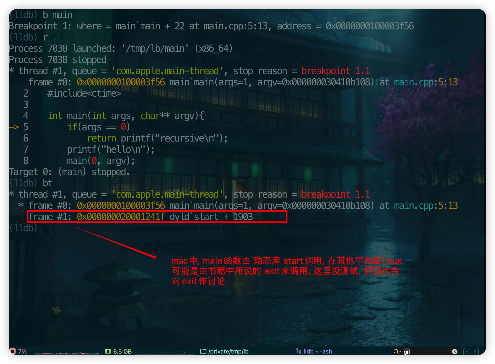
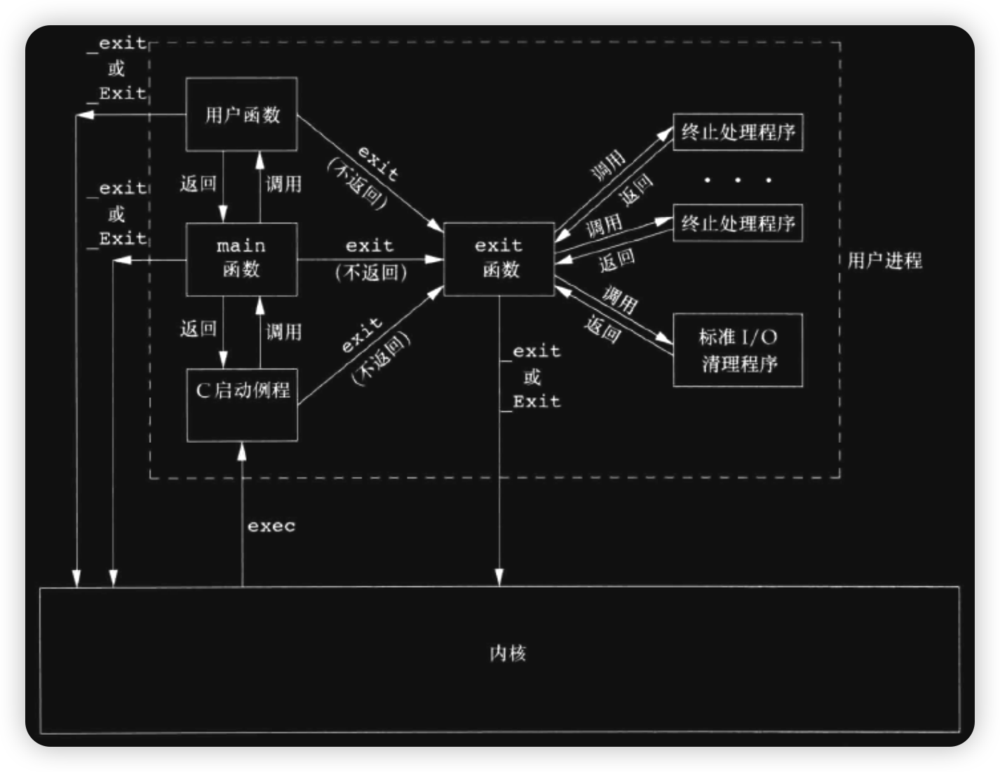
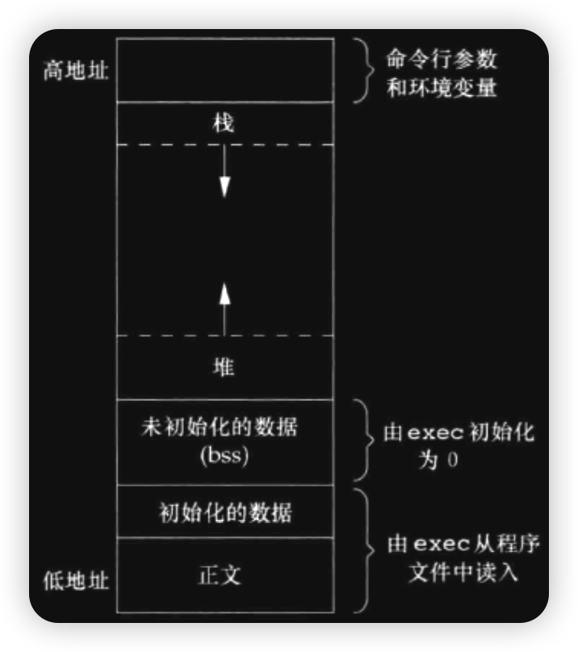
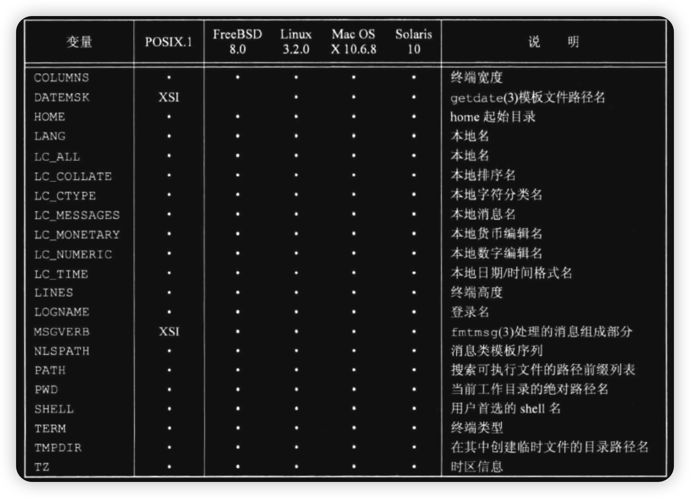

### 引言
- 本章将介绍进程的环境, 包括:
    - 进程的概念
    - main函数如何被调用
    - 命令行参数
    - 进程的内存布局
    - 进程增加存储空间
    - 进程如何使用环境变量 
    - 进程的终止方式
    - 函数的栈桢跳转(<font color=green>longjmp和setjmp</font>)


### 什么是进程
- 程序的生命周期:
    1. 编写程序(<font color=green>C,CPP,OC等</font>)
    2. 编译(<font color=green>由编译器</font>)成可执行文件, 存储在磁盘上的某个位置
        - 说明程序也是一个种文件, 由操作系统来处理的一种特殊文件, 所以编译到不同的系统中, 文件中内容的格式是不一样的
    3. 由内核来读取 <font color=deeppink>step2</font>所产生的二进制文件, 加载到内存的不同区域来由cpu执行, 此时 <font color=deeppink>产生进程</font>
    4. 进程执行过程中, 然后可能正常也可能异常终止, 进程结束, 内核回收这个进程, 进程被结束掉

> 即进程是动态的, 由二进制文件决定, 当进程开始后, 它和对应的二进制文件没有直接的关系. 进程在运行的过程中占据着一定的资源,如 <font color=red>打开的文件,设备等</font>. 进程被加载到内存时是被分散加载的, 如 <font color=red>代码区,初始化段,未初始化段[^ann-bss]等</font>. 操作系统对运行的进程进行着高效的管理, 所以进程在运行过程中会有很多种状态, 相应的这种状态的变化会由操作系统提供的机制来在应用层面作出监听, 后面会一一介绍


### main函数
- 历史上main函数的原型被修改过很多次, 但这里只以最终的标准来说, 现在不同的编译器可能支持main函数的不同写法, 但不推荐
```cpp
int main(int argc, char* argv[]);

// argc是命令行参数的数目
// argv是一个 指针数组, 里面存放的 字符串(命令行参数)
```
> <font color=red>这里需要说明一下, 前面案例中出现的是`args和 char** argv`, 这是本人的习惯, args同argc, `char**`其实是和`char* []`是等价的</font>, 标准也规定了argv的最后一个元素为NULL

<br/>


### 打印命令参数
```cpp
#include<iostream>
#include<ctime>

int main(int args, char** argv){
    while(*argv){
        printf("%s\n", *argv++);
    }
}
```


### main返回值
- 作为一个特殊的函数, main函数可以不写出`return num`, 但 <font color=deeppink>同时也有一个隐患, 返回值是不确定[^ann-main-return]的</font>. 以下是在`Mac`系统下的测试

```cpp
int main(int args, char** argv){}
```
> 未写出任何return语句, 编译器也不会报错. 最终返回的是0[^ann-uinx-return-status-suc]

<br/>


```cpp
#include<cstdio>
int main(int args, char** argv){
    printf("hello world\n");
}
```
> 在当前Mac上返回的还是0(<font color=green>编译器是clang++</font>). 可能编译到其他系统中, 返回值就不确定了. 因为printf也有返回值, 当调用完该函数后, 返回的是写入的字符数量, 并且存储在了寄存器`ax`中, 接着main返回, ax不变, 就直接将值返回到了调用main函数的函数中


<br/>

### 调用main函数的函数
- 因为main函数本质上也是一个函数, 所以它也是被其他函数调用的, 用户也可以调用main



<br/>

> 上述的环境是在`Mac M2`(<font color=green>arm64</font>), 说明内核在执行一个程序时, `exec`函数后 <font color=red>最先被调用的函数是start</font>, <font color=red>有的文章说的是由编译器生成的启动函数, 这是不对的, 因为启动函数是操作系统层面, 不同系统下的可执行的C程序文件格式是不一样的, 所以还是如书籍上所说的, 这个函数是系统定义好的, 编译器在对应的系统上会按照约定定义好入口函数main, 然后由链接器调用这个启动函数, 再由这个启动函数调用到main</font>, 该函数内部在 <font color=red>调用main之前</font>, 会做`进程的运行环境准备`(<font color=green>也叫c-runtime</font>如开辟命令行参数空间, 调用exit等), 从而调用到malloc函数, 这一点后面会给出案例测试
> 需要说明的是`exec`是系统调用, 它的工作机制后面会单独细说

<br/>

### Darwin下命令行程序的启动过程简述
- 先声明一点:
    - 笔者此刻并无内核相关知识领域
    - 笔者也未看过关于其他Mac程序启动的过程介绍
    - 因为当前的环境是`arm64`, 笔者对相关的指令并不熟悉, 所以若是分析汇编, 则先要花费不少时间去学习arm, 所以并不是以汇编来探究这个过程
    - 这里只是通过lldb来调试, 来简单猜想一下, 启动过程
> 由于 <font color=red>从启动到main</font>这个过程会经历非常多的步骤, 若将 <font color=red>断点打在main函数</font>, 这中间可能经历多次的函数调用, 相应的一些调用可能已经结束, 所以必须将断点断在所有函数存在的状态. 基于上面的分析, 启动函数一定会调用标准库的内存分配函数`malloc`,所以可以断点在malloc. 当然当断点被捕获时, 可能还未进入到main函数, 但无关紧要, 因为当前第1次断点已经可以看出大部分东西了


<br/>

- 程序的架构
    - 2个可执行文件: <font color=deeppink>main和test</font>
        - main函数是C++程序
        - test是OC程序(<font color=green>为了在代码中打印出当前的栈桢</font>)
    - main函数内部通过`exec`调用`test`, 并传递相关的命令行参数

```shell
.
├── main
├── main.cpp
├── main.out
├── test
└── test.m
```

<br/>

> 相关代码(`main.cpp`)

```cpp
#include<unistd.h>
#include<iostream>

static char* arg0;

void* exec_test(void* parm){
    std::cout << "sub thread start\n";
    execl("./test", arg0, nullptr); 
    std::cout << "sub thread over\n";
    return nullptr;
}

int main(int args, char** argv){
    std::cout << "m pid:" << getpid() << std::endl;

    ::arg0 = (char*)malloc(6);
    arg0[5] = '\0';
    memcpy(arg0, "hello", 5);


    pthread_t pid;
    pthread_create(&pid, nullptr,  exec_test, nullptr);
    
    std::cout << "process wail pasue\n";
    pause();                                    // __code_m_pasue
    
    pthread_detach(pid);
    std::cout << "main thread over\n";          // never  __code_m_cout
    free(::arg0);
    return 0;
}
```

<br/>

> 相关代码(`test.m`),该程序使用OC编写
```objc
#import<Foundation/Foundation.h>

int main(int args, char** argv){
    NSLog(@"s pid: %d, %d\n", getpid(),args);
    sleep(1);
    while(*argv){
        NSLog(@"%s", *(argv++));
    }

    NSLog(@"%d\n %@", getpid(), NSThread.callStackSymbols);
}
```
> 编译`clang test.m -framework Foundation -objc-arc -o test`
> `__code_m_pause`实际上暂停的是`线程`, 就算是先执行到这里, `子线程也会exec`, 当exec后当前进程被替换成了`test`进程, 但进程id没有改变, 所以`__code_m_cout`这里永远不会来的, 下面给出测试的结果

```shell
for i ( {1..2} ) {echo -e "\n"; ./main; }                       ## 循环执行2遍


m pid:10324                                                     # main的进程id
process wail pasue                                              # main暂停
sub thread start                                                # 说明 main 暂停的本质还是线程, 所以子线程不受影响
2023-04-04 20:41:14.649 test[10405:122505] s pid: 10405, 1      # NSLog打印格式, 进程id未变, 说明main的镜像已被test替换
2023-04-04 20:41:15.655 test[10405:122505] hello                
2023-04-04 20:41:15.656 test[10405:122505] 10405                # exec传递来的参数
 (
	0   test                                0x000000010225cf57 main + 135
	1   dyld                                0x00000002024fb41f start + 1903
)                                                               # 调用栈


m pid:10406                                                     # 第2次打印
process wail pasue
sub thread start
2023-04-04 20:41:15.691 test[10406:122516] s pid: 10406, 1
2023-04-04 20:41:16.697 test[10406:122516] hello
2023-04-04 20:41:16.698 test[10406:122516] 10406
 (
	0   test                                0x000000010429bf57 main + 135
	1   dyld                                0x000000020432241f start + 1903
)
```
> 从上面的测试中, 可以看到, 在test中, main被调用时, 函数栈中只有2个函数:
>   1. 启动函数(`start`)
>   2. main函数
> 因为这里要探究Darwin(<font color=green>Mac</font>)中程序启动的过程(简述),所以下面的测试步骤:
>   1. 用lldb调试main
>   2. 在malloc设置断点

```shell
 ➜ lb lldb main
(lldb) target create "main"
Current executable set to '/tmp/lb/main' (x86_64).
(lldb) b malloc
Breakpoint 1: 3 locations.                                      # 设置断点在malloc


(lldb)r hello world this is                                     # lldb 开始main
Process 10473 launched: '/tmp/lb/main' (x86_64)
Process 10473 stopped
* thread #1, queue = 'com.apple.main-thread', stop reason = breakpoint 1.3
    frame #0: 0x00007ff803442f20 libsystem_malloc.dylib`malloc
libsystem_malloc.dylib`malloc:
->  0x7ff803442f20 <+0>:  movq   %rdi, %rsi
    0x7ff803442f23 <+3>:  leaq   0x41b290d6(%rip), %rdi    ; virtual_default_zone
    0x7ff803442f2a <+10>: movl   $0x1, %edx
    0x7ff803442f2f <+15>: jmp    0x7ff80345fd05            ; _malloc_zone_malloc
Target 0: (main) stopped.                                       # 来到malloc


(lldb) bt                                                       # 查看当前栈桢
* thread #1, queue = 'com.apple.main-thread', stop reason = breakpoint 1.3
* frame #0: 0x00007ff803442f20 libsystem_malloc.dylib`malloc
frame #1: 0x00007ff8032792cd libobjc.A.dylib`_objc_init + 333
frame #2: 0x00007ff8034716a9 libdispatch.dylib`_os_object_init + 13
frame #3: 0x00007ff80347f567 libdispatch.dylib`libdispatch_init + 363
frame #4: 0x00007ff80fb04898 libSystem.B.dylib`libSystem_initializer + 238
frame #5: 0x000000020002f41b dyld`invocation function for block in dyld4::Loader::findAndRunAllInitializers(dyld4::RuntimeState&) const::$_0::operator()() const + 175
frame #6: 0x000000020006db6a dyld`invocation function for block in dyld3::MachOAnalyzer::forEachInitializer(Diagnostics&, dyld3::MachOAnalyzer::VMAddrConverter const&, void (unsigned int) block_pointer, void const*) const + 242
frame #7: 0x0000000200061f22 dyld`invocation function for block in dyld3::MachOFile::forEachSection(void (dyld3::MachOFile::SectionInfo const&, bool, bool&) block_pointer) const + 577
frame #8: 0x00000002000120af dyld`dyld3::MachOFile::forEachLoadCommand(Diagnostics&, void (load_command const*, bool&) block_pointer) const + 245
frame #9: 0x00000002000610bf dyld`dyld3::MachOFile::forEachSection(void (dyld3::MachOFile::SectionInfo const&, bool, bool&) block_pointer) const + 175
frame #10: 0x000000020006d72a dyld`dyld3::MachOAnalyzer::forEachInitializer(Diagnostics&, dyld3::MachOAnalyzer::VMAddrConverter const&, void (unsigned int) block_pointer, void const*) const + 470
frame #11: 0x000000020002c68c dyld`dyld4::Loader::findAndRunAllInitializers(dyld4::RuntimeState&) const + 220
frame #12: 0x00000002000351f4 dyld`dyld4::PrebuiltLoader::runInitializers(dyld4::RuntimeState&) const + 30
frame #13: 0x000000020004dbdd dyld`dyld4::APIs::runAllInitializersForMain() + 65
frame #14: 0x0000000200017874 dyld`dyld4::prepare(dyld4::APIs&, dyld3::MachOAnalyzer const*) + 3761
frame #15: 0x00000002000163bd dyld`start + 1805
```
> 虽然此时还未进入到main函数, 但程序一定会调用malloc分配内存, 从栈桢可以看出, 从start后, 系统大致做了如下的事情:
>   1. 准备(`prepare`): 根据lldb的打印, 可以猜测出它调用`Mach-O分析器`
>   2. 启动所有关于main的初始化(`runAllInitializersForMain`)
>   3. 准备构建Loader(`PrebuiltLoader`)
>       - 做内核的同学一定熟悉这个, iOS领域中在国内比较大型的公司出的第3方库中有很多调用系统启动的Loader函数
>   4. Loader再初始化(`findAndRunAllInitializers`), 传递给`Mach-O`解析器(MachOAnalyzer)
>   5. `Mach-O`解析器遍历所有的`初始化器`(forEachInitializer), 并 <font color=deeppink>将有关初始化的信息回调给外界</font>(通过` block_pointer`), 事实上只是找出了用户注册相关的函数,传递到后面调用(`回调给用户`)
>       - 这也说明了在代码层面, 我们可以 <font color=deeppink>通过系统层面提供的注册API</font>做到在加载程序<font color = deeppnik>Image</font>(<font color=green>镜像</font>)时做一些自定义操作, 这些操作是在main函数之前. <font color=deeppink>记得以前看过腾讯直播框架中某些操作就是通过这种方式事先注册一些事件监听</font>. 大家可以自己找一下系统相关的API
>   6. 一直到malloc之前, 都是解析`Mach-O`的过程, 这期间就是找出用户注册的函数, 然后回调给用户
>       - 大致有2种格式的回调
>           - `void(SectionInfo&, bool, bool&)`
>           - `void(unsinged)`
>       - 这里可以到Mac的系统文件中找到对应的函数指针
>   7. 后续到直到malloc
>       - mallock第1次调用时, 内部会做很复杂的操作, 主要是`向系统获取申请堆空间`, 然后内部做内存池, 具体这里不说了
>
> 这里虽然将断点打在了malloc, 但在调用到malloc前, 可能有些函数已经调用完毕, 但这里就不实了,具体c函数的启动过程, 可以参照linux, 其他系统的过程在流程功能上差不太多, <font color=red>还有一点, start函数在调用完main函数后, 会调用标准规定的`exit`</font>(<font color=green>关于exit后面会细说</font>)
>
> 思考一个问题: 当前的`main.cpp`程序到底本质还是由被`exec`调用, 为什么看不到`exec`函数的栈桢信息?
>   - 原因: 虽然现在还没有学习exec, 但还是要说明一下:
>       - exec之前的进程有自己的进程空间(`heap stack text段等`), exec后, 进程的空间被操作系统用新的可执行程序替换了, 所以原来相关的进程中的堆栈空间的信息已经不存在了, start函数的调用已经处在了新的进程空间中, 所以lldb调试器可以获取到它, 而所谓的exec函数本就是被替换前的进程空间的东西, 所以当前lldb是看不到被替换前的exec的栈桢信息的

<br/>


### main函数的8种返回格式
- 在<font color = deeppink>用户层面</font>来看, 程序结束的标志是<font color=deeppink>main函数退出</font>, 但事实上如前面说, main函数返回后, 会回到start函数, 它会做善后, 调用exit正式结束进程. 当然这是正常结束main, main函数也可能被异常结束, 但不管怎么说, main是不是正常结束, 都会有相应的机制来做善后工作, main函数总共有8种被结束的情景:
    - <font color=deeppink>从main函数返回</font>(<font color=green>return xxx</font>)
    - 调用`exit`
    - 调用`_exit 或 _Exit`
    - 该进程 <font color=deeppink>的最后一个线程正常返回</font>
    - 该进程 <font color=deeppink>的最后一个线程调用`pthread_exit`</font>
    - 进程自己调用`abort`
    - 被未做处理的终止信号所结束
    - 该进程 <font color=deeppink>的最后一个线程被cancel</font>
> <font color=red>前5种是正常结束</font>, <font color=red>后3种是异常结束</font>. 如上面所说, 不管怎么结束, 都会被善后


<br/>

### `exit`及`_Exit`
- 若进程的正常 <font color=deeppink>不是自己调用exit</font>, 则`exit`会由`start`函数调用. 它有3种调用格式:
```cpp
#include<stdlib.h>          // C标准库
void exit(int status);      
void _Exit(int status);     


#include<unistd.h>          // 标准unix
void _exit(int status); 
```
> 需要注意的是, 只有`_exit`是 <font color=red>系统调用</font>, 所以`exit 和 _Exit`是依赖于`_exit`的.
> `exit`和`_Exit`是C标准, 但场景不同:
>   - `exit`在系统调用前(<font color=green>调用`_exit`</font>), 会冲洗所有的标准IO流到系统IO; 关闭所有的IO流; 调用所有用户注册的`atexit`函数
>   - `_Exit`直接系统调用, 不会处理流

<br/>

- 再给出测试前, 先要说明一点, c++的`cout`内部会调用c标准下的`printf`. 也就是说, c++程序的cout底层还是printf, 这一点可以写个测试简单测试一下(<font color=green>或看下cout的实现</font>).
    - 原理是标准IO的标准输出时, 缓冲区是行缓冲, 若printf不换行, 则不会立即向标准输出写入内容, 下面先来说明printf的标准输出的模式
```cpp
#include<unistd.h>
#include<iostream>


int main(int args, char** argv){
    printf("hello");        // __code_printf
#ifdef DEBUG
    fflush(stdout);         // __code_flush         refresh stdout stream
#endif
    pause();
    return 0;
}
```
> 这个程序是说明printf是行缓冲模式, `__code_printf`没有换行, 所以这一行执行完毕后, 并不会立即冲洗缓冲区的内容到write系统调用. `__code_flush`表示冲洗标准输出到write, 当没有flush时, 系统不会有输出


<br/>

> 接下来测试cout其实也是标准输出流
```cpp
#include<unistd.h>
#include<iostream>


int main(int args, char** argv){
    std::cout << "hello";
#ifdef DEBUG
    fflush(stdout);
#endif
    sleep(5);
    return 0;
}
```
> 这里用的 <font color=red>cout</font> 输出, 但没有换行. 但立即调用了flush, 但flush刷新的是 <font color=red>标准输出</font>, 最后测试的效果和上面是一样的. 若是DEBUG模式, 则在睡眠前就已经打印了内容到屏幕上; 若不是DEBUG格式, 则最后程序结束时, 内容才被冲洗到屏幕
> 自己可以测试一下. 这里也说明了:
>   - <font color=red>return 0</font>正常结束时, <font color=red>start</font>内部也会调用`exit`, 进而处理所有未刷新的流

<br/>

> 当以`_Exit`时, 是直接进入内核, 并不会处理未冲洗的流
```cpp
#include<unistd.h>
#include<iostream>


int main(int args, char** argv){
    std::cout << "hello";
    sleep(5);
    _Exit(-1);
}
```


<br/>


### atexit
- 前面说了, exit除了处理标准IO流, 也会调用用户注册的atexit函数(<font color=green>也被称为终止处理程序</font>). 标准允许用户向进程注册进程结束前的调用函数, 这些函数由exit执行, 并按照注册的顺序相反调用, 一个函数可以被注册多次

```cpp
#include<stdlib.h>          // c lib 
int atexit(void(*func)(void)));

// 成功返回0, 出错返回-1
```
> 函数的功能是注册 <font color=red>终止处理程序</font>

```cpp
#include<unistd.h>
#include<iostream>

template<int _N>
void over(void){
    std::cout << _N << ":" << __func__ << std::endl;
}


int main(int args, char** argv){
    atexit(over<0>);
    atexit(over<0>);
    atexit(over<1>);
    atexit(over<2>);
    sleep(1);
    return 0;
}
```
> 该程序向`atexit`先注册了`over<0>`2次, 然后接着注册了`over<1>, over<2>`, 最后打印的结果
```shell
2:over
1:over
0:over
0:over
```
> 其实可以很简单的看到, atexit处理终止程序是以栈的方式来管理


</br>

> 不同的系统中注册 <font color=red>终止处理程序的数量不同</font>, 这个属于系统资源, 可以在 <font color=red>编译时或运行时查看到</font>[^ann-atexit-num];

```cpp
#include<iostream>
#include<unistd.h>                      // define here(sysconf, _SC_ATEXIT_MAX)

int main(int args, char** argv){
#ifdef _SC_ATEXIT_MAX
    std::cout << std::hex << "macro(\"_SC_ATEXIT_MAX\") is "  << _SC_ATEXIT_MAX << std::endl;
    std::cout << "atexit register func max:  " << sysconf(_SC_ATEXIT_MAX) << std::endl;
#else
    std::cerr << "no symbol\n";
#endif
    return 0;
}
```
> 测试结果如下:
```shell
macro("_SC_ATEXIT_MAX") is 6b
atexit register func max:  7fffffff
```
> 当前在mac上测试, 可以发现, 就是`int`的最大值

<br/>

### 先冲洗流还是先调用终止处理程序?
- exit对于这2者的调用顺序并未说明, 但从实现的角度看, 应该是先调用终止处理程序, 因为在终止处理程序中, 也可能在函数中用到标准IO, 这里并未做详细的测试, 下面的case也不能说明是先调用的流冲洗
```cpp
#include<unistd.h>
#include<iostream>

template<int _N>
void over(void){
    printf(" hand func\n");
}


int main(int args, char** argv){
    printf("first");
    atexit(over<0>);
    atexit(over<0>);
    atexit(over<1>);
    atexit(over<2>);
    sleep(1);
    return 0;
}
```
> 这里在注册之前就调用了标准IO向缓冲区写入了数据, 因为是换行模式, 并不会立即输出到设备(<font color=green>屏幕</font>), 最后结束时, 因为会调用终止处理程序, 在函数中会因为换行符立即刷新缓冲区, 所以会先输出最开始的`first`.
```shell
first hand func         # 因为终止处理函数中的 换行符, 会先输出 first
 hand func
 hand func
 hand func
```


<br/>


### exit的调用逻辑


> 从图中可以看出, 只有exit才会调用到终止处理函数以及刷新标准IO流的缓冲区, 因为它是ASINC规定, 所以在windows中也是通用的


<br/>

### 环境表<a id = "env-table-link"/>
- 环境表可以简单理解成 <font color=deeppink>进程的上下文环境</font>, 这个上下文包括了很多信息. 如:
    - 各种工具(<font color=green>可执行程序的路径</font>, 常常也称为环境变量)
    - 信息(<font color=green>配置信息</font>), 如:
        - 当前会话的用户
        - shell环境
        - 系统信息
        - 其他一些由父进程传递的信息
        > 这些都是由`key-value`构成, 格式为`name=value`, 环境表最后一个元素是以`NULL`结束

<br/>

- 基于 <font color=deeppink>unix的spwm机制</font>(`fork-exec-wait`), 进程之间的空间在物理上是隔离的, 父进程向子进程传递环境变量时(`exec`), 子父进程的数据在不同的进程空间, 不受影响, 典型的如shell调用我们的进程, 然后在我们的进程中修改环境变量
- 历史上, 环境变量可以通过main函数传递到进程中, 如下
```cpp
int main(int args, char** argv, char** env);
```
> 该main函数有3个参数, 第3个参数就是用来接收环境变量, 它和第2个参数之间用`NULL`隔开
```cpp
#include<unistd.h>
#include<iostream>
int main(int args, char** argv, char** env){
    while(*env)
        std::cout << *env++ << std::endl;
    return 0;
}
```
> 自己可以测试打印一下

<br/>

- 以上的main函数的格式已不是标准, 在标准中, main函数已经舍弃了第3个参数, 在程序中可以通过`environ`这个全局变量来获取环境信息
> 值的说一点的时, 这个全局变量的初始化必定由`start`启动函数来作, start函数处理exec函数的参数, 还包括环境变量, 所以在我们自己的进程空间中是可以引用到这个变量的
```cpp
#include<unistd.h>
#include<iostream>
int main(int args, char** argv){
    extern char** environ;                      // __code_env
    char** env = environ;
    while(*env)
        std::cout << *env++ << std::endl;
    return 0;
}
```
> 使用时必须要自己声明(`__code_env`)

<br/>


### C的布局空间
- 这里需要提一下C程序中的几个区:
    - 常量区
    - 全局变量区
    - 代码区
    - 栈区
    - 堆区
> 布在书籍中,则这这样描述的(<font color=green>当然不同的操作系统可能不同</font>)



> 其中:
>   - 常量区相当于命令行及环境变量所在的区域, 更抽象点其实也包含了代码区, 因为代码区也是不可写的
>   - 全局变量对应对应初始化及未初始化区
>   - 代码区对应正文
>   - 栈和堆是动态分配的

<br/>

- 正文段是CPU执行的指令区, 这部分位于内存的低地址. 
    - 不可能从内存的第0号开始(`毕竟有个NULL指针存在`), 不同的系统正文段的起始地址是不一样的, 这个可以根据不同的系统去查阅相关的文献, 程序在执行的过程中不允许正文被修改

<br/>

- 初始化段, 这部分是全局变量的一部分, 如`int a = 10`

<br/>

- 未初始化段, 这部分也是全局变量的一部分, 如`int a[10]`, 也包括自定义的其他类型的指针(`等待malloc`)

<br/>

- 堆空间
    - malloc的区域, 这里是进程扩充空间的区域(`malloc调用sbrk系统调用linux中`)

<br/>

- 栈空间
    - 这部分是函数的栈桢区域, 由编译器管理(`编译器生成代码时已经做好了栈空间的内存管理, 当然现在基本大部分的CPU已经从硬件上支持了栈`)

<br/>

- 命令行及环境变量 
    - 位置最高地址,这部分的内容从逻辑上来讲也是不能被修改的, 因为下面的栈的开始地址是固定的, 所以基本程序运行过程中, 这里的数据也是固定的

<br/>

### 为什么C语言中不允许数组长度为变量
- 要回答这个问题, 就要对 <font color=deeppink>c程序布局</font>以及代码区和栈的编译有一定的了解. 众所周知 <font color=deeppink>数组必须在编译时确定大小</font>(<font color=green>也就是它的长度</font>), 这是前提. 因为变量被编译成指令时, 它的地址是不确定的, 同时获取变量的值是要从它的地址中读取, 由于地址不确定, 这个不确定一直延迟到加载到内存中, 但加载到内存中也同时意味着进程已经在运行了, 所以在编译期是无法获取它的值, 也就无法编译出数组的大小. 这是从本质上解释数组在定义时为什么不能使用变量作为其下标.
> 不管当前数组是全局变量还是局部变量, 都是这样的道理. 全局变量时, 不能确定其长度, 也就不能确定全局变量区域的大小. 局部变量时, 不能确定其长度, 也就不能确定要开辟多大的空间给当前函数的栈桢空间
```cpp
int NUM = 10;
int arr[NUM] = {0};         // error 不能使用变量作为数组的下标
int main(int args, char** argv){
    int arr[NUM];           // error 也是一样的道理
    return 0;
}
```
> 这种问题可以使用<font color = red>直接常量</font>(不能引用一个`非常量`的常量)
```cpp
__unused int num = 10;
//int const NUM = num;      // __code_0
int const NUM = 10;         // __code_1
int arr[NUM] = {0};         // ok   
int main(int args, char** argv){
    int arr[NUM];           // ok
    return 0;
}
```
> 打开`__code_0`则报错

<br/>

### 栈桢
- 要区别一点: <font color=deeppink>函数空间</font>以及 <font color=deeppink>栈空间</font>
    - 函数本身是代码, 位于代码区, 不可修改
    - 栈空间是用来存储函数过程的局部变量
    > 2者不是一个东西, 栈是函数处理时保存数据的一个空间, 不同的函数对应的栈空间是不一样的, 但是有规律, 程序由函数调用组成, 相应的它们对应的栈空间基本是连续的(<font color=green>现在大部分的CPU直接从指令上支持</font>), 编译器直接使用硬件提供的指令动态连续的为每个函数生成相应的空间. 其他没有硬件支持的, 可能由操作系统来做这个工作, 它可能使用链表来模拟硬件的实现, 这里就不讨论了 
    > 关于函数调用栈更详细的知识可以自行查阅相关的资料


<br/>

### 堆
- 它的本质是向操作系统申请更大的空间, 说白了就是在运行过程中扩充进程的空间. 在应用层面是通过 <font color=deeppink>标准库的malloc</font>相关的函数, 也可以直接系统调用. 但为了可移植性, 都是调用malloc. malloc本身会做内存池复用的管理, 这里也不讨论了.
- 在栈和堆之间其实有巨大的空间, 进程运行的过程中: <font color=deeppink>栈从高地址向低地址扩展, 堆从低地址向高地址扩展</font>, 当2者相遇时,表示进程所用到的内存资源不够. 事实上操作系统在资源上对一个进程的空间就有限制. 正因为这个原因,  <font color=deeppink>malloc的返回值要检查是不是空, 空的话表示操作系统已经不能向该进程提供内存空间, 或内存占据已达上限</font>


<br/>

```cpp
#include<iostream>
int a = 10;
int main(int args, char** argv){
    int c = 10;
    static int b = 10;
    extern char** environ;
    auto m = malloc(8);

    printf("glob-env: %p\n"
           "glob-env-val: %p\n"
           "glob-val: %p\n"
           "func-par: %p\n"
           "func-mai: %p\n"
           "tmp-var: %p\n"
           "sta-var: %p\n"
           "mal-var: %p\n",
           environ,
           environ[1],
           &::a,
           &args,
           main,
           &c,
           &b,
           &m);

    return 0;
}
```
> 以上是在linux中测试, 结果如下:
```shell
glob-env: 0xffffcb6aab28
glob-env-val: 0xffffcb6aadae
glob-val: 0xaaaacea92010
func-par: 0xffffcb6aa99c
func-mai: 0xaaaacea80a3c
tmp-var: 0xffffcb6aa9ac
sta-var: 0xaaaacea92014
mal-var: 0xaaab0c3afeb0
```
> 当前CPU是arm64, 个人没在x84_64上测试, 从打印看出, 堆地址(<font color=green>m</font>)在比较高的地址, 并不是像书籍中说的位于低地址. 函数(<font color=green>main</font>)和全局变量(<font color=green>a,b</font>)地址比较接近.从整体上看:
>   - 函数的地址和全局变量地址接近, 并且全部变量的地址位比函数高
>   - 栈变量的地址(`b`)和函数参数地址(`args`)地址最高
>   - environ环境变量在栈的更上面
> 基本上地址就是按照书籍上说的区域分部的


<br/>

### 共享库
- 一个完整的程序会从逻辑上来看应该是<font color = deeppink>独立</font>的. 所谓独立表示所有的业务功能都具备. 这种具备即可以是程序书写过程中完全由自己实现, 在编译后不依赖于其他模块. 但事实是开发的过程中会不断引用到其他模块的代码, 如调用标准输出函数. 对于用户来说`printf`是其他模块实现的代码, 理论是我们自己也可以实现这个函数, 但其实没有必要. 标准库函数早在几十年前就编写完毕, 我们只管调用即可.  每个程序都可能调用到它, 但又不必将它编译到每个程序中, 所以unix提供了共享库, 它表示程序中不必链入完整的库代码, 只需要在可执行文件中写一个占位符, 在运行时由操作系统填充函数真正地址, 这样可执行文件的体积就能大大缩小, 站在系统的角度来看也更高效和节省空间开销
- 共享库有很多优点:
    - 减小可执行文件的体积
    - 只关注接口, 不关注具体实现细节
    - 减小系统的资源压力
> 它也有缺点: 增加运行时开销, 这种开销发生在调用的第1次, 当第1次调用时, 系统会加载程序到内存, 后面再调用时, 直接跳转到内存的指令位置开始执行

```cpp
#include<unistd.h>
int main(int args, char** argv){
    write(STDOUT_FILENO,"hello world\n", 12);
    return 0;
}
```
> 以`非动态库编译`
```shell
g++ -static -std=c++11 main.cpp -o main

ls -alh main
-rwxrwxr-x 1 liubo liubo 598K 4月   8 18:14 main
```
> 以`链接编译`
```shell
g++ -std=c++11 main.cpp -o main
ls -alh main
-rwxrwxr-x 1 liubo liubo 11K 4月   8 18:15 main
```
> 明显链接编译时, 可执行文件的体积更小


<br/>


### 环境变量2 [这里](#env-table-link)
- 如前所述, 环境变量键值对应的格式是`name=value`. 标准C提供了相应的函数获取这些变量
```cpp
#include<stdlib.h>
char* getenv(const char* name); 
// 获取到vlaue则返回对应的指针. 若未获取到返回NULL
```
> 从内存空间分配的角度来看, 由于环境变量位于栈的顶部, 栈的起始位置是在某个系统上来说是相对固定的, 所以对于环境变量的修改就可能比较复杂,这个下节学习. 一般来说标准C未定义任何环境变量, 但`XSI`



```cpp
#include<cstdlib>
#include<iostream>
int main(int args, char** argv){
    if(args != 2){
        perror("usage ./main envname");
        exit(-1);
    }

    using namespace std;
    auto tmp_tz = getenv(argv[1]);
    cout << (tmp_tz ? tmp_tz : "no tz") << endl;
    return 0;
}
```
> 编译测试 
```shell
./main PATH         # 查看环境变量
/opt/homebrew/opt/ruby/bin:/opt/local/bin:/opt/local/sbin:/opt/homebrew/bin:/opt/homebrew/sbin:/usr/local/bin:/System/Cryptexes/App/usr/bin:/usr/bin:/bin:/usr/sbin:/sbin:/Applications/VMware Fusion.app/Contents/Public:/Library/Apple/usr/bin:/var/run/com.apple.security.cryptexd/codex.system/bootstrap/usr/local/bin:/var/run/com.apple.security.cryptexd/codex.system/bootstrap/usr/bin:/var/run/com.apple.security.cryptexd/codex.system/bootstrap/usr/appleinternal/bin:/Users/liubo/.rvm/bin


./main LANG         # 当前系统的语言环境
zh_CN.UTF-8
```

<br/>

### 修改环境变量 
- 标准也规定了修改环境变量的接口
```cpp
#include<stdlib.h>
int putenv(char* pair); 
// 成功返回0, 出错返回非0
```
> 它的作用是将格式为 <font color=red>name=value</font>的字符串放进表中:
>   1. 若name不存在, 则直接添加
>       - 这种情况下, 系统会先在堆中开辟内存(<font color=green>包括最新的值</font>), 将 <font color=red>原来所有的内容copy到这个新的空间, 并追加最新的值</font>, 最后 <font color=red>将原来全局变量environ的指针指向这个堆空间</font>
>   2. 若name存在, 则删除name原来的定义, 再添加新值进去
> 下面先测试name不的情况
```cpp
#include<cstdlib>
#include<iostream>

auto func(const char* info) -> char**{
    std::cout << info << std::endl;

    extern char** environ;
    printf("env: %p\n", environ);
    
    auto tmp_env = environ - 1;
    while(*++tmp_env);                          // 找到当前 环境变量的尾后元素(最后一个元素的下一个, 是无效的)
    return --tmp_env;                           // 指向最后一个有有效的元素
}

int main(int args, char** argv){
    if(args != 3){
        std::cerr << "usage ./main name value\n";
        exit(-1);
    }

    auto last = func("before put");
    printf("last pair addr: %p,  %s\n", last, *last);
    std::cout << *(last) << std::endl;

    char buf[1024] = {0};
    snprintf(buf, 1024, "%s=%s", argv[1], argv[2]);
    std::cout << "fmt:" << buf << std::endl;
    if(putenv(buf)){
        perror("putenv");
        exit(-1);
    }

    last = func("\nafter put");
    printf("orig pair addr: %p,  %s\n", last, *last);
    printf("last pair addr: %p,  %s\n", --last, *last);
    return 0;
}
```
> 测试结果如下:
```cpp
before put
env: 0x30977d398                                                # __shell_0
last pair addr: 0x30977d5a8,  _=/tmp/lb/./main
_=/tmp/lb/./main
fmt:LB=SB

after put
env: 0x7ff183704640                                             # __shell_1
orig pair addr: 0x7ff183704858,  LB=SB
last pair addr: 0x7ff183704850,  _=/tmp/lb/./main
```
> 当前在MAC上的arm64环境下测试, env的地址并不是书籍所说的, 位于地址最高的位置(<font color=green>环境变量位于栈的顶部, 地址应该最大</font>), 但可以发现在put入新值后, 全局变量env的地址从原来的位置移动到了另一个位置, 并且原来的`_`在put前后也确实指向了新的地址
> 下面是替换操作
```cpp
#include<cstdlib>
#include<iostream>
#include<string>


auto func(const char* mname) -> char**{
    std::cout << mname << std::endl;

    extern char** environ;
    printf("env: %p\n", environ);
    
    auto tmp_env = environ - 1;
    while(*++tmp_env){
        if(std::string(*tmp_env).starts_with(mname) == true)break;          // __code_0
    }
    return tmp_env;
}

int main(int args, char** argv){
    if(args != 3){
        std::cerr << "usage ./main name value\n";
        exit(-1);
    }
    auto find_str = func(argv[1]);
    if(!find_str){
        std::cerr << "can not find " << argv[1] << std::endl;
        return -1;
    }

    printf("will chg %p %s\n", (void*)*find_str, *find_str);

    char buf[0x100] = {0};
    snprintf(buf, 0x100, "%s=%s", argv[1], argv[2]);                
    putenv(buf);

    find_str = func(argv[1]);
    printf("end chg %p %s\n", (void*)*find_str, *find_str);
    return 0;
}
```
> 需要说明的是使用了`string的starts_with`,作用是判断字符串是不是以指定的字符串开头, 这要求c++的标准在20以上. 编译如下:
```shell
clang++ -std=c++20 main.cpp -o main


# 测试 
./main USER liuboisSB
USER
env: 0x30a076390
will chg 0x30a076a2c USER=liubo
USER
env: 0x30a076390
end chg 0x30a075fb0 USER=liuboisSB

./main USER liu
USER
env: 0x30a3a0398
will chg 0x30a3a0a2e USER=liubo
USER
env: 0x30a3a0398
end chg 0x30a39ffb0 USER=liu
```
> 当前环境是Mac(arm64), 当插入存在的name时, 并且插入的新值长度 <font color=red>不等于</font> 原来的长度时, 系统会做优化(<font color=green>并未像书籍中描述的, 开辟一个新的空间让原来的name指向这个空间</font>), 虽然是新的空间(`0x30a075fb0 `),但可以发现这个空间还是在栈的顶部. 可能系统在加载程序到内存时为顶部的环境变量和命令行预留的很大的空间, 所以后期putenv存在的key时, 会先看看预留的空间够不够(<font color=green>这里并没有测试值长度很大时的情况, 从逻辑上来说, 若不超过系统资源, 新设置的值若很大, 则系统会在堆中开辟空间</font>)

> <font color=red>总结putenv: 若key存在, 则会找新的空间将原来的key指向这里, 全局变量的指向并不会发生改变</font>


<br/>


### setenv
- 另一个设置环境变量的方法是`setenv`
```cpp
#include<stdlib.h>
int setenv(const char* name, const char* value, int rewrite);
// 成功返回0, 出错返回-1
```
> 它的作用同`putenv`,但是格式是 <font color=red>分开传</font>, 第3个参数:
>   - 当为 <font color=red>非0</font>, 删除存在的key, 并同putenv一样设置新值
>   - 当为 <font color=red>0</font>, 则key不存在才添加, key存在不做事情, 成是成功的返回

```cpp
#include<cstdlib>
#include<iostream>
#include<string>


auto func(const char* mname) -> char**{
    std::cout << mname << std::endl;

    extern char** environ;
    printf("env: %p\n", environ);
    
    auto tmp_env = environ - 1;
    while(*++tmp_env){
        if(std::string(*tmp_env).starts_with(mname) == true)break;
    }
    return tmp_env;
}

int main(int args, char** argv){
    if(args != 4){
        std::cerr << "usage ./main name value rewritenum\n";
        exit(-1);
    }
    auto find_str = func(argv[1]);
    if(!find_str){
        std::cerr << "can not find " << argv[1] << std::endl;
        return -1;
    }

    printf("will chg %p %s\n", (void*)*find_str, *find_str);    

    auto res = setenv(argv[1], argv[2], atoi(argv[3]));
    if(res){
        std::cerr << "setenv\n";
        return -1;
    }

    find_str = func(argv[1]);
    printf("end chg %p %s\n", (void*)*find_str, *find_str);
    return 0;
}
```
> 测试如下:
```shell
clang++   main.cpp  -std=c++20 -o main                                  ## 编译


### 测试不存在的key, 此时rewrite被无视
./main LB isSB 0
LB
env: 0x304f13390
will chg 0x0 (null)
LB
env: 0x7fd39d704480
end chg 0x600002298060 LB=isSB                                          ## 发现env的地址已经改变, 因为添加了一个新的项


### 测试存在的key, 且不允许修改
./main USER liuboisSB 0
USER
env: 0x30c742390
will chg 0x30c742a2c USER=liubo
USER
env: 0x30c742390
end chg 0x30c742a2c USER=liubo                                          # USER存在, 但不允许修改, 最后是成功的, 但没修改原来的值


### 测试存在的key, 同时允许修改
./main USER liuisSB 1
USER
env: 0x30dfca390
will chg 0x30dfcaa2c USER=liubo
USER
env: 0x30dfca390
end chg 0x600000690060 USER=liuisSB                                     # 效果和putenv一样
```


### goto跳转
- 传统编译器支持的跳转是`goto`语句, 这个是编译器的 <font color=deeppink>jmp</font>(<font color=green>如Intel</font>)指令, 效率非常高. 但不推荐使用:
    - 容易造成程序的逻辑混乱, 和局部变量使用时, 容易出错
    - 变量可能出现未定义(<font color=green>看编译器</font>)
    - 不能跨函数跳转
> goto实现直接结束循环
```cpp
int main(int args, char** argv){
    int find = -2;
    for(int i = -1; ++i < 10;){
        for(int j = -1; ++j < 20;){
            for(int k = -1; ++k < 5;){
                if(k == 3){
                    find = k;
                    goto _over;
                }
            }
        }
    }
    _over: printf("%d\n", find);
    return 0;
}
```
> 这里若是不用break, 则必须再定义变量做标记, 一层一层退出, 所以这里比较适合用goto语句. <font color=red>关于goto语句其他方面这里就不多说了</font>

<br/>

> goto容易出现未定义的变量
```cpp
#include<iostream>
int main(int args, char** argv){
    goto done;
    int a = 10;
done:
    printf("%d\n", a);
    return 0;   
}
```
> 可能编译会报错, <font color=red>goto绕过了a的定义, 在后面又使用了a</font>, 但在`xcode`中却没有, 一般也不会这样去写

<br/>

### 栈桢跳转
- 因为实际开发中有需求和goto的限制, POSIX规定了操作系统必须实现跨函数跳转, 即2个搭配的函数
```cpp
#include<setjmp.h>
int setjmp(jmp_buf context);
// 直接调用时返回0,  当从 longjmp调用时, 返回的是longjmp的第2个参数(基本是非0)

void longjmp(jmp_buf context, int ret);
```
> 函数的作用在逻辑上和`goto`一样, 不同的是可以实现跨函数跳转. 参数`jmp_buf`是自定义的一个类型(<font color=green>这里以MacOS arm64来说</font>), 在不同的构架中, 它的长度是不同的
```cpp
#if defined(__x86_64__)

    #define _JBLEN ((9 * 2) + 3 + 16)
    typedef int jmp_buf[_JBLEN];

#elif defined(__i386__)

    #define _JBLEN (18)
    typedef int jmp_buf[_JBLEN];

#elif defined(__arm__) && !defined(__ARM_ARCH_7K__)

    #include <machine/signal.h>

    #define _JBLEN		(10 + 16 + 2)
    #define _JBLEN_MAX	_JBLEN
    typedef int jmp_buf[_JBLEN];

#elif defined(__arm64__) || defined(__ARM_ARCH_7K__)

    #define _JBLEN		((14 + 8 + 2) * 2)
    typedef int jmp_buf[_JBLEN];

#else
#	error Undefined platform for setjmp
#endif
```
> 可以看到在不同的架构上, 它的长度是不一样的, 主要存储的是cpu中寄存器的信息. 这里说一下这个结构的作用:
>   1. 在调用setjmp时保存当前的调用栈信息
>   2. 在调用longjmp时, 内部再恢复setjmp时调用栈信息
> 这里 <font color=red>2个函数并未传递指针相关的jmp_buf</font>, 说明在传递时产生的是值传递, 也暗示着我们不能用这个结构来传递自己的信息, 下面来分析一下这个结构, 当前环境是在`Darwin(Mac) arm64 long及pointer为64位`下, 所以它真实的结构是:
```cpp
#define _JBLEN		((14 + 8 + 2) * 2)
typedef int jmp_buf[_JBLEN];
```
> 查看头文件`setjmp.h`有详细的注释:
```txt
 _JBLEN is the number of ints required to save the following:
  r21-r29, sp, fp, lr == 12 registers, 8 bytes each. d8-d15
  are another 8 registers, each 8 bytes long. (aapcs64 specifies
  that only 64-bit versions of FP registers need to be saved).
  Finally, two 8-byte fields for signal handling purposes.

大致是说:
    存储的是:
        r21 ~ r29,  sp, fp, lr 
            12个寄存器, r表示register,  sp是arm架构下调用栈栈顶指针, fp是栈桢栈底指针, lr是返回地址
            总共 12 * 64 位 === 12 * int * 2
        d1 ~ d8
            也是8个寄存器
            总共 8 * 64 位 === 8 * int * 2
        最后还有信号
            标准信号是32位的, 但这里可能是为了对齐, 填充为64位
            总共 2(32位的标准信号和填充) * 64 === 2 * int * 2

jmp_buf的基本类型是 int, 所以这里所有的 "* int" 表示的就是这个意思
```
> 这里用数组代替了指针(`int[_JBLEN]`), 这样在调用`setjmp和longjmp`时传递的参数就是值传递, 这种传递是必须的, 因为值传递相当于深copy,这样外界影响不到longjmp内部恢复. 并且当前机器字节效率上的损失可以忽略不计

<br/>

### `jmp`基本用法 
> 下面先来看一个场景: 用函数递归的算法, 寻找数组中指定的元素的下标
```cpp
#include<iostream>
#include<setjmp.h>

jmp_buf ctx;

// 函数指针(c允许typdef一个函数, 实际上就是一上函数指针)
typedef bool func_cmp(const int _1, const int cmp);

// arr:数组
// size:数组长度
// cmp:要比较的元素
// func:比较方法
// begin可以不传递(从哪里开始找)
// c++17以后不允许 throw(const char*), 所以这里只是 noexcept(false)告诉外界函数可能抛出异常
auto arr_find(int* const arr, const int size, int cmp, func_cmp func, int begin = 0) noexcept(false) -> int{
    // not found
    if(!arr || begin >= size)
        return -1;

    // throw
    if(func == nullptr)
        throw "函数不能为空";

    if(func(arr[begin], cmp))           // __code_find_ok
        return begin;

    auto res = arr_find(arr, size, cmp, func, begin + 1);

    printf("test print at_idx:%d -- find:%d\n", begin,res); // __code_test_print

    return res;
}


int main(int args, char** argv){
    int arr[] = {0, 1, 2, 3, 4, 5, 6, 7};
    int const arr_count = sizeof(arr) / sizeof(arr[0]);

    auto res = -1;
    try{

        res = arr_find(arr, arr_count, 5, [](int $1, int cmp){
            return $1 == cmp;
        });

        if(res < 0 || res > 8){
            printf("not found err_code:%d\n",res);
        }else{
            printf("find:%d\n",res);
        }
    }catch(const char* err_str){
        puts(err_str);
    }catch(...){
        // other exception
    }
    return 0;
}
```
> 编译并运行上面的程序
```shell
make main       # 编译(c++20)
./a.out
test print at_idx:4 -- find:5
test print at_idx:3 -- find:5
test print at_idx:2 -- find:5
test print at_idx:1 -- find:5
test print at_idx:0 -- find:5
```
> 上面源码中的`__code_test_print`是测试代码, 根据函数的功能, 当 <font color=red>找到时</font>(`__code_find_ok`), 会 <font color=red>一层一层</font>的返回到上一次函数的栈桢中, 所以会依次打印出测试语句.
> 通过测试也印证了一个结论:
>   1. 函数调用是严格的顺序(`后进先出`)
> 所以若 <font color=red>数组当前的空间非常大, 并且我们要找寻的元素位于数组的后面部分, 意味着函数调用栈开销十分大, 找到后, 销毁栈桢也会有巨大的开销</font>,基于这种情况, 理想的情况是`避免调用栈桢一层一层销毁`, setjmp和longjmp就是解决这个问题的, 代码修改如下:
```cpp
#include<iostream>
#include<setjmp.h>

jmp_buf ctx;

typedef bool func_cmp(const int _1, const int cmp);

auto arr_find(int* const arr, const int size, int cmp, func_cmp func, int begin = 0) noexcept(false) -> int{
    if(!arr || begin >= size)
        return -1;

    if(func == nullptr)
        throw "函数不能为空";

    if(func(arr[begin], cmp))
        longjmp(ctx, begin);

    auto res = arr_find(arr, size, cmp, func, begin + 1);

    printf("test print at_idx:%d -- find:%d\n", begin,res);

    return res;
}


int main(int args, char** argv){
    int arr[] = {0, 1, 2, 3, 4, 5, 6, 7};
    int const arr_count = sizeof(arr) / sizeof(arr[0]);

    auto res = -1;
    try{
        auto call_flag = setjmp(ctx);           // __code_register setjmp
        do{
            if(call_flag == 0){
                res = arr_find(arr, arr_count, 5, [](int $1, int cmp){
                    return $1 == cmp;
                });
                break;
            }

            res = call_flag;                    // __code_result
        }while(0);

        if(res < 0 || res > 8){
            printf("not found err_code:%d\n",res);
        }else{
            printf("find:%d\n",res);
        }
    }catch(const char* err_str){
        puts(err_str);
    }catch(...){
        // other exception
    }
    return 0;
}
```
> 在`__code_register`这一行相当于 <font color=red>注册跳转</font>, 这一步会记录当前`调用栈桢等相关的信息到ctx中`, 若返回0,则表示没有调用longjmp, 于是调用函数, 直接返回; 若不为0, 则表示在函数的深层次嵌套中调用了longjmp, 表示已经找到, 并且回传的参数就是找到的下标, 操作系统会直接销毁setjmp后所有的栈桢, 所以效率比起一层一层销毁要高很多
```shell
find:5

### 并没有打印测试的输出语句, 原因就是找到后, 直接忽略 longjmp后面所有的代码, 并且直接返回到 setjmp时的调用栈
```

<br/>

### longjmp前冲洗标准IO
- 因为longjmp直接返回到 setjmp时的调用栈, 所以在longjmp前, 最后手动冲洗所有的标准IO流
> 下面的案例演示的是向文件中写入内容
```cpp
#include <iostream>
#include <type_traits>
#include <unistd.h>
#include <fcntl.h>
#include<setjmp.h>

FILE* file;
jmp_buf ctx;


template<typename Content>
void func_common(const Content& content){
     constexpr bool _yes = std::is_same<const char*, typename std::decay<Content>::type>::value || std::is_same<char*, typename std::decay<Content>::type>::value;
    static_assert(_yes, "not char pointer");
    if(strcmp(content, "over") == 0){
        longjmp(ctx, 1);                    // __code_longjmp
    }
    fputs(content, file);
    puts(content);
}

template<typename Content>
void func_write(const Content& _last){
    func_common(_last);
}

template<typename Fir, typename... Content>
void func_write(const Fir& fir, const Content& ...args){
    func_common(fir);
    func_write(args...);
}


int main(int args, char** argv){
    if(args < 2)
        return -1;
    auto fd = open(argv[1], O_WRONLY | O_APPEND);
    if(fd < 0){
        perror("open");
        return -1;
    }
    file = fdopen(fd, "a");
    if(nullptr == file){
        close(fd);
        return -1;
    }

    char buf[100] = {0};
    auto str = strncpy(buf, "dynamic-str", strlen("dynamic-str"));
    if(setjmp(ctx) == 0)
        func_write("hello", "world", "--", "123", buf, "over", "again");
    else{
        sleep(10);
        _exit(-1);          // __code_sysexit
    }

    return 0;
}
```
> 该程序的功能是向文件中写入指定的内容
>   `hello`
>   `world`
>   `--`
>   `123`
>   `dynamic-str`
> 程序中使用了c++的<font color = red>type_traits</font>在编译期判断传递的参数(<font color=green>func_common</font>), 该参数必须是`const char*`或`char*`,否则编译是不能通过的
> 因为在调用时传递的参数是
>   `hello`
>   `world`
>   `--`
>   `123`
>   buf 
>   `over`
>   `again`
> 在编译器展开可变参数的函数模板时, 实际上在编译期产生了函数重载的所有版本, 在运行时调用判断到`__code_longjmp`时, 必须 <font color=red>抛弃掉后续的`over和again的文件写入`</font>, 所以这里最适合使用`set-long jmp`, 但因为是用标准IO来操作, 最后`__code_sysexit`时直接系统调用, 并未刷新进程中所有的流, 所以倒致文件并没有任何内容的写入
> 所以一般在调用longjmp前或调用后, 直接调用`fflush(NULL)`

<br/>

### C语言中实现异常捕获
- 基于上述的2个函数, 可以在C语言中实现简单的异常捕获机制
```cpp
#include<stdio.h>

int devide(int a, int b){
    return a / b;
}

int main(int args, char** argv){
    __auto_type res = devide(2, 0);
    printf("%d\n", res);
    return 0;
}
```
> 这段代码在命令行编译的运行会出现除数为0的异常, 效仿cpp, 可以使用上述的2个函数来做一个异常抛出和捕获机制

```cpp
#include<stdio.h>
#include<setjmp.h>
#include <cstdlib>
#include <cstring>

#pragma mark - auto define
#ifndef __cplusplus
#define auto __auto_type
#endif


#pragma mark - scope clean(clang)
typedef void (*clean_type)(void);
static void clean_code(void);
static void _pro_block_clean_up(clean_type* cbk);
#define defer() \
    void(*cbk)(void) __attribute__((cleanup(_pro_block_clean_up), unused)) = clean_code;


#pragma mark - exception define
#define exp_description(_des)
#define _exp_false exp_description("不会抛异常")
#define _exp_true  exp_description("会抛出异常")
#define exception(_bool) _exp_##_bool

#define Try                                     \
    thread_local jmp_buf ctx;                   \
    __auto_type _flag_ = setjmp(ctx);           \
    push_ctx(ctx);                              \
    if(_flag_ == 0)

#define Catch(decl)                             \
    decl = _flag_;                              \
    if(_flag_ != 0)


#pragma mark - var func declaration
thread_local int const buf_size = 10;
thread_local int buf_idx = -1;

static jmp_buf* JmpBuf(void);
static inline void push_ctx(jmp_buf ctx);
static inline int* pop_ctx();

int devide(int a, int b) exception(true){
    if(0 == b){
        auto ctx = pop_ctx();
        if(ctx){
            longjmp(ctx, 1);
        }else{
            exit(-1);   // 没有上下文栈信息
        }
    }
    return a / b;
}

int main(int args, char** argv){
    Try{
        defer();
        __auto_type res = devide(2, 0);
        printf("%d\n", res);
    }Catch(int err){
        printf("%d\n", err);
    }
    return 0;
}

#pragma mark - impl
static jmp_buf* JmpBuf(void){
    thread_local jmp_buf _buf[buf_size] = {0};
    return _buf;
}

static inline void push_ctx(jmp_buf ctx){
    if(buf_idx > buf_size - 1)
        return;
    memcpy(JmpBuf()[++buf_idx], ctx, sizeof(jmp_buf));
}
static inline int* pop_ctx(){
    if(buf_idx < 0){
        return nullptr;
    }
    return JmpBuf()[buf_idx--];
}


static void clean_code(void){
    pop_ctx();
}
static void _pro_block_clean_up(clean_type* cbk){
    if(cbk && *cbk){
        (*cbk)();
    }
}
```
> 上面的程序是在clang环境下, 简单用macro实现了trycatch机制

<br/>

### longjmp对不同变量的影响
- 这里先来介绍变量的种类, 即根据作用域来分类变量

|种类| 作用域|说明|
|:-| :- |:-|
|局部变量|函数体内| 由编译器管理|
|静态局部变量|函数体内| 由进程管理 |
|全局变量|工程任意地方| 由进程管理 |
|静态全局变量|当前文件内的函数函数内都可访问| 由进程管理 |
|volatile变量|修饰变量|严格来说不是一个种类, 但这里要介绍它|

```cpp
#include<iostream>
#include<setjmp.h>

static jmp_buf ctx;

static int var_g = 0;

auto func(void){
    longjmp(ctx, 1);
}

int main(int args, char** argv){
    static int var_s = 1;
    int var_a = 2;
    volatile int var_v = 3;
    if(setjmp(ctx) == 0){
        std::cout << "var_g:" << var_g
        << "\t\tvar_s:" << var_s
        << "\t\tvar_a:" << var_a
        << "\t\tvar_v:" << var_v
        << std::endl;

        var_g += 10;
        var_s += 10;
        var_a += 10;
        var_v = var_v + 10;

        func();
    }else{
        std::cout << "var_g:" << var_g
        << "\t\tvar_s:" << var_s
        << "\t\tvar_a:" << var_a
        << "\t\tvar_v:" << var_v
        << std::endl;
    }
    return 0;
}
```
> 上面这个程序测试了longjmp时,不同种类的变量是不是会被恢复, 从中可以发现, 只要变量存储在内存中, 则longjmp后, 展示的是就是最近的值, 当使用优化后, 只有`var_a`被存储在寄存器中, 导致longjmp后, 它还是原来的值
```shell
# 不优化编译并运行
g++ -std=c++14 main.cpp -o main
./main
var_g:0		var_s:1		var_a:2		var_v:3
var_g:10		var_s:11		var_a:12		var_v:13


# 以优化编译并运行
g++ -std=c++14 -O1 main.cpp -o main
var_g:0		var_s:1		var_a:2		var_v:3
var_g:10		var_s:11		var_a:2		var_v:13
## 发现 var_a局部变量并没有被改变, 因为编译优化时, 它的数据会在cpu中进行操作, 然后longjmp后, 操作系统并没有将cpu中的数据同步到该变量中
```
> <font color=red>volatile</font>告诉编译器, 对该变量的操作不要作优化, 所有的IO操作都去内存中读写

<br/>

### 进程资源
- 每个进程都有一组资源限制, 其中一些可以用`getrlimit`和`setrlimit`来查询或更改
```cpp
#include<sys/resource.h>
int getrlimit(int resource, struct rlimit* rptr);
int setrlimit(int resource, const struct rlimit* rptr);

// 成功返回0, 出错返回非0
```
> 关于参数`struct rlimit`结构如下:
```cpp
struct rlimit{
    rlmit_t rlim_cur;       
    rlmit_t rlim_max;
};
// 其中第1个表示在软限制
// 第2个表示硬限制值
// rlim_cur不能大于 rlim_max
// 修改 rlim_max时, 对于普通用户来说是不可逆的
```
- 更改资源限制有如下3个规则:
    - 任何一个进程都可将 <font color=deeppink>软限制值</font>更改为 <font color=red>小于或等于</font>硬限制值
    - 任何一个进程都可降低硬限制值, 但它必须大于或等于其软限制值. 一般来说这种降低对普通用户来说是不可逆的
    - 只有超级用户可以提高硬限制值
> `RLIM_INFINTY`指定一个无限量的限制, resource常用参数如下:

<br/>

|限制|说明|
|-|-|
|`RLIMIT_AS`|进程动态扩充的限制空间, 影响到`sbrk`函数和`mmap`[^ann-rlimit-0]|
|`RLIMIT_CORE`|core文件的最大字节数, 若为0则向系统说明不创建core文件|
|`RLIMIT_CPU`|CPU时间的最大值(秒), 超过时, 内核会向进程发送`SIGXCPU`信号|
|`RLIMIT_FSIZE`|进程创建的文件的最大长度, 超过这个限制, 则发送`SIGXFSZ`信号|
|`RLIMIT_MEMLOCK`|系统调用`mlock`锁定的最大空间|
|`RLIMIT_MESGQUEUE`|进程为POSIX消息队列可分配的最大空间|
|`RLIMIT_NICE`|为了影响进程的调度优先级, 可以使用这个标志作出最大限制|
|`RLIMIT_NOFILE`|进程所能打开的最多的文件数|
|`RLIMIT_STACK`|进程栈的最大长度|

<br/>

### `RLIMIT_CPU`
- 这个选项表示进程运行的时间到了5秒后, 会发出信号.  并不是说每隔5秒发送信号
```cpp
#include<sys/resource.h>
#include<unistd.h>
#include<iostream>
#include<signal.h>

void test(int signo){
    puts("signal");
}

int main(int args, char** argv){
    struct rlimit res;
    auto result = getrlimit(RLIMIT_CPU, &res);      // __code_0
    std::cout << res.rlim_cur << std::endl;         // __code_1
    std::cout << res.rlim_max << std::endl;         // __code_2

    signal(SIGXCPU, test);
    res.rlim_cur = 5;                               // __code_3
    setrlimit(RLIMIT_CPU, &res);

    while(1){
    }
    puts("over\n");
    return 0;
}
```
> `__code_0\1\2`是打印当前进程所被限制的值; `__code_3`表示设置进程在运行到5秒时, 发送信号. 上面的程序使用了一个简单的信号监听, 后面学到再细说

```shell
9223372036854775807
9223372036854775807     # 打印这句后, 后面就一直是while循环, 让进程不睡眠
signal                  # 到5秒时, 内核发送了信号, 进程被暂停, 在处理程序中打印这句
                        # 信号处理程序完毕后, 又重新到原来的地方, 继续while, 但后续不会产生打印
^C
```


[^ann-bss]: 在其他概念如 <font color=red>常量区</font>也是一样的道理, 操作系统可能会对一个可执行文件内容作很多分段, 常量区的意义是在运行的过程中, 不允许进程对这些区域作值的修改
[^ann-main-return]: 这也可能由编译器造成, 总之推荐的写法是 <font color=red>正常结束main</font>
[^ann-uinx-return-status-suc]: unix中的系统调用返回0, 一般代表成功
[^ann-atexit-num]: 编译时能判断的原理是 <font color=red>编译器</font>它本身在编译我们程序时, 它也是调用系统的接口获取到atexit数量的上限. 在运行时是我们自己调用系统接口, 2者结果一样的, 但时间点不一样, 同时编译期获取的可能在运行时不准确, 因为可以动态修改资源上限
[^ann-rlimit-0]: sbrk是系统调用, 用来动态扩充进程的堆空间, 所以同样的标准IO的malloc函数也是依赖于这它, 相应的这个值也间接对malloc作出了限制


