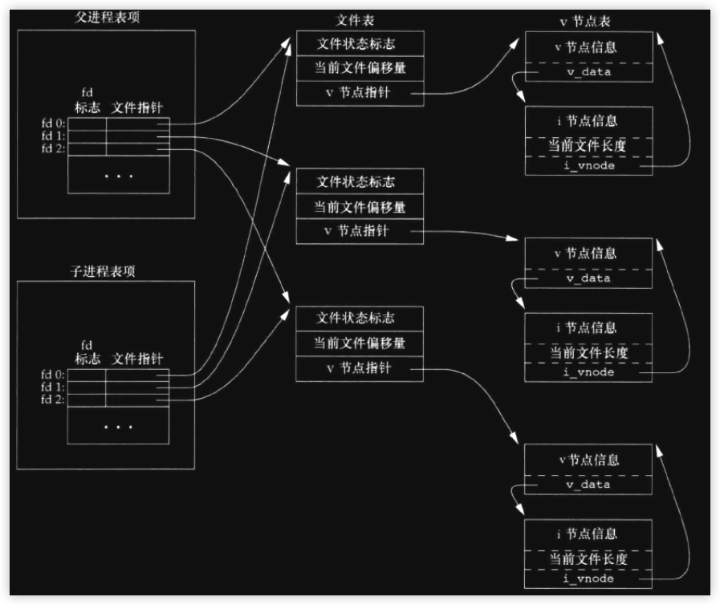
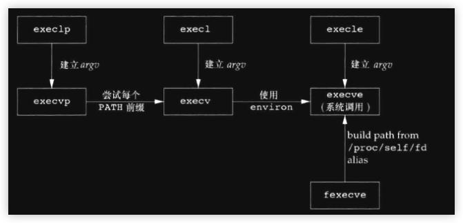
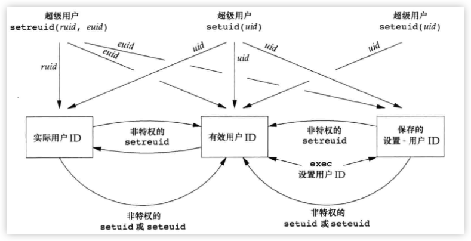

### 引言
- 进程控制从程序被调度的流程上看包括:
    - <font color=deeppink>创建新进程</font>
    - <font color=deeppink>执行程序</font>
    - <font color=deeppink>进程终止</font>
- 为了高效合理执行这些流程, 就像是做应用层面的软件一样, 内核也是一样在维护进程期间为进程定义了各种属性:
    - 实际用户ID
    - 有效用户ID
    - 组ID
    - 等等

<br/>

### 进程标识
- 每个进程在运行期间, 内核会为其分配一个 <font color=deeppink>非负整数</font>来引用它, 在进程存活过程中, 这个ID是唯一的. <font color=deeppink>但ID同时也是复用的</font>, 当一个进程终止后, 其ID会被收回, 用作为其他进程分配(<font color=green>现在的系统实现中, 一般会延迟复用, 当进程结束后, 内核并不会立即收回这个ID, 这样作的目的是防止将新进程误认为是使用同一ID的某个已终止的先前进程</font>).

- 虽然ID是一个非负整数, 但事实上内核在调度时, 我们自己的应用程序的ID并不是从0开始. <font color=deeppink>ID为0</font>的进程是系统进程, 也称为调度进程, 主要任务是管理所有进程的调度执行; <font color=deeppink>ID为1</font>的进程通常是init进程[^ann-pro-id-0]. 它是一个可执行程序(<font color=green>调度进程并不是文件中的程序</font>)

- 系统在启动时, init进程并不是在调度进程之后就立即开始的, 这中间会经历很多系统的初始化, 关于这一点, 会在后面详细探讨unix的启动过程


- init进程代码一般在`/etc/init`或`/sbin/init`, 它是启动后到内核初始化完成时系统的第1个进程, 但它并不是root用户[^ann-pro-id-1], 只是有root的权限. 一般它的任务是将unix引导到一个多用户的状态, init进程不会终止. 因为进程之间有继承性, init进程是所有孤儿进程的父进程

> 不同的系统中, 可能都会指定的固定的ID作用特别的用途, 相关函数

```cpp
#include<unistd.h>
pid_t getpid(void);             // 返回进程id
pid_t getppid(void);            // 返回父进程id
pid_t getuid(void);             // 返回进程实际用户id
pid_t geteuid(void);            // 返回进程有效用户id
pid_t getgid(void);             // 返回进程实际组id
pid_t getegid(void);            // 返回进程有效组id
```
> 没有一个函数能 <font color=red>从当前进程中获取子进程的id</font>, 这一点在下一节细说


```cpp
#include<iostream>
#include<unistd.h>


int main(int args, char** argv){
    std::cout << decltype(getpid()) << std::endl;
    std::cout << getpid() << std::endl;
       
    return 0;
}
```
> 经过测试可以发现, `pid_t`是4个字节, 相当于pc端上的int. <font color=red>进程ID并不像是文件描述符一样, 使用最小的, 不要搞混了</font>

<br/>

### fork
- 一个现有的进程可以 <font color=deeppink>复制自己</font>创建一个一模一样的进程出来.

```cpp
#include<unistd.h>
pid_t fork(void);
// 当是子进程时返回0, 当是父进程时返回的是子进程的id
// 返回-1, 表示出错
```
> 由fork创建的新进程被称为 <font color=red>子进程</font>. 该函数被调用一次, 但返回2次. 2次返回的区别是子进程返回0, 父进程返回的是创建子进程的进程ID
> 这里就可以解释前面所提到的`没有一个函数能从当前进程获取子进程id`, 若想要获取则自己fork时要作好记录

- fork是复制自己, 得到的子进程是复制了:
    - 堆
    - 栈
    - 数据区(<font color=green>除开代码段</font>)
    - 其他等

```cpp
#include<iostream>
#include<unistd.h>
int a = 10;
int main(int args, char** argv){

    std::cout << "main: " << getpid() << std::endl;

    auto fork_res = fork();
    if(fork_res < 0){
        perror("fork");
        exit(-1);
    }

    // child
    if(fork_res == 0){
        a = 100;
        std::cout << "son:  " << getpid() << 
            "\ta-addr:" << &a << 
            "\ta-valu:" << a << 
            std::endl;
        return 0;
    }

    std::cout << "main: " << getpid() << 
        "\ta-addr:" << &a << 
        "\ta-valu:" << a << 
        std::endl;
    return 0;
}
```
> 测试如下:

```shell
main: 5026
main: 5026	a-addr:0x1047f3000	a-valu:10
son:  5028	a-addr:0x1047f3000	a-valu:100
```
> 可以看出, 子进程和父进程并不共用同一个全局变量a, 虽然它们的地址一样的, 这只不过是虚拟内存的一种映射, 真正的物理内存是不一样的, 所以 <font color=red>当涉及到fork时, 不要用全局变量去作为一个加锁的条件, 因为它们本质不在同一块内存</font>


<br/>

### 进程不能用pthread做同步
- 上面的这个案例中说明了父子进程中2者的物理空间的地址是区分开的, 所以不能在2个进程之间用`pthread`做锁同步[^ann-fork-sync-0], 下面这个case就说明了这一点
```txt
测试场景:
    父子进程同时向文件中 累加写入数据

    1. 文件 a.txt
        初始内容是空
    2. 父进程 和 子进程 上锁(pthread-mutex)
        > 读出内容
        > 内存中累加
        > 写入文件
```
```cpp
#include<iostream>
#include<cstdio>
#include<cstdlib>
#include<unistd.h>
#include<pthread.h>

pthread_mutex_t m = PTHREAD_MUTEX_INITIALIZER;

FILE* file;


char buf[100] = {0};

void wfile(pid_t spid){
    auto tmp_fd = fileno(file);
    for(int i = -1; ++i < 100;){
        pthread_mutex_lock(&m);

        auto read_res = read(tmp_fd, buf, 100);
        if(read_res == 0){
            printf("read over\n");
        }

        if(read_res < 0){
            perror("read");
            pthread_mutex_unlock(&m);
            return;
        }

        auto count = atoll(buf);
        ++count;
        snprintf(buf, 100, "%lld", count);

        lseek(tmp_fd, 0, SEEK_SET);
        write(tmp_fd, buf, strlen(buf));

        printf("pid: %d count:%lld\n", getpid(), count);

        pthread_mutex_unlock(&m);
    }
}

int main(int args, char** argv){
    chdir("/tmp/lb");

    auto fork_res = fork();
    if(fork_res < 0){
        perror("fork");
        exit(-1);
    }

    if(nullptr == (file = fopen(argv[1], "w+"))){
        perror("open");
        exit(-1);
    }

    if(fork_res == 0){
        wfile(getppid());
        fclose(file);
        return 0;
    }

    wfile(getpid());

    wait(0);

    fclose(file);
    return 0;
}
```
> 上面的测试结果这里就不演示了, 最后`a.txt`的结果基本上是<font color=red>小于200</font>(<font color=green>累加的次数是200</font>), 若是将 <font color=red>上面的系统调用IO改成标准IO则要注意的地方有很多</font>,因为标准IO的有缓冲机制, 这个在前面的标准IO学习中也深入测试过多次, 这里再测试一下

```cpp
#include<iostream>
#include<cstdio>
#include<cstdlib>
#include<unistd.h>
#include<pthread.h>

pthread_mutex_t m = PTHREAD_MUTEX_INITIALIZER;

FILE* file;


char buf[100] = {0};

void wfile(pid_t spid){
    auto tmp_fd = fileno(file);
    for(int i = -1; ++i < 100;){
        pthread_mutex_lock(&m);

        fgets(buf, 100, file);

        if(ferror(file)){
            perror("fgets");
            pthread_mutex_unlock(&m);
            return;
        }


        auto count = atoll(buf);
        ++count;
        snprintf(buf, 100, "%lld", count);

        // 从0开始覆盖写
        fseeko(file, 0, SEEK_SET);
        fputs(buf, file);
        // 写入后, 要刷新一下缓冲, 因为若不这样做, 下次的fgets的偏移是不确定的
        // 这里并未调用 fflush, 因为由标准IO调用 fseek时(这里是重置偏移), 标准IO内部会自动刷新流(写入文件)
        fseeko(file, 0, SEEK_SET);

        if(ferror(file)){
            perror("fputs");
            pthread_mutex_unlock(&m);
            return;
        }
        printf("pid: %d count:%lld\n", getpid(), count);

        pthread_mutex_unlock(&m);
    }
}

int main(int args, char** argv){
    chdir("/tmp/lb");

    auto fork_res = fork();
    if(fork_res < 0){
        perror("fork");
        exit(-1);
    }

    if(nullptr == (file = fopen(argv[1], "w+"))){
        perror("open");
        exit(-1);
    }

    if(fork_res == 0){
        wfile(getppid());
        fclose(file);
        return 0;
    }

    wfile(getpid());

    wait(0);

    fclose(file);
    return 0;
}
```
> 这里测试的结果也是一样的,最后`a.txt`内容是`小于200`的,原因同上面所说, 锁在本质上不是同一块物理内存


<br/>


### fork的使用场景
- fork语义是实现了进程的`深复制`, 但事实上操作系统为了效率, 并不是真正的完全拷贝. 操作系统使用了 <font color=deeppink>写时复制</font>(`copy-on-write COW`)技术. 即内核会为父子进程创建一个 <font color=deeppink>只读</font>的区域, 当任何一个进程要对这块区域的数据作出修改时, 内核就会单独为其开辟出新的空间出来. 很明显这样的效率要高于最开始的完全复制

- 一般来说 <font color=deeppink>fork后出来的子进程</font>并不执行父进程的代码, 子进程会执行一个新的程序(`exec`). 在网络请求中也常常是父进程用来等待连接, 子进程处理连接

<br/>

### 谁先被调度
- 当fork后父子进程谁先被调度是不确定的, 这取决于内核的调度算法
    - 父子进程间接同步在后面会深入学习到, 这里先不说.


<br/>


### 父子进程共享文件表项
- 在第3章的系统IO中, 学习了文件系统, 其中文件表项中存储着对文件修改的偏移. 当fork出子进程时, 内核同时为子进程 <font color=deeppink>引用了父进程的文件表项</font>, 这就意味着, 子进程拥有父进程中已经打开的文件, 并共享相同的文件偏移.

<br/>

--- 



```cpp
#include<unistd.h>
#include <sys/wait.h>
#include<iostream>

using std::cerr;

int main(int args, char** argv){
    chdir("/tmp/lb");

    auto fork_res = fork();
    // if error ignore

    if(fork_res == 0){
        while (1) {
            cerr << "child\t";
            sleep(1);
        }
        return 0;
    }

    while (1) {
        cerr << "parents\t";
        sleep(1);
    }

    wait(0);
    return 0;
}
```
> 这里fork出的子进程和父进程共享 <font color=red>标准输出设备</font>, 所以程序的效果是不间断的追加输出对应的内容


<br/>

- 如果父子进程写同一描述符指向的文件, 但又没有任何形式的同步, 那么它们的输出就会相互混合(<font color=green>若这个描述符是fork前就打开的</font>)
- 在fork后处理文件描述符有以下2种常见的情况:
    - 父进程等待子进程完成. 这种情况下, 父进程无需对其描述符做任何处理. 子进程终止后, 它增进行过IO操作的共享描述符的文件偏移都已经做了相应的更新
    - 父子进程各自执行不同的程序段(<font color=green>注意不是代码段</font>), 即做不同的业务. 它们各自关闭不需要使用的文件描述符, 这样就不会干扰对方.
        - 一般网络服务进程就是这样处理的


<br/>

### fork后父子进程的区别
- fork后, 子进程也继承父进程其他相关的属性, 如下:

|属性|子进程|
|:-|:-:|
|实际ID(`组,有效`)|<font color=green>true</font>|
|附属组ID|<font color=green>true</font>|
|进程组ID|<font color=green>true</font>|
|会话ID|<font color=green>true</font>|
|控制终端|<font color=green>true</font>|
|设置ID(`用户, 组`)标志|<font color=green>true</font>|
|当前工作目录|<font color=green>true</font>|
|根目录|<font color=green>true</font>|
|文件模式创建屏蔽字(`umask`)|<font color=green>true</font>|
|信号屏蔽和安排[^ann-fork-1]|<font color=green>true</font>|
|`close-on-exec`标志|<font color=green>true</font>|
|环境(`但空间是独立的`)|<font color=green>true</font>|
|连接的共享存储段|<font color=green>true</font>|
|存储映像|<font color=green>true</font>|
|资源限制|<font color=green>true</font>|
|||
|fork返回值|<font color = red>false</font>|
|进程ID|<font color = red>false</font>|
|父进程ID|<font color = red>false</font>|
|进程时间[^ann-fork-2]|<font color = red>清零</font>|
|文件锁|<font color = red>子进程不继承</font>|
|未处理的闹钟|<font color = red>子进程清除</font>|
|未处理的信号集|<font color = red>子进程设置为空</font>|


<br/>

### 进程的终止
- 在上一章中介绍了 <font color=red>main函数的8种返回</font>, 事实上这也意味着进程的8种结束. 但无论是以哪种情况结束, 内核都会做 <font color=deeppink>善后处理</font>
    - 如关闭所有打开的文件
    - 释放相关的堆栈资源等
- 在开发中, 我们希望 <font color=deeppink>终止进程时能够被其父进程知道</font>. 幸运的是内核提供了这样的机制

- 对于一个正常终止的进程, 在父进程中可以获取到它的 <font color=deeppink>退出状态码</font>
- 对于一个异常终止的进程, 因为没有正常调用`exit`所以就没有所谓的 <font color=deeppink>退出码</font>, 这种情况下结束的进程是由内核先做处理, 产生一个`终止状态`, 再由相关的机制在父进程中获取这个状态

- 不管是正常终止还是异常终止, 在对应的父进程中都可以调用`wait`相关的函数来取得终止状态
    - 对于是正常返回的进程, 其终止状态也是由内核设置, 只不过内核 <font color=deeppink>先将退出状态码转换成终止状态</font>


<br/>

### 子进程可能的状态
- 在正常情况下, 一个进程的正常结束包括了:
    - 自己正常exit
    - 父进程取得其终止状态(<font color=green>父进程调用wait</font>)
- <font color=deeppink>子进程可能会出现3种状态</font>
    - <font color=deeppink>孤儿进程</font>: 子进程还在未结束(`未调用exit或异常终止`), 但fork出它的父进程已经不存在了.
        - 这个时间持续比较短, 是在其父进程死掉, 但内核尚未将其子进程的父进程改为init进程时
    - <font color=deeppink>僵死进程</font>: 子进程调用了exit, 但其父进程未调用wait, 此时这个子进程虽然结束了(`exit`), 也释放了自己相关的资源(`文件描述符等`), 但因为未被父进程wait, 所以它还占用着 <font color=deeppink>进程号, 这个进程号未被回收(`unix回收进程号也有延迟机制`)</font>
    - <font color=deeppink>被init进程接管</font>: 子进程exit时, fork出它的进程早已经不存在了, 此时内核会将该子进程的父进程修改为init进程, 由init进程来wait这个子进程, 保证它不会变成僵死进程


<br/>

> 关于孤儿进程的父进程怎么变成init进程, 内核大致的做法是:
>   1. 父进程(`p-parent`)要结束时, 内核检查所有活动进程(`p-acitem`)
>   2. 若`p-acitem`是`p-parent`的子进程, 则将`p-acitem`的父进程改为`init`进程(`进程ID为1`)

```cpp
#include<iostream>
#include<unistd.h>
#include<sys/wait.h>

using namespace std;


int main(int args, char** argv){
    auto fork_res = fork();
    if(fork_res == 0){
        printf("ppid:(%d)\n", getppid());
        sleep(3);
        printf("ppid:(%d)\n", getppid());
        return 0;
    }

    sleep(1;)
    printf("parent over\n");

    return 0;
}
```
> 该程序测试如下
```shell
 ./main
parent over                         # 父进程先结束(但未调用exit)
ppid:(95413)                        # 子进程当前的父进程未更改(父进程还未死)
 ➜ lb ppid:(1)                      # 3秒后, 父进程已经死了, 此时内核已经检查完所有的进程, 将死掉的进程原来fork出的子进程的父进程修改为init
```

<br/>

### wait和waitpid
- 父进程通过调用`wait`相关的函数来获取子进程的终止状态, 这同时也意味着父进程做了最后的处理, 子进程的进程ID将会被收回. 
- 当 <font color=deeppink>一个进程正常或异常终止时</font>, 内核就向其 <font color=deeppink>父进程发送`SIGCHLD`</font>信号
```cpp
#include<cstdio>
#include<unistd.h>
#include<signal.h>


static void func(int signo){
    printf("listen child\n");
}


int main(int args, char** argv){
    auto fork_res = fork();

    if(fork_res == 0){
        puts("child will over");
        return 0;
    }

    signal(SIGCHLD, func);
    
    pause();                            // __code_pause

    puts("parent will over");

    return 0;
}
```
> 当前这个程序在fork出子进程后, 安排了信号(`SIGCHLD`), 当子进程终止后, 内核会向其父进程发送信号, 父进程处理了这个信号后, 并未调用wait. 当处理程序结束后, pause也被唤醒(`具体的细节在后面的信号章节中再学习`). <font color=red>需要说明的是因为父进程并未调用相关wait, 所以在其结束前, 子进程的状态严格来说是僵死进程</font>
> 若不安排这种信号处理, 则系统默认的做法并不是结束父进程, 而是忽略它

<br/>

- wait相关的函数
```cpp
#include<sys/wait.h>
pid_t wait(int* statloc);

pid_t waitpid(pid_t pid, int* statloc, int options);

// 成返回终止进程的 进程ID
// 出错返回0或-1
```
> 参数`statloc`用来存放终止进程的 <font color=red>终止状态</font>
> 调用`wait`或`waitpid`可能会:
>   1. 若 <font color=red>当前父进程的所有子进程正在运行</font>, 则 <font color=red>父进程被阻塞</font>, 直到某个子进程结束被唤醒
>   2. 若 <font color=red>有子进程已经结束</font>, 则 <font color=red>父进程立即取得终止状态返回</font>
>   3. 若 <font color=red>当前父进程没有任何子进程</font>,则出错返回
>   4. 若 <font color=red>当前父进程是由于收到SIGCHLD而调用wait</font>, 则逻辑上是立即返回

<br/>

- 关于`waitpid`:
    - 它能 <font color=deeppink>等待指定的进程</font>
    - 能控制是否立即返回(`不管有没有已经结束的子进程`)

<br/>

- <font color=deeppink>进程终止状态的判断</font>是通过 <font color=green>staloc</font>的bit位判断. 其中某些位表示信号, 某些位表示是否产生了core文件等. unix中提供了 <font color=deeppink>相应的宏</font>来判断终止状态的原因

|宏|说明|
|-|:-|
|WIFEXITED|若是正常结束的进程则`返回true`, 通过 <font color=green>WEXITSTATUS</font> 可以获取`exit`参数的低8位|
|WIFSGINALED|若异常结束的进程则`返回true`, <font color=green>通过WTERMSIG</font>可以获取到 <font color=deeppink>终止的信号</font>. <font color=green>通过WCOREDUMP</font>可以知道是否产生了core文件|
|WIFSTOPPED|若 <font color=deeppink>当前进程被暂停</font>[^ann-wait-0], 通过 <font color=green>WSTOPSIG</font>获取被暂停的信号|
|WIFCONTINUED|被暂停后的进程又被继续, 则返回true|

<br/>

```cpp
#include<iostream>
#include<unistd.h>

using namespace std;

int main(int args, char** argv){
    auto fork_res = fork();

    if(fork_res == 0){
        printf("%d\n", getpid());
        puts("child begin");
        auto stime = atoi(argv[1]);
        sleep(stime);
        puts("child over");
        return 0;
    }

    puts("wait begin");

    int sta;
    wait(&sta);
    puts("wait over");
    if(WIFEXITED(sta)){
        printf("normal over, exit-return:%d\n", WEXITSTATUS(sta));
        return 0;
    }

    if(WIFSIGNALED(sta)){
        printf("signal over, signal:%d", WTERMSIG(sta));
#ifdef WCOREDUMP
        printf("\tcore:%d\n", WCOREDUMP(sta));
#endif
        puts("");
        return 0;
    }

    
    return 0;
}
```
> 编译运行如下图


<br/>

> 若父进程中有多个子进程时, 只要有1个子进程的结束(`暂停后面再学习`), wait就返回
```cpp
#include<iostream>
#include<unistd.h>

int main(int args, char** argv){
    auto count = atoi(argv[1]);
    while(--count){
        if(fork() == 0){
            printf("pid:(%d)\n", getpid());
            return 0;
        }
    }
    wait(0);
    puts("main over");

    return 0;
}
```
> 测试如下
```shell
./main 3                # 3表示开3个子进程
pid:(8979)              # 发现只要有1个子进程结束后, 父进程的wait就返回了
main over
pid:(8980)
```

<br/>

> 若当前已经已经有子进程了, 则调用时会立即返回, 不会阻塞
```cpp
#include<iostream>
#include<unistd.h>

int main(int args, char** argv){
    if(fork() == 0){
        return 1;
    }


    if(fork() == 0){
        sleep(5);
        printf("over\n");
        return 0;
    }

    int sta;
    wait(&sta);
    if(WIFEXITED(sta)){
        printf("%d\n", WEXITSTATUS(sta));
    }

    return 0;
}
```
> 此程序并不会等待5秒, 而是立即在wait的地方返回, 获取到了第1个子进程的返回状态1


<br/>

### waitpid
- 对于waitpid来说, 它可以等待一个指定的进程, 同时参数`pid`有以下用法:

|pid取值|作用|
|-|:-|
|<font color=green>大于0</font>|等待指定的进程|
|<font color=green>等于0</font>|等待的 <font color=deeppink>也是某些子进程</font>, 这些子进程满足 <font color=deeppink>组id等于自己所在进程组的组ID</font>|
|<font color=green>等于-1</font>|等待 <font color=deeppink>自己所有子进程中的任意一个</font>(<font color=green>作用同wait</font>)|
|<font color=green>小于-1</font>|等待的 <font color=deeppink>也是某些子进程</font>, 这些子进程满足 <font color=deeppink>组id等于参数pid的绝对值</font>|

> ps: 关于进程组会在下一章学习到, 对于参数 <font color=red>options</font> <font color=green>或是0或是以下值按位或</font>

|option|说明|
|-|:-|
|WCONTINUED|若环境 <font color=deeppink>支持作业控制</font>, 则 <font color=deeppink>等待的子进程由`暂停`变为`继续`时, waitpid会返回</font>|
|WNOHANG|若等待的子进程并不是立即可用的, 则不阻塞直接返回0|
|WUNTRACED|若环境 <font color=deeppink>支持作业控制</font>, 则 <font color=deeppink>等待的子进程`暂停`时, waitpid返回, 此时通过`WIFSTOPPED`确定一下这个子进程是不是一个暂停的进程</font>|

> 关于waitpid就不举例了


<br/>

### waitpid的返回值
- 这里摘取Mac平台上的文档加以说明就行了
```txt
If wait3(), wait4(), or waitpid() returns due to a stopped or terminated child process,the process ID of the child is returned to the calling process.  If there are no children not previously awaited, -1 is returned with errno set to [ECHILD].  Otherwise, if WNOHANG is specified and there are no stopped or exited children, 0 is returned.  If an error is detected or a caught signal aborts the call, a value of -1 is returned and errno is set to indicate the error.


大致意思如下:
    当子进程 停止或结束时 该函数会返回
        1. 返回值为子进程的pid

        2. 若当前进程在调用时, 它本身并没有任何子进程, 则返回-1并且errno为ECHILD
            它可以从未产生子进程, 也可以是原来有子进程, 但子进程已经结束被收尸了也相当于没有子进程

        3. 若调用waitxxx时指定了WNOHANG并且此时并没有子进程停止或结束, 则直接返回0, 这种情况也算是一种错误

        4. 若在阻塞期间被其他信号打断(信号在第10章会学习), 则返回-1并且errno为EINTR
```

<br/>


### 避免僵死进程的方法
- 若 <font color=deeppink>在应用中不想等待子进程, 同时又不想子进程处于僵死状态, 则方法是`连续2次fork`</font>
```cpp
#include<iostream>
#include<unistd.h>

int main(int args, char** argv){
    if(fork() == 0){
        // fir child

        if(fork() == 0){      
            // sec child

            // do something in child process

            sleep(1);
            printf("pid(%d), ppid(%d)\n", getpid(), getppid());

            return 0;
        }
        exit(0);        // fir child normal over
    }

    sleep(5);

    return 0;
}
```
> 该程序第2个子进程不需要被别的进程所wait, 内核在第1个子进程被结束时, 会遍历所有活动进程是不是第1个进程的子进程, 若是直接修改它们的父进程为init. 自己可以测试一下

<br/>

### waitid
- 不同于上述的`wait和waitpid`, 这个函数也是标准定义(`Single UNIX Specification`), 它类似于`waitpid`, 但更灵活
```cpp
#include<sys/wait.h>
int waitid(idtype_t idtype, id_t id, siginfo_t* info, int options);

// 成功返回0, 出错返回-1
```
> waitid将 <font color=red>要等待子进程的条件用2个参数分开</font>(<font color=green>这样会显得更直观</font>). `idtype`取值有:
> 1. `P_PID`: 等待指定的进程(`id`)
> 2. `P_PGID`: 等待指定进程组中的任一子进程, `id`包含要等待子进程的进程组ID
>   - 这一点和waitpid要区分开一下
> 3. `P_ALL`: 等待任一子进程, 忽略id
> <font color=red>参数options</font>取值如下表(`按位或`)

|options|说明|
|-|:-|
|WCONTINUED|等待的子进程被继续时, waitid返回|
|WEXITED|同wait, 等待子进程, 可能会阻塞|
|WNOHANG|若当前所有的子进程都在运行, 直不阻塞直接返回|
|WNOWAIT|只有将子进程的终止状态的信息读取出来, 并不做真正的回收, 后续若继续调用wait相关的函数, 则才真正回收子进程|
|WSTOPPED|等待的子进程被暂停, waitid返回|

<br/>

- waitid将进程的终止信息放在了第3个参数`infop`中, 关于它的结构在信号时, 会详细学习

<br/>


### exec
- 在unix中, fork复制出自己的设计本意是在子进程中执行其他的程序. 通过wait再进行子进程回收. 这就是unix中的机制. 
- 执行其他程序的唯一方法是系统调用exec. 当进程调用`exec`函数时, 该进程执行的程序完全替换为新的程序,(<font color=green>这意味着进程的代码段完全不同于父进程</font>)
- exec并不创建新的进程, 所以前后的进程ID并未改变

```cpp
#include<unistd.h>
int execl(const char* pathname, const char* arg0, ...);
int execv(const char* pathname, char* const argv[]);
int execle(const char* pathname, const char*  arg0, ... /*(char*)0, char* const envp[]*/);

int execve(const char* pathname, char* const argv[], char* const envp[]);

int execlp(const char* filename, const char* arg0, ...);
int execvp(const char* filename, char* argv[]);

int fexecve(int fd, char* const argv[], char* const envp[]);

// 所有的函数 调用成功后不会返回, 若出错返回-1
```
> 上述7个函数后面会以<font color = red>exec作简称</font>. 所有的可变参数都是以`NULL`结尾; 所有的环境参数必须是`char**`
> 第0个参数<font color=red>路径参数</font>(`pathname或filname`)可以有2种格式:
>   1. 若<font color = red>filename</font>中含有`/`则表示绝对路径, 会到该绝对路径下寻找可执行文件
>   2. 若<font color = red>filename</font>是一个`相对路径`, 则系统会以`环境变量中的PATH所包含的路径为基准目录`
>   ps: 大多数实现中并不将`.`(当前目录)包含在环境变量中`PATH参数值`中
>
> envp中的`PATH`就是时常说的环境变量, 事实上它只是环境变量中的一个键值对. 在unix中以`:`隔开

<br/>

> exec成功后, 直接会舍弃后续的代码
```cpp
#include<iostream>
#include<unistd.h>

int main(int args, char** argv){
    if(fork() == 0){
        puts(argv[1]);
        execl("/bin/date", argv[1], nullptr);
        perror("exec");                 // __code_exec_suc
        return 0;
    }
    // if error ignore
    wait(0);
    return 0;
}
```
> 上述程序中若`execl`成功后`__code_exec_suc`不会执行. 该程序的作用是调用系统的`date`命令打印当前日期. <font color=red>但有个注意的地方</font>, exec传递的参数问题
```shell
date +%s                # shell的命令,  输出的是时间戳
1683952869


# 用上述程序来做同样的事情
./main +%s
2023年 5月13日 星期六 12时42分14秒 CST          # 发现输出的并不是一个时间戳
```
> 上述程序演示的效果说明了 exec传递参数并不是想象中的那样. 调用`execl("/bin/date", "+%s", NULL)`时, <font color=red>date这个命令所接收的第1个命令行参数并不是`+%s`</font>, 下面的小节来学习一下exec的命令行参数

<br/>

### exec的命令行参数
- 先看一下下面的程序
```cpp
#include<iostream>
#include<unistd.h>

int main(int args, char** argv){
    char** tmp_argv = argv + args;
    while(argv != tmp_argv){
        puts(*argv++);
    }
    return 0;
}
```
> 该程序是打印命令行参数
```shell
./main one two three four five
./main
one
two
three
four
five
```
> 可以发现命令行参数:
> `第0个`: 表示程序的名字
> `第1个`: 是在命令行中输入的参数`one`
> 后面依次, 接着写2个程序
```txt
    main: 
        负责调用exec, 将命令行参数传递给process2

    process2:
        打印出exec后,自己的命令行参数
```

<br/>

```cpp
#include<iostream>

// main
int main(int args, char** argv){
    execl("./process2", "1", "2", "3", nullptr);
    return 0;
}


// process2
int main(int args, char** argv){
    for(int i = -1; ++i < args;){
        printf("i(%d)\tval:%s\n",i, argv[i]);
    }
    return 0;
}
```
> 测试结果如下:
```shell
./main
process2
i(0) val:1
i(1) val:2
i(2) val:3


# 直接调用process2
./process2 1 2 3
process2
i(0) val:./process2
i(1) val:1
i(2) val:2
i(3) val:3
```
> 发现`process2`的`第0个参数`却是传递的`1`. <font color=red>原来所谓的`路径参数`</font>并没有被接收到. 但直接调用process2时它的 <font color=red>第0个命令行参数就是所谓的路径参数</font>, 所以 <font color=red>unix代码中手动execl一个程序时, exec的`argv0`一般会传递一个自定义的进程名, `argv0后的`参数才算是从逻辑上有意义的参数</font>
```cpp
execl("./process2", "./process2", "1", "2", "3", nullptr);
```

<br/>

### shell
- 作为用户使用操作系统的 <font color=deeppink>桥梁</font>, shell的任务是:
    1. 从 <font color=deeppink>标准输入</font>中读取参数
    2. 内部通过约定的shell语法(`也就是常说的shell脚本`) <font color=deeppink>解析</font>各个参数 
    3. 将 <font color=deeppink>第0个参数</font>作为 <font color=deeppink>命令</font>(`一个可执行文件,可以是标准的二进制C程序也可以是脚本文件`)
    4. 调用fork
    5. 子进程中 <font color=deeppink>exec</font>, 将解析好的参数放到对应的exec的参数中
    6. 等待子进程结束
    7. 子进程结束后, 阻塞在标准输入中等待用户输入

- shell的得到命令的方式 <font color=deeppink>绝大多数是从标准输入</font>, 但事实上它本身也是一个C程序, 当不需要从标准输入中得到命令时, shell可以这样使用
```shell
# 当前在 /bin/zsh 的环境下, 等待标准输入

/bin/zsh -c date            # 在标准输入下, 再次调用 shell(zsh), 然后以 -c 告诉zsh 后面的是 命令, 不再是标准输入


/bin/zsh -c "date +%s"      # -c 后面的 `date +%s` 是一个整体, shell会自己去解析, 分解开来传递给 date, 所以最终的效果就是 打印时间戳
```
> 上述的shell命令实际上形成了如下图所示的效果


<br/>


### exec与所谓的shell
- 既然shell就是一个二进制的C程序, 那完全可以在自己的代码中调用shell, 同时利用`-c`可以在代码中任意使用shell
```cpp
#include<iostream>
#include<unistd.h>

int main(int args, char** argv){
    const char* cmd = "for i ({1..10})"
        "{"
            "echo $i"
        "}";
    if(fork() == 0){
        execl("/bin/zsh", "zsh", "-c",  cmd, nullptr);
        return 0;
    }
    wait(0);
    return 0;
}
```
> 上述程序就是在 <font color=red>用户的代码中使用zsh下的循环语句</font>, 从中可以看到shell自身对命令参数的强大解析功能. 我们编写一个程序时也可以采用这样的机制, 将单独功能的代码编写成一个单独的程序, 在主程序中exec去处理

<br/>

### 解释器文件
- shell完成对 <font color=deeppink>命令行参数</font>的解析后, 它自己也不能确定 <font color=deeppink>第0个参数所对应的文件是不是一个真正的C程序文件</font>, 但shell本身不管这一点. 对第0个参数文件的格式解析由`exec`来完成(<font color = green>即内核处理</font>). 当exec内部发现第0个参数是一个C程序文件后, 就直接唤起进程. <font color = deeppink>当不是一个合法的C程序文件时, exec会读取文件的第1行, 并且这个格式是固定的`#! xxx [options]`</font>, 其中`xxx`表示的是一个存在的C程序的绝对路径, 此时exec会调用这个C程序, 并将 <font color=deeppink>命令行参数以及options传递给这个程序</font>
> 在shell编程中常常将`#! xxx [options]`称作为`shabang`,其实说白了是 <font color=deeppink>操作系统规定的可执行文件的格式</font>

```txt
    场景:
        1. 写一个自己定义的 脚本文件 a.lb, 并修改这个文件的权限为 +x
        2. 在main程序中exec这个文件
        3. 由a.lb指定的程序(shabang) 来解释 a.lb这个文件
            这里是打印出所有 除 `*` 开头的所有行的内容

    a.lb的内容(cat -n a.lb)
         1	#! /tmp/lb/process2 
         2	
         3	
         4	* ann line 1
         5	this is line 1
         6	
         7	
         8	
         9	* 这是第2行
        10	this is line 2
        11	
        12	
        13	
        14	this is line other ....
```
> main函数如下
```cpp
#include<iostream>
#include<unistd.h>

int main(int args, char** argv){
    if(fork() == 0){
        execl("a.lb", nullptr);
        return 0;
    }
    wait(0);
    return 0;
}
```
> 直接调用exec读取a.lb, 由内核来完成a.lb的解析和调用

<br/>

> process2中主要读取`a.lb`并输出所有`除*开头 和 空行之外的行`. 代码如下:
```cpp
#include<iostream>

int main(int args, char** argv){
    auto file = fopen(argv[1], "r");
    if(file){
        char* buf;
        size_t count = 0x100;
        size_t get_count = 0;
        while(1){
            get_count = getline(&buf, &count, file);
            if(feof(file)){
                break;
            }
            if(ferror(file)){
                exit(-1);
            }
            if(strlen(buf) > 0 && strncmp(buf, "*", 1) != 0 && strncmp(buf, "\n", 1) != 0){
                printf("%s", buf);
            }
        }
        fclose(file);
    }

    return 0;
}
```
> 测试如下
```shell
./main                      # 运行
#! /tmp/lb/process2     
this is line 1
this is line 2
this is line other ....
```

<br/>

### shabang的参数格式
- 上面的脚本文件(`a.lb`)中的shabang(`#! /tmp/lb/process2`)中只是简单的告诉exec程序的位置. 事实上这里可以添加参数, 这一节要研究的是 <font color=deeppink>shabang中的参数和exec的参数顺序问题</font>

```txt
    场景:
        1. 编写一个脚本 main.gcc, 添加+x权限
        2. 在main程序中调用这个脚本
        3. 由shabang指定的 process2来解释 main.gcc 并输出 得到的所有参数
    
    main.gcc的内容如下
        #!/tmp/lb/process2 -framework Foundation -objc-arc 
```

<br/>

> 程序如下:
```cpp
#include<iostream>
// main
#include<iostream>
#include<unistd.h>
int main(int args, char** argv){
    if(fork() == 0){
        execl("main.gcc", "gcc", "./main.m", "-o", "main.lbout", nullptr);
        perror("exec");
        return 0;
    }
    wait(0);
    return 0;
}


// process2
int main(int args, char** argv){
    for(int i = -1; ++i < args;){
        puts(argv[i]);
    }
    return 0;
}
```
> 测试如下:
```shell
./main                  # 运行
/tmp/lb/process2                # shabang 程序的路径为  arg0
-framework                      # shabang 第1参数       arg1
Foundation                      # shabang 第2参数       arg2
-objc-arc                       # shabang 第3参数       arg3
main.gcc                        # exec调用时路径        arg4
./main.m                        # exec指定的第2参数     arg5
-o                              # exec指定的第3参数     arg6
main.lbout                      # exec指定的第4参数     arg7
```
> 可以得出以下结论:
>   1. exec优先将 <font color=red>shabang</font>的第1行全部传递给`process2`
>   2. exec继续将 <font color=red>调用时指定的`gcc ./main.m -o main.lbout`</font>第2个开始取<font color=red>`main.m`</font>传递给process2,忽略第1个参数`gcc`
> exec忽略指定的第1个参数的原因是 <font color=red>往往第0个参数表示的路径信息更详细</font>
> 继续改进上述的程序, 在`main.gcc`中指定`gcc`编译器来编译这个`main.m`为`Objective-C`程序, 修改 main.gcc的内容如下
```txt
#!/usr/bin/gcc -framework Foundation -objc-arc 
```
> 对应的main.m的`Objective-C`如下:
```objc
#include<Foundation/Foundation.h>
int main(int args, char** argv){
    @autoreleasepool{
        NSLog(@"%@", @{@"name":@"tierry"});
    }
    return 0;
}
```

<br/>


> 运行main
```shell
./main      

l               # 查看所有的文件
-rwxr-xr-x   1 liubo  wheel    33K  5 13 16:12 main
-rw-r--r--   1 liubo  wheel   252B  5 13 16:12 main.cpp
-rwxr-xr-x   1 liubo  wheel    53B  5 13 16:20 main.gcc
-rwxr-xr-x   1 liubo  wheel   1.7K  5 13 16:12 main.lbout           # 由gcc编译main.m得到的OC程序
-rw-r--r--   1 liubo  wheel   156B  5 13 16:07 main.m
-rwxr-xr-x   1 liubo  wheel    32K  5 13 16:00 process2


./main.lbout        # 运行该oc程序
2023-05-13 16:36:25.968 main.lbout[25127:1692700] {
    name = tierry;
}
```

<br/>


### exec参数顺序总结
- 若<font color = deeppink>在代码中调用exec</font>函数时, 则新进程中的参数为:
    1. `argv0`对应 <font color=deeppink>exec中传递的argv0参数</font>
    2. `argv1`对应 <font color=deeppink>exec中传递的`argv1`参数</font>
    2. `argvn`对应 <font color=deeppink>exec中传递的`argvn-1`参数</font>
> ps: 新进程 <font color=red>不会接收到路径参数</font>

<br/>

- 若 <font color=deeppink>直接在shell的命令行交互中执行程序</font>,`./main par0, par1, par2` 则新进程中的参数为:
    1. `argv0`对应`./main`的路径参数
    2. `argv1`对应`par0`
    3. `argv2`对应`par2`
    4. `argv3`对应`par3`

<br/>

- 若 <font color = deeppink>指定的程序不是C程序的二进制文件</font>(`eg /tmp/myshell.lb`),并且shabang有传递参数:`#! /bin/my_process shabang_par0, shabang_par1`时, <font color=deeppink>代码调用exec</font>:`exec("/tmp/myshell.lb", exec_par0, exec_par1)`时, 新进程中对应的顺序为:
    1. `argv0`对应`/bin/my_process`
    2. `argv1`对应`shabang_par0`
    3. `argv2`对应`shabang_par1`
    4. `argv3`对应`/tmp/myshell.lb`
    5. `argv4`对应`exec_par1`
> 其中`exec`传递的`exec_par0`直接被忽略

<br/>


### 环境变量`PATH`
- 严格来说`PATH`只是环境变量中的一个键值对. 操作系统在实现exec时, 寻找可执行文件的依据是`PATH`所包含的路径(`当路径参数为相对路径时`)
> 下面的程序演示了, 在父进程中添加一个自定义的环境变量, 并fork出子进程继承这个环境, 子进程exec时指定一个与系统相同的程序`date`, 则exec内部会调用到我们自己的那个date程序
> 文件结构
```shell
.
├── bin
│   ├── date
│   └── date.cpp
├── main
└── main.cpp
```
> 相关代码
```cpp
#include<iostream>


// main
#include<cstdlib>
#include<cstring>
#include<unistd.h>
#include<sys/wait.h>

int main(int args, char** argv){
    auto sys_path = getenv("PATH");         

    auto const my_path = "/tmp/lb/bin:";

    auto my_path_len = strlen(my_path);
    auto sys_path_len = strlen(sys_path);

    auto buf = (char*)malloc(my_path_len + sys_path_len + 1);
    buf[my_path_len + sys_path_len] = 0;

    snprintf(buf, my_path_len + 1, "%s", my_path);
    snprintf(buf + my_path_len, sys_path_len + 1, "%s", sys_path);


    if(setenv("PATH", buf, 1) < 0){
        perror("setenv");
        exit(-1);
    }


    if(fork() == 0){
	    execl("./bin/date",nullptr);
	    perror("execl");
	    exit(-1);
    }

    free(buf);  
    wait(0);
    return 0;
}


// 自己的date
int main(int args, char** argv){
	std::cout << "mydate" << std::endl;
	for(int i = -1; ++i < args;){
		std::cout << argv[i] << std::endl;
	}
	return 0;
}
```
> main函数主要任务:
>   1. 获取PATH 
>   2. 拼接PATH
>       - 将自己的`/tmp/lb/bin:`拼接在了`原PATH`的开头
>   3. 设置PATH(`setenv`)
>   4. fork出子进程,并exec出`date`
>
> 自己的date其实什么也没做, 就是输出参数
> 从上面的案例中可以得出父进程的环境变量是可以被子进程继承的

<br/>


### exec后的新程序继承的属性
- exec后, 新程序的进程ID未变, 也就 <font color=deeppink>意味着他的父进程未变</font>. 同时新程序会继承以下属性
    - 进程ID和父进程ID
    - 实际ID(<font color=green>包括用户和组</font>)
    - 附属组ID
    - 进程组ID
    - 会话ID
    - 控制终端
    - 闹钟余留的时间
    - 当前的工作目录
    - 根目录
    - 文件模式创建屏蔽字(`umask`)
    - 文件锁
    - 进程信号屏蔽
    - 未处理信号
    - 资源限制
    - nice值(`调度优先级`)
    - `tms_utime tms_stime tms_cutime tms_cstime`

- 在第3章中, 简述了文件描述符中的`FD_CLOEXEC`的标志, 它表示 <font color=deeppink>exec时是否关闭</font>, 若设置了该标志, 则exec后, 新程序就会关闭该文件, 这也是一种默认的情况. 
- POSIX是要求exec后, 关闭所有打开的目录. 实现这个功能是由`opendir`来做的, 该函数在调用时会自动设置目录的`FD_CLOEXEC`为打开状态, 这样exec后, 目录就是关闭的
- 在文件权限相关的章节中exec一个新的可执行文件, 可能会改变进程的有效用户ID. 这一点是unix的机制, 当要exec的文件是一个设置用户ID程序, 则exec后, 就会改变原来进程的有效用户ID


<br/>


### exec簇函数的调用规则


> 从上图中可以看出内核只实现了一个exec的系统调用, 其他的都可以看作是普通函数或库函数. 最终执行到`execve`时, 所有的环境已经准备好


<br/>

### 更改权限ID(用户和组)
- 在 <font color=deeppink>第4章</font>曾学习过进程的权限, 进程中所拥有的权限是依赖进程的1个属性--`有效ID`的, 内核会对该进程中的所有操作做权限测试(<font color=green>关于测试的原则可以看第4章相关的章节</font>).
- 这一节更改权限ID的目的是让进程安全有效的IO指定的文件. 本质是修改了进程的权限
- 一般来说:
    - 当程序需要增加特权时, 修改进程的用户ID或组ID, 使其具有更高的权限访问对应的文件或操作
    - 相反, 当程序不需要额外的权限时, 为了安全, 最适当的做法是修改相关ID,降低权限

```cpp
#include<unistd.h>
int setuid(uid_t uid);          
int setgid(git_t gid);

// 成功返回0, 出错返回-1, 设置error
```
> 这2个函数的作用是:<font color = red>设置进程的用户ID和组ID</font>, 但有条件:
>   1. 若<font color = red>进程有root权限</font>, 则`setuid`会同时将 <font color=red>实际用户ID, 有效用户ID, 保存设置用户ID</font>设置为`参数uid`
>   2. 若1不成立, 但 <font color=red>指定的uid等于实际用户ID或保存的设置用户ID</font>, 则 <font color=red>只将有效用户ID</font>设置为uid.
>   3. 若以上都不成立, 则出错返回, errno设置为`EPERM`. 对于组ID也是这样的判断流程
>   
> 保存的设置用户ID是可选的, 所以在程序中要做相关的测试
>   1. 若在编译时则条件宏测试`_POSIX_SAVED_IDS`
>   2. 若在运行时, 则调用相关的`sysconf`函数(`_SC_SAVED_IDS`)

<br/>


### 保存设置ID
- 保存设置用户ID也是进程的一个属性, 它由 <font color=deeppink>exec复制有效用户ID</font>得到. 当 <font color=deeppink>程序的文件启用了设置用户ID位</font>, exec就会在有效用户ID位被赋值以后, 再保存一个副本. 后续若是root用户调用了`setuid`后, 这个值也会被重新设置. 其他的没有root权限的用户调用setuid, 并不会改变这个副本


<br/>


### 获取这些ID
- FreeBSD以及Linux(`3.2.0以上`)支持用户获取到这些ID
```cpp
#define _GNU_SOURCE         /* See feature_test_macros(7) */
#include <unistd.h>

int getresuid(uid_t *ruid, uid_t *euid, uid_t *suid);
int getresgid(gid_t *rgid, gid_t *egid, gid_t *sgid);

// 成功返回0, 出错返回-1, 并设置errno
```
> 以上的头文件截取息来自linux, MacOS并没有定义这2个函数

<br/>

### setreuid和setregid
- 在历史上, BSD支持setreuid, 函数的功能是 <font color=deeppink>交换实际用户ID和有效用户ID</font>. 之所以这样做的原因是系统本身在进程中并没有保存设置用户ID. 使用交换则就可以间接实现有效用户ID一直存在于euid和ruid中
- 目前unix的标准已经完全支持这2个函数
```cpp
#include<unistd.h>

int setreuid(uid_t ruid, uid_t euid);
int setregid(gid_t rgid, gid_t egid);

// 成功返回0. 出错返回-1, 并设置errno
```
> 若其中任一参数为-1, 则对应的ID保持不变 但我们使用时这样做才有意义:`setreuid(geteuid(), getuid())`, 要自己获取当前的有效用户id和实际id
> 事实上这2个函数适用于 <font color=red>设置用户ID位</font>的程序.
```txt
    1. rwsr-xr-x /tmp/myprocess   root, root  
        myprocess是一个 设置ID位的程序
    
    2. rwxr-xr-x /tmp/main      tierry, tierry
        main是一个普通用户的程序(tierry)
    
    3. main中调用 myprocess
        execl("/tmp/myprocess", nullptr);     
    
    4. 启动 myprocess后, 它的有效id就变成了root, 实际id为tierry

    5. 因为该系统没有保存用户ID位, 所以若此时myprocess调用:
        > setuid后,则 euid(root)可能会被改变(参数不是root), 就没有保存起来, 再继续调用exec后, 新进程的有效id可能就不是root了
        > seteuid后, 也是同理

    6. 基于问题5, 所有BSD使用 setreuid 只单纯的将实际用户ID和有效用户ID交换, 这样exec后, 可以再次交换, 新进程的euid就会是root

    ps: 但这样做其实是有安全隐患的:
        若直接运行myprocess, 则实际用户id和有效用户id都为root
        继续在myprocess中exec出一个shell(没有设置用户ID位), 此时的shell就相当于root在运行, 就有安全问题
        一般在exec前, 会将 实际用户ID和有效用户ID都设置成普通用户权限, 这样exec后的程序在交换时, 不会获得额外的权限
```

<br/>


### seteuid和setegid
- POSIX也规定了进程修改有效用户ID
```cpp
#include<unistd.h>
int seteuid(uid_t uid);
int setegid(gid_t gid);

// 成功返回0, 出错返回-1, 并设置errno
```
> 若进程 <font color=red>有超级用户权限</font>则`直接设置`; 否则 <font color=red>指定的uid必须是实际用户ID或保存的设置用户ID</font>, 其他的参数是出错的



<br/>

### system
- 利用`fork-exec-wait`可以在程序中实现调用其他的程序, 这同时也是shell的基本实现原理. 标准C提供了`system`函数也是完成同样的事情
```cpp
#include<stdlib.h>
int system(const char* cmd);

// system内部是直接调用 shell这个C程序, 将cmd传递给shell
```
> 返回值有以下几种情况:
>   1. 若`cmd`为空, 则system的作用是检查当前系统能否起作用, 一般在unix中一定是有效的
>   2. <font color=red>fork失败</font>或 <font color=red>waitpid失败</font>, 则system调用返回-1, 设置errno
>   3. 若exec失败, 则返回值为shell的exit接收的返回值
>   4. 若3个函数(`fork exec waitpid`)都成功, 返回的是shell的终止状态
>
> 其实现的简单过程如下:
```cpp
#include<iostream>
#include<cstdlib>
#include<unistd.h>


int my_system(const char* cmd){
    // 当cmd为空时, 在uinx上始终返回1, 表示system可以使用
    if(nullptr == cmd)
        return 1;

    auto pid = fork();
    if(pid < 0){
        return -1;
    }

    if(pid == 0){           // child
        execl("/bin/zsh", "zsh", "-c", cmd, nullptr);

        _exit(127);         // error, 注意这里是直接系统调用, 不会刷新流

    }

_begin:
    int sta;

    if(waitpid(pid, &sta, 0) < 0){
       if(errno != EINTR)
           return -1;       // __code_warning_0
    }

    goto _begin;            // EINTR 表示系统调用被假中断

    return sta;
}
```
> 该程序没有对重要的信号作处理, 这一点在后面的信号学习中会加上. 这里的`__code_warning_0`是一个注意点, 这里的判断并未将waitpid的所有返回情况作正确处理, 具体的完善在第10章信号改写时会详细说明


<br/>


### system与设置用户ID
- 若设置用户ID位的二进制程序已经被运行, 并且在程序中调用了system, 则根据前面的学习, system唤起的shell将会有额外的权限. 正确的作法是禁止调用system, 然后自己fork和exec, 并在exec前, 降低当前进程的权限(<font color=green>设置用户有效ID</font>)


<br/>


### 用户标识
- 进程在运行期间可以获取到用户名, 有2个函数:
```cpp
#include<sys/types.h>
#include<pwd.h>

struct pwd* getpwuid(uid_t uid);
```
> 该函数在第6章中已经介绍, 这里再说2点:返回值是静态的变量, 所以该函数是不可重入([^ann-pwd-0]); 该函数需要传递一个uid, 若当前进程是设置用户ID程序, 则不同用户调用时得到的结果是不同的

<br/>

- unix提供了另一个函数来获取用户登录系统时的用户名, 这意味着即使是设置用户ID程序, 获取的也是同一个登录的用户

```cpp
#include<unistd.h>
char* getlogin(void);

// 成功则返回登录系统的用户名, 出错返回NULL
```
> <font color=red>该函数被调用时, 调用进程若没有连接到登录时所用的终端, 则会失败. 这种进程一般是守护进程</font>. 不能使用环境变量中的`LOGNAME`来获取用户名, 因为环境可能被更改

<br/>

### 进程调度
- 历史上unix对进程的调度优先级所提供的接口基本上是简单的粗粒度参数. 进程可以调整nice值来间接调整被调度的优先级. 基本上只有特权用户才能提高优先级
- nice的值范围是`0~(2*NZERO-1)`, nice越低, 表示对cpu越友好, 被调度的频率就越高. NZERO是默认的nice值
```cpp
#include<unistd.h>
int nice(int incr);

// 成功 返回新的nice值, 出错返回-1, 并设置errno
```
> 参数`incr` 并不是 <font color=red>直接覆盖原来的nice</font>, 而是被`加`到`NZERO`中, 所以该函数可能返回`-1`. 因为这个原因, 在检查出错时, 应该是在调用前将errno的值设置为0, 调用完后 <font color=red>返回值是-1, errno不为0</font>则才表示调用失败
> 因为系统的nice值有范围, 所以`NZERO + incr`超过合法值时, 并不会出错, 而是被内核调整到合法值的边界

<br/>

- unix提供了获取进程nice的函数
```cpp
#include<sys/resource.h>
int getpriority(int which, id_t who);
// 成功返回 -NZERO ~ NZERO - 1之间的nice值, 出错返回-1
```
> 其中which表示要获取的nice值是不是多个进程:
>   1. `PRIO_PROCESS`表示获取某个的进程nice值:
>       - 若`who`为0, 表示获取调用进程的nice
>       - 若`who`为具体的pid, 则获取的就是指定进程的nice(`要有权限`)
>
>   2. `PRIO_PGRP`表示获取指定进程组中所有进程调度优先级最高的那个进程的nice
>       - 若`who`为0, 表示调用进程所在组的进程组ID
>       - 若`who不为0`, 则who表示的是指定的进程组ID
>
>   3. `PRIO_USER`表示获取某个用户所有进程中调度优先级最高的那个进程的nice
>       - 若`who`为0, 表示调用进程的<font color = red>实际用户ID</font>
>       - 若`who不为0`, 表示指定用户ID


<br/>

- 可以设置进程的nice值
```cpp
#include<sys/resource.h>
int setpriority(int* which, id_t who, int value);
//  成功返回0, 出错返回-1, 并设置errno
```
> 该函数的参数同`getpriority`, 返回值的判断同`nice`. 在新的标准中(`Single UNIX Specification`)中 <font color=red>并未要求子进程继承nice</font>, 但exec后要保留nice

<br/>

### 案例调整nice值
```cpp
#include<iostream>
#include<unistd.h>
#include<signal.h>
#include<sys/wait.h>
#include<sys/time.h>

#ifndef NZERO
#define NZERO sysconf(_SC_NZERO)
#endif


static long long count = 0;


int main(int args, char** argv){
    chdir("/tmp/lb");
    printf("main pid:%d\n",getpid());

    auto pid = fork();
    if(pid < 0) return ((void)perror("fork"), -1);

    if(pid == 0){
        errno = 0;
        auto res = nice(20);
        if(res == -1 && errno != 0){
            perror("nice");
            exit(-1);
        }
        printf("%d now nice:%ld\n", getpid(), NZERO + res);
    }else{
	// ignore error check
        printf("%d now nice:%ld\n", getpid(), NZERO + nice(-10));
    }


   struct timeval tv_end, tv_cur;
   gettimeofday(&tv_end,nullptr);
   tv_end.tv_sec += 10;


    while(1){
	gettimeofday(&tv_cur, nullptr);
	if(tv_cur.tv_sec >= tv_end.tv_sec && tv_cur.tv_usec >= tv_end.tv_usec){
		printf("%d count:%lld\n", getpid(), count);
		exit(0);
	}
        ++count;
    }
    return 0;
}
```
> 该程序基本就是apue书籍中对应的案例, 但在当前linux下测试并未有效果


[^ann-pro-id-0]: 不同的实现中可能称呼不一样
[^ann-pro-id-1]: mac上所谓的init进程文件是 `/sbin/launchd`, 它是root用户编写. 在ubutu上观察的也是root
[^ann-fork-sync-0]: 正确来说, fork出来的子进程和父进程中不能使用所谓的全局变量来做同步, 因为这2个全局变量的虚拟地址是一样的, 但实际上的物理地址是不一样的,所以对于pthread来说不是同一把锁. 但若能在父子进程中找到一块相同的物理地址, 则也可以用来作线程间同步

[^ann-fork-1]: 当fork后, 子进程的代码段是和父进程共享的, 所以相应的信号处理程序也是同样的地址, 这和exec时是不一样的.

[^ann-fork-2]: `tms_utime tm_stime tms_cutime tms_ustime`在子进程中清零

[^ann-wait-0]: 这里宏名是`stop`并不意味着进程被结束, 在作业控制中表示的是进程被`暂停`阻塞
[^ann-pwd-0]: 在后面的信号中会学习到可重入的概念
