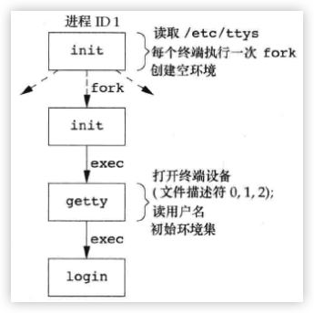
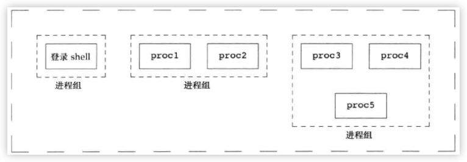

### 引言
- 本章将较为详细的从unix的登录开始学习, 了解unix登录过程的同时会逐步明白 <font color=deeppink>各种终端的概念</font>. 本章也会对上一章节提到过的 <font color=deeppink>进程组</font>进行深入的学习, 进而过渡到的 <font color=deeppink>会话, 控制终端, 作业控制</font>, 这些能更加深入了解一个shell工作的细节

<br/>


### 终端登录 
- 在早期的unix中(<font color=green>如V7</font>), 用户用 <font color=deeppink>哑终端</font>[^ann-term-0]进行登录. 终端或是本地的(<font color=green>直接连接</font>)或是远程的(<font color=green>通过调制解调器连接</font>). 这2种类型的连接终端, 在登录时都会经过 <font color=deeppink>内核中的终端设备驱动程序</font>
> 因为在一台主机上的终端设备数量是固定的, 所以同时登录数就有了上限

<br/>

- 在后来 <font color=deeppink>位映射图形终端出现</font>, 开发出了窗口系统(<font color=green>说白了就是操作系统的桌面系统</font>). 在窗口系统中的也出现了软件类型的终端程序(<font color=green>如iterm2</font>). 它的作用是仿真传统的字符终端, 用户在这个窗口程序中使用shell与主机交互
> 现如今基本所有非商用主机的unix都是这样


<br/>


- 现在要学习的终端登录到unix与所使用的终端类型无关

<br/>

### BSD终端登录 
- 在过去的几十年中, BSD终端登录过程并没有多少改变. <font color=deeppink>系统管理者</font>创建名为`/etc/ttys`的文件, 该文件中的 <font color=deeppink>每一行都代表一个终端设备</font>[^ann-term-1], 其中说明 <font color=deeppink>设备名和传递getty程序的参数</font>. 当系统启动自举时, 内核创建ID为1的init进程. init启动后系统进入多用户模式.

- init进程读取`/etc/ttys`, 对每一个允许登录的终端设备(`即文件中的每一行`)调用一次fork生成子进程, 然后在子进程中`exec getty`程序. 此时系统的状态大致如下:


> 此时所有进程的 <font color=red>实际用户ID和有效用户ID都是root</font>. init以空环境<font color = red>exec getty</font>程序(`即没有初始化任何相关的环境变量`)


<br/>

- getty调用open函数, 以 <font color=deeppink>读写</font>方式打开终端设备,若是调制解调器, 则可能会阻塞. 因为可能会等待用户拨号连通. 当设备被打开后, 文件描述符`0,1,2`就被关联到这个设备. 之后`getty`输出`login:`之类的信息, 提示用户输入用户名. 

<br/>

- 当用户输入完用户名后, getty就获取到了用户的输入, 并调用login, 大致代码如下:
> `execle("/bin/logn", "login", "-p", 得到的输入内容用户名, nullptr, envp)`
- getty在 <font color=deeppink>exec login</font>前初始化相关的环境变量(`TERM=xxx`), 这些内容读取了`gettytab`文件. `exec中的-p`是告诉login<font color = deeppink>保留getty传递的环境</font>, 不要替换它. 在login中可以再附加新值到该环境中. 下图是调用到login后的状态:



> 此时所有进程还是具有root权限. 因为是一路`exec`过来, 事实上目前的状态只有2个进程`init login`[^ann-term-2], login的父进程是init

<br/>

- login会处理很多工作. 其中根据用户名(`通过getty传递的命令行参数获取到`)去调用`getpwnam`从`/etc/passwd`中获取该用户的登录项(`liubo:x:1000:1000:liubo,,,:/home/liubo:/bin/zsh`). 之后调用`getpass`在屏幕显示`Password:`显示用户输入密码[^ann-term-3]. 
- 当用户输入完密码后, login继续调用`crypt`将输入的密码加密并与加密文件`/etc/shadow`作对比. 若几次比对没通过, 则login会调用`exit(1)`结束进程表示登录失败. 父进程(`init`)收到login失败后, 再次调用fork又执行getty, 重复上面的过程

- 当login登录成功时,会做如下操作:
    - 切换目录到用户的家目录(`chdir`): 根据的是`/etc/passwd`对应用户名的家目录
    - 调用`chown`更改终端的所有权, 使登录用户所有它
    - 对终端设备的访问权限更改为`用户读写`
    - 调用`setgid`和`initgroups`设备进程组的ID
    - 会对环境变量作附加初始化(<font color=green>如HOME,SHELL,USER,PATH等</font>)
    - 调用`setuid`将进程所有的ID改为用户ID(<font color=green>因为当前进程是root,所以调用setuid会同时更改实际用户ID,有效用户ID,保存设置用户ID(若支持的话)</font>)
    - 调用`shell`: 根据是的`/etc/passwd`对应用户名的启动程序(`可能也不是shell`)
        > `execl("/bin/sh", "-sh", nullptr)`

> 事实上login所做的事情很多, 这里只是描述与登录相关的大致流程

<br/>

- shell开始运行, 同样的此时还是只有2个进程(`init shell`), 若shell终止, init处理并继续fork调用getty后重复上述过程
- shell启动后, 会读取相关的配置文件, 如`.bash_profile, .bash_login`等, 这些是shell编程中所涉及到的, 之后就是用户和shell的交互过程


<br/>


### MacOS的终端登录
- MacOS部分基于FreeBSD,所以登录过程差不太多, 但有些不同的地方:
    - init是由launchd完成
    - 一开始就是图终端

<br/>

### Linux的终端登录
- 它与BSD登录类似, 但不同发行版本的linux在init调用getty时,读取的文件不尽相同,这里就不说了


<br/>

### 网络登录 
- 上述描述的登录过程也称为 <font color=deeppink>串行登录</font>. 前面说过现如今uinx的登录基本都是基于图形窗口终端, 很多情况下登录unix是从网络的另一端操作, 这种情况下login仅仅是一种可用的服务

- 串行登录下, init知道哪些设备可以进行登录, 并为每个设备生成getty进程. 对于网络登录, 都是由内核的网络接口驱动程序(`如以太网驱动程序`), 因为事先并不知道会有多少这样的请求连接登录, 所以必须等待一个网络连接请求到达

- 为使同一个软件既能处理终端登录, 又能处理网络登录, 系统使用了一种称为`伪终端`的软件驱动程序, 它仿真串行终端的运行行为, 并将终端操作映射为网络操作, 反之亦然

<br/>


### BSD的网络登录
- 在BSD中, 有一个inetd进程, 它等待大多数网络连接. 它是由init调用一个shell执行了`/etc/rc`脚本, 该脚本启动`inetd`在后台运行. inetd等待`TCP/IP`连接, 当一个请求连接到达时, 它执行一次fork, 然后生成子进程exec适当的程序


<br/>

### Telnet的大致过程
- Telnet是一个登录到Unix主机下的标准协议. 主机提供该服务时, 可以在远程终端登录到该主机[^ann-ssh-0]. 现在以该协议的大致过程来简述一下BSD中的远程网络登录:

- 2个角色:
    1. 主机
    2. 客户端
    > ps: 主机已经安装了telnet的服务端程序
    > 同理客户端也安装了 telnet程序

- 步骤:
    1. 主机启动init
    2. init调用一个shell, 并执行`/etc/rc`脚本
    3. 因为2会启动`inetd`的守护进程, 它等待TCP连接
    4. <font color = deeppink>客户端通过`telnet 主机名\或地址`</font>发起 TCP连接
    5. 主机`inetd`监听网卡有数据过来, 解析出协议是`telnet`, 与是会`fork`出子进程. 然后在子进程中`exec(telnet)`, 将连接交给它处理
    6. 主机上的`telnet`接受请求, 现在开始启动登录环境
    7. telnet申请一个`伪终端`, 调用`fork`, 分裂成2个程序, 此时父子进程共享这个终端
    8. 父进程处理与远程客户的TCP连接(`信息交换`), 子进程`exec(login)`
    9. 子进程中的操作和前面`串行登录`的过程是一样的

> ps: 这里要说明一点, 站在应用层级软件的角度来看, telnet这种服务进程应该是在所谓的`服务端`, 它的启动应该早于`客户端`, 但当前的案例也看到了, 有些服务并不是在客户端之前就已经在运行了. 至少书中的现象是这样的. 那这种效果是怎么实现的呢?(<font color=green>以下只是个人猜测</font>)

```txt
接上面第4步:
    inetd从过来的TCP连接可以得到的信息有:
        1. 端口号
        2. 数据包

    因为telnet是公认的标准, 所以它运行中, 一般会有默认的端口
    inetd看过来的端口有没有对应的运行进程:
        有直接交给这个进程处理

        没有, 则看一下这个端口的值:
            若端口是标准下的端口值(如http, ftp等), 并且是telnet的默认端口, 则fork-exec(telnet), 将请求交给telnet处理
            若不是, 则这个端口不能被识别, 可能直接反馈报错给远程的用户端

    
    telnet作为一个服务, 在主机中, 一般只会运行一次, 若不同的远程用户端同时来登录一个主机, 可能telnet内部还要维护所有的TCP连接, 如单独为每个登录连接fork出子进程, 开辟一个新的伪终端, 这样不同的用户之间的终端不会冲突

    PS: 以上是个人猜测
```

<br/>

### 进程组
- 进程组是 <font color=deeppink>一个或多个进程的集合</font>. 进程组的存在是来解决 <font color=deeppink>作业控制的</font>(`这个后面的章节再说`), 同一进程组中的所有进程接收来自同一终端的各种信号

```cpp
#include<unistd.h>
#include<cstdio>
#include<sys/wait.h>
#include<signal.h>


void main_handler(int n){
    puts("main_handler");
}

void sub_handler(int n){
    puts("sub_handler");
}

int main(int args, char** argv){
    printf("%d\n",getpid());
    auto r = fork();
    if(r < 0){
        perror("fork");
        return -1;
    }

    if(r == 0){
        signal(SIGINT, sub_handler);
        r = 10;
        do{
           puts("child");
           sleep(3);
        }while(--r);

        return (0);
    }
    printf("%d\n",r);
    sleep(1);
    signal(SIGINT, main_handler);

    for(int i = -1; ++i < 10;){
        puts("main");
        sleep(3);
    }

    waitpid(r, nullptr, 0);
    return 0;
}
```
> 该程序测试如下, 分2个终端:
>   1. 打印终端
>   2. 检查

```shell
./main
6925
6926
child
main
child
^Cmain_handler              # 此时摁下了 Ctrl+c后, 父子进程都接收到了信号
sub_handler
main
child
..
..

```
<br/> 启动另一个终端

```shell
ps auj -p 6925 6926
USER    PID  %CPU %MEM      VSZ    RSS   TT  STAT STARTED      TIME COMMAND           PPID  PGID   SESS JOBC
root   6947   0.0  0.0 34391368   3276 s001  R+   10:55上午   0:00.01 ps auj -p 6925 6  4787  6947      0    1
liubo  6926   0.0  0.0 34269436   1008 s002  S+   10:55上午   0:00.00 ./main            6925  6925      0    1              # 子进程
liubo  6925   0.0  0.0 34260220   2428 s002  S+   10:55上午   0:00.01 ./main            5943  6925      0    1              # 父进程
liubo  5943   0.0  0.0 34722332   7932 s002  S    10:43上午   0:02.33 -zsh              5942  5943      0    1
root   5942   0.0  0.0 34429552   3956 s002  Ss   10:43上午   0:00.02 /usr/bin/login -  2132  5942      0    0
liubo  4787   0.0  0.0 34722604   7656 s001  S     9:31上午   0:08.46 -zsh              4786  4787      0    1
root   4786   0.0  0.0 34430576   2020 s001  Ss    9:31上午   0:00.02 /usr/bin/login -  2132  4786      0    0
```
> 从上面的案例中可以得到如下结论:
>   1. 父子进程可能会收到同信号
>   2. 父子进程会在同一组
>   3. shell在fork-exec后,变成了后台进程, 它本身阻塞了SIGINET
>   4. fork后在前台的进程组的id为父进程的进程id

<br/>

### 进程组ID
- 通过ps命令可以知道进程组ID也是`pid_t`类型. 在shell模式中, 若shell复制出一个进程后, 该进程接手控制终端, 并添加到新的进程组, 进程组id为进程ID. 在后面的学习中, 进程组的ID也可由用户指定所产生
```cpp
#include<unistd.h>
pid_t getpgrp(void);

// 返回调用进程的 进程组ID
```

<br/>

> 上面的函数没有出错的情况, 说明了一个存在的进程一定有一个所属的进程组.在后来的标准中也定义了另一个函数:

```cpp
#include<unistd.h>
pid_t getpgrp(pid_t pid);

// 成功返回进程组ID, 出错返回-1

```
> 该函数的作用是: 返回 <font color=red>指定进程(`参数pid`)</font>的 <font color=red>进程组ID</font>, 所以可以会有出错的情况, 如指定的pid不存在, 或没有权限

<br/>

### 再回顾waitpid
- 在上一章中, 我们已经知道了它的作用是等待子进程, 以获取子进程的`终止状态`. 
```cpp
#inculed<sys/wait.h>

pid_t waitpid(pid_t, pid, int* sta, int op);

// 成功返回进程ID, 

// 查阅文档, 关于这个返回值在MacOS平台是这样处理的:
//// 调用时发现: 
////    当前进程没有要收尸的进程(如根本没有子进程, 或子进程的终止状态已经被收了), 返回-1, 设置errno为ECHILD
////    若上面不满足, 则表示当前进程有收尸的资格, 并且op设置了WNOHANG时, 表示当前子进程还未结束, 不阻塞, 直接返回0
////    若是阻塞等待调用, 则可能被信号打断, 此时也返回-1, 但属于假错(errno为EINTR), 应用应该检查, 重新等待
```
> 当pid不同时, 所监听的效果是不同的

|值|效果|
|:-:|:-:|
|大于0|处理指定的pid进程, 但可能失败(<font color=green>没有权限</font>)|
|等于0|处理<font color=deeppink>自己进程组中所有的子进程</font>|
|等于-1|处理<font color=deeppink>自己所有的子进程</font>|
|小于-1|处理<font color=deeppink>`pgid = abs(pid)`进程组中的所有子进程</font>|

> ps: 这里用`处理`并未用`等待`是因为, waitpid可以指定`WNOHANG`选项, 以不阻塞的方式来获取子进程的终止状态

<br/>

> <font size = 6>返回`-1并且ECHILD`的情况</font>

```cpp
#include<unistd.h>
#include<cstdio>
#include<sys/wait.h>
#include<signal.h>
#include<sys/types.h>
#include<cerrno>


int main(int args, char** argv){
    errno = 0;
    auto grp = getpgrp();
    printf("process group:%d\n", grp);              # 设置的是 当前进程的进程组ID, 注意负号
    auto res = waitpid(-getpgrp(), nullptr, 0);
    if(res < 0 && errno == ECHILD){
        printf("res:%d\n",res);
        perror("waitpid");
        return -1;
    }
}

/**
process group:7683
res:-1
waitpid: No child processes
*/
```

<br/>

> <font size = 6>返回0的情况</font>
```cpp
#include<unistd.h>
#include<cstdio>
#include<sys/wait.h>
#include<signal.h>
#include<sys/types.h>
#include<cerrno>


int main(int args, char** argv){
    auto child = fork();
    if(child < 0){
        perror("child");
        return -1;
    }

    if(child == 0){
        for(int i = -1; ++i < 10;){
            printf("%d\n",i);
            sleep(1);
        }
        return 0;
    }
    if(waitpid(child, nullptr, 0 | WNOHANG) == 0){
        printf("child ing...\n");
    }
    printf("waitpid end\n");
    wait(nullptr);
    return -1;
}

/**
child ing...
waitpid end
0
1
2
..
..

*/
```

<br/>


### 组长进程
- 每个进程组有一个组长进程. 其进程组ID等于该进程ID. 组长进程可以创建进程组, 创建该组中的进程.
> 关于这一点要细说下: POSIX并未提供一个如`creatgrp(pid_t gid)`类似的函数来直接创建一个进程组, 所以也就未提供`addptgrp(pid pid)`加入进程组的函数等等. 所以进程组的创建是间接的. <font color=red>当fork出一个进程后, 默认情况下子进程和父进程在同一组中, POSIX提供了修改子进程进程组的函数`setpgid`, 所以进程组虽然在内核中没有对应的数据结构, 但它是进程的一个属性</font>

```cpp
#include<unistd.h>

int setpgid(pid_t pid, pid_t pgid);

// 成功返回0, 出错返回-1
```
> 该函数可以指定`pid`的进程组为`pgid`, 但有条件:
> <font color=red>只能为自己或自己的子进程设置; 所指定的组在同一会话中, 不能指定一个不存在的组. 为了保证组存在, 绝大部分下参数pgid为某个进程的进程id, 所以这里就涉及到了调用者是不是有权限的问题;</font>

```cpp
#include<unistd.h>
#include<cstdio>
#include<sys/wait.h>
#include<signal.h>
#include<sys/types.h>
#include<cerrno>

int main(int args, char** argv){
    printf("parent:%d\tbefore:%d\n",getpid(), getpgid(0));
    auto child = fork();
    if(child < 0){
        perror("child");
        return -1;
    }

    if(child == 0){
    	printf("child:%d\tbefore:%d\n",getpid(), getpgid(0));
        for(int i = -1; ++i < 10;){
            printf("%d\n",i);
            sleep(1);
        }
        return 0;
    }

    auto res = setpgid(0, 13905);               // __code_0
    if(res < 0){
        perror("setpgid");
    }

    printf("parent:%d\tafter:%d\n",getpid(), getpgid(0));

    if(child){
      auto res = setpgid(child, child);         // __code_1
      if(res < 0){
        perror("setpgid");
      }
    }

    waitpid(0, nullptr | WNOHANG, 0);           // 不阻塞
    printf("false\n");
    wait(0);                                    // 会阻塞
    return -1;
}
```
> 该程序`__code_0`处的`13905`是当前shell所在`进程组ID`, 若随便设置一个值, 则直接报错. 这里在fork后, `自己`将`自己`添加到了shell的组中. 目的是处理作业控制, 当shell内部fork出`自己`时, shell处理逻辑是将`自己`添加到了新组`setpgid(自己的pid, 自己的pid)`, 然后shell调用相关接口变成后台进程组, fork出`自己`所在的新组成了前台进程组. 但在代码中, 又创建了新的子进程, 随后修改了`自己到后台进程组(__code_0)`, 同时修改了`child到新的进程组中(__code_1)`, 所以程序中就没有进程处于前台进程组中. 由于linux的默认设置, child的进程虽然不在前台进程组, 但他可以写向终端. 但在打印的过程中, 若摁下`Ctrl + C`也不能结束child进程.
> 关于作业控制, 后面小节会详细学习, 这里先简单介绍一下.


<br/>

### shell会同时让父子进程设置相同的组ID
- 这里又涉及到了作业控制. 这里直接将书中的原文以贴图的形式放在下面(`本人这里还是没看懂`)

--- 


<br/>


### 会话(`session`)
- 会话是一个或多个<font color = deeppink>进程组</font>的集合



<br/>

- 通常由shell的管道将几个进程编成一组. 会话0.img 可能是由下面的命令构成

```shell
proc1 | prco2 &
proc3 | proc4 | proc5
```

<br/>

- 进程调用下面的函数可以创建一个新的会话
```cpp
#include<unistd.h>

pid_t setsid(void);

// 成功, 返回进程组ID, 出错返回-1
```
> 调用进程 <font color=red>若不是一个进程的组长, 则:</font>
>   1. 该进程成为 <font color=red>会话首进程</font>(`session leader`)[^ann-session-0]
>   2. 该进程成为组长, 这就意味着进程组ID为该进程ID
>   3. 该进程没有控制终端, 若之前已经有了也会被切断
> 若调用进程已经是组长进程, 则出错. <font color=red>大多数情况下是先fork, 再用子进程来调用该函数创建一个新的会话. 因为fork后的子进程一定不是进程组组长</font>

<br/>

```cpp
#include<unistd.h>
#include<iostream>

using namespace std;

int main(int args, char** argv){

    if(fork() == 0){
        std::cout << "pid[" << getpid() << "]" <<"\t" << "parent[" << getppid() << "]\tgroup:[" << getpgrp() << "]\t[" << ttyname(STDOUT_FILENO) << "]\t" << "sid:[" << getsid(0) << "]"<< "\n";
        if(setsid() > 0){
            std::cout << "pid[" << getpid() << "]" <<"\t" << "parent[" << getppid() << "]\tgroup:[" << getpgrp() << "]\t[" << ttyname(STDOUT_FILENO) << "]\t" << "sid:[" << getsid(0) << "]"<< "\n";
        } else
            perror("setsid");
        return 0;
    }

    std::cout << "over\n";
    return 0;
}
```
> 该例子简单的测试了一个进程创建会话时终端的变化. <font color=red>可惜的是并未向书本所述, 会切断新会话的控制终端</font>. 测试结果不管是在Mac还是Linux上, 子进程在设置会话id后, 控制终端始终未有变化


<br/>

### 会话ID
- 在标准中并未定义会话ID相关的概念, 但说明了会话首进程, 所以可以将会话首进程所在的进程组ID作为会话ID
```cpp
#include<unistd.h>
pid_t getsid(pid_t pid);

// 成功返回 会话首进程的进程组ID, 出错返回-1
```
> 若pid为0, 则事实上pid会转化为`当前调用进程`. 某些平台出于安全考虑有以下限制: 若pid不属于调用者所在的会话, 则调用会失败
> 所以在上一节的例子中, 子进程所在的会话改变了.


<br/>


### 控制终端
- 会话和进程组还有一些其他特性
    1. 一个会话可以有一个控制终端. 一般是终端设备或伪终端设备
    2. 建立与控制终端的会话首进程被称为控制进程
    3. 一个会话中的几个进程组可被分为一个前台进程组以及一个或多个后台进程组
    4. 若一个会话有一个控制终端, 则它有一上前台进程组, 其他进程组为后台进程组
    5. 在标准输入(`键盘`)键入 <font color=deeppink>中断键</font>(`Ctrl+c`)或 <font color=deeppink>退出键</font>(`Ctrl+\`), 都会将对应的信号发送到前台进程组的所有进程
    6. 若终端接口检测到调制解调器 或 网络已经断开连接, 则将挂断信号发送到会话首进程


> 通常情况下, 不用担心控制终端, 在登录时, 将自动建立控制终端. 建立控制终端的步骤:
>   1. 在某些平台上, 当 <font color=red>会话首进程</font>打开第一个尚未与一个会话相关联的终端设备时, 若`open被调用时, 未指定O_NOCTTY`, 则将此控制终端分配给该会话
>   2. 在另一些平台(`如BSD`)则是 <font color=red>调用ioctl函数时, 若request参数指定了 TIOCSCTTY</font>, 则为该会话分配控制终端. 但这样调用成功的前提是, 该会话不能有一个控制终端. 所以ioctl调用是紧跟在setsid后
>   PS: 在前面的case中, 存在的问题是子进程调用setsid后, 并未切断当前的控制终端. 所以这里以后再回来作详细探究


<br/>

### `open /dev/tty`
- 有时不管标准输入输出是否重定向, 程序都需要向控制终端作交互, 方法是`open /dev/tty`. 比较典型的命令是`crypt`函数, 不管crypt是否被重定向, 它问题向标准输入读取键入的内容.

```cpp
#include<unistd.h>
#include<iostream>

using namespace std;


char buf[4096];
int main(int args, char** argv){
    auto file = fopen("/dev/tty", "r");
    if(file == nullptr){
        perror("fopen");
        return -1;
    }
    fgets(buf, 4096, stdin);        // __code_0
    
    // ignore: error or eof

    cout << buf << endl;           // __code_1

    fgets(buf, 4096, file);         // __code_2

    // ignore: error or eof

    cout << buf << endl;            // __code_3
    return 0;
}
```
> 以下面这种方式运行程序
```shell
cat a.txt
hello
./main < a.txt
hello
                # 等待输入
ee              # 用户输入ee, 然后回车
ee              # 输出ee
```
> `__code_0`向标准输入获取内容, 但在运行程序时, main已经被重定向了标准输入, 它会从`a.txt`获取内容, 并输出到屏幕`hello`
> `__code_2`是向`file`获取数据, file是在程序中通过调用`open /dev/tty`以只读的方式打开了当前会话的终端设备, 所以可以向该终端设备索取数据(`标准输入`)
> `__code_3`是因为`__code_2`阻塞了等待用户输入, 所以当用户输入`ee`时, 得到的内容就是`ee`


<br/>


### 切换前后台进程组<a id = "here1"/>
- shell在实现作业控制时, 需要根据脚本的格式来时时转换前后台进程组. 因为终端设备驱动在发送信号时, 是根据进程组为单位来发送的. Unix提供了相关的方法 
```cpp
#include<unistd.h>
pid_t tcgetpgrp(int fd);
// 获取当前会话的前台进程组ID, 出错返回-1

int tcsetpgrp(int fd, pid_t pgrpid);
// 指定前台进程组 为  pgrpid的进程组
// 成功返回0, 出错返回-1


#include<termios.h>
pid_t tcgetsid(int fd);
// 返回会话首进程的进程组ID, 出错返回-1
```
> 上面参数中的`fd`表示的是`打开的终端设备`, 所以这3个函数基本是由shell来控制, 因为它知道打开的终端设备的文件描述符
> 下面的程序中, 子进程会被shell切换为后台进程, 然后向前台标准输入时, 会报错

```cpp
#include<unistd.h>
#include<iostream>

using namespace std;

int main(int args, char** argv){

    if(fork() == 0){
        sleep(5);
        std::cout << "pid[" << getpid() << "]" <<"\t" << "parent[" << getppid() << "]\tgroup:[" << getpgrp() << "]\t[" << ttyname(STDOUT_FILENO) << "]" << "\n";
        if(read(STDIN_FILENO, &args, 1) < 0){
            std::cout << errno << ":" << strerror(errno) << endl;
        }
        return 0;
    }
    std::cout << "over\n";
    return 0;
}
```
> 上面的程序会导致父进程先结束, 子进程先变成孤儿进程被init接收. 同时 <font color=red>子进程所在的进程组变为孤儿进程组</font>(`后面会学习到`), shell处理父进程并修改自己的进程组为前台进程组, 相对的子进程的进程组就变为了后台进程组. 此时POSIX规定, 一个孤儿进程组中的进程向终端read时, read函数必须报错, 并指定errno为`EIO`. 所以上述程序最终的效果是报错`Input/output errer`


<br/>

### 作业控制
- 它是1980年BSD上的一个新加的特性. 允许一个终端上启动多个作业(`进程组`).
- 由于进程组属于会话, 一个会话一般会有一个终端, 所以作业的基本原理是 <font color=deeppink>控制和切换前后台进程组</font>. 这个工作是由shell的来完成. 但作业的功能还需要其他模块的支持:
    - 1. 内核的终端驱动程序: 它的作用是发送中断信号(`如Ctrl+c等`) 
    - 2. 内核的中断向量表中要有对应信号的中断处理函数

```shell
date & ; jobs
[1] 10149                                           # shell输出的后台作业编号
[1]  + running    date                              # jobs的输出
2023年 6月24日 星期六 14时49分40秒 CST              # 回车后, date的结果被shell输出到了标准输出
[1]  + 10149 done       date                        # 任务结束


### 作业编号是 最开关的 1, 后面的是进程组号
```
> 可以看到, shell在启动后台作业后, 并未立即执行date命令, 而是像异步一样, date在后台运行, 不阻塞前台的 jobs命令, 等到jobs完成后, 基于最开始的回车, shell将date的结果显示到了屏幕上

<br/>

- shell并不在任意时刻打印后台作业的状态. 一般在用户回车后才将结果输出到标准输出. 这样做的原因是避免用户在交互的过程(`如用户正在输入命令`)将结果填充到当前光标的位置而引起混乱


<br/>

### 前台进程组信号

|名称|按键|说明|
|:-:|:-:|:-:|
|中断字符|`Delete或Ctrl+C`|产生`SIGINT`|
|退出字符|`Ctrl+\`|产生`SIGQUIT`|
|挂起字符|`Ctrl+Z`|产生`SIGTSTP`|

> 前台进程组这几个操作比较常见, 这里就不举例了


<br/>

### 后台进程组read操作
- 只有前台进程组的进程可以读取终端(`read`), 在后台进程组中的进程若读取终端时, 并不是一个错误, 但终端驱动程序会检测到这一动作, 并发送`SIGTTIN`给该后台进程所在的进程组, 这个时候该进程组中所有的进程会被暂停, 同时shell会向用户发送被暂停的通知. 后续用户可以通过`fg 作业编号`将暂停的进程组重新启动并转入到前台, 此时可以与终端交互

```shell
## 以下在 MacOS上测试(出错了!!!)
cat > a.txt &                                               # __shell_0 
[1] 10377                                                   # __shell_1
[1]  + 10377 suspended (tty input)  cat > a.txt             # __shell_2 
 ➜ lb fg %1                                                 # __shell_3
[1]  + 10377 continued  cat > a.txt                         # __shell_4
cat: stdin: Interrupted system call                         # __shell_5


## 在Linux下
cat > a.txt &                                               # __shell_0
[1] 51424                                                   # __shell_1
liubo-linux%                                                        
[1]  + suspended (tty input)  cat > a.txt                   # __shell_2
liubo-linux% fg %1                                          # __shell_3
[1]  + continued  cat > a.txt                               # __shell_4
aoneuhaonuheoa                                              # __shell_5
^C
liubo-linux% cat a.txt
aoneuhaonuheoa
```
> 过程:
>   1. 键入后台作业的命令(`__shell_0`)
>   2. shell告诉用户后台作业的编号(`__shell_1`)
>   3. `__shell_2`: 因为cat是后台作业并且想要read, 但作业控制中标准说明了, 后台进程组中的进程读终端时, 终端驱动必须发出`SIGTTIN`的信号. 即终端驱动调用了`kill(10377, SIGTTIN)`, 该信号的默认处理是暂停进程, 所以整个进程组中的进程都会被暂停. 同时shell由于监听了子进程的状态变化, 子进程被暂停, shell就在标准输出中告诉用户作业被暂停
>   4. `__shell_3`: 用户手动将作业放到前台, 这个过程中shell会调用 tcsetpgrp(终端设备的fd, 10377), 终端驱动发送SIGCONT到对应的进程组(`kill(10377, SIGCONT)`), 该信号默认的动作是继续. 所以进程的状态发生改变, shell监控到这一状态的变化, 于是`__shell_4`就打印了状态信息给用户
>   5. `__shell_4`: 换到前台后, 继续执行, 这个状态由shell监听到
>
>   6. `__shell_5`: 在Mac中, 出问题了(<font color=red>这和书中所描述的是一样的现象, 说明是MacOS的一个bug, 但想想应该是MacOS有自己的处理</font>), 但在Linux中是正常的


<br/>


### 后台进程在read后所有相关进程会被暂停
- 下面直接以一个例子来说明这一点:
```cpp

#include<unistd.h>
#include<iostream>
#include<signal.h>

void hand(int no){
    printf("hand\n");
}

using namespace std;

int main(int args, char** argv){

    // __process_main

    if(fork() == 0){                            // __process_child
        auto res = setpgid(0,0);                // __code_0
        if(res < 0){
            perror("setpgid");
            return -1;
        }else{
            cout << "child:[" << getpid() << "]-->[" << getpgrp() << "]\n";         // __code_1
        }

        //signal(SIGTTIN, hand);                // __code_2

        if(fork() == 0){                        // __process_grandson
            printf("here\n");
            for(int i = -1; ++i < 10;){
                printf("hello\n");
                sleep(1);
            }
            return 0;
        }
        puts("child1");
        res = read(STDIN_FILENO,&args,1);       // __code_3
        cout << (char)args << endl;
        if(res < 0){
            cout << "errno:" << errno << endl;
            perror("read");
        }else{
            cout << (char)args << endl;
        }
        
        wait(0);                                // __code_4
        return 0;
    }

    std::cout << "will over\n";
    wait(0);                                    // __code_5
    std::cout << "end over\n";
    return 0;
}
```
> 上述程序中会产 <font color=red>3个进程</font>:`__process_main, __process_child, __process_grandson`
> 在`__code_0之前`, 前台进程组为`__group_main`, 当`__code_0之后`, `__process_child`从前台脱离, 变成了后台`group_back_child`, 对应的`__process_grondson`也在后台进程
> 当程序运行到`__code_3`时, 后台进程向终端read, <font color=red>按道理说, 终端驱动会发送`SIGTTIN`到进程组`group_back_child`, 并且shell会打印对应的状态以告诉用户</font>. 但从终端显示的效果上看好像什么也没有发生!! 这里解释一下: 事实上`__process_child, __process_grandson`已经被暂停了, 但shell没有将对应进程的状态告诉用户, 原因是此时 <font color=red>shell正处于后台, 并且shell在最开始切换到后台时, 已经重定向了自己的标准输入和输出, 所以不会打印状态到前台上来</font>. 
> 所以 <font color=red>若打开`__code_2`, 则会发现信号处理函数被调用了2次, 原因是`__process_child, __process_grandson`2个进程都收到了SIGTTIN信号, 所以会有2次打印</font>. 之所以注释`__code_2`, 原因是这样会改变默认的处理, 它们即使接收到了SIGTTIN也不会暂停.
> 最后测试的步骤是:
>   1. 运行main
>   2. 另起一个新的终端, 调用`kill -s CONT 进程组ID`, 然后上面的`__process_child, __process_grandson`就会被唤醒, 完成后续的流程
<br/>


> gif中出现的`read错误`是因为在另一个终端中发送了一个`SIGCONT`信号, 该信号会打断read的系统调用


<br/>

### 后台进程组write终端
- 当一个后台进程组向终端write时, 通过上面的案例至少可以得出的结论: 允许后台write. 但事实上这是一个选项. 默认是允许write. 可以通过`stty tostop`来禁止后台进程输出到屏幕, 此时的流程和`read`一样, 进程会被暂停, 并由shell告诉用户, 用户调用相关的fg命令切换到前台来完成操作

<br/>

### 作业总结
- 以一张图来说明所有的问题


<br/>


### shell的作业细节
> 关于这部分的内容, 因为没有相关的非作业测试设备, 所以这里去看书

<br/>


### 孤儿进程组
- 进程组本身是进程的一个动态属性. 有 <font color=deeppink>孤儿进程</font>的概念, 就有对应的 <font color=deeppink>孤儿进程组</font>的概念
- 考虑一个问题: 当一个进程组中只有1个进程, 并且它的父进程是init时, 一般来说这种进程组就是孤儿进程组(`当然严格的定义稍后会给出`)
- POSIX对孤儿进程组的定义: <font color=deeppink>进程组中每个进程的父进程存在于2选1的地方`要么在该组中, 要么不在该会话中`</font>
> 另一种描述可以是: 进程组中存在一个成员的父进程, 它位于该会话的其他组中, 以图来描述


> 上图中的 <font color=red>进程组2即为孤儿进程组</font>, 因为该组中的所有进程(<font color=green>进程3</font>)的父进程(<font color=green>init</font>)存在于会话之外. 另一种孤儿进程的情况如下图:


> 上图中的进程组1就表示一个孤儿进程组. 因为进程2的父进程在该组内, 但进程1的父进程并不在当前会话内

<br/>


- 如同书上的一个问题:当一个进程fork出了一个子进程后自己终止. 若用作业控制将该子进程终止会发生什么? 停止的子进程又如何继续?
    - POSIX规定, 在父进程死亡后若导致一个新的孤儿进程组产生, 并且该孤儿进程组中有停止状态的进程时, 内核要主动按顺序发送`SIGHUP, SIGCONT`2个信号到新孤儿进程组中的每一个进程(`包括未停止的进程`)
> 默认情况下`SIGHUP`是终止进程, 所以要测试效果, 就要对该信号作信号处理

```cpp
#include<unistd.h>
#include<iostream>
#include<signal.h>
#include<sys/types.h>

using namespace std;


void test(int no){
    cout << "sighup hand\n";
    kill(getpid(), SIGURG);
}

int main(int args, char** argv){
    signal(SIGHUP, test);

    if(fork() == 0){
        cout << "child[" << getpid() << "]\n";
        while(1){
            pause();
            goto over;
        }
over:
        cout << "week up\n";
        return 0;
    }

    for(;;)pause();
    return 0;
}
```
> 上述程序对`SIGHUP`作了处理, 这样父进程在结束后, 即便是孤儿进程组收到`SIGHUP`也不会被终止. 测试流程如下:

```shell
## 在终端1中:
./main
child[4998]         # 此时的状态是 父子进程都处于睡眠状态


## 在终端2中:
ps                                              # 查看当前各进程信息
PID TTY           TIME CMD
660 ttys000    0:08.07 -zsh
4997 ttys000    0:00.01 ./main
4998 ttys000    0:00.00 ./main
2087 ttys001    0:18.00 -zsh
kill -s STOP 4998                               # 会导致4998被暂停(子进程)
kill 4997                                       # 结束父进程


## 在终端1中:
sighup hand                                     # 由于父进程结束, 子进程所在的进程组变为孤儿进程组, 收到了SIGHUP信号
[1]    4997 terminated  ./main                  # shell收到父进程状态变化, 显示到终端
week up                                         # 子进程在信号处理中发送了信号, 使pause函数被打断, 跳出循环, 随后输出结束
```

<br/>

### 后台孤儿进程组的read操作
- POSIX规定, 后台的孤儿进程组在read时, 并不和前面处理一样(<font color=green>处理SIGTTIN被暂停</font>), 而是直接报错返回, 其中`errno = EIO`, 这一点的案例在[这里](#here1)


<br/>


[^ann-term-0]: 用硬件连接到主机的设备
[^ann-term-1]: 每个系统中的`/etc/ttys`的内容格式各不相同, 它是由内核来解析并初始化, 这里只是明白unix启动后, 会经历这个文件, 然后所做的工作流程虽然细节不同, 但过程是大同小异. 甚至在ubuntu中都没有找到这个文件
[^ann-term-2]: 这里为了简化理解, 所以描述的是只有2个进程, 事实上unix在init之前还做了大量的工作, 不只2个进程
[^ann-term-3]: getpass函数内部会调整控制终端, 即用户输入密码时不回显
[^ann-ssh-0]: Mac下远程登录使用的是SSH协议
[^ann-session-0]: 会话首进程是创建该会话的进程


