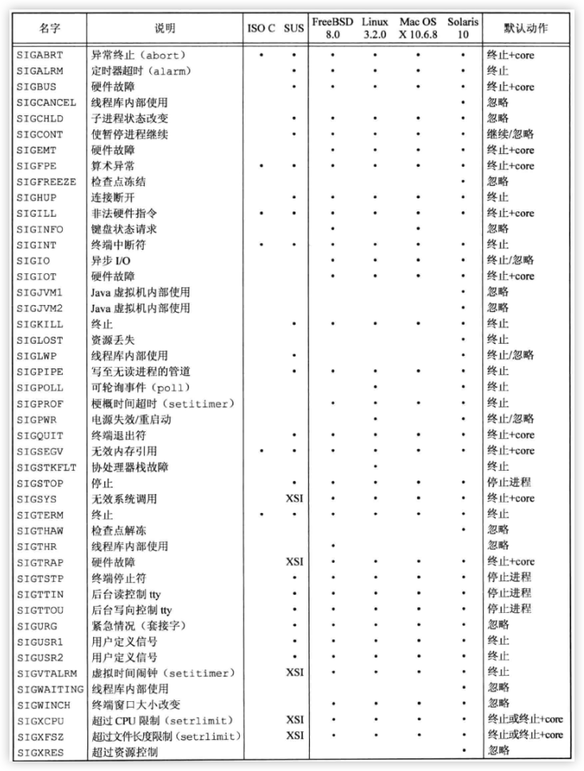
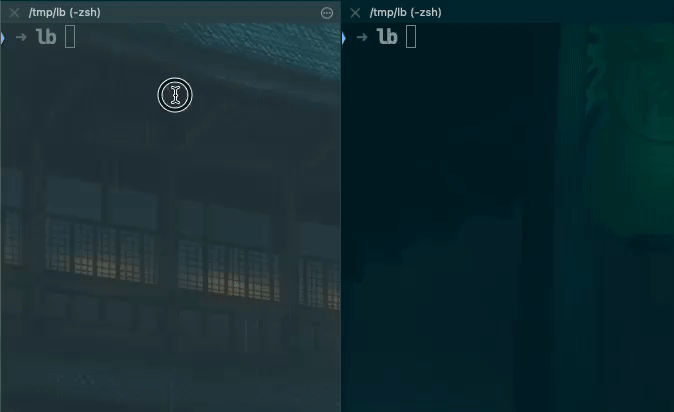
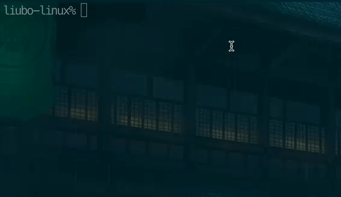
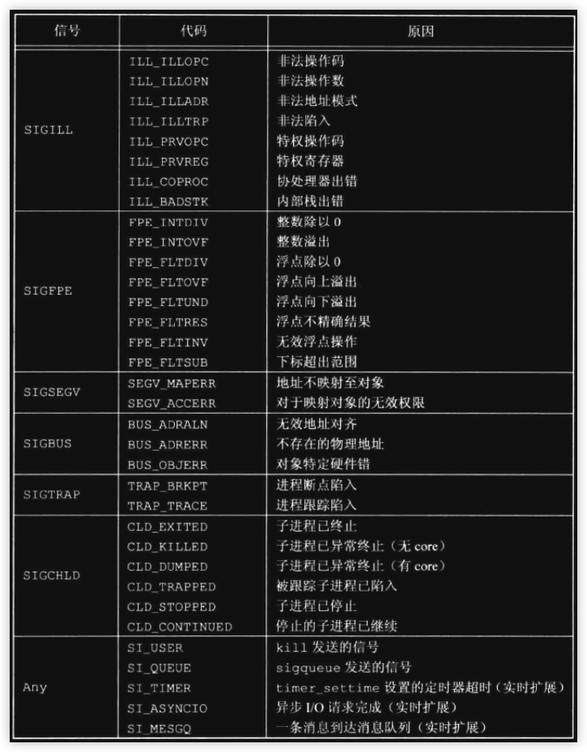
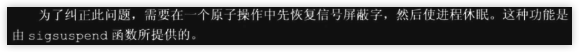

### 引言
- 信号是软件中断[^ann-interrupt-0]. 信号提供了一种处理异步事件的方法. 如:
- 网卡驱动中断产生对应的信号
    - 屏幕的垂直同步信号
    - 终端中键入中断信号的按键
    - 等等

- 在UNIX系统的早期版本中就已经提供了信号机制. 但当时的信号模型并不 <font color=deeppink>可靠</font>(<font color=green>关于信号的不可靠后面会单独探究</font>). 信号可能丢失, 在临界区执行代码时, 进程很难关闭所选择的信号. 后面在某些系统中对信号的架构作了修改, 增加了可靠信号的机制. 再后来POSIX制定了信号的标准


<br/>


### 信号概念
- 这里就不细说中断相关的概念了. 现在所学习的信号已经被制定在了标准下. 先来看看 <font color=deeppink>信号名的定义</font>.
    - 信号名都是以`SIG`开头
    - 被定义在`<signal.h>`头文件中
    - 不存在为0的信号(<font color=green>0对kill有特殊的用途</font>)


<br/>

- 很多条件可以产生信号, 但大致可分为2类(<font color=green>硬件中断产生以及直接由系统调用发送信号</font>)
    1. 当用户摁下键盘上某些键位时(`也可组合`), 会引发终端产生信号. 如`Ctrl+C`通常产生`SIGINT`, 一般情况下该信号会终止进程
    2. 硬件异常产生信号. 如除数为0, 无效的内存引用. 准确来说是硬件产生异常引发中断, 内核接收到通知, 然后处理成对应的信号发送给当前对应的进程
    3. 进程或shell调用`kill`直接发送信号(<font color=green>满足发送权限</font>)到对应的进程或进程组.
    4. 当某种软件条件已经发生, 可能也产生信号. 如定时器(`alarm`), 网卡数据包, 管道等等


### 异步
- 所谓的异步是指 <font color=deeppink>当前进程对某个发生的条件并不能确定其产生的时刻</font>. 说白了就是进程不知道什么时候会被外界kill, 会收到网络来的数据... 
- 异步一般有2种处理方案:
    1. poll(`轮询`)
    2. weakup(`唤醒`)
> 从字面来看, 这2种异步的处理理解起来很简单. 它们适用于不同的场景. 对于信号的处理一般采用注册通知机制, 即直接向操作系统注册信号的通知. 进程不能阻止信号的到来, 但可以选择要不要处理, 所以对于信号的处理基本有3种情况:
>   1. 忽略(`SIG_IGN`)
>   2. 默认(`SIG_DFL`)
>   3. 错误(`SIG_ERR`)
>   4. 添加到掩码(`SIG_HOLD`)
> PS: 暂时先不要管`SIG_HOLD`. 这几个值是通过类型转换来的

|名|值|
|:-|:-:|
|`SIG_DFL`|`(void (*) (int))0`|
|`SIG_IGN`|`(void (*) (int))1`|
|`SIG_ERR`|`(void (*) (int))-1`|
|`SIG_HOLD`|`(void (*) (int))5`|

<br/>

> <font color=red>很多信号都可以选择忽略</font>. 但有2种信号不能这样处理:`SIGKILL, SIGSTOP`. 之所以这样是因为内核通过这2个信号使进程停止或暂停. 另外无效的内存访问也不可忽略, 因为在运行中的进程的地址空间是隔离的, 出现越界访问则进程的行为可能是未定义的

<br/>

- 除了上述信号处理的方式外, 还有一种是用户自己处理: <font color=deeppink>向操作系统注册信号的处理函数</font>(`后面细讲`)


<br/>

### 标准信号列表

> 先给出所有的信号(<font color=green>截图自书</font>), 后面会挑出常用的信号作解释

---



---

### core文件
- core文件是程序异常结束时,由内核为其进程产生的死亡快照. 不同的系统中core文件机制不同. 在Linux中配置core文件步骤如下:

```txt
    1. 设置core文件大小限制
        ulimit -c 1024          设置文件大小是1024K, 超过1024k不会产生core文件
        ulimit -c unlimited     不作大小限制, 不管多大的都可以产生

    2. 配置core文件的生成路径, 要有root权限
        > 在当前shell环境中配置, 关闭shell后不再生效
            echo "./core-%p-%s-%e" > /proc/sys/kernel/core_pattern

        > 永久配置(需要重启)
            sysctl kernel.core_pattern="/tmp/tmpcore/core-%p-%s-%e-%t"
        
    3. 运行会产生错误的程序
        这里配置的是临时core dump, 所以会在当前目录中生成对应的core文件

    
    4. 用 gdb -c core文件, 可以调试

    
    ps: 其中 %p---> core文件名的组成部分, 表示进程号
             %s---> ........            , 表示被异常终止时的信号
             %e---> ........            , 表示进程名
             %t---> ........            , 表示时间戳

```

> 一个coredump的例子

```cpp
int main(int args, char** argv){
    int* i = nullptr;
    *i = 20;;                   # __code_err
    return 0;
}
```
> 上述程序中的`__code_err`会引起无效的内存访问, 内核会直接终止该进程.

```shell
liubo-linux% ./main
zsh: segmentation fault (core dumped)  ./main
liubo-linux% l | grep "core"
总用量 492K
-rw-------  1 liubo liubo 472K 6月  27 11:43 core-52755-11-main


# 用gdb调试core dump文件
gdb -c 产生的core文件名
```

<br/>

- 有几种情况下不产生core文件:
    1. 进程是设置ID程序, 当前运行的用户(`进程的有效ID`)不是该文件的所有者
    2. 同1, 进程是设置组ID, 当前用户不是该文件组所有者
    3. 文件太大(`超过 ulimit -c 的值`)
    4. 文件已存在, 没有写权限
    5. 对core文件所有的目录没有写权限


<br/>


### 常用的信号

|信号名|说明|
|:-|:-|
|`SIGABRT`|自己调用产生该信号, 并异常终止|
|`SIGALRM`|由alarm设置的时间到点时产生|
|`SIGCHLD`|子进程结束(<font color = green>包括异常</font>)时由内核发送给对应的父进程, 父进可以在处理函数中调用wait立即获取到子进程终止的状态|
|`SIGCONT`|作业控制时, 被暂停的程序由该信号唤醒(<font color=green>一般由shell来做</font>)|
|`SIGFREEZE`|算术运算异常, 如除以0, 浮点溢出等|
|`SIGHUP`|终端检测到连接断开, 将此信号发送给会话首进程(`终端的CLOCAL未设置时`), 若会话首进程已经终止, 则会发送到前台所有的进程. 当产生孤儿进程组时, 该进程组中所有的进程也会收到该信号, 并且随后收到`SIGCONT`|
|`SIGINT`|在终端摁下`Ctrl+C`时向前台进程组中的进程发送该信号, 默认是终止进程|
|`SIGIO`|异步IO事件(`后续学习到时再探究`)|
|`SIGKILL`|该信号不能被捕捉, 因为它提供了一种终止进程的方案|
|`SIGPIPE`|管道的read进程已经终止, 此时另一端write时, 会产生该信号. socket时若连接已断开, 写入socket时也产生该信号|
|`SIGQUIT`|由终端驱动产生中断(`Ctrl+\`),再由内核发送. 收到该信号的是前台进程, 同时产生core文件|
|`SIGSEGV`|无效的内存引用[^ann-bad-access]|
|`SIGSTOP`|作业中, 暂停一个进程. 它不能被捕捉|
|`SIGTERM`|相对于`SIGKILL`它可被捕捉|
|`SIGTSTP`|挂起前台进程(`Ctrl+Z`)|
|`SIGTTIN`|后台进程read终端时, 可能产生该信号,若产生会被暂停. 若是孤儿进程组read时, 则报错(`errno 为 EIO`)|
|`SIGTTOU`|作业控制时若后台进程write时, 可能产生. 若是孤儿进程组write时,也是出错. 终端操作可能也会产生该信号(`后面终端IO时再学习`)|
|`SIGUSR1`|用户自定义信号, 可用户应用程序|
|`SIGUSR2`|同上|
|`SIGVTARM`|`setitimer`定时器间隔时间到了产生|


<br/>

### signal
- 最简单的注册信号处理接口(`在后面会说明它所存在的问题, 并给出解决方案`)

```cpp
#include<signal.h>
void (*signal(int register_signo, void(*handler_func)(int signo))) (int);

// 成功, 返回上一次配置的信号处理配置, 出错返回SIG_ERR
```
> 该函数由 <font color=red>ISO C</font>定义, 但标准C不涉及多进程, 进程组, 终端IO等. 所以它对信号的定义在Unix中是不完整的
> 该函数后面会用`sigaction`来替代, 这里先学习它. 它的函数声明比较复杂, 通常来说可以简化为如下:
```cpp
// typedef 函数指针
typedef void (*Sig_handler_function)(int signo);

Sig_handler_function signal(int register_signo, Sig_handler_function handler_func);


// typedef 函数
typedef void Sig_handler_function(int signo);
Sig_handler_function* signal(int register_signo, Sig_handler_function* handler_func);


// 注意, 上下2种不同的是, 一个是定义了一个函数指针. 一个是定义了函数类型, 用的时候要指明是指针类型
```
> 事实上signal所表示的是: 指定`register_signo`的处理函数是`handler_func`, 返回上一次配置的处理函数. 现在回到原函数的声明来解释一下(`C语法`)

```txt
void (*signal(int register_signo, void(*handler_func)(int signo))) (int);

这是C语言的语法
    将 这一行声明 分为3个部分
    1. void     最前面

    2. (*signal(int register_signo, void(*handler_func)(int signo))) 中间

    3. (int)    最后面


解读:
    将2看作一个整体, 假如是  abc, 则原声明变为

    void abc(int)

    所以abc是一个函数, 即 abc所表示的 一大串 就是函数

    再来看abc, abc这一大串本身又是一个指针 (*signal), 它是函数指针
    接收的参数有2个: int register_signo, 另一个又是函数指针

    所以整体语法的解释是:
        调用signal, 传递2个对应的参数后, 返回的又是一个函数(abc)

    ps: 这是C语法, 不理解记住就行了, 可以从编译器角度来理解, 若自己写编译器时 从左到右扫描字符串时, 也是这样解释的
```


<br/>

- `register_signo`就是表中的信号名. `handler_func`就是处理函数, 可以有5种:
    1. `SIGIGN`
    2. `SIGDFL`
    3. `SIGHOLD`
    4. `SIGERR`
    5. 用户自己的函数


<br/>

```cpp
#include<unistd.h>
#include<iostream>
#include<signal.h>
#include<sys/types.h>

using namespace std;

int main(int args, char** argv){
    signal(SIGUSR1, SIG_IGN);
    cout << getpid() << endl;
    pause();
}
```
> 该程序对`SIGUSR1`的动作修改为了忽略(<font color=green>默认是终止进程</font>). 这样在发出该信号后, 进程不会被杀死

```shell
./main
19880                           # 打印进程号
..                              # 进程阻塞在这里


# 在另一终端中
kill -s USR1 19880              # 向指定的进程发送 SIGUSR1, main进程没有任何动作
kill -s INT  19880              # main进程会被直接终止
```

> signal的一个缺点是: 若要判断某个信号当前的处理, 必须要修改该信号的处理函数才能知道之前设置的. 一个场景: <font color=red>为进程设置`SIGINT`, 但只有进程当前是`SIG_IGN`时才设置</font>
```cpp
....

auto previous = signal(SIGINT, my_func);                    // __code_0
if(previous != SIG_IGN && previouns != SIG_ERR){            // __code_1
    signal(SIGINT, previous)
}

...
```
> 上面只是局部的代码, 不过也说明了存在的这个问题: 只有设置后才能确定之前的状态. 然后还要根据业务条件再还原设置. 在并发时`__code_0与__code_1之间有时间窗口, 会出现竞争, 可能就会导致判断的不正确`


<br/>

### 信号处理函数所在的栈
- 因为信号处理程序基本是为信号服务的, 所以它由内核调用. 所以进入到信号处理程序中时, 当前的堆栈环境是由内核建立. 但并不意味着此时它处于内核态[^ann-kernel-ing]. 若用户自己调用程序处理程序, 则此时该函数的堆栈就是当前用户运行的堆栈. 这里为了方便用`Objective-C`来演示
```objc
#import<Foundation/Foundation.h>
#include<stdio.h>
#include<signal.h>


void test(int no){
    printf("test");
    NSLog(@"%@",NSThread.callStackSymbols);
}

int main(int args, char** argv){
    signal(SIGINT, test);
    
    NSLog(@"%d", getpid());
    pause();
    test(2);
    return 0;
}
```
> 编译`clang main.m -framework Foundation -objc-arc -o main`, 运行结果如下:
```shell
2023-06-27 14:38:41.943 main[21099:511965] 21099
^C2023-06-27 14:38:43.501 main[21099:511965] (                  # 产生信号时, 从内核过来
	0   main                                0x0000000100a0aefd test + 45
	1   libsystem_platform.dylib            0x00007ff810e945ed _sigtramp + 29
	2   libBNNS.dylib                       0x00007ff81b9d3000 __dso_handle + 0
	3   main                                0x0000000100a0af61 main + 65
	4   dyld                                0x0000000200d6341f start + 1903
)
2023-06-27 14:38:43.502 main[21099:511965] (                    # 自己调用时, 直接在当前运行的栈桢中
	0   main                                0x0000000100a0aefd test + 45
	1   main                                0x0000000100a0af6b main + 75
	2   dyld                                0x0000000200d6341f start + 1903
)
```
> 虽然在处理信号时, 栈不一样, 但它的地址空间还是之前的进程, 若在处理过程中修改某些全局性的数据结构则可能出现问题(`这个问题涉及到可重入的概念, 后面细说`)
> 在处理程序的过程中也可能被中断, 转向其他信号处理程序
```cpp
#include<unistd.h>
#include<signal.h>
#include<fcntl.h>
#include<Foundation/Foundation.h>
#include<pthread.h>
void f1(int no){
    printf("usr1:%d\n",no);                     // __print_2
    printf("%p\n", pthread_self());             // __print_f1
    while(true);                                // __code_0
    printf("weak up\n");                        // __print_4
}
void f2(int no){
    printf("int:%d\n",no);                      // __print_3
    printf("%p\n", pthread_self());             // __print_f2
}

int main(int args, char** argv){
    chdir("/tmp/lb");
    printf("%p %p\n",main, pthread_self());     // __print_0

    signal(SIGUSR1, f1);
    signal(SIGINT, f2);

    printf("%d\n",getpid());                    // __print_1

    kill(getpid(), SIGUSR1);

    printf("send usr1 over\n");                 // __print_5
    while(true)
        pause();

    return 0;
}
```
> 上面的程序经编译,然后运行的过程如下
```shell
0x104321eb0 0x204549280                         # __print_0
23795                                           # __print_1
usr1:30                                         # __print_2
0x204549280                                     # __print_f1
^Cint:2                                         # 摁下 Ctrl+C后, __print_3打印
0x204549280                                     # 接着打印 __print_f2
[1]    23795 terminated  ./main                 # 在其他终端kill该进程
```
> 上述程序运行后, 会直接进入`f1`函数, 然后一直占用cpu(`__code_0`). 在终端摁下`Ctrl+C`后, `f2`会被调用并输出信息. 这2个信号处理函数处于不同的栈(`这一点在上一个小案例中测试了`), 但它们还是在同一个线程执行(<a id="stack-same-signo">`anchro`</a>). 这里面实现的原理是: <font color=red>操作系统在切换信号处理时, 会保存当前现场并制造新的现场</font>, 所以对应的信号程序之间的切换开销还是有的. 
> 还有一个问题要考虑: 用户正常流程的代码栈在和信号处理函数切换时也是同样的道理, 它们的栈不同, 但基本会在同一线程. 
> 这里多说一点: 在Unix中常常使用的`线程函数`其实是`POSIX标准线程函数`, 站在分层的角度来看 <font color=red>POSIX线程函数属于用户态函数</font>. 所以就有一个这样的问题
>   1. 库函数可能是属于用户态的, 若有用户态则与之对应的它所实现的线程也是用户态的, 在OS的角度是看不到`TCB`[^ann-thread-0], 因为它定义在用户态的环境中.
>   2. 因为1的原因, OS调度的单位只能是进程, 这就会出现3种现象: <font color=red>OS为进程分配的时间片会由对应的线程库中自定义的调度算法再进行分配</font>; 线程库自己不能主动交出CPU; <font color=red>若某个线程执行了阻塞的系统调用, 则整个进程都可能被阻塞, 这样就达不到并发的效果</font>
>
> PS: 内核中也有线程, 这种类型的线程对OS来说是透明的, OS此时调度的单位是就是线程. 从逻辑上来看库函数实现的线程, 其本质还是依赖内核的实现. 虽然如上面所说, 用户态的线程不能主动交出CPU, 甚至某些时候不能做到并发, 但用户态的库函数线程在切换时不需要转向内核, 相对来说开销就很小, 速度非常快.  现在作为上层开发的用户已经不需要关心用户态线程和内核线程的关系, 大部分的操作系统已经做好的做优化的处理, 几乎和内核线程一样效果. 这一点自己可以写程序测试, 在一个线程中睡眠, 然后其他线程并未出现被阻塞的情况.
> 个人猜测POSIX只是标准接口说明, 可能对于线程的部分操作系统已经将其作为内核调度实现的一部分了.


<br/>

### fork后的信号
- 在第8章时学习了fork, 现在简单来回顾一下: fork之后子进程复制了父进程的数据部分(`不包括代码部分`). 其中信号部分的继承规则如下:
    1. 信号屏蔽和安排
    2. 未处理的信号集被清空
    3. 未处理的闹钟被清除
> 第1条是因为fork了后, 与父进程共享代码空间, 所以相应的`signal`相关的信号处理函数也继承过来
> 第2,3条是规定, 父进程中定义的信号集在fork后被清空, 闹钟也是一样的

```cpp
#include<iostream>
#include<unistd.h>
#include<signal.h>
#include<fcntl.h>
#include<pthread.h>

using namespace std;

int main(int args, char** argv){

    chdir("/tmp/lb");


    signal(SIGINT, [](int no){
        cout << "sigint[" << getpid() << "]\n";             // __code_2
        abort();
    });

    signal(SIGALRM, [](int no){
        cout << "sigint[" << getpid() << "]\n";             // __code_1
    });

    alarm(2);                                               // __code_0

    if(fork() == 0){
        while(true)
            pause();
        return 0;
    }
    while(true)
        pause();

    return 0;
}
```
> 当程序运行后, 2秒后会发出`SIGALRM`信号, 但只有`父进程打印了 __code_1`, 所以fork后, 子进程未处理的闹钟会直接被清空

```shell
./main
sigint[25125]                           # 2秒后 父进程输出 __code_1
^Csigint[25125]                         # 此时父子进程仍阻塞, 摁下 Ctrl+C, 则都会调用 __code_2, 并结束
sigint[25127]
[1]    25125 abort      ./main
```
> 上述程序用了C++11的`lambda`


<br/>

### exec时信号的安排
- 由于exec会将进程现在的空间数据全部重新填充, 所以对于先前捕捉的信号处理函数来说就没有意义了, 因为地址空间已经完全变了. 但对于先前设置的`SIG_IGN`来说, exec并不会改变这种状态. 一个典型的例子是非作业控制的shell(`可能操作系统不支持, 或终端驱动不支持`), 当shell执行后台进程时, 一般会直接设置`SIGINT`为`SIG_IGN`, 这样在前台摁下`Ctrl+C`时后台进程不会被终止(`因为不支持作业, 所以没有所谓的驱动将信号发送到前台进程组中的进程这一说`)
```cpp
#include<iostream>
#include<unistd.h>
#include<signal.h>
#include<fcntl.h>
#include<sys/wait.h>

using namespace std;
int main(int args, char** argv){
    signal(SIGINT, SIG_IGN);                        // 忽略SIGINT
    if(fork() == 0){
        puts("will call read");
        execlp("read","myread",nullptr);            // 调用shell-read
        perror("read");
        return 0;
    }
    wait(0);
    return 0;
}
```
> 上述程序运行后, 会等待用户在屏幕上输入内容, 若此时摁下`Ctrl+C`, 并不会终止read进程, 因为exec时, SIGINT已经被忽略了, exec后不会将SIGINT的信号所清空


<br/>

### 信号的响应过程(`简述`)
- 本人并未看具体内核的实现. 这里所述的过程是根据网上视频参考的. 
- 首先要说清楚视频上信号响应过程, 要先理解几个概念:
    1. 中断
    2. 进程层面的调度
    3. 分时的基本原理
    4. 内核维护的进程信号机制
 
```txt
中断:
    中断属于硬件层面. 硬件和 系统的通讯 也是由代码来完成, 只不过这种代码和平时我们写的应用代码不同, 它被
    称为 驱动. 简单来说中断就是硬件内部电路处理出现了异常后由驱动程序向CPU发出请求. CPU收到请求后会暂停下来.
    此时相当于进程立即暂停. CPU收到请求会获取到中断的编号, 并在收到的那一瞬间会跳转到 中断向量表, 寻找对应
    的编号所映射的 中断处理函数. 此时由操作系统接管.  而现在所说的信号其实就是在对应的中断处理函数中产生的

    ps: 中断向量表是操作系统在初始化时就建立好的. 


分时:
    它是调度的前提. 对于一个单核CPU来说, 可以使用分时技术实现 并发效果. 其基本原理是:
    对系统中存在的进程分配 不同程度的时间, 每个进程的时间到了后, 被操作系统暂停, 然后取
    出队列中的下一个进程继续执行. 由于每个进程的时间尺度太小, 所以人的感觉像在并发执行一样

    ps: 分时也依赖于中断, 产生这个中断的硬件是 时钟, 所以也是时钟中断. 


进程层面的调度:
    对于Unix来说, 用户所使用的线程是库函数(POSIX), 前面提到过, 这种类型的线程可能是用户线程, 也
    就是在用户态, 对于内核来说它看不见这种线程的TCB, 所以调度单位是进程, 而进一步的并发是由
    库函数内部实现的调度算法来决定. 它的缺点是不能主动交出CPU, 一个线程的系统调用可能使整个进程
    被阻塞. 当然如今的内核已经解决这种问题, 我们只管用就行了

    ps: 内核中存在的线程调度单位是线程, 这种线程的TCB由内核自己来维护. 即使是库函数的线程也定是依赖
    内核. 也就是说用户线程和内核线程存在某种对应关系. 根据一个现象来猜测一下: 可能POSIX线程的实现已经
    转移到了内核中, 所以有理由相信目前Unix中内核的调度单位已经是线程了. 之所以这样猜测的原因是malloc作为
    一个库函数, 在window平台已经被移植到了内核中, 不再是单纯的库函数了. 所以很有可能的是POSIX规定的线程
    接口可能也由操作系统自己来实现了


内核维护的进程信号机制:
    内核为每个进程(其实是线程)维护了一个表:
        ____________________________
        |    mask     |    pending |
        ~~~~~~~~~~~~~~~~~~~~~~~~~~~~
        |     1       |       0    |                // SIGINT
        ~~~~~~~~~~~~~~~~~~~~~~~~~~~~
        |     1       |       0    |                // SIGTERM
              .               .
              .               .
              .               .                     // 32个信号 

    
    如上图所示: 
        mask        表示信号屏蔽, 每1项是1个bit位, 默认是1
        pending     表示信号到来被标记, 每1项也是1个bit位, 默认是0, 当信号产生时, 由内核置1

    
    只有当 进程被调度时, 从内核态准备出去时, 才会检查是不是有信号, 检查的方法是
        mask & pending
    若结果是true, 则表示处理这个信号, 大致步骤是:
        1. mask置0, pending置0
        2. 内核会布置现场, 直接跳转到信号处理程序中
        3. 处理完毕后mask置1
        4. 等待被调度

    若为false, 则恢复栈信息, 并回到原来用户程序执行的地址
```

<br/>

> 大致搞明白上面的4个概念, 现在来细说一下信号的响应过程:

```txt
信号产生的时间, 地点
    根据上面的描述: 信号产生于中断处理函数中, 它产生时, 对应的进程一定处于暂停状态


场景:
    void print_info(int no){
        printf("!");                            // __code_1
    }

    void main(int args, char** argv){
        signal(SIGINT, print_info);

        for(int i = -1; ++i < 10;){
            printf("*");                        // __code_0
            sleep(1);       
        }
    }

    ps: 上述是 1秒打印1个*, 若收到中断(Ctrl+C)打印!


过程:
    1. __code_0

    2. __code_0
    
    3. 终端上摁下Ctrl+C
        > 硬件产生中断
        > 硬件驱动发出中断请求, 中断类型是Ctrl+C(SIGINT)
        > CPU暂停, 跳转到对应的中断处理中
        > 操作系统处理中断, 包装为信号

    4. 产生SIGINT信号, OS将main函数的进程的 pending置1

    5. 4的过程中, main函数已经是暂停状态, PCB\TCB中有所有的栈信息, 此时这一步main进程处于内核调度的就绪队列中
        PCB: Process Control Block, 进程控制块, 它里面有所有线程的 TCB-table

    6. 假如此刻main被调度, 则做以下步骤:
        if(mask & pending == true){ 
            即SIGINT有信号到来
            1. mask置0, pending置0
            2. 内核会布置现场, 直接跳转到 print_info函数中
            3. print_info函数返回后mask置1
            4. 再次进入就绪队列, 等待被调度
            5. 若被调度, 则又回到第6步重复这个过程
        }else{
            直接跳转到原来被中断的地方
        }


```

<br/>


### 信号的不可靠
- 根据上面程序的过程,可以预料到这样一个现象: 
> 在响应信号的过程中, 即执行 print_info过程中mask为0, pending为0, 若此时又发生 SIGINT信号, 则 pending置1, 但mask还是0, 6.5这一步会再次响应到SIGINT. 但若在 print_info的过程中连续来了10次的SIGINT信号, 最终的效果也还是只响应1次, 因为信号的判断机制是 bit, 它无法记录下产生信号的次数和顺序, 这就是信号的不可靠

- 书上的描述是:<font color=deeppink>信号可能会丢失, 根据推断, 10次的信号的确只响应了1次, 丢失了9次.</font>原因就是信号的架构机制所导致.
- 针对这种问题, 后面的标准提出了 <font color=deeppink>实时信号\排队信号\可靠信号</font>(<font color=green>它们是一个概念</font>), 这种类型的信号解决的就是标准信号的不可靠, 在响应的过程中由内核会排队记录, 然后一个一个依次响应

<br/>

```cpp
#include<iostream>
#include<unistd.h>
#include<signal.h>
#include<fcntl.h>
#include<sys/wait.h>


using namespace std;
int main(int args, char** argv){
    signal(SIGINT, [](int signo){
        cout << "!" << std::flush;                      // __code_1
        for(int8_t i = -1; ++i < 3;){
            sleep(1);                                   // __code_sleep
        }
    });
    for(int i = -1; ++i < 5;)
        (cout << "*\t" << std::flush, sleep(1));        // __code_0
    return 0;
}
```
> 该程序中的信号处理函数有一个循环, 目的是让信号处理程序在执行过程有明显的时间周期. 
> 大致过程是:
>   1. 每隔1秒打印`*`
>   2. 在打印过程中, 摁下`Ctrl+C`立即打印`__code_1`
>   3. 打印`__code_1`后, 信号处理3秒后才会返回, 若在返回前不断在终端摁下`Ctrl+C`, 则并不会出现`__code_1`被连续打印的情况
> ps: 此实现是测试在信号处理过程中: 1. 信号处理函数的标准信号在处理过程中并不会响应相同信号; 2. sleep阻塞会被`Ctrl+C`打断(`__code_0`)

<br/>


> 第1次摁下`Ctrl+C`时, __code_0即使在sleep也会被打断. 后面在信号处理程序中有sleep没被打断是因为, 此时不会响应相同的信号, 也就不会进入到信号处理程序

<br/>

### 线程和信号混乱的情况(`以后回来再看`)
- 当多线程中用到信号时, 在Unix中会出现不可预料的情况. 目前还不能作出解释. 先看代码和测试
```cpp
#include<signal.h>
#include<unistd.h>
#include<iostream>
#include<thread>

using namespace std;
int main(int args, char** argv){
    signal(SIGINT, [](int no){
        cout << "sigint start\n";
        while(1){
            cout << "sigint:" << pthread_self() << "\n" << flush;       // __code_3
            sleep(1);
        }
        cout << "sigint end\n";
    });


    thread([](void){
        while(1){
            cout << "thread:" << pthread_self() << "\n" << flush;       // __code_0
            sleep(1);
        }
    }).detach();
    

    while(1)                                                            // __code_1
        pause();                                                        // __code_2
    cout << "over\n";

    return 0;
}
```
> 该程序运行后: 1秒1秒在子线程打印`__code_0`. 第1次摁下`Ctrl+C`后, 主进程`__code_2`被打断随后调用`信号处理函数`, 之后每隔1秒打印`__code_3`. 并且`__code_0`也交替打印. 第2次摁下`Ctrl+C`时, 则`__coed_0`居然被暂停, 然后子进程去回调了信号处理函数, 出现的现象是`__code_3`由2个线程在交替打印
> 目前只能说, 在一个进程中的信号可能被所有的线程接收. 同时说明了Unix中的调度是基于线程的, 每个线程都有`mask-pending`表

<br/>


<br/>

### 早期信号机制(`了解`)
- 在比较早的信号实现中: <font color=deeppink>信号响应1次后就会被重置成默认</font>, 用户必须在信号处理函数中再做信号注册, 大致如下:
```cpp
int sig_int(){
    signal(SIGINT, sig_int);                // __code_register_1
    return 0;
}

int main(int args, char** argv){
    signal(SIGINT, sig_int);                // __code_register_0
    return 0;
}
```
> 在当时由于C还未标准化出void类型, 所以信号处理函数的返回是int, 同时参数为空. 并且当时的处理是`__code_regsiter_0`后若产生了信号, 进入到`sig_int函数前`信号`SIGINT`会被重置为默认值, 同时在信号处理中 <font color=red>会再次接收到同一信号</font>. 这里就会存在这样一个问题: <font color=red>在发生信号执行到`__code_register_1`之前时, SIGINT已经重置为默认, 若此时再次发生SIGINT的信号, 会直接终止进程</font>
> 同样早期还有另一个问题, 如以下代码
```cpp
int flag = true;
int sig_int(){
    signal(SIGINT, sig_int);            // __code_2
    flag = false;                       // __code_3
}

int main(int args, char** argv){
    signal(SIGINT, sig_int);            // __code_0
    
    while(flag) pause();                // __code_1
    return 0;
}
```
> 这里存在的问题是可能出现以下的时间顺序, 导致进程永远被阻塞:
>   1. `__code_0`
>   2. `while(flag)` 成立, 但还未执行到`pause()`
>   3. 发生`SIGINT`信号
>   4. 信号返回, 此时`flag = false`
>   5. `pause()`被执行
> ps: 若第5步后, 后续一直不发生`SIGINT`的信号, 则进程可能永远被阻塞

<br/>


### 中断的系统调用
- 系统调用会被任何一个信号所中断(<font color=green>不管是早期的还是如今</font>). 此时系统调用返回-1, 并设置`errno 为 EINTR`. 这里要说明一点: 任何的系统调用. 书中说明的是 <font color=deeppink>低速的系统调用</font>. 但仔细想想, 若磁盘IO在用户发出系统调用时因为繁忙而被阻塞, 此时阻塞期间若有信号产生也会中断该调用. 在学习低速的系统调用前, 先看以下案例

<br/>

```txt
├── a.io
├── a.txt
├── main
├── main.cpp

当前目录下 a.io表示一个管道文件(以后会学习到)

main函数会读取管道, 然后被阻塞, 等待另一端写入管道
```

```cpp
#include<signal.h>
#include<iostream>
#include<fstream>
#include<string>

using namespace std;
int main(int args, char** argv){
    char result[4096] = {0};
    signal(SIGINT, [](int no){
        cout << "sigint\n";
    });

    cout << "will read from pipe:" << std::flush;
    ifstream file("./a.io", std::ios::in);
    if(file.fail()){
        perror("open");
        return -1;
    }

    file.getline(result, 100000, '\n');                     // __code_read
    if(file.fail()){
        cout << "errno:" << errno << "\t" << strerror(errno) << endl;
    }else{
        cout << result << endl;
    }
    return 0;
}
```
> 该程序 <font color=red>从管道中读取内容</font>可能被阻塞等待写入的一方. `__code_read`未使用`系统调用的接口read函数`, 但不管是什么类型的语言接口, 最终底层一定调用`read`.结果如以下测试

```shell
## 在某个终端上运行该程序
 ➜ lb ./main
will read from pipe:^Csigint        # 运行到 __code_read后, 因为没有写入的一端, 会阻塞在这里. 但却手动摁下了`Ctrl+C`, 直接导致底层的系统调用read中断
open: Interrupted system call       # 输出中断的结果
```
> 一般解决系统调用被中断的方案是:
```cpp
int res = 0;
while(res = read(fd, buf, size)){                   # 低速的系统调用
    if(res < 0){
        if(errno == EINTR){
            // 假错, 则继续读取
            continue;
        }
        // 真错
        break;
    }

    // res 是不是等于 size的情况 这里没有给出判断
}
```
> 还有另一种方案是: <font color=red>让某些系统调用自动重启</font>. 这一点后后面学习

<br/>

### 低速系统调用
- 低速系统调用表示可能会永久阻塞进程或线程. 非低速系统调用的其他调用则不阻塞, 一般来说包括:
    1. 某些类型的文件(`管道, 终端设备, 网络设备`)
    2. 如前面所述的当设备繁忙时, write操作可能不能被立即接受, 也会阻塞
    3. pause函数, wait函数
    4. 某些ioctl操作
    5. 某些进程间通信
> 关于磁盘IO的说明: 虽然读写一个磁盘文件可能暂时阻塞调用(<font color=green>磁盘驱动需要将写操作请求排队, 在适当的时间后才去执行</font>), 但这只是暂时的, 除非发生硬件错误, 否则很快返回


<br/>

### 自动重启的系统调用
- 为了帮助应用程序不必处理 <font color=deeppink>假中断</font>, BSD相关的系统引入了 <font color=deeppink>系统调用自动重启功能</font>. 这类自动重启的系统调用包括:`ioctl read readv write writev wait waitpid`. 其中前5个只有对低速设备进行操作时才会被信号中断, 然后重启. 对于`wait waitpid`则是捕捉到信号时中断

```cpp
#include<signal.h>
#include<iostream>
#include<fstream>
#include<string>


using namespace std;
int main(int args, char** argv){
    char result[4096] = {0};
    signal(SIGINT, [](int no){
        cout << "sigint\n";
    });

    cout << "will read from pipe:" << std::flush;

    cin.getline(result, 100000, '\n');                  // __code_0
    // char buf[4096];
    // read(STDIN_FILENO,char_buf,4096);                // 这2句注释的的代码是真正测试系统调用下read是不是自动重启的. 结果是自动重启
    return 0;
}
```
> 上述程序是之前程序中的管道改为了读标准输入. 最后测试的效果是: <font color=red>在阻塞期间, 若发送SIGINT信号, `__code_0`并不会中断, 说明读标准输入时, 内部已经做了自动重启</font>


<br/>


> `wait和waitpid`只会捕捉`SIGCHLD`信号
```cpp
#include<signal.h>
#include<unistd.h>
#include<iostream>
#include<fstream>
#include<string>


using namespace std;
int main(int args, char** argv){
    if(fork() == 0){
        sleep(100);
        return 0;
    }
    signal(SIGINT, [](int no){
        cout << "sigint\n";
    });

    wait(0);
    cout << "over\n";

    return 0;
}
```
> 测试如下



<br/>

> <font color=red>后续的替代函数sigaction会有标志位去控制是否重启</font>


<br/>

### 可重入函数
- 进程在处理信号的过程中, 原来所执行的代码处理阻塞等待状态(`这里不考虑多线程的问题`). 那可能会出现这样一种问题: <font color=deeppink>用户代码正在执行malloc分配内存, 但此次调用的malloc的过程还未结束, 突然来了信号. 此时用户代码被暂停, 转向信号处理, 如果此时在信号处理中也调用malloc, 则基本可以断定malloc的全局记录链表将被破坏. 因为上一次malloc的过程还未完成就又进行了下一次的调用</font>. 
> 信号处理时一定要考虑这种全局结构的问题. 所以 <font color=deeppink>这种情况下的malloc就是不可重入的</font>

- 所谓的可不可重入是针对信号处理来说的, 在信号处理中有些函数可以调用, 有些不可调用. POSIX下的系统调用都是可重入的. 大部分标准的库函数都是不可重入的.  这里<font color = deeppink>用C++中的cin的输入来说明一些情况, 同时会回顾到文件表项的偏移问题</font>

```cpp
#include<signal.h>
#include<unistd.h>
#include<iostream>
#include<thread>


char buf[1024];


using namespace std;
int main(int args, char** argv){
    signal(SIGINT, [](int no){
        cout << "sigint start\n";                   
        cin.getline(buf, 1024, '\n');               // __code_1
        cout << "sigint over:" << buf << endl;      // __code_2
    });


    cin.getline(buf, 1024, '\n');                   // __code_0
    if(cin.fail()){
        perror("read");
    }
    cout << "main:" << buf << endl;                  // __code_3

    return 0;
}
```
> 程序率先会阻塞在`__code_0`等待用户输入内容到`全局的缓存中buf`. 若此时发送一个`SIGINT`到进程中, 则直接进入到`__code_1`, 此时是在信号处理中读取终端的键盘输入. 我们不用考虑`__code_0, __code_1`处2次读取键盘输入有没有问题. 若用户此时输入内容, 相当于在信号处理中将内容填充到了buf中. 接着信号处理结束, 输出buf中的内容. 然后回到`__code_0`时进程的状态, 此时还是等待用户的输入, 等到这一次用户输入完毕后, `__code_3`就会打印相关的内容. 
> 但这里存在一个细节: <font color=red>文件偏移的共用问题</font>. 本程序中虽然使用的是标准cout的成员函数来获取键盘输入, 看上去好像在调用库函数一样, 并且在这2处都使用了全局变量`cout`, 但事实上在最底层调用的还是`read系统调用`. 所以不用关心可重入问题. 但因为文件表项的偏移是共用的, 所以:
>   1. 在信号被响应后, 输入的内容是`hello回车`后, 文件偏移是6
>   2. 1完成后, 输出`hello\n`
>   3. 接着回到原来中断的代码`__code_0`, 此时还是等待输入状态, 输入`nice to meet u`后, 由于当前文件偏移是6, 所以read处理是从第6个位置开始, 所以最后打印的内容是:`main:o meet u`


<br/>

### 信号处理程序也可能被中断
- 虽然信号处理程序过程中会屏蔽相同的信号, 但若在处理过程中发生了其他信号, 则当前正在执行的信号处理也会被中断
``` txt
    条件:
        注册SIGINT, 对应的处理函数 sig_int
        注册SIGUSR1,.........      sig_usr1
        注册SIGUSR2,.........      sig_usr2

    过程:
        1. main

        2. 注册3个信号

        3. 收到 SIGINT
            mask_int = 1, pending_int = 1
            mask_usr2 =1, pending_usr2 = 0
            mask_usr1 =1, pending_usr1 = 0

        4. 修改标记(如下:), 然后进入sig_int
            mask_int = 0, pending_int = 0
            mask_usr2 =1, pending_usr2 = 0
            mask_usr1 =1, pending_usr1 = 0

        5. sig_int还未结束, 收到 SIGUSR2, sig_int被中断
            mask_int = 0, pending_int = 0
            mask_usr2 =1, pending_usr2 = 1
            mask_usr1 =1, pending_usr1 = 0

        6. 等待被调度, 但还未调度又收到 SIG_USR1
            mask_int = 0, pending_int = 0
            mask_usr2 =1, pending_usr2 = 1
            mask_usr1 =1, pending_usr1 = 1
            
            
        7. 此时被调度 发现 
            maks_usr2 & pending_usr2 = true
            maks_usr1 & pending_usr1 = true
           
        此时并不确定是要先处理 SIGUSR2还是SIGUSR1, 但从 mask-pending中信号的顺序来看, 逻辑上是哪个信号在前面就执行该信号.

        
        ps: 还有一种极端的情况是: 3个信号都已经在执行了, 但都还未结束, 此时进程又被中断暂停, 则
        下一次调度时, 发现 mask & pending = false, 则此时也是不确定内核先调用哪个信号处理


        猜想一下调度的优先级:
            1. 新的信号处理函数
                mask & pending为 true

            2. 已经处理但未返回的信号处理函数

            3. 用户非信号代码
```
```cpp
#include<signal.h>
#include<unistd.h>
#include<iostream>
#include<fstream>
#include<string>


using namespace std;
int main(int args, char** argv){
    signal(SIGINT, [](int no){
        cout << "sigint\n";
        kill(getpid(), SIGUSR1);
        cout << "send usr1 over\n";
    });
    signal(SIGUSR1, [](int no){
        cout << "sigusr1\n";
    });

    while(1)pause();
    cout << "over\n";

    return 0;
}
```

<br/>

### 可重入时errno
- 在[前面](#stack-same-signo) 的案例中可以知道信号处理程序所在的线程并不是一个新的线程, 所以对于线程变量的errno来说, 可能会存在的问题. 例如: 在进程某个时刻时errno为0, 但由于信号若在对应的信号处理程序中产生系统调用, 则errno可能会出错. 此时从信号处理程序中返回时, 就有问题.
- 解决方案是: 在信号处理程序中若产生系统调用, 则应该在开始的位置保存errno, 并在返回时还原errno

<br/>


### SIGCLD
- 它和`SIGCHLD`很容易混淆. `SIGCLD`并不是标准信号, 它是`System V`的一个信号. 虽然不是标准, 但这里还是值得学习一下. 它早期的处理机制是:
    - 默认情况下`SIGCLD`是`SIG_DFL`, 父进程可以不处理子进程的终止状态. 子进程结束后, 自动丢弃终止状态
    - 若设置为`SIG_IGN`, 则表示子进程一定不会成为僵死进程(`这有点像SIG_DFL的作法)`. 同时父进程可以不调用wait, 但若调用wait(`利用signal注册的该信号`), 则父进程会等待所有子进程都结束后, 才会返回, 此时errno为`ECHILD`
    - 若设置为`用户定义的信号处理`, 则和其他信号一样, 在子进程结束后, 立即调用信号处理程序. 即书中述说的: <font color=red>内核会检查是否有子进程准备好被等待, 若有则调用信号处理</font>
    > PS: 在早期的信号处理时曾经提到过: 信号被响应后, 内核立即将信号清空为默认值(`现在已经不是这样了, 信号处理一经注册后一直有效`), 所以对于下面的程序:

```cpp
#include<unistd.h>
#include<signal.h>
#include<iostream>


void handler(int no){
    if(signal(SIGCLD, handler) == SIG_ERR){     // __code_0
        exit(-1);
    }

    if(wait(0) < 0){
        exit(-1);
    }
}

using namespace std;
int main(int args, char** argv){
    if(signal(SIGCLD, handler) == SIG_ERR)
        exit(-1);

    if(fork() == 0){
        sleep(2);
        return 0;
    }
    pause();
    return 0;
}
```
> 此程序在`System V`上会出现栈溢出的情况. 因为`handler`发生时, 子进程一定结束了, 正在处于`准备被回收的状态`. 所以在信号处理中`__code_0`调用时, 内核又会立即检查有无进程正在准备被回收, 此时有这个子进程, 所以又会调用`handler`, 然后`__code_0`又被调用, 后续就是不断的递归, 最后栈会溢出
> 解决方案: <font color=red>先调用wait处理掉子进程的终止状态, 让它不处于准备回收的状态后, 再调用signal</font>
    `

<br/>


### SIGCHLD
- 该信号是标准定义的信号, 同样的对于该信号指定不同的处理时, 也会有不同的情况:
    - `SIG_IGN`: BSD(`4.4`)总是产生僵死进程, 其他平台不产生僵死进程(`POSIX规定`)
    - `SIG_DFL`: 标准未做说明, 所以有没有僵死进程要看具体的平台
    - `用户捕捉`: 此时有没有僵死进程是看有没有调用wait. 若父进程调用`wait`, 则子进程结束准备好被回收时, 内核不会调用`SIGCHLD的信号处理函数`; 若`不调用wait`,则子进程在结束时, 内核会调用信号处理. 但并不会清空信号处理程序. 这就意味着不必在信号处理中再次注册SIGCHLD
    > PS: 捕捉SIGCHLD时(<font color = green>后面的测试是MacOS或Linux上</font>), 书上描述的是:<font color=red>当一个进程安排捕捉SGICHLD时, 并且已经有进程准备好由其父进程等待时, 不调用SIGCHLD信号处理程序</font>. 这句话说白了就是 <font color=red>当已经存在了一个结束的子进程, 这个时候内核是对这个子进程有记录的, 会等待父进程调用wait. 但若此时父进程直接调用signal注册SIGCHLD时, 内核并不会调用该信号处理函数</font>. 后面的第2个程序之所以会调用到`handler`原因是 <font color=red>子进程结束前就已经注册了</font>
> 下面第一个是僵死进程的测试(`MacOS`)
```cpp
#include<unistd.h>
#include<signal.h>
#include<iostream>

using namespace std;
int main(int args, char** argv){
    if(fork() == 0){
        cout << "pid[" << getpid() << "]\n";
        sleep(2);
        return 0;
    }

    while(1)  
        pause();
    return 0;
}
```
<br/>

> 测试过程

<br/>

```shell
./main
pid[62325]


### 等待2秒后, 在另一个终端查看
ps auj | grep "62325"
liubo 62325   0.0  0.0        0      0 s001  Z+    1:23下午   0:00.00 <defunct>        62323 62323      0    1
## 发现该进程已经是僵死进程(Z), 但不用担心, 一般操作系统内核会有一个守护进程, 每隔一定时间会释放这些僵死进程
### 同时会保留终止状态的信息, 这样父进程可以随时在需要时再回收
### 再说一点: 僵死进程基本不占用系统资源, 但它占用pid号. 从内核实现进程的角度来看, 处于僵死进程
### 时, 它的PCB(Process Control Block)并未释放, 所以它还占据内存空间
```


> 第2个测试程序
```cpp
include<unistd.h>
#include<signal.h>
#include<iostream>

using namespace std;

void handler(int no){
    puts("handler");
}

int main(int args, char** argv){
    if(args < 2){
        cerr << "参数小于2个\n";
        exit(-1);
    }

    auto flag = atoi(argv[1]);

    if(flag != 0 && flag != 1 && args < 3){
        cerr << "请输入第3个参数:0(不等待), 1(等待)\n";
        exit(-1);
    }

    auto func = flag == 0 ? SIG_IGN : flag == 1 ? SIG_DFL : handler;
    if(signal(SIGCHLD, func) == SIG_ERR)
        exit(-1);

    if(fork() == 0){
        cout << "pid[" << getpid() << "]\n";
        sleep(2);
        return 0;
    }

    if(func == handler && atoi(argv[2]) == 1)
        wait(0);
    else
        for(;;)pause();
    
    return 0;
}
```

<br/>


<br/>


> 第3个测试程序, 当子进程已经终止时, 再注册`SIGCHLD`时, 内核并不调用信号处理
```cpp
#include<unistd.h>
#include<signal.h>
#include<iostream>

using namespace std;

void handler(int no){
    puts("handler");
}

int main(int args, char** argv){

    if(fork() == 0){
        cout << "pid[" << getpid() << "]\n";
        sleep(2);
        return 0;
    }

    sleep(10);

    if(signal(SIGCHLD, handler) == SIG_ERR)
        exit(-1);

    while(1)pause();
    return 0;
}
```
> 该程序在运行2秒后, 但小于10秒时,查看会发现产生僵死进程. 但10秒后, 注册`SIGCHLD`时, 并不会调用对应的`handler函数`


<br/>


### 可靠信号术语和语义
- 先来简单回顾一下信号的过程:
    1. 硬件中断(<font color=green>若有时候直接是发送信号不经过硬件</font>), 随之进程也被阻塞
    2. OS找到中断处理函数生成信号,派发到进程
    3. OS找到对应的进程并设置`对应信号的pending位为1`, 并不是现在立即调用, 而是被调度时再决定要不要调用
    4. 进程被调度, 发现`mask & pending == true`, 则:
        - 修改`mask, pending 为 0`, 
        - 修改进程原来的栈信息(<font color=green>程序当前的指令地址改为信号处理函数</font>)直接执行信号处理(`若用户指定信号处理`)
    5. 信号处理程序返回后, 则:
        - 修改mask为1 
        - 恢复原来进程的指令地址, 继续等待调度重复第4步
    > ps: 若第4步为false, 则直接回到进程原来中断的位置

- 书中对 <font color=deeppink>未决</font>(`pending`)的解释比较难理解. 从字面来理解就是: <font color=deeppink>一个非忽略的信号在产生后, 还未被调度到执行的时间段</font>. 即 <font color=deeppink>第4步前</font>. 所以`第1\2\3步`从逻辑上来讲就是同时发生的.
> 若一个信号的动作是忽略, 则从逻辑上来讲就是不处理该信号. 所以信号的默认和自定义都是处理信号的一种方式.  书中又提到的<font color = red>阻塞信号递送</font>的意思是<font color = red>通过提供的接口可以在信号发生前就将mask设置为0</font>, 这样在上面的5步中, <font color = red>第4步将永远为false</font>`
> 需要说明的一点是: <font color=red>只要信号到来, OS一定将pending置1, 它不管该信号的动作是什么</font>.这也是为什么说用户无法屏蔽信号到来, 但能决定对于该信号的处理

- 所谓的可靠信号是后来现出的时时信号. 后面会学习. 这种类型的信号前面也提到过, 会依次排队处理


<br/>

- 前面提到过信号的响应顺序是不可预知的, 但某些信号响应的优先级却比较高. 如进程状态的信号(`SIGCHLD, SIGSEGV等`) 


<br/>

### kill和rasie
- kill不仅仅是系统调用, 它也对应shell的一个命令. 事实它内部就是调用kill函数. rasie是标准C语义的接口. 但被POSIX扩展了. 它可以支持线程(`后面学习`)
```cpp
#include<signal.h>
int kill(pid_t pid, int signo);

int rasie(int signo);

// 成功返回0, 出错返回-1
```

- 关于kill的参数可能有以下情况

<br/>


| pid | 值 |
|:-:|:-|
| `> 0` | 发送信号到`pid`进程 |
| `0` | 发送信号到`当前进程所在进程组中的其他进程` |
| `<0` | 发送信号到`进程组为-pid的所有进程`|
| `-1` | 发送信号到当前进程有权限发送的所有进程|

> 前提是该进程有发送到指定进程的权限. root可以向任意进程发送信号. <font color=red>非root用户时, 发送进程的`实际ID, 有效ID`必须等于`接收者的实际ID, 有效ID`. 若`保存设置用户ID`功能存在, 则检查的是接收者的`保存设置用户ID`而不是`有效ID`</font>

```cpp
#include<unistd.h>
#include<pwd.h>
#include<iostream>

int main(int args, char** argv){
	std::cout << "pid[" << getpid() << "]\n";
	auto pwd = getpwuid(getuid());
	std::cout << "real user:" << pwd->pw_name << "\n";
	pwd = getpwuid(geteuid());
	std::cout << "effect user:" << pwd->pw_name << "\n";
	while(1) pause();
	return 0;
}
```
> 上述程序打印当前进程的`实际用户和有效用户`, 下面来进行这样的测试:
```shell
##  1. 修改 main 可执行权限  rwsrwxr-x,  所有人可读可执行, 并打开 设置ID位 
##  2. libuo 运行程序, sb送信号
##  3. sb运行程序, liubo发送信号


### 测试1: liubo运行, sb发信号
### liubo的终端
chmod u+s main
 ./main
pid[3771]
real user:liubo                         # 当前实际用户是liubo
effect user:liubo                       # 进程的有效用户是 liubo

### sb终端
kill 3771   
-sh: 27: kill: Operation not permitted      

### 可以发现sb没有权限发杀死 liubo的进程, 原因是当前sb的shell的实际用户是sb, 有效用户是sb, 和进程3771的实际用户, 有效用户都匹配不上


### 测试2: sb运行, liubo发信号
### sb的终端
./main
pid[3870]
real user:sb                            # 当前实际用户是sb
effect user:liubo                       # 因为设置ID位标记, 所以当前进程的有效用户ID是文件的所有者liubo


### liubo的终端
kill 3870                               # liubo可以发送信号, 因为当前liubo的shell的有效id和进程3870的有效用户ID是匹配的, 发送完毕后, sb的main被结束

```

<br/>

> 若发送的信号是`SIGCONT`, 则发送时权限检查是个特例, 可以将信号发送到属于同一会话的任一其他进程. 也就是说若当前进程发送的信号是`SIGCONT`时, 不作权限检查. 以下面的一种方案来测试:
```cpp
#include<unistd.h>
#include<signal.h>
#include<pwd.h>
#include<iostream>

int main(int args, char** argv){
	std::cout << "pid[" << getpid() << "]\n";
	auto pwd = getpwuid(getuid());
	std::cout << "real user:" << pwd->pw_name << "\n";
	pwd = getpwuid(geteuid());
	std::cout << "effect user:" << pwd->pw_name << "\n";
	signal(SIGCONT, [](int no){
			std::cout << "sig cont\n";
	});
	while(1) pause();
	return 0;
}
```

<br/>

```shell
##    main    rwxrwxr-x
##
##    当前shell:
##        实际用户:liubo
##        有效用户:liubo
##
##    1. 以sudo命令在当前的 shell中 后台运行main
##        这样能保证在当前同一个会话中
##    
##    2. 前台发送 SIGINT, 查看效果
##
##    3. 前台发送 SIGCONT, 再查看效果


sudo ./main &                           # root 后台运行 main
[1] 5009                                # 风底部的 ann-0
liubo-linux% pid[5010]
real user:root
effect user:root                        # 后台进程实际用户和有效用户和 liubo 不符合

liubo-linux% ps -o pid,ppid,pgid,sid,command -u root | grep "main"      # 查看root刚产生的进程
   5009    4927    5009    4927 sudo ./main
   5010    5009    5009    4927 ./main
liubo-linux% kill -s INT 5009                                           # liubo发送 SIGINT到同一会话中的root的sudo进程
kill: kill 5009 failed: 不允许的操作                                    # 直接报错, 没有权限
liubo-linux% kill -s CONT -1                                            # liubo发送SIGCONT到它能发送的所有进程
liubo-linux% sig cont                                                   # 后台进程响应了(因为代码中注册了该信号的处理)

liubo-linux% ps -o pid,ppid,pgid,sid,command -u root | grep "main"          
   5009    4927    5009    4927 sudo ./main
   5010    5009    5009    4927 ./main
liubo-linux% sudo kill 5009                                             # root自己杀死main相关的进程
liubo-linux%
[1]  + terminated  sudo ./main


## ann-0: 前面学习过, 后台进程要写终端, 可能产生SIGTTOUT从而暂停
##### 但这个选项是配置的, 若配置可以写, 则后台也可向终端写内容
##### 这里打印了作业的编号[1], 进程号是5009, 实际上对应的是 sudo这个进程
```
> 下面的测试是新一轮的测试, 对应的pid等是不同的, 只是演示这个过程


<br/>

### 空信号
- 最开始说过, 不存在为0的信号, 它有固定的作用, 这里来学习一下. POSIX规定: <font color=deeppink>若向一个不存在的进程发送空信号, 报错并设置errno为OSRCH</font>. 但如同书上所说的, 没有多大意义, 因为pid是会复用的(<font color=green>虽然有延迟算法</font>), 所指定的pid可能已经`死而复生`了

<br/>


### 定时器alarm
- 信号中与定时相关的函数有2个. alarm可以设置一个时间(`秒数`), 在将来的某个时刻超时时, 由内核产生`SIGALRM`信号, 默认情况下是终止进程. 若忽略(`SIG_IGN`)进程是不会被终止的(`书上说的是会终止`)
```cpp
#include<unistd.h>
unsigned int alarm(unsigned int seconds);

// 返回0 表示第1次调用
// 返回 >0, 表示前一次设置的闹钟时间余下的 秒
```
> 因为进程调度的关系, alarm的信号回调可能会不精确, 在早期的实现中, 时间甚至误差到1秒, 现在标准不允许这样处理
- 每个进程只能有一个闹钟时间, 即每次调用都会覆盖上一次的. 返回上一次设置时余留的时间(`秒`)
- 若`参数seconds为0`表示取消所有闹钟

```cpp
#include<unistd.h>
#include<signal.h>
#include<ctime>
#include<iostream>

using namespace std;

namespace lb{
    struct hand{
        static void handler(int no){
            cout << "sig int num: " << no << endl;
        }
    };
}
int main(int args, char** argv){

    signal(SIGALRM, lb::hand::handler);

    auto res = alarm(5);                        // __code_0

    cout << res << endl << flush;

    while(1) pause();
    return 0;
}
```
> `__code_0`返回0的情况有: <font color=red>第1次调用</font>; 若前一次调用是取消, 则这一次返回也是0.


<br/>

> `alarm`的时间还是比较精确的
```cpp
#include<unistd.h>
#include<signal.h>
#include<ctime>
#include<iostream>

using namespace std;

#define NSEC (1000000000)

namespace lb{
    struct timespec begin = {0};
}

int main(int args, char** argv){

    signal(SIGALRM, [](int no){
            struct timespec end = {0};

	        clock_gettime(CLOCK_REALTIME, &end);
            auto dif = end.tv_nsec < lb::begin.tv_nsec ? 1 : 0;
	        auto sec = end.tv_sec - lb::begin.tv_sec - dif + ((end.tv_nsec + dif * NSEC - lb::begin.tv_nsec) * 1. / NSEC);

	        printf("time :%f\n", sec);
    });

    
	clock_gettime(CLOCK_REALTIME, &lb::begin);
    alarm(5);

    pause();
    return 0;
}
```
> 上述是记录注册时钟前和响应时钟时的时间值, 自己可以测试一下

<br/>

### 让程序跑1秒(`版本1--轮询`)

```cpp
#include<unistd.h>
#include<signal.h>
#include<ctime>
#include<iostream>
#include<map>

using namespace std;

uint64_t count = 0;


#define TIME_UNIT (1)


int main(int args, char** argv){
    auto type = atoi(argv[2]);

    std::map<int,const char*> dic = {
        std::pair<int, const char*>(0, "time"),
        std::pair<int, const char*>(1, "clock"),
    };

    do{
        if(type == 0){
            auto now = time(0);
        cal_time:
            ++::count;
            if(time(0) - now < TIME_UNIT)
                goto cal_time;
            break;
        }

        if(type == 1){
            timespec now = {0};
            clock_gettime(CLOCK_REALTIME, &now);
            decltype(now) end = {0};
        cal_clock:
            ++::count;
            clock_gettime(CLOCK_REALTIME, &end);
            if(end.tv_sec - now.tv_sec < TIME_UNIT)
                goto cal_clock;
            break;
        }
    }while(0);

    cout << endl << "type[" << dic[type] << "]\tseq[" << atoi(argv[1]) <<"]\tresult:" << ::count << endl;

    return 0;
}
```

> 运行说明:
>   `./main 0 0`: 第1个0表示序号, 第2个0表示类型`{0:time, 1:clock}`
> 测试如下:
```shell

### 以time轮询的方式来测试
for i ({1..5}) {time ./main $i 0 &}
[2] 3983
[3] 3985
[4] 3986
[5] 3989
[6] 3991

type[time]	seq[3]	result:12052697
type[time]	seq[5]	result:11598810
type[time]	seq[4]	result:12094268
type[time]	seq[1]	result:11759583
type[time]	seq[2]	result:12075195

./main $i 0  0.63s user 0.00s system 96% cpu 0.662 total
./main $i 0  0.66s user 0.00s system 98% cpu 0.680 total
./main $i 0  0.65s user 0.00s system 97% cpu 0.675 total
./main $i 0  0.65s user 0.00s system 97% cpu 0.667 total
./main $i 0  0.66s user 0.00s system 96% cpu 0.693 total


## 通过测试可以发现, main被调用时, 时间并不准确, 程序中计算的持续时间是 1秒, 但因为cpu调度的问题
## main被执行的时间与1秒有着明显的误差


### 以clock的方式
for i ({1..5}) {time ./main $i 1 &}
[2] 4556
[3] 4558
[4] 4560
[5] 4562
[6] 4564

type[clock]	seq[1]	result:30526824
type[clock]	seq[2]	result:30333875
type[clock]	seq[5]	result:28428171
type[clock]	seq[3]	result:29458683
type[clock]	seq[4]	result:28768721

./main $i 1  0.76s user 0.00s system 98% cpu 0.776 total
./main $i 1  0.73s user 0.00s system 97% cpu 0.757 total
./main $i 1  0.74s user 0.00s system 97% cpu 0.763 total
./main $i 1  0.75s user 0.00s system 97% cpu 0.771 total
./main $i 1  0.76s user 0.00s system 98% cpu 0.783 total


## 和上面一样的原理但 user的时间还是有误差, 整体的时间比上次平均多 0.1秒, 但数量级快了近2倍


#### 打印的结果事实上没有这么整齐, 但为了说明排版了一下
#### 最后面的5行是time命令统计的程序时间
#### PS: 每次用 shell脚本运行时, 结果都不一样, 取决于系统当前调度的安排
#### 若2种方式的执行时间在一水平线上, 则clock的方式计算的次数更多, 原因是
####### time是库函数, 内部间接再调用系统调用, 而clock则是系统调用, 更直接
```

<br/>

### 让程序跑1秒(`版本2--信号`)
```cpp
#include<unistd.h>
#include<signal.h>
#include<iostream>
#include<setjmp.h>

using namespace std;

volatile uint64_t count = 0;            // __code_0

jmp_buf buf;

#define TIME_UNIT (1)


int main(int args, char** argv){

    signal(SIGALRM, [](int no){
        longjmp(buf, 1);
    });

    if(setjmp(buf) == 0){
        alarm(TIME_UNIT);
        while(1)
            ++::count;
    }
    else                                                                        // __code_else_0
        cout << "seq[" << atoi(argv[1]) << "]\tresult:" << ::count << endl;     // __code_else_1

    return 0;
}
```
> 上述程序使用alarm信号, 整个`++count`的过程没有任何多余的代码, 所以效率很高, 并且通过信号来处理, 时间的误差很小. 下面有2种测试模式: <font color=red>一种是优化的, 一种是未优化的</font>
> 在`MacOS 13.4.1`上测试, 先说结果: <font color=red>优化时和不优化相差并不太大, 若优化`__code_0去掉volatile`则程序直接返回(<font color=green>后面有汇编</font>)</font>

```shell
### 未优化的情况这里就不看了, 下面编译
clang++ -O3 main.cpp -std=c++11 -o main         # 以O3作为优化级别, 此时 __code_0未添加 volatile

## 运行测试
for i ({1..5}) {time ./main $i &}
[2] 7088
[3] 7090
[4] 7092
./main $i  0.00s user 0.00s system 37% cpu 0.012 total
./main $i  0.00s user 0.00s system 31% cpu 0.012 total
[5] 7094
[3]    7090 exit 132   time ./main $i
[2]    7088 exit 132   time ./main $i
[2] 7096
./main $i  0.00s user 0.00s system 32% cpu 0.012 total
./main $i  0.00s user 0.00s system 35% cpu 0.009 total
[4]    7092 exit 132   time ./main $i
[5]  - 7094 exit 132   time ./main $i
./main $i  0.00s user 0.00s system 34% cpu 0.010 total
[2]  + 7096 exit 132   time ./main $i

### 可以发现, 程序直接返回, 基本没有运行的用户时间


## 添加volatile同样的优化编译, 测试如下:
for i ({1..5}) {time ./main $i &}
[2] 7222
[3] 7224
[4] 7226
[5] 7228
[6] 7229

seq[1]	result:456858745
seq[2]	result:459124938
seq[4]	result:453879314
seq[5]	result:449529501
seq[3]	result:457169987

./main $i  0.99s user 0.00s system 65% cpu 1.507 total
./main $i  0.99s user 0.01s system 66% cpu 1.503 total
./main $i  1.00s user 0.00s system 66% cpu 1.520 total
./main $i  0.99s user 0.01s system 65% cpu 1.525 total
./main $i  1.00s user 0.01s system 66% cpu 1.515 total

[5]  - 7228 done       time ./main $i
[6]  + 7229 done       time ./main $i
[4]  + 7226 done       time ./main $i
[3]  + 7224 done       time ./main $i
[2]  + 7222 done       time ./main $i
### 这里为了方便, 特意排版了, 实际上打印是交错的, 乱的
## 发现没有问题, 这里要看 user的时间, 很精确
```

<br/>

> 上述优化时未加volatile程序直接返回的问题, 直接对比汇编(`部分摘取`), 为了生成汇编便于阅读, 代码注释了`__code_else_0, __code_else_1`

```shell
### 生成汇编
clang++ -O3 -S main.cpp -std=c++11 -o main.s


## 未添加 volatile的汇编
_main:                                  ## @main        main函数入口
	.cfi_startproc
## %bb.0:
	pushq	%rbp
	.cfi_def_cfa_offset 16
	.cfi_offset %rbp, -16
	movq	%rsp, %rbp
	.cfi_def_cfa_register %rbp
	leaq	__ZZ4mainEN3$_08__invokeEi(%rip), %rsi
	movl	$14, %edi
	callq	_signal                                     ## signal函数注册
	leaq	_buf(%rip), %rdi
	callq	_setjmp                                     ## 调用 setjmp函数
	testl	%eax, %eax                                  ## 若 setjmp返回0, 则跳转 LBB0_1
	je	LBB0_1
## %bb.2:
	xorl	%eax, %eax
	popq	%rbp
	retq
LBB0_1:                                                 ## 由setjmp返回0时, 跳转这里
	callq	_main.cold.1                                ## 注册 SIGALRM信号处理
	xorl	%eax, %eax
	popq	%rbp                        
	retq                                                ## 发现直接返回, 并未对全局的count做加加操作
	.cfi_endproc


    ...


## 添加volatile
_main:                                  ## @main
	.cfi_startproc
## %bb.0:
	pushq	%rbp
	.cfi_def_cfa_offset 16
	.cfi_offset %rbp, -16
	movq	%rsp, %rbp
	.cfi_def_cfa_register %rbp
	leaq	__ZZ4mainEN3$_08__invokeEi(%rip), %rsi
	movl	$14, %edi
	callq	_signal
	leaq	_buf(%rip), %rdi
	callq	_setjmp
	testl	%eax, %eax
	je	LBB0_1
## %bb.3:
	xorl	%eax, %eax
	popq	%rbp
	retq
LBB0_1:                                 ## 由setjmp返回0时跳转过来
	movl	$1, %edi
	callq	_alarm                      ## 注册 SIGALRM, 这里和上面不一样, 这里直接调用, 上面 callq _main.cold.1 内部也是相同的代码
	.p2align	4, 0x90
LBB0_2:                                 ## 程序由下往下执行, 所以调用完 alarm后, 继续来这里
	incq	_count(%rip)                ## 对全局变量加加
	jmp	LBB0_2                          ## 直接跳转 到LBB0_2, 后续再加加, 构成循环
	.cfi_endproc
```

<br/>

### pause
- 主动挂起进程(<font color=green>线程</font>). 这里被挂起的进程是可以响应信号的, 和`SIGSTOP`不同. 
```cpp
#include<unistd.h>
int pause();

// 返回-1, 并设置errno为EINTR
```
> 该函数调用后会将当前进程挂起, 它会等待其他信号被响应处理后, 再返回. 前面在学习`SIGSTOP`时, 它是由作业控制时后台进程向终端read时, 终端驱动向它发送`SIGTTIN`导致该进程被暂停. 
> 标准规定`SIGSTOP`不能被捕捉或忽略(<font color=green>具体情况可能在不同的系统不一样, Mac中即使设置了处理函数也是系统默认的</font>). 这里要测试的是`挂起和暂停`2种情况下进程对信号的反应
```cpp
#include<unistd.h>
#include<signal.h>
#include<iostream>
using namespace std;

int main(int args, char** argv){
    cout << "pid[" << getpid() << "]\n" << flush;
    // 根据POSIX的要求, 最好不要 处理 SGISTOP信号, 这里是为了演示
    // 当前在Mac下, 所以 这段注册信号的代码相当于没用
    signal(SIGSTOP, [](int no){
        cout << "stop \n";                              // __code_0
    });
    signal(SIGUSR1, [](int no){
        cout << "usr1 \n";                              // __code_1
    });
    while(pause()) cout << "wake up\n";                 // __code_2
    return 0;
}
```
> 这里的`__code_2`直接用`pause`的返回做循环条件, 因为它始终返回非0, 刚好符合该测试的无限挂起的需求
> 测试步骤:
>   1. 运行程序后, 程序被`挂起\睡眠`(<font color=green>进程的状态是S</font>)
>   2. 发送`SIGUSR1`到该进程后, 结果是<font color=red>先打印`__code_1`,再打印`__code_2`</font>
>   3. 发送`SIGSTOP`到该进程后, 进程被暂停(`T`), 但因为并不是标准作业的流程, 所以进程并不会有作业控制的特点, 也不会被置为后台进程
>   4. 向暂停下的进程发送`SIGUSR1`信号, 结果进程并未作出任何响应
>   5. 发送`SIGCONT`信号, 结果只打印了`__code_2`
> PS: 经过测试可以知道, 当一个进程被暂停的期间, 即使产生信号操作系统也不会做递送标记`pending置1`, 所以当它被继续时, 不会有信号处理函数被执行


<br/>

### 基于`alarm和pause`实现sleep的分析
- 可以使用上述2个函数自己来实现sleep的效果. 
> 这里先不管标准函数sleep的返回值. 先来再简单介绍一下相关函数的特点
```txt
    int t = alarm(5);
    sleep(10)

    alarm函数指定5秒后产生 alarm信号, 返回上一次闹钟余留的时间
        如: 
            alarm(5)
            
            ... 3秒后

            alarm(7)   返回2, 这个2表示还剩余2秒, 上一次设置的5秒闹钟就到了

    sleep(10) 会阻塞进程\线程 10秒, 但在阻塞的这段时间内, 若其他信号到来, sleep会被打断


    现在要用这2个函数函数来 模拟实现sleep, 则:
        1. alarm设置闹钟
        2. pause等待1所设置的时间
    ps: 因为sleep是阻塞的, 所以必须调用pause来阻塞, pause刚好是接收并处理信号
        返回后被唤醒


    实现要注意的细节:
        1. alarm函数是覆盖的, 所以要考虑在调用自定义的sleep前, 是否设置了闹钟
        2. 调用自定义的sleep前后, 要还原 alarm的设置
        3. 简单考虑信号的问题(竞争)
```

<br/>

### sleep版本1(`缺陷`)
```cpp
#include<unistd.h>
#include<signal.h>
#include<iostream>
using namespace std;


static auto _alarm_h = [](int no) -> void {};

static inline int my_sleep(int time_s){

    // 必须判断原来用户有没有设置 SIGALRM信号, 若是默认的, 则必须要该函数来设置
    // 这里的问题就是必须要调用 signal函数才知道用户以前的设置
    if(signal(SIGALRM, _alarm_h) == SIG_ERR){
        return time_s;
    }
    
    alarm(time_s);

    pause();

    return alarm(0);        // 清空
}

int main(int args, char** argv){
    cout << "will sleep\n";
    my_sleep(5);
    cout << "over\n";

    return 0;
}
```
> 上述程序存在的问题明面上看有这几个:
>   1. 因为signal是覆盖的, 所以函数结束后, 用户可能以前设置的`SIGALRM`处理被改了
>   2. 同样的道理`alarm`函数也是覆盖的, 所以没有考虑该函数中对用户已有闹钟的处理
> 解决方案:
> 针对于第1个, <font color=red>在调用函数睡眠前, 获取旧的用户对应信号设置, 结束后, 再还原</font>
> 对于第2个, 则比较复杂一点
```txt
如果现在进程是这种情况:

    alarm(5);

    ... 2秒

    my_sleep(10)
        
则用户之前设置的 5秒 闹钟被覆盖, 根据处理业务:
    即使当前进程正在睡眠, 闹钟到了也要响应

所以, 当 my_sleep(10)被调用时, 要保证3秒后原来的闹钟被响应, 则应该是这样的处理
    alarm(5)

    ... 2秒

    my_sleep(10){
        ...

        int t = alarm(10);     返回3秒

        if(t > 10){
            上一次闹钟时间 < 睡眠的10秒, 要保证3秒后响应, 则必须再次设置闹钟
            如下:
            alarm(t);       

            t秒后, pause被打断, 函数完毕. 这样的效果是: 虽然用户设置的是10秒
            睡眠, 但实际因为上次闹钟的关系, 根本睡眠不到10秒
            这也和 sleep标准函数一样, 它会被打断是一样的道理


        
        }else{
            这种情况就是 用户之前设置的闹钟剩余时间 比当前睡眠还要长, 则   
            在返回时要 重新设置 alarm(10 - t)
        }

        pause()

        ...
    }

```

<br/>

### sleep版本2(`缺陷`)
```cpp
#include<unistd.h>
#include<signal.h>
#include<iostream>
using namespace std;


static auto _alarm_h = [](int no) -> void {};

static inline int my_sleep(int time_s){
    if(!time_s)
        return time_s;

    auto old = signal(SIGALRM, _alarm_h);

    if(old == SIG_ERR){
        return time_s;
    }
    
    auto ret = 0;
    auto time_o = alarm(time_s);
    if(time_o < time_s){
        time_o = time_o ? time_o : time_s;      // 检查一下有没有闹钟, 没有则直接定时为time_s
        alarm(time_o);
    }else{
        ret = time_o - time_s;
    }

    pause();

    // 被唤醒后, 立即设置原来的闹钟剩余时间
    alarm(ret);

    // 还原
    signal(SIGALRM, old);

    return ret;     
}

int main(int args, char** argv){
    cout << "will sleep\n";
    my_sleep(5);
    cout << "over\n";

    return 0;
}
```

> 如书上(`339`)所说, 这种版本的只解决了前2问题, 还有一个涉及到信号竞争的问题:
> <font color=red>在调用pause前, 已经调用了alarm函数, 但因为计算机资源繁忙, 可能还未到pause被执行时, 闹钟处理函数就先执行了. 所以若以后再未有闹钟信号产生, 则进程将永远阻塞</font>
> 这种问题的原因是`_alarm_h`函数被执行时, pause还未调用导致`my_sleep`不返回. 那要做的工作就是一定要`_alarm_h`返回. 抽象出来就是:
```txt
    my_sleep(time_s){

        ...                     __code_other_0

        alarm(xxx);             __code_alarm

        ...                     __code_other_1

        pause()                 __code_pause

    }

    
    若程序是正常的:
        流程就是
        my_sleep        --> 
        __code_other_0  --> 
        __code_alarm    --> 
        __code_other_1  --> 
        __code_pause    --> my_sleep 返回

    若将上述程序问题所述描述为异常, 程序则是:
        my_sleep        --> 
        __code_other_0  --> 
        __code_alarm    --> 
        __code_other_1  --> 
        _alarm_h        -->
        __code_pause    --> my_sleep 阻塞
        
    所以要在 将 __code_alarm的调用作为可能出现异常来处理
    以现在所学的知识来看, 只有 setjmp-longjmp
```

<br/>

### sleep版本3(`缺陷)
```cpp
#include<unistd.h>
#include<signal.h>
#include<setjmp.h>
#include<iostream>
using namespace std;

jmp_buf func_stack;

static auto _alarm_h = [](int no) -> void {
    longjmp(func_stack, 1);
};

static inline int my_sleep(int time_s){
    if(!time_s)
        return time_s;

    auto old = signal(SIGALRM, _alarm_h);

    if(old == SIG_ERR){
        return time_s;
    }
    
    auto ret = 0;

    // 这里在正常流程下, 按原来的处理
    if(setjmp(func_stack) == 0){
        auto time_o = alarm(time_s);                    // __code_alarm
        if(time_o < time_s){
            time_o = time_o ? time_o : time_s;
            alarm(time_o);
        }else{
            ret = time_o - time_s;
        }
        pause();                                        // __code_pause
    }else{
        alarm(ret);             // __code_0
    }

    // 还原
    signal(SIGALRM, old);

    return ret;     
}

int main(int args, char** argv){
    cout << "will sleep\n";
    my_sleep(5);
    cout << "over\n";

    return 0;
}

```
> 上述程序`__code_0`必须在`setjmp返回非0时调用`, 因为alarm信号一定从`_alarm_h`返回. 但这里面还是存在问题:
> <font color=red>还是因为`__code_alarm`和`__code_pause`之间的任何一步都可能发生信号, 就会造成`ret`是不确定的, 从而导致`__code_0`可能是出现问题</font>
```txt
如:  
    alarm(5)
    my_sleep(10)
    
当 __code_alarm被执行完后, 由于系统繁忙, 还未执行到 if(time_o < time_s)时, 信号已经发生
此时ret的值还是0, 会直接返回到 __code_0, 造成闹钟直接被清除
```
> 上述问题的本质原因就是 <font color=red>alarm和pause之间存在竞争, 如果unix提供一个临界区, 则上面的问题就没有了</font>
```txt
    my_sleep(time_s){
        ...

        
        lock()

        alarm(xxx)

        ...

        pause()     --> pause内部 unlock(), 保证在阻塞前的代码和alarm之间不会被打断

    }

```
> 上述程序还存在另一个问题: <font color=red>longjmp在这种条件下会终止其他还未完成的信号处理</font>

<br/>


### longjmp信号的问题 

- 上面简述了`longjmp`会直接将其他未完成的信号处理程序给结束掉, 下面来验证这一点.
> PS: 在验证这一点时, 首先来简述一下`ps`命令查看进程状态 <a id="link-longjmp-0"/>
```shell
 ps -o pid,comm,state
  PID COMM   STAT
  567 -zsh   S
 1867 -zsh   S
 6838 ./main S+

## 这里的 s表示进程在睡眠, +表示前台进程
## 其他的状态还有如 T:表示暂停的进程, Z:僵死进程 R:正在运行的进程 等等
```
> 测试代码如下:
```cpp
#include<unistd.h>
#include<signal.h>
#include<setjmp.h>
#include<iostream>
using namespace std;

jmp_buf func_stack;

int main(int args, char** argv){
    signal(SIGUSR1, [](int no){
        longjmp(func_stack, 1);
    });
    signal(SIGINT, [](int no){
        cout << "sig int start\n";
        while(1);
        cout << "sig int over\n";
    });

    if(setjmp(func_stack) == 1){
        cout << "long jmp\n";
    }

    while(pause());
    return 0;
}
```
> 程序运行后就等待`SIGUSR1和SIGINT`信号, 这里测试的步骤是:
>   1. 运行`main`
>   2. 发送`SIGINT`, 但进程处于无限循环中,状态为`R+`
>   3. 发送`SIGUSR1`, 触发`longjmp`, 然后再观察进程的状态

<br/>


<br/>

> 通过测试可以发现`longjmp`前后, 进程的状态由`由R+变为了S+`, 所以它直接结束了未完成的信号处理. 由于这个原因, 所以 <font color=red>版本3也有问题</font>
> PS: 若将`while(pause())注释`则测试上述程序最后还是`R+`

<br/>


### 简单实现shell的超时读取功能
- 在shell中的read命令是从标准输入中获取内容, 同时可以指定超时时间
```shell
read -t 5
                # 在些阻塞, 若5秒后, 还未输入回车, 则直接结束
```
> 可以使用`alarm`来模拟实现一下, 但要考虑到`alarm和read`的不原子问题, 采用`longjmp`方案来简单解决一下. 这里不考虑longjmp的其他问题
```cpp
#include<unistd.h>
#include<iostream>
#include<signal.h>
#include<setjmp.h>


static jmp_buf buf;


using namespace std;
int main(int args, char** argv){
    if(args < 3){
        cerr << "usage main -t time\n";
        return -1;
    }
    if(setjmp(buf) == 1){
        cerr << "time out\n";
        return -1;
    }

    cout << "please input:" << flush;
    string input_str;
    alarm(atoi(argv[2]));
    getline(cin, input_str, '\n');                  // 内部一定系统调用read
    alarm(0);                                       // 若能到这里直接清闹钟
    cout << endl << "result:" << input_str << endl;
    return 0;
}
```
> 上述程序在运行main后, 若指定的时间内没有输入结束, 则直接进程结束. <font color=red>在终端中连续`Ctrl+D`2次表示输入结束</font>
> 该实现中即使`alarm和getline`之间发生了闹钟信号, 也会返回. 
> 这里有必要对书本上的案例作一下说明,longjmp的返回保证的有2个方面的功能: <font color=red>1. 即使alarm和getline之间因为系统繁忙导致getline被调用前已经发生了闹钟, 进程也返回</font>; <font color=green>2. 即使当前系统下的read是自动重启的, 程序在逻辑上也是对的</font>
```txt
前面学习过, 在某些系统上, 阻塞的系统调用可能会自动重启.
在POSIX中有另一个注册的函数sigaction, 它可以对某个信号指定要不要重启.
若read在当前系统中对于信号是是自动重启的, 那意味着, 一个信号打断了read时, read可能并不会由阻塞状态变为失败返回, 而继续保持阻塞状态.
换句话说就是alarm后, read内部中断后又自动重启了, 又阻塞了, 则
设置的时间就不起作用了.
所以这里使用longjmp, 会直接导致程序返回-1
```
<br/>

### alarm实现多任务计时
- alarm函数一次调用逻辑上对应一次闹钟的产生, 但会覆盖前面的调用, 如果要实现多任务不同时间计时, 则要解决的问题有:
    - 周期产生信号
    - 任务分配
> 目前来说, 并未学习到周期定时器相关的系统调用. 对于`alarm`来说, 可以在信号处理程序中再次注册alarm, 这样也可以形成周期计时
> 下面实现一个简单的多任务计时

<br/>

```cpp
#include<iostream>
#include<unistd.h>
#include<signal.h>
#include<vector>

using namespace std;


template<typename arg_t>
class _Task{
public:
    typedef void fun_t(arg_t);
    _Task(int time, arg_t arg, fun_t* fun): _time(time), _arg(arg), _fun(fun){
        assert(fun);
    }

    void operator()(const char* sep = "\r\n"){
        this->_fun(_arg);
        cout << sep;
    }

    int operator --(void){
        return --this->_time;
    }

    int operator --(int){
        return this->_time--;
    }


private:
    arg_t   _arg;
    fun_t*  _fun;
    int     _time;
};


static vector<_Task<const char*>> tasks;


int main(int args, char** argv){
    chdir("/tmp/lb");
    if(args < 3){
        cerr << "usage ./main <task1-content> <task2-content> <task3-content>\n";
        return -1;
    }


    tasks.push_back(_Task<const char*>(7, argv[1], [](const char* arg)->void{
        cout << "任务1:" << arg;
    }));
    tasks.push_back(_Task<const char*>(3, argv[2], [](const char* arg)->void{
        cout << "任务2:" << arg;
    }));
    tasks.push_back(_Task<const char*>(4, argv[3], [](const char* arg)->void{
        cout << "任务3:" << arg;
    }));


    signal(SIGALRM, [](int no){
        for(auto rb = tasks.end(), re = --tasks.begin(); --rb!=re; ){
            auto& task = *rb;

            if(!--task)                                                 // __code_exec_task
                (task(),tasks.erase(rb));
        }
        tasks.empty()?:alarm(1);                                        // __code_alarm_again
    });

    alarm(1);

    while(pause());
    return 0;
}
```
> 先来解释一下上述程序的作用: <font color=red>由命令行指定打印任务(`未指定自定义的时间`)分别在`第4秒, 第3秒, 第7秒`输出</font>. 程序最主要的地方是`__code_alarm_again`, 在信号处理程序中再次注册闹钟信号. 在信号处理中会后序遍历所有任务, 根据计时情况来判断是否打印(`__code_exec_task`), 并决定同时删除.

<br/>


<br/>

### 信号集
- 标准信号有31个, 标准定义了信号集和相关的函数来统一处理这些信号, 这意味着对信号的增删改查都需要调用相应的接口来完成

```cpp
#include<signal.h>
int sigemptyset(sigset_t* set);
int sigfillset(sigset_t* set);
int sigaddset(sigset_t* set, int signo);
int sigdelset(sigset_t* set, int signo);

// 成功返回0, 出错返回-1

int sigismember(const sigset_t* set, int signo);
// 返回1表示signo在set中, 否则不在
```
> 每种系统实现的`sigset`是不一样的,但它一定包含`标准的31个信号`. 在 darwin(<font color=green>Mac</font>)上, sigset_t 是一个 unsigned int, 共32bit的整形(32位以上的架构中). 在linux中则是`128`位.  因为Mac中定义的是32位, 所以在某些方面的实现是通过宏. 而相应的在linux中由于信号的数量多于32甚至64位, 所以提供的是相应的函数
> 这里以Mac来学习

```cpp
__header_always_inline int
__sigbits(int __signo)
{
    return __signo > __DARWIN_NSIG ? 0 : (1 << (__signo - 1));
}

#define	sigaddset(set, signo)	(*(set) |= __sigbits(signo), 0)
#define	sigdelset(set, signo)	(*(set) &= ~__sigbits(signo), 0)
#define	sigismember(set, signo)	((*(set) & __sigbits(signo)) != 0)
#define	sigemptyset(set)	(*(set) = 0, 0)
#define	sigfillset(set)		(*(set) = ~(sigset_t)0, 0)

// 首先因为标准定义了 sigxxxx 的接口, 并且都有返回值. 在这里
// __sigbits是辅助的inline函数, 效果是获取第 signo 号对应的bit位, 返回1
// 所有的宏实现简单易懂
// add的效果就是将 指定的signo对应的bit位置1, 因为标准要求 sigaddset有返回值
///////// 所以它的宏实现用了逗号表达式, 直接返回0表示成功
// 同理其他的宏实现同理
```
> 这里不再单纯的对这几个宏作测试, 因为定义信号集的目的是配合其他的函数来统一处理`mask-pending`中的mask

<br/>


### sigprocmask(`进程掩码`)
- 在前面简述信号过程时提到过`mask-pending`, 其中`mask`位在信号到来时被操作系统置0, 信号结束后, 一般情况下会置1. pending表示有没有信号来.
> 系统通过`mask & pending`是不是为真来决定要不要进入信号处理流程. 先来看下获取`mask`的系统调用
```cpp
#include<signal.h>
int sigprocmask(int how, const sigset_t* restrict set, sigset_t* restrict oset);

// 成功返回0, 出错返回-1
```
> 当<font color=red>set为NULL, oset不为NULL</font>, 则忽略<font color = red>how</font>则函数的作用是获取进程当前的`mask信息`
> 这里要细说2点:

```txt
第1点
    sigprocmask将进程的 mask信息返回到 oset中
    但信号的编号 与 sigset_t的bit位 不是对应的, 举例来说:
    SIGINT:
        它的信号编号2
        在sigset_t中是 第 1位(1 << (2 - 1)) 的bit位, 即:
            0b 0000 0000 0000 0000 0000 0000 0000 0010


第2点
    对于以下这种顺序的调用
        1. 调用signal(SIGINT,xxx)前,  进程中的mask中对应的 SIGINT标记位是1
           但此时若是通过 sigprocmask获取当前mask的信息到 oset中, 则oset中
           第1位为0
        
        2. 调用signal(SIGINT, xxx)后, 重新获取一下oset, 此时的情况并未改变,
            mask中的SIGINT标记位还是1, oset中第1位也还是0

        3. 若在后续的过程中, 产生了SIGINT信号, 则信号处理的过程中:
            mask中的SIGINT标记位为0
            重新获取oset时, 对应的第1位为1


    
    PS: 通过signal安排信号的方式, 相当于sigprocmask中how的值为 SIG_BLOCK模式
        第1和第2条中进程mask的SIGINT标记是系统默认的, 必须要响应信号, 所以是1
        但对于 通过调用sigprocmask获取到的oset来说, 它的意义是 告诉用户
        当前进程 SIGINT是不是被阻塞的, 若是阻塞的则为1, 若不是阻塞的则为0
        在信号没有发生时, mask的SIGINT标记为1, 对应的获取到的oset则为互斥的为0
        在信号发生的过程中, maskSIGINT被系统置0, 则此时获取oset则为1
```
> 下面的程序很好的演示一下

```cpp
#include<iostream>
#include<unistd.h>
#include<signal.h>
#include<bitset>

using namespace std;

static inline void cout_bit(sigset_t* set){
    cout << endl << bitset<sizeof(sigset_t) * 8>(*((uint32_t*)set)) << endl;
}

static inline void set_get(sigset_t* set){
    sigprocmask(0, nullptr, set);
}

int main(int args, char** argv){
    sigset_t set;

#define SIG SIGINT

    cout << "start\n";
    set_get(&set);                                      // 进程刚开始, SIGINT在mask中是默认的1, 表示要响应该信号
    cout_bit(&set);                                     // 所以打印的set中 SIGINT的对应的bit位是互斥的, 即第3位为0
    cout << sigismember(&set, SIG) << endl;             // false

    signal(SIG, [](int no){
        cout << "no:\n";
        cout << no << endl;                             // 响应的信号 SIGINT编号 2
        cout << bitset<32>(1ul<<(no - 1)) << endl;      // 对应的进制表示为 0b 0000 ... 0010  (32位)
        sigset_t tmp_set;
        set_get(&tmp_set);
        cout_bit(&tmp_set);                             // 在信号处理中获取的 SIGINT在mask中一定是0, 所以对应的tmp_set中的bit位为1
        cout << sigismember(&tmp_set, SIG) << endl;     // true
        sleep(1);                                       // 这里阻塞在了信号处理程序中, 信号程度只要不返回, OS不会在mask中置SIGINT为1
        sigemptyset(&tmp_set);
        set_get(&tmp_set);
        cout_bit(&tmp_set);                             // 此时还是在信号处理程序中, 所以tmp_set中对应的SIGINT的bit位还是1
        cout << sigismember(&tmp_set, SIG) << endl;     // true
    });

    cout << "register\n";
    set_get(&set);                                      // 前面刚注册完 SIGINT, 表示要处理该信号, 所以mask中的SIGINT位还是1
    cout_bit(&set);                                     // 获取的set中对应的 SIGINT位还是0
    cout << sigismember(&set, SIG) << endl;

    while(pause());
    
    return 0;
}
```

> 测试结果如下
```shell
./main
start

00000000000000000000000000000000                    # 进程开始未注册信号前, 第1位(1ul << (SIGINT - 1))为0, 表示mask位是1, 进程要响应该信号
0
register                                            

00000000000000000000000000000000                    # 注册后
0
^Cno:                                               # 在阻塞中 发送 Ctrl+C(SIGINT)
2
00000000000000000000000000000010                    # 信号处理中打印当前接收的 no值

00000000000000000000000000000010                    # 信号处理中, 获取此时对应的mask, 发现对应的SIGINT在tmp_set中的bit位第1位为1, 对应的mask中则为0, 此时不响应SIGINT信号
1

00000000000000000000000000000010                    # 睡眠后, 但信号处理程序未返回, SIGINT的状态未改变
1

```

<br/>

- 参数`how`有3种值, 对应3种不同的行为

|how|值|说明|
|:-|:-|:-|
|`SIG_BLOCK`|1|在当前进程mask表中找到set集合指定信号, 并将其对应的mask位0|
|`SIG_UNBLOCK`|1|在当前进程mask表中找到set集合指定信号, 并将其对应的mask位1|
|`SIG_SETMASK`|1|将MASK表中所有信号清空为默认的1, 然后从set中找指定信号对应的mask置0|

> 说的简单一点就是在原来的基础上, 阻塞或解除阻塞新的信号, 第3种是直接替换
> 通过`sigprocmask`用户可以手动指定信号要不要阻塞(`将mask为0`)

```cpp
#include<iostream>
#include<unistd.h>
#include<signal.h>
#include<bitset>

using namespace std;

int main(int args, char** argv){
    sigset_t set;

#define SIG SIGINT

    cout << "start\n";
    
    sigemptyset(&set);
    sigaddset(&set, SIGINT);
    sigprocmask(SIG_BLOCK, &set, nullptr);      // __code_proc_mask

    cout << sigismember(&set, SIGINT) << endl;  // true

    signal(SIG, [](int no){                     // __code_signal
        cout << "sig int \n";
    });


    cout << sigismember(&set, SIGINT) << endl;  // true
    cout << "register\n";

    while(pause());
    
    return 0;
}
```
> 上面这个程序在信号被注册前(`__code_signal`)就向内核告知 <font color=red>阻塞SIGINT</font>(`__code_proc_mask`). 所以最后的结果是 <font color=red>程序在运行的过程在, 在终端连续摁Ctrl+C是没有反应的</font>. 同时也得出另一个结论: <font color = red> 内核在进程中还维护了另一个东西, 就是用户自定义的屏蔽位, 所以signal之后, mask位的SIGINT并未被改为1, 就导致前后打印的`sigismember(&set, SIGINT)`为true</font>


<br/>


### sigprocmask返回前可能递送信号
- 书上的原话是: <font color=deeppink>在调用sigporcmask后如果有任何未决的, 不再阻塞的信号, 则在sigprocmask返回前, 至少将其中之一递给该进程</font>
> 这句话特别绕, 仔细拆分这样理解: <font color=red>sigprocmask在返回时, 内核并不是立即返回到用户调用的地方, 而是先看此时有没有未决信号, 有的话先调用这个信号处理, 处理完后, 才返回到用户代码. 若没有则直接返回</font>
> 下面看一下案例

```cpp
#include <sys/signal.h>
#include<unistd.h>
#include<signal.h>
#include<iostream>
#include<bitset>

using namespace std;

static void cout_pending(void){         // __code_pending
    sigset_t pset;
    sigpending(&pset);
    cout << bitset<sizeof(sigset_t) * 8>(*(uint32_t*)&pset) << endl;
};
 

int main(int args, char** argv){
    signal(SIGINT, [](int){
            cout << "sig int\n";        // __code_signal_handler
    });


    sigset_t set, oset;
    sigemptyset(&set);
    sigaddset(&set, SIGINT);

    sigprocmask(SIG_BLOCK, &set, &oset);    // __code_block_sigint

    cout_pending();
    kill(getpid(), SIGINT);                 // __code_make_pend_true
    cout_pending();

    sigprocmask(SIG_SETMASK, &oset, nullptr); // __code_reset_original
    

    signal(SIGINT, SIG_IGN);                // __code_ignore_sigint


    while(pause());
    
    return 0;
}
```
> 该程序使用了`sigpending`, 关于后面的小节会学习. 这里要关注的是`__code_reset_original`与`__code_ignore_sigint`之间的细节
> 程序的流程:
>   1. 程序阻塞 <font color=red>SIGINT</font>(`__code_block_sigint`)
>   2. 通过 <font color=red>kill使pending为true</font>, 此时因为阻塞了, 所以不会调用信号处理函数
>   3. 解除阻塞, 即 <font color=red>mask为1</font>(`__code_reset_orginal`)
>   4. 当第3步调用`sigprocmask`完毕时,内核发现此时有未决信号`SIGINT的pending位为1, 并且mask为1`, 所以在返回`sigprocmask`后自动调用一次信号处理函数.(<font color=green>注意这里和书上说的不一样, 书上解释的是函数返回前, 个人理解应该是返回后, 内核发现有未决信号, 就强制将进程从运行状态更改为就绪状态, 这样下次调度时, 直接就进入信号处理流程</font>)
> 下面给出测试过程:

```shell
./test
00000000000000000000000000000000            # kill之前的 pending
00000000000000000000000000000010            # kill之后的 pending
sig int                                     # __code_reset_orginal后立即调用
^C^C^C^C^C^C^C^C^C^C^C^\[1]    9235 quit       ./tes    # 此时SIGINT已经被忽略, 不会有反应, 然后Ctrl + \ 直接结束程序
```


> PS: 可以发现, 信号被间接调用了, 即使`__code_ignore_sigint`将信号忽略, 但在`__code_reset_original`返回到用户前, 信号还是会先调用1次. 这就是书上这段话的意思. 作者提到的是函数返回后,信号处理函数被调用, 只是猜测, 并未具体看内核的实现, 但猜测的是有依据的, 因为信号处理流程的实现逻辑是完善,成熟的, 是内核的一个模块, 内核在实现sigprocmask函数时, 不可能特意为这个函数实现已经有的功能, 换句话说就是, sigprocmask若在返回前调用信号处理, 那么从实现上来看就有些冗余.


### sigpending
- `sigpending`字面意思是挂起, 信号响应的流程中, 它会在信号到来时被置1(`未测试`). 用户可以在代码中获取当前`pending位`的信息
```cpp
#include<signal.h>

int sigpending(sigset_t* set);
// 成功返回0, 出错返回-1
```
> 该函数的作用是返回当前`pending`位信息, 但有2个细节

```txt
1. 如同sigprocmask一样, 它返回的set中bit位并不是对应编号值
2. 这一点和sigprocmask不一样, pending为1, 则返回的set中对应的bit位也是1
```
> 书中描述的是`sigpending函数返回一信号集, 对于调用进程而言, 其中各信号是阻塞不能递送的, 因而也一定是未决的`. 
> 因为返回的set中对应的bit位和此刻的pending中信号标记是一致的, 所以当set为1时, 意味着信号已经来了, 并且pending已经被置为1, 等待调度. 这种情况下从逻辑上来看确实是set为1时, 表示当前这个信号是未决的. 还有一种情况是在信号处理中, 当前相同的信号又来了, 根据前面学习的信号处理流程, pending又为1, 但不能进入到信号处理(`mask & pending == 0`), 但此时获取set中对应的bit位必定是1, 信号返回后, 后续若条件不变,一定会再次调用信号处理, 从这一点来看获取到set中的信号的bit为1时, 也对应着未决. 所以书上说的是没有问题的

```cpp
#include<iostream>
#include<unistd.h>
#include<signal.h>
#include<bitset>
#include<typeinfo>

using namespace std;

static inline void cout_bit(sigset_t* set){
    cout << bitset<sizeof(sigset_t) * 8>(*((uint32_t*)set)) << endl;
}

int main(int args, char** argv){
    sigset_t set;

#define SIG SIGINT

    cout << "start\n";
    sigpending(&set);
    cout_bit(&set);                     // 所有的pending位在启动后, 因为没有信号, 都为0
    cout << sigismember(&set, SIGINT) << endl; //false

    signal(SIG, [](int no){
        sigset_t tmp_set;
        cout << "sig start \n";
        while(1){
            sigpending(&tmp_set);
            cout_bit(&tmp_set);         // 第1次SIGINT进入到信号处理时, pending被OS置0
            cout << sigismember(&tmp_set, no) << endl; // 第1次获取的pending为0
            sleep(1);

            // 后续产生SIGINT后, 不会发生信号处理的再次调用, 但pending被置1了
            // 相应的此种情况下获取的set的SIGINT位就是1
            }
        cout << "sig over \n";
    });
    
    cout << "register\n";
    sigpending(&set);                   
    cout_bit(&set);                     // 同程序启动时
    cout << sigismember(&set, SIGINT) << endl;  // false

    while(pause());
    return 0;
}
```

<br/>

### sigaction
- sigaction有为signal的不足被定义的
```cpp
#include<signal.h>

int sigaction(int signo, const struct sigaction* act, struct sigaction* oact);

// 成功返回0, 出错返回-1
```
> 该函数的作用是 <font color=red>为signo设置信号处理, 同时阻塞其他信号</font>

<br/>

- 关于 <font color=deeppink>参数sigaction</font>的结构如下:
```cpp
// linux中
struct sigaction{
    union{
        __sighandler_t sa_handler;
        void (*sa_sigaction) (int, siginfo_t *, void *);
    };
    __sigaction_handler;

    __sigset_t sa_mask;

    int sa_flags;

    void (*sa_restorer) (void);
};


// Darwin中(Mac)
union __sigaction_u {
	void    (*__sa_handler)(int);
	void    (*__sa_sigaction)(int, struct __siginfo *,
	    void *);
};


struct  sigaction {
	union __sigaction_u __sigaction_u;  /* signal handler */
	sigset_t sa_mask;               /* signal mask to apply */
	int     sa_flags;               /* see signal options below */
};
```

<br/>

> 可以看到在不同的系统中虽然在定义的形式不同, 但实际的意义是一样的. <font color=red>若 act为空, oact所返回的内容并不是进程mask对应的信号信息. 而是上一次通过 sigaction函数为相同信号设置的信号处理信息</font>

```cpp
#include<unistd.h>
#include<signal.h>
#include<iostream>
#include<bitset>
using namespace std;

static inline void cout_bit(sigset_t* set){
    cout << bitset<sizeof(sigset_t) * 8>(*(uint32_t*)set) << endl;
}

int main(int args, char** argv){
    signal(SIGINT, [](int no){
        std::cout << no << "\n";
    });

    sigset_t set;
    
    sigprocmask(0, nullptr, &set);
    sigaddset(&set, SIGUSR1);
    sigprocmask(SIG_BLOCK, &set, nullptr);
    cout << "block:";
    cout_bit(&set);                             // __code_0


    struct sigaction sa;
    sigaction(SIGINT, nullptr, &sa);
    cout << "smask:";
    cout_bit(&sa.sa_mask);                      // __code_1

    if(sa.sa_handler){
        sa.sa_handler(SIGALRM);                 // __code_call
    }
    
    while(pause());

    return 0;
}
```

<br/>

> 上述程序`__code_0`和`__code_1`没有可比性, `__code_0`是获取当前进程 <font color=red>mask信息</font>(<font color=green>sigprocmask</font>). 但也可以从`__code_call`得出另外的结论: <font color=red>不管是通过signal或sigaction为SIGINT注册信号处理, 只有1个信号处理函数</font>. `__code_call`会调用到`SIGINT`的信号处理函数

```shell
./main
block:00100000000000000000000000000000              # __code_0, 当前进程阻塞的信号是 SIGUSR1, 第30个bit位(1 << (SIGUSR1 - 1))
smask:00000000000000000000000000000000              # __code_1, 获取的是上一次通过sigaction函数为SIGINT注册时所提供的信息, 虽然未设置过, 但还是能获取到部分信息
14                                                  # __code_call间接调用到了 最开始的SIGINT信号处理函数

```

<br/>

### sigaction结构说明
- 回到函数, 其中`struct sigaction`比较重要的是`union`, 这个是为了兼容`signal版本的信号处理函数`, 通过`sa_flags`来区分. `sa_flags`相关的值如下:(<font color=green>以Mac为例</font>)

|选项|值|说明|
|:-|:-|:-|
|`SA_NOCLDSTOP`|0x0008|若指定的信号是`SIGCHLD`, 则在作业控制中, 子进程暂停或继续时不产生`SIGCHLD`. 子进程终止时会生`SIGCHLD`|
|`SA_NOCLDWAIT`|0x0020|若指定的信号是`SIGCHLD`, 则调用进程的子进程终止时, 子进程终止状态自动抛弃, 不产生僵死进程. 若父进程调用wait, 则结果是阻塞等待所有子进程都终止才返回-1, 并设置errno为`ECHLD`|
|`SA_NODEFER`|0x0010|进程在捕捉到指定的信号后, 该信号的mask位标记还是1(<font color=green>这和现在signal中的流程不一样, 是信号早期的一种模式</font>), 意味着此时相同信号发生时, 信号处理会被中断|
|`SA_RESETHAND`|0x0004|对应于早期的信号处理, 当指定的信号发生后, 调用信号处理时, 将该信号重置为`SIGDFL`, 包括通过sigaction注册的其他信息. 它和`SA_NODEFER`一样是早期信号处理的模式, 现在基本不用|
|`SA_RESTART`|0x0002|指定由该信号所造成的系统调用自动重启|
|`SA_SIGINFO`|0x0040|标记`union中使用的是sa_handler还是sa_sigaction`|

> 需要说明的是`这些值是通过位运算来组合的`

<br/>

### `sigaction结构选项SA_NOCLDSTOP` 
- 要来理解它, 先来回顾一下`SIGCHLD`. 对于2个有父子关系的进程来说, 当父进程对`SIGCHLD`作出捕捉时(`通过signal方式`), 子进程的状态发生变化时会通知父进程.
> 如作业控制中一个运行的前台进程, 当在终端上摁下`Ctrl+Z`时, 终端驱动向前台进程组发送`SIGTSTP`, 这会导致前台进程被挂起, 并且shell成为前台进程. 此时shell内部收到子进程(`前台进程是它的子进程`)状态发生变化, 就在终端输出相关的信息告诉用户.
> PS: <font color=red>需要说明的是进程由R状态到S状态, 父进程并不会收到通知, 但却不能就说S状态不是进程状态的一种</font>
> 下面演示一个在Mac和Linux上`SIGCHLD`监听, 以`case-linux-CHLD-xx`开头的测试是在Linux上, 以是Mac


> <a id="case-linux-CHLD-1"/>
> <font color = red size = 5>case-linux-CHLD-1</font>

```cpp
#include<unistd.h>
#include<signal.h>
#include<iostream>

using namespace std;

void handler(int no){
    cout << getpid() << "\thandler:" << no << endl;
}

int main(int args, char** argv){

    if(signal(SIGCHLD, handler) == SIG_ERR)
        exit(-1);

    int child = 0;
    if((child = fork()) == 0){
        cout << "pid[" << getpid() << "]\n";

        sleep(2);                           // __code_0
        while(pause());                     // __code_1
        return 0;
    }


    sleep(5);                               // __code_2
    kill(child, SIGTSTP);                   // __code_3
    sleep(5);                               // __code_4
    kill(child, SIGCONT);                   // __code_5

    while(pause());                         // __code_6
    return 0;
}
```

<br/>

> 上述程序运行的大致流程是:
>   1. 运行运行后在`__code_0`阻塞2秒, 同时在`__code_2`阻塞5秒. 
>   2. 2秒后, 子进程到`__code_1`, 永久阻塞
>   3. 再过3秒到5秒时, main进程结束睡眠, 发送<font color = red>SIGTSTP</font>(`__code_3`), 同时进入到`__code4`睡眠5秒
>   4. 第3步发送信号后, 子进程被暂停, 状态发生变化, 从阻塞到暂停(`S-->T`), main此时会收到子进程的状态变化`handler`第1次被调用, 并且打断了睡眠
>   5. main的`code_4`打断后, 发立即发送`SIGCONT`, 子进程被继续, 打断pause后, 又阻塞(`T-->R-->S`) 
>   所以程序5秒后, 连续输出2次`handler`打印

---



> 得出的结论是: <font color=red>子进程状态发生变化时, 父进程会由SIGCHLD捕捉到, 但进程的sleep睡眠不会捕捉</font>

<br/>


> <font color = red size = 5>case-linux-CHLD-2</font>, 该程序一方面是复习作业控制相关的信号, 另一方面也是对SGICHLD作测试

<br/>


```cpp
#include<unistd.h>
#include<signal.h>
#include<iostream>

using namespace std;

void handler(int no){
    cout << getpid() << "\thandler:" << no << endl;
}

int main(int args, char** argv){

    if(signal(SIGCHLD, handler) == SIG_ERR)
        exit(-1);

    int child = 0;
    if((child = fork()) == 0){
    	setpgid(getpid(),getpid());             // __code_0
        cout << "pid[" << getpid() << "]\n";    

	    sleep(2);                               // __code_1

        read(0, &args, 4);                      // __code_2

        cout << "read over\n";                  // __code_3

	    while(pause());                         // __code_4

        return 0;
    }

    setpgid(child, child);                      // __code_5
    sleep(5);                                   // __code_6
    sleep(5);                                   // __code_7
    kill(child, SIGCONT);                       // __code_8

    while(1)pause();                            // __code_9
    return 0;
}
```
> 当前这个程序的流程是:
> 1. 程序同时在`__code_1`处阻塞2秒,在`__code_6`阻塞5秒
> 2. 2秒后到`__code_2`时因为<font color = red>作业控制</font>产生`SIGTTIN`信号, 导致子进程被暂停. 立即向`main`发送`SIGCHLD`, `handler`第1次被调用
> 3. main函数接收到信号处理后, `__code_6`的睡眠同时被打断, 同时进入到`__code_7`阻塞5秒
> 4. 5秒后, main结束睡眠, 发送`SIGCONT`信号(`__code_8`), 同时永久阻塞(`__code_9`), 发送的信号使子进程由暂停状态变为继续, 在这里就有分歧了:
>   - 程序的结果是输出了`handler`, 但从代码分析来看可能有2种情况:

```txt
4.1 第4步子进程变为继续后,  状态发生变化, 内核发送SIGCHLD信号给main, 随之handler被调用

4.2 和4.1一样的流程再附加: 
        子进程继续后, 又从read开始, 但read在当前系统中是自动重启的
        导致又向终端读取操作, 又产生SIGTTIN信号, 接着又被暂停
        此种情况下应该再次打印 handler, 也就是说 总共3次

结果:
    实际大多数的测试结果是只打印了2次 handler
        所以当前测试不能判断出第2次的打印是由 __code_8造成的
        还是说子进程继续后, 由read的重启又产生的SIGTTIN造成的

PS: 这里就不再继续细测了, 总之得出的结论时, SIGCHLD被捕捉时:
    子进程的状态发生变化时, 会被调用
```

---


<br/>

> <font color = red size = 5>case-linux-CHLD-3</font>该程序是上面程序的进一步小测试, 看看最后, 子进程的状态是什么, 其实可以推断出结论:
> 子进程继续后, read读终端, 又会产生`SIGTTIN`又会被暂停

<br/>

```cpp
#include<unistd.h>
#include<signal.h>
#include<iostream>

using namespace std;

void handler(int no){
    cout << getpid() << "\thandler:" << no << endl;
}

int main(int args, char** argv){

    if(signal(SIGCHLD, handler) == SIG_ERR)
        exit(-1);

    int child = 0;
    if((child = fork()) == 0){
    	setpgid(getpid(),getpid());
        cout << "pid[" << getpid() << "]\n";

	sleep(2);

        read(0, &args, 4);


        cout << "read over\n";

	while(pause());

        return 0;
    }

    setpgid(child, child);
    sleep(5);
    sleep(5);
    kill(child, SIGCONT);

    while(1){
	    string r;
	    getline(cin, r, '\n');
	    if(r == "w"){
		    system("ps -o pid,comm,state");
	    }
    }
    return 0;
}
```
> 该测试可能打印出 <font color=red>3次handler</font>, 本质原因其实在第2个测试中说明了.  但本程序着重的是看最后子进程的状态, 最后子进程是`T`, 表示暂停状态, 说明read重启后又产生`SIGTTIN`被暂停

---


<br/>


> <font color = red size = 5>case-Mac-CHLD</font>在mac上测试, 发现`SIGCONT`并未使父进程收到`SIGCHLD`的回调, 下面只给出程序和简单的测试
```cpp
#include<unistd.h>
#include<signal.h>
#include<iostream>

using namespace std;

void handler(int no){
    cout << getpid() << "\thandler:" << no << endl;
}

int main(int args, char** argv){

    if(signal(SIGCHLD, handler) == SIG_ERR)
        exit(-1);

    int child = 0;
    if((child = fork()) == 0){
    	setpgid(getpid(),getpid());
        cout << "pid[" << getpid() << "]\n";

	    sleep(2);

        read(0, &args, 4);


        cout << "read over\n";

	    while(pause());

        return 0;
    }

    setpgid(child, child);
    sleep(5);
    sleep(5);
    kill(child, SIGCONT);

    while(1)pause();

    return 0;
}
```

--- 


<br/>

- 下面在linux中对`SA_NOCLDSTOP`做测试
```cpp
#include<unistd.h>
#include<signal.h>
#include<iostream>

using namespace std;

void handler(int no){
    cout << getpid() << "\thandler:" << no << endl;
}

int main(int args, char** argv){

	struct sigaction act;
	sigemptyset(&act.sa_mask);
	act.sa_flags = SA_NOCLDSTOP;
	act.sa_handler = handler;
	sigaction(SIGCHLD,&act, nullptr);

    int child = 0;
    if((child = fork()) == 0){
    	setpgid(getpid(),getpid());
        cout << "pid[" << getpid() << "]\n";

	sleep(2);


        cout << "read over\n";

	while(pause());

        return 0;
    }

    cout << "main start" << endl;
    setpgid(child, child);

    sleep(5);
    kill(child, SIGSTOP);
    cout << "stop\n";
    sleep(5);
    kill(child, SIGCONT);
    cout << "continue\n";
    sleep(5);
    kill(child, SIGTERM);
    cout << "term\n";


    while(1)pause();
    return 0;
}
```
> 该程序监听SIGCHLD时, 子进程暂停和继续并不能触发信号处理函数, 但子进程结束后, 会触发

<br/>

### `SA_NOCLDWAIT`
```cpp
#include<unistd.h>
#include<signal.h>
#include<iostream>
#include<sys/wait.h>

using namespace std;

void handler(int no){
    cout << getpid() << "\thandler:" << no << endl;
}

int main(int args, char** argv){

	struct sigaction act;
	sigemptyset(&act.sa_mask);
	act.sa_flags = SA_NOCLDWAIT;
	act.sa_handler = handler;
	sigaction(SIGCHLD,&act, nullptr);

    int child = 0;
    if((child = fork()) == 0){
    	setpgid(getpid(),getpid());

        cout << "pid[" << getpid() << "]\n";

	    sleep(1);

        cout << "read over\n";          // __code_0

	    while(pause());                 // __code_1

        return 0;
    }

    cout << "main start" << endl;
    setpgid(child, child);

    sleep(2);
    kill(child, SIGTERM);               // __code_2
    cout << "term\n";

    sleep(1);
	system("ps -o pid,pgid,comm,state");// __code_3

    //waitpid(child, nullptr,0);        // __code_wait

    while(1){
	    cout << "input\n";
	    string s;
	    if(getline(cin,s,'\n')){        // __code_read
	    	if(s == "w"){
			    system("ps -o pid,pgid,comm,state");    // __code_4
	    	}else{
			    cout << s;
	    	}
	    }else{
            perror("cin");
            break;
	    }
    }
    return 0;
}
```
> 上面这个程序通过sigaction注册对`SIGCHLD`信号的处理, 其中选项指定了`SA_NOCLDWAIT`, 表示即使程序中不调用waitpid(`__code_wait`)也不会产生僵死进程. 整个过程是:
>   1. 第1秒`__code_0`, 然后子进程永久睡眠
>   2. 第2秒`__code_2`, 此步发送结束信号, 造成子进程立即死亡, 然后`handler`被调用
>   3. 第3秒`__code_3`, handler被调用后, 这一步查看进程, 发现并未产生僵死进程
>   4. main函数阻塞在`__code_read`, 若用户输入的是`w`, 则会在程序中调用`system`查看当前的进程状态
> PS: 比较有趣的是, 若用户输入w后, 控制台会调用`handler`, 其实原因是system的系统调用, 内部进行了`fork-exec-wait`, main函数阻塞等待fork出的ps进程, 最后结束后, ps结束返回, 造成main中的`handler`被调用


<br/>

### `SA_RESTART`
- 设置此信号造成的系统中断自动重启. 前面在学习系统调用的重启时, 测试了在Mac上读取终端的操作是自动重启的, 下面这个小案例验证了这一点
```cpp
#include<unistd.h>
#include<signal.h>
#include<iostream>
using namespace std;

int main(int args, char** argv){
    signal(SIGINT, [](int no){cout << "sig int\n";});

    struct sigaction sa;
    sigaction(SIGINT, nullptr, &sa);
    cout << sa.sa_flags << endl;

    return 0;
}

/*
    运行程序后, 输出的是2
*/
```

<br/>

> 该小案例直接在进程启动后, 就通过`sigaction`函数获取`SIGINT`部分的默认值, 最后打印的是2正是对应`SA_RESTART`. 可以更改该信号的行为

<br/>


```cpp
#include<unistd.h>
#include<signal.h>
#include<iostream>
using namespace std;

int main(int args, char** argv){

    struct sigaction sa;
    sigemptyset(&sa.sa_mask);
    sa.sa_flags = 0;
    sa.sa_handler = [](int no){
        cout << "sig int\n";
    };
    sigaction(SIGINT, &sa, nullptr);
    
    read(0, &args, 4);
    
    cout << "over\n";
    return 0;
}
```
> 摁下`Ctrl+C`后程序直接结束

<br/>

### `SA_SIGINFO`
- 该选项表示信号的处理程序使用`sa_sigaction`
```cpp
void(* sa_sigaction)(int, siginfo_t* info, void* context);
```
- 该回调里有一个新的类型`siginfo_t`, 标准只定义了它部分的字段, 不同的系统会额外扩展很多, 这里以Mac上的定义来学习
```cpp
union sigval {
	/* Members as suggested by Annex C of POSIX 1003.1b. */
	int     sival_int;
	void    *sival_ptr;
};

typedef struct __siginfo {
	int     si_signo;               /* signal number */
	int     si_errno;               /* errno association */
	int     si_code;                /* signal code */
	pid_t   si_pid;                 /* sending process */
	uid_t   si_uid;                 /* sender's ruid */
	int     si_status;              /* exit value */
	void    *si_addr;               /* faulting instruction */
	union sigval si_value;          /* signal value */
    
    // 以上是标准规定的字段


	long    si_band;                /* band event for SIGPOLL */
	unsigned long   __pad[7];       /* Reserved for Future Use */
} siginfo_t;


// context的结构, 以下是从Mac中整理出来后的
struct ucontxt{
	_STRUCT_UCONTEXT        *uc_link;       /* pointer to resuming context */
	uint32_t                uc_sigmask;     /* signal mask used by this context */
	struct{
        void            *ss_sp;         // 栈顶指针(栈桢)
	    __darwin_size_t ss_size;        
	    int             ss_flags;       
    }uc_stack;       

    // 该结构很复杂, 和当前系统的硬件相关, 这里就不说了
	_STRUCT_MCONTEXT        *uc_mcontext;   /* pointer to machine specific context */

    // 上面是标准的, 下面是扩展的

	int                     uc_onstack;
	__darwin_size_t         uc_mcsize;      /* size of the machine context passed in */
#ifdef _XOPEN_SOURCE
	_STRUCT_MCONTEXT        __mcontext_data;
#endif /* _XOPEN_SOURCE */
};
```

> 下面是在Mac上测试的一个案例
```cpp
#include<unistd.h>
#include<signal.h>
#include<iostream>
#include <vector>
#include<bitset>
using namespace std;

int main(int args, char** argv){

    cout << getpid() << endl;
    struct sigaction sa;
    sa.sa_flags = SA_SIGINFO;
    sa.sa_sigaction = [](int signo, siginfo_t* info, void* context){
        ucontext_t* result = reinterpret_cast<ucontext_t*>(context);
        cout
        << "signo:\t\t" << info->si_signo << endl
        << "errno:\t\t" << info->si_errno << endl
        << "code:\t\t" << info->si_code << endl
        << "pid:\t\t" << info->si_pid << endl
        << "uid:\t\t" << info->si_uid << endl
        << "addr:\t\t" << info->si_addr << endl                         // 该地址目前没不清楚
        << "val_i:\t\t" << info->si_value.sival_int << endl
        << "val_p:\t\t" << info->si_value.sival_ptr << endl;

        cout
        << "ctx-------\n"
        << "mask:\t\t" << bitset<sizeof(sigset_t)*8>(result->uc_sigmask) << endl
        << "stack_sp:\t\t" << result->uc_stack.ss_sp << endl            // 该地址是发出kill命令时的栈桢top指针
        << "stack_si:\t\t" << result->uc_stack.ss_size << endl
        << "stack_fl:\t\t" << result->uc_stack.ss_flags << endl;


    };

    sigaction(SIGINT, &sa, nullptr);


    sleep(2);
    cout << &args << endl;                                              // 这里打印这个地址是观察当前栈地址的范围
    kill(getpid(), SIGINT);

    while (1) {
        pause();
    }

    return 0;
}
```

<br/>

### `SA_SIGINFO`中的`si_code`
- `si_code`是某些信号更加详细的原因编码, 以书上的截图为例



> 在这里面有几个比较关心的选项可以对比前面的案例来测试:
> 1. `SIGCHLD`
> 2. `SIGFPE, SIGSEGV`


<br/>

- 对于`SIGCHLD`, 在[`case-linux-CHLD-1`](#case-linux-CHLD-1) 里, 当子进程的状态发生变化时, 父进程会收到相关的通知, 但该程序中测试所使用的注册是`signal`, 所以不管是暂停还是继续, 信号回调里的参数始终是`SIGCHLD`, 不能区分出是哪种情况
> 这里可以使用`sigaction`来注册`SA_SIGINFO`的方式来得到具体的原因, 下面的测试环境在linux中 <a id="atomic-test-flag"/>

```cpp
#include<unistd.h>
#include<signal.h>
#include<sys/wait.h>
#include<iostream>

// 不要导入内核中的这个头文件
// 当前的环境在c++中编写, 不需要导入头文件, c++自己又定义了一次
//#include <Kernel/stdatomic.h>     

using namespace std;


// 这里在编译时可以直接以这种方式初始化
// 为false的时候为child进程执行打印.
static volatile struct atomic_flag test_flag = {0};

int main(int args, char** argv){
    struct sigaction sa;
    sigemptyset(&sa.sa_mask);
    sa.sa_flags = SA_SIGINFO | SA_RESTART;      // __code_0
    sa.sa_sigaction = [](int signo, siginfo_t* info, void* ctx) -> void{


        // 为true时, 执行信号处理
        if(signo == SIGCHLD){

            if(std::atomic_flag_test_and_set_explicit(&test_flag, std::memory_order_acq_rel)){
                atomic_flag_clear_explicit(&test_flag, std::memory_order_release);
                return;
            }

            // __code_receive_pid
            cout << "receive pid[" << getpid() << "]\t signo:[" << signo << "]\n";
            // __code_send_pid
            cout << "send    pid[" << info->si_pid << "]\n";
            switch(info->si_code){
                case CLD_STOPPED:
                    cout << "process[" << info->si_pid << "] pause\n";
                    break;
                case CLD_CONTINUED:
                    cout << "process[" << info->si_pid << "] continue\n";
                    break;
            }
            
            atomic_flag_clear_explicit(&test_flag, std::memory_order_release);
            return;
        }
    };

    cout << "main[" << getpid() << "]\n";


    sigaction(SIGCHLD, &sa, nullptr);

    auto child = fork();
    // ignore error
    if(child == 0){
        cout << "child[" << getpid() << "]\n";
        while(pause());
        return 0;
    }


    char a = 0;
    while(cin >> a){
        cout << "input\n";
        if(a == 'p'){
            std::atomic_flag_test_and_set_explicit(&test_flag, std::memory_order_acq_rel);
            system("ps -o pid,comm,state");     // __code_3
        }
    };

    cout << "cin err\n";

    waitpid(child, nullptr, 0);

    return 0;
}
```

<br/> 

> 先看一下测试结果

---


<br/>

> 测试说明

```txt
    test_flag
        它的目的是过滤输出, 当__code_3调用system打印进程结束后, 当前main进程会收到SIGCHLD信号
        所以用它来过滤出system所产生的SIGCHLD的输出, 只关注当前 child的进程状态

        ps: 它的类型比较特殊, 是原子类型, 在纯C环境中有一套C层面<stdatomic.h>的操作
            C++环境中则是<atomic>, 当前在C++环境, 不能再引入stdatomic.h, 有冲突

            在当前的环境中 只关注了 system,child 2处地方所产生的SIGCHLD
            用 test_flag来标记区分:
                当为false时, 信号程序才会打印, 此时对应的是child的情况
                当为true时,  在信号处理最开始时, 先更改为false以便child所
                    产生的SIGCHLD能通过, 然后直接返回了, 此时对应system

            
            atomic_flag_test_and_set_explicit函数的作用是 独占test_flag这块内存操作
                1. 读取旧值
                2. 设置为true
                3. 返回旧值
            这3步不会被任何指令中断, 要么是同时完成, 要么失败从第1步重新开始
            其他要对test_flag这块内存的IO操作只能等待它完成
            同理 atomic_flag_clear_explicit是设置test_flag为false, 整个IO的过程也是独占的

            每次system被调用前, 先设置标记为true, 等system完毕后, 进入信号处理函数时
            在最开始的判断中, 条件不符合, 在返回前先标记为false
            这样由child所产生的SIGCHLD就会真正进入到后面的打印

            特殊场景:
                但其实这里还是不严谨的, 因为 在调用system前, 标记已经设置为true, 但system的调用还未结束
                child却先结束了, 此种情况下child在测试test_flag时,也直接返回了
            

            有2种情况不能这样设计:
                1. 若程序的目的是一定要收到 child的SIGCHLD的回调(特殊场景). 
                2. 同时若main函数产生了很多子进程, 业务要求是只收到child这个子进程的打印情况,
                    并且每次都要收到

            这里用 test_flag的目的是为了后面 sigsetjmp和siglongjmp作铺垫
            使用siglongjmp时, 要有这种拦截模式
        


    __code_0
        保证 read调用自动重启, 这是为了方便 __code_3


    __code_1
        过滤system的内容

    
    PS: 测试的过程是在另一个终端(新会话)发送命令, 要清楚的是发送SIGSTOP和SIGCONT的进程
        和信号处理程序中 info->si_pid不同
        当发送命令时, 内核内部相当于在做转发, 将SIGSTOP和SIGCONT转发成  SIGCHLD信号, 并记录
        好当前是哪个进程状态改变(child), 哪个状态(si_code), 然后回调给main进程的信号处理函数
```

<br/>


- 对于`SIGFPE, SIGSEGV`下面用一个简单的程序来测试一下
```cpp
#include<unistd.h>
#include<signal.h>
#include<sys/wait.h>
#include<setjmp.h>
#include<iostream>
#include<cstring>

jmp_buf buf;

using namespace std;

auto lambda = [](int signo, siginfo_t* info, void* ctx) -> void{
    int jm_flag = -1;
    do{
        if(signo == SIGFPE){
            cout << "fpe\t";
            jm_flag = 1;
            break;
        }

        if(signo == SIGSEGV){
            cout << "segv\t";
            jm_flag = 2;
            break;
        }
    }while(0);
    cout << "code:" << info->si_code << endl;
    longjmp(buf, jm_flag);
};


int main(int args, char** argv){
    struct sigaction sa;
    sigemptyset(&sa.sa_mask);
    sa.sa_flags = SA_SIGINFO;             
    sa.sa_sigaction = lambda;

    sigaction(SIGFPE, &sa, nullptr);
    sigaction(SIGSEGV, &sa, nullptr);

    auto res = setjmp(buf);
    if(res == 0){
        int n1, n2, n3;
        cin >> n1 >> n2;
      
        n3 = n1 / n2;
        cout << "n1 / n2 = " << n3 << endl;


        int* p = nullptr;
        *p = 1;
    }else if(res == 1){
        cerr << "fpe-err:" << strerror(errno) << endl;
    }else if(res == 2){
        cerr << "segv-err:" << strerror(errno) << endl;
    }

    return 0;
}
```

<br/>


> 这里要注意`一种异常对应一个jmp_buf的结构, 否则会有问题`, 测试过程和结果如下:

<br/>

```shell
./main
2 0
fpe	code:7                          // 2 / 0 整数除以0异常, 7对应的si_code是FPE_INTDIV
fpe-err:Undefined error: 0          

./main                      
2 1
n1 / n2 = 2             
segv	code:1                      // 无效的内存地址, 1对应的si_code是SEGV_MAPERR
segv-err:Undefined error: 0
```

<br/>


### 目前各个平台的signal实现
- 在新标准的制定下, 目前`signal`的实现基本都是通过`sigaction`来完成的. 这意味着目前为止笔记中使用的signal函数都是基于sigaction, 大致实现如下:
```cpp
#include<unistd.h>
#include<signal.h>
#include<sys/wait.h>
#include<setjmp.h>
#include<iostream>
#include<cstring>

jmp_buf buf;

using namespace std;


void(*my_signal(int signo, void(*fun)(int signo)))(int signo){
    struct sigaction sa,o;
    sigemptyset(&sa.sa_mask);
    sa.sa_flags = SA_RESTART;               // 默认是自动重启的
    sa.sa_handler = fun;
    if(sigaction(signo, &sa, &o) < 0)
        return SIG_ERR;
    return o.sa_handler;
}


int main(int args, char** argv){
    my_signal(SIGINT, [](int){
        cout << "sig int\n";
    });

    read(0, &args, 4);
    cout << "read over\n";


    return 0;
}
```

<br/>


### longjmp信号问题再探
- 在[前面](#link-longjmp-0)测试时, 只清楚了longjmp会结束其他信号处理程序, 进一步思考, 当longjmp从信号处理程序中跳转出来时, 当前信号的`mask标记`要怎么处理. 下面来测试一下(`同样的程序在mac和linux上分别测试`)

```cpp
#include<unistd.h>
#include<signal.h>
#include<sys/wait.h>
#include<setjmp.h>
#include<iostream>
#inculde<bitset>

jmp_buf buf;

using namespace std;


void cout_set(void){
    sigset_t set;
    sigprocmask(0, nullptr, &set);
    cout << bitset<sizeof(sigset_t)*8>(*(uint32_t*)&set) << endl;
}

int main(int args, char** argv){

    cout << "start\n";
    cout_set();

    signal(SIGINT, [](int){
        cout << "sig int\n";
        cout_set();
        longjmp(buf, 1);
        cout << "never here\n";
    });

    if(setjmp(buf) == 1){
        cout << "jmp over\n";
        cout_set();
        exit(0);
    }else{
        cout << "after\n";
        cout_set();
    }

    while(pause());

    return 0;
}
```

<br/> 

> 下面是测试结果:

```shell
########### mac 上
./main
start
00000000000000000000000000000000
after
00000000000000000000000000000000
^Csig int
00000000000000000000000000000010
jmp over
00000000000000000000000000000000

## 发现信号处理的过程中 mask标记的SIGINT位是0, 第3行打印的是1表示的是sigset中的屏蔽, 和mask中对应的SIGINT标记是互斥的
## 回到用户函数时, SIGINT标记被还原了


#### 在linux上
### linux上定义的 sigset_t 有128位, 所以打印时长度在128 * 8个位数, 但低32位是标准信号, 这里只截取了 打印效果的低32位
./main
start
00000000000000000000000000000000
after
00000000000000000000000000000000
^Csig int
00000000000000000000000000000010
jmp over
00000000000000000000000000000010

### 发现并未还原
```

<br/>

> 对于这2种不同的行为, 标准并未做说明, 在Mac中可以使用`_setjmp和_longjmp`实现和linux中一样的默认效果
> 标准虽然未做说明, 但定义了2个新的函数. 在信号处理中应该使用这2个函数

<br/>


```cpp
#include<setjmp.h>

int sigsetjmp(sigjmp_buf env, int savemask);
// 返回0时, 可以直接调用. 返回非0, 表示由siglongjmp的第2个参数


void siglongjmp(sigjmp_buf env, int val);
// 同 longjmp是一样的返回
```
> 当 <font color=red>savemask为非0时, siglongjmp会恢复信号. 所以这适用于linux中</font>, 下面是[该案例的修改](#link-longjmp-0)

```cpp
#include<unistd.h>
#include<signal.h>
#include<setjmp.h>
#include<iostream>
using namespace std;


// init false
std::atomic_flag test_flag = ATOMIC_FLAG_INIT;

sigjmp_buf sig_usr_stack;

int main(int args, char** argv){
    signal(SIGUSR1, [](int no){
        if(no == SIGUSR1){
            if(atomic_flag_test_and_set_explicit(&test_flag, std::memory_order_acq_rel))
                return;


            siglongjmp(sig_usr_stack, 1);
        }

    });
    signal(SIGINT, [](int no){
        cout << "sig int start\n";
        while(1);
        cout << "sig int over\n";
    });


    if(sigsetjmp(sig_usr_stack,1) == 1){
        cout << "long jmp\n";
        atomic_flag_clear_explicit(&test_flag, std::memory_order_release);
    }

    while(pause());
    return 0;
}
```

--- 


<br/>

> 关于该程序中使用的`atomic`请看前面的 [测试](#atomic-test-flag), 还有就是即使改为`siglongjmp`, 它还是不能解决结束其他还未完成的信号处理函数


<br/>


### 信号阻塞与暂停的原子操作
- 对于下面这个程序 <a id="signal-drive-0"/>

```cpp
#include<unistd.h>
#include<iostream>
#include<signal.h>
#include<setjmp.h>

using namespace std;
int main(int args, char** argv){
    auto put_line_star = [tmp_count = atoi(argv[1])](void){
        for(int i = -1; ++i < tmp_count;){
            cout << '*' << flush;
            sleep(1);
        }
        cout << endl;
    };
    signal(SIGINT, [](int no){
        cout << "!" << flush;
    });


    sigset_t set, oset;
    sigemptyset(&set);
    sigaddset(&set, SIGINT);

    while(1){
        sigprocmask(SIG_BLOCK, &set, &oset);
        put_line_star();
        sigprocmask(SIG_SETMASK, &oset, nullptr);
        pause();
    }
    return 0;
}
```

<br/>

> 该程序的效果是: <font color=red>信号驱动打印. 即每摁`Ctrl+C`后就会驱动</font>
> 具体流程:
>   1. 程序运行后, 先打印一行
>   2. 在第1行打印的过程中, 若摁下`Ctrl+C`1次或多次, 则不会调用信号处理程序, 但会在打印第一行结束后, 自动调用1次信号打印
>   3. 后续第2行开始全部是先`摁下Ctrl+C后, 才会打印`, 其中打印过程中若摁下`Ctrl+C`1次或多次, 也是在打印结束后, 在新的一行先调用信号处理打印`!`

--- 


<br/>

> 解释一下为什么是这样打印的原因

```txt
    首先程序在打印 每一行 * 的过程中, 是阻塞 SIGINT信号的
    所以, 在打印的过程中, 连续摁下 Ctrl+C 由于阻塞是不会调用信号处理函数
    但会记录 sigpending为1
    当一行打印结束后, sigprocmask在返回后, 解除阻塞, 发现有未决信号
    于是就被内核强制挂起, 等待下次调度, 等待到被调度时
        mask & pending为true
    于是调用到信号处理在行开头打印!, 随后返回, 遇到pause阻塞, 若此时摁下
    Ctrl+C则调用信号处理打印!, 返回后阻塞SIGINT, 打印一行*, 解除阻塞

    所以打印的效果发gif图所示
```

<br/>

> 若是想实现`信号驱动打印, 则改为下面的代码`

```cpp
#include<unistd.h>
#include<iostream>
#include<signal.h>
#include<setjmp.h>

using namespace std;
int main(int args, char** argv){
    auto put_line_star = [tmp_count = atoi(argv[1])](void){
        for(int i = -1; ++i < tmp_count;){
            cout << '*' << flush;
            sleep(1);
        }
        cout << endl;
    };
    signal(SIGINT, [](int no){
        cout << "!" << flush;
    });


    sigset_t set, oset;
    sigemptyset(&set);
    sigaddset(&set, SIGINT);

    while(1){
        sigprocmask(SIG_SETMASK, &oset, nullptr);
        pause();
        sigprocmask(SIG_BLOCK, &set, &oset);
        put_line_star();
    }
    return 0;
}
```

<br/>

### sigsuspend
- 前面小节展示的案例所存在问题是`解除阻塞和pause之间可能会被信号打断`. 所以为了解决这种问题, unix给出了`sigsuspend`. 它的作用就是 <font color=red>原子的设置临界区, 即解除阻塞和pause这2步的整个过程是不被打断的</font>. 
> 这个说法是总结性的结论, 来源于书籍. 但书籍上没有过多的作详细解释. 但书籍在后面零散的又提出了该函数的其他性质. 
> 先来看一下函数声明

```cpp
#include<sginal.h>
int sigsuspend(const sigset_t* sigmask);

// 返回-1, 设置errno为EINTR
```
> 参数`sigmask`表示要恢复的信号屏蔽字. 若它返回, 则总是返回到调用者. 
> 以书本上给出的解释, 这里一步一步写程序作对比, 通过测试再总结出该函数功能的细节, 最后再查看系统man手册和测试出来的结论作对比

> 首先书籍上说 

<br/>

---



<br/>


> <font color=red size = 5>测试1, sigprocmask和pause前后时, oset的变化</font>

```cpp
#include<unistd.h>
#include<signal.h>
#include<iostream>
#include<bitset>
#include<memory>

using namespace std;
static const auto sig_test = [](const char* info_str, sigset_t* set = nullptr){
    cout << info_str << "\t\n";
    sigset_t* oset = set;
    if(!oset){
        oset = allocator<sigset_t>().allocate(sizeof(allocator<sigset_t>::value_type));
        sigprocmask(0, nullptr, oset);
    }

    cout << bitset<32>(*(uint32_t*)oset) << endl;
    if(!set)
        allocator<sigset_t>().deallocate(oset, sizeof(allocator<sigset_t>::value_type));

};


sigset_t set, oset;
int main(int args, char** argv){

    signal(SIGINT, [](int no){
            sig_test("信号sig int:");
    });

    signal(SIGUSR1, SIG_IGN);


    sigaddset(&set, SIGUSR1);
    while(1){
        sigprocmask(SIG_BLOCK, &set, &oset);        
        sig_test("进程mask:");
        sig_test("oset值:", &oset);
        pause();
    }
    return 0;
}
```

<br/>

```txt
    上述程序从逻辑上来讲算是错误的, 目的是为了测试sigprocmask作用阻塞时, 获取的set和oset最后会趋于被修改后的值

    定义oset的目的是记录阻塞之前的进程此刻的mask, 在合适的时机还原


    如:
        第1次循环:
            set = 0b 0010 0000 0000 0000 0000 0000 0000 0000
            oset= 0b 0000 0000 0000 0000 0000 0000 0000 0000

        第2次循环:
            set = 0b 0010 0000 0000 0000 0000 0000 0000 0000
            oset= 0b 0010 0000 0000 0000 0000 0000 0000 0000
            
        第3次循环
            set = 0b 0010 0000 0000 0000 0000 0000 0000 0000
            oset= 0b 0010 0000 0000 0000 0000 0000 0000 0000

        
        ...

    从第2次循环后, oset和set的值不再变化, 并且第31编号的信号(SIGUSR1, sigmask中对应的第30位bit位)将会一直被阻塞


    原因是 调用sigprocmask中, 会将将上1次的信号填充到 oset中
    而在程序中, 只做了阻塞处理, 并未在合适的时机恢复阻塞
    所以在第1次循环后, 程序将一直不能接收到SIGUSR1信号, 即
    最开始说的在逻辑上算是错误的
```

<br/>

> 至于它的演示这里直接忽略了, 将它修改为如下解除阻塞后, 再观察

<br/>


```cpp
#include<unistd.h>
#include<signal.h>
#include<iostream>
#include<bitset>
#include<memory>

using namespace std;
static const auto sig_test = [](const char* info_str, sigset_t* set = nullptr){
    cout << info_str << "\t\n";
    sigset_t* oset = set;
    if(!oset){
        oset = allocator<sigset_t>().allocate(sizeof(allocator<sigset_t>::value_type));
        sigprocmask(0, nullptr, oset);
    }

    cout << bitset<32>(*(uint32_t*)oset) << endl;
    if(!set)
        allocator<sigset_t>().deallocate(oset, sizeof(allocator<sigset_t>::value_type));

};


sigset_t set, oset;
int main(int args, char** argv){

    signal(SIGINT, [](int no){
            sig_test("信号sig int:");
    });

    signal(SIGUSR1, SIG_IGN);


    sigaddset(&set, SIGUSR1);
    while(1){
        sigprocmask(SIG_BLOCK, &set, &oset);
        sig_test("blocked 进程mask:");
        sig_test("blocked oset值:", &oset);
        sigprocmask(SIG_SETMASK, &oset, nullptr);   // __code_unblock
        sig_test("unblocked 进程mask:");
        sig_test("unblocked oset值:", &oset);
        pause();
    }
    return 0;
}
```

<br/>

> 发现oset的值一直未发生变化, 因为在适当的时机解除的阻塞(`__code_unblock`)

<br/>

```shell
./main
blocked 进程mask:
00100000000000000000000000000000
blocked oset值:
00000000000000000000000000000000
unblocked 进程mask:
00000000000000000000000000000000
unblocked oset值:
00000000000000000000000000000000                # 第1次循环时
^C信号sig int:                                  # 摁下 Ctrl+C
00000000000000000000000000000010                # 在SIGINT处理过程中,SIGINT是阻塞的,
blocked 进程mask:                               # 后面是第2次循环
00100000000000000000000000000000
blocked oset值:
00000000000000000000000000000000
unblocked 进程mask:
00000000000000000000000000000000
unblocked oset值:
00000000000000000000000000000000


## ps: oset的值因为及时还原阻塞, 前后未发生变化, 逻辑上没有问题
```

<br/>

> 将上述解除阻塞和pause的代码替换成`sigsuspend`时, 要注意这样一个问题: <font color=red>sigsuspend所传递的参数表示的是进程新的屏蔽字</font>

```cpp
#include<unistd.h>
#include<signal.h>
#include<iostream>
#include<bitset>
#include<memory>

using namespace std;
static const auto sig_test = [](const char* info_str, sigset_t* set = nullptr){
    cout << info_str << "\t\n";
    sigset_t* oset = set;
    if(!oset){
        oset = allocator<sigset_t>().allocate(sizeof(allocator<sigset_t>::value_type));
        sigprocmask(0, nullptr, oset);
    }

    cout << bitset<32>(*(uint32_t*)oset) << endl;
    if(!set)
        allocator<sigset_t>().deallocate(oset, sizeof(allocator<sigset_t>::value_type));

};


sigset_t set, oset;
int main(int args, char** argv){

    signal(SIGINT, [](int no){
        sig_test("信号sig int:");
    });

    signal(SIGUSR1, SIG_IGN);


    sigaddset(&set, SIGUSR1);
    while(1){
        sigprocmask(SIG_BLOCK, &set, &oset);    // __code_blocked_0
        sig_test("blocked 进程mask:");          // __code_blocked_1
        sig_test("blocked oset值:", &oset);
        sigsuspend(&oset);                      // __code_sus
        sig_test("unblocked 进程mask:");        // __code_sus_after_0
        sig_test("unblocked oset值:", &oset);   // __code_sus_after_1
    }
    return 0;
}
```
> 这里 <font color=red>sigsuspend在被调用时</font>(`__code_sus`)时传递的是`oset`, 逻辑上是希望每次循环中对`SIGUSR1`解除阻塞, 然而事实上却不是这样, 下面看测试

<br/>

```shell
./main
blocked 进程mask:
00100000000000000000000000000000        # __shell_0
blocked oset值:
00000000000000000000000000000000        # __shell_1
^C信号sig int:
00100000000000000000000000000010        # __shell_sigint
unblocked 进程mask:
00100000000000000000000000000000        # __shell_2
unblocked oset值:
00000000000000000000000000000000        # __shell_3
blocked 进程mask:
00100000000000000000000000000000        # __shell_4
blocked oset值:
00100000000000000000000000000000        # __shell_5
```

<br/>

> `__shell_0和__shell_1` 对应代码中的`__code_blocked_0, __code_blocked_1`, 并且是循环的第1次, 此时`oset`的值并未有任何问题. 并且进程已经进行到`__code_sus`这里, 根据 <font color=red>sigsuspend函数的功能, 指定了oset来替换当前的mask, 所以进程虽然阻塞, 但此时一定能接收`SIGINT`以及`SIGUSR1`</font>
> 当产生中断<font color = red>Ctrl+C</font>(`__shell_sigint`)后, <font color = red>发现进程此时mask居然是阻塞了`SIGUSR1`信号</font>, 说明中断打断进程阻塞时, 进程一定恢复了`sigsuspend调用前的状态`, 所以`__shell_sigint`以及后面的`__shell_2, __shell_3`(对应代码中的`__code_sus_after_0, __code_sus_after_1`)中进程的mask的SIGUSR1为阻塞状态, 所以第2次打印`__shell_4, __shell_5`(对应`__code_blocked_0, __code_blocked_1`)时, oset会被改掉

<br/>

> 上述程序就是为了说明一个结论: <font color=red>sigsuspend通过指定的sigmask替换当前进程的mask, 并且立即进入阻塞状态等待信号唤醒, 当被信号唤醒后, sigmask并未立即处理信号, 而是先将进程的mask改为调用前的状态, 然后再响应信号, 这整个过程是原子的, 不可打断的</font>.

```txt
1. 将进程的mask替换为sigmask
2. 进入阻塞休眠, 等待唤醒
3. 若被唤醒, 则先恢复调用前的mask, 然后进入信号处理
```

> 网上有比较多的关于sigsuspend的解释说明, 看了部分都只描述了该函数有第1,第2步的功能, 很少有提到过第3点的.
> 
> 下面来看书籍上的这个案例, 来分析一下:

<br/>

```cpp
#include "apue.h"

static void pr_mask(const char* other);

int main(void){
    sigset_t newmask, oldmask, waitmask;

    pr_mask("program start: ");

    if(signal(SIGINT, sig_int) == SIG_ERR)
        err_sys("signal(SIGINT) error");

    sigemptyset(&waitmask);
    sigaddset(&waitmask, SIGUSR1);

    sigemptyset(&newmask);
    sigaddset(&newmask, SIGINT);


    if(sigprocmask(SIG_BLOCK, &newmask, &oldmask) < 0)
        err_sys("SIG_BLOCK error");

    pr_mask("in critical region: ");

    if(sigsuspend(&waitmask) != -1)
        err_sys("sigsuspend error");

    pr_mask("after return from sigsuspend: ");


    if(sigprocmask(SIG_SETMASK, &oldmask, nullptr) < 0)
        err_sys("SIG_SETMASK error");

    pr_mask("program exit: ");

    exit(0);
}


// 该函数的作用是查看当前 mask, 并打印出被阻塞的信号, 这里就不写了
static void pr_mask(const char* other){}
```

<br/>

> 书籍上给的打印效果
```shell
./a.out
program start:
in critical region: SIGINT
^C
int sig_int: SIGINT SIGUSR1
after return from sigsuspend: SIGINT
program exit:
```

<br/>

> 现在可以很快速的对该程序的输出作出解释: 在手动设置SIGINT阻塞后, 进程只屏蔽了该信号, 但当调用sigsuspend替换mask时, 指定了在阻塞期间屏蔽SIGUSR1信号, 进程被阻塞期间SIGINT被解除了阻塞, 并且SIGUSR1被阻塞. 当发生中断后, sigsuspend被唤醒后, 先还原调用前的状态, 即将SIGINT设置为阻塞, SIGUSR1并未阻塞, 所以理论上分析出来的打印应该是:
```shell
./a.out
program start:
in critical region: SIGINT
^C
int sig_int: SIGINT 
after return from sigsuspend: SIGINT
program exit:
```

<br/>

> <font color=red>分析出来的打印居然和书籍上对不上</font>, 于是将前面代码修改如下作平台测试:

```cpp
#include<unistd.h>
#include<signal.h>
#include<iostream>
#include<bitset>
#include<memory>

using namespace std;
static const auto sig_test = [](const char* info_str, sigset_t* set = nullptr){
    cout << info_str << "\t\n";
    sigset_t* oset = set;
    if(!oset){
        oset = allocator<sigset_t>().allocate(sizeof(allocator<sigset_t>::value_type));
        sigprocmask(0, nullptr, oset);
    }

    cout << bitset<32>(*(uint32_t*)oset) << endl;
    if(!set)
        allocator<sigset_t>().deallocate(oset, sizeof(allocator<sigset_t>::value_type));

};


sigset_t set, oset;
int main(int args, char** argv){

    signal(SIGINT, [](int no){
            sig_test("信号sig int:");
    });

    signal(SIGUSR1, SIG_IGN);


    sigaddset(&set, SIGINT);
    while(1){
        sigprocmask(SIG_BLOCK, &set, &oset);
        sig_test("blocked 进程msak:");
        sig_test("blocked oset值:", &oset);
        sigaddset(&oset, SIGUSR1);
        sigsuspend(&oset);
        //sigprocmask(SIG_SETMASK, &oset, nullptr);
        sig_test("unblocked 进程msak:");
        sig_test("unblocked oset值:", &oset);
        //pause();
        break;
    }
    return 0;
}
```

<br/>

> 在Mac和Linux上分别测试上述修改的程序(<font color=red>需要说明的是在Linux上SIGUSR1的编号是10, `sigset_t`的大小是128, 这里为了方便, 直接取的32位, 包含了标准的32个信号</font>), 测试结果:

<br/>

```shell
#### 在Mac上
./main
blocked 进程msak:
00000000000000000000000000000010
blocked oset值:
00000000000000000000000000000000
^C信号sig int:
00000000000000000000000000000010            # 发现sigsuspend被唤醒后, 先还原, 再调用信号处理
unblocked 进程msak:
00000000000000000000000000000010
unblocked oset值:
00100000000000000000000000000000


### Linux上
./main
blocked 进程msak:
00000000000000000000000000000010
blocked oset值:
00000000000000000000000000000000
^C信号sig int:
00000000000000000000001000000010            # 发现sigsuspend被唤醒后, 是直接调用的信号处理, 然后调用完毕后, 才作的还原
unblocked 进程msak:
00000000000000000000000000000010
unblocked oset值:
00000000000000000000001000000000
```

<br/>

> 这里该函数在2个平台上所表现出来的结果居然不一样, 相对的书籍上所说的是先进入信号处理, 再还原信号. Linux表现即如此. 所以继续查看2平台上的man手册

```txt

----------- Mac上

sigsuspend() temporarily changes the blocked signal mask to the set to which sigmask points, and then waits for a signal to arrive; on return the previous set of masked signals is restored.  The signal mask set is usually empty to indicate that all signals are to be unblocked for the duration of the call.

     In normal usage, a signal is blocked using sigprocmask(2) to begin a critical section, variables modified on the occurrence of the signal are examined to determine that there is no work to be done, and the process pauses awaiting work by using sigsuspend() with the previous mask returned by sigprocmask.

总的来说, Mac只陈述了 在sigsuspend返回前, 会还原, 并未提到是先调用信号处理还是先还原信号


----------- Linux上
sigsuspend()  temporarily  replaces  the  signal mask of the calling thread with the mask given by mask and then suspends the thread until delivery of a signal whose action is to invoke a signal handler or to terminate a process.

If  the  signal  terminates  the process, then sigsuspend() does not return.  If the signal is caught, then sigsuspend() returns after the signal  handler  returns,  and the signal mask is restored to the state before the call to sigsuspend().

It  is  not  possible to block SIGKILL or SIGSTOP; specifying these signals in mask,has no effect on the thread's signal mask.


Linux的实现中特意强调了是在 信号处理完毕后, 再做还原
```

> 至于2家平台会有不一样的结果, 这个应该要去查证`POSIX`相关的标准规定, 这里本人就不查阅了, 但应该想到的是POSIX既然规定了函数的功能是替换mask, 那逻辑上就是sigsuspend只该被特定信号唤醒. 这个特定的信号就是sigsuspend的参数屏蔽以外的信号, 所以从这一点来分析, Mac这里应该是一个bug. 
> 可以稍做修改来测试一下上述程序在Mac中能否被SIGUSR1唤醒, 若不能唤醒则逻辑处理上Mac其实也是没有问题, 若真的被唤醒那就是真的一个bug了

```cpp
#include<unistd.h>
#include<signal.h>
#include<iostream>
#include<bitset>
#include<memory>

using namespace std;
static const auto sig_test = [](const char* info_str, sigset_t* set = nullptr){
    cout << info_str << "\t\n";
    sigset_t* oset = set;
    if(!oset){
        oset = allocator<sigset_t>().allocate(sizeof(allocator<sigset_t>::value_type));
        sigprocmask(0, nullptr, oset);
    }

    cout << bitset<32>(*(uint32_t*)oset) << endl;
    if(!set)
        allocator<sigset_t>().deallocate(oset, sizeof(allocator<sigset_t>::value_type));

};


sigset_t set, oset;
int main(int args, char** argv){

    signal(SIGINT, [](int no){
            sig_test("信号sig int:");
    });

    signal(SIGUSR1, [](int no){
            cout << "sig usr1\n";
    });


    sigaddset(&set, SIGINT);
    while(1){
        sigprocmask(SIG_BLOCK, &set, &oset);
        sig_test("blocked 进程msak:");
        sig_test("blocked oset值:", &oset);
        sigaddset(&oset, SIGUSR1);
        sigsuspend(&oset);
        sig_test("unblocked 进程msak:");
        sig_test("unblocked oset值:", &oset);
        break;
    }
    return 0;
}
```

<br/>


---


<br/>

> 从中可以发现, Mac通过sigsuspend指定了不响应SIGUSR1信号是没有问题的. 那从逻辑上来说, Mac实现该函数是正常的. 这里建议以Linux实现来理解更为清楚


<br/>

### sigsuspend的正确用法 
- sigsuspend一般用于`sigprocmask:block`后, 用来解除阻塞并进入等待, 为了能使信号准确的还原, 一般可以<font color = red>将参数直接设置为 NULL</font>现在来改写[信号驱动](#signal-drive-0)

```cpp
#include<unistd.h>
#include<iostream>
#include<signal.h>
#include<setjmp.h>

using namespace std;
int main(int args, char** argv){
    auto put_line_star = [tmp_count = atoi(argv[1])](void){
        for(int i = -1; ++i < tmp_count;){
            cout << '*' << flush;
            sleep(1);
        }
        cout << endl;
    };
    signal(SIGINT, [](int no){
        cout << "!" << flush;
    });


    sigset_t set, oset;
    sigemptyset(&set);
    sigaddset(&set, SIGINT);                    // __code_0

    sigprocmask(0, nullptr, &oset);             // __code_1
    while(1){
        sigprocmask(SIG_BLOCK, &set, nullptr);  // __code_2
        put_line_star();
        sigsuspend(&oset/* 或nullptr*/);        // __code_3
    }
    return 0;
}
```

<br/>

> 上述程序在进入循环前就先获取进程当前的mask(`__code_1`), 在循环的过程中, 先阻塞`__code_2`, 打印完毕后, 解除阻塞(`__code_3`), 解除阻塞时参数是oset(<font color=green>也可以用nullptr, 但开发中一般用oset, 保证信号是用户以前的设置</font>), 也就是说可以接收任何信号, 当被信号打断后, 虽然sigsuspend会还原进程的mask为上一次的设置(<font color=green>阻塞SIGINT</font>), 但由于`__code_2`的操作并不会修改oset, 所以整个程序逻辑上是对的


<br/>


---


<br/>


### sigsuspend会响应未决信号(`Mac`)
- 现在来思考一个问题: sigsuspend在解除阻塞的那一步会不会处理未决信号?
> 其实从上小节的案例就可以看出来, 会接收未决信号并处理. 下面再写案例来验证

```cpp
#include<unistd.h>
#include<iostream>
#include<signal.h>

using namespace std;
int main(int args, char** argv){
    signal(SIGINT, [](int no){
        cout << "!" << flush;
    });


    sigset_t set;
    sigemptyset(&set);
    sigaddset(&set, SIGINT);

    sigprocmask(SIG_BLOCK, &set, nullptr);

    kill(getpid(), SIGINT);

    cout << "kill over\n";

    sigsuspend(nullptr);            // __code_flag

    cout << "over\n";
    return 0;
}
```

<br/>

> 测试结果如下:
```shell
kill over
!over

## 先打印 kill over, 说明在sigsuspend之前SIGINT被阻塞, 但
### pending被置位, 并且有信号处理函数则kill的操作属于未决信号
### 当sigsuspend后, 解除阻塞时, 就直接响应了信号处理, 打印了 "!"
### 最后sigsuspend返回, 打印最后的语句

### ps: 对于Mac的内核实现来说, 因为它是先还原进程的屏蔽字, 再调用的
### 信号处理程序, 那这里就有一个细节: 因为先还原会导致mask中的SIGINT是0(阻塞)
### 然后在响应未决信号前, 内核不会挂起进程. 
### 因为若是挂起进程, 则再被调度时会进入到信号处理流程, 发现 mask & pending为false, 便不会响应
### 当然不排除Mac中对 sigsuspend作了特殊处理, 也可以实现再次被调用时直接
### 忽略 mask & pending, 直接进入未决信号处理. 更可以是 sigsuspend内部
### 直接调用未决信号处理程序. 总之心里要明白sigsuspend的细节
```

### linux中sigsuspend参数为NULL时问题
- 上述程序若在linux中运行有问题, 经过测试需要`__code_flag`中参数为空时就有这种问题, 现针对linux中修改如下:

```cpp

// ...

sigset_t set, oset;

sigprocmask(&oset);

sigemptyset(&set);

sigaddset(&set, SIGINT);

sigprocmask(SIG_BLOCK, &set, nullptr);

kill(getpid(), SIGINT);

cout << "kill over\n";

sigsuspend(&oset);            // __code_flag


// ...

```

<br/>

### sigsuspend与siglongjmp
- 不管是longjmp还是siglongjmp都会终止其他正在进行的信号处理, 这里想要测试的是若由sigsuspend响应的未决信号可不可能被siglongjmp结束

```cpp
#include<unistd.h>
#include<iostream>
#include<signal.h>
#include<setjmp.h>

static sigjmp_buf buf;

using namespace std;
int main(int args, char** argv){
    signal(SIGINT, [](int no){
        cout << "sig int begin\n";          // __code_4
        while(1);                           // __code_while
        cout << "sig int over\n";           // __code_5
    });

    signal(SIGALRM, [](int no){
        cout << "sig alarm\n";

        siglongjmp(buf, 1);                 // __code_long_jmp
    });

    sigset_t set, oset;

    sigprocmask(0, nullptr, &oset);

    sigemptyset(&set);
    sigaddset(&set, SIGINT);
    sigprocmask(SIG_BLOCK, &set, nullptr);

    if(sigsetjmp(buf, 1) == 0){             // __code_set_jmp
        alarm(5);                           // __code_0

        kill(getpid(), SIGINT);             // __code_1

        cout << "kill over\n";              // __code_2

        sigsuspend(&oset);                  // __code_sus
    
        cout << "over\n";                   // __code_3
    }

    while(pause());
    return 0;
}
```

<br/>

> 上述程序先注册一个跳转(`__code_set_jmp`), 然后设置闹钟5秒后进行siglongjmp.
> 当调用kill后, 会产生一个未决信号(`__code_1`), 进行到`__coed_sus`时, 会处理未决信号, 进入到`__code_while`使进程处于无限忙碌状态, 当时间到达5秒后, 会执行siglongjmp(`__code_long_jmp`), 直接结束`__code_while`, 测试过程如下

<br/>

--- 


<br/>

> 可以发现, 进程最后的状态是`S`, 表示SIGINT函数被结束了. <font color=red>若将`__code_long_jmp`注释了, 则最后进程的状态则是`R`</font>


[^ann-interrupt-0]: 中断是硬件层次, 是设备在运行过程中由驱动根据情况向CPU发出的请求. 此时一般情况下当前CPU会暂停下来, 并转向预先定义好的中断向量表所对应的中断处理函数. 这里的信号就是依赖这种机制, 在对应的中断处理中操作系统处理成信号转发给对应的进程. 所以说从中断产生, 到信号产生, 到信号被派发是有时间窗口的
[^ann-bad-access]: 信号的名字是段错误, 但当今的计算机已经不再使用段偏移做内存管理, 而采取了最新的页映射技术, 但标准并未将信号名重新定义. 这里知道无效的内存访问原因是进程所访问的逻辑地址映射到了不属于自己的物理地址空间中. 该信号即使被捕捉, 进程也会异常退出
[^ann-kernel-ing]: 进程在执行时可能不断在用户态和内核态之间切换. 内核态时由操作系统管理, 拥有无上权利. 用户态时会有很多限制, 如不能访问硬件. 当用户进程需要某些资源时, 如磁盘IO, 会做系统调用, 此时发生系统调用后, 会由用户态向内核做切换, 才能磁盘IO, 系统调用完毕后, 内核态会切换到用户态返回
[^ann-thread-0]: <font color=red>Thread Control Block</font>, 内核为每个线程所维护的状态结构. 每个进程有一个`TCB-Table`, 即进程中有N个线程(`用该表来记录它所有的线程`). 


