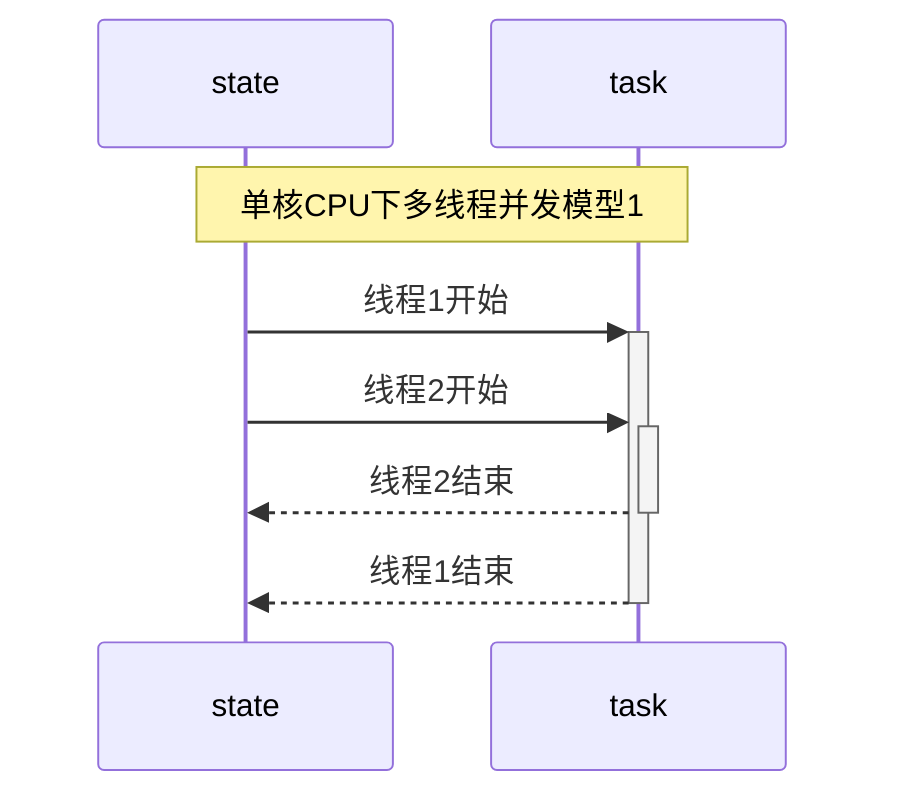
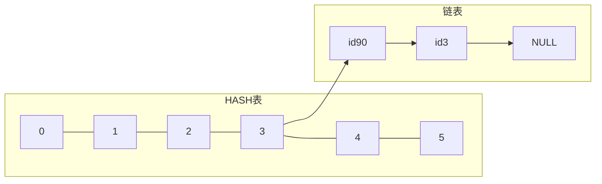
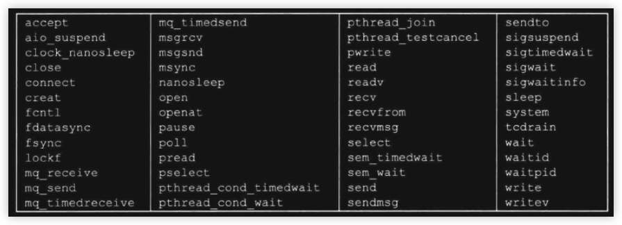
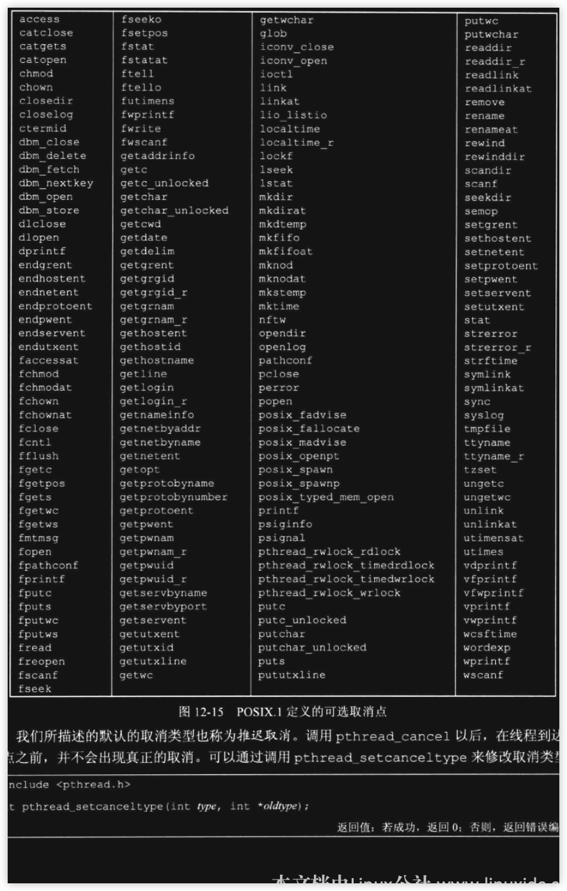
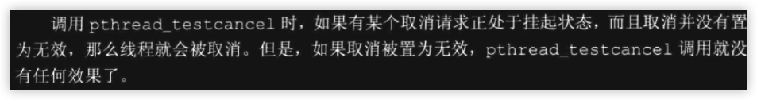
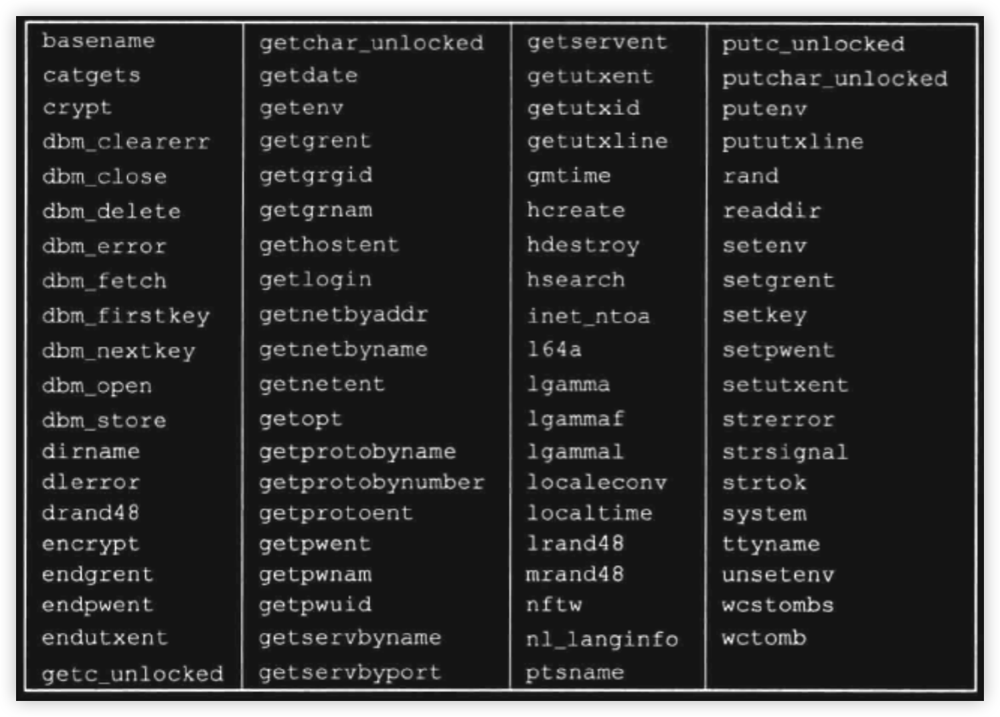
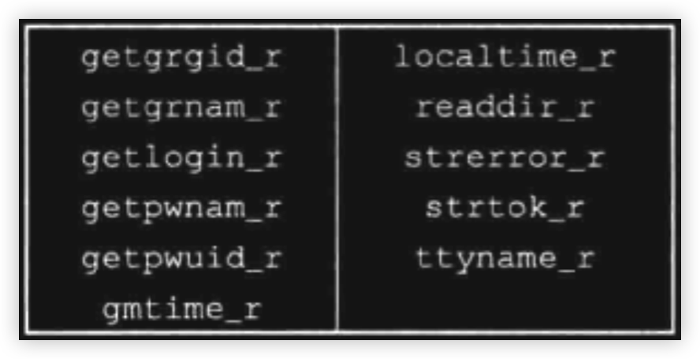

### 引言
- 在前面的学习中, 涉及最多的是进程. 进程的环境, 进程间的关系, 进程的控制等等. 不同进程之间的地址空间是隔离的, 可以通过操作系统提供的手段实现进程间的简单通讯, 也可以通过文件方式进行数据共享. 本章主要学习的是线程, 它是进程的实体. 现在操作系统的调度都是基于线程, 在1个进程中所有的线程地址空间是共享的, 这就带来了另1个问题, 若出现竞争时, 如何同步?

<br/>


### 写在前面(`Linux`)
- 在学习线程前, 要先对Linux的线程模型做一下解释: Linux内核中其实并不存在于真正意义上的线程, 都是进程模型, 但它提供的`clone`系统调用可以指定进程共享空间, 当指定某些进程的数据空间共享时, 就可以抽象为线程. 在后面的glibc的源码中, 有一点可以体现出来, 当调用`pthread_create`时, 内部会注册`SIGSETXID`信号, 该信号并不属于标准或时时信号, 由系统调用`setgid,setuid`内部特殊发送, 这样做的意义就是在多线程中, 若某个线程更改了用户的id, 则必须将数据同步到同一进程中的其他线程(`用户权限信息存储在TCB中, TCB是每个线程私有的`)

- 本章节源码部分会以glibc为主, 所以Mac上的实现细节是不考虑的


<br/>

### 线程的概念
- 进程出现的时间要早于线程. 典型的Unix进程可以看成只有1个控制线程: <font color=deeppink>一个进程在某一时刻只能做一件事情.</font> 也就是说进程的任务是通过分配给线程来完成的. 一个线程在某一时刻只能处理当前自己被分配的任务. 
> <font color=red>这里要强调一点, 线程和任务在时间点上是多对1[^ann-mul-cpu]的, 即多个线程可能同一时刻正在处理同1个任务, 但反过来就不行</font>. 对于单核CPU来说, 从逻辑上来说也是这样, 这种情况下, 在极短的时间内多条线程被调度去执行相同的任务



<br/>

> 如上图: 
>   1. 整个图表示1个进程下1个任务的多条线程执行
>   2. 时间的递增是以垂直方向从上往下

<br/>

> 该图呈现了最简单的多线程模型: <font color=red>图中的圆柱表示的是资源共享部分</font>. 当前对应的是 <font color=red>任务并发</font>[^ann-mul-thread1] 情景下对共享资源的访问, 这个时候若没有同步机制, 会出现资源竞争, 在逻辑上就是不正确的. 线程2的结束也可能在线程1结束之后, 这里只是简单的说明其中的1种场景

<br/>

> 若上述 <font color=red>场景变为多核CPU, 则圆柱表示的是时间点, 也表示共享资源</font>. 即在同一时刻, 不同的线程在访问同1资源, 这种情况也是竞争的一种(<font color=green>这种情况下请忽略图中线程1,2结束的部分</font>)


<br/>


### 线程特点
- 被调度的最小单位[^ann-thread-0]
- 共享进程所有资源
    - 文件描述符
    - 全局变量
    - 地址空间
- 调度开销远小于进程
- 适当的多线程技术可以大大提升CPU的执行效率
- 同步编程相对简单

> 线程的缺点: 还是存在资源抢占, 过多的线程会系统效应事倍功半

<br/>


### 线程标识
- 每1个进程都有一个ID作为标识. 和进程ID不同的是, 线程id只有在当前进程中才是唯一的. 一个进程中会存在一上表`thread-table`来管理自己所有的线程

- 标准规定的线程ID的类型是`pid_t`, 至于它内部的实现在不同的平台可能不一样, 以书籍上所说: <font color=deeppink>Linux上是一个无符号长整, Mac上是指针</font>

```cpp
#include<iostream>
#include<type_traits>

using namespace std;

int main(int args, char** argv){
    cout << "thread[" << pthread_self() << "]\n";
    cout << "size-thread:" << sizeof(pthread_t) << endl;
    cout << is_pointer<pthread_t>::value << endl;
    return 0;
}
```

<br/>

> 同样的代码运行在Mac和Linux下:

```shell
### linux中
./main
thread[281473767286192]
size-thread:8
0                               # 不是指针


### mac中:
thread[0x200281280]
size-thread:8
1                               # 是指针


### Linux中
find /usr/include -type f -name "*pthread*" | xargs -I abc grep "pthread_t;" abc
typedef unsigned long int pthread_t;


### Mac中
## 这里忽略, Mac中定义的是一个结构指针, 该结构很复杂
```

<br/>

- 因为各家实现的数据结构是不一样的, 标准规定了获取当前线程ID的接口.

```cpp
#include<pthread.h>

pthread_t pthread_self(void);

// 一定返回线程的ID
```

<br/>

- 一般情况下`pthread_self`与`pthread_equal`一起使用, 固名思意就是判断线程是不是相等

```cpp
#include<pthread.h>
int pthread_equal(pthread_t tid1, pthread_t tid2);

// 相等返回非0, 其他返回0
```

<br/>

### 创建线程

```cpp
#include<pthread.h>

int pthread_create(pthread_t* tidptr, pthread_attr_t* attr, void* (*run)(void*), void* arg);

// 成功返回0, 否则出错返回错误编号
```
> 线程是系统资源的一部分, 每个用户运行的进程可能因为限制会造成创建失败(<font color=green>当然也有其他失败的原因</font>)
>
> <br/>
>
> 需要说明的是 <font color=red>c++标准库提供的线程接口底层也是调用POSIX线程库, 在windows中则是调用Window提供的线程接口</font>, 同时该函数是库函数, 并不是系统调用. 对于返回值并不设置errno, 而是直接返回的错误码

```cpp
#include<iostream>
#include<sys/time.h>
#include<type_traits>

using namespace std;

int main(int args, char** argv){

    cout << "platform:[" << argv[1] << "]\n";
    pthread_t tid;
    if(pthread_create(&tid, nullptr, [](void* arg) -> void*{
            cout << "arg\t" << (char*)arg;
            cout << "tid[" << pthread_self() << "]\n";
            timespec st

#if defined(__clang__) && defined(__APPLE__)
            = {
                .tv_nsec = 0,
                .tv_sec = 5,
            };
            nanosleep(&st, nullptr);
#elif defined(__GNUC__) && defined(__linux__)
            = {0};
            st.tv_sec = 5;
            st.tv_nsec = 0;
            clock_nanosleep(CLOCK_REALTIME, 0, &st, nullptr);
#endif
            return nullptr;
        },const_cast<char*>("hello world\n"))){

        // 这里可以获取pthread_create的返回值当作errno
        cerr << "pthread create error\n";
        return -1;
    }

    pthread_join(tid, nullptr);

    cout << "tid dead\n";

    return 0;
}

```

<br/>

> 上述程序的流程是:
>   1. 创建线程
>   2. 阻塞等待线程
> 在子线程中主要打印对应的线程ID, 并阻塞5秒. 等待5秒后, main所在的线程才会继续执行

<br/>

```shell
### linux
./main $(uname -a | cut -d " " -f 1)
platform:[Linux]
arg	hello world
tid[281473209258432]
tid dead


### mac
./main $(uname -a | cut -d " " -f 1)
platform:[Darwin]
arg	hello world
tid[0x304fb3000]
tid dead
```

<br/>

> 关于创建线程的第2个参数`pthread_attr_t`会在后面具体的章节中详细学习. 线程创建后并不能保证新的线程先运行, 这取决于此刻内核的调度状态. 


<br/>

### 线程ID,进程ID的对比
- 线程隶属进程, 所以不同线程所对应的进程ID在实现上应该是一样的

```cpp
#include<unistd.h>
#include<sys/time.h>
#include<iostream>

using namespace std;


int main(int args, char** argv){
    cout << "main-pid[" << getpid() << "]\n";
    cout << "main-tid[" << pthread_self() << "]\n";
    cout << "main-addr[" << reinterpret_cast<void*>(main) << "]\n";


    pthread_t tid;
    auto res = pthread_create(&tid, nullptr, [](void* arg) -> void*{
        auto c = malloc(1);
        cout << "malloc-addr:[" << c << "]\n";
        cout << "child-pid[" << getpid() << "]\n" << "child-tid[" << pthread_self() << "]\n";
        return nullptr;
    }, nullptr);
    if(res){
        cerr << "pthread create: " << strerror(res) << endl;
        return -1;
    }
    
    cout << "result-tid[" << tid << "]\n";

    pthread_join(tid, nullptr);

    return 0;
}
```

<br/>

> 测试结果如下:

<br/>

```shell
./main
main-pid[30616]                         # main 所在的进程
main-tid[0x202aa9280]                   # main 所在的线程
main-addr[0x1029aa040]                  # main 函数的地址
result-tid[0x309529000]                 # 创建函数所填充的线程ID
malloc-addr:[0x600002c1c000]            # 进程中堆地址
child-pid[30616]                        # child线程所在的进程, 和main一样
child-tid[0x309529000]                  # child获取自己的线程ID
```

> 从测试可以发现, 子线程(<font color=green>child</font>)和主线程(<font color=green>main</font>)在同一个进程下. <font color=red>新创建的线程所指向的结构(`Mac`)并不在所谓的堆区, 也并未和主线程在同一区域[^ann-thread-mem]</font>.


<br/>

### 线程的终止
- 进程被终止有2类情况: <font color=deeppink>正常返回和异常终止</font>.
    1. 正常返回: 从启动流程到最后返回(`单线程中return, exit等`)
    2. 异常终止: 执行过程被异常结束(`如信号`)
    3. 关于多线程的终止, 接下的小节会详细说明
- 对应的线程的结束也分这2类情况:
    1. 正常返回: 从启动流程到最后返回(`return, pthread_exit`)
    2. 异常终止: 被其他线程直接取消(`pthread_cancel`)或被信号终止
> 需要说明的是: <font color=red>线程中若调用`exit`相关的函数后, 会直接结束整个进程. 线程结束可能并不意味着整个进程结束, 因为进程中此刻还有其他的线程在运行. 但一般情况下main函数所在的线程返回时, 即使有子进程整个进程也会结束</font>


```cpp
#include<pthread.h>
void pthread_exit(void* info_ptr);
```

<br/>

> 该函数的作用:
>   1. 手动结束当前线程
>   2. 将`info_ptr`传递给`pthread_join的第2个参数`
> 若线程是被其他线程所取消, 则`info_ptr_addr`本身会指向`PTHREAD_CANCELED`

<br/>

> <font color=red size=5> 测试1--正常返回线程终止状态</font>

```cpp
#include<unistd.h>
#include<sys/time.h>
#include<iostream>
#include<cstdlib>
using namespace std;

int main(int args, char** argv){

    static char** tmp_argv;
    tmp_argv = argv;
    if(args < 2){
        cerr << "usage ./main <1:return 2:pthread_exit> value\n";
        return -1;
    }

    cout << "main seq[" << argv[1] << "]\n";

    pthread_t tid;
    auto res = pthread_create(&tid, nullptr, [](void* arg) -> void*{
        sleep(1);
        
        cout << "child seq[" << tmp_argv[1] << "]\n";

        if(atoi(tmp_argv[1]) == 1)
            return tmp_argv[2];

        pthread_exit(tmp_argv[2]);
    }, nullptr);

    
    if(res){
        cerr << "pthread create: " << strerror(res) << endl;
        return -1;
    }
    
    void* thread_over_parm;
    pthread_join(tid, static_cast<void**>(&thread_over_parm));
    cout << (char*)thread_over_parm << endl;

    return 0;
}
```

<br/>

> 测试如下:

```shell
for i in {1..2}; do {./main $i "$(date)--seq:$i"} done;
main seq[1]
child seq[1]
2023年 8月 9日 星期三 18时09分48秒 CST--seq:1
main seq[2]
child seq[2]
2023年 8月 9日 星期三 18时09分49秒 CST--seq:2
```

<br/>


> <font color=red size=5> 测试2--终止进程的信号会直接终止整个进程</font>

<br/>

```cpp
#include<unistd.h>
#include<signal.h>
#include<pthread.h>
#include<iostream>


using namespace std;
int main(int args, char** argv){
    pthread_t tid;
    pthread_create(&tid, nullptr, [](void* arg) -> void*{

        int* p = nullptr;
        *p = 20;                // __code_0
        cout << "over\n";       // __code_print_0
        return nullptr;
        
    }, nullptr);

    // ignore error

       

    pthread_join(tid, nullptr);

    cout << "join over\n";      // __code_print_1
    return 0;
}
```

<br/>

> 上述程序: <font color=red>在子线程中会出现bad access(`__code_0`), 从而出现SIGSEGV信号, 导致整个进程被终止, 不管在主线程还是在子线程中, 都不会有打印出现</font>

<br/>


> <font color=red size=5> 测试3--子线程被其他线程取消</font>

```cpp
#include<unistd.h>
#include<signal.h>
#include<pthread.h>
#include<iostream>


using namespace std;
int main(int args, char** argv){
    pthread_t tid;
    pthread_create(&tid, nullptr, [](void* arg) -> void*{
        while(1){
            cout << "ing ";       
            sleep(1);
        }
        return nullptr;
        
    }, nullptr);

    // ignore error

    sleep(2);
    pthread_cancel(tid);

    cout << "join over";
    return 0;
}
```

<br/>

> 在主线程中调用`pthread_cancel`结束子线程, 可以发现, 子线程被结束后, 并未刷新流, 最后在主线程正常返回后,标准输出的缓冲区才被冲洗(`3次打印`) 

<br/>


### `pthread_join`
```cpp
#include<pthread.h>
int pthread_join(pthread_t tid, void** info_ptr_addr);
// 成功返回0, 否则返回错误编号
```
> 该函数类似`wait`:
>   1. 若要等待的线程未结束(<font color=green>运行或睡眠等状态</font>), 则被阻塞
>   2. 若要等待的线程已经结束, 则不阻塞并直接获取到线程的返回值.
> 当调用了`pthread_join`并返回后, 线程的TCB[^ann-tcb-0]才会被回收

<br/>

```cpp
#include<unistd.h>
#include<pthread.h>
#include<sys/wait.h>
#include<iostream>

using namespace std;

int main(int args, char** argv){
    pthread_t tid;

    pthread_create(&tid, nullptr, [](void* arg)->void*{
        return const_cast<char*>("hello world");
    },nullptr);


    // ignore error 
    sleep(1);

    void* s;
    auto res = pthread_join(tid,&s);    // __code_join_1
    res ? cout << strerror(res) : (cout << res << endl, cout << reinterpret_cast<char*>(s) << endl);

    res = pthread_join(tid,&s);         // __code_join_2
    res ? cout << strerror(res) : (cout << res << endl, cout << reinterpret_cast<char*>(s) << endl);

    return 0;
}
```

<br/>

> main线程睡眠1秒后, 子线程已经结束, 此时子线程应该要被处理
> `__code_join_1`: 第1次属于正常的join, 返回为0, 并输出子线程返回的"hello world"
> `__code_join_2`: 第2次再次调用时子线程已经被清理, 此时返回错误

<br/>

```shell
./main
0
hello world         # __code_1, 打印返回码, 并打印子线程的返回值
No such process     # __code_2, 错误, 说明子线程的TCB已经被清理

# 这里出错的原因描述中是process, 并不是指进程, 而是指过程(即线程,程序)
```


### 再探进程的终止
- 前面所有的案例都是单线程环境下(`main`), 当main函数中:
    1. 主动调用`return xx`或`exit(xx)`, 整个进程会结束, 此时进程有明确的 <font color=deeppink>返回码</font>, 内核会将返回码进一步包装成 <font color=deeppink>终止码</font>
    2. 进程被异常杀死(`如信号`), 内核会将信号包装成终止码

- 若是多线程环境下, 则进程被终止的情况就很复杂了, 下面直接总结:
    1. 任何线程中调用`exit(xx)`, 整个进程都会结束. 进程有明确的返回码以及对应的终止码
    2. main函数的代码执行了`return xx`后, 不管此时有没有其他线程正在执行, 整个进程直接结束, 进程有明确的返回码以及对应的终止码
    3. 最后一个线程从启动流程返回(`return xx`).
        - 若该线程是main函数, 则进程结束的返回码为`xx`, 对应的就有终止码
        - 若该线程不是main函数, 则表示main线程已经死了, 由于子线程要返回一个指针, 标准规定, 这种情况是正常结束进程的一种, 返回码是0.
    4. 最后一个线程调用`pthread_exit`.
        - 不管该线程是不是main函数, 标准规定进程正常结束, 返回码是`0`
    5. 最后一个线程对`pthread_cancel`作出响应; 

> 上述调用`exit相关的函数, 包括 exit, _exit, _Exit`. 也就是说一个进程中可以没有主线程(`main调用pthread_exit或被其他线程pthread_cancel`), 但main一旦执行了`return xx`后, 则进程强制结束 
> 下面测试`第3, 第4, 第5`点
> <font color=red size=5>测试1--由子线程return</font>

<br/>

```cpp
#include<unistd.h>
#include<pthread.h>
#include<iostream>
using namespace std;

static pthread_t main_tid;

static void* child_fun(void* arg){
	cout << "child[" << pthread_self() << "]\n";
	sleep(5);                                               // __code_2
	cout << "will cancel main\n";
	pthread_cancel(main_tid);                               // __code_3
	cout << "main cancel\n";
	int a;
	while(1){
		cout << "请输入数字: ";
		cin >> a;
		if(a){
			cout << "您输入的是: " << a << endl;
			continue;
		}

		break;
	}
	return (void*)"hello world";
}


using namespace std;
int main(int args, char** argv){
	main_tid = pthread_self();
	cout << "main[" << main_tid << "]\n";

	pthread_t child;
	pthread_create(&child, nullptr, child_fun, nullptr);    // __code_0
	while(pause());                                         // __code_1

	cout << "over\n";
	return 0;
}
```

<br/>

> 上述程序的测试流程:
>   1. 创建子线程(`__code_0`)
>   2. 主线程立即阻塞(`__code_1`)
>   3. 子线程中睡眠5秒(`__code_2`), 并不一定比第2步后运行, 取决运行当前的调度情况 
>   4. 睡眠后直接结束main线程
> 这意味着main函数无法运行到`return 0`语句, main被提前结束, 只剩下子线程, 进程要想结束必须由子线程来决定. <font color=red>测试点要在`__code_2`前以及`__code_3`后查看当前进程中线程的状态</font>, 本程序在Linux中运行, 测试结果如下:

<br/>

```shell
liubo-linux% ./main
main[281473796030176]
child[281473791234496]                      # 此时在另一会话终端中查看状态
will cancel main
main cancel
请输入数字:                                 # 此时继续查看所有线程状态


## 另一终端

### 睡眠前查看所有线程
liubo-linux% ps -T -p $(ps -o pid,comm -u liubo | grep main | cut -d " " -f 3)
    PID    SPID TTY          TIME CMD
  34480   34480 pts/0    00:00:00 main      # 主线程
  34480   34481 pts/0    00:00:00 main      # 子线程


### 结束main线程后, 再次查看
liubo-linux% ps -T -p $(ps -o pid,comm -u liubo | grep main | cut -d " " -f 3)
    PID    SPID TTY          TIME CMD
  34480   34480 pts/0    00:00:00 main <defunct>    # main线程已经挂掉
  34480   34481 pts/0    00:00:00 main
liubo-linux%


### shell的命令是 获取当前 liubo用户下的main进程, 切割找出进程的id, 通过 ps -T -p pid查看该进程下的进程
```

<br/>

> 下面是gif图展示的测试过程, 重新运行的, 对应的id和上述测试是不一样的. 可以在测试5秒后输入0, 打印`echo $?`为0, 表示进程是正常结束的

---


<br/>


> <font color=red size=5>测试2--由子线程`pthread_exit`</font>方案和1差不多. 这里直接测试`pthread_cancel`的返回码及终止码

<br/>


```cpp
#include <sys/wait.h>
#include<unistd.h>
#include<signal.h>
#include<pthread.h>
#include<iostream>
#include<vector>
#include<string>

int main(int args, char** argv){
    
    if(args != (2 + SIGUSR2)){                      // __code_0
        std::cerr << "usage ./main <signal>[\"信号杀死\"] or <\"thread cancel\">[\"线程被取消\"] signal-list\n";
        return 0;
    }


    auto child = fork();
    // ignore error


    // main
    if(child){
        // 因为标准信号是从1开始, 但数组是从1开始, 所以这里预先占位第0个
        static std::vector<std::string> signals = {"zero"};
        
        argv += 2;
        while(*argv){
            signals.push_back(*argv);               // __code_1
            ++argv;
        }

        struct sigaction st;
        st.sa_flags = SA_SIGINFO;
        sigemptyset(&st.sa_mask);
    
        // 注册 CHLD信号
        st.sa_sigaction = [](int signo, siginfo_t* info, void* other){

            std::cout << "signal handle:\n";

            psignal(signo, "receive signal sys-descrip");   // __code_2
            std::cout << "receive signal name: " << signals[signo] << std::endl;    // __code_3
            
            int sta;
            waitpid(info->si_pid, &sta, 0);                 // __code_4

            if(WIFEXITED(sta)){
                std::cerr << "\tnormal exit code:[" << WEXITSTATUS(sta) << "]\n";   // __code_5
                return;
            }

            if(WIFSIGNALED(sta)){
                auto reason = WTERMSIG(sta);                // __code_6
                std::cerr << "\texcept exit reason-signal[" << reason << "]\n";     // __code_7
                psignal(reason, "\treason-signal sys-descrip");                     // __code_8
                std::cerr << "\treason-signal name: " << signals[reason] << "\n";   // __code_9
                return;
            }

        };
        sigaction(SIGCHLD,&st, nullptr);
        
        pause();
        std::cout << "\nprocess over\n";

        return 0;
    }

    // child
    sleep(1);


    // __code_inline_lib
    bool over_with_signal = __builtin_strncmp("signal", argv[1], std::min(__builtin_strlen("signal"), __builtin_strlen(argv[1]))) == 0;
    bool over_with_thread_cancel = __builtin_strncmp("thread cancel", argv[1], std::min(__builtin_strlen("signal"), __builtin_strlen(argv[1]))) == 0;

    // child kill self
    if(over_with_thread_cancel){
        std::cout << "will cancel thread\n";
        pthread_cancel(pthread_self());     
    }else if(over_with_signal){
        std::cout << "will send SIGTERM\n";
        kill(getpid(), SIGTERM);
    }

    return 0;
}
```

<br/>

> 上述程序的目的: <font color=red>测试信号异常结束程序 以及 `pthread_cancel`所结束的进程是不是正常结束</font>. 测试步骤:
>   1. 用户调用格式`./main signal <31个信号名的字符串> 或 ./main "thread cancel" <31个信号名的字符串>`
>   2. main函数直接`fork`
>   3. 产生的子进程(`child`), 根据命令行第1个参数来决定怎么结束自己这个进程
>   4. main进程中捕捉`SIGCHLD`信号, 并判断子进程(`child`)是不是正常结束的
> main进程的流程:
>   1. `__code_1`: 为了测试方便, 将命令行传递来的所有信号存储到数组中
>   2. `__code_2,__code_3`: 捕捉到信号后, 先打印一下信号相关的信息
>   3. `__code_4`: 处理子进程的终止状态(`避免产生僵死进程`), 这一步不会阻塞, 因为当前有子进程被等待处理
>   4. `__code_5`: 若正常结束, 则打印子进程的退出码(`注意是退出码, 类似于exit(xx)的参数xx`)
>   5. `__code_6`: 若异常结束, 则打印子进程结束的原因, 以及被什么信号所结束的(`__code_7, __code_8, __code_9`)
> 
> <br/>
>
> 需要说明的是`__code_line_lib`: <font color=red>这些`__builtin_xx`是编译器内部的内联库函数, 不用导入库函数, 功能和对应的库函数一样, 当前是在clang环境下, Mac系统中</font>, 下面是shell测试的过程, <font color=red>内部用到了zsh的脚本语法</font>

```shell
arr=("signal", "thread cancel")         # 定义数组


# 取出arr的内容, 并同步调用 main程序, 传递相关的参数
## kill -l | xargs 是将 所有的31个标准Unix信号封装成命令行参数
for i in $arr; do {echo $i; ./main $i $(kill -l | xargs); echo "\n"} done;
signal                                          # signal方式结束子进程(异常结束)
will send SIGTERM
signal handle:
receive signal sys-descrip: Child exited
receive signal name: CHLD
	except exit reason-signal[15]               # 可以发现子进程是被15号信号(TERM), 所结束
	reason-signal sys-descrip: Terminated
	reason-signal name: TERM                    # sigaction中的siginfo_t* info中的 si_signo并不是异常的原因, 而是SIGCHLD信号, 这里不说了

process over


thread cancel                                   # 以 pthread_cancel结束当前进程中的唯一线程, 即会造成整个进程的结束
will cancel thread                  
signal handle:
receive signal sys-descrip: Child exited        
receive signal name: CHLD
	normal exit code:[0]                        # 发现是正常结束

process over
```


### `pthread_cancel`
- 该函数是结束当前线程, 但并不是立即结束: <font color=deeppink>因为这样当前线程可能正在操作全局的结构, 所以若是立即结束则可能造成</font>:
    - 全局的数据结结构可能被破坏(`如malloc等`), 类似于可重入
    - 可能造成死锁(`如当前线程已经在同步区加锁, 还未来得及解开锁就被结束了`)

<br/>

> <font color=red size=5>测试1--延迟结束</font>

```cpp
#include<unistd.h>
#include<pthread.h>
#include<sys/wait.h>
#include<iostream>

using namespace std;

int main(int args, char** argv){
    if(args != 2){
        cerr << "usage ./main <cancel type>[0:nothing 1:yield 2:sleep(5)]\n";
        return -1;
    }
    pthread_cancel(pthread_self());

    switch(atoi(argv[1])){
        case 1:
            cout << "yield\n";
            pthread_yield_np();
            break;
        case 2: 
            cout << "sleep\n";
            sleep(5);
            break;
        default:
            cout << "nothing\n";
            break;
    }
    cout << "cancel \n";
    return 0;
}
```

<br/>

> 上述程序分别测试3种情况下调用`pthread_cancel`后会不会打印内容
```shell
### 调用后, 不做任何特殊处理
./main 0
nothing
cancel


### 调用后, 直接放弃当前的cpu
./main 1
yield
cancel


### 调用后, 直接睡眠5秒
./main 2
sleep               # 无法睡眠到5秒
```

<br/>

> 基本可以得出以下结论:
>   1. 该函数结束线程的时间点, 并不是在线程的下一次调度: <font color=red>因为当指定yield时, 再被调度时, 仍然会执行打印</font>
>   2. 睡眠时会查看是不是已经标记取消了: <font color=red>因为sleep不能睡眠到5秒</font>
> 这里yield是立即放弃当前CPU, 本身不会被信号中断, 也就是说调用该函数的过程中就会放弃, 并不是延迟放弃CPU

<br/>


> <font color=red size=5>测试2---死锁</font>

<br/>


```cpp
#include<unistd.h>
#include<pthread.h>
#include<sys/wait.h>
#include<iostream>

using namespace std;

static const char* tmp_file = "./a.txt";
static pthread_mutex_t m_lock;

int main(int args, char** argv){

    pthread_mutex_init(&m_lock, nullptr);

    pthread_t tid;
    pthread_create(&tid, nullptr, [](void* arg)->void*{
        cout << "child\n";
        pthread_mutex_lock(&m_lock);        // __code_child_lock
        pthread_cancel(pthread_self());     // __code_0
        sleep(5);                           // __code_1
        cout << "sleep over\n";             // __code_2
        pthread_mutex_unlock(&m_lock);      // __code_child_unlock

        return nullptr;
    },nullptr);


    int a;
    cin >> a;                           // __code_block
    cout << "a: " << a << endl;         // __code_input


    auto file = fopen(tmp_file, "r+");
    pthread_mutex_lock(&m_lock);        // __code_main_lock
    fwrite("hello", 5, 1, file);        // __code_3
    pthread_mutex_unlock(&m_lock);      // __code_main_unlock
    return 0;
}
```

<br/>

> 上述程序的流程是: 主线程会阻塞, 原因是需要子线程要确保先运行到`__code_0`结束自己.
>   1. `__code_block`导致主线程被阻塞
>   2. `__code_child_lock`: 主线程阻塞期间, 子线程先上锁
>   3. `__code_0`: 子进程调用`pthread_cancel`申请结束自己
>   4. `__code_1`: 因为调用cancel后并不是立即执行, 所以直接睡眠导致当前子线程结束
>   5. 子线程无法执行到`__code_2`, 所以子线程挂掉以后, 锁是不会释放的
>   6. 向终端输入内容结束阻塞`__code_input`
>   7. 主线程尝试拿到锁(`__code_3`), 但此时锁并未由子线程释放, 所以主线程会一直卡在这里形成死锁


<br/>

> 同样的原理, 当一个线程被cancel后, 由于延迟的机制, 若正在调用不可重入函数(`如大部分的库函数`), 都可能造成全局的数据结构被破坏.> 具体cancel后, 线程结束的代码点后面在详细学习

<br/>


### `PTHREAD_CANCELED`
- 该标识是一个 <font color=deeppink>macro</font>(`宏`), 当线程被`pthread_cancel`后, 若后续清理该线程(`pthread_join`), 则被回填的参数就是`PTHREAD_CANCELED`

```cpp
#include<unistd.h>
#include<pthread.h>
#include<sys/wait.h>
#include<iostream>

using namespace std;


int main(int args, char** argv){
    pthread_t tid;

    cout << "PTHERAD_CANCELED: " << PTHREAD_CANCELED << endl;

    pthread_create(&tid, nullptr, [](void* arg)->void*{
        pthread_cancel(pthread_self());
        sleep(1);
        cout << "never\n";
        return nullptr;
    },nullptr);

    // ignore error 
    sleep(2);

    cout << "wake up\n";
    
    void* value;
    pthread_join(tid, &value);

    cout << "value [ " << (reinterpret_cast<decltype(PTHREAD_CANCELED)>(value) == PTHREAD_CANCELED ? "==" : "!=") << " ] PTHREAD_CANCELED\n";
   
    return 0;
}
```

<br/>

> 上述程序是子线程使用cancel结束自己, 然后在main线程中清理(`pthread_join`), 发现获取到的value值是`PTHREAD_CANCEL`

<br/>

```shell
./main
PTHERAD_CANCELED: 0x1
wake up
value [ == ] PTHREAD_CANCELED
```

<br/>

### 线程退出清理
- 如同进程中的`atexit`一样, 线程也有相同的处理机制. 相关的函数如下:

```cpp
void pthread_cleanup_push(void(*fun)(void*), void* arg);

void pthread_cleanup_pop(int exec);
```
> 需要说明的是这2个函数是配套的, 并不像atexit只有一个单独的函数. 它们只是POSIX规定的接口, 实际上不同的系统实现不一样. 在Mac和Linux(<font color = green>这里平台是Ubuntu,其他发版本未看</font>)上都是使用宏实现的, 只不过Mac的宏实现并未像Linux上实现的那样炫酷,接下来会对比两家代码作赏析
> pop时所传递的参数为`0或1`, 只有指定1时, 注册的函数才会被调用

<br/>

> <font color=red size=5>测试1--简单使用</font>

```cpp
#include<unistd.h>
#include<pthread.h>
#include<iostream>

using namespace std;


int main(int args, char** argv){
    auto cbk = [](void* arg) -> void{
        cout << reinterpret_cast<char*>(arg) << endl;
    };
    pthread_cleanup_push(cbk, const_cast<char*>("func1"));
    pthread_cleanup_push(cbk, const_cast<char*>("func2"));
    pthread_cleanup_push(cbk, const_cast<char*>("func3"));

    cout << "working\n";

    pthread_cleanup_pop(1);
    pthread_cleanup_pop(0);
    pthread_cleanup_pop(1);


    return 0;
}
```

<br/>

> 上述程序在main线程开始时, 注册了3次函数, 每次传递的参数不一样
> 最后在结束前以栈的方式将函数取出来, 但`func2`的这1次却并不调用

<br/>

```shell
./main
working
func3
func1


# 同样的测试, 在Linux上效果是一样的, 这里不再单独再写一遍
```

<br/> 

> <font color=red size=5>该配套函数在2家平台实现的代码赏析</font>. 为了测试方便, 这里只作一层注册

<br/>

```cpp
#include<unistd.h>
#include<pthread.h>
#include<iostream>

using namespace std;

int main(int args, char** argv){
    auto cbk = [](void* arg) -> void{
        cout << reinterpret_cast<char*>(arg) << endl;
    };
    pthread_cleanup_push(cbk, const_cast<char*>("call back"));

    cout << "working\n";

    pthread_cleanup_pop(1);

    return 0;
}
```

<br/>

- 以上面的代码为例, 首先在Mac上:
> 因为这2个像函数的接口实际上是由宏实现, 所以直接利用编译器预编译一下, 然后查看对应的CPP代码(`当前用c++编写, 编译器为clang++`)

<br/>

```shell
# 调用 -E 选项, 指定源代码文件先将预编译指令展开(如 include, define)等
## 输出 main.e文件中代码还是cpp代码, 只不过所有的宏被展开
clang++ -E main.cpp -o main.e
```

<br/>

> 查看 main.e, 这里因为main.cpp编译完文件比较庞大, 所以直接将 main函数部分展示在文档中

```cpp
int main(int args, char** argv){
    auto cbk = [](void* arg) -> void{
        cout << reinterpret_cast<char*>(arg) << endl;
    };

    {                                                           // __code_start
        struct __darwin_pthread_handler_rec __handler;          // __code_0     
        pthread_t __self = pthread_self();                      // __code_1
        __handler.__routine = cbk;                              // __code_2
        __handler.__arg = const_cast<char*>("call back");       // __code_3
        __handler.__next = __self->__cleanup_stack;             // __code_4
        __self->__cleanup_stack = &__handler;;                  // __code_5

        cout << "working\n";                                    // __code_6

        __self->__cleanup_stack = __handler.__next;             // __code_7
        if (1)(__handler.__routine)(__handler.__arg);           // __code_8
    };                                                          // __code_end

    return 0;
}

/**
    Mac上实现简单易懂
        0. 首先:
            __code_start 到 __code_5    为  pthread_cleanup_push 整个宏定义
            __code_7     到 __code_end  为  pthread_cleanup_end  整个宏定义
        

        1. __code_0 定义局部变量 __handler
        2. __code_2 记录用户注册的函数cbk
        3. __code_3 记录用户cbk所需要的参数
        4. __code_4 形成链表, 指向下一个 __handler类型
            这里说明一点, 每1个线程都有TCB描述, 这个TCB对于
            线程来说是全局的, 通过 pthread_self可以找到线程的TCB
            再通过TCB中的__cleanup_stack存储用户指定的函数cbk
            该结构是链表实现的栈
        5. __code_5 将TCB中__cleanup_stack的栈顶指向最新的 __handler

        6. __code_6 线程工作的代码

        7. __coed_7 线程要结束前, 将栈顶指针指向下一个函数
        8. __code_8 根据用户调用 pthread_cleanup_pop(xx)中的xx来决定要不要调用该栈顶函数(__handler)
        9. __code_9 pthread_cleanup_pop的宏定义结束 


    总结:
        Mac上使用宏来实现POSIX规定的接口, 该函数必须成对出现, 否则编译不通过, 因为:
            pthread_cleanup_push 最开始有  {
            而右                           }
            被定义在pthread_cleanup_pop中, 所以会在编译期就强制用户必须写完整
        
        这样的目的是在同一区域中使用统一的代码实现栈操作, 若没有 {}, 则上述局部变量
        会因为名字不能重名的问题变得难以实现

        若是嵌套使用, 原理是一样的, 会通过 {}, 将作用域分开, 每个作用域结束后就会
        决定要不要调用用户的函数
*/
```

<br/>

> 在这里Mac将用户注册的函数以及参数信息都记录在了一个链表中. 从实现功能上来看似乎不需要这样做: <font color=red>因为`pthread_cleanup_push`配合`pthread_cleanup_pop`已经保证`_handler`被执行</font>. 举个例子若没有链入相关的代码, 则上述代码大致长这样

<br/>

```cpp

// ... 前面的代码

{                                                           // __code_start
    struct __darwin_pthread_handler_rec __handler;          // __code_0     
    __handler.__routine = cbk;                              // __code_2
    __handler.__arg = const_cast<char*>("call back");       // __code_3

    cout << "working\n";                                    // __code_6

    if (1)(__handler.__routine)(__handler.__arg);           // __code_8
};                                                          // __code_end

// ... 后面的代码
```

<br/>

> 很明显这种情况下, 功能也能实现, 若出现多层嵌套也是能保证在调用上是以栈方式逐个调用的, 但为什么Mac要多出一步(`链入函数`), 猜想:
>   - 可能POSIX有另外的规定, 导致不得不将函数记录下来
> 现在假设链入的这一步是必须的

<br/>

- 其次在Linux中, 同样的测试流程, 先以`g++ -E main.cpp -o main.e`编译

<br/>

```cpp
int main(int args, char** argv){
    auto cbk = [](void* arg) -> void{
        cout << reinterpret_cast<char*>(arg) << endl;
    };

    do{                                                                         // __code_0
        __pthread_cleanup_class __clframe(cbk,const_cast<char*>("call back"));  // __code_1
        cout << "working\n";                                                    // __code_2
        __clframe.__setdoit(1);                                                 // __code_3
    } while (0);                                                                // __code_4
    return 0;
}

/**
    上述代码是linux内核中最喜欢用的 do{...}while(0)
    至于这样写的好处这里不多说了
    
    首先:
        __coed_0 到 __code_1 为 pthread_cleanup_push 的宏定义
        __code_3 到 __code_4 为 pthread_cleanup_pop  的宏定义
    
    其次就有1个有趣的现象:
        没有出现类似Mac上TCB相关的链表连接操作(Mac中的__code_1 到 __code_5)

    现在虽然没有看到Linux中源码实现, 但通过c++语法也可推断出:
        1. __pthread_cleanup_class是C++中的类
        2. cbk函数和参数"call back"被直接构造成了 局部变量 __clframe中
            所以在构造函数中会作类似Mac中的链表连接操作
        3. 利用c++的析构, 出了作用域(__code_4)后, 编译器会调用 __clframe析构
            在该析构函数中肯定会 cbk("call back")


        ps: pthread.h并非系统调用, 但它是POSIX标准接口
            在Linux环境下该接口是由glibc实现, 但glibc内部
            也是通过相关的系统调用来完成POSIX的功能
            glibc下的pthread.h并不长这样,
            在C++环境下会重新定义pthread.h
    
    现在先来找到 C++下, __pthread_cleanup_class的定义, 代码如下:    
*/

class __pthread_cleanup_class{
  void (*__cancel_routine) (void *);
  void *__cancel_arg;
  int __do_it;
  int __cancel_type;

 public:

    // __code_ctor
  __pthread_cleanup_class (void (*__fct) (void *), void *__arg)
    : __cancel_routine (__fct), __cancel_arg (__arg), __do_it (1) { }


    // __code_dctor
  ~__pthread_cleanup_class () { if (__do_it) __cancel_routine (__cancel_arg); }

    // __code_set_flag
  void __setdoit (int __newval) { __do_it = __newval; }

  void __defer () { pthread_setcanceltype (PTHREAD_CANCEL_DEFERRED,
                                           &__cancel_type); }
  void __restore () const { pthread_setcanceltype (__cancel_type, 0); }
};

/**
    很明显在构造函数(__code_ctor)中, 用户传递的ckb和"call back"会被记录下来

    在析构函数(__code_dctor)中, 会根据标识 __do_it来决定要不要调用 cbk

    用户设置标识 pthread_cleanup_pop(1), 对应的是 __code_3

    总结:
        和Mac不同的是, Linux下的编译器g++对pthread.h重新做了声明, 分为C++环境和C环境
        C++环境下, 利用类的构造和析构实现了相同的功能
        但未涉及到将用户的函数关联到TCB中. Mac因为不区分C环境及C++环境
        他的做法是必须的, 必须将函数链入到全局的结构中, 因为上下文环境
        必须从一个全局的结构中获取到,所以Mac选择了TCB.
        
        同样的, 若Linux是在C环境下, 他在实现时在逻辑上也必须将
        用户注册的函数链入到某个全局结构中.
        但事实上Linux并未这样做:
            1. 若是标准C, linux采用了sigsetjmp方式配合 pthread_register_cancel来实现Mac一样的效果
            2. 若是扩展C(-D__EXCEPTIONS)下, 
                他采用了编译器特性, 形成了如同C++类一样的效果, 这就是Linux精巧的地方
                同样的对比Mac, 并不是说Mac做的不好, Mac实现的是标准C, 而
                Linux用了编译器特性不属于标准C, 所以它在编译时要指定对应的gnuc选项

    下面看一下标准C环境下Linux的编译代码
*/
```

<br/>

> C语言代码
```c
#include<unistd.h>
#include<pthread.h>
#include<stdio.h>

static  void cbk(void* arg){
	puts((char*)arg);
}

int main(int args, char** argv){
    pthread_cleanup_push(cbk, (void*)"call back");
    puts("working");
    pthread_cleanup_pop(1);
    return 0;
}
```

<br/>

> 编译`main.c`

<br/>

```shell
gcc -pthread -E main.c -o main.e
```

<br/>


> 同样的道理, 截取主要部分的代码

<br/>

<a id="linux-cleanup-stdc"/>

<br/>

```c
static void cbk(void* arg){
    puts((char*)arg);
}

int main(int args, char** argv){

   do { 
       __pthread_unwind_buf_t __cancel_buf;             // __code_0

       void (*__cancel_routine) (void *) = cbk;         // __code_1

       void *__cancel_arg = (void*)"call back";         // __code_2

       int __not_first_call = __sigsetjmp(__cancel_buf.__cancel_jmp_buf, 0);    // __code_3

       if (__builtin_expect((__not_first_call), 0)) {   // __code_4
           __cancel_routine (__cancel_arg);             // __code_5
           __pthread_unwind_next (&__cancel_buf);       // __code_6
        } 

        __pthread_register_cancel (&__cancel_buf);      // __code_7

                                                        // __code_working_start
        do {
            puts("working");

            do { } while (0); 

       } while (0);                                     // __code_working_end

       __pthread_unregister_cancel(&__cancel_buf);      // __code_8

       if (1)__cancel_routine (__cancel_arg);           // __code_9
    } while (0);                                        // __code_10
    return 0;
}


/**
        linux(Ubuntu)中 也和Mac做了一样的事情!! 那所谓的技巧在哪里?
        先来看当前实现:
            0. __code_0 定义局部变量
            1. __code_1 记录cbk函数
            2. __code_2 记录参数"call back"

            3. __code_3 这一步的作用比较巧妙
                这里就不同于Mac的做法, Mac是在当前线程中借用TCB
                用链表将用户注册的函数链入进去

                而Linux采用 sigsetjmp方式将当前的栈桢记录到
                    __cancel_buf.__cancel_jmp_buf
                该局部变量内部储存的ip, 记录了当前函数调用sigsetjmp的位置点
                后续产生的siglongjmp不为0时, 会直接定位到 这个位置点 然后往后执行
                
                PS: 事实上linux也是将记录链接到了TCB中(__pthread_register_cancel)


            4. __code_4 对应__code_3
                __builtin_expect(__note_first_call, 0)利用了编译器(gcc)特性
                告诉编译器__not_first_call 为0的概率很高, 即 sigsetjmp返回为0的概率很高
                当结合if时, 表示if(__not_first_call), 即if(0)的概率很高
                这样编译器在生成汇编代码时,尽量使得代码从上往下流水执行
                这里涉及到编译器的优化, 不理解的可以不管它, 总之为了效率
                
                那为什么这里会出现if不为0的情况?
                    现在还不能说明这个原因, 随着往后学习, 会发现这样设计的原因
                    后面会有1小节专门解释

                假设linux这样做的原因是:
                    在该场景下, 根本没有地方调用siglongjmp:
                        __pthread_register_cancel内部不会出现siglongjmp, 否则会死循环
                        __pthread_unregister_cancel内部同理也不会出现siglongjmp
                    但中间用户的代码
                        __code_working_start 到 __code_working_end
                    可能出现siglongjmp调用, 但概率也是很小的
                    因为用户正常编写代码时, 不会联想到还有一个局部变量 
                        __cancel_buf.__cancel_jmp_buf
                    所以:
                        一方面保证sigsetjmp的语义, linux还是给出了if不为0的情况
                        另一方面若出现这种情况则也会出现死循环. 
                        所以这所有的一切都是必要的

            5. __code_7 如同Mac一样, pthread_register_cancel内部会做链入处理
                链入的是 __cancel_buf, 这样就可以通过它找到
                定义它所在函数中用户注册的 __cancel_routine和__cancel_arg
            
            6. 用户代码 __code_working_start, __code_working_end

            7. 删除栈桢信息, pthread_unregister_cancel内部会如同Mac一样
                将指针指向下一个用户最后注册的函数


    总结: Linux的标准C下的实现看起来稍微复杂了一点, 但本质和Mac一样, 接下来看
            Linux下的扩展C
*/
```
<br/>

> 编译`gcc -E -D__EXCEPTIONS main.c -o main.e`, 并查看相关的代码

```c
static void cbk(void* arg){
    puts((char*)arg);
}

int main(int args, char** argv){

   do { 
       // 定义结构体,记录用户的函数信息
       struct __pthread_cleanup_frame __clframe __attribute__ ((__cleanup__ (__pthread_cleanup_routine))) = { 
           .__cancel_routine = (cbk), 
           .__cancel_arg = ((void*)"call back"), 
           .__do_it = 1 
        };

        puts("working");

        __clframe.__do_it = (1); 
    } while (0);
    return 0;
}

/**
    这里用了gcc的扩展 __attribute__((__cleanup__(__pthread_cleanup_routine)))
    它用来在C环境下修饰变量, 当变量的出了所在的作用域时
    会调用 指定的__pthread_cleanup_routine(&变量地址)函数, 将变量的地址传递过去
    类似于c++下的析构函数, 所以可以肯定的是 在__pthread_cleanup_routine中
    一定有 cbk的调用, 下面是它的实现
*/
__extern_inline void
__pthread_cleanup_routine (struct __pthread_cleanup_frame *__frame){
  if (__frame->__do_it)
    __frame->__cancel_routine (__frame->__cancel_arg);
}

/**
    这种方式原理上和开始的c++一样, 不用特意记录信息, 比较简单
*/
```

<br/>


### `pthread_cancel`触发`pthread_cleanup_pop(1)`?
- 分析了Linux的实现后, 大致可以得出另一个结论:`__pthread_register_cancel `这个函数从名字上能知道, <font color=deeppink>当线程被`cancel`后, 用户注册的函数也会被调用</font>. 正因为这个原因所以Linux和Mac会多出链入的操作, 就是为了保证线程被取消时, 也能从全局的结构中找到用户注册的清理函数. 只不过Mac是用TCB记录, Linux则是通过sigsetjmp保存栈桢信息
> 下面在Mac测试, 源代码如下

```cpp
#include<unistd.h>
#include<pthread.h>
#include<stdio.h>


static void cbk(void* arg){
    puts("call");
}

int main(int args, char** argv){
    pthread_cleanup_push(cbk, NULL);

    pthread_cancel(pthread_self());
    sleep(1);

    puts("never");
    pthread_cleanup_pop(1);

    return 0;
}
```

<br/>

> 上述程序是C程序(`clang -glldb -lpthread    main.c   -o main`), 运行程序后

<br/>

```shell
./main
call

## 用户注册的函数被调用了, 也就是说 pthread_cancel内部会找到结束线程的TCB, 然后逐个调用清理函数
```

<br/>

> 同样的代码在Linux上使用`gcc`编译(`标准C`),最后运行的效果是一样的, 但Linux上存在不同条件下的优化
>   1. c++环境(<font color=green>会被调用,原因见下一小节</font>)
>   2. c扩展
> 
> <br/>
>
> 所以要对这2种情况来测试, 在测试前先要思考一个问题:
>   - C++中`pthread_cancel`作为一种异常退出线程(<font color=green>但测试时返回码是0,表示正常</font>)的方式, 那对应的类的析构函数会不会正确执行, 针对这个问题, 下面的小节来专门测试这个问题

<br/>


### `pthread_cancel`会正确处理C++类的析构吗?
- 写一个简单的程序来验证这一点

```cpp
#include<unistd.h>
#include<pthread.h>
#include<iostream>

using namespace std;

static void cbk(void* arg){
	cout << "call\n" << endl;
}

struct A{
	~A(){
		cout << "dctor\n";
	}
};
int main(int args, char** argv){
    pthread_cleanup_push(cbk, nullptr);

    A a;
    pthread_cancel(pthread_self());
    sleep(1);

    cout << "never\n";
    pthread_cleanup_pop(1);

    return 0;
}
```

<br/>

> 上述程序很简单, 这里分别在Linux和Mac上测试

<br/>

```shell
### Mac
./main
call                

        ## Mac上并未调用 A的析构函数


### Linux
./main
dctor
call    
        
        ## Linux则是保证了先调用析构
```

<br/>

> 通过这个测试就可以推断出:
>   1. 当在Linux上C++环境下`pthread_cleanup_xx`会在`pthread_cancel`后被调用
>       - 构造时, 标识指定的是1,所以会在析构时被调用
>   2. 当在Linux上`C扩展`下`pthread_cleanup_xx`会在`pthread_cancel`后被调用吗?
>       - 下面给出测试

<br/>


```cpp
#include<unistd.h>
#include<pthread.h>
#include<stdio.h>


static void cbk(void* arg){
	puts("call");
}


int main(int args, char** argv){
    pthread_cleanup_push(cbk, NULL);

    pthread_cancel(pthread_self());
    sleep(1);

    puts("never");
    pthread_cleanup_pop(1);

    return 0;
}
```

<br/>

> 编译`gcc -pthread -D__EXCEPTIONS main.c -o main`,运行

<br/>

```shell
./main
```

<br/>

> 直接结束, 所以不会调用, 同样的也可得出另一个结论: 在Mac上`pthread_cancel`不会处理函数栈中类的析构函数, 具体的这里不再详细探究

<br/>


### `pthread_cleanup_xx`并不是严格的线程析构
- 这里所说的 <font color=deeppink>线程析构</font>是作者自己定义的, 用来 <font color=deeppink>类比atexit</font>, 通过上面的学习, `pthread_cleanup_xx`被调用并不是线程在结束时被回调, 而是用户指定

> 如下面的代码, 用户指定的cbk会在 <font color=red>打印working</font>前被调用, 却不是在线程执行完所有的代码后被调用

```cpp
#include<unistd.h>
#include<pthread.h>
#include<iostream>

using namespace std;

int main(int args, char** argv){
    auto cbk = [](void* arg) -> void{
        cout << reinterpret_cast<char*>(arg) << endl;
    };
    pthread_cleanup_push(cbk, const_cast<char*>("call back"));

    pthread_cleanup_pop(1);

    cout << "working\n";

    return 0;
}
```

<br/>


### 该实现在2平台的细节
-  Mac的处理看上去方便简洁, 但细想起来有个致命的问题: <font color=red>野指针</font>
> 因为: <font color=red>Mac是在当前函数的栈桢中将局部变量存储起来, 若在pop前直接返回该线程, 则`pthread_exit`后会到TCB中找用户注册的函数信息, 此时找到的`__handler`已经不存在了, 所以直接内存错误</font>

```cpp
#include<unistd.h>
#include<thread>
#include<pthread/pthread.h>
#include<iostream>

using namespace std;


int main(int args, char** argv){
    auto child = []{
        auto lambda = [](void* arg){
            cout << "exit\n";
        };

        pthread_cleanup_push(lambda, nullptr);
        return;

        pthread_cleanup_pop(1);
    };

    thread(child).detach();
    pause();
    return 0;
}

/**
    将上面的宏展开

    int main(int args, char** argv){
    auto child = []{
        auto lambda = [](void* arg){
            cout << "exit\n";
        };

        { 
            struct __darwin_pthread_handler_rec __handler; 
            pthread_t __self = pthread_self(); 
            __handler.__routine = lambda; 
            __handler.__arg = nullptr; 
            __handler.__next = __self->__cleanup_stack; 
            __self->__cleanup_stack = &__handler;;          // __code_register_totcb


            return;         // __code_return

            __self->__cleanup_stack = __handler.__next; 
            if (1) 
                (__handler.__routine)(__handler.__arg); 
        };
    };

    thread(child).detach();
    pause();
    return 0;
}
*/
```

<br>

> 上述程序在`__code_return`后, 函数结束,`__handler`变量随之被销毁. 函数结束后, 线程child属于正常结束, 则会调用用户注册的函数`lambda`, 但此时去TCB中查找时, 最顶部的函数信息载体`__handler`已经不存在, 所以直接野指针
> <font color=red>`push和pop`之间的`return`造成线程结束, 在Mac环境下会在释放TCB前处理用户注册的函数. 但这种行为并不是POSIX的标准, 也就是说同样逻辑的代码在Linux中, 行为和Mac是否一样取决于实现. 接下来的测试也说明了Linux并不会这样处理</font>  

<br/>


- 首先若是 <font color=deeppink>C++或ExceptionsC环境下, 不会有这个问题, 因为会在函数返回前做对应的析构处理. 所以最主要考虑的是Linux标准C环境下</font>. 

<br/>

```cpp
#include<unistd.h>
#include<pthread.h>
#include<stdio.h>


static void lambda(void* arg){
	puts("exit");
}

static void* child(void* arg){
    pthread_cleanup_push(lambda, NULL);
    return NULL;
	puts("over\n");
    pthread_cleanup_pop(1);
	return NULL;
}


int main(int args, char** argv){
	pthread_t tid;
	pthread_create(&tid, NULL, child, NULL);
	pthread_detach(tid);
	pause();
    	return 0;
}
```

<br/>

```shell
gcc -pthread main.c -o main             # 以标准C编译

./main                      

                                        # Linux中居然没有处理用户的注册
```

<br/>

> linux在这种情况下, 并不会处理用户的注册函数. 现在先将该案例通过宏展开

```cpp
static void lambda(void* arg){
    puts("exit");
}

static void* child(void* arg){

   do { 
       __pthread_unwind_buf_t __cancel_buf; 
       void (*__cancel_routine) (void *) = (lambda); 
       void *__cancel_arg = (((void *)0)); 
       int __not_first_call = __sigsetjmp ((struct __jmp_buf_tag *) (void *) __cancel_buf.__cancel_jmp_buf, 0); 


       if (__builtin_expect ((__not_first_call), 0)) {      // __coed_important
           __cancel_routine (__cancel_arg); 
           __pthread_unwind_next (&__cancel_buf); 
        } 
        __pthread_register_cancel (&__cancel_buf); 
        do {

            return ((void *)0);

            do { 

            } while (0); 
        } while (0); 

        __pthread_unregister_cancel (&__cancel_buf); 

        if (1) 
            __cancel_routine (__cancel_arg); 

    } while (0);
    
    return ((void *)0);
}
```

<br/>

> 我们已经知道了Linux的行为: <font color=red>直接`在push和pop`之间return造成线程结束, 并不会处理lambda</font>. 但从代码的实现上来看有明显的安全问题:
> `return`后很明显局部变量`__cancel_buf`已经被释放了,  但在`return`前`register_cancel`已经将信息注册到了某个全局变量中, 以便于后续从别的地方退出(`pthread_cancel,pthread_exit`)时调用到注册函数. <font color=red>如果后续`pthread_cancel`时, child函数的栈桢早已无效, 则就会出现内存问题, 这说明这个结论前, 先看下一小节的内容</font>

<br/>

### Linux中`pthread_cleanup_xx`中为什么要有`sigsetjmp`
- 前面一直不明白在实现`pthread_cleanup_xx`时为什么Linux的标准C实现中要有`sigsetjmp`相关的, 当时猜想的有以下原因:
    1. 一方面保证sigsetjmp的语义, linux还是给出了if不为0的情况
    2. 另一方面若出现这种情况(`sigsetjmp返回非0`)则会出现死循环. 
> 现在可以断定`__code_important`(上面代码)的原因, 它一定由`pthread_cancel, pthread_exit`内部调用, 为了验证有一个简便的方法, 直接将宏展开的函数替换main.c中的函数, 然后调试


```cpp
#include<unistd.h>
#include<pthread.h>
#include<stdio.h>


static void lambda(void* arg){
	puts("exit");
}


static void* child(void* arg){

   do {
       __pthread_unwind_buf_t __cancel_buf;
       void (*__cancel_routine) (void *) = (lambda);
       void *__cancel_arg = (((void *)0));
       int __not_first_call = __sigsetjmp ((struct __jmp_buf_tag *) (void *) __cancel_buf.__cancel_jmp_buf, 0);


       if (__builtin_expect ((__not_first_call), 0)) {      // __coed_important
	       puts("second");
           __cancel_routine (__cancel_arg);
           __pthread_unwind_next (&__cancel_buf);
        }
        __pthread_register_cancel (&__cancel_buf);
        do {

		puts("first");
		pthread_exit(NULL);

            do {

            } while (0);
        } while (0);

        __pthread_unregister_cancel (&__cancel_buf);

        if (1)
            __cancel_routine (__cancel_arg);

    } while (0);

    return ((void *)0);
}


int main(int args, char** argv){
	pthread_t tid;
	pthread_create(&tid, NULL, child, NULL);
	pthread_detach(tid);
	pause();
    	return 0;
}
```

<br/>

> 编译调试

```shell
gcc -pthread -ggdb main.c -o main
./main
./test1
first
second
exit
```

<br/>

> 所以linux中sigsetjmp这种方式的非0判断处理是必须的, 而若在Mac中, 应该避免在pop前return结束线程, 应该使用`pthread_exit或pthread_cancel`. 现在再回头来解释在Linux下出现野指针的情况

<br/>

### Linux下正确使用`pthread_cleanup_xx`
- 回顾 [linux标准C下cleanup的实现](#linux-cleanup-stdc). 当时提到过`if不为0`时的处理情况, 现在可以确定if不为0时必定由`pthread_cancel或pthread_exit`造成. 现在稍微简单分析一下:

```txt
    代码执行完 sigsetjmp后

        1. 若为0, 则继续往下走
            --> 注册cbk到全局环境中
            --> 执行用户的代码
            --> 从全局变量中删除注册函数
            --> 执行用户的注册函数cbk
            --> ..

        2. 若不为0, 则
            --> 执行用户的注册函数cbk
            --> 删除用户注册函数cbk


    所以若真的出现siglong不为0跳转回来时, 就会存在2个问题: 
        1. 跳转回来后, 执行if中的代码, 然后再往下执行
            -> 又注册
            -> 又调用用户书写的代码
            这样用户书写的代码就被调用2次

        2. 若siglongjmp跳转回来时, 该函数已经结束,
            此时 __cancel_buf 局部变量已经不存在了, 也可能当前栈桢的位置是其他函数
            __cancel_buf的内存地址是脏数据, 是无效的等等, 这种情况下一定出现内存错误
```

<br/>

> 下面给一个案例来测试内存错误的情况

<br/>

```cpp
#include<unistd.h>
#include<pthread.h>
#include<stdio.h>


static void lambda(void* arg){
	puts("exit");
}


static void* child(void* arg){
	pthread_cleanup_push(lambda, NULL);
	puts("first");
	return NULL;
	pthread_cleanup_pop(1);

	return NULL;
}

static void* other(void* arg){
	child(arg);
	pthread_exit(0);
	puts("over\n");
	return 0;
}

int main(int args, char** argv){
	pthread_t tid;
	pthread_create(&tid, NULL, other, NULL);
	pthread_detach(tid);
	pause();
    	return 0;
}
```

<br/>

> 上述测试中: <font color=red>子线程会调用2个函数, 而启动other函数后, 调用到child时, child内部push了注册函数, 但pop前直接退出了,  导致记录注册函数的载体`__cancel_route`被释放, 回到other后, 又手动调用`pthread_exit`结束线程, 所以内部通过`register_cancel`注册的信息去查找时, 内存已经没有了, 所以会出现内存相关的错误(`测试发现是内存不对齐, 这就说明了__cancel_route的内存被销毁了, 变成了脏数据,导致内存异常`)</font>
> 假设这里在跳转回去时`child`函数的栈桢并未被其他函数填充, 即前后child的栈桢数据是未发生变化, 并且部分的内存还属于当前进程, 那么从代码执行的角度上, 应该不会出现内存错误, 但也不会出现用户书写代码被调用2次的情况, 具体原因可能是`__code_6`(`__pthread_unwind_next (&__cancel_buf)`)函数配合`pthread_exit 或 pthread_cancel`做退出处理

<br/>


### 线程分离1
- 默认情况下若不对线程做`join`或`detach`则线程的TCB不会被回收. 忽略线程的终止状态可以调用如下函数:

```cpp
#include<pthread.h>

int pthread_detach(pthread_t tid);

// 成功返回0, 出错返回错误编号
```

> 至于它具体的用法,会在后面的小节中详细学习, 这里先不管

<br/>


### 互斥量
- 关于线程间共享数据的不一致问题这里就不说了, 现在来看线程间同步相关的函数

```cpp
#include<pthread.h>
int pthread_mutex_init(pthread_mutex_t* mutex, const pthread_mutexattr_t* attr);

int pthread_mutex_destroy(pthread_mutex_t* mutex);


// 2个函数成功返回0, 失败返回错误编号
```

<br/>

> mutex对象有2种初始化的方式
>   1. <font color=red>静态初始化</font>: `PTHREAD_MUTEX_INITIALIZER`
>   2. <font color=red>动态初始化</font>: `pthread_mutex_init`, 动态初始化后配合`pthread_mutex_destroy`销毁底层的数据
> 当参数`attr`为空时, 内部会使用默认的属性值

<br/>


### `pthread_mutex_t`的结构(`glibc`)

<br/>

<a id="pthread-mutex-struct" />


- 这里先以Linux中的头文件来说明, 笔者将查阅到的信息整理如下:

```cpp
// Linux平台针对不同的架构对 pthread_mutex_t有不同的定义
// 当前的笔者的架构:
// 64位系统(即CPU字是64位)


typedef struct __pthread_internal_list{
  struct __pthread_internal_list *__prev;
  struct __pthread_internal_list *__next;
} __pthread_list_t;


struct __pthread_mutex_s{
  int __lock __LOCK_ALIGNMENT;      // 这里__LOCK_ALIMENT是一个空的宏
                                    // 所以相当于 int _lock;
                                    // 通过测试, 该字段记录锁的状态(锁住为1, 否则为0)

  unsigned int __count;             // 若是递归锁, 表示第几次加锁

  int __owner;                      // Linux中线程id
                                    // 注意这个id并不是POSIX中的pthread_t
                                    // 而是进程中线程的标识, 也是唯一的

  unsigned int __nusers;            // 这个值单独在后面的小节拿出来学习
  int __kind;                       // 锁的类型(对应4种锁)
  int __spins;
  __pthread_list_t __list;
};  // 40字节

typedef union{
  struct __pthread_mutex_s __data;
  char __size[48];
  long int __align;
} pthread_mutex_t;


// kind对应锁的类型:
//      PTHREAD_MUTEX_TIMED_NP
//      PTHREAD_MUTEX_RECURSIVE_NP
//      PTHREAD_MUTEX_ERRORCHECK_NP
//      PTHREAD_MUTEX_ADAPTIVE_NP
#define __PTHREAD_MUTEX_INITIALIZER(__kind) \
  0, 0, 0, 0, __kind, 0, { 0, 0 }

// 普通锁
#define PTHREAD_MUTEX_INITIALIZER \
 { {  __PTHREAD_MUTEX_INITIALIZER (PTHREAD_MUTEX_TIMED_NP) } }


#ifdef __USE_GNU  // 该宏在GNU下一定被定义

// 递归锁
# define PTHREAD_RECURSIVE_MUTEX_INITIALIZER_NP \
 { {  __PTHREAD_MUTEX_INITIALIZER (PTHREAD_MUTEX_RECURSIVE_NP) } }


// 检错锁
# define PTHREAD_ERRORCHECK_MUTEX_INITIALIZER_NP \
 { {  __PTHREAD_MUTEX_INITIALIZER (PTHREAD_MUTEX_ERRORCHECK_NP) } }

// 适配锁
# define PTHREAD_ADAPTIVE_MUTEX_INITIALIZER_NP \
 { {  __PTHREAD_MUTEX_INITIALIZER (PTHREAD_MUTEX_ADAPTIVE_NP) } }
#endif
```

<br/>

> 从上面整理出来的信息中, 可以得出如下结论:
>   1. `pthread_mutex_t`是一个`union`, 之所以定义成联合体的原因是: <font color=red>POSIX应该限定了它的大小是48的空间(`64位系统`), 所以Linux上可以使用`__data`访问到具体的字段(`40个字节`), 同时为了兼容POSIX才有了`__size`. 至于`__align`是8字节对应`__lock和__count`</font>
>   2. `pthread_mutex_t`可以在静态初始化时有4种类型指定: <font color=red>普通锁, 递归锁, 检错锁, 适配锁</font>

<br/>

### 字段`data.lock`
- 通过`pthread_mutex_t.__data.__lock`访问锁结构中的该字段, 它表示当前锁的状态: <font color=deeppink>若是锁住状态则为1, 否则为0</font>
    > 这种说法并不是特别准确, 现在先这样理解. 后面学习glibc时再做说明

> 需要说明一点: 请不要在<font color = green>临界区外或临界区内</font>获取该字段, 因为多线程环境下, 该字段的空间属于共享数据. `pthread_mutex_lock`修改它时, 能保证整个过程是互斥原子的, 但用户层面不行.  至于为什么不能在临界区内获取, 因为获取到的值也可能是不准确的. 至于具体原因, 在后面源码学习时会提到


<br/>

```cpp
#include<unistd.h>
#include<iostream>
#include<sstream>

static pthread_mutex_t t =
#ifdef MUTEX_NOR
	PTHREAD_MUTEX_INITIALIZER;
#elif defined(MUTEX_REC)
	PTHREAD_RECURSIVE_MUTEX_INITIALIZER_NP;
#elif defined(MUTEX_ERR)
	PTHREAD_ERRORCHECK_MUTEX_INITIALIZER_NP;
#elif defined(MUTEX_ADT)
	PTHREAD_ADAPTIVE_MUTEX_INITIALIZER_NP;
#else
	PTHREAD_MUTEX_INITIALIZER;
#endif

using namespace std;


static const char* kind_name[] = {
	"普通锁",
	"递归锁",
	"检错锁",
	"适配锁",
};

static void print(const char* des){
	ostringstream str;
	str << des << endl;

	str << "kind\t\t[";
	str << kind_name[t.__data.__kind] << "]\n";
	str << "lock?\t\t[";
	str << t.__data.__lock << "]\n";

	cout << str.str() << endl;
}

static void* test(void*){
	print("will lock************");
	pthread_mutex_lock(&t);
	print("locked***************");
	pthread_mutex_unlock(&t);
	print("unlocked*************");

	return nullptr;
}

int main(int args, char** argv){
	cout << "main thread:\t" << pthread_self() << endl;
	test(nullptr);
	cout << "--------------------\n";
	return 0;
}
```

<br/>

> 上述程序在单线程中测试锁的状态, 测试结果如下:

<br/>

```shell
# 定义所以的预编译宏
arr=(MUTEX_NOR MUTEX_REC MUTEX_ERR MUTEX_ADT)

# 编译并执行, 必须指定 -pthread的库链接
for i in $arr; do {g++ -pthread -std=c++11 -D$i main.cpp -o main-$i.out; ./main-$i.out;} done;

main thread:	281472951500512
will lock************
kind		[普通锁]
lock?		[0]

locked***************
kind		[普通锁]
lock?		[1]

unlocked*************
kind		[普通锁]
lock?		[0]

--------------------
main thread:	281473167453920
will lock************
kind		[递归锁]
lock?		[0]

locked***************
kind		[递归锁]
lock?		[1]

unlocked*************
kind		[递归锁]
lock?		[0]

--------------------
main thread:	281473827233504
will lock************
kind		[检错锁]
lock?		[0]

locked***************
kind		[检错锁]
lock?		[1]

unlocked*************
kind		[检错锁]
lock?		[0]

--------------------
main thread:	281473568288480
will lock************
kind		[适配锁]
lock?		[0]

locked***************
kind		[适配锁]
lock?		[1]

unlocked*************
kind		[适配锁]
lock?		[0]

--------------------
```

<br/>

> 上述程序测试了锁的状态, 不管是什么类型的锁, 经过`pthread_mutex_lock`后, 对应的字段就会被记录

<br/>

### 字段`data.count`
- 该字段对在递归锁时, 才算是有意义.

> 编程中必须用`pthread_mutex_lock或 pthread_mutex_unlock`去修改它

```cpp
#include<unistd.h>
#include<iostream>
#include<bitset>
#include<thread>
#include<sstream>

static pthread_mutex_t t = PTHREAD_RECURSIVE_MUTEX_INITIALIZER_NP;

using namespace std;

static void print(const char* des){
	ostringstream str;
	str << des << endl;

	str << "count?\t\t[";
	str << t.__data.__count << "]\n";

	cout << str.str() << endl;
}

static void* test(void*){
	pthread_mutex_lock(&t);
	print("locked");
	if(t.__data.__count < 3)
		test(nullptr);                  // __code_recursive
	pthread_mutex_unlock(&t);
	print("unlocked");

	return nullptr;
}

int main(int args, char** argv){
	thread(test, nullptr).join();       // __code_0
	cout << "--------------------\n";
	return 0;
}
```

<br/>

> 上述程序虽然使用的是<font color = red>C++标准库的线程对象</font>(`__code_0`), 但前面也说了, 标准库在当前Unix环境下调用的是POSIX线程模型, 所以本质上来看C++中的线程就是POSIX线程. <font color=red>需要提一点的是, C++的线程对象必须明确指定线程是join还是detach,否则报异常(`是thread的析构函数处了判断处理, 若没有join或detach直接抛异常`)</font>
> 测试结果如下:

```shell
 ./main
locked
count?		[1]

locked
count?		[2]

locked
count?		[3]

unlocked
count?		[2]

unlocked
count?		[1]

unlocked
count?		[0]

--------------------
```

<br/>

### 字段`align`
- 该字段长度是8字节, 它和`__data.__lock, __data.__count`的空间是共用的

<br/>

```cpp
#include<unistd.h>
#include<iostream>
#include<bitset>
#include<thread>
#include<sstream>

static pthread_mutex_t t = PTHREAD_RECURSIVE_MUTEX_INITIALIZER_NP;

using namespace std;


static void print(const char* des){
	ostringstream str;
	str << des << endl;

	str << "count?\t\t[";
	str << t.__data.__count << "]\t";
	str << "lock?\t\t[";
	str << t.__data.__lock << "]\n";
	str << "align\t\t[";
	str << t.__align << "]\n";
	str << "bit:\n";
	str << "lock\t\t" << bitset<64>(t.__data.__lock) << "\n";
	str << "count\t\t" << bitset<32>(t.__data.__count) << "\n";
	str << "__align\t\t" << bitset<64>(t.__align) << "\n";
	cout << str.str() << endl;
}

static void* test(void*){
	pthread_mutex_lock(&t);
	print("locked");

	if(t.__data.__count < 2){
		test(nullptr);
	}
	pthread_mutex_unlock(&t);
	return nullptr;
}

int main(int args, char** argv){
	thread(test, nullptr).join();
	cout << "--------------------\n";
	pause();
	return 0;
}
```

<br/>

> 上述程序会递归锁2次, 观察对应的数据

<br/>

```shell
liubo-linux% ./main
locked
count?		[1]	lock?		[1]
align		[4294967297]
bit:
lock		0000000000000000000000000000000000000000000000000000000000000001
count		00000000000000000000000000000001
__align		0000000000000000000000000000000100000000000000000000000000000001

locked
count?		[2]	lock?		[1]
align		[8589934593]
bit:
lock		0000000000000000000000000000000000000000000000000000000000000001
count		00000000000000000000000000000010
__align		0000000000000000000000000000001000000000000000000000000000000001

--------------------
```

<br/>

> 其实通过结构也可看出来, `__align`和`__data.__lock, _data.__count`的空间是共用的


<br/>

### 强制解锁(`Linux`)
- `pthread_mutex_lock`的一个细节是 <font color=deeppink>修改锁的状态, 那当外界直接修改该锁空间的状态呢?</font>, 从效果上来看相当于锁不安全了

<br/>

```cpp
#include<unistd.h>
#include<iostream>
#include<bitset>
#include<thread>
#include<sstream>

static pthread_mutex_t t = PTHREAD_RECURSIVE_MUTEX_INITIALIZER_NP;

using namespace std;

static void print(const char* des){
	ostringstream str;
	str << des << endl;
	str << "thread\t\t[" << pthread_self() << "]\n";
	str << "count?\t\t[";
	str << t.__data.__count << "]\n";
	str << "lock?\t\t[";
	str << t.__data.__lock << "]\n";
	str << "align\t\t[";
	str << t.__align << "]\n";
	cout << str.str() << endl;
}

static void* test(void*){
	pthread_mutex_lock(&t);             // __code_lock
	print("locked");

	if(t.__data.__count < 2){           
		test(nullptr);
	}

	t.__align = 0;                      // __code_3
	t.__data.__owner = 0;               // __code_4
	while(pause());                     // __code_5
	pthread_mutex_unlock(&t);           // __code_unlock
	return nullptr;
}

int main(int args, char** argv){
	cout << "main thread[" << pthread_self() << "]\n";
	thread(test, nullptr).detach();     // __code_0          
	cout << "--------------------\n";
	sleep(1);                           // __code_1
	test(nullptr);                      // __code_2
	return 0;
}
```

<br/>

> 上述程序的功能是: <font color=red>子线程先进入临界区, 递归锁2次后, 通过不安全的操作来修改锁的状态(`__code_3,__code_4`),然后直接暂停. 目的是测试自己作修改时, 有什么现象. 最后主线程在睡眠1秒后, 直接进入了临界区</font>
> 
> <br/>
> 
> 需要说明的是: `__code_4`的修改是必须的, 对线程当前的拥有者也必须清零, 否则主线程进入`pthread_mutex_lock`函数时, 发现锁的状态虽然是0, 但锁被子线程持有, 就会直接抛异常结束进程

<br/>

```shell
./test
main thread[281473686449888]
--------------------
locked
thread		[281473681654208]           # 子线程第1次上锁
count?		[1]
lock?		[1]
align		[4294967297]

locked
thread		[281473681654208]           # 子线程第2次上锁
count?		[2]
lock?		[1]
align		[8589934593]

                                        # 子线程清零状态状态后(`__code_3, __code_4`)后暂停

locked
thread		[281473686449888]           # 1秒后, 主线程进入了临界区, 并上锁
count?		[1]
lock?		[1]
align		[4294967297]

locked
thread		[281473686449888]           # 主线程第2次上锁
count?		[2]
lock?		[1]
align		[8589934593]
```

<br/>

> 从测试结果来看`pthread_mutex_lock`内部是非中断的比对`__lock == 0 __count == 0 __onwer == 0`来决定要不要上锁. 也可以推断出, 当是递归锁时, 对锁的状态修改只要保证`__onwer`是当前线程ID(`并不是pthread_t`)也是没有问题的
> 开发中不能这样做, 这里测试的目的仅仅是说明字段的意义, 下面这个测试只是修改`__onwer为主线程ID`, 即使不清空`__lock, __count`也能破开锁

<br/>

```cpp
#include<unistd.h>
#include<signal.h>
#include<sys/time.h>

#include<thread>
#include<iostream>
#include<sstream>
#include<fstream>
#include<cstring>

static pthread_mutex_t t = PTHREAD_RECURSIVE_MUTEX_INITIALIZER_NP;

using namespace std;

static pthread_t mthread;

static void print(const char* des){
	ostringstream str;
	str << des << endl;
	str << "thread\t\t[" << (pthread_self() == mthread ? "主线程" : "子线程")  << "]\n";
	str << "count\t[";
	str << t.__data.__count << "]\n";
	str << "lock\t[";
	str << t.__data.__lock << "]\n";
	str << "align\t[";
	str << t.__align << "]\n";
	str << "tid\t[" << t.__data.__owner << "]\n";
	cout << str.str() << endl;
}

static void* test(void*){

	if(pthread_mutex_lock(&t)){
		cerr << "lock\n";
	}else
		print("locked");


	if(t.__data.__count < 2){
		test(nullptr);
	}

    // 若是子线程, 则子线程会停留在这里
    // 永远不调用 mutex_unlock解锁
	while(pthread_self() != mthread){
		cout << "pause\n";
		pause();                            // __code_2
	}

	if(pthread_mutex_unlock(&t)){
		cerr << "unlock\n";
	}
	return nullptr;
}

int main(int args, char** argv){
	mthread = pthread_self();   
	thread(test, nullptr).detach();         // __code_0

	system(                                 // __coed_1
		"if test ! -e a.pipe; then "
			"mkfifo a.pipe ;"
		"fi"
	);

	thread([](void) -> void{                // __code_3
		cout << "will call system find main tid-num after 1 seconds\n";
		sleep(1);
		system("ps -o pid,tid,comm,state -u liubo | grep test | cut -d \" \" -f 4 > a.pipe");
	}).detach();


	ifstream infile("a.pipe", std::ios::in);// __code_4
	infile >> ::t.__data.__owner;           // __code_5
	test(nullptr);                          // __coed_6
	cout << "over\n";                       // __code_7
	return 0;
}
```

<br/>

> 上述程序的流程:
>   1. `__code_0`: 子线程输出递归锁信息
>   2. 子线程会递归2次打印锁状态信息, 并阻塞在`__code_2`, 此时锁是未解开的
>   3. `__code_1`: 利用shell创建管道文件(`a.pipe`)
>       - 这里它是一段shell脚本, 只有文件不存在时才创建
>   4. `__code_3`: 只有文件正确被创建后, 才会到这里, 又开一条线程的目的是 <font color=red>向管道中写入当前主线程的线程ID(`注意不是pthread_self`)</font>
>       - 这一步因为操作系统的机制, 可能会阻塞在这里, 若管道另一端此时没有读取, 则等待管道的读取端读取内容. 若存在读取端,则写入后立即返回
>       - 在本例中, 因为在该子线程中睡眠了1秒, 所以基本可以保证此时管道存在读取端(`__code_5`)
>   5. `__code_5`: 用C++标准的输入流文件对象, 读取管道
>       - 这一步是阻塞等待子线程写入管道后才返回, 会将管道中main线程的线程ID读取到`__data.__owner`中
>   6. `__code_6`: 因为第5步时, 锁状态被重新填写, 所以此时main线程会直接进入到`临界区中`
>   7. 因为只修改了`__owner`没有修改`__count`, 所以主线程只会进入到test函数1次
>   8. `__code_7`: main从test返回后, 直接输出最后的`over`

<br/>

```shell
./main
locked
thread		[子线程]
count	[1]
lock	[1]
align	[4294967297]
tid	[163447]

locked
thread		[子线程]
count	[2]
lock	[1]
align	[8589934593]
tid	[163447]

pause           # 睡眠1秒
will call system find main tid-num after 1 seconds
locked
thread		[主线程]
count	[3]
lock	[1]
align	[12884901889]
tid	[163446]

over
```

<br/>

--- 


<br/>


### 字段`nusers`
- 表示当前mutex被多少条线程锁住. 这个解释看起来很迷惑: <font color=deeppink>互斥锁只允许一个线程上锁, 怎么就会出现1把锁被多个线程锁住呢?</font>. 原因是条件变量.
> 虽然现在还未学习条件变量, 但为了说明这个字段, 先看下面的测试

<br/>

```cpp
#include<unistd.h>
#include<pthread.h>
#include<iostream>
#include<thread>
#include<sstream>

using namespace std;
int main(int args, char** argv){
	cout << "mthread\t\t[" << pthread_self() << "]\n";
	static bool flag = false;

	static pthread_cond_t c = PTHREAD_COND_INITIALIZER;         // __code_0

	struct foo{
		pthread_mutex_t* m;

		foo(pthread_mutex_t* _m):m(_m){}

		void operator()(void){
			sleep(1);
			pthread_mutex_lock(m);                              // __code_lock_child
			sleep(3);
			foo::print_mutex(this->m, "child lock");
			flag = true;
			pthread_cond_signal(&c);                            // __code_signal
			sleep(5);
			cout << "child will unlock\n";
			pthread_mutex_unlock(m);                            // __code_unlock_child
		}


		static void print_mutex(pthread_mutex_t* m, const char* des = ""){
			ostringstream str;
			str << "********************************\n";
			str << "des:" << des << endl;
			str << "thread\t\t[" << pthread_self() << "]\n";
			str << "tid\t\t[" << m->__data.__owner << "]\n";
			str << "nusers\t\t[" << m->__data.__nusers << "]\n";
			str << "********************************\n";
			cout << str.str();
		}
	};

	pthread_mutex_t m = PTHREAD_RECURSIVE_MUTEX_INITIALIZER_NP;

	thread(foo(&m)).detach();

	pthread_mutex_lock(&m);                                     // __code_lock_main
	if(!flag){
		foo::print_mutex(&m, "main lock");
		pthread_cond_wait(&c, &m);                              // __code_unlock_main && __code_lock_cond
	}
	foo::print_mutex(&m, "main wake up");
	pthread_mutex_unlock(&m);

	pause();
	return 0;
}
```

<br/>

> 该程序借助条件变量 <font color=red>c</font> (`__code_0`)来测试说明`__data.__nusers`字段
> 
> <br/>
>
> 正常情况下, 位于临界区的 <font color=red>用户代码</font> 是真正互斥的. 在该程序中是同1把锁锁住的2个临界区(`__code_lock_child`和`__code_lock_main`). 这里先不讨论程序运行时的整个过程, 先看结果, 后续会在源码分析中详细探究

<br/>

```shell
./main
mthread		[281473458884320]
********************************
des:main lock
thread		[281473458884320]
tid		[203824]
nusers		[1]
********************************            # 阻塞1秒后, child拿到锁, 并睡眠3秒后, 才继续下面的打印
********************************
des:child lock
thread		[281473454088640]
tid		[203825]
nusers		[2]
********************************            # child睡眠5秒, 但此时已经signal通知了main, 但main要从c中唤醒还需要对m加锁, 所以会等待child睡眠5秒后,解锁才能抢到m
child will unlock
********************************            
des:main wake up
thread		[281473458884320]
tid		[203824]
nusers		[1]
********************************
```


<br/>


### `pthread_mutex_lock`会阻塞线程
- 上面强制开锁的前提是: <font color=deeppink>main线程不能运行到lock函数, 因为这个函数会使线程阻塞, 这样即使子线程修改对应的锁状态后, 但由main被阻塞, 没有唤醒它, 所以也不能开锁</font>

<br/>

```cpp
#include<unistd.h>
#include<thread>
#include<iostream>
#include<sstream>

static pthread_mutex_t t = PTHREAD_RECURSIVE_MUTEX_INITIALIZER_NP;

using namespace std;

static pthread_t mthread;

static void print(const char* des){
	ostringstream str;
	str << des << endl;
	str << "thread\t\t[" << (pthread_self() == mthread ? "主线程" : "子线程")  << "]\n";
	str << "tid\t[" << t.__data.__owner << "]\n";
	cout << str.str() << endl;
}

static void* test(void*){

	if(pthread_mutex_lock(&t)){
		cerr << "lock\n";
	}else
		print("locked");

	sleep(2);

	t.__align = 0;
	t.__data.__owner = 0;
	if(pthread_self() != mthread){
		pause();
	}

	if(pthread_mutex_unlock(&t)){
		cerr << "unlock\n";
	}
	return nullptr;
}

int main(int args, char** argv){
	mthread = pthread_self();
	thread(test, nullptr).detach();

	sleep(1);
	test(nullptr);
	cout << "over\n";
	return 0;
}
```

<br/>

> 该程序在运行后基本可以保证子线程在修改锁状态前, main已经调用了lock而处理阻塞状态, 此时子线程睡眠唤醒后, 即使修改了锁, main也不能被唤醒. <font color=red>所以unlock解锁函数内部会有唤醒被lock阻塞的线程操作</font>


<br/>

### `data.owner`
- 该字段表示的是线程ID, 但这个ID并不是指POSIX中规定的`pthread_t`. 在Liunx中表示内核标识的线程ID


```shell
## 查看当前firefox浏览器下的线程

ps -T -o pid,ppid,tid,comm -p $(ps -o pid,comm -u liubo | grep "firefox" | cut -d " " -f 2)
    PID    PPID     TID COMMAND
 163781    1935  163781 firefox
 163781    1935  163787 gmain
 163781    1935  163788 gdbus
 163781    1935  163789 glean.dispatche
 163781    1935  163791 IPC I/O Parent
 163781    1935  163792 Timer
 163781    1935  163793 Netlink Monitor
 163781    1935  163794 Socket Thread
 163781    1935  163795 IPDL Background
 163781    1935  163796 Backgro~Pool #1
 163781    1935  163797 HTML5 Parser
 163781    1935  163805 JS Watchdog
 163781    1935  163807 TaskCon~ller #0
 163781    1935  163808 TaskCon~ller #1
 163781    1935  163809 Cache2 I/O
 163781    1935  163810 Cookie
 163781    1935  163812 BgIOThr~Pool #1
 163781    1935  163815 Worker Launcher
 ...

```

<br/>

> 图中的`TID`就是内核标识的线程, 下面测试一下自己的线程

<br/>

```cpp
#include<unistd.h>
#include<thread>
#include<iostream>
#include<sstream>

using namespace std;
int main(int args, char** argv){
	cout << "pid[" << getpid() << "]\n";
	ostringstream st;
	st << "ps -T -o tid -p ";
	st << getpid();
	system(st.str().c_str());
	pthread_mutex_t t = PTHREAD_MUTEX_INITIALIZER;
	pthread_mutex_lock(&t);
	cout << "owner\t" << t.__data.__owner << endl;
	pthread_mutex_unlock(&t);
	return 0;
}
```

<br/>

```shell
./main
pid[166049]
    TID
 166049
owner	166049
```

<br/>

> 也就是说`pthread_self`所返回的id内部是关联的`__owner`, 目前在Linux中只能通过锁函数获取到当前线程的ID


<br/>


### 再探`data.lock`
- 前面对`data.lock`的理解太单一: <font color=red>从用户层面上去观察, 当值为1时表示当前的锁是锁住状态, 当为非0时则表示锁是解开的</font>. 但笔者测试时发现了百思不得其解的问题(`接下来的案例`), 导致不得不去搞清楚这种原因, 这就必须得看源码了.其实笔者本无意去探究相关的源码: glibc的环境要花时间去配置调试, 加上其实现过程相当复杂. 虽然它是库, 并不是内核实现, 但编程范式和内核几乎一样, 里面有大量的编译特性和宏的高级技巧很难搞懂. 但为了解决困扰, 还是简单的理清楚了, 并且知道了原因. 这个过程也让我见识的内核编程的模式, 很幸运, 笔者在以前写代码时(`OC`)的封装模式和内核编程的思维是一样的, 所以我看到这些glibc的代码, 并未感觉像是打开的新天地.

> 现在先来看一下`__data.__lock`的值配合条件变量时, 会出现1和2的情况

<br/>

```cpp
#include<unistd.h>
#include<pthread.h>
#include<sys/time.h>
#include<iostream>
#include<thread>
#include<sstream>

using namespace std;
int main(int args, char** argv){
	if(args < 2){
		cerr << "usage ./main count\n";
		return -1;
	}
	static pthread_cond_t c = PTHREAD_COND_INITIALIZER;


	struct foo{
        
        // 打印锁的信息(访问 __lock其实是不安全的, 但没有关系)
		static void print_mutex(pthread_mutex_t* m, const char* des = ""){
			ostringstream str;
			str << "********************************\n";
			str << "des:" << des << endl;
			timespec t_ime;
			clock_gettime(CLOCK_REALTIME, &t_ime);
			str << "time\t\t[" << t_ime.tv_sec << ":\t" << t_ime.tv_nsec << "]\n";
			str << "lock\t\t[" << m->__data.__lock << "]\n";
			str << "********************************\n";
			cout << str.str();
		}
	};

	pthread_mutex_t m = PTHREAD_RECURSIVE_MUTEX_INITIALIZER_NP;

	auto cond_fun = [&m]{
		pthread_mutex_lock(&m);                             // __code_lock
		foo::print_mutex(&m, "wait lock");                  // __code_print_lock
		pthread_cond_wait(&c, &m);                          // __wait_forever

		cout << "never\n";
		pthread_mutex_unlock(&m);                           // __code_unlock
	};

	for(int i = -1; ++i < atoi(argv[1]);)
		thread(cond_fun).detach();

	pause();
	return 0;
}
```

<br/>

> 上述程序在临界区之间(`__code_lock ~ __code_unlock`), 打印时间, 可以确定的是时间一定是有序排布的, 测试结果如下:

```shell
des:wait lock
time		[1693057655:	470539913]
lock		[2]
********************************
********************************
des:wait lock
time		[1693057655:	470671749]
lock		[1]
********************************
********************************
des:wait lock
time		[1693057655:	470731251]
lock		[1]
********************************
********************************
des:wait lock
time		[1693057655:	471027632]
lock		[2]
********************************
********************************
des:wait lock
time		[1693057655:	471060717]
lock		[2]
********************************
```


<br/>

> 上述程序的临界区位于`__code_lock`和`__code_unlock`之间, 我们用户的代码(如`__code_print_lock`)是绝对没有问题的, 一定和其他线程互斥, 但令人迷惑的是 <font color=red>`__lock`的值时而是1, 时而是2. 明明输出函数`foo::print_mutex`位于临界区, 为什么`__lock`的值不始终为1</font>. 这个问题的答案会在后续的源码分析中给出来. 


<br/>


### 尝试加锁
- `pthread_mutex_lock`可能会阻塞当前线程直到锁被解开, POSIX也规定了用户可以尝试加锁, 若当前锁是锁住状态, 则直接返回, 否则就加锁
- 定义这样的函数并不仅仅是为了提供一种不阻塞的方式, 还能解决某种死锁的问题
    - 当不同线程对多把锁进行不同的加锁顺序时, 会造成死锁

```cpp
#include<pthread.h>
int pthread_mutex_trylock(pthread_mutex_t* mutex);

// 若未加锁,则锁住返回0
// 若加锁
```

<br/>

```cpp
#include<unistd.h>
#include <pthread.h>

#include<thread>
#include<iostream>
#include<cstring>

using namespace std;

#define CHILD


pthread_mutex_t t = PTHREAD_MUTEX_INITIALIZER;
int main(int args, char** argv){
    thread
#ifdef CHILD
    child
#endif
     ([](void)->void{
        pthread_mutex_lock(&t);
        sleep(2);
        pthread_mutex_unlock(&t);
    })
#ifndef CHILD
    .detatch()
#endif
    ;

    sleep(1);
    auto res = pthread_mutex_trylock(&t);
    if(res){
        cout << "EBUSY[" << EBUSY << "]\n";
        cout << strerror(res) << endl;
    }

    sleep(2);
    res = pthread_mutex_trylock(&t);
    if(res){
        cout << "EBUSY[" << EBUSY << "]\n";
        cout << strerror(res) << endl;
    }
    cout << "over\n" << flush;
    return 0;
}
```

<br/>

> 首先这里有要2种测试模式: <font color=red>CHILD是否定义</font>
>   1. 若定义了它, 则整个程序最后是有异常的, 因为child变量的作用域结束(`main返回`)后, 调用它的析构函数, 由于没有`detach或join`所以抛了异常
>   2. 若未定义它, 则产生了一个临时变量, 但是随后直接detach了, 所以没有问题
> 若未定义它, 又不detach(`或join`), 则临时变量的创建后就销毁了, 导致析构立即被调用, 直接异常结束整个进程, 从而不能测试
>
> <br/>
>
> 整个程序的功能是: <font color=red>main线程尝试对t进行加锁. 第1次由于子线程还未解锁, 此时失败. 第2次加锁时, 锁已经被解开, 所以直接加锁成功</font>

<br/>

### 正确解锁(`Linux`)
- 目前为止锁对应的类型有4种:
    - 普通锁
    - 递归锁
    - 错误锁
    - 适配锁


> 以下是不同锁在非递归的情况下, 加锁和解锁的行为

<br/>

|锁|标识|加锁情况|解锁情况|
|:-:|:-:|:-|:-|
|普通锁|`PTHREAD_MUTEX_INITIALIZER`(0)|锁住时阻塞等待解锁唤醒后再加锁,否则直接加锁|未锁住解锁时不会报错. 锁住时任何线程都能解锁|
|递归锁|`PTHREAD_RECURSIVE_MUTEX_INITIALIZER`(1)|其他线程锁住时阻塞等待解锁,否则加锁|当锁被某个线程锁住, 其他线程解锁时异常. 当锁未被锁住, 则解锁也异常|
|检错锁|`PTHREAD_ERRORCHECK_MUTEX_INITIALIZER`(2)|同普通锁|同普通锁, 但当锁由某个线程锁住时, 其他线程解锁会报错|
|适配|`PTHREAD_ADAPTIVE_MUTEX_INITIALIZER`(3)|同普通锁|同普通锁|


<br/>

```cpp
#include<unistd.h>
#include<thread>
#include<iostream>
#include<cstring>


using namespace std;

pthread_mutex_t t =
#if defined(NOR)
	NOR
#elif defined(REC)
	REC
#elif defined(ERR)
	ERR
#elif defined(ADA)
	ADA
#else
	PTHREAD_MUTEX_INITIALIZER
#endif
	;

#if defined(NOR)
	#define NAME 	"NOR"
#elif defined(REC)
	#define NAME 	"REC"
#elif defined(ERR)
	#define NAME 	"ERR"
#elif defined(ADA)
	#define NAME	"ADA"
#else
	#define NAME	"NOR"
#endif


static int count = 0;

static void test(void){
	pthread_mutex_lock(&t);
	cout << "child locked\n";
	sleep(2);
	pthread_mutex_unlock(&t);
}


int main(int args, char** argv){
	cout << "**************************\n";
	cout << "pid[" << getpid() << "]\t" << NAME << endl;
	thread(test).detach();

	sleep(1);
	cout << "加锁测试----------------------\n";
	cout << "time:[" << time(0) << "]\n";
	auto res = pthread_mutex_lock(&t);
	cout << "time:[" << time(0) << "]\n";
	cout << "main locked\n";
	pthread_mutex_unlock(&t);

	cout << "\n解锁测试----------------------\n";


	thread(test).detach();

	res = pthread_mutex_unlock(&t);
	sleep(1);
	if(res){
		cerr << strerror(res) << endl;
	}

	cout << "over\n";
	cout << "**************************\n";

	return 0;
}
```

<br/>

> 测试如下:

```shell
# 定义宏
arr=("NOR=PTHREAD_MUTEX_INITIALIZER" "REC=PTHREAD_RECURSIVE_MUTEX_INITIALIZER_NP" "ERR=PTHREAD_ERRORCHECK_MUTEX_INITIALIZER_NP" "ADA=PTHREAD_ADAPTIVE_MUTEX_INITIALIZER_NP")

// 编译并运行
for i in {1..${#arr[@]}};  do { g++ -std=c++11 -pthread -ggdb -D$arr[$i] main.cpp -o main-$i.out; ./main-$i.out}; done;
**************************
pid[166905]	NOR
child locked
加锁测试----------------------
time:[1692326647]
time:[1692326648]
main locked

解锁测试----------------------
child locked
over
**************************
**************************
pid[166913]	REC
child locked
加锁测试----------------------
time:[1692326650]
time:[1692326651]
main locked

解锁测试----------------------
child locked
Operation not permitted
over
**************************
**************************
pid[166921]	ERR
child locked
加锁测试----------------------
time:[1692326653]
time:[1692326654]
main locked

解锁测试----------------------
child locked
Operation not permitted
over
**************************
**************************
pid[166929]	ADA
child locked
加锁测试----------------------
time:[1692326657]
time:[1692326658]
main locked

解锁测试----------------------
child locked
over
**************************
```


<br/>

> 以下是不同的锁, 当线程想已经上锁后, 再次递归加锁时的情况

<br/>

|锁|加锁情况|
|:-:|:-|
|普通锁|不能递归, 否则死锁|
|检错锁|可以递归|
|适配锁|不能递归, 否则死锁|

<br/>

> 这里就不测试了


### 死锁
- 这样总结来理解它: <font color=red>锁无法被解开</font>. 以上面为例: <font color=deeppink>单线程可以造成死锁(`如普通锁尝试递归`).</font>. 这里讨论另外一种死锁的情况: <font color=deeppink>多线程多把锁加锁顺序造成的死锁</font>

> 先来看出现这种情况的案例

<br/>

```cpp
#include<unistd.h>
#include<thread>
#include<iostream>
#include<cstring>

using namespace std;

pthread_mutex_t t1 = PTHREAD_MUTEX_INITIALIZER;
pthread_mutex_t t2 = PTHREAD_MUTEX_INITIALIZER;

static int count = 0;

static void test(void){
	pthread_mutex_lock(&t1);
	sleep(1);                   // __code_0
	pthread_mutex_lock(&t2);    // __code_3
	cout << "child 进入临界区\n";

	pthread_mutex_unlock(&t2);
	pthread_mutex_unlock(&t1);
	cout << "child over\n";
}


int main(int args, char** argv){
	cout << "pid[" << getpid() << "]\t" << endl;
	thread(test).detach();

	pthread_mutex_lock(&t2);    
	sleep(1);                   // __code_1
	pthread_mutex_lock(&t1);    // __code_2
	cout << "main进入临界区\n";
	pthread_mutex_unlock(&t1);
	pthread_mutex_unlock(&t2);

	cout << "main will pause\n";

	while(pause());

	return 0;
}
```

<br/>

> 上述程序因为加锁的顺序不同, 会导致死锁.代码中的`sleep`是为了造成死锁, 在开发中即使没有sleep, 也会有死锁的概率, 大致流程:
>   1. 假设子线程先被执行到`__code_0`, 此时`t1`已经被上锁, 然后子线程开始睡眠1秒
>   2. 主线程几乎同时执行到了`__coed_1`, 此时`t2`已经被上锁
>   3. 若子线程先结束睡眠被调度, 在`__code_3`处对`t2`加锁时直接阻塞等待解锁
>   4. 同时主线程结束睡眠时, 在`__code_2`处对`t1`加锁, 也是直接阻塞等待
>   5. 第3第4步直接造成2个线程等待锁被解开, 由于解锁的动作必须等待自己当前的锁被解开时才会执行, 所以就造成了死锁

<br/>

- 上述问题, 最直观的解决就是: <font color=deeppink>加锁的顺序要一致</font>, 至于解锁则没有顺序要求(<font color=green>只适合某些场景下</font>)
> 这里可能有些场景需要`try_lock`, 但原理一样, 必须保证加锁的顺序一致. 但有要注意的地方: <font color = red> 因为加锁要一致, 所以尝试加锁只有要1次失败, 就要返回重新加锁</font>(`当然可以自己编写算法回溯处理, 但很复杂`)

```cpp
#include<unistd.h>
#include<thread>
#if defined(__APPLE__)
#include<pthread/pthread.h>
#else
#include<pthread.h>
#endif
#include<iostream>
#include<string>
#include<cstring>

using namespace std;


pthread_mutex_t t1 = PTHREAD_MUTEX_INITIALIZER;
pthread_mutex_t t2 = PTHREAD_MUTEX_INITIALIZER;
pthread_mutex_t t3 = PTHREAD_MUTEX_INITIALIZER;

static int count = 0;


static void clean_mutex(void* mutex){
    if(mutex)
        pthread_mutex_unlock(reinterpret_cast<pthread_mutex_t*>(mutex));
}


static void lock_fun(void){
_LOCK_HERE:
    auto res1 = pthread_mutex_trylock(&t1);
    auto res2 = pthread_mutex_trylock(&t2);
    auto res3 = pthread_mutex_trylock(&t3);

    string info("****************\nptid[");
    info += to_string(
        #if defined(__APPLE__)
            reinterpret_cast<unsigned long long>(
        #endif

            pthread_self()

        #if defined(__APPLE__)
                                                 )
        #endif
    );

    info += ("]\t加锁:\n");
    info += to_string(res1);
    info += "\t";
    info += to_string(res2);
    info += "\t";
    info += to_string(res3);
    info += "\n********************\n";
    cout << info;

    pthread_cleanup_push(clean_mutex, &t1);
    pthread_cleanup_push(clean_mutex, &t2);
    pthread_cleanup_push(clean_mutex, &t3);

    // 返回非0时 表示加锁失败(加锁的要重新解锁), 应该返回去重新加锁(后面的 goto _LOCK_HERE);
    pthread_cleanup_pop(res1);
    pthread_cleanup_pop(res2);
    pthread_cleanup_pop(res3);


    // 为false表示 3个都返回 0, 全部顺序加锁成功, 直接返回
    if(false == (res1 && res2 && res3)){
        return;
    }
    goto _LOCK_HERE;
}


static void unlock_fun(void){
    pthread_mutex_unlock(&t2);
    pthread_mutex_unlock(&t3);
    pthread_mutex_unlock(&t1);
}


static void test(void){
    lock_fun();

    string info("ptid[");


    info += to_string(
        #if defined(__APPLE__)
            reinterpret_cast<unsigned long long>(
        #endif

            pthread_self()

        #if defined(__APPLE__)
                                                 )
        #endif
    );


    info += "]\tlocked\n";
    cout << info;

    unlock_fun();
    info = "ptid[";

    info += to_string(
        #if defined(__APPLE__)
            reinterpret_cast<unsigned long long>(
        #endif

            pthread_self()

        #if defined(__APPLE__)
                                                 )
        #endif
    );


    info += "]\tunlocked\n";
    info += "over\n";

    cout << info;
}


int main(int args, char** argv){
    chdir("/tmp/lb");
    for(int i = -1; ++i < 10;)
        thread(test).detach();

    pause();
    return 0;
}
```

<br/>


### 多锁的解锁顺序
- 在上一小节演示的范例中, 最后解锁的顺序和加锁的顺序不同是没有问题的, 但有一种情况: <font color=deeppink>若一个线程对多把锁交叉的加解锁,  这样会造成该线程实际加锁的顺序和别的线程是不一样的, 则就死锁</font>

```cpp
#include<unistd.h>
#include<pthread.h>

#include<iostream>
#include<thread>


pthread_mutex_t t1 = PTHREAD_MUTEX_INITIALIZER;
pthread_mutex_t t2 = PTHREAD_MUTEX_INITIALIZER;

int main(int args, char** argv){
    std::thread([]{
        pthread_mutex_lock(&t1);    // __code_1
        pthread_mutex_lock(&t2);    // __code_2
        pthread_mutex_unlock(&t1);  // __code_3
        sleep(2);                   // __code_4
        pthread_mutex_lock(&t1);    // __code_5
        sleep(1);                   // __code_6
        std::cout << "never\n";
        pthread_mutex_unlock(&t2);
        pthread_mutex_unlock(&t1);

    }).detach();
    

    sleep(1);                       // __code_0
    pthread_mutex_lock(&t1);        // __code_7
    std::cout << "main lock t1\n";  // __code_8
    pthread_mutex_lock(&t2);        // __code_9
    std::cout << "main lock t2\n";  // __code_10

    pthread_mutex_unlock(&t2);
    pthread_mutex_unlock(&t1);
    std::cout << "pause\n";
    pause();
    return 0;
}
```

<br/>

> 上述程序测试的是: <font color=red>子线程中交叉的加锁解导致加锁的顺序与主线程不一致, 导致死锁</font>
> 具体流程:
>   1. 主线程睡眠1秒(`__code_0`)
>   2. 由于主线程睡眠, 子线程一定 <font color=red>先对t1解锁</font>(`__code_3`), 并睡眠2秒(`__code_4`)
>   3. 主线程睡醒后 <font color=red>直接对t1上锁</font>(`__code_8`), 然后 <font color=red>对t2上锁, 但此时t2是锁住的</font>, 所以会阻塞在`__code_8`
>   4. 此时等待子线程2秒后被唤醒, 对t1加锁, 但此时t1被主线程锁住, 于是就出现了死锁

<br/>

```shell
./main
main lock t1            # 运行程序1秒后,输出, 后面就是死锁

..
```

<br/>

> 上面的案例中使用睡眠的意义是为了演示死锁的过程, 在开发中即使没有sleep也不能掩盖出现死锁的可能, 结论就是: <font color=red>加锁时按相同的顺序; 解锁时以相反的顺序操作</font>

<br/>

### 多锁的安全操作范例
- 既然多锁的使用有这么多限制, 则应该要设计出一个公共安全的函数出来解决这种问题, 下面的小案例是以兼容的C环境为主.

<br/>

<a id="mul-lock-case"/>

```cpp
//
//  main.c
//  locks
//
//  Created by lb on 2023/8/20.
//

#include <pthread.h>
#include <unistd.h>
#include <stdlib.h>
#include <stdio.h>
#include <string.h>

// 线程数量
#define LB_THREAD_MAX 20
// 共多少把锁
#define LB_LOCK_MAX 20

#pragma mark - 链表安全锁
static pthread_mutex_t lock_tinfo = PTHREAD_MUTEX_INITIALIZER;

#pragma mark - 锁管理结构
typedef struct LBLock LBLock;
struct LBLock{
    void(*deinit)(LBLock* self);
    void(*lock)(void);
    void(*unlock)(void);
    void(*clear)(void);
    void(*place_fun)(void);

    struct{
        struct _list{
            pthread_t tid;

            // 指向当前线程中 最后被锁的mutex的下标
            // 为-1, 表示未加锁
            int last_lock;
            struct _list* next;
        };
        struct {
            struct _list* next;
        }*header;
    }tinfo;

    int size;
    pthread_mutex_t* locks;
};


#pragma mark - 辅助测试函数
static void printf_list(LBLock* self){
    static pthread_mutex_t _t_ = PTHREAD_MUTEX_INITIALIZER;

    typeof(self->tinfo.header->next) iterator = self->tinfo.header->next;

    pthread_mutex_lock(&_t_);

    printf("[");
    int count = 0;
    while(iterator){
        printf("\n\taddr[%p]\ttid[%p]",iterator, iterator->tid);
        ++count;
        iterator = iterator->next;
    }
    printf("]\n");
    pthread_mutex_unlock(&_t_);
}


#pragma mark - 辅助函数
LBLock* lb_lock_init(LBLock* self, int locks){
    if(!self) return self;

    if(self){
        self->size = locks;

        // 创建所有的锁
        pthread_mutex_t* tmp_locks = malloc(sizeof(pthread_mutex_t) * locks);
        memset(tmp_locks, 0, sizeof(pthread_mutex_t) * locks);

        self->locks = tmp_locks;

        pthread_mutexattr_t att;
        pthread_mutexattr_init(&att);
        pthread_mutexattr_settype(&att, PTHREAD_MUTEX_DEFAULT);
        while(locks)
            pthread_mutex_init(&tmp_locks[--locks], NULL);


        // 创建 header
        self->tinfo.header = malloc(sizeof(void*));
        memset(self->tinfo.header, 0, sizeof(void*));

    }

    return self;
}


#pragma mark - 加锁
void lb_lock(LBLock* self){
    typeof(self->tinfo.header->next) iterator = NULL;
    pthread_mutex_lock(&lock_tinfo);
    // 第1个结点
    if(self->tinfo.header->next == NULL){
        // 这里必须写成 sizeof(struct _list), 不能写成 sizeof(self->tinfo.header->next)
        // 巨坑, 因为 iterator->tid = pthread_self()的语句正确, 但最后观察内存时, 数据是随机的
        iterator  = malloc(sizeof(struct _list));
        iterator->last_lock = -1;
        iterator->tid = pthread_self();
        iterator->next = NULL;
        self->tinfo.header->next = iterator;
        printf("new addr[%p]\t init tid[%p]\tit-tid[%p]\n",iterator, pthread_self(),iterator->tid);
        printf_list(self);
    }else{
        iterator = self->tinfo.header->next;
        typeof(iterator)  pre_iterator = iterator;
        while(iterator){
            if(pthread_equal(iterator->tid, pthread_self())){
                break;
            }
            pre_iterator = iterator;
            iterator = iterator->next;
        }
        // 没找到
        if(iterator == NULL){
            // !!!: 注意必须是 sizeof(struct _list)
            iterator  = malloc(sizeof(struct _list));
            iterator->last_lock = -1;
            iterator->tid = pthread_self();
            iterator->next = NULL;
            pre_iterator->next = iterator;
            printf("new addr[%p]\t create tid[%p]\tit-tid[%p]\n",iterator, pthread_self(),iterator->tid);
            printf_list(self);
        }
    }
    pthread_mutex_unlock(&lock_tinfo);
    int next_unlock = iterator->last_lock + 1;
    if(next_unlock < self->size){
        int res = pthread_mutex_lock(&self->locks[next_unlock]);
        if(res == 0){
            printf("tid[%p]\tidx[%d]\tlock[%p]\n",pthread_self(), next_unlock, &self->locks[next_unlock]);
            iterator->last_lock = next_unlock;

        }else{
            printf("error\n");
        }
    }
}

#pragma mark - 解锁函数
void lb_unlock(LBLock* self){
    pthread_mutex_lock(&lock_tinfo);
    if(self->tinfo.header->next == NULL){
        pthread_mutex_unlock(&lock_tinfo);
        return;
    }

    typeof(self->tinfo.header->next) iterator = self->tinfo.header->next;

    typeof(iterator)  pre_iterator = iterator;

    while(iterator){
        if(pthread_equal(iterator->tid, pthread_self())){
            break;
        }
        pre_iterator = iterator;
        iterator = iterator->next;
    }

    if(iterator->last_lock >= 0){
        int res = pthread_mutex_unlock(&self->locks[iterator->last_lock]);
        if(res == 0){
            printf("tid[%p]\tidx[%d]\tunlock[%p]\n",pthread_self(), iterator->last_lock, &self->locks[iterator->last_lock]);
            --iterator->last_lock;
        }else{
            printf("error\n");
        }
    }

    
    // 需要删除的
    if(iterator->last_lock == -1){
        printf("tid[%p]\ttid[%p]\tdel[%p]\n",pthread_self(), iterator->tid, &self->locks[iterator->last_lock]);

        if(iterator == self->tinfo.header->next){
            self->tinfo.header->next = iterator->next;
        }else{
            pre_iterator->next = iterator->next;
        }
        free(iterator);
    }
    pthread_mutex_unlock(&lock_tinfo);
}

#pragma mark - 清空
void lb_lock_clear_m(LBLock* self){
    typeof(self->tinfo.header->next) iterator = self->tinfo.header->next;

    pthread_mutex_lock(&lock_tinfo);

    int find = 0;
    typeof(iterator)  pre_iterator = iterator;
    while(iterator){
        if(pthread_equal(iterator->tid, pthread_self())){
            find = 1;
            break;
        }
        pre_iterator = iterator;
        iterator = iterator->next;
    }


    if(find){
        do{
            // 找到, 并且就是头结点
            if(iterator == self->tinfo.header->next){
                self->tinfo.header->next = iterator->next;
                break;
            }

            // 找到, 但不是头结点
            pre_iterator->next = iterator->next;
        }while(0);
    }

    pthread_mutex_unlock(&lock_tinfo);
    if(find){
        printf("tid[%p]\tit-tid[%p]\tclear[%d]\n",pthread_self(),iterator->tid,iterator->last_lock);
        while(iterator->last_lock >= 0){
            pthread_mutex_unlock(&self->locks[iterator->last_lock]);
            --iterator->last_lock;
        }
        free(iterator);
    }
}

/**
 只清空self内部的动态内存, self由外界调用 free
 因为self创建可能是 malloc, 也可能是静态的结构

 deinit中不会擅自解锁, 请自己调用 clear
 */
void lb_lock_deinit(LBLock* self){
    if(!self) return ;
    if(self->size){
        int tmp = self->size;
        while(tmp)
            pthread_mutex_destroy(&self->locks[--tmp]);
        free(self->locks);
    }
    self->size = 0;

    while(self->tinfo.header->next){
        typeof(self->tinfo.header->next) next = self->tinfo.header->next->next;
        free(self->tinfo.header->next);
        self->tinfo.header->next = next;
    }
    self->tinfo.header->next = 0;
    free(self->tinfo.header);
}


void place_fun(void){}

#define declare_1(_name)                                \
    LBLock* __tmp_lock = malloc(sizeof(LBLock));        \
    memset(__tmp_lock, 0, sizeof(LBLock));              \
    LBLock* _name =  __tmp_lock;                        \
    _name

#define declare_2(_name_ptr, _var_name)                 \
    LBLock* __tmp_lock = _name_ptr;                     \
    LBLock* _var_name = _name_ptr;                      \
    _var_name


#define DECLARE_MAX_ARG         2
#define DECLARE_ARG_LIST0       2,1


#define declare_args(args...)                           \
    declare_find_index(args, DECLARE_ARG_LIST0)

#define declare_find_index(_0,_1, args...)              \
    declare_fun(declare_, args)

#define declare_fun(Fun, F, args...)                    \
    Fun##F


#define declare(_name...)                               \
    declare_args(_name, DECLARE_ARG_LIST0)(_name)

#define init(args...)                                   \
    lb_lock_init(__tmp_lock, args)

#define deinit()                                        \
    place_fun; lb_lock_deinit(__tmp_lock)

#define lock()                                          \
    place_fun; lb_lock(__tmp_lock)

#define unlock()                                        \
    place_fun; lb_unlock(__tmp_lock)

#define clear()                                         \
    place_fun; lb_lock_clear_m(__tmp_lock)


static void* test(void* arg){
    declare(arg, tmp_arg);
    // 交叉使用, 但要保证:一个lock对应一上unlock
    // 连续 相同的动作(如2次unlock)要保证后续对应的动作(再2次lock)
#if 1
    tmp_arg->lock();        tmp_arg->lock();        tmp_arg->lock();        tmp_arg->lock();
    tmp_arg->lock();        tmp_arg->lock();        tmp_arg->lock();
    tmp_arg->lock();        tmp_arg->lock();        tmp_arg->lock();

    tmp_arg->unlock();
    tmp_arg->clear();
#elif 0

    tmp_arg->lock();    tmp_arg->lock();

    // 中间的1次unlock取消第1次lock, 后面的1次lock对应底部的lock
    tmp_arg->lock();    tmp_arg->unlock();  tmp_arg->lock();

    // 中间的2次unlock取消前2次的lock, 后面捕的2次lock是对应最底部的unlock
    tmp_arg->lock();    tmp_arg->lock();
    tmp_arg->unlock();  tmp_arg->unlock();
    tmp_arg->lock();    tmp_arg->lock();


    // 同上
    tmp_arg->lock();    tmp_arg->lock();
    tmp_arg->unlock();  tmp_arg->unlock();
    tmp_arg->lock();    tmp_arg->lock();

    tmp_arg->lock();    tmp_arg->lock();    tmp_arg->lock();


    tmp_arg->unlock();  tmp_arg->unlock();  tmp_arg->unlock();  tmp_arg->unlock();
    tmp_arg->unlock();  tmp_arg->unlock();  tmp_arg->unlock();  tmp_arg->unlock();
    tmp_arg->unlock();  tmp_arg->unlock();
#else
    // 顺序加解锁
    for(int i = -1; ++i < LB_LOCK_MAX;){
        tmp_arg->lock();
    }
    for(int i = -1; ++i < LB_LOCK_MAX;){
        tmp_arg->unlock();
    }
#endif
    printf("over[%p]\n", pthread_self());
    return NULL;
}

LBLock gt;
int main(int argc, const char * argv[]) {
    declare(&gt, tmp) = init(LB_LOCK_MAX);
    for(int i = -1; ++i < LB_THREAD_MAX;){
        pthread_t tid;
        pthread_create(&tid, NULL, test, &gt);
        pthread_detach(tid);
    }
    pause();
//    sleep(5);

    return 0;
}
```

<br/> 

> 该程序设计用到了宏的高级技巧, 在C语言中利用预编译简单实现面向对象的调用语法(`但不可能和C++中支持的OOP比`). 因为是C语法, 所以在c++中也可以使用(`最后是编译成C的动态库`)
> 程序中并未仔细的架构: <font color=red>如将相同的代码作抽取; 用到的链表结构也只是简单的单链表. 可以将其改成HASH结构, 这样内部查找线程的速度会大大加快</font>
> 上面的程序的过程就不说了, 有很多知识在里面融入, 可以认真推敲. 因为测试(`3种`)的输出内容太多, 所以还是不贴出来了

<br/>


### 书籍上的案例(`说明`)
- 书籍上分别有3个案例:
    1. `11-10`
    2. `11-11`
    3. `11-12`
    
- 首先第1个demo
> 该案例存在这样一个问题: <font color=red>函数`foo_hold`和`fool_rele`之间存在竞争, 虽然有锁机制可以同步, 但不能确定调用顺序. 就会出现`foo_hold`等待`foo_rele`, 但`foo_rele`释放了对象, 等到`foo_hold`解除阻塞时就会出现野指针</font>, 以一个简单的案例来演示这种问题(`后面以c++语言来写代码了`)


```cpp
#include<unistd.h>
#include <pthread.h>
#include<iostream>
#include<sstream>
#include<thread>


using namespace std;
struct foo {
    int id;

    static foo* make_foo(int id){
        return new foo(id);
    }

    static bool rele_foo(foo* f){
        try {
            if(f)
                delete f;
        } catch (exception e) {
            return false;
        }
        return true;
    }


    foo(int _id):id(_id), ref_count(1){
        this->m = new pthread_mutex_t();
        pthread_mutexattr_t att;
        pthread_mutexattr_init(&att);
        pthread_mutexattr_settype(&att, PTHREAD_MUTEX_ERRORCHECK);
        // 检错锁, 可以递归
        pthread_mutex_init(this->m, &att);
        pthread_mutexattr_destroy(&att);


        // ignore error
    }

    int count() const {
        pthread_mutex_lock(this->m);
        int count = this->ref_count;
        pthread_mutex_unlock(this->m);
        return count;
    }

    // 前++
    int operator ++(){
        pthread_mutex_lock(this->m);
        int count = ++this->ref_count;
        pthread_mutex_unlock(this->m);
        return count;
    }

    // 后++
    int operator ++(int){
        pthread_mutex_lock(this->m);
        int count = this->ref_count++;
        pthread_mutex_unlock(this->m);
        return count;
    }


    // 前--
    int operator --() noexcept(false){
        pthread_mutex_lock(this->m);
        int count = --this->ref_count;
        pthread_mutex_unlock(this->m);
        count ? (void)0 : clear();
        return count;
    }


    // 后--
    int operator --(int) noexcept(false){
        pthread_mutex_lock(this->m);
        auto count = this->ref_count--;
        pthread_mutex_unlock(this->m);

        count ? (void)0 : clear();
        return count;
    }

private:
    void clear(){
        try{
            foo:rele_foo(this);
        }catch(exception e){
            throw e;
        }
    }

    ~foo(){
        if(this->m){
            delete this->m;
            this->m = nullptr;
        }
        cout << "dead\n";
    }

private:
    int ref_count;
    pthread_mutex_t* m;
};


int main(int args, char** argv){
    auto gf = foo::make_foo(1);
    ostringstream str;
    str << "main alloc gf";
    str << "[" << gf->count() << "]\n";
    cout << str.str();
    str.clear();
    str.str("");


    thread([gf]{
        auto tmp_gf = gf;
        ++*tmp_gf;              // __code_child_hold
        ostringstream str;
        str << "child hold gf";
        str << "[" << tmp_gf->count() << "]\n";
        cout << str.str();
        str.clear();
        str.str("");
        if(--*tmp_gf){
            str << "child release gf";
            str << "[" << tmp_gf->count() << "]\n";
            cout << str.str();
        }
    }).detach();

    
    //sleep(1);

    if(--*gf){                  // __code_main_rele
        str << "main relese gf[" << gf->count() << "]\n";
        cout << str.str();
    }

    pause();

    cout << "over\n";
}
```

<br/>

> 该案例对应`书籍中的图11-10`, 只不过用了`C++`实现:
>   1. `foo_hold` 对应`++`和`++(int)`
>   2. `foo_rele` 对应`--`和`--(int)`
>   3. `foo_alloc`对应`foo::make_foo`
>   4. `free(fp)` 对应`foo::rel_foo`
>
> 为了测试方便, 返回了`hold`和`rele`后引用计数. 程序中用到的锁类型是`ERRORCHECK`, 这种锁可以递归, 原因是后续在foo类的内部实现其他功能时, 可能会出现递归对`m`加锁, 但所有的操作顺序必须遵从`lock-unlock`配对
> 程序基本直接异常闪退, 因为: <font color=red>主线程和子线程同时运行到`__code_main_rele`和`__code_child_hold`时, 主线程可能运行完`__code_main_rele`后释放`gf`对象, 而子线程阻塞唤醒后gf不存在, 直接野指针</font>
> 问题的根本原因在于: <font color=red>gf对象的获取不是线程安全的</font>, 所以解决方案就是: <font color=red>保证外界拿到gf的整个过程是互斥的, 即在获取gf时一定要等待其他线程对gf完成hold和rele操作后</font>

<br/>

```shell
./main
main alloc gf[1]
child hold gf[2]
child release gf[1]
dead

./main
main alloc gf[1]
dead
                        # 异常
```

<br/>

> 测试中, 程序大部分情况下会异常死掉, 因为主线程提前释放了gf对象, 子线程却还在使用该对象. 出现正常结束的原因是主线程在`__code_main_rele`前, 子线程已经执行完了所有工作, 当然这个概率还是很低的


<br/>

- 第2个demo是对第1个的改进: <font color=red>将获取foo对象的过程用函数返回,在该函数内会互斥其他线程, </font>. 书籍上的实现另人迷惑却又合理, 这里将该实现摘取出来着重学习

<br/>

> 首先是书籍上的源码
```cpp
#include<stdlib.h>
#include<pthread.h>

#define NHASH 29
#define HASH(id) (((unsigned long)id) % NHASH)


pthread_mutex_t hashlock = PTHREAD_MUTEX_INITIALIZER;


struct foo{
    int             f_count;
    pthread_mutex_t f_lock;
    int             f_id;
    struct foo*     f_next;
};

static foo* fh[NHASH];

struct foo* foo_alloc(int id){
    struct foo* fp;
    int         idx;


    if((fp = (struct foo*)malloc(sizeof(struct foo))) != NULL){
        fp->f_count = 1;
        fp->f_id = id;

        // error
        if(pthread_mutex_init(&fp->f_lock, NULL)){
            free(fp);
            return NULL;
        }
    }


    // success
    idx = HASH(id);
    pthread_mutex_lock(&hashlock);
    
    fp->f_next = fh[idx];           // __code_0
    fh[idx] = fp;                   // __code_1

    pthread_mutex_lock(&fp->f_lock);

    pthread_mutex_unlock(&hashlock);

    // other initialization
    pthread_mutex_unlock(&fp->f_lock);

    return fp;
}

void foo_hold(struct foo* fp){
    pthread_mutex_lock(&fp->f_lock);
    fp->f_count++;
    pthread_mutex_unlock(&fp->f_lock);
}

struct foo* foo_find(int id){
    struct foo* fp;

    pthread_mutex_lock(&hashlock);
    for(fp = fh[HASH(id)]; fp; fp = fp->f_next){
        if(fp->f_id == id){
            foo_hold(fp);
            break;
        }
    }
    pthread_mutex_unlock(&hashlock);
    return fp;
}

void foo_rele(struct foo* fp){
    struct foo*     tfp;
    int             idx;

    pthread_mutex_lock(&fp->f_lock);
    if(fp->f_count == 1){
        pthread_mutex_unlock(&fp->f_lock);
        pthread_mutex_lock(&hashlock);
        pthread_mutex_lock(&fp->f_lock);
        


        if(fp->f_count != 1){
            fp->f_count--;
            pthread_mutex_unlock(&fp->f_lock);
            pthread_mutex_unlock(&hashlock);
            return;
        }

        
        idx = HASH(fp->f_id);
        tfp = fh[idx];
        if(tfp == fp){
            fh[idx] = fp->f_next;
        }else{
            while(tfp->f_next != fp)
                tfp = tfp->f_next;
            tfp->f_next = fp->f_next;
        }
        
        pthread_mutex_unlock(&hashlock);
        pthread_mutex_unlock(&fp->f_lock);
        pthread_mutex_destroy(&fp->f_lock);
        free(fp);
    }else{
        fp->f_count--;
        pthread_mutex_unlock(&fp->f_lock);
    }
}
```

<br/>

> 上述程序的主要作用是: <font color=red>将id为foo对象存储在HASH表中, 用户持有foo对象的操作隐藏在find函数中, 用户释放foo对象的操作隐藏在`foo_rele`函数中</font>. 这里面有比较多的细节:
>   1. HASH表的结构
>   2. 锁的粒度(<font color=green>主要体现在HASH表和`f_count`的判断</font>)

<br/>

> <font color=red size=5>HASH表的实现</font>

<br/>

```txt
原理:
    所有指定的id与 质数29取余


碰撞
    因为29这个质数太小, 所以绝对会有大概率产生碰撞
        如 id(3) 和 id(90)

碰撞处理方案
    同一个余数下的 foo对象再用链接串联起来
        如 id(3) 和 id(90)  
    会在 fh[3]位置指向的链接中

链表并未排序
    如: id(3)和id(90)在链表中的顺序取决于创建时的顺序
        若 id(3)先于id(90), 则 id(90)在前, id(3)在后

这一点的代码体现在
foo_alloc(int id){
    ...

    idx = HASH(id);
    pthread_mutex_lock(&hashlock);

    // 新结点的 next 指向当前 fh[idx]的第0个 foo*对象
    fp->f_next = fh[idx];

    // fh[idx], 指向新结点
    fh[idx] = fp;

    // 经过这2步, 新的结点排布在最前面, 然后将其他的串联起来
    pthread_mutex_unlock(&hashlock);
}
```

<br/>

---



<br/>

> <font color=red size=5>foo hold</font>, 该函数不应该由外界调用, 因为它和`foo rele`的调用顺序是不确定的, 还会出现野指针. 但程序提供了`foo find`函数, 该函数互斥的从HASH表中找到指定id的foo对象, 并且返回前已经对引用计数加了1.

<br/>

> <font color=red size=5>foo rele</font>. 该函数内部实现令人迷惑却又符合常理: <font color=red>锁粒度的控制比较精细,导致代码逻辑不好看懂</font>

<br/>

```cpp
void foo_rele(struct foo* fp){
    /**
        首先函数的参数为fp:
            从这一点来看已经很不安全了, 这意味着调用 foo_rele函数时fp是有效的
            这就要求在调用前必须:
                1. foo_find(id)的方式获取foo
                2. foo不为空后, 再调用 foo_rele

        这里可能会令人产生一个担忧: 
            若是多线程时, 多个以上的线程都同时通过 foo_find(3)拿到foo, 
            并且 if(foo){ foo_rele(foo); }判断的条件都成立了
            然后其中1个线程进入了临界区后, 会不会导致其他线程 真正执行foo_rele的代码时, 出现
    foo对象已经被释放了的情况
            当然不会, 因为foo_find查找时, 已经对引用计数+1了
    */
    
    struct foo*     tfp;
    int             idx;


    // 直接对当前 fp的引用计数判断, 这个过程必须是互斥的
    pthread_mutex_lock(&fp->f_lock);
    if(fp->f_count == 1){

        // 发现引用为1, 这里先松开锁, 并不立即对
        // f_count做减1操作
        // 注意要想实现发现引用计数为1时, 并同时删除foo在HASH表的记录
        // 则必须先 pthread_mutex_lock(&hashlock)
        // 但这里不这样做的原因是因为: foo_find函数中有多锁的加锁顺序
        //  lock(&hashlock) --> lock(&f->f_lock)
        // 所以这里不能在 解锁 f_lock前对 &hashlock上锁, 否则可能会死锁
        pthread_mutex_unlock(&fp->f_lock);
        


        // 这里才开始 真正做-1的操作, 因为可能-1后为0, 要删除结点
        // 所以要先锁住 结点的临界操作
        pthread_mutex_lock(&hashlock);
        pthread_mutex_lock(&fp->f_lock);
        

        // 这里必须重新判断, 因为在上面的 pthread_mutex_unlock(&fp->lock)后
        // f_count的内存已经不在临界区了, 可能此时 f_count的值已经被改了, 如
        // 其他线程调用了`foo_find`, 使f_count再加了1
        // 这里虽然做判断, 但只需要判断是不是为1, 不为1, 则直接-1, 释放锁返回
        // 这里不用担心 fp是不是有效的, 一定有效, 因为每个线程按 foo_find --> foo_rele
        // 做配对的操作, 加1减1的操作是互斥配对的
        if(fp->f_count != 1){
            fp->f_count--;
            pthread_mutex_unlock(&fp->f_lock);
            pthread_mutex_unlock(&hashlock);
            return;
        }

        // 若 fp->f_count 为1, 则表示当前线程是最后1个引用该对象的
        // 直接从HASH表中找到该结点, 删除它,然后先解开相应的锁, 最后再释放相关的资源
        idx = HASH(fp->f_id);
        tfp = fh[idx];
        if(tfp == fp){
            fh[idx] = fp->f_next;
        }else{

            // 这里一定会找到, 因为fp是从 foo_find从HASH表找到的
            while(tfp->f_next != fp)
                tfp = tfp->f_next;
            tfp->f_next = fp->f_next;
        }
        
        pthread_mutex_unlock(&hashlock);
        pthread_mutex_unlock(&fp->f_lock);
        pthread_mutex_destroy(&fp->f_lock);
        free(fp);
    }else{

        // 若直接发现 foo对象引用计数不为1, 就减1, 解锁返回
        fp->f_count--;
        pthread_mutex_unlock(&fp->f_lock);
    }
}

/**
    该程序锁的粒度体现在:
        判断 fp->f_count的条件是单独的
        然后释放 f_lock, 再决定对结点的操作(再对HASH表加锁hashlock)
    
    可以在粒度上稍微扩大一点, 在函数进来时, 直接对 HASH表上锁
    在函数结束时, 对HASH表解锁, 中间-1的操作相对来说也是安全的
    因为整个过程不会有其他线程对 f_count做+1的操作(foo_find中的加1操作也是在
    haslock锁住的区域进行)
    当然前提是用户不能调用`foo_hold`, 所以书籍上的第3个案例就是
    将锁的粒度扩大了, 这样在代码逻辑上实现时就很清晰了
*/
```

<br/>


- 第3个demo是对第2个的改进: <font color=red>将锁的粒度范围扩大了</font>

<br/>

```cpp
#include<stdlib.h>
#include<pthread.h>

#define NHASH 29
#define HASH(id) (((unsigned long)id) % NHASH)


pthread_mutex_t hashlock = PTHREAD_MUTEX_INITIALIZER;


struct foo{
    int             f_count;
    pthread_mutex_t f_lock;
    int             f_id;
    struct foo*     f_next;
};

static foo* fh[NHASH];

struct foo* foo_alloc(int id){
    struct foo* fp;
    int         idx;


    if((fp = (struct foo*)malloc(sizeof(struct foo))) != NULL){
        fp->f_count = 1;
        fp->f_id = id;

        // error
        if(pthread_mutex_init(&fp->f_lock, NULL)){
            free(fp);
            return NULL;
        }
    }


    // success
    idx = HASH(id);
    pthread_mutex_lock(&hashlock);
    
    fp->f_next = fh[idx];           // __code_0
    fh[idx] = fp;                   // __code_1

    pthread_mutex_lock(&fp->f_lock);

    pthread_mutex_unlock(&hashlock);

    // other initialization
    pthread_mutex_unlock(&fp->f_lock);

    return fp;
}

void foo_hold(struct foo* fp){
    // 换成hashlock
    pthread_mutex_lock(&hashlock);
    fp->f_count++;
    pthread_mutex_unlock(&hashlock);
}

struct foo* foo_find(int id){
    struct foo* fp;

    pthread_mutex_lock(&hashlock);
    for(fp = fh[HASH(id)]; fp; fp = fp->f_next){
        if(fp->f_id == id){

            // 注意这里直接在临界区对 f_count++
            // 不再调用 foo_hold, 因为若是调用
            // 会死锁(锁类型是普通锁, 递归会死锁)
            //foo_hold(fp);
            fp->f_count++;
            break;
        }
    }
    pthread_mutex_unlock(&hashlock);
    return fp;
}

void foo_rele(struct foo* fp){
    struct foo*     tfp;
    int             idx;

    // 换成 hashlock后, 整个处理逻辑就很清晰了
    pthread_mutex_lock(&hashlock);
    if(--fp->f_count == 0){
        
        idx = HASH(fp->f_id);
        tfp = fh[idx];
        if(tfp == fp){
            fh[idx] = fp->f_next;
        }else{
            while(tfp->f_next != fp)
                tfp = tfp->f_next;
            tfp->f_next = fp->f_next;
        }
        
        pthread_mutex_unlock(&hashlock);
        pthread_mutex_destroy(&fp->f_lock);
        free(fp);
    }else{
        fp->f_count--;
        pthread_mutex_unlock(&hashlock);
    }
}
```

<br/>

> 该程序也实现了功能, 但锁的粒度范围比较大, 在某些场景下可能会导致程序的效率问题, 但在该程序中是比较合适的. 对于第2个demo中锁的粒度较小, 看起来在逻辑上控制的越精细程序临界区越少, 相对的效率应该越高, 但实现起来很复杂, 有时也得看规模, 这当前的案例中其实并不需要这么细. 总结起来就是锁的粒度应该根据业务情况来客观设计. 


> 之前的 [多锁案例](#mul-lock-case)中: <font color=red>`lock_info`的作用是保护`self->tinfo`的链表结构, 但对链表中的元素项未做任何保护, 因为元素项是和线程一一对应的, 只需要保证链表的插入和删除是同步的就行了, 取出元素属于该线程自己的数据, 相当于局部变量(`局部于其他线程`), 所以不需要保护</font>


<br/>

### 阻塞时间加锁
- 前面的mutex加锁在发生系统调用时, 若抢不到锁就直接被内核挂起. POSIX在接口方面规定了: <font color=deeppink>必须提供在时间内加锁, 若时间超时并且未成功上锁, 则加锁失败</font>

> PS: 这里时间段T并不是指当前线程要阻塞T时间, 而是最多阻塞T时间,在这段时间锁可能被解锁, 若当前线程在T内抢到了, 则成功上锁. 抢不到则继续睡眠, 等待下一次抢. 若时间到了T则直接返回超时

<br/>
    

```cpp
 #ifdef __USE_XOPEN2K
extern int pthread_mutex_timedlock (pthread_mutex_t *__restrict __mutex,
                                    const struct timespec *__restrict
                                    __abstime) __THROWNL __nonnull ((1, 2));
#endif

#ifdef __USE_GNU
extern int pthread_mutex_clocklock (pthread_mutex_t *__restrict __mutex,
                                    clockid_t __clockid,
                                    const struct timespec *__restrict
                                    __abstime) __THROWNL __nonnull ((1, 3));
#endif

// 成功返回0, 出错返回错误编号
```

> 需要说明的是: <font color=red>参数 abstime 表示的是绝对时间, 所以使用时必须初始化此刻的时间到参数中</font>

<br/>


> 在gnu下, 可以调用`pthread_mutex_clocklock`指定计时模式的时钟. 在`MacOS`下没有该实现. 下面是简单的使用

<br/>

```cpp
#include<unistd.h>
#include<pthread.h>
#include<sys/time.h>
#include<cstring>
#include<cassert>

#include<iostream>
#include<string>
#include<thread>
#include<algorithm>

static pthread_mutex_t m = PTHREAD_MUTEX_INITIALIZER;

using namespace std;
int main(int args, char** argv){
	cout << "*******************************\n";
#ifdef __USE_XOPEN2K
	cout << "support timedlock\n";
#endif

#ifdef __USE_GNU
	cout << "support clocklock\n";
#endif

	static char** targv;
	targv = argv;
	thread([]{
		struct timespec tt = {0};
		sleep(1);
		clock_gettime(CLOCK_REALTIME, &tt);
		tt.tv_sec += 5;
		int res = 0;

		do{

#if defined(__USE_XOPEN2K) && defined(MY_XOPEN2K)
			{
				cout << "call time lock\n";
				res = pthread_mutex_timedlock(&m, &tt);
				break;
			}
#endif

#if defined(__USE_GNU) && defined(MY_GNU)
			{
				cout << "call clock lock\n";
				res = pthread_mutex_clocklock(&m, CLOCK_REALTIME, &tt);
				break;
			}
#endif
			{
				cerr << "no support time lock\n";
				assert(false);
			}
		}while(0);

		if(res){
			string s(strerror(res));
			s += "\n";
			cout << s;
		}else{
			cout << "child lock success\n";
			pthread_mutex_unlock(&m);
		}

		cout << "child over\n";
	}).detach();

	pthread_mutex_lock(&m);
	cout << "main lock success\n";
	sleep(3);
	cout << "main wake\n";
	pthread_mutex_unlock(&m);

	sleep(1);
	cout << "*******************************\n";

	return 0;
}
```

<br/>

> 上述程序基本保证main先加锁, 并睡眠3秒, 在此时间内, 子线程会尝试在5秒内测试能不能上锁成功, 当然这段时间并不一直不停的尝试, 最底层由内核控制不会占用CPU资源. 其中指定的时间必须是绝对时间, 所以要先获取此刻系统时间, 在此基础上增加对应的时间

<br/>

```shell
arr=(MY_GNU MY_XOPEN2K NOTIME)


for i in {1..${#arr[@]}}; do { g++  -O3 -ggdb -std=c++17 -pthread -D${arr[$i]} main.cpp -o main-${arr[$i]}.out; ./main-${arr[$i]}.out; }; done
*******************************
support timedlock
support clocklock
main lock success
call clock lock
main wake
child lock success
child over
*******************************
*******************************
support timedlock
support clocklock
main lock success
call time lock
main wake
child lock success
child over
*******************************
*******************************
support timedlock
support clocklock
main lock success
no support time lock
main-NOTIME.out: main.cpp:53: main(int, char**)::<lambda()>: Assertion `false' failed.
```

<br/>

### 读写锁
- 互斥锁的粒度相对来说较大: <font color=deeppink>只允许1个线程在临界区</font>, 其他线程只能阻塞等待. 如果有这样一种场景: <font color=deeppink>共享资源的修改频率较小, 访问频率很高时</font>
> 如某个电商平台推出限时活动. 这些活动会在发布的时候修改好, 后续在规定的时段海量的操作都是访问活动的内容, 并不做修改. 这种情况下使用互斥锁就不合适了

- POSIX规定了读写锁, 这种类型的锁有3种状态

|状态|描述|
|:-:|:-|
|读模式|允许多个线程同时读|
|写模式|只允许1个线程在写, 其他的线程阻塞等待读或写|
|解锁模式|同mutex的解锁模式|

- 读写锁相关的函数和互斥锁在接口上是对应的, 如下:

```cpp
#include<pthread.h>

// 静态初始化
PTHREAD_RWLOCK_INITIALIZER


// 动态初始化
int pthread_rwlock_init(pthread_rwlock_t* rw, const pthread_rwlockattr_t* att);
// 成功返回0, 出错返回错误编号


// 释放读写锁资源
int ptherad_rwlock_destroy(pthread_rwlock_t* rw);
// 成功返回0, 出错返回错误编号


int pthread_rwlock_rdlock(pthread_rwlock_t* rw);    // 读锁
int pthread_rwlock_wrlock(pthread_rwlock_t* rw);    // 写锁
int pthread_rwlock_unlock(pthread_rwlock_t* rw);    // 解锁

// 成功返回0, 出错返回错误编号
```


<br/>

> 动态初始化时, 属性可以传递为空, 这样内部会设置默认的值. 这里从书籍上摘取一点: <font color=red>不同的系统可能会对获取读写锁的次数进行限制, 所以有必要对返回值作检查. 因为这也算是出错的一种. 但若正确合理使用锁, 可以不用检查返回值. POSIX规定的返回出错一般是针对于不正确使用锁(`如未初始化, 死锁等`), 后面的案例都未判断返回</font>
> 
> <br/>
> 对于写模式, 操作系统一般会做优化. 当临界区当前有多个线程正在读操作时, 又来了一个写操作和N个读操作, 则写操作和读操作都会阻塞, 等待目前正在读操作的所有线程完成, 然后下一次的调度会优先写操作, 等写操作完成后, 才会再次处理所有的读操作. 在Linux中默认(<font color=green>读优先</font>). 但并不意味着一定出现<font color = red>write starvation</font>(`写饿死`), 只是说这种策略偏向于读优先, 写操作可能很久才会抢到锁

<br/>

```cpp
#include<unistd.h>
#include<pthread.h>
#include<iostream>
#include<fstream>
#include<sstream>
#include<thread>
using namespace std;

int main(int args, char** argv){
    chdir("/tmp/lb");

    static pthread_rwlock_t rw              // __code_0
#if 0
    = PTHREAD_RWLOCK_INITIALIZER;
#else
    ;
    pthread_rwlockattr_t attr;
    pthread_rwlockattr_init(&attr);
    pthread_rwlockattr_setpshared(&attr, PTHREAD_PROCESS_PRIVATE);
    pthread_rwlock_init(&rw, &attr);
    pthread_rwlockattr_destroy(&attr);
#endif

    pthread_mutex_t lock_out = PTHREAD_MUTEX_INITIALIZER;
    auto test = [&lock_out]{
        for(auto _ : {1,2,3}){
            std::thread([_, &lock_out]{
                ifstream in("./a.log", std::ios::in);   // __code_3
                in >> noskipws;                         // __code_4
                istream_iterator<char> it(in), eof;     // __code_5


                ostringstream oss;                      // __code_6
                oss << "thread[" << pthread_self() << "]\tindex[" << _ << "]\n";
                ostream_iterator<char> it_oss(oss);     // __code_7


    
                pthread_rwlock_rdlock(&rw);             // __code_8
                sleep(5);                               // __code_9
                while(it != eof)                        // __code_10
                    *it_oss++ = *it++;          
                pthread_rwlock_unlock(&rw);             // __code_11
                in.close();

                pthread_mutex_lock(&lock_out);          // __code_12
                cout << oss.str() << endl << flush;
                pthread_mutex_unlock(&lock_out);        
            }).detach();
        }
    };

    test();     // __code_0

    thread([&lock_out, &test]{                          // __code_1
        sleep(2);                                       // __code_2
        cout << "write will get lock\n";


        pthread_rwlock_wrlock(&rw);                     // __code_13

        ofstream osf("./a.log", std::ios::out);         // __code_14
        ostream_iterator<char> out(osf);                // __code_15

        cout << "input content:";                       // __code_remind
        cin >> noskipws;                                // __code_16
        istream_iterator<char> std_in(cin), eof;        // __code_17
        char ch;                                    
        do{
            ch = *std_in;                               // __code_18
            if(ch == '#')
                break;
            *out++ = ch;                                // __code_19
            osf << flush;                               // __code_20
            if(ch == '\n'){
                cout << "input content:";
                test();
            }
            ++std_in;                                   // __code_21
        }while(std_in != eof);
        cout << "over write\n";
        sleep(2);                                       // __code_22
        pthread_rwlock_unlock(&rw);                     // __code_23
        osf.close();
    }).detach();
    pause();
}
```

<br/>

> 程序功能: <font color=red>测试读写锁机制, 当读取时允许多条线程同时读, 但写线程会阻塞等待. 当写时, 所有的读线程被阻塞等待写完成</font>
> 
> <br/>
>
> 测试文件`/tmp/lb/a.log`, 内容是`hello world`
> 程序流程:
>   1. 程序运行后, 先开3个线程读文件(`__code_0`)
>   2. 因为调度, 可能写线程(`__code_1`)也同时运行起来, 但写线程会先睡眠2秒(`__code_2`), 目的是让第1步的3个子线程进入读状态
>   3. 子线程在上读锁前, 先初始化一个读文件流`in`(`__code_3`), 并设置不忽略空白(`__code_4`), 这样的目的在于从文件中读取内容时, 将空格读取出来
>       - 文件输入流(`in`)重载了`>>`, 内部会忽略空白字符, 所以必须在真正读取前设置不忽略空白字符
>   4. 定义了一个输入流跌代器(`__code_5`), 它的作用是简化文件的读取操作, 使代码看起来更简洁
>       - 重点1
>   5. 为了方便测试, 定义一个缓冲区`oss`(`__code_6`)
>   6. 读线程先输出线程相关的信息
>   7. 再定义一个输出流跌代器`it_oss`(`__code_7`), 这样的目的也是方便操作输出流oss
>   8. 读线程上锁后, 立即睡眠5秒, 此目的是在解开锁时, 写进程被阻塞在`__code_13`, 然后开始从文件读取所有的内容`__code_8 ~ __code_11`到缓冲区`oss`
>   9. 读取完文件到缓冲区, 解锁, 然后输出缓冲区的内容到屏幕
>   10. 第8步完成后, 其实写线程(`__code_1`)就已经被唤醒, 进入了临界区, 首先定义一个输出文件流`osf`(`__code_14`), 此时会直接清空文件的内容
>   11. 也是为了方便, 再定义一个输出流跌代器`out`(`__code_15`)
>   12. 将标准输入cin设置为不忽略空白(`__code_16`), 然后关联到输入流跌代器`std_in`(`__code_17`), 此时已经发生阻塞等待用户输入
>   13. 取出输入的内容到ch(`__code_18`)
>   14. 若输入`#`则终止
>   15. 将输入的内容写入到文件(`__code_19`)
>   16. 因为标准库实现机制, 是先写入到缓冲区, 所以立即刷新缓冲区, 此时内容冲洗到文件中(`__code_20`)
>   17. 若输入的是换行, 则输出提示语句, 然后开3个读线程从文件中读取内容
>       - 然后在进入阻塞前(`__code_8`), 重复了`__code_3 到 __code_7`
>       - 这里`__code_4`就是关键了, 后面细说 
>   18. 继续从标准输入读取(`__code_21`)
>   19. 若第14步成立(`用户输入了#`), 则离开循环先睡眠2秒`__code_22`, 目的是为了在屏幕上确定写锁即将被解开
>   20. 然后真正解开锁
>   21. 当解开锁时, 此时文件的内容已经在每次循环里写入了进去, 所以用户输入了2次的话, 就会开启6个读取线程, 但真正读取文件是在第20步以后, 此时按理说每个线程读取的内容应该是一样的, 但事实上却不是, 本质原因是`__code_5`
>       - 因为`__code_5`在初始化输入流跌代器关联输入流时, 会直接读取文件内容后从构造函数返回(`C++17以后`), 虽然本例中是`char`, 但因为C++背后调用的是C标准IO, 所以会直接将文件所有的内容读取到内存中, 后续再1个1个的读出来. 所以测试的结果令人很迷惑却又是十分的合理

<br/>

---


<br/>

```shell
./main
write will get lock                 # 此时写线程已经阻塞在了 __code_13
thread[0x309913000]	index[1]        # 最开始3个线程读取文件的内容
hello world

thread[0x309a19000]	index[3]
hello world

thread[0x309996000]	index[2]
hello world

input content:tierry                # __shell_input_0
input content:rui                   # __shell_input_1
input content:#                     # __shell_input_over
over write
thread[0x309a19000]	index[3]        # 所有在循环中创建的读线此时都同时进入临界区,开始将文件复制到屏幕
tierry

thread[0x309996000]	index[2]
tierry

thread[0x309ba2000]	index[2]
tierry
rui

thread[0x309913000]	index[1]
tierry

thread[0x309b1f000]	index[1]
tierry
rui

thread[0x309c25000]	index[3]
tierry
rui


# 这里解释一下为什么会出现这种输出
#   首先在输入前, 文件的内容已经被清空(__code_10)
#   1. __shell_input_0: 用户输入了 tierry, 并写入了文件, 此时文件内容是 tierry
#       接着开启3个读线程, 读线程开启后, 由于设置了跌代器 __code_5
#       直接在初始化时就将文件的内容读到了缓冲中, 所以后续即使执行到了
#       __code_10, 也不会再向文件索取内容, 所以会有3个线程输出 tierry
#           即: thread[0x309913000]	    thread[0x309a19000]	index[3]    thread[0x309996000]	
#   2. __shell_input_1: 同理输入rui, 并追加到了文件, 此时文件内容是:
#           tierry
#           rui
#       随之开启3条读线程, 也是在`__code_5`就将文件的内容读取完毕, 放在了内存中
#       所以又会有3个线程输出2行
#   
# 需要说明的是第2批读线程是先读取了当时文件中的内容, 然后等待写锁. 所以效果是
### 等待了2秒后, 同时输出
```

<br/>

> 程序中使用了c++中的高级跌代器, 相关的知识在这里稍微简明一下:

```txt
首先是输入流跌器
    在本案例中是 __code_5定义的it, 内部关联了一个输入流(in)
    这种跌代器重载了 * 和 前后++ 
    it++或++it时, 内部会调用关联的流(in)实现的 >> 方法, 
        这里就将文件的内容读取到了跌代器内部的变量中
    *it则是取出it内部变量的值, 实际也就是取出了读取的内容.

    每一次的 ++it或it++都会调用1次 in >> xx
    所以 *it++ 的含义是: 
        istream_iterator<char> next_it = it++;  
        char ch = *next_it;

    it++是抽象出来的, 处理逻辑和 int++一样, 大致是:
        auto ret_it = it;           // 拷贝一份
        *(it.stream) >> it.value    // 通过关联的流读取内容到 value成员中

        // 读取完毕后, 判断流是不是有效的, 若无效,则置空
        it.stream == *stream ? nullptr ? stream;

        return ret_it;              // 返回读取之前的拷贝
        
   
    *next_it大致是:
        return this->value
    

其次是输出流跌代器
    在本案例中是 out(__code_15)
        标准库对它重载的  ++out, out++, *out 都是直接返回 out, 不做任何处理
        所以 *out++ = ch这一步, 实际就是  out = ch
        out = ch内部会调用 out.stream << ch
        在本例中就是 将ch字符写入到文件中


最后是对标准输入关联的跌代器
    在本案例中是 std_in(`__code_17`)
    在`C++17`后, 当初始化 std_in的这类跌代器时,
    就直接开始阻塞等待用户从键盘输入了, 所以在它之前有一句提示输出`__code_remind`
    它的使用和 上面的it差不多
```

<br/>


### linux下读优先
- 读写锁在linux下有2种策略: <font color=red>读优先和写优先</font>, 默认情况下是读优先, 但不一定出现写饿死

<br/>

```cpp
#include<unistd.h>
#include<pthread.h>

#include<iostream>
#include<thread>

using namespace std;

static pthread_rwlock_t rw;

static void child(int st);
static void run(int st);

int main(int args, char** argv){

	cout << "\n\n";
	pthread_rwlockattr_t att;
	pthread_rwlockattr_init(&att);
    // 写优先
	//pthread_rwlockattr_setkind_np(&att,PTHREAD_RWLOCK_PREFER_WRITER_NP);

    // 读优先, 这个是默认的, 可以不显式设置
	pthread_rwlockattr_setkind_np(&att,PTHREAD_RWLOCK_PREFER_READER_NP);
	pthread_rwlockattr_setpshared(&att,PTHREAD_PROCESS_PRIVATE);
	pthread_rwlock_init(&rw, &att);
	pthread_rwlockattr_destroy(&att);

	run(1);

	sleep(2);

	pthread_rwlock_wrlock(&rw);
	cout << "write\n";
	pthread_rwlock_unlock(&rw);

	pause();
	cout << "\n\n";
	return 0;
}

static void child(int st){
	pthread_rwlock_rdlock(&rw);
	cout << "************readlock and sleep\n";

	sleep(st);

	if(st < 5)
		run(st + 1);


	cout << "************child will rwunlock\n";
	pthread_rwlock_unlock(&rw);
}

static void run(int st){
	thread(child,st).detach();
}
```

<br/>

> 上述程序在main线程在第2秒发出写请求, 此时已经有2个读者(`child`), 并且在解锁前又发出读请求(`3个`). 当指定为读优先时, main线程并不是在最后抢到锁, 所以内核在内部实现时有一定的优化

<br/>

```shell
./main


************readlock and sleep
************child will rwunlock
************readlock and sleep
************child will rwunlock
write                                   # 写操作并未在5个子线程都完毕后抢到锁
************readlock and sleep
************child will rwunlock
************readlock and sleep
************child will rwunlock
************readlock and sleep
************child will rwunlock
```

<br/>


### 读写锁测试上锁
- 如mutex一样, POSIX也规定了读写锁可以尝试加锁

```cpp
#include<pthread.h>
pthread_rwlock_tryrdlock(pthread_rwlock_t* rw);
pthread_rwlock_trywrlock(pthread_rwlock_t* rw);


// 成功返回0, 出错返回错误编号
```

<br/>

> 它们的使用和对应的`pthread_mutex_trylock`是一样的, 但要注意多锁时加锁和解锁的顺序问题, 否则很容易造成死锁


<br/>


### 读写锁超时上锁
- 这个属于`Single UNIX Specificaiton`标准, 在Mac上并未实现, 但在linux上有对应的实现
```cpp
#include<pthread.h>
# ifdef __USE_XOPEN2K
extern int pthread_rwlock_timedrdlock (pthread_rwlock_t *__restrict __rwlock,
                                       const struct timespec *__restrict
                                       __abstime) __THROWNL __nonnull ((1, 2));
# endif

# ifdef __USE_GNU
extern int pthread_rwlock_clockrdlock (pthread_rwlock_t *__restrict __rwlock,
                                       clockid_t __clockid,
                                       const struct timespec *__restrict
                                       __abstime) __THROWNL __nonnull ((1, 3));
# endif


// 成功返回0, 出错返回错误编号
```

<br/>

> 它们的用法同`pthread_mutex_timedlock`, 对应的时间必须是绝对时间


<br/>


### 条件变量(`引导`)
- 在学习条件变量前, 先来设定一个场景:

<br/>

```txt
某电商平台:
    商品A
    100件

现在对外抢购, 每卖出10件时, 统计一次


分析:
    由于 商品A是共享数据, 所以要用到同步保护, 在临界区结束
    前根据当前的库存判断要不要统计

实现:
    1. 建立互斥锁MA, 保护商品A的库存数
    2. 多线程模拟 买商品A, 并在临界区对库存减1
    3. 在临界区结束前:
        若 A % 10 == 0, 则统计一次, 然后清零
    4. 解锁
```

<br/>

- <font color=deeppink size = 5>有问题的实现</font>
```cpp
#include<unistd.h>
#include<pthread.h>
#include<cstring>

#include<iostream>
#include<thread>
#include<sstream>

using namespace std;

static int a = 100;

static pthread_mutex_t ma = PTHREAD_MUTEX_INITIALIZER;
static pthread_mutex_t m = PTHREAD_MUTEX_INITIALIZER;

int main(int args, char** argv){

	int tmp_c = 10;
	do{
		thread([]{
			pthread_mutex_lock(&ma);

			--a;

			pthread_mutex_unlock(&m);	// __code_signal


			pthread_mutex_unlock(&ma);

		}).detach();
	}while(--tmp_c);


	tmp_c = 11;
	while(--tmp_c){
		pthread_mutex_lock(&ma);


		pthread_mutex_lock(&m);			// __code_wait_0 ---> lock m
		pthread_mutex_unlock(&ma);		// __code_wait_1 ---> unlock ma
        pthread_mutex_lock(&ma);        // __code_wait_2 ---> lock ma again

		if(a % 10 == 0)                 // __code_judge
			cout << "统计\n";

		pthread_mutex_unlock(&ma);
	}

	return 0;
}
```

<br/> 

> 上述程序基本死锁, 因为`__code_wait_0`这一步没有对应的解锁, 若main线程连续被调度则会在下一次的循环中死锁. 如果有这样一种机制: <font color=red>`__code_wait_0`并不是简单的加锁操作, 而注册一个像信号一样的处理函数, 然后解锁互斥量`__code_wait_1`, 最后在`__code_wait_2`前直接睡眠等待信号被唤醒(`__code_signal`), 唤醒后执行`__code_wait_2`. 这就是条件变量的内部原理</font>
> 
> <br/>
>


### 条件变量
- 条件变量是另一种同步机制, 它配合互斥量使用, 可以使多条线程在同一个条件上被唤醒. 所谓的条件本身是被互斥量保护, 所以在判断条件前必须先通过互斥量访问(`如上小节的案例__code_judge`). 条件变量的工作原理:
    1. 判断条件前通过互斥量保护
    2. 内部先直接注册唤醒条件监听
    3. 解锁互斥量
    4. 第3步后, 先不睡眠,检查条件是否成立
        - 不成立直接睡眠, 等待其他线程唤醒, 唤醒后删除注册
        - 成立则直接删除注册, 不需要睡眠
    5. 其他线程在合适的时机`signal`阻塞在条件上的线程
    4. 被唤醒后, 内部是先锁住互斥量, 然后返回到用户

<br/>

```cpp
#include<pthread.h>

// 静态初始化
PTHREAD_COND_INITIALIZER

// 动态初始化
int pthread_cond_init(pthread_cond_t* c);
int pthread_cond_destroy(pthread_cond_t* c);

int pthread_cond_wait(pthread_cond_t* c, pthread_mutex_t* m);

int pthread_cond_signal(pthread_cond_t* c);
int pthread_cond_broadcast(pthread_cond_t* c);


// 以上成功返回0, 出错返回错误码
```

<br/>

> `pthread_cond_signal`能唤醒至少1条线程, 该线程为阻塞在条件上的等待线程. `pthread_cond_broadcast`能唤醒所有阻塞在条件上的线程. 
> 
> <br/>
>
> 在后面的源码探究中, 会详细学习. 这里先给出一个 <font color=red>生产者和消费者的经典案例</font> 

<br/>

<a id="producer-consumer-case"/>


```cpp
#include<unistd.h>
#include<pthread.h>

#include<iostream>
#include<thread>
#include<queue>
#include <fstream>


#define WR_TO_FILE

using namespace std;


template<typename T> class consumer;

template<typename T>
class producer{

public:
    typedef consumer<T> Consumer;
    friend Consumer;


public:
    producer() = delete;

    static void add_task(const T& info){
        pthread_mutex_lock(&m);
        if(tasks.size() == 3){
            cout << "full\n";
            pthread_cond_wait(&c2, &m);
        }
        tasks.push(info);
        pthread_mutex_unlock(&m);
        pthread_cond_signal(&c);
    }


private:
    static queue<T> tasks;
    static pthread_mutex_t m;
    static pthread_cond_t  c;
    static pthread_cond_t c2;
};


// 必须初始化静态变量
template<typename T>
queue<T> producer<T>::tasks;

template<typename T>
pthread_mutex_t producer<T>::m = PTHREAD_MUTEX_INITIALIZER;

template<typename T>
pthread_cond_t producer<T>::c = PTHREAD_COND_INITIALIZER;

template<typename T>
pthread_cond_t producer<T>::c2= PTHREAD_COND_INITIALIZER;


template<typename T>
class consumer{
public:
    consumer() = delete;

public:

    static void exec(){
        pthread_mutex_lock(&Producer::m);

        while(Producer::tasks.empty()){                         // __code_consumer_judge
            pthread_cond_wait(&Producer::c, &Producer::m);      // __code_consumer_wait
        }
        string result("tid");
        result += "[";
        result += to_string(reinterpret_cast<unsigned long long>(pthread_self()));
        result += "]";
        result += Producer::tasks.front();
        result += "\n";
#ifdef WR_TO_FILE
        ofs << result;
        ofs.flush();
#else
        cout << result;
#endif
        Producer::tasks.pop();
        pthread_mutex_unlock(&Producer::m);
        pthread_cond_signal(&Producer::c2);
    }

private:
    using Producer = producer<T>;

private:
    static ofstream ofs;
};

template<typename T>
ofstream consumer<T>::ofs("./a.log");


int main(int args, char** argv){
    typedef producer<string> Producer;

    int tmp = 3;
    while(tmp--){
        thread([]{
            while(1)
                Producer::Consumer::exec();
        }).detach();
    }

#ifdef WR_TO_FILE
    do{
        cout << "请输入内容:";
        string s;
        cin >> s;
        if(s == "quit"){
            break;
        }
        Producer::add_task(s);
    }while(1);
#else
    for(int i = -1; ++i < 10;){
        thread([i]{
            Producer::add_task(to_string(i));
        }).detach();
    }
#endif
    pause();
    return 0;
}
```

<br/>

> 上述使用C++简单编写了生产者和消费者模型(`在Mac环境测试`), 有2种测试模式: <font color=red>写入文件</font>以及 <font color=red>多线程抢占模拟</font>, 这里给出的是写入文件
>   1. 程序运行后, 立即启动了3个消费者, 内部会到队列中取任务, 没有任务时, 会阻塞等待
>   2. 生产者由主线程控制, 通过用户在标准输入加入到队列中, 然后立即通知消费者取任务
> PS: 当去掉`WR_TO_FILE`宏时, 测试的是多线程生产, 当队列中的任务满了3个后, 生产者会阻塞等待消费者取走任务. `__code_consumer_judge`这里必须使用`while`. 因为有这样一种情况: <font color=red>当consumer1执行到`__code_consumer_judge`时被暂停(`时间片到了`), 然后consumer2执行到`__code_consumer_wait`时被阻塞, 然后下一时刻有一个生产者添加了任务, 并调用了`signal`.  随后调度器暂停所有的生产者. 调度器开始调度消费者, 此时consumer1会因为队列不为空直接跨过if, consumer2会因为前面的生产者的signal被唤醒, 也会往下执行, 2个消费者必有1个取不到任务,导致内存错误, 所以必须在唤醒后再重新检查队列, 不满足时再睡眠</font>

<br/>

```shell
./main
请输入内容:hello
请输入内容:tierry
请输入内容:jerry


## 此时文件的内容
cat a.log
tid[13118443520]hello
tid[13118980096]tierry
tid[13119516672]jerry
```

<br/>


### 条件变量在解锁前后发送的影响
- 上面的案例在调用`pthread_cond_signal`时, 是在解锁后(`pthread_mutex_unlock(&m)`)发送, 程序没有任何问题. 若是将`pthread_cond_signal`放在解锁前发送, 也是没有任何问题的, 但是里面有细节:
    - 若是解锁前发送, 则内核唤醒阻塞在条件上的线程在解锁前执行一次`pthread_mutex_lock`, 若生产者此时还未解锁, 消费者可能会阻塞在m上挂起
    - 若是解锁后发送, 则被唤醒的消费者在执行`pthread_mutex_lock`时可能直接拿到锁, 这样少1次挂起. 因为有一种情况是: 此刻生产者解锁后到唤醒消费者的这段时间, 调度器并未唤醒任何阻塞在`m`上的线程, 刚好在消费者醒来后调用lock时直接拿到锁


<br/>


### 自旋锁
- 自旋锁底层的实现依赖于CPU指令架构(`就是书籍所述的底层控制原语`), 这一部分的内容本人在C++的线程中已经详细探究过了(`原子操作`). 使用它时线程若条件不成立时不会进行休眠, 而是不停的忙等. 所以在分时调度系统中可能会出现老生常谈的 <font color=deeppink>优先级反转</font>. 
    - 优先级反转指调度器依据线程的优先级策略, 对较高优先级线程优先调度. 所以当某个低优先级的线程通过原子操作锁定后, 还未解锁时, 调度器指定高优先级线程运行, 但高优先级获取不到锁一直处于忙等. 所以相当于在浪费CPU资源, 并不是说它是不安全的
    - 而对于系统实现的mutex互斥锁就没有这样的问题, 因为阻塞在mutex上的线程在其他线程还未调用unlock时, 是不会参与调度的

<br/>

> 下面在给出POSIX规定的自旋锁接口前, 先将上面[生产者消费者](#producer-consumer-case)改为原子操作(`也算是一种自旋`)

<br/>

```cpp
//
//  main.cpp
//  unix
//
//  Created by lb on 2023/8/25.
//

#include<unistd.h>
#include<pthread.h>

#include<iostream>
#include<thread>
#include<queue>
#include <fstream>
#include <atomic>
#include <ctime>
#include <random>


using namespace std;


template<typename T> class consumer;

template<typename T>
class producer{

public:
    typedef consumer<T> Consumer;
    friend Consumer;


public:
    producer() = delete;

    static void add_task(const T& info){

        // 查看有没有人用, 有的话循环忙等
        bool e = false;
        while(f.compare_exchange_weak(e, true, memory_order_acq_rel) == false){
            e = false;
        }
        tasks.push(info);

        // 自己不用了
        f.store(false);
    }


private:
    static queue<T> tasks;
    /**
        true: 表示有人用
        false:表示没人用
     */
    static atomic_bool f;
};


// 必须初始化静态变量
template<typename T>
queue<T> producer<T>::tasks;

template<typename T>
atomic_bool producer<T>::f = {0};


template<typename T>
class consumer{
public:
    consumer() = delete;

public:

    static void exec(){

        // 查看有没有人用, 有的话循环忙等
        bool e = false;
        while(Producer::f.compare_exchange_weak(e, true, memory_order_acq_rel) == false){
            e = false;
        }
        if(!Producer::tasks.empty()){
            string result("tid");
            result += "[";
            result += to_string(reinterpret_cast<unsigned long long>(pthread_self()));
            result += "]";
            result += Producer::tasks.front();
            result += "\n";
            ofs << result;
            ofs.flush();
            Producer::tasks.pop();
        }

        // 自己不用了
        Producer::f.store(false);

    }

private:
    using Producer = producer<T>;

private:
    static ofstream ofs;
};

template<typename T>
ofstream consumer<T>::ofs("./a.log");


int main(int args, char** argv){
    chdir("/tmp/lb");
    typedef producer<string> Producer;

    int tmp = 5;
    while(tmp--){
        thread([]{
            while(1)
                Producer::Consumer::exec();                         // __code_consumer_random
        }).detach();
    }


    
    tmp = 30;
    while(tmp--){
        thread([]{
            default_random_engine e;
            struct timespec s;
            clock_gettime(CLOCK_REALTIME, &s);
            e.seed(static_cast<unsigned int>(s.tv_nsec));
            uniform_real_distribution<double> u(11.5, 9999.999);

            Producer::add_task(to_string(u(e)));                    // __code_producer_random
        }).detach();
    }

    pause();

    return 0;
}
```

<br/>

> 上述程序有5个线程在消费(`__code_consumer`), 有30个线程在生产随机数(`__code_producer_random`). 该程序所要保护的是对`queue`的插入和删除. 和互斥锁不同的是, 这里使用了C++层面的原子接口, 底层封装的是`CPU lock指令`, 当while条件不成立时, 会一直循环直到条件成立, 所以十分浪费CPU资源, 但因为没有线程切换, 当条件成立时会瞬间抢占到锁, 速度很快. 
> 这里简化了前面的生产者和消费者模式, 该案例中并未对生产者做限制(`前面的限制了生产者最大任务为3`), 可以再定义一个原子操作用来限制生产者生产的任务数量, 在消费者消费任务后再通知到生产者生产

<br/>

---


<br/>


- POSIX提供了接口直接使用


```cpp
#include<pthread.h>
int pthread_spin_init(pthread_spinlock_t* s, int pshared);
int pthread_spin_destroy(pthread_spinlock_t* s);

int pthread_spin_lock(pthread_spinlock_t* s);
int pthread_spin_unlock(pthread_spinlock_t* s);
int pthread_spin_trylock(pthread_spinlock_t* s);

// 以上函数成功返回0, 出错返回错误编号
```

> POSIX并未提供静态方式去初始化`pthread_spinlock_t`. 参数`pshared`表示该锁是否在进程间共享, 有2个值`PTHREAD_PROCESS_PRIVATE`和`PTHREAD_PROCESS_SHARED`, 前者表示锁只在当前进程中共享, 后者表示可以在进程间同步. 这里要再借用书籍上提到的: <font color=red>若当前锁已经是锁住的, 则调用lock时可能永久自旋, 也可能直接返回出错, 这取决于系统的实现. 也就是说函数内部并不是直接就调用原子操作, 而是作了其他处理逻辑</font> 下面的demo比较了不同锁的效率, 但`sig_atomic_t`并不是安全的, 这里不用管它

<br/>

```cpp
#include<unistd.h>
#include<pthread.h>
#include<signal.h>

#include<iostream>
#include<thread>
#include<atomic>

using namespace std;

#ifdef LB_ATOMIC
	static atomic<int> c;

		#define COUT_INFO cout << "\n************ ATOMIC **********************\n"
		#define LOCK_TYPE(_name)   	int tlock = 0
		#define LOCK_INIT(_lock)
		#define LOCK(_lock)
		#define UN_LOCK(_lock)
		#define LOCK_DESTROY(_lock)

#elif defined(LB_MUTEX) || defined(LB_SPIN)
	static volatile uint64_t c;

	#ifdef LB_MUTEX
		#define COUT_INFO cout << "\n************ MUTEX **********************\n"
		#define LOCK_TYPE(_name)	pthread_mutex_t _name
		#define LOCK_INIT(_lock) 	pthread_mutex_init((_lock), nullptr)
		#define LOCK(_lock) 		pthread_mutex_lock((_lock))
		#define UN_LOCK(_lock)		pthread_mutex_unlock((_lock))
		#define LOCK_DESTROY(_lock)	pthread_mutex_destroy((_lock))
	#else
		#define COUT_INFO cout << "\n************ SPIN **********************\n"
		#define LOCK_TYPE(_name)	pthread_spinlock_t _name
		#define LOCK_INIT(_lock) 	pthread_spin_init((_lock), PTHREAD_PROCESS_PRIVATE)
		#define LOCK(_lock) 		pthread_spin_lock((_lock))
		#define UN_LOCK(_lock)		pthread_spin_unlock((_lock))
		#define LOCK_DESTROY(_lock)	pthread_spin_destroy((_lock))
	#endif

#else
	static volatile sig_atomic_t c;

		#define COUT_INFO cout << "\n************ SIG ATOMIC **********************\n"
		#define LOCK_TYPE(_name)   	int tlock = 0
		#define LOCK_INIT(_lock)
		#define LOCK(_lock)
		#define UN_LOCK(_lock)
		#define LOCK_DESTROY(_lock)
#endif

static volatile atomic<int> f_exec;

static int tnum;

int main(int args, char** argv){

	if(args < 3){
		cerr << "usage ./main <thread_num> <loop_num>\n";
		exit(-1);
	}

	int loop = atoi(argv[2]);
	tnum = atoi(argv[1]);


	LOCK_TYPE(tlock);
	LOCK_INIT(&tlock);

	COUT_INFO;

	for(int i = -1; ++i < tnum;){
		thread([&tlock, loop]()mutable{
			while(loop--){
				LOCK(&tlock);
				++c;
				UN_LOCK(&tlock);
			}

			if(++f_exec == tnum){
				cout << c << endl;
				LOCK_DESTROY(&tlock);
				exit(0);
			}
		}).detach();
	}
	pause();
	return 0;
}

/**
    f_exec是c++层面的原子类型, 内部重载了 ++操作, 本质上调用了原子操作的接口
*/
```

<br/>

> 上述程序在多线程模式下对数字累加, 有3种安全的方式(`mutex spinlock atomic`), 第4种`sig_atomic_t`本质上还是int, 不是安全的. 测试`10000000`次被7条线程累加时的效率问题, 测试如下

<br/>

```shell
arr=(LB_MUTEX LB_SPIN NO_LOCK LB_ATOMIC)

for i in $arr; do { g++ -pthread -O3 -ggdb -std=c++17 -D$i main.cpp -o main$i.out; time ./main$i.out 7 1000000}; done

************ MUTEX **********************
70000000
./main$i.out 7 10000000  1.64s user 1.09s system 183% cpu 1.487 total

************ SPIN **********************
70000000
./main$i.out 7 10000000  12.58s user 0.00s system 199% cpu 6.294 total

************ SIG ATOMIC **********************
14582149
./main$i.out 7 10000000  0.13s user 0.00s system 197% cpu 0.065 total

************ ATOMIC **********************
70000000
./main$i.out 7 10000000  1.26s user 0.00s system 199% cpu 0.632 total
```

<br/>

> 可以发现, 现在的互斥锁要比自旋锁速度快很多, 说明自旋锁内部并不是简单的调用原子操作, 但单纯的原子操作的效率是最高的. 


<br/>

### 屏障
- 通过互斥锁, 自旋锁, 原子操作等可以为线程并行构造临界区, 形成线程间同步, 从效果上看其实临界区就是一种屏障, 只不过是按顺序通过. 在实际开发中还有这样的需求: <font color=deeppink>需要多条线程阻塞在同一条件, 但阻塞的地点可能在不同的代码中, 当条件成立后, 所有被阻塞的线程立即从该点被唤醒重新并行</font>. 这种场景通过以前学习的`条件变量`是无法实现的, POSIX定义了屏障的接口, 处理这种情形

<br/>

```cpp
#include<pthread.h>
int pthread_barrier_init(pthread_barrier_t* b, pthread_barrierattr_t* att, unsigned int count);
int pthread_barrier_destroy(pthread_barrier_t* b);
int pthread_barrier_wait(pthread_barrier_t* b);

// 以上函数成功返回0, 出错返回错误编号
```

<br/>

> 参数
>   1. `att`: 可以传递`NULL`, 这种情况下使用的是默认属性. 
>   2. `count`: 表示线程的数量. 若线程调用wait时, 数量还未达到count, 则该线程睡眠, 当最后1个线程调用wait时, 所有的线程会被唤醒
> 在Mac上并未有该实现, 但Mac有`GCD, 后面有机会再学习`

<br/>

```cpp
#include<unistd.h>
#include<pthread.h>

#include<iostream>
#include<thread>

using namespace std;


static int tnum;

int main(int args, char** argv){
	static pthread_barrier_t b;
	pthread_barrier_init(&b, nullptr, 6);

	for(int i = -1; ++i < 5;){
		thread([i]{
			printf("child[%ld] ing\n", pthread_self());
			sleep(i);
			pthread_barrier_wait(&b);           // __code_wait_child
		}).detach();
	}

	pthread_barrier_wait(&b);                   // __code_wait_main
	cout << "都完成了\n";
	return 0;
}
```

<br/>

> 上述程序所有的子线程会睡眠, 所以主线程会先调用到`__code_wait_main`, 因为此时所有的线程并未调用wait, 所以条件不成立, 主线程阻塞在这里. 当所有线程睡眠结束后, 并执行完`__code_wait_child`后, 条件成立, 所有的线程被唤醒, 对应的主线程将输出打印


<br/>

### 总结1
- 上面是线程以及同步的基础知识, 下面开始要从glibc的源码层面稍微深入的学习pthread. 再次强调: <font color=red>glibc实现的POSIX线程库并不是系统调用</font>. 可以通过学习glibc的POSIX线程源码来接触到linux内核的线程调度机制. 这里不会深入到内核层面(`本人实力还不允许`). 


<br/>

### glibc的创建线程
- 线程最核心的功能一定由内核实现, glibc属用户库函数, 所以它必定依赖内核. 内核描述调度单位(`线程`)有TCB的概念, 位于上层glibc在封装时, 也会定义自己层面的TCB来映射到内核(<font color=green>就像stdio的文件流对应内核的文件描述符</font>), 这里只学习glibc层面的TCB, 但事实上是和内核中定义的相对应. 创建线程的代码如下:

<br/>

```cpp
typedef void*(*Start_routine)(void*);
int pthread_create(pthread_t* newthread, const pthread_attr_t* attr, Start_routine start_routine, void* arg){

    // 栈地址
    void* stackaddr = nullptr;
    // 栈大小
    size_t stacksize = 0;


#if 0
    变量__libc_single_threaded是glibc定义的全局变量
    意义
        标记是不是单线程模式
            在动态链接程序中初始化为0, 表示不是单线程
            在当前glibc下初始化值为1,  就表示单线程

    在该函数第1次被调用前为1, 在发生第1次调用后该值被改为0
    所以该值为1一定是单线程, 否则不确定(因为后续创建线程可能会失败, 但在这里也被重置为了0)


    late_init():
        内部注册 SIGSETXID 信号回调, 在发生该信号时, 不会阻塞:
            SIGSETXID   (33)
            SIGCANCEL   (32)

            PS: 这2个信号非标准, 非时时
                也就是说发生 SIGSETXID时, 在信号处理过程中, 还会同时响应它们
                发送该信号的时机是: 调用setuid, setgid等涉及进程权限ID(文件权限)的函数

                因为这2个信号不是标准信号, 只能通过Linux的系统调用 tgkill或 pthread_sgiqueu来发送

        
        SIGSETXID注册的目的是:
            同步该进程中所有线程的 uid, gid

        因为最开始提到过, Linux内核中并没有真正意义上的线程, 都是进程
        为了实现POSIX线程概念, clone系统调用可以指定进程间共享区域,
        所以可以抽象出多线程的场景, 当某个线程调用 setuid setgid更改了
        权限, 必须要将内容同步到当前进程中的其他线程的TCB中

    这个操作只需要作1次
#endif
    if (__libc_single_threaded){
        late_init ();
        __libc_single_threaded = 0;
    }


#if 0
    pthread_attr_t 是对外公开的结构
        大小 56
    pthread_attr   是内部使用的结构
        大小 通过计算也是 56, 对应于pthread_attr_t, 但有详细的字段
#endif
    const struct pthread_attr *iattr = (struct pthread_attr *) attr;

    // union{ pthread_attr, pthread_attr_t}
    union pthread_attr_transparent default_attr;


    bool destroy_default_attr = false;


#if 0
     绝大多数使用的场景是: 
        > 用户传递的attr为 NULL
        > 用户自己创建了attr

     c11实际的值是-1, 用来标记线程模型是不是 C11标准

     attr为NULL, 则复制系统默认的线程属性
     attr有值,   则直接略过默认的复制操作

#endif
    bool c11 = (attr == ATTR_C11_THREAD);
    if (iattr == NULL || c11)
    {

        /**
            拷贝默认属性, 如:
                cpusetsize
                cpuset
                sigmask
         */
        int ret = __pthread_getattr_default_np (&default_attr.external);

        // 出错, 直接结束
        if (ret != 0)
            return ret;

        // copy成功
        destroy_default_attr = true;

        // iattr是内部的结构, 由于default_attr是union, 所以copy后, internal(pthread_attr)也被填充了
        iattr = &default_attr.internal;
    }


    // !!!: glibc TCB
    struct pthread *pd = NULL;

#if 0
     pd是一个局部变量, 并且初始化为空
     它的值由 allocate_stack在内部创建回填, 所以
     创建TCB的过程并没有在当前函数中
    
    内部大致流程:
        > 若用户指定的栈的位置和大小(iattr)
            但并不是完全指定, 会调整栈对齐
            调整后会再新回填  satackaddr和stacksize

        > 若用户未指定新线程的栈信息, 则会从缓存中取, 必要的情况下
            会分配新的内存(mmap)
            最后也会回填 stackaddr和stacksize

        PS: 创建栈的过程也是真正初始化TCB的过程, 如果是用户指定的栈
            则对应的 usr_stack为true
#endif
    int err = allocate_stack (iattr, &pd, &stackaddr, &stacksize);
    int retval = 0;

    // 分配线程栈出错
    if (__glibc_unlikely (err != 0)){
        retval = err == ENOMEM ? EAGAIN : err;
        goto out;
    }


    // 填充TCB的其他信息
#if TLS_TCB_AT_TP
    /* Reference to the TCB itself.  */
    pd->header.self = pd;
    /* Self-reference for TLS.  */
    pd->header.tcb = pd;
#endif
    pd->start_routine = start_routine;
    pd->arg = arg;
    pd->c11 = c11;


    // 当前线程(创建创建)
    struct pthread *self = THREAD_SELF;

#if 0
    填充新线程TCB的flag

    先清空 用户传入的 SCHED 和 POLICY标记位, 其他位不变
    再    继承(或) 当前线程的 SCHED 和 POLICY

    这里严格来说, 应该使用外界传入的标记(iattr(attr)), 所以后面一定有一步根据用户输入的
    标记来覆盖
#endif
    pd->flags = ((iattr->flags & ~(ATTR_FLAG_SCHED_SET | ATTR_FLAG_POLICY_SET))
                 | (self->flags & (ATTR_FLAG_SCHED_SET | ATTR_FLAG_POLICY_SET)));


    // 可重启序列机制, 内部的机制在理论上比原子锁要更高效, 这里不用管
    // 该标记一般不由外界指定(由glibc和内核一同来控制)
    if ((int) THREAD_GETMEM_VOLATILE (self, rseq_area.cpu_id) >= 0)
        pd->flags |= ATTR_FLAG_DO_RSEQ;


    // 如果新线程(pd)等待了其他线程, 则其他线程的id会存储在这里
    // 但若在初始化时, 外界指定的是分离, 则指向的是自己
    pd->joinid = iattr->flags & ATTR_FLAG_DETACHSTATE ? pd : NULL;

    // 复制其他字段
    pd->eventbuf = self->eventbuf;
    pd->schedpolicy = self->schedpolicy;    // 优先级
    pd->schedparam = self->schedparam;      // 调度策略

    /* Copy the stack guard canary.  */
#ifdef THREAD_COPY_STACK_GUARD
    THREAD_COPY_STACK_GUARD (pd);
#endif
    /* Copy the pointer guard value.  */
#ifdef THREAD_COPY_POINTER_GUARD
    THREAD_COPY_POINTER_GUARD (pd);
#endif
    /* Setup tcbhead.  */
    tls_setup_tcbhead (pd);
    /* Verify the sysinfo bits were copied in allocate_stack if needed.  */
#ifdef NEED_DL_SYSINFO
    CHECK_THREAD_SYSINFO (pd);
#endif

    // 这里对应前面所说的, 若用户指定了优先级, 调度策略, 则这里要填充为用户指定的
    if (__builtin_expect ((iattr->flags & ATTR_FLAG_NOTINHERITSCHED) != 0, 0)
        && (iattr->flags & (ATTR_FLAG_SCHED_SET | ATTR_FLAG_POLICY_SET)) != 0)
    {
        /* Use the scheduling parameters the user provided.  */
        if (iattr->flags & ATTR_FLAG_POLICY_SET)
        {
            pd->schedpolicy = iattr->schedpolicy;
            pd->flags |= ATTR_FLAG_POLICY_SET;
        }
        if (iattr->flags & ATTR_FLAG_SCHED_SET)
        {
            /* The values were validated in pthread_attr_setschedparam.  */
            pd->schedparam = iattr->schedparam;
            pd->flags |= ATTR_FLAG_SCHED_SET;
        }
        if ((pd->flags & (ATTR_FLAG_SCHED_SET | ATTR_FLAG_POLICY_SET))
            != (ATTR_FLAG_SCHED_SET | ATTR_FLAG_POLICY_SET))
            collect_default_sched (pd);
    }


    // 当前很可能进入多线程模式, 标准IO原来在单线程下可以不考虑锁
    // 这里在第1次调用该函数时, 会改变标准IO的锁标记
    if (__glibc_unlikely (__nptl_nthreads == 1))
        _IO_enable_locks ();


    *newthread = (pthread_t) pd;

#if 0
    根据glibc的解释:
        这里必须在创建线程前(此刻还未系统调用clone), 由当前线程来
        完成 线程计数器的增1, 因为若是让新线程(pd)来做这个操作, 则有这样一种错误的情况:
            当前线程在调用完clone, 还未来得及返回, 新线程(pd)已经开始
            此时pd看到的该值还是1, 事实上是2, 则就错误的认为自己是唯一的

        所以当系统调用clone创建进程后, 若失败, 一定会对该计数器-1
#endif
    atomic_increment (&__nptl_nthreads);


    // 是否做启动同步, 这个值的作用在下1小节中专门说明
    bool stopped_start = false;
    bool thread_ran = false;


#if 0
    在创建线程前直接屏蔽所有的信号
    内部系统调用  sigprocmask-->SIG_BLOCK
    会将原来的信号回填到 original_sigmask中
    所以后面应该会有一步还原信号
#endif
    sigset_t original_sigmask;
    __libc_signal_block_all (&original_sigmask);

    // 如果外界指定的新线程的 信号屏蔽字, 则使用用户指定的
    if (iattr->extension != NULL && iattr->extension->sigmask_set)
        pd->sigmask = iattr->extension->sigmask;
    else{

        // 如果用户未指定, 则新线程(pd)要继承当前线程的信号屏蔽字
        pd->sigmask = original_sigmask;

        // 新线程不能屏蔽 SIGCANCEL, 因为它必须能被 cancel掉
        __sigdelset (&pd->sigmask, SIGCANCEL);
    }


#if 0
    这个 if-else 就是准备向内核做系统调用 clone
    clone会创建进程, 一种轻量级的进程, 这里直接看成线程
    可以发现 TCB(pd)是内核需要的参数之一, 所以glibc中定义的TCB其实是由内核实现决定的
#endif
    if (__glibc_unlikely (report_thread_creation (pd))){
        stopped_start = true;
        retval = create_thread (pd, 
                                iattr, 
                                &stopped_start, 
                                stackaddr,
                                stacksize, 
                                &thread_ran);       // 见下节
        if (retval == 0){
            assert (stopped_start);
            assert (pd->stopped_start);
            pd->eventbuf.eventnum = TD_CREATE;
            pd->eventbuf.eventdata = pd;

            do{
                pd->nextevent = __nptl_last_event;
            }while (atomic_compare_and_exchange_bool_acq (&__nptl_last_event,
                                                         pd, pd->nextevent)
                   != 0);
            __nptl_create_event ();
        }
    }
    else
        retval = create_thread (pd, 
                                iattr, 
                                &stopped_start, 
                                stackaddr,
                                stacksize,
                                &thread_ran);       // 见下节


    // 前面在当前线程中阻塞了所有的屏蔽字, 这里要在创建线程后(不管成不成功)都要恢复
    // 这里前后阻塞和恢复有这样的意义:
    //      调用clone创建进程的过程不被任何信号打断, 因为clone是系统调用, 若被信号打断, 可能会重启, 但创建进程的效率会降低
    //          所以屏蔽所有信号, 会加快进程的创建
    __libc_signal_restore_set (&original_sigmask);


    // 调用clone失败
    if (__glibc_unlikely (retval != 0)){

        // thread_ran一定是true
        // 因为在create_thread函数中, clone调用成功在返回前, 该值为true
        if (thread_ran){
            // 标记失败
            pd->setup_failed = 1;
            lll_unlock (pd->lock, LLL_PRIVATE);
            pid_t tid;
            while ((tid = atomic_load_acquire (&pd->tid)) != 0)
                __futex_abstimed_wait_cancelable64 ((unsigned int *) &pd->tid,
                                                    tid, 0, NULL, LLL_SHARED);
        }


        // 失败后要将 线程计数器-1
        atomic_decrement (&__nptl_nthreads);

        // 删除创建的栈
        __nptl_deallocate_stack (pd);
        if (retval == ENOMEM)
            retval = EAGAIN;
    }
    else
    {
        if (stopped_start)
            lll_unlock (pd->lock, LLL_PRIVATE);
        THREAD_SETMEM (THREAD_SELF, header.multiple_threads, 1);
    }
out:
    if (destroy_default_attr)
        __pthread_attr_destroy (&default_attr.external);
    return retval;
}


/**
    需要对上述代码作一下说明, 首先是数据结构

        1. 外部结构:
            pthread_t
            pthread_attr_t

        2. 内部结构
            pthread
            pthread_attr
            pthread_attr_transparent

    外部结构就是用户使用的, 内部结构的空间大小和外部一样, 但有详细的字段
    这里以Linux中的 pthread_attr_t

    union pthread_attr_t{
        char __size[56];
        long int __align;
    };


    pthread_attr{
        struct{
            int sched_priority;
        }schedparam;

        int schedpolicy;

        int flags;

        size_t guardsize;

        void *stackaddr;

        size_t stacksize;

        struct{
            struct {
                unsigned long __bits[16]
            }*cpuset;
            size_t cpusetsize;
            sigset_t sigmask;
            bool sigmask_set;
            
        }*extension;

        void *unused;
    };

    // 大小也是56


    函数的过程:
        1. 第1次调用该函数时, 注册 SIGSETXID信号
        2. 复制系统默认的线程属性, 记录线程启动函数和参数
        3. 分配栈空间(内部会初始化TCB)
        4. 填充TCB的标记(调度策略,优先级, 是否分离, 事件等)
        5. 当前线程指定线程计数器+1
        6. 屏蔽所有信号, 在新线程中填充信号(继承若外界指定)
        7. 系统调用创建线程(clone)
        8. 还原信号
*/
```

<br/>

### clone系统调用和线程的启动
- 上面创建线程的过程省略了系统调用`clone`, 这一节主要看这个过程以及新线程启动的过程

<br/>

```cpp
static int create_thread (  struct pthread *pd, 
                            const struct pthread_attr *attr,
			                bool *stopped_start, void *stackaddr,
			                size_t stacksize, 
                            bool *thread_ran){


#if 0
    stopped_start 
        在前面的函数pthread_create函数中被初始化为0
        在当前函数create_thread中, 可能设置为true

    作用:
        用来指定新线程是否要 启动停止, 
        若是true则 创建线程 以及 新线程(pd), 用它来标记并做同步

    它为true时, 必须有以下2个条件:
        1. 指定了cpu的亲和力
            即让当前线程(pd)尽可能在指定的CPU上运行, 不要在调度期间频繁切换到其他CPU
            Linux上对每个CPU都有进程缓存, 所以调度进程时减少CPU切换, 效率会高

        2. 新线程(pd)的调度策略是自定义的, 并不继承于当前线程

    这2个条件成立, 则表示新线程必须 启动停止, 在start_thread中会说明 该值同步的原因
#endif
  bool need_setaffinity = (attr != NULL && attr->extension != NULL
			   && attr->extension->cpuset != 0);
  if (  attr != NULL && 
        (
            __glibc_unlikely (need_setaffinity) || 
            __glibc_unlikely ((attr->flags & ATTR_FLAG_NOTINHERITSCHED) != 0)
        )
    )
    *stopped_start = true;


  pd->stopped_start = *stopped_start;

    
    // 若需要同步, 则上锁
  if (__glibc_unlikely (*stopped_start))
        lll_lock (pd->lock, LLL_PRIVATE);


#if 0
    比较核心的系统调用, 这里有比较多的选项:
        CLONE_VM: 
        CLONE_FS:
        CLONE_FILES:
            指定新进程和当前进程共享  地址空间 , 文件描述符, 打开的文件


        CLONE_SYSTEM:
            指定子进程和创建进程共享信号量调整


        CLONE_SIGHAND:
            指定子进程(新线程) 和 创建线程(以main) 共享信号处理
                即 新线程如果设置了 sigaction指定信号处理, 其他线程也会同时受影响

            但 新线程有自己的 mask-pending, 调用sigprocmask时, 其他线程不受影响


        CLONE_THREAD:
            这个最复杂: 
                Linux中没有线程的概念, 但为了实现POSIX的线程模型, 内核从2.4开始
                增加了线程组(TGID)的概念,

                TGID类比于PGID, 即在指定的 TGID中, 所有的进程共享同一个PID
                若以POSIX的线程来说就是 所有的线程在同一个进程中

                从Linux2.4:
                    getpid()    返回调用者的TGID, 即多线程中调用 getpid() 返回的值是一样的
                    getttid()   返回线程ID(并不是pthread_t)
                    getppid()   返回父进程ID


                TGID中某个进程(线程)结束后, 可能不会向父进程发送SGICHLD
                但TGID中最后1个进程(线程)结束后, 会向父进程发送SIGCHLD


                若TGID中的某个进程(线程)调用 exec, 则TGID所有的线程全部结束
                新程序在TGID的leader进程中执行

                若TGID中的某个进程(线程)调用 fork, 则TGID所有的线程都可等待fork出来的子进程


                信号处理和动作是范围的:
                    即若一个未处理的信号被传递到某个线程, 则将影响TGID中所有的线程


                调用 kill, sigqueue发送信号时, 参数PID向指定的进程发信号, 而这个PID的值是TGID
                信号处理是 最后1次调用 sigaction所注册的信号处理函数
                

                调用 tgkill和pthread_sigqueue可以对指定的线程发送信号


        CLONE_SETTLS:
            clone调用时第6个参数被回填, 它表示线程的本地存储(thread local store)的地址
            
            这里简略一下TLS: 
                就是 thread_local变量, 可以向编译器指定这种变量, 它是线程自己独立的变量
                有点像TSD(线程私有数据)
            


        CLONE_PARENT_SETTID:
            clone调用的第5个参数被回填, 表示线程id


        CLONE_CHILD_CLEARTID:
            第7个参数被内核回填, 当线程结束后, 会在start_thread函数最后调用 exit
            再继续调用到 内核的 _exit, 因为在clone该线程是标记了该选项, 所以
            内核会发送 固定的信号(目前还不知道是什么信号)
            并主动清空TCB中的 cdild_tid字段


    所以这些标记会告诉 clone调用生成的进程特点, 在逻辑上就和线程是一样的概念

#endif
  const int clone_flags = (CLONE_VM | CLONE_FS | CLONE_FILES | CLONE_SYSVSEM
			   | CLONE_SIGHAND | CLONE_THREAD
			   | CLONE_SETTLS | CLONE_PARENT_SETTID
			   | CLONE_CHILD_CLEARTID
			   | 0);
  TLS_DEFINE_INIT_TP (tp, pd);
  struct clone_args args =
    {
      .flags = clone_flags,
      .pidfd = (uintptr_t) &pd->tid,
      .parent_tid = (uintptr_t) &pd->tid,
      .child_tid = (uintptr_t) &pd->tid,
      .stack = (uintptr_t) stackaddr,
      .stack_size = stacksize,
      .tls = (uintptr_t) tp,
    };


#if 0
    内部调用了
        __clone (   
                    func,       // &start_thread
                    stack,      // args.stack
                    flags,      // args.flags | args.exit_signal(初始化是0)
                    arg,        // pd
		            cast_to_pointer (cl_args->parent_tid),  // args.parent_tid
		            cast_to_pointer (cl_args->tls),         // args.tls
		            cast_to_pointer (cl_args->child_tid)    // args.chlid_tid
                );
#endif
  int ret = __clone_internal (&args, &start_thread, pd);
  if (__glibc_unlikely (ret == -1))
    return errno;


    // 创建成功(pd)
  *thread_ran = true;


  // 成功之后, 在当前线程中设置它的优先级
  // 同时隐藏了这样一个结论: 运行起来的线程不能自己设置优先级
  // 只能在由创建线程指定
  if (attr != NULL){
      if (need_setaffinity){
          assert (*stopped_start);
          int res = INTERNAL_SYSCALL_CALL (sched_setaffinity, pd->tid,
                           attr->extension->cpusetsize,
                           attr->extension->cpuset);
          if (__glibc_unlikely (INTERNAL_SYSCALL_ERROR_P (res)))
            return INTERNAL_SYSCALL_ERRNO (res);
	    }


      if ((attr->flags & ATTR_FLAG_NOTINHERITSCHED) != 0){
          assert (*stopped_start);
          int res = INTERNAL_SYSCALL_CALL (sched_setscheduler, pd->tid,
                           pd->schedpolicy, &pd->schedparam);
          if (__glibc_unlikely (INTERNAL_SYSCALL_ERROR_P (res)))
            return INTERNAL_SYSCALL_ERRNO (res);
	    }
    }
  return 0;
}


/// 线程启动
static int _Noreturn start_thread (void *arg){
  struct pthread *pd = arg;


#if 0
    这里解释一下stopped_start
    流程:
        pthread_create  --> create_thread --> clone
                                                  ==> creat_thread
                                                  --> start_thread

    ==> 表示返回
    --> 表示调用

    有这样一种情况:
        当 create_thread --> clone后, 还没返回到create_thread, 新线程已经运行了
        此时 以 create_thread的角度来看, 它并不知道 clone是否调用成功
         

    因为可能会出现这种情况. 并且stopped_start 为true时必须
    实现 启动停止 的这个功能, 所以 start_thread在运行后第1步就要
    自我检查, 看 pd->setup_failed是否是失败的

    但此时 tcb(pd)同时被 创建线程 和 新线程(pd)拥有, 所以必须做同步
    即在 stopped_start为true时, 创建线程在调用 clone前, 锁定
    然后创建完毕后, 根据clone的返回值修改 setup_failed(在pthread_create函数中)
    然后再释放锁, 所以即使新线程先行动, 它也会阻塞在__code_lock_setup_failed这里
    当pd获取到锁后, 判断是不是成功的, 若不是就直接退出了, 这就这所谓的 启动停止
    


    ps: 这里有个疑问, 即若停止标记被设置, 为什么在启动线程检查时,直接结束
        后并没有释放任何相关的资源:
            在线程启动前(用户态入口), 目前只创建了 栈资源(可能是复用的), TCB(由创建栈函数内部初始化)

        猜想: 这些资源应该由内核来处理(exit)中
#endif
  // 若 标记启动
  if (pd->stopped_start)
    {
      bool setup_failed = false;
      lll_lock (pd->lock, LLL_PRIVATE);         // __code_lock_setup_failed
      setup_failed = pd->setup_failed == 1;
      if (setup_failed)
	pd->joinid = NULL;
      lll_unlock (pd->lock, LLL_PRIVATE);

      // 若停止直接跳转到最后返回
      if (setup_failed)
	    goto out;
    }


    // 可重启序列, Linux中的每个TCB都有这种结构, 这里不多说, 不关心
  __resp = &pd->res;
  __ctype_init ();
  {
    bool do_rseq = THREAD_GETMEM (pd, flags) & ATTR_FLAG_DO_RSEQ;
    if (!rseq_register_current_thread (pd, do_rseq) && do_rseq)
      __libc_fatal ("Fatal glibc error: rseq registration failed\n");
  }


#if 0
    线程在运行的过程中可能会创建互斥锁
        见 glibc 互斥锁属性
    
    创建互斥锁时, 若用户对锁设置了 robust属性
    则在调用 pthread_mutex_lock时, 会将这把锁添加
    到当前线程TCB记录的robust链表中(pthread_mutex_lock相关的源码)

    而该链表就在这里启动时被初始化, 它注册到了内核可以看到的地址

    这样做的意义是:
        若当前线程结束, 但没有释放这个 robust互斥锁
        则其他在这个锁上的线程可能永久阻塞, 所以必须
        存在一种机制, 线程结束时, 未解robust锁时
        要在启动函数中对这块锁上阻塞的其他线程做唤醒操作
#endif
#ifndef __ASSUME_SET_ROBUST_LIST
  if (__nptl_set_robust_list_avail)
#endif
    {
      INTERNAL_SYSCALL_CALL (set_robust_list, &pd->robust_head,
			     sizeof (struct robust_list_head));
    }


    


#if 0
    setjmp机制
    
    若返回0, 即 not_first_call 被赋值为0, 则直接往下走, 调用用户函数
    若返回非0, 则当前中 可能调用了 pthread_cancel 或 pthread_exit
#endif
  struct pthread_unwind_buf unwind_buf;
  int not_first_call;
  DIAG_PUSH_NEEDS_COMMENT;
#if __GNUC_PREREQ (7, 0)
  DIAG_IGNORE_NEEDS_COMMENT (11, "-Wstringop-overflow=");
#endif
  not_first_call = setjmp ((struct __jmp_buf_tag *) unwind_buf.cancel_jmp_buf);
  DIAG_POP_NEEDS_COMMENT;
  unwind_buf.priv.data.prev = NULL;
  unwind_buf.priv.data.cleanup = NULL;


#if 0
    clone的调用过程中简略一下 进程创建 和 setgid的顺序
        1. 创建进程(线程pd)
        2. 调度新线程
        3. 新线程调用 setgid, setuid为新线程设置权限id

    新线程在用户态的入口是 start_thread函数
    第3步调用 setgid, setuid并未在 start_thread函数中出现过
    所以猜测, 内核也是同样的道理: 也是指定了入口函数, 假设是 __start
    __start会调用到 start_thread, 所以第3步设置 setgid应该在 __start函数中

    那这里为什么要锁定 pd->setxid_futex这块内存呢?
        setxid_futex是每个TCB中独立的int

        并且

        __start 和 start_thread在同一个函数调用栈, 应该不会出现数据竞争

        但原因是
            第3步的操作会导致 SIGSETXID 信号被发送, 接着导致信号处理被调用
            (即在 pthread_create最开始注册的信号处理)
            
            信号处理程序在单进程中若未结束, 则对应的进程是一直阻塞的
            但在多线程中就不一样了, 内核可能会在TGID中选择某个线程去阻塞
            所以 在这种情况下 信号处理程序 可能和 start_thread 在并发执行
    
            即这里需要相应的同步


        问题是: 这里不会发生阻塞!!!! 它只是作唤醒操作, 说明在程序在运行过程中
                可能在新线程 __start(假设内核指定的入口)启动后来到这里 start_thread
                的这句代码时, 可能有其他线程阻塞在 setxi_futex这块内存
                所以要唤醒它们
                至于为什么有这种情况, 这里不再继续探究了
#endif
  if (__glibc_unlikely (atomic_exchange_acq (&pd->setxid_futex, 0) == -2))
    futex_wake (&pd->setxid_futex, 1, FUTEX_PRIVATE);


    // 调用用户函数, 若是C11线程模型, 则调用格式不同
  if (__glibc_likely (! not_first_call)){

      THREAD_SETMEM (pd, cleanup_jmp_buf, &unwind_buf);
      __libc_signal_restore_set (&pd->sigmask);

      LIBC_PROBE (pthread_start, 3, (pthread_t) pd, pd->start_routine, pd->arg);
      void *ret;
      if (pd->c11){
          int (*start)(void*) = (int (*) (void*)) pd->start_routine;
          ret = (void*) (uintptr_t) start (pd->arg);
	  }
      else
	    ret = pd->start_routine (pd->arg);

        // 用户函数返回, 存储返回值到TCB相关的字段中
      THREAD_SETMEM (pd, result, ret);
    }


#if 0
    来到这里有2种情况:
        1. 用户指定的线程函数正常结束
        2. 用户指定的线程函数调用了 pthread_cancel 或 pthread_exit

    PS: 这里令人迷惑的是 为什么线程启动失败后, 直接 goto out, 没有相关的资源释放
        TLS的创建由 clone完成, 是不是说 只有创建失败了, TLS就没有初始化
#endif
#ifndef SHARED
  if (&__call_tls_dtors != NULL){
#endif
      // 销毁线程本地存储
    __call_tls_dtors ();

#ifndef SHARED
  }
#endif


      // 同样的道理, 当线程创建失败后, TSD应该也没有初始化
  __nptl_deallocate_tsd ();

    // 同TSD
  __libc_thread_freeres ();


    // 这些判断是用于调度模式, 不管
  if (__glibc_unlikely (pd->report_events)){
      const int idx = __td_eventword (TD_DEATH);
      const uint32_t mask = __td_eventmask (TD_DEATH);
      if ((mask & (__nptl_threads_events.event_bits[idx]
		   | pd->eventbuf.eventmask.event_bits[idx])) != 0){
          if (pd->nextevent == NULL){
              pd->eventbuf.eventnum = TD_DEATH;
              pd->eventbuf.eventdata = pd;
              do
            pd->nextevent = __nptl_last_event;
              while (atomic_compare_and_exchange_bool_acq (&__nptl_last_event,
                                   pd, pd->nextevent));
            }
          __nptl_death_event ();
        }
    }


    // 标记线程取消的状态为 正在退出
  atomic_bit_set (&pd->cancelhandling, EXITING_BIT);

    // 如果当前线程是进程中最后1个线程, 则直接 exit(0)退出
  if (__glibc_unlikely (atomic_decrement_and_test (&__nptl_nthreads)))
    exit (0);


    // 正在退出, 并不是已经退出, 因为接下来还有别的资源要清理
    // 在清理资源的过程中, 阻塞除 SIGSETXID之外所有的信号
  __sigfillset (&pd->sigmask);
  __sigdelset (&pd->sigmask, SIGSETXID);
  INTERNAL_SYSCALL_CALL (rt_sigprocmask, SIG_BLOCK, &pd->sigmask, NULL,
			 __NSIG_BYTES);


    // 正式退出
  __libc_lock_lock (pd->exit_lock);
  pd->exiting = true;
  __libc_lock_unlock (pd->exit_lock);


  // 对应前面所说的, 查看当前 robust链表记录的所有robust互斥锁
  // 唤醒其他阻塞在这些锁的线程
#ifndef __ASSUME_SET_ROBUST_LIST
# if __PTHREAD_MUTEX_HAVE_PREV
  void *robust = pd->robust_head.list;
# else
  __pthread_slist_t *robust = pd->robust_list.__next;
# endif
  if (!__nptl_set_robust_list_avail
      && __builtin_expect (robust != (void *) &pd->robust_head, 0))
    {
      do
	{
	  struct __pthread_mutex_s *this = (struct __pthread_mutex_s *)
	    ((char *) robust - offsetof (struct __pthread_mutex_s,
					 __list.__next));
	  robust = *((void **) robust);
# if __PTHREAD_MUTEX_HAVE_PREV
	  this->__list.__prev = NULL;
# endif
	  this->__list.__next = NULL;
	  atomic_or (&this->__lock, FUTEX_OWNER_DIED);
	  futex_wake ((unsigned int *) &this->__lock, 1,
		      /* XYZ */ FUTEX_SHARED);
	}
      while (robust != (void *) &pd->robust_head);
    }
#endif


    // 清空栈
  if (!pd->user_stack)
    advise_stack_range (pd->stackblock, pd->stackblock_size, (uintptr_t) pd,
			pd->guardsize);

    // 可能在清理资源的过程中, 其他线程调用了setsid, setgid函数
  if (__glibc_unlikely (pd->cancelhandling & SETXID_BITMASK))
    {
      do{
	    futex_wait_simple (&pd->setxid_futex, 0, FUTEX_PRIVATE);
      }while (pd->cancelhandling & SETXID_BITMASK);

      pd->setxid_futex = 0;
    }


    // 这里是关键, 若线程最开始并未指定 detach, 这里将不会释放TCB
    // 所以c++中很严格, std::thread对象若不调用detatch, 则直接异常
  if (IS_DETACHED (pd))
    /* Free the TCB.  */
    __nptl_free_tcb (pd);


#if 0
    这里可能由 启动停止直接跳转过来, 这种情况下
    线程并未创建成功, 但TCB, 栈, TLS等相关的资源已经创建, 却并未释放

    所以调用 在调用clone时, 指定了CLONE_CHILD_CLEARID 标记, 导致线程被清理时
    _exit内部会发送信号, 由这种情况下跳转来的结束, 资源会在对应的信号处理程序
    中被清理, 现在的关键是: 内核发送信号的名字, 以及什么时候注册的信号
#endif
out:

    // 这里不能使用 _exit(系统调用)退出, 而应该使用 exit(标准库)
    // 在系统调用 clone时, 指定了CLONE_CHILD_CLEARID标记, 线程退出时
    // 会清零TCB中 child_tid, 并唤醒阻塞在这块内存的所有线程
    // 这个由glibc控制
  while (1)
    INTERNAL_SYSCALL_CALL (exit, 0);
}
```

<br/>

> 比较关心的是线程调度策略和优先级等, 接下来看相关的线程属性设置的相关接口


<br/>

### glibc的线程属性
- 线程创建时我们不关注栈的配置情况, 直接用默认的

<br/>

```cpp
/// 设置分离属性
/* Detach state.  */
enum
{
  PTHREAD_CREATE_JOINABLE,
  PTHREAD_CREATE_DETACHED
};

int __pthread_attr_setdetachstate (pthread_attr_t *attr, int detachstate){
  struct pthread_attr *iattr;
  iattr = (struct pthread_attr *) attr;
  /* Catch invalid values.  */
  if (detachstate != PTHREAD_CREATE_DETACHED
      && __builtin_expect (detachstate != PTHREAD_CREATE_JOINABLE, 0))
    return EINVAL;
  /* Set the flag.  It is nonzero if threads are created detached.  */
  if (detachstate == PTHREAD_CREATE_DETACHED)
    iattr->flags |= ATTR_FLAG_DETACHSTATE;
  else
    iattr->flags &= ~ATTR_FLAG_DETACHSTATE;
  return 0;
}

/*
    当设置时, 只有2个枚举
    attr中并没有一个固定的空间来存储分离属性, 而是使用
        iattr(pthread_attr) -> flag(int)的第1位来标记
            ATTR_FLAG_DETACHSTATE(0x1)

        0000 0000 0000 0000 0000 0000 0000 0001 detach
        0000 0000 0000 0000 0000 0000 0000 0000 join

*/


/// 设置线程优先级
#define SCHED_OTHER		0
#define SCHED_FIFO		1           
#define SCHED_RR		2          

int __pthread_attr_setschedpolicy (pthread_attr_t *attr, int policy){
  struct pthread_attr *iattr;
  iattr = (struct pthread_attr *) attr;
  /* Catch invalid values.  */
  int ret = check_sched_policy_attr (policy);
  if (ret)
    return ret;

  iattr->schedpolicy = policy;

  iattr->flags |= ATTR_FLAG_POLICY_SET;

  return 0;
}

/*
    SCHED_OTHER
        默认级别, 根据权重和CPU的历史记录来确定下个调度的进程, 适于大部分场景(如交互式和批处理作业)

    SCHED_RR
        时间轮转调度, 按优先级顺序对进程调度, 高优先级来时, 停下转到高优先级执行

    SCHED_FIFO
        实时调度, 按优先级调度, 直到主动放弃CPU, 高优先级来时不会让出CPU, 完毕后, 高优先级被调度


    因为当前值有3个(将来可能会更多), 所以这里用了2个空间来表示:
        1. 单独的一个字段 iattr->schedpolicy
        2. 标记位  ATTR_FLAG_POLICY_SET(0x40)

        0000 0000 0000 0000 0000 0000 0100 0000  第7位为1表示有优先级


    后2种只能是超级用户才能设置

*/


// 设置调度范围

int __pthread_attr_setscope (pthread_attr_t *attr, int scope)
{
  struct pthread_attr *iattr;
  iattr = (struct pthread_attr *) attr;
  /* Catch invalid values.  */
  switch (scope)
    {
    case PTHREAD_SCOPE_SYSTEM:
      iattr->flags &= ~ATTR_FLAG_SCOPEPROCESS;
      break;
    case PTHREAD_SCOPE_PROCESS:
      return ENOTSUP;
    default:
      return EINVAL;
    }
  return 0;
}
/*
    有2个值, 但目前只有 PTHREAD_SCOPE_SYSTEM有效 
    表示当前线程可以和整个系统中的有的线程抢占

    标记位是 ATTR_FLAG_SCOPEPROCESS(0x4)
        0000 0000 0000 0000 0000 0000 0000 0100  
    第3位为1表示和系统中所有线程抢占
    但为0却并不表示只在当前进程中和其他线程抢占
*/
```

<br/>

> 上述在指定attr时中的优先级时(`pthread_attr_setschedpolicy`), 并不一定生效, 要同时指定策略选择模式(`pthread_attr_setinheritsched`)

<br/>

```cpp
int __pthread_attr_setinheritsched (pthread_attr_t *attr, int inherit){
  struct pthread_attr *iattr;
  iattr = (struct pthread_attr *) attr;
  /* Catch invalid values.  */
  if (inherit != PTHREAD_INHERIT_SCHED && inherit != PTHREAD_EXPLICIT_SCHED)
    return EINVAL;
  /* Store the new values.  */
  if (inherit != PTHREAD_INHERIT_SCHED)
    iattr->flags |= ATTR_FLAG_NOTINHERITSCHED;
  else
    iattr->flags &= ~ATTR_FLAG_NOTINHERITSCHED;
  return 0;
}
```

<br/>


### 线程取消
- 前面在学习线程清理时, 提到过`pthread_cancel`可以取消线程, 但并不是立即取消, 它会等待代码执行到某个取消点. 

- 现在在未知道所谓的取消点时, 再来测试一下 <font color=deeppink>Mac</font>和 <font color=deeppink>Linux</font>中的行为是不是如APUE书籍上所说


<br/>

```cpp
#include<unistd.h>
#include<thread>
#include<iostream>

using namespace std;

int num;
int main(int args, char** argv){
	thread([]{
		pthread_cancel(pthread_self());
		num = 1;
	}).detach();

	while(!num);
	cout << num;

	return 0;
}


// 测试的结果不管是在Mac上还是Linux上都输出为1
```
> 为了防止所谓的`取消点`, 这里用一个全局变量(<font color=green>num</font>)前后的变化来测试
> 1. 主线程循环在num为0, 监听num是否改变
> 2. 子线程在调用`pthread_cancel`后, 修改num为1
> 3. 由于线程是并发的, 若子线程取消时是立即停止的, 则主线程将会永远循环; 否则会打印num为1
>
> <br/>
>
> 经过在2个平台的测试, 都输出为1, 则表示调用`pthread_cancel`后并不立即结束子线程

<br/>


### 线程取消配置
- 线程也可以在运行时或运行过程中随时对取消作出配置修改, <font color=deeppink>所以配置的修改并不是在线程属性(`pthread_attr_t`)中</font>. POSIX规定的接口函数

<br/>

```cpp
#include<pthread.h>
int pthread_setcancelstate(int state, int* ostate);
int pthread_setcanceltype(int type, int* otype);

// 以上2个函数成功返回0, 出错返回错误编号


int pthread_testcancel(void);
// 主动添加取消点, 这样当取消配置可用时, 直接在这里取消
```

<br/>

- `pthread_setcancelstate`设置线程取消是否可用,并返回旧值, 这2步是原子的

<br/>

|值|说明|
|:-:|:-:|
|`PTHREDA_CANCEL_ENABLE`|开启线程取消|
|`PTHREDA_CANCEL_DISABLE`|挂起线程,等待下一次被修改为可用时, 运行到取消点再取消|


<br/>

- `pthread_setcanceltype`设置线程取消类型, 并返回旧值, 这2步也是原子的

<br/>

|值|说明|
|:-:|:-:|
|`PTHREDA_CANCEL_DEFERRED`|当取消可用时, 延迟取消, 在取消点|
|`PTHREDA_CANCEL_ASYNCHRONOUS`|当取消可用时, 在任意位置取消(`异步取消`)|


<br/>

```cpp
#include<unistd.h>
#include<thread>
#include<iostream>

using namespace std;


int main(int args, char** argv){
	thread([]{
		int o;
		pthread_setcancelstate(PTHREAD_CANCEL_ENABLE, &o);
		cout << (o == PTHREAD_CANCEL_DISABLE) << endl;

		pthread_setcanceltype(PTHREAD_CANCEL_DEFERRED,&o);
		cout << (o == PTHREAD_CANCEL_ASYNCHRONOUS) << endl;
	}).detach();


	pause();
	return 0;
}


// 不管在Mac或Linux中默认的配置都是 ENABLE和DEFERRED
```

<br/>

- 自己设置一个取消点来复测前面的案例

<br/>

```cpp
#include<unistd.h>
#include<thread>
#include<iostream>

using namespace std;

int num;
int main(int args, char** argv){
	thread([]{
		pthread_cancel(pthread_self());
        pthread_testcancel();
		num = 1;
	}).detach();

	while(!num);
	cout << num;

	return 0;
}

// 当在调用完 pthread_cancel后, 自己主动设置了取消点, 会导致子线程立即退出
// 所以不能改变num的值, 导致主线程一直循环
```

<br/>

- POSIX规定下列函数一定出现取消点

<br/>




<br/>

- POSIX规定以下函数作为可选的取消点(<font color=green>也就是说它们在不同的系统上可能实现</font>)

<br/>





<br/>

> 这里解释一下: 当调用`pthread_cancel`后, 被取消的目标线程必须自己调用相关的取消点函数才可能被取消, 其他线程所调用的取消点函数并不影响被取消的线程

<br/>

```cpp
#include<unistd.h>
#include<thread>
#include<iostream>

using namespace std;

int num;
int main(int args, char** argv){
	thread([]{
		pthread_cancel(pthread_self());
        sleep(5);                           // __code_child_sleep
		num = 1;
	}).detach();

    //sleep(2);                             // __code_main_sleep
	while(!num);
	cout << num;

	return 0;
}
```

<br/>

> 只有当`__code_child_sleep`被执行到时, 子线程直接结束, num不会被设置为1
> 若打开`__code_main_sleep`, 则2秒后并不会直接导致子线程被结束 

<br/>

- 线程被设置为`PTHREAD_CANCEL_DISABLE`时, 只是将线程阻塞在取消点, 等待线程的取消状态被设置为`PTHREAD_CANCEL_ENABLE`时, 才会在`下一个`取消点结束

<br/>

```cpp
#include<unistd.h>
#include<signal.h>
#include<thread>
#include<iostream>

using namespace std;

pthread_t tid;
int num;
int inc;
int main(int args, char** argv){
	thread([]{
		signal(SIGALRM, [](int sno)->void{
			pthread_setcancelstate(PTHREAD_CANCEL_ENABLE, nullptr);
		});
		tid = pthread_self();
		pthread_setcancelstate(PTHREAD_CANCEL_DISABLE, nullptr);
		pthread_cancel(tid);
		sleep(1);
		num = 1;
	}).detach();


	while(++inc);
	kill(getpid(), SIGALRM);
	while(!num);
	cout << num;

	return 0;
}
```

<br/>

> 以上代码当`注释 pthread_setcancelstate`时, 子线程会直接结束在`sleep`中, 导致num不能设置为1.
> 若不注释(`如本例`), 首先子线程会阻塞在sleep函数的取消点, 当主线程调用kill触发信号时,设置子线程的取消状态为`PTHREAD_CANCEL_ENABLE`,子线程将在sleep的取消点被唤醒, 但此时不被结束, 会继续执行设置num为1, 最后主线程跳出循环, 输出num
>
> <br/>
>
> PS: `while(++inc)`的会从0一直加到`INT_MAX`再到`-INT_MAX`到循环到0, 这个过程在当前测试机上运算的时间会超过1秒, 所以基本不用担心主线程会先运行到kill时子线程还未运行到`pthread_cancel`的调用

<br/>

- 对于`pthread_testcancel`还有个要注意的地方, 这里截图自书籍上, 目前并不知道怎么复测, 先放这里

<br/>




<br/>


### glibc的线程取消
- 总的来说`pthread_cancel`的调用只有2种情况: 当前线程自己调用; 其他线程调用. 所以函数内部肯定存在对于TCB共享内存的竞争

<br/>

> 相关的部分源码

```cpp
// 前面在学习创建线程的小节中介绍了glibc内部的真正结构 pthread, 这里研究的是取消, 所以只截取相关取消的字段

// TCB中的 cancelhandling的字段
struct pthread{
    ....

  /* 取消状态的字段(int)  */
  int cancelhandling;

// 注意以下是宏, 并不是TCB中的成员字段

  /* 第0位, 标记是否是 DISABLE(1) */
#define CANCELSTATE_BIT		0
#define CANCELSTATE_BITMASK	(1 << CANCELSTATE_BIT)


  /* 
    第1位, 标记是否是 异步取消(任何位置都能取消)
  */
#define CANCELTYPE_BIT		1
#define CANCELTYPE_BITMASK	(1 << CANCELTYPE_BIT)


  /* 第2位, 标记是不是正在取消(已经进入取消流程)*/
#define CANCELING_BIT		2
#define CANCELING_BITMASK	(1 << CANCELING_BIT)

  /* 第3位, 标记是不是已经取消完毕  */
#define CANCELED_BIT		3
#define CANCELED_BITMASK	(1 << CANCELED_BIT)

#define EXITING_BIT		4
#define EXITING_BITMASK		(1 << EXITING_BIT)
#define TERMINATED_BIT		5
#define TERMINATED_BITMASK	(1 << TERMINATED_BIT)
#define SETXID_BIT		6
#define SETXID_BITMASK		(1 << SETXID_BIT)
    

    ...
}
/*
    4,5,6这里不用管, 基本表示线程已进入销毁阶段
*/


// 设置state
int __pthread_setcancelstate (int state, int *oldstate){
  volatile struct pthread *self;

  // 不合法的值
  if (state < PTHREAD_CANCEL_ENABLE || 
      state > PTHREAD_CANCEL_DISABLE)
    return EINVAL;


  self = THREAD_SELF;

  // 原子的获取当前 状态
  int oldval = atomic_load_relaxed (&self->cancelhandling); // __code_get_old

  while (1){

      // 若外界指定了 DISABLE, 则第0位(CANCELSTATE_BITMASK)为1
      // 否则第0位为0
      // 其他位是不变的
      int newval = (state == PTHREAD_CANCEL_DISABLE
		    ? oldval | CANCELSTATE_BITMASK
		    : oldval & ~CANCELSTATE_BITMASK);

      // 是不是要返回旧值
      if (oldstate != NULL)
	    *oldstate = ((oldval & CANCELSTATE_BITMASK) ? 
                        PTHREAD_CANCEL_DISABLE : 
                        PTHREAD_CANCEL_ENABLE);


      if (oldval == newval)                             // __code_over
	    break;


        // 交换失败后, oldval为cancelhandling最新的值
      if (atomic_compare_exchange_weak_acquire (        // __code_exchg
                &self->cancelhandling,
				&oldval, 
                newval)
        ){

	    if (cancel_enabled_and_canceled_and_async (newval)) // __code_should_cancel
	        __do_cancel ();
	    break;
	  }
    }
  return 0;
}
/*
    这里while(1)的目的:
        将用户指定的 state 设置到 cancelhandling(__code_exchg)

    所以当 指定的值 == 原来的值, 就直接结束(__code_over)

    但当指定的值 != 原来的值时, 不仅要同步的将值给到 cancelhandling
    还要立即判断 当前线程此刻是不是已被标记要取消了(__code_should_cancel)
    若是则直接调用 __do_cancel

    PS: 该函数一定由 被取消线程调用, 但对于 cancelhandling的修改可能存在竞争
        因为 pthread_cancel函数可能由其他线程调用, 所以__code_exchg保证在
        在同一时刻对于 cancelhandling的修改是互斥的

        __code_over这一步从多线程的角度来看可能有点绕:
            当前线程进行到这里时, 可能cancelhandling的内存中此刻的值
            已经不是 oldval了, 所以要讨论的是 __code_over在这一步到底有没有意义
            
            答案是一定有意义: 
                当前线程在取得 cancelhandling这一时刻(__code_get_old和__code_exchg)
                只能决定该线程要对 cancelhandling所做的操作, 
                它无法禁止其他线程对该块内存的修改

                说白点就是 我发现我所获取到的值与指定的值不同, 我一定要配对一次交换操作,
                当我进行到 __code_exchg时, 我不会管此时刻cancelhandling究竟是什么 
*/


// 设置取消类型
int __pthread_setcanceltype (int type, int *oldtype){

    // 不合法的值
  if (type < PTHREAD_CANCEL_DEFERRED || 
      type > PTHREAD_CANCEL_ASYNCHRONOUS)
    return EINVAL;


    // 
  volatile struct pthread *self = THREAD_SELF;


  // 获取旧值
  int oldval = atomic_load_relaxed (&self->cancelhandling);


  while (1){
      int newval = (type == PTHREAD_CANCEL_ASYNCHRONOUS
		    ? oldval | CANCELTYPE_BITMASK
		    : oldval & ~CANCELTYPE_BITMASK);
      if (oldtype != NULL)
	    *oldtype = ((oldval & CANCELTYPE_BITMASK)
		    ? PTHREAD_CANCEL_ASYNCHRONOUS 
            : PTHREAD_CANCEL_DEFERRED);

      if (oldval == newval)
	    break;

      if (atomic_compare_exchange_weak_acquire (
                &self->cancelhandling,
				&oldval, newval)
         ){

          if (cancel_enabled_and_canceled_and_async (newval)){
              THREAD_SETMEM (self, result, PTHREAD_CANCELED);   // __code_0
              __do_cancel ();
          }
	  break;
	    }
    }
  return 0;
}

/**
    type的处理逻辑和 state一样, 但多了一步 __code_0(目前还不知道原因)
*/


// __do_cancel成立的条件cancel_enabled_and_canceled_and_async 
static inline bool cancel_enabled_and_canceled_and_async (int value){
  return ((value) & (CANCELSTATE_BITMASK | CANCELTYPE_BITMASK | CANCELED_BITMASK
		     | EXITING_BITMASK | TERMINATED_BITMASK))
    == (CANCELTYPE_BITMASK | CANCELED_BITMASK);
}
/*
    即: 当标记此刻的bit等于
            ASYNCHRONOUS(CANCELTYPE_BITMASK ) 
            并且
            CANCELED
        时立即结束
*/


#if 0
    以上2个函数也说明了, 用户在指定 state和type时, 也可能随时取消线程
    取决于并发时其他线程 所做的 pthread_cancel
#endif


// pthread_cancel
int __pthread_cancel (pthread_t th){

    // glibc内部的TCB
  volatile struct pthread *pd = (volatile struct pthread *) th;

#if 0
   线程已退出, 直接返回
   因为可能有很多线程调用该函数
   在逻辑上只能有1次取消流程, glibc要做的就是进入取消
   流程前做好标记, 后来的线程不能再次进入取消
#endif
  if (pd->tid == 0)
    return 0;


#if 0
     保证注册一次信号处理(SIGCANCEL)
     在信号章节说过 SIGCANCEL信号是给线程库使用的
     通过kill发送的SIGCANCEL信号不会被处理, 必须通过
     特殊的函数调用才能触发

    其实它的意义是: 其他线程调用 pthread_cancel时
    若发现条件成立, 则对 pd线程发送 sigcancel信号
    对应的处理函数 init_sigcancel的调用栈将由 pd线程执行
#endif
  static int init_sigcancel = 0;
  if (atomic_load_relaxed (&init_sigcancel) == 0){
      struct sigaction sa;
      sa.sa_sigaction = sigcancel_handler;
      sa.sa_flags = SA_SIGINFO | SA_RESTART;
      __sigemptyset (&sa.sa_mask);
      __libc_sigaction (SIGCANCEL, &sa, NULL);
      atomic_store_relaxed (&init_sigcancel, 1);
    }


    // 错误检查
#ifdef SHARED
  {
    struct unwind_link *unwind_link = __libc_unwind_link_get ();
    if (unwind_link == NULL)
      __libc_fatal (LIBGCC_S_SO "must be installed for pthread_cancel to work\n");
  }
#endif


  int result = 0;
  int oldval = atomic_load_relaxed (&pd->cancelhandling);
  int newval;
  do{
    again:
      newval = oldval | CANCELING_BITMASK | CANCELED_BITMASK;

      if (oldval == newval)
	    break;

      if (cancel_enabled_and_canceled_and_async (newval)){
	    int newval2 = oldval | CANCELING_BITMASK;

        
        // __code_canceling
        if (!atomic_compare_exchange_weak_acquire (
                &pd->cancelhandling,
                &oldval, newval2)
           )
	        goto again;

        // 若当前调用该函数的线程就是 pd
        // 则查看 type是不是 ASYNCHRONOUS, 若是
        // 则表示在任意点取消, 即直接取消
        if (pd == THREAD_SELF){
            pd->result = PTHREAD_CANCELED;
            if ((newval & CANCELTYPE_BITMASK) != 0)
                __do_cancel ();


        // 若是其他线程调用, 则给pd线程(th)发送信号
        // 在信号处理中, 会做取消操作
        }else
            result = __pthread_kill_internal (th, SIGCANCEL);

          break;
	  }

	THREAD_SETMEM (THREAD_SELF, header.multiple_threads, 1);
#ifndef TLS_MULTIPLE_THREADS_IN_TCB
      __libc_multiple_threads = 1;
#endif
    }
  while (!atomic_compare_exchange_weak_acquire (    
            &pd->cancelhandling, 
            &oldval,
            newval));
  return result;
}
#if 0
    这里的 do-while需要着重理解一下
   
    该函数需要讨论的是怎么越过
        if(oldval == newval)
            break;
    即当前线程发现 旧值 != 新值时, 才可能取消:
        newval中 CANCELING_BITMASK, CANCELED_BITMASK 2个bit为1时
    
    但真正开始取消时,所做的标记是 CANCELING_BITMASK被标记(__code_canceling)
    
    

    这2个标记的修改场景:
        1. 线程初始化时 不会标记
        2. 线程调用 setcancelstate和setcanceltype时也不会标记
        3. 所以只有 取消点函数(POSIX规定的)内部可能会标记
        4. 该函数也会标记 atomic_compare_exchange_weak_acquire 

    
    该if条件成立场景只能是这样的:
        其他线程互斥改变了 cancelhandling后(第3或第4步)
        当前线程才可能发现自己获取到的值已经被标记了(前后相同)
        所以自己就不处理,直接退出
        退出的逻辑交给 对cancelhandling作出标记的线程作

    说白点就是: 我获取到标记的那一时刻决定我要不要作取消, 我管不
    了别的线程, 这样从逻辑上来看相当于取消只会被正确的执行1次, 是对的
    

    此时接着要看其他线程是不是正在取消(CANCELING_BITMASK为1, __code_canceling), 若
    在取消则重新跳回判断
    
    后面作取消处理(见代码注释)
#endif


// SIGCANCEL信号处理
static void sigcancel_handler (int sig, siginfo_t *si, void *ctx){
  if (sig != SIGCANCEL
      || si->si_pid != __getpid()
      || si->si_code != SI_TKILL)
    return;

  struct pthread *self = THREAD_SELF;
  int oldval = atomic_load_relaxed (&self->cancelhandling);
  while (1){
      int newval = oldval | CANCELING_BITMASK | CANCELED_BITMASK;
      if (oldval == newval || (oldval & EXITING_BITMASK) != 0)
	    break;

      if (atomic_compare_exchange_weak_acquire (
            &self->cancelhandling,
			&oldval, newval)
       ){
	    self->result = PTHREAD_CANCELED;
	    if ((oldval & CANCELTYPE_BITMASK) != 0)
	        __do_cancel ();
	  }
  }
}
#if 0
    整体上的处理逻辑和pthread_cancel是一样的

    但判断取消时的条件有点不一样, 除了 oldval != newval
    还必须判断当前是不是已经 exited
#endif


#if 0
    推测 取消点函数内部的逻辑应该和pthread_cancel相关不多:
        
    void func(){
        if(TCB->cancelhandling正在取消)
            return


        if(TCB->cancelhandling 被标记为了取消)
            执行取消相关, 和pthread_cancel中一样的处理
            return;
        }

        // 安全设置
        TCB->cancelhandling |= (CANCELED_BITMASK | CANCELING_BITMASK)


        ....


        // 安全还原
        TCB->cancelhandling &= ((~CANCELED_BITMASK) & (~CANCELING_BITMASK))
    }
#endif
```

<br/>

> 以上在执行取消时, 会调用到用户事先注册的线程清理函数

<br/>


### glibc互斥锁的属性
- [前面](#pthread-mutex-struct), 介绍了POSIX公开的互斥锁结构, 这里来详细看一下牵连的数据结构

<br/>


```cpp

// 内部结构
//  第31位  表示该锁在进程间也是互斥的
//  0到30位 其他一些标记位
struct pthread_mutexattr{
  int mutexkind;
};


// 外部结构, 和上面的大小一样
typedef union
{
  char __size[__SIZEOF_PTHREAD_MUTEXATTR_T];
  int __align;
} pthread_mutexattr_t;


// 设置互斥锁的类型
// PTHREAD_MUTEX_NORMAL         0
// PTHREAD_MUTEX_RECURSIVE_NP   1
// PTHREAD_MUTEX_ERRORCHECK_NP  2
// PTHREAD_MUTEX_ADAPTIVE_NP    3

int ___pthread_mutexattr_settype (pthread_mutexattr_t *attr, int kind){
  struct pthread_mutexattr *iattr;

  // 错误的设置
  if (kind < PTHREAD_MUTEX_NORMAL || kind > PTHREAD_MUTEX_ADAPTIVE_NP)
    return EINVAL;

    
  if (kind == PTHREAD_MUTEX_NORMAL)
    kind |= PTHREAD_MUTEX_NO_ELISION_NP;        // 512 
                                                // 0000 0000 0000 0000 0000 0010 0000 0000


  iattr = (struct pthread_mutexattr *) attr;

  // (0x40000000 | 0x80000000 | 0x30000000 | 0x00fff000)
  iattr->mutexkind = (iattr->mutexkind & PTHREAD_MUTEXATTR_FLAG_BITS) | kind;   // __code_0
  return 0;
}

/*
    glibc在设置锁的类型时, 内部做的转换
        NOR:    1111 0000 1111 1111 1111 0010 0000 0000    
        REC:    1111 0000 1111 1111 1111 0000 0000 0001    
        ERR:    1111 0000 1111 1111 1111 0000 0000 0010    
        ADA:    1111 0000 1111 1111 1111 0000 0000 0011

                  X1  X2   X3   X4   X5   X6   X7   X8

    这里 NOR, REC等 X1, X2, X3, X4, X5 并不一定有值

    __code_0:
        1. 清零  X2, X6, X7, X8
        2. 不改变X1, X3, X4, X5, 即在调用函数前, 若用户设置了 X1, X3, X4, X5不会改变
        
    然后再添加 kind

    所以在 pthread_mutex_init时, 会根据 attr存储的值做 相应的位运算, 取出真正的kind
*/  


// 设置互斥锁互斥区
int __pthread_mutexattr_setpshared (pthread_mutexattr_t *attr, int pshared){
  struct pthread_mutexattr *iattr;

  // 不是指定的检举值
  int err = futex_supports_pshared (pshared);
  if (err != 0)
    return err;
  iattr = (struct pthread_mutexattr *) attr;
  if (pshared == PTHREAD_PROCESS_PRIVATE)
    iattr->mutexkind &= ~PTHREAD_MUTEXATTR_FLAG_PSHARED;
  else
    iattr->mutexkind |= PTHREAD_MUTEXATTR_FLAG_PSHARED;
  return 0;
}
/*
    Linux提供了互斥锁2种作用域:
        同一个进程间 PTHREAD_PROCESS_PRIVATE
        不同进程之间 PTHREAD_PROCESS_SHARED

    因为只有2种情况, 所以只有1个bit位来标记(0x80000000)

    若只在当前进程中则:
        0xxx xxxx xxxx xxxx xxxx xxxx xxxx xxxx
    否则
        1xxx xxxx xxxx xxxx xxxx xxxx xxxx xxxx
*/
```

<br/>

> 还有其他一些属性(`如优先级, 健壮性等`), 这里不说了. 但这里要强调mutex的初始化, 因为外界提供的属性:
>   1. 锁的类型
>   2. 锁的优先级
>   3. 锁的健壮性
>   4. 等
> 会在最后一步初始化互斥锁时, 做很多运算(`基本都是位运算`), 这些运算是最后上锁时类型的检查的前提, 换句放说: <font color=red>外界设置的属性, 会以bit位的算法记录在一个32位整型的空间中, 要想看懂lock的过程, 必须对换算的过程要十分清楚</font>

<br/>


### glibc锁的初始化
- 这里以`普通锁并赋加robust`来举例, 会摘取出`pthread_mutex_lock`部分代码结合来说明

<br/>

```cpp
// 初始时 attr内部的 mutexkind为0


////////////// step 1 ///////////////
int ___pthread_mutexattr_settype (pthread_mutexattr_t *attr, int kind){
  struct pthread_mutexattr *iattr;

  // 错误的设置
  if (kind < PTHREAD_MUTEX_NORMAL || kind > PTHREAD_MUTEX_ADAPTIVE_NP)
    return EINVAL;

    
  if (kind == PTHREAD_MUTEX_NORMAL)             
    kind |= PTHREAD_MUTEX_NO_ELISION_NP;        // 512 
                                                // 0000 0000 0000 0000 0000 0010 0000 0000


  iattr = (struct pthread_mutexattr *) attr;

  // (0x40000000 | 0x80000000 | 0x30000000 | 0x00fff000)
  iattr->mutexkind = (iattr->mutexkind & PTHREAD_MUTEXATTR_FLAG_BITS) | kind;   // __code_0
  return 0;
}


/**
    创建普通锁 指定 kind为 PTHREAD_MUTEX_NORMAL(0)
    
    最后 attr->mutexkind == 0b 0000 0000 0000 0000 0000 0010 0000 0000          // 512
*/


////////////// step 2 ///////////////
int __pthread_mutexattr_setrobust (pthread_mutexattr_t *attr, int robustness){
  if (robustness != PTHREAD_MUTEX_STALLED_NP
      && __builtin_expect (robustness != PTHREAD_MUTEX_ROBUST_NP, 0))
    return EINVAL;
  struct pthread_mutexattr *iattr = (struct pthread_mutexattr *) attr;
  /* We use bit 30 to signal whether the mutex is going to be
     robust or not.  */
  if (robustness == PTHREAD_MUTEX_STALLED_NP)
    iattr->mutexkind &= ~PTHREAD_MUTEXATTR_FLAG_ROBUST;
  else
    iattr->mutexkind |= PTHREAD_MUTEXATTR_FLAG_ROBUST;//(0x40000000)
  return 0;
}

/**
    robustness 指定为  PTHREAD_MUTEX_ROBUST_NP(1)

    aittr->mutexkind |=  PTHREAD_MUTEXATTR_FLAG_ROBUST

        0b 0000 0000 0000 0000 0000 0010 0000 0000          // 512
     |  0b 0100 0000 0000 0000 0000 0010 0000 0000          // 0x40000000

    ==> 0b 0100 0000 0000 0000 0000 0010 0000 0000          // 0x40000200
                
*/


////////////// step 3 ///////////////
int ___pthread_mutex_init (pthread_mutex_t *mutex,
		      const pthread_mutexattr_t *mutexattr){


    // 省略不相关的代码

    // 若未指定属性, 则使用默认的
    // 这里由第2步来, 所以  mutexattr->mutexkind = 0x40000200
  imutexattr = ((const struct pthread_mutexattr *) mutexattr
		?: &default_mutexattr);


    // 省略不相关的代码


    // 先将所有的bit位置0
  memset (mutex, '\0', __SIZEOF_PTHREAD_MUTEX_T);


  //    PTHREAD_MUTEXATTR_FLAG_BITS ==> 0x40000000 | 0x80000000 | 0x30000000 | 0x00fff000
  //    该标志是掩码, bit位为1的位置是互斥锁的属性信息
  //    所以这一步的操作是 先将所有 互斥锁属性位清空, 但要保留其他bit位
  //  0x40000200 & ~(0xf0fff000) ==> 0x40000200 & 0x0f000fff ==> 0x00000200
  int mutex_kind = imutexattr->mutexkind & ~PTHREAD_MUTEXATTR_FLAG_BITS;


  //  PTHREAD_MUTEXATTR_FLAG_ROBUST ==> 0x40000000
  //  0x40000200 & 0x40000000 ==> 0x40000000
  // 所以if为true
  if ((imutexattr->mutexkind & PTHREAD_MUTEXATTR_FLAG_ROBUST) != 0){

    // 0x40000200 & 0x80000000 为0
    // 所以if为false, 同时这个宏的判断也是flase
    // 这里不用管这个if
#ifndef __ASSUME_SET_ROBUST_LIST
      if ((imutexattr->mutexkind & PTHREAD_MUTEXATTR_FLAG_PSHARED) != 0
	  && !__nptl_set_robust_list_avail)
	return ENOTSUP;
#endif


        // 0x00000200 | 0x10 ===> 0x00000210
      mutex_kind |= PTHREAD_MUTEX_ROBUST_NORMAL_NP;
    }


    // ... 其他如优先级等, 也是一样的逻辑

    // mutex_kind会被赋值到mutex的kind中
  return 0;
}


////////////// step 4 ///////////////
int PTHREAD_MUTEX_LOCK (pthread_mutex_t *mutex){

    // mutex->kind & (127 | PTHREAD_MUTEX_ELISION_NP)
    // mutex->kind & (127 | 256)
    // 0x00000210 & (0x0000007f | 0x00000100) ==> 0x00000210 & 0x0000017f ==> 0x00000210
  unsigned int type = PTHREAD_MUTEX_TYPE_ELISION (mutex);


  // 其他不相关的代码


    // PTHREAD_MUTEX_KIND_MASK_NP       ==> 0x003
    // PTHREAD_MUTEX_ELISION_FLAGS_NP   ==> 0x300(768)
    // 0x00000210 & ~(0x003 | 0x300) ==> 0x00000210 & 0x00000303 ==> 0x00000200
    // 所以为真
  if (__builtin_expect (type & ~(PTHREAD_MUTEX_KIND_MASK_NP | PTHREAD_MUTEX_ELISION_FLAGS_NP), 0))
    return __pthread_mutex_lock_full (mutex);

    //__pthread_mutex_lock_full 这个函数的过程和当前函数的过程原理是一样的
    // 这里设置了robust属性, 会导致进入到__pthread_mutex_lock_full 
    // 该函数内部在上锁时, 会将锁挂载到TCB的robunst列表中, 若在线程结束后, 本身并未释放该锁
    // 则会在启动函数中遍历,唤醒所有阻塞在该锁上的线程
    // PS: 在调用 pthread_unlock时, 会将锁从TCB的robust链表中删除


    // 其他不相关的代码

}

```


<br/>


### 共享互斥锁的简单使用

> 在前面学习文件IO时, 曾经提到过线程同步是不能用于进程间的临界区, 事实上是不对的, POSIX可以指定互斥锁在进程间共享. 下面的这个案例是进程间通过互斥锁来向文件同步写入数据, 但效率是比较低下的

```cpp
#include<unistd.h>
#include <sys/fcntl.h>
#include <pthread.h>
#include <sys/shm.h>
#include <fstream>

#include <iostream>
using namespace::std;

static pid_t mpid;

static void common(){
    key_t key = ftok(".", 2);
    pthread_mutex_t* m;

    int id;

    // child
    if(getpid() != mpid)
        sleep(1);

    id = shmget(key, sizeof(pthread_mutex_t), IPC_CREAT | 0666);

    auto addr = shmat(id, 0, 0);
    m = static_cast<pthread_mutex_t*>(addr);

    if(getpid() == mpid){
        pthread_mutexattr_t att;
        pthread_mutexattr_init(&att);
        pthread_mutexattr_setpshared(&att, PTHREAD_PROCESS_SHARED);
        pthread_mutex_init(m, &att);
        pthread_mutexattr_destroy(&att);
    }

   
    //auto fd = open("./b.txt", O_RDWR);

    fstream f("./b.txt", ios::out | ios::in);
    char buf[100] = {0};
    
    int c = 1000000,n = 0;

    while(c--){

        pthread_mutex_lock(m);

        // read
        f.seekg(0, ios::beg);
        f >> n;

        // add
        ++n;
        f.seekg(0, ios::beg);

        // write
        f << n;

        // reset
        if(f.good()){
            f.flush();
            f.clear();
        }
        pthread_mutex_unlock(m);


        if(f.good() == 0)
            break;
    }

    cout << "over\n";
    if(getpid() == mpid){
       cout << "dealloc\n";
       getchar();
       pthread_mutex_destroy(m);
       shmctl(key, IPC_RMID, nullptr);
       exit(0);
    }
    shmctl(key, IPC_RMID, nullptr);
}


int main(int args, char** argv){
    mpid = getpid();

    if(fork() == 0){
        common();
        goto over;
    }
    
    common();
over:
    return 0;
}
```

<br/>

> 上述程序利用共享内存, 将mutex初始化在这块内存, 然后父子进程同时读取文件, 并转化为数字再写入文件. 测试结果如下


---


---


### glibc互斥加锁过程
- 笔者这里直接将关键源码整理了出来

```cpp
# define LLL_MUTEX_LOCK_OPTIMIZED(mutex) lll_mutex_lock_optimized (mutex)


///////////////// pthread_mutex_lock -- step 1 ///////////////////////////
int PTHREAD_MUTEX_LOCK (pthread_mutex_t *mutex){

    // POSIX提供给外界的类型是4种:
    // MUTEX(0), RECURSIVE(1), ERRORCHECK(2), ADAPTIVE(3)
    // 但在内部处理时, 转换了一下, 这里 PTHREAD_MUTEX_TYPE_ELISION(mutex) 
    // 宏展开后运算的结果是 0, 即type 为0 
  unsigned int type = PTHREAD_MUTEX_TYPE_ELISION (mutex);

    // 这个宏是参数检查, 1表示参数的个数, mutex表示参数, 展开宏后
    // 若正确其实什么也不做
  LIBC_PROBE (mutex_entry, 1, mutex);


    // 这里 type & ... 的结果是0, 所以这里的if不会进入
    // 但如前面所学习的, 锁的初始化时, 若指定了robust属性, 则if条件是成立的
    // 在__pthread_mutex_lock_full中会将锁赋加到TCB的robust链表中,这里不讨论
  if (__builtin_expect (type & ~(PTHREAD_MUTEX_KIND_MASK_NP | PTHREAD_MUTEX_ELISION_FLAGS_NP), 0))
    return __pthread_mutex_lock_full (mutex);


    // 此if就表示 普通锁 调用 pthread_mutex_lock后, 来这里
    // FORCE_ELISIN是一个宏, 它是表达式
    // 内部通过mutex判断的条件是不成立的, 不会执行 goto elision
    // elision是后续if中的标签, 这里省略了其他锁类型的处理
  if (__glibc_likely (type == PTHREAD_MUTEX_TIMED_NP)){
      FORCE_ELISION (mutex, goto elision);


    simple:
        // 见 lll_mutex_lock_optimized -- step 2
      LLL_MUTEX_LOCK_OPTIMIZED (mutex); 
      assert (mutex->__data.__owner == 0);
    }


    /*
    *   这里省略了各种if
    *   表示不同类型的锁的处理逻辑
    **/


    // 可以发现, Linux中的线程id其实和进程id是同样的类型
  pid_t id = THREAD_GETMEM (THREAD_SELF, tid);


    // 将线程id(内核标识)记录在mutex中
  mutex->__data.__owner = id;

    // 参数检查, 不用管
  LIBC_PROBE (mutex_acquired, 1, mutex);
  return 0;
}


///////////////// lll_mutex_lock_optimized -- step 2 ///////////////////////////
static inline void lll_mutex_lock_optimized (pthread_mutex_t *mutex){

    // ... 忽略不相关的代码

    // lll_lock是一个宏表达式, 见  lll_lock_step -- 3
    lll_lock (mutex->__data.__lock, private);
}


///////////////// lll_lock -- step 3 ///////////////////////////
#define __lll_lock(futex, private)                                      \
  ((void)                                                               \
   ({                                                                   \
     int *__futex = (futex);                                            \       
     if (__glibc_unlikely                                               \
         (atomic_compare_and_exchange_bool_acq (__futex, 1, 0)))        \
       {                                                                \
            // ... 省略不相关的                                         \
           __lll_lock_wait (__futex, private);                          \
       }                                                                \
   }))
#define lll_lock(futex, private)	\
  __lll_lock (&(futex), private)

/** 
    这里 atomic_compae_and_exchange_bool_acq是 gilib封装的 c11原子操作
    功能是:
        若 __futex 的值是  0, 则设置 __futex内存中的值为第2个参数1, 返回旧值0
        若 __futex 的值不是0, 则不设置, 也返回 __futex内存中的值, 为非0
    
        ps: __futex就是 mutex->__data.__lock的内存地址, 整个原子操作的过程是不可打断的
            即:  1. 读取 __futex内存保存到返回值
                 2. 比较 __futex和0的关系
                 3. 若相等则设置为1, 并返回0
                 4. 若不相等, 则直接返回原来的值(非0)
            这4步的判断不会被打断


        总结就是: 在调用 pthread_mutex_lock时, 若 __lock的值是0, 则设置为1, 直接
                    执行if后面的代码, 不会阻塞.若 __lock的值非0, 则直接返回true, 
                    进入if, 然后阻塞 __lll_lock_wait
        

    下面看 __lll_lock_wait -- step 4
*/


///////////////// __lll_lock_wait -- step 4 ///////////////////////////
void __lll_lock_wait (int *futex, int private){

    // __code_1
  if (atomic_load_relaxed (futex) == 2)             // __coed_if
    goto futex;


    // __code_2
  while (atomic_exchange_acquire (futex, 2) != 0)   // __code_while
    {
    futex:
      LIBC_PROBE (lll_lock_wait, 1, futex);
      futex_wait ((unsigned int *) futex, 2, private); // __code_wait
    }
}
/*
    futex就是 __lock的内存

    当 __lock的值在第3步设置1前不是0时, 会来到这里, 通俗一点就是:
        当前线程设置 __lock时, 已经有其他线程设置了 __lock, 所以当前线程要到这里睡眠
    

    atomic_load_relaxed是原子操作:
        对futex的内存read, 若当前这块内存正在被IO, 则忙等
                           若抢占到这块内存, 则读取出来, 其他IO操作阻塞忙等

    atomic_exchange_acquire是原子操作:
        1. 交换 futex内存的值为2
        2. 返回 futex的旧值
    这2步不可被打断, 其他正在操作这块内存时, 当前操作会阻塞忙等


    所以当进入该函数的 __code_1时:
        futex为  0
            1. 跳过__code_if

            2. 执行到 __code_2, 此时并不能保证 futex的值还是为0, 因为 临界区 __code_if已经过了
                在__code_if执行完毕到__code_whlie之前的这段时间, futex的内存不是安全的

            3. 在__code_while这里 强制设置为2, 并判断设置之前的值是不是0
                若是0, 则线程不会阻塞, 直接放行
                若非0, 则线程阻塞
            
        futex为 1
            1. 跳过__code_if
            2. 同futex为0的第2步
            3. 在__code_while这里 强制设置为2, 并判断设置之前的值是不是0
                若是0, 则线程不会阻塞, 直接放行
                若非0, 则线程阻塞
                
            
        futex为 2
            1. __code_if的条件成立, 直接goto到睡眠


    即当 futex在__code_while时的值为 非0时, 全部都会阻塞. 并且非0的值在睡眠时
    全部统一设置为了2

    所以问题就来了:  睡眠的线程若是被唤醒 __code_wait, 则会再次进入到 __code_while
    要想被放行, 此时 futex的值必须为0, 所以这个工作就由 pthread_mutex_unlock来完成
    它就是强制设置 futex的值为0, 然后唤醒所有阻塞在 futex 上的线程

    PS: futex_wait后续的工作是系统调用, 由内核挂起当前线程, 并阻塞在 futex这块内存, 也
        就是说内核一定对应一个唤醒的系统调用, 在futex上唤醒被阻塞的线程


    接下来看解锁的过程, 首先 pthread_mutex_unlock -- step 5
*/


///////////////// pthread_mutex_unlock -- step 5 ///////////////////////////
int __pthread_mutex_unlock_usercnt (pthread_mutex_t *mutex, int decr){

    // 同 pthread_mutex_lock中的判断, type为0
  int type = PTHREAD_MUTEX_TYPE_ELISION (mutex);


    // 同 pthread_mutex_lock中的判断, if条件为0
  if (__builtin_expect (type
			& ~(PTHREAD_MUTEX_KIND_MASK_NP
			    |PTHREAD_MUTEX_ELISION_FLAGS_NP), 0))
    return __pthread_mutex_unlock_full (mutex, decr);


    // 普通锁
  if (__builtin_expect (type, PTHREAD_MUTEX_TIMED_NP)
      == PTHREAD_MUTEX_TIMED_NP){


    normal:


    // 清空 __owner
      mutex->__data.__owner = 0;

      if (decr)
	    --mutex->__data.__nusers;


        // 见 lll_mutex_unlock_optimized -- step 6
      lll_mutex_unlock_optimized (mutex);

      // 参数检查, 不用管
      LIBC_PROBE (mutex_release, 1, mutex);
      return 0;
    }


    // 忽略其他锁类型的处理
}


///////////////// lll_mutex_unlock -- step 6 ///////////////////////////
static inline void lll_mutex_unlock_optimized (pthread_mutex_t *mutex){
    // .. 忽略不相关的代码

    /// 见 lll_unlock -- step 7
    lll_unlock (mutex->__data.__lock, private);
}


///////////////// lll_unlock -- step 7 ///////////////////////////
#define __lll_unlock(futex, private)					\
  ((void)								                \
  ({									                \
     int *__futex = (futex);						    \
     int __private = (private);						    \
     int __oldval = atomic_exchange_rel (__futex, 0);   \   // __code_old
     if (__glibc_unlikely (__oldval > 1))				\
       {								                \
           __lll_lock_wake (__futex, __private);	    \
       }								                \
   }))

#define lll_unlock(futex, private)	\
  __lll_unlock (&(futex), private)


/*
    它是一个宏表达式
        private不要管, 

        __oldval是通过原子操作强制设置为0, 返回此刻的旧值

        判断 __oldval的值是不是大于1:
            这一步判断时, 不能确定当前 futex内存的值真正是多少
            因为 __oldval获取到值后, 再到 if的判断, futex的内存是不安全的
            可能有其他线程在加锁函数中也有原子阻塞改变它
        
        这里是最严谨的地方, 要结合 step 3 和 stepp 4
            step 3:
                 if (__glibc_unlikely                                               \       // __code_3_if
                     (atomic_compare_and_exchange_bool_acq (__futex, 1, 0)))        \
                   {                                                                \
                        // ... 省略不相关的                                         \
                       __lll_lock_wait (__futex, private);                          \
                   }


            step 4:
                
                    // __code_1
                  if (atomic_load_relaxed (futex) == 2)             // __coed_if
                    goto futex;


                    // __code_2
                  while (atomic_exchange_acquire (futex, 2) != 0)   // __code_while
                    {
                    futex:
                      LIBC_PROBE (lll_lock_wait, 1, futex);
                      futex_wait ((unsigned int *) futex, 2, private); // __code_wait
                    }

            

                __oldval <= 1
                    __code_old这一步在返回的那一刻, 从逻辑上来看, 没有其他线程
                    所以它不管这一刻之后的futex状态, 固不做任何处理,这在逻辑上是通的

            
            假设 __code_old这一步在执行时, 状态是这样的:
                线程 TS31 在 __code_3_if
                线程 TS41 在 __code_if
                线程 TS42 在 __code_while
                线程 TS43 在 __code_wait
                清和 TS71 在 __code_old

    
            当 __code_old在执行时, 其他的线程一定阻塞忙等
                1. __code_old后, futex为0
                    > 若 TS31抢到 futex, 则 __code_3_if中设置 futex为1, TS31直接放行
                        其他 TS的线程不管认证抢到futex, 都睡眠, 并设置 futex为2
                    > TS31在后续的unlock, 造成__oldval为0, 唤醒futex上的线程(TS41 到 TS71)


                2. __code_old后, futex为0
                    > 若TS41抢到 futex, 则会跨过 __code_while, TS41直接放行, 此时futex为2
                        其他线程不管谁抢到, 都睡眠, 并在__code_while处再次设置futex为2
                    > TS41在后续的unlock, 造成__oldval为0, 唤醒futex上的其他线程


                3. __code_old后, futex为0
                    > 若TS42抢到 futex, 则和2的过程是一样的


                4. __code_old后, futex为0时TS43不会自动抢占, 它只能被唤醒
                    > __oldval大于1时, 只能从当前线程系统调用唤醒
                    > __oldval<=1时, 说明TS71在unlock后虽然不执行唤醒操作, 但一瞬间大量的线程又从
                        mutex_lock进入, 这种情况就是从头开始, TS43由其他线程unlock唤醒
*/

```

<br/>

> 通过上面的流程概述, 就可以知道为什么 <font color=red>mutex的`__lock`有时是1, 有时是2</font>: 因为`__lock`本身在加锁解锁函数中并不处于临界区, 即用户获取`__lock`时, 可能它正在被其他线程修改. 但要明白一点的是: <font color=red>整个mutex lock和mutex unlock之间的区域是互斥的, 是安全的</font>. 从源码中也学习到了glibc在实现POSIX规定的接口时, 内部也依赖了系统调用`futex`, 所以现在对死锁的理解会更清晰: <font color=red>mutex的`__lock`无法被执行到修改为0, 从宏观上也就是所谓的用户层面无法unlock, 造成这种问题的原因可能有多锁的顺序加解锁不一致, 普通锁递归等等</font>

<br/>


### glibc递归锁
- 还是以上小节的源码截取递归锁相关的部分

```cpp
///////////////// pthread_mutex_lock -- step 1 ///////////////////////////
int PTHREAD_MUTEX_LOCK (pthread_mutex_t *mutex){
    ....

    else if (__builtin_expect (PTHREAD_MUTEX_TYPE (mutex)
                     == PTHREAD_MUTEX_RECURSIVE_NP, 1)){
          pid_t id = THREAD_GETMEM (THREAD_SELF, tid);

          // 若是当前线程调用, 则累加 __data.__count, 并不会调用futex
          // 对应的解锁逻辑是一样的, 会一层层递减
          if (mutex->__data.__owner == id){
          if (__glibc_unlikely (mutex->__data.__count + 1 == 0))
            return EAGAIN;
          ++mutex->__data.__count;
          return 0;
        }


            // 这一步若已经加锁, 其他线程加锁时会死锁
          LLL_MUTEX_LOCK_OPTIMIZED (mutex);
          assert (mutex->__data.__owner == 0);
          mutex->__data.__count = 1;
        }

    ...
}
```

<br/>

### glibc读写锁
- 同互斥锁一样

<br/>

```cpp
// 内部的读写锁属性结构
struct pthread_rwlockattr{
  int lockkind;
  int pshared;
};


// 当前只考虑 64位cpu的环境, int,long,point为64位
// 所以源码中去掉了 __x86_64和 __ILP32__的宏判断
struct __pthread_rwlock_arch_t{

  unsigned int __readers;           
  unsigned int __writers;

  unsigned int __wrphase_futex;
  unsigned int __writers_futex;

  unsigned int __pad3;
  unsigned int __pad4;

  int __cur_writer;         // 当前写锁的占有者

  int __shared;             // rw-lock是否共享进程


  signed char __rwelision;
  unsigned char __pad1[7];
#define __PTHREAD_RWLOCK_ELISION_EXTRA 0, { 0, 0, 0, 0, 0, 0, 0 }

  unsigned long int __pad2;


  unsigned int __flags;     // rw-lock类型
};

// 读写锁结构
typedef union{
  struct __pthread_rwlock_arch_t __data;
  char __size[__SIZEOF_PTHREAD_RWLOCK_T];
  long int __align;
} pthread_rwlock_t;


// 读写锁的类型
enum{
  PTHREAD_RWLOCK_PREFER_READER_NP,
  PTHREAD_RWLOCK_PREFER_WRITER_NP,
  PTHREAD_RWLOCK_PREFER_WRITER_NONRECURSIVE_NP,
  PTHREAD_RWLOCK_DEFAULT_NP = PTHREAD_RWLOCK_PREFER_READER_NP
};


// rw-lock属性的初始化
// 读优先并不意味着写饿死
int __pthread_rwlockattr_init (pthread_rwlockattr_t *attr){
  ASSERT_TYPE_SIZE (pthread_rwlockattr_t, __SIZEOF_PTHREAD_RWLOCKATTR_T);
  ASSERT_PTHREAD_INTERNAL_SIZE (pthread_rwlockattr_t,
				struct pthread_rwlockattr);
  struct pthread_rwlockattr *iattr;
  iattr = (struct pthread_rwlockattr *) attr;
  iattr->lockkind = PTHREAD_RWLOCK_DEFAULT_NP;
  iattr->pshared = PTHREAD_PROCESS_PRIVATE;
  return 0;
}


// rw-lock的初始化
int ___pthread_rwlock_init (pthread_rwlock_t *rwlock,
		       const pthread_rwlockattr_t *attr){

    // 错误检查(大小,字段偏移等等)
  ASSERT_TYPE_SIZE (pthread_rwlock_t, __SIZEOF_PTHREAD_RWLOCK_T);
  ASSERT_PTHREAD_INTERNAL_OFFSET (pthread_rwlock_t, __data.__flags,
				  __PTHREAD_RWLOCK_FLAGS_OFFSET);
  ASSERT_PTHREAD_INTERNAL_MEMBER_SIZE (pthread_rwlock_t, __data.__flags,
				       int);

    
  const struct pthread_rwlockattr *iattr;

  // 若未指定attr, 则使用默认的
  iattr = ((const struct pthread_rwlockattr *) attr) ?: &default_rwlockattr;
  memset (rwlock, '\0', sizeof (*rwlock));
  rwlock->__data.__flags = iattr->lockkind;
  rwlock->__data.__shared = (iattr->pshared != PTHREAD_PROCESS_PRIVATE);
  return 0;
}


int main(int args, char** argv){

}


#if 0
    正在读     低3bit位为0, 读者数已+1, 用户代码中

    等待读     RWAITING ~~> 1, 等待在 __data.__readers

    准备读     读者数已+1,WRPHASE ~~> 0, 等待在 __data.__wrphase_futex

    等待写     WRLOCKED ~~> 0, 等待在 __data.__writers_futex

    准备写     WRLOCKED ~~> 1, WRPHASE ~~> 0, 等待在 __data.__wrphase_futex

    正在写     WRPHASE ~~> 1,  用户代码中

__wrphase_futex:
    1: 正在写
    2: 表示在此内存上有阻塞的写线程
    3: 表示在此内存上有阻塞的读线程
    0: 未使用


static __always_inline int __pthread_rwlock_rdlock_full64 (
    pthread_rwlock_t *rwlock, clockid_t clockid,
    const struct __timespec64 *abstime){

    unsigned int r;

    // 若用户指定了 时间, 则要检查时钟(clockid)是否支持 绝对时间(abstime)
    if (abstime && __glibc_unlikely (!futex_abstimed_supported_clockid (clockid)
                                     || ! valid_nanoseconds (abstime->tv_nsec)))
        return EINVAL;

#if 0
    若当前线程(self)已经是写者, 不可以读(则直接出错)

    ps: 对于已经存在写者, 但不是当前当前线程(self), 这里不会报错
        因为当前请求读操作可能要等待当前 __cur_writer写完后才可能被调度, 所以不能报错返回
#endif
    if (__glibc_unlikely (atomic_load_relaxed (&rwlock->__data.__cur_writer)
                          == THREAD_GETMEM (THREAD_SELF, tid)))
        return EDEADLK;


#if 0
    如果锁的优先级是写者优先, 则从逻辑上来实现应该是
        > 若没有任何写者, 当前请求的读操作立即放行
        > 若有写者, glibc是这样的:
            若存在 等待写, 则当前请求的读要 等待读(阻塞在 __data.__readers)
            若不存在等待写 则直接准备读(阻塞在 __data.__wrphase_futex)
#endif
    if (rwlock->__data.__flags == PTHREAD_RWLOCK_PREFER_WRITER_NONRECURSIVE_NP){

        // 获取当前的 锁状态
        r = atomic_load_relaxed (&rwlock->__data.__readers);


#if 0
    while的条件意味着 glibc在处理读者数量时, 并不是简单的用32位(int)去记录 读者数量

        第0位( PTHREAD_RWLOCK_WRPHASE:1 ): 正在写
            准备写的线程被唤醒, 会检查此标记位是不是1, 若是1则直接返回到用户, 由此变为正在写
            此标记会在 rdunlock和wrunlock函数中被修改

        第1位( PTHREAD_RWLOCK_WRLOCKED:2): 准备写
            阻塞在 __data.__wrphase_futex等待解锁函数唤醒, 该状态是由 等待写被唤醒,
            然后发现有此刻有正在读, 自己则变为准备写. 注: 有可能一个准备写在等待另一个正在写

        第2位( PTHREAD_RWLOCK_RWAITING:4): 等待读
            当读请求发现此刻有 准备写时, 为了写优先则自己阻塞在 __data.__readers等待 rdunlock唤醒
            因为 准备写此刻在等待 正在读, 所以由正在读解锁调用后唤醒该等待读

        从第3位 ~ 第31位表示读者的数量, 用 r >> 3 能将 第3位~31位的数量填充到整个int大小内存中


        整个最外层 while 条件要根据 wrlock函数来解释:
            在 wrlock中的源码中
                当 等待写抢占设置标记(PTHREAD_RWLOCK_WRLOCKED位被设置为1)后, 发现有正在读
                        PTHREAD_RWLOCK_WRPHASE ~~> 0 并且 读者数量>0
                时则会变为 准备写(阻塞在 __data.__wrphase_futex)

            而这里的 while 表示:
                存在准备写(它在等待正在读的线程完毕) 并且 有其他读者(准备读或正在读),
                则当前请求的读操作不能立即返回(不能变为正在读),
                它要先阻塞在 __data.__readers, 等待 正在读的线程唤醒(rdunlock), 然后可能再进入
                到准备读(即醒来后条件不足, 阻塞在 __data.__wrphase_futex)


            这里要结合 rdunlock来讨论一下 等待读的线程要怎么跳出 整个循环, 为了描述方便
                第1个 while 称为 poll_1
                第2个 if    称为 if_2
                第3个 while 称为 poll_3

                当 正在读的线程调用 rdunlock 解锁时, 函数内部会根据读者数量为0做2件事:
                        1. 若存在准备写, 提前设置 WRPHASE的bit位为1(会导致 poll_1的条件不成立)
                        2. 清零 RWAITING 位
                        3. 唤醒 阻塞在 __data.__wrphase_futex的 准备写
                        4. 唤醒 阻塞在 __data.__readers的等待读
                即当前线程被所谓的第4步唤醒, 醒来后在poll_3 查看一下 RWAITING, 若是0
                则表示 不用等待了, 然后回到  poll_1再次查看一下 是否有满足退出循环的条件(如是不是有准备写的线程)
                不满足的话, 则继续等待读的流程
#endif
        while ((r & PTHREAD_RWLOCK_WRPHASE) == 0
               && (r & PTHREAD_RWLOCK_WRLOCKED) != 0
               && (r >> PTHREAD_RWLOCK_READER_SHIFT) > 0){

            // 标记 等待读
            if (atomic_compare_exchange_weak_relaxed
                (&rwlock->__data.__readers, &r, r | PTHREAD_RWLOCK_RWAITING)){

                // 前面标记的过程并不能保证 __data.__readers的内存不被修改
                // 此时还必须看真正的内存中(__data.__readers)是不是已经被标记了读等待
                // 若真正的是, 则就等待 abstime 时间, 整个过程是CAS实现, 是同步安全的
                while (((r = atomic_load_relaxed (&rwlock->__data.__readers))
                        & PTHREAD_RWLOCK_RWAITING) != 0){
                    int private = __pthread_rwlock_get_private (rwlock);
                    int err = __futex_abstimed_wait64 (&rwlock->__data.__readers,
                                                       r, clockid, abstime,
                                                       private);
                    if (err == ETIMEDOUT || err == EOVERFLOW)
                        return err;
                }
            }else{
                /* TODO Back-off.  */
            }
        }
    }


#if 0
    上面的 if 是锁类型为 写优先时, glibc用了3个任务池:
        等待读:    阻塞在 __data.__readers
        等待写:    阻塞在 __data.__writers_futex
        准备(读\写):阻塞在 __data.__wrphase_futex, 这些线程将返回到用户变为正在读写
    所以想实现 写优先, 必须让更多的写线程 阻塞在 __data.__wrphase_futex上, 这样它们被唤醒时,
    被唤醒的线程是写线程的概率就大

    glibc是这样的算法
        读请求时, 要wait准备写, wait正在写
        写请求时, 要wait准备写, wait正在写
    所以从这一点来看, 并不能区分写优先, 因为写和读进入准备阶段的过程一样, 所以概率也差不多, 这个问题放在 wrunlock中


    下面这个 if 语句很值得参考
        atomic_fetch_add_acquire的意义是 同步的对 读者数量这块内存  做加1
            因为 __data.__readers这块内存的低3位是其他标记(低到高分别为: 写阶段,写上锁,等待读), 所以要加上的是 0x1000

            它返回的是旧值 tmp_readers(未加1之前的值)

        tmp_readers + 1的值再赋值给r(局部变量)

    但这里有个问题, r(unsigned int) 做加法操作时, 可能溢出, 所以glibc是通过局部变量r(旧值+1后)
    来判断是不是溢出, 若溢出, 则 __data.__readers必须-1还原
#endif
    r = (atomic_fetch_add_acquire (&rwlock->__data.__readers,
                                   (1 << PTHREAD_RWLOCK_READER_SHIFT))
         + (1 << PTHREAD_RWLOCK_READER_SHIFT));


#if 0
     判断+1会不会溢出, 若溢出, 则必须还原 __data.__readers加1前的值
     glibc并不是 单纯的使用 atomic_fetch_sub_acquire的操作-1还原, 
     而是通过 CAS(比较交换)来还原, 原因是 -1的操作必须是每次-1前拿到内存中最新的值
     所以使用 CAS来交换,失败的话则 r会被更新为内存最新的值
#endif
    while (__glibc_unlikely (r >= PTHREAD_RWLOCK_READER_OVERFLOW)){  // __code_reset_r
        if (atomic_compare_exchange_weak_relaxed
            (&rwlock->__data.__readers,
             &r, r - (1 << PTHREAD_RWLOCK_READER_SHIFT)))
            return EAGAIN;
    }


#if 0
    当前读操作 已经在读者数量计数(+1), 表示读可能要变为 准备读(有正在写) 或 正在读(没有正在写)
    WRPHASE可能在 rdunlock 和 wrunlock 2个函数中被改变, 接着唤醒 __data.__wrphase_futex的线程
    所以当 WRPHASE改变时, 可能还未执行唤醒操作, 当前读请求要看一下 r(前一刻)的这个标记
    若是0, 则自己可以 变为正在读了, 后续唤醒的写线程会发现有正在读, 再次阻塞, 唤醒的读线程则立即返回到用户(因为大家都在读, 没做修改操作)
#endif
    if (__glibc_likely ((r & PTHREAD_RWLOCK_WRPHASE) == 0))
        return 0;


#if 0
    如最开始所述, 写者的状态有3种:
        > 等待写 PTHREAD_RWLOCK_WRLOCKED ~~> 0
        > 准备写 PTHREAD_RWLOCK_WRLOCKED ~~> 1 && PTHREAD_RWLOCK_WRPHASE ~~> 0
        > 正在写 PTHREAD_RWLOCK_WRLOCKED ~~> 1 && PTHREAD_RWLOCK_WRPHASE ~~> 1
    所以出现 PTHREAD_RWLOCK_WRPHASE ~~> 1 && PTHREAD_RWLOCK_WRLOCKED ~~> 0的情况
    应该改正 PTHREAD_RWLOCK_WRPHASE为0. 之所以出现这种情况是因为在 wrunlock函数会随机
    改变 PTHREAD_RWLOCK_WRPHASE 和 PTHREAD_RWLOCK_WRLOCKED(具体看 wrunlock分析)

    所以这里的操作就是纠正, 发现条件不对强制设置 WRPHASE为0, 对于设置成功时, 当前读操作应该变为正在读
#endif
    while ((r & PTHREAD_RWLOCK_WRPHASE) != 0
           && (r & PTHREAD_RWLOCK_WRLOCKED) == 0){
        // 使用 异或 强制设置WRPHASE为0
        if (atomic_compare_exchange_weak_acquire (&rwlock->__data.__readers, &r,
                                                  r ^ PTHREAD_RWLOCK_WRPHASE)){
            // WRPHASE为0后, 表示写一定处理阻塞模式, 所以当前线程可以直接返回
            // 在返回前 发现 __data.__wrphase_futex值为2或3(表示有阻塞在这块内存的线程)
            // 就做一下唤醒操作, 因为可能阻塞的有其他读线程,唤醒它们加入读, 若唤醒的是写线程, 则会
            // 根据条件继续阻塞
            if ((atomic_exchange_relaxed (&rwlock->__data.__wrphase_futex, 0)
                 & PTHREAD_RWLOCK_FUTEX_USED) != 0){
                int private = __pthread_rwlock_get_private (rwlock);
                futex_wake (&rwlock->__data.__wrphase_futex, INT_MAX, private);
            }
            return 0;
        }else{
        }
    }


#if 0
    执行到这里, 表示PTHREAD_RWLOCK_WRPHASE为1, 当前线程应该等待(变为准备读)
#endif
    unsigned int wpf;
    bool ready = false;
    for (;;){
        while (((wpf = atomic_load_relaxed (&rwlock->__data.__wrphase_futex))
                | PTHREAD_RWLOCK_FUTEX_USED) == (1 | PTHREAD_RWLOCK_FUTEX_USED)){
            int private = __pthread_rwlock_get_private (rwlock);

            if (((wpf & PTHREAD_RWLOCK_FUTEX_USED) == 0)
                && (!atomic_compare_exchange_weak_relaxed
                    (&rwlock->__data.__wrphase_futex,
                     &wpf, wpf | PTHREAD_RWLOCK_FUTEX_USED)))
                continue;

            // 变为 准备读
            int err = __futex_abstimed_wait64 (&rwlock->__data.__wrphase_futex,
                                               1 | PTHREAD_RWLOCK_FUTEX_USED,
                                               clockid, abstime, private);
            /**
                wpf: 是一个局部变量, 但引用的是__data.__wrphase_futex
                    表示futex要在该内存上同步所有的操作, 当该内存的值是3表示该内存上有阻塞的读线程

                while 成立时, wpf一定等于1, 表示写上锁
                但并不表示if就是成立的, 因为if的第2个条件可能由其他线程改变, 所以在进行wait前要再次判断
                一下当前__data.__wrphase_futex的内存是不是被修改了, 若被修改了(如为0)会导致 if条件为true重新回到
                while,再判断时, 可能直接不用等待
             */


            // 唤醒(可能是超时, 也可能是线程解锁了, 在 __data.__wrphase_futex上唤醒了所有的线程)
            // 这里判断是超时
            if (err == ETIMEDOUT || err == EOVERFLOW){
                r = atomic_load_relaxed (&rwlock->__data.__readers);

                // 超时被唤醒后, 并不是直接反馈给外界错误
                // 醒来后若发现此刻有 正在写, 则此时 就真的直接超时了
                // 因为等待写完成将会 更超时, 所以返回错误,
                // 在返回前将读者数量-1(当前线程是读)
                while ((r & PTHREAD_RWLOCK_WRPHASE) != 0){
                    if (atomic_compare_exchange_weak_relaxed
                        (&rwlock->__data.__readers, &r,
                         r - (1 << PTHREAD_RWLOCK_READER_SHIFT)))
                        return err;
                }

                atomic_thread_fence_acquire ();

#if 0
                 超时被唤醒后, 发现没有写者, 再次检查 __data.__wrphase_futex这块内存的状态,
                 若为3, 那么这里将占用CPU不断循环忙等
                 glibc这样做很明显在 烧CPU(自旋), 目前并不知道为什么要这样做
#endif
                while ((atomic_load_relaxed (&rwlock->__data.__wrphase_futex)
                        | PTHREAD_RWLOCK_FUTEX_USED)
                       == (1 | PTHREAD_RWLOCK_FUTEX_USED)){
                }
                ready = true;

                // 整个超时后, 函数返回的是成功
                break;
            }
        }

        // ready为true表示可以读了
        if (ready)
            break;

        
        // 被写线程唤醒, 查看有没有其他写者, 没有则表示当前线程可以读了, 设置标记, 然后在下一次循环中退出返回0
        if ((atomic_load_acquire (&rwlock->__data.__readers)
             & PTHREAD_RWLOCK_WRPHASE) == 0)
            ready = true;
    }
    return 0;


#if 0
    需要说明一点, glibc在表示正在读时, 并未显示的定义出一个 读锁的标记, 其实是
    __data.__readers中 第0位(写阶段),第1位(写上锁), 第2位(读等待)都为0, 并且第3位~第31位不为0(读者数量)时
    表示读锁
#endif
}


static __always_inline int __pthread_rwlock_wrlock_full64 (pthread_rwlock_t *rwlock, clockid_t clockid,const struct __timespec64 *abstime){

    // 同 rw_lock_rdlock判断
    if (abstime && __glibc_unlikely (!futex_abstimed_supported_clockid (clockid)
                                     || ! valid_nanoseconds (abstime->tv_nsec)))
        return EINVAL;


    // 同 rw_lock_rdlock判断
    if (__glibc_unlikely (atomic_load_relaxed (&rwlock->__data.__cur_writer)
                          == THREAD_GETMEM (THREAD_SELF, tid)))
        return EDEADLK;


    bool may_share_futex_used_flag = false;

    // 设置 __data.__readers |= PTHREAD_RWLOCK_WRLOCKED
    // 返回设置之前的值
    unsigned int r = atomic_fetch_or_acquire (&rwlock->__data.__readers,
                                              PTHREAD_RWLOCK_WRLOCKED);

#if 0
    如果以前设置过(那么上句代码也只是覆盖, 没有影响)
        则逻辑上,当前线程请求的写操作必须等待
            但glibc并不是简单的就直接等待, 而是在等待前还是自旋(CAS相关的原子指令)一段时间
            然后再等待

        PS: 可以发现, 写操作时, 第1步就是将 WRLOCKED设置为1, 这样其他读请求一定会阻塞; 写请求会直接
            等待写(这里不讨论种情形, 因为原理一样)
#endif

    // 原来已经有 准备写, 则当写请求要等待
    if (__glibc_unlikely ((r & PTHREAD_RWLOCK_WRLOCKED) != 0)){
        // 读写锁倾向于写者
        bool prefer_writer = (rwlock->__data.__flags != PTHREAD_RWLOCK_PREFER_READER_NP);

        // 当倾向写者时, 写者数量+1
        if (prefer_writer){
            atomic_fetch_add_relaxed (&rwlock->__data.__writers, 1);
        }

        //大逻辑上当前线程应该要等待的, 以下的 for 循环就是围绕这个逻辑
        // 进行的, 但在等待前还是会自旋
        for (;;){

#if 0
            需要说明的是, 当前线程第1次进行到 该 if 的判断前, 只知道自己
            接下来 要去等待, 所以第1次判断该 if 时, 条件是不成立的, 可能直接
            进入后面的代码, 执行等待

            还有一点就是等待前所谓的自旋:
                很明显, 有较大可能出现多个写线程都在抢占设置
                __data.__readers写上锁( PTHREAD_RWLOCK_WRLOCKED )标记位, 它们都
                使用CAS相关的原子操作, 所以当出现这种情形时所有线程都是忙碌的, 只要
                有1个写线程设置成功, 其他线程 CAS 会失败, 导致 r & PTHREAD_RWLOCK_WRLOCKED == 1
                跳出该 if, 进入到当前 for 循环体中执行等待的代码, 而设置成功的线程直接跳过 for 循环
#endif
            if ((r & PTHREAD_RWLOCK_WRLOCKED) == 0){
                if (atomic_compare_exchange_weak_acquire
                    (&rwlock->__data.__readers, &r, r | PTHREAD_RWLOCK_WRLOCKED)){

#if 0
                    当前线程抢先设置写上锁标记, 然后跳出循环往后执行(可能再变为正在写, 也可能阻塞变为准备写).
                    同时若锁类型是倾向写, 则要实现写优先, 算法是阀值(后面说), 很明显 __data.__writers计数
                    的只是等待写的线程, 所以准备写或正在写的线程是不计入的

                    PS: 代码到这里会直接跳出循环, 在逻辑上应该要设置 锁结构中的当前写者
                            rwlock->__data.__cur_writer = self(当前线程)
                        这些操作会在跳出当前 for 后, 由最后后面的代码设置
#endif
                    if (prefer_writer){
                        atomic_fetch_add_relaxed (&rwlock->__data.__writers, -1);
                    }
                    break;
                }
                continue;
            }
            


#if 0
            这里是策略性的决定要不要等待(先自旋)

                若读写锁的类型是 写优先, 还要根据条件进行自旋(避免等待).
                当 等待写累加到一定量时, 可能直接跳出当前 for 循环, 即:
                    PTHREAD_RWLOCK_WRHANDOVER = 0x80000000
                等待写的数量(w) 大于 PTHREAD_RWLOCK_WRHANDOVER 时,
                会减去该阀值, 再减去1
                    eg: w = 0x80000001时, 操作是设置 __data.__writers为
                        0x80000001 - 0x80000000 - 1 = 0
                从效果上来看说白了就是: 当等待写的数量达到阀值时, 进行新的一轮计数
                    所以 __data.__writers并不是真正在意义上的等待写数量

                当出现这种情况时, glibc跳出循环. 但这种情形下会出现一个问题:
                    若当前已经存在正在写,跳出循环的当前线程不应该等待吗?
                所以等待的操作在当前 for 循环体的后续作判断
                ps: 但由于是多线程编程, 可能出现这样一种情况:
                        即大量的线程请求写, 瞬间激增写者的数量(如 0xffffffff),
                        此时这些线程很可能同时都在抢占设置 __data.__writers(__code_reset_count),
                        造成系统阻塞, 同时重新计数就从 0x7fffffffd 开始, 可能又很快到达阀值
#endif

            if (prefer_writer){
                // 此刻 等待写的数量
                unsigned int w = atomic_load_relaxed (&rwlock->__data.__writers);

                // 超过阀值, 自旋强制重新计数, 这里会出现CAS失败的情形, 但会继续 for 循环, 再到这一步来
                // CAS成功的线程会跳出循环
                if ((w & PTHREAD_RWLOCK_WRHANDOVER) != 0){
                    if (atomic_compare_exchange_weak_acquire            // __code_reset_count
                        (&rwlock->__data.__writers,
                         &w, (w - PTHREAD_RWLOCK_WRHANDOVER - 1))){
                        r = atomic_load_relaxed (&rwlock->__data.__readers);
                        break;
                    }
                    continue;
                }
            }


#if 0
            前面进入 for 循环的条件:
                有 准备写, 即__data.__readers的第1位(PTHREAD_RWLOCK_WRLOCKED)为1
                将PTHREAD_RWLOCK_WRLOCKED这个bit位标记位设置为1是glibc层面的操作, 表示其他线程请求的写操作
                要等待设置线程, glibc使用 __data.__writers_futex 这块内存调用内核futex做写者线程同步

                说白了就是: 等待的写者线程会在一个任务池中等待被唤醒(也可能超时)
#endif
            int private = __pthread_rwlock_get_private (rwlock);

            // 获取同步内存当前的值
            unsigned int wf = atomic_load_relaxed (&rwlock->__data.__writers_futex);

            /**
             wf & ~(unsigned int) PTHREAD_RWLOCK_FUTEX_USED) != 1 ==>
                wf & ~0x2 ==> wf & 0xFFFFFFFD ==> wf & 0xFFFFFFF(1101) != 1
                即wf第0位为0, 条件成立

             wf != (1 | PTHREAD_RWLOCK_FUTEX_USED) ==>
                wf != (1 | 2) ==> wf != 1

             glibc废这大劲的条件判断无非就是: wf不为1时(为0时也成立), 设置 __data.__writers_futex为1
             */
            if (((wf & ~(unsigned int) PTHREAD_RWLOCK_FUTEX_USED) != 1)
                || ((wf != (1 | PTHREAD_RWLOCK_FUTEX_USED))
                    && (!atomic_compare_exchange_weak_relaxed
                        (&rwlock->__data.__writers_futex, &wf,
                         1 | PTHREAD_RWLOCK_FUTEX_USED)))){
                r = atomic_load_relaxed (&rwlock->__data.__readers);
                continue;
            }


            // 当前线程等待其他线程在 __data.__writers_futex上唤醒自己
            may_share_futex_used_flag = true;
            int err = __futex_abstimed_wait64 (&rwlock->__data.__writers_futex,
                                               1 | PTHREAD_RWLOCK_FUTEX_USED,
                                               clockid, abstime, private);


#if 0
            前面开始时有超过阀值的判断
                (w & PTHREAD_RWLOCK_WRHANDOVER) != 0 ==> w & 0x80000000 != 0
            即等待写的数量 > 阀值 时, 会进入新的一轮计数
                这样的判断 从逻辑上来看像流水一样是均匀的, 即 一旦写者 > 0x80000000 基本从0开始重新计数(正常情况下)

            在这里 w == PTHREAD_RWLOCK_WRHANDOVER(1<<31) + 1的判断很迷惑,
            首先要清楚一点: 对于 __data.__writers的设置可能由不同线程在不同地方,
            所以可能会出现 w == (PTHREAD_RWLOCK_WRHANDOVER + 1)

            当 w == (PTHREAD_RWLOCK_WRHANDOVER + 1) 时, 前面的阀值判断可能直接将计数器清零到0
            也可能在这里由 while 判断并设置计数从0开始

            PS: 前面关于阀值的判断中可能跳出循环, 说白了跳出循环的线程是第1个发现写者数量 > 阀值的线程, 其他
                线程会等待, 在这里超时醒来的线程只有发现 此刻写者数量 == 阀值 + 2 时, 自己会跳出循环
                出现这种情况可能的场景是: 前面所述的大量写线程导致计数器激增(如 0xffffffff), 然后有某个线程
                执行到前面的判断阀值部分, 导致计数 0x7ffffffd, 它抢占后在当前线程超时被唤醒前的这段时间, 又多了4条新的写线程,
                它们还未执行到阀值判断,导致超时线程在 if(w == PTHREAD_RWLOCK_WRHANDOVER + 1) 成立, 跳出 for 循环, 这就直接忽略了超时


            glibc这样处理的目的是: 当有大量的写线程并且十分频繁时, 可能会造成大量写等待被调度, 表示当前用户可能
            急切希望将数据写入, 这些数据可能很重要, 此时即使出现超时也希望不要出错返回
            当然这种情况几乎不会出现
#endif

            // 超时被唤醒
            if (err == ETIMEDOUT || err == EOVERFLOW){
                if (prefer_writer){
                    unsigned int w = atomic_load_relaxed (&rwlock->__data.__writers);

                   while (!atomic_compare_exchange_weak_acquire
                           (&rwlock->__data.__writers, &w,
                            (w == PTHREAD_RWLOCK_WRHANDOVER + 1 ? 0 : w - 1))){
                    }

                    if (w == PTHREAD_RWLOCK_WRHANDOVER + 1){
                        r = atomic_load_relaxed (&rwlock->__data.__readers);
                        break;
                    }
                }
                // 超时后返回
                return err;
            }

            // 正常被唤醒, 唤醒后重新获取此刻 锁状态, 此刻可能状态已经被修改
            // 回到循环继续查看 其他正在 正在写的线程是否解除了(调用wrunlock) PTHREAD_RWLOCK_WRLOCKED 标记
            // 然后重新抢占设置
            r = atomic_load_relaxed (&rwlock->__data.__readers);

        }  // !!!: end for


        // 这里退出循环的一种场景是超过了阀值, 它应该检查是否要等待(有其他读写线程)
        // 但从逻辑上来看, 当前所请求的写操作也得是 上锁(但这里记录的是局部变量)
        r |= PTHREAD_RWLOCK_WRLOCKED;
    }


    atomic_store_relaxed (&rwlock->__data.__writers_futex,
                          1 | (may_share_futex_used_flag
                               ? PTHREAD_RWLOCK_FUTEX_USED : 0));


#if 0
    跳出上面的 for 循环后来这里, 有3种情况:
        1. 当前线程抢占设置了写锁标记( PTHREAD_RWLOCK_WRLOCKED )
        2. 超过阀值的线程
        3. 超时超过阀值的线程

    这里就有一个看上去严重的 bug, 当通过 2,3来 到这里时, 可能有其他 正在写的线程,
    PTHREAD_RWLOCK_WRPHASE只会在 wrunlock中可能会清零, 也就是说正常情况下
    正在写的线程调用 wrunlock后唤醒 等待写(阻塞在__data.__writers)的线程
    来这里可能继续抢占变为 正在写. 特殊情况是 正在写的线程在用户代码区永久阻塞,
    然后大量产生的等待写线程阻塞到 __data.__writers, 然后达到阀值后, 忽然某
    一条线程超时醒来, 检查条件可以跳转循环, 此时会来到这里, 但正在写的线程还存在,
    这条超时的线程直接就返回了

    PS: 这种极端的情况基本不会出现, 因为
            > 线程的数量不可能同时到达
                if (prefer_writer) ...
              前就达到阀值0x80000000:2147483648(系统有最大资源限定)
            > 所以大部分线程会阻塞在 等待写(__data.__writers), 后续是被唤醒操作, 都是正常的流程
#endif
    if ((r & PTHREAD_RWLOCK_WRPHASE) != 0)
        goto done;

    // 若没有正在写的线程, 并且读者为0, 则当前线程标记自己进入正在写, 此时其他线程
    // 必须等待自己
    while ((r & PTHREAD_RWLOCK_WRPHASE) == 0
           && (r >> PTHREAD_RWLOCK_READER_SHIFT) == 0){
        if (atomic_compare_exchange_weak_acquire (&rwlock->__data.__readers,
                                                  &r, r | PTHREAD_RWLOCK_WRPHASE)){
            atomic_store_relaxed (&rwlock->__data.__wrphase_futex, 1);
            goto done;
        }
    }


    // 代码能来这里, 至少表示当前线程看到的是 没有正在写, 但有正在读(但也只是此刻, 可能瞬间就没有了正在读)
    // 所以可能有要等待的操作(等待所有的正在读结束后唤醒)
    unsigned int wpf;
    bool ready = false;
    for (;;){
#if 0
        检查__wrphase_futex的值, 或不是2则循环设置为2, 目的是阻塞在这块内存, 等待 wrunlock或rdunlock唤醒
#endif
        while (((wpf = atomic_load_relaxed (&rwlock->__data.__wrphase_futex))
                | PTHREAD_RWLOCK_FUTEX_USED) == PTHREAD_RWLOCK_FUTEX_USED){

            int private = __pthread_rwlock_get_private (rwlock);
            
            // 此时 检查__wrphase_futex的值是不是2, 若不是2, 则直到设置为2
            if ((wpf & PTHREAD_RWLOCK_FUTEX_USED) == 0
                && (!atomic_compare_exchange_weak_relaxed
                    (&rwlock->__data.__wrphase_futex, &wpf,
                     PTHREAD_RWLOCK_FUTEX_USED)))
                continue;

            int err = __futex_abstimed_wait64 (&rwlock->__data.__wrphase_futex,
                                               PTHREAD_RWLOCK_FUTEX_USED,
                                               clockid, abstime, private);

            // 超时或设置失败(futex发现 __wrphase_futex的值与给定的PTHREAD_RWLOCK_FUTEX_USED不一样时会失败
            // 表示有其他线程修改了__wrphase_futex的内存
            // 和 读加锁不同的是, 这里在出错后, 还要做相关的唤醒, 从逻辑上来看, 这里不应该做唤醒操作
            // 因为唤醒操作应该对应 解锁流程, 但对于 准备写的线程来说, 它设置了 WRLOCKED为1
            // 可能在当前线程在执行到 设置WRLOCKED为1后 到 调用wait前 的这段时间内, 有新的 写请求产生变为等待写,接着造成新产生的读线程变为等待读
            // 当前线程所等待的 正在读会调用 rdunlock, 在该函数内会唤醒  等待读和准备写的线程, 后续由准备写产生的正在写解锁时, 会唤醒等待写
            // 所以不知道glibc在超时后做唤醒操作是什么意义, 可能是为了提升性能
            if (err == ETIMEDOUT || err == EOVERFLOW){

                // 若是倾向写
                if (rwlock->__data.__flags != PTHREAD_RWLOCK_PREFER_READER_NP){

                    // 当前等待写的数量
                    unsigned int w = atomic_load_relaxed (&rwlock->__data.__writers);

                    // 这里有没有等待写, 并未使标记位 WRLOCKED来判断, 因为可能此刻有其他线程调用 wrunlock
                    // 刚好随机了 WRLOCKED位, 获取w的过程必定与 wrunlock中随机WRLOCKED是互斥的
                    // 所以当前线程所看到的w至少前一刻是对的(有等待写).
                    if (w != 0){
                        // 清零 __writers_futex, 获取旧值
                        unsigned int wf = atomic_exchange_relaxed (&rwlock->__data.__writers_futex, 0);

                        // 若有 等待写
                        while (w != 0){
                            // 同 wrunlock函数中一样, 将写者数量提升到阀值, 然后
                            // 唤醒在 __writers_futex上的等待写的线程
                            // 只有 原来 __writers_futex的值不为0时, 才存在被阻塞的那些 等待写的线程
                            if (atomic_compare_exchange_weak_release
                                (&rwlock->__data.__writers, &w,
                                 w | PTHREAD_RWLOCK_WRHANDOVER)){

                                // 唤醒等待写的线程
                                if ((wf & PTHREAD_RWLOCK_FUTEX_USED) != 0)
                                    futex_wake (&rwlock->__data.__writers_futex,
                                                1, private);
                                return err;
                            }
                        }
                        // 还原 __writers_futex, 也就是说若没有 while的操作, 则不应该修改__writers_futex
                        atomic_store_relaxed (&rwlock->__data.__writers_futex, wf);
                    }
                }


                r = atomic_load_relaxed (&rwlock->__data.__readers);

                // 若锁的类型不是写优先, 则直接唤醒在 __data.__readers和__data.__writers_futex
                // 让 等待读, 等待写同时竞争抢占进入到   __data._wrphase_futex中
                if ((r & PTHREAD_RWLOCK_WRPHASE) == 0){

                    //
                    unsigned int wf = atomic_exchange_relaxed (&rwlock->__data.__writers_futex, 0);

                    while ((r & PTHREAD_RWLOCK_WRPHASE) == 0){

#if 0
                        该if和wrunlock中一样的巧妙, WRLOCKED为0, 因为开始前是1, 运算后为0
                        RWAITING一定是0, 所以不懂第2个if, 它不会成立
#endif
                        if (atomic_compare_exchange_weak_release
                            (&rwlock->__data.__readers, &r,
                             (r ^ PTHREAD_RWLOCK_WRLOCKED)
                             & ~(unsigned int) PTHREAD_RWLOCK_RWAITING)){

                            // 唤醒 等待写, 其中1个会抢占设置WRLOCKED为1, 后续可能进入正在写
                            if ((wf & PTHREAD_RWLOCK_FUTEX_USED) != 0)
                                futex_wake (&rwlock->__data.__writers_futex,
                                            1, private);
                            
                            // 不会来这个if !!!: ???
                            if ((r & PTHREAD_RWLOCK_RWAITING) != 0)
                                futex_wake (&rwlock->__data.__readers,
                                            INT_MAX, private);
                            return ETIMEDOUT;
                        }
                    }
                    atomic_store_relaxed (&rwlock->__data.__writers_futex, wf);
                }
                atomic_thread_fence_acquire ();

                // 和 rdlock中一样的, 目前不知道为什么这样处理
                while ((atomic_load_relaxed (&rwlock->__data.__wrphase_futex)
                        | PTHREAD_RWLOCK_FUTEX_USED)
                       == PTHREAD_RWLOCK_FUTEX_USED){
                }
                ready = true;
                break;
            }
        }
        if (ready)
            break;
        if ((atomic_load_acquire (&rwlock->__data.__readers)
             & PTHREAD_RWLOCK_WRPHASE) != 0)
            ready = true;
    }
done:
    atomic_store_relaxed (&rwlock->__data.__cur_writer,
                          THREAD_GETMEM (THREAD_SELF, tid));
    return 0;
}


static __always_inline void __pthread_rwlock_rdunlock (
    pthread_rwlock_t *rwlock) {
    int private = __pthread_rwlock_get_private (rwlock);
    unsigned int r = atomic_load_relaxed (&rwlock->__data.__readers);
    unsigned int rnew;

    for (;;){

#if 0
        __data.__readers的低3位是标记位, 所以这里对 读者数量减1必须减去 0x8
#endif
        rnew = r - (1 << PTHREAD_RWLOCK_READER_SHIFT);  // r - (1 << 3)


#if 0
        若读者数量为0时, 业务在逻辑上应该是:
            1. 当前线程在返回前要查看一下有没有准备写的写者,若有的话就应该唤醒它
            2. 删除 等待读的标记(因为没有读线程了)

        glibc是这样实现的:
            1. 标记锁状态中的PTHREAD_RWLOCK_WRPHASE的位为1
            2. 唤醒 __data.__wrphase_futex上的所有线程(包括读写2种线程)
            3. 删除 PTHREAD_RWLOCK_RWAITING(等待读)标记
#endif
        if ((rnew >> PTHREAD_RWLOCK_READER_SHIFT) == 0){
            if ((rnew & PTHREAD_RWLOCK_WRLOCKED) != 0)
                rnew |= PTHREAD_RWLOCK_WRPHASE;
            rnew &= ~(unsigned int) PTHREAD_RWLOCK_RWAITING;
        }


#if 0
        这一步是为了将 减去1 后的值重新赋值回 __data.__readers的内存中,
        同时可能因为判断读者数为0, 所做的标记也一并赋值回去, 所以必须使用
        CAS, 若atomic_compare_exchange_weak_release调用
        成功, 则表示 前面减1和做标记 这段时间内, 没有别的线程来修改这块内存,是安全的.
        否则r更新为最新的数据, 重新再循环再做判断处理
#endif
        if (atomic_compare_exchange_weak_release (&rwlock->__data.__readers,
                                                  &r, rnew))
            break;
        /* TODO Back-off.  */
    }


    // 当前线程的读的过程中, 新来的 写线程可能直接 进入 准备写(PTHREAD_RWLOCK_WRLOCKED ~~> 1)
    // 然后等待在 __data.__wrphase_futex, 所以上述 for 循环中, 在发现读者数量为0时, 会
    // 检查是不是有 准备写, 若有则已经标记 PTHREAD_RWLOCK_WRPHASE
    // 所以这里的作用就是 查看该标记, 并唤醒准备写的线程
    if ((rnew & PTHREAD_RWLOCK_WRPHASE) != 0){
        atomic_thread_fence_acquire ();
        if ((atomic_exchange_relaxed (&rwlock->__data.__wrphase_futex, 1)
             & PTHREAD_RWLOCK_FUTEX_USED) != 0)
            futex_wake (&rwlock->__data.__wrphase_futex, INT_MAX, private);
    }

    /**
     在上面的 for 循环中,  rnew的值 若不改变 RWAITING, 则一定等于 r, 所以当 rnew和r在该标记上不同时
     就表示 当前看到的 读者数量已经为0了, 要唤醒 等待读的线程
        PS: 等待读的线程 读者数量并未+1, 它被唤醒后数量会+1, 之后可能变为准备读, 也可能变为正在读
     */
    if ((r & PTHREAD_RWLOCK_RWAITING) != (rnew & PTHREAD_RWLOCK_RWAITING))
        futex_wake (&rwlock->__data.__readers, INT_MAX, private);
}


static __always_inline void __pthread_rwlock_wrunlock (
    pthread_rwlock_t *rwlock){

    int private = __pthread_rwlock_get_private (rwlock);
    atomic_store_relaxed (&rwlock->__data.__cur_writer, 0);

    bool wake_writers = ((atomic_exchange_relaxed (&rwlock->__data.__writers_futex, 0)
        & PTHREAD_RWLOCK_FUTEX_USED) != 0);


#if 0
    这里用了很巧妙的方法, 前面在 wrlock函数中提到过阀值, 当 等待写被唤醒后, 若锁类型是倾向写优先
    则等待写线程会在__data.__writers_futex内存上被唤醒(wrlock函数中), 之后做阀值检查跳过 for 循环
    在这里解锁时直接设置 写者数量到阀值(w | PTHREAD_RWLOCK_WRHANDOVER)
    当 等待写的线程被唤醒后, 会直接标记PTHREAD_RWLOCK_WRLOCKED, 后续的流程请看 wrlock函数的分析
#endif
    if (rwlock->__data.__flags != PTHREAD_RWLOCK_PREFER_READER_NP){

        unsigned int w = atomic_load_relaxed (&rwlock->__data.__writers);
        while (w != 0){
            // 将写者的数量设置到阀值
            if (atomic_compare_exchange_weak_release
                (&rwlock->__data.__writers, &w, w | PTHREAD_RWLOCK_WRHANDOVER))
                // 去唤醒 等待写的线程
                goto done;
        }
    }


#if 0
    该段代码有很强的逻辑性和技巧性
        r ^ PTHREAD_RWLOCK_WRLOCKED ^ (r >> PTHREAD_RWLOCK_READER_SHIFT) == 0 ? 0 : PTHREAD_RWLOCK_WRPHASE)
        ===>
        r ^ 0x2 ^ ( 0 || 0x1)
    这里用的 异或操作
        1. 对于读者数量 第3位 ~ 第31位, 2次异或后, 值是不变的
        2. 对于        第1位(WRLOCKED), 2次或后, 取值是反的
        3. 对于       第0位(WRPHASE), 2次异或后, 值会根据 读者数>0有区分
            > 大于0时, 2次异或后, 取值是反的
            > 等于0时, 2次异或后, 值不变(只唤醒准备写的线程)
        其他位(如第2位等待读)经过2次异或后, 也是不变的
    当有 准备读的线程时, 该算法可以保证WRPHASE的值是0或1, 是变动的

    所以, 这里的操作就是随机修改 WRLOCKED 和 WRPHASE, 这样的目的是:
        在唤醒阻塞在__data.__wrphase_futex上的读线程 或 写线程时, 它们
    能通过 WRPHASE是不是1来决定自己要不要 变为正在读(标记为0), 或正在写(标记为1)

    从这里也看出了在微观层面, 准备读写的线程被调度的概率大致是 0.5, 即在宏观层面 读写被调度返回到用户大致是平衡的

#endif
    unsigned int r = atomic_load_relaxed (&rwlock->__data.__readers);
    while (!atomic_compare_exchange_weak_release
           (&rwlock->__data.__readers, &r,
            ((r ^ PTHREAD_RWLOCK_WRLOCKED)
             ^ ((r >> PTHREAD_RWLOCK_READER_SHIFT) == 0 ? 0
                : PTHREAD_RWLOCK_WRPHASE)))){
        /* TODO Back-off.  */
    }

    // 在写解锁前要判断一下, 是不是有其他的准备读者(上一步已经设置了WRPHASE)
    // 若有则 唤醒在 __data.__wrphase_futex上的线程(当然可能唤醒的是写线程)
    if ((r >> PTHREAD_RWLOCK_READER_SHIFT) != 0){
        if ((atomic_exchange_relaxed (&rwlock->__data.__wrphase_futex, 0)
             & PTHREAD_RWLOCK_FUTEX_USED) != 0)
            futex_wake (&rwlock->__data.__wrphase_futex, INT_MAX, private);
    }


done:
    // 返回前 唤醒一下其他等待写的线程, 这些线程可能在醒来后变为 准备写, 也可能变为正在写(具体看wrlock)
    if (wake_writers)
        futex_wake (&rwlock->__data.__writers_futex, 1, private);


    // 函数在最开始发现有等待写时, 直接唤醒等待写的线程,
    // 这样造成的效果是 等待写被唤醒, 接着被唤醒的线程可能直接进入到正在写(没有等待读),
    // 也可能进行准备写(有等待读), 而阻塞在__data.__wrphase_futex这块内存上.
    // 相应的若此刻有新的读请求, 可能会直接进入到等待读(__data.__readers)
    // 所以相对而言, __data._wrphase_futex上阻塞的线程中, 写的比例较大
    // 写被调度的概率就大, 这就实现了写者优先处理

}
#endif
```

<br/>

> 总结一下: glibc所实现的读写锁, 底层还是依赖系统调用`futex`, 它只是在外层做了封装, 但决不是简单的直接系统调用. 通过观察源码发现, glibc大量使用CAS相关的指令, 尽量避免调用`futex`, 这样的目的是为了效率. 简单理解就是有2个预备任务池(`__readers, __writers_futex`)负责断开正在进行的任务(`__wrphase_futex`), 如果没有所谓的写优先, 在实现中可能直接将新来的任务提交到`__wrphase_futex`, 这样流程最简单, 但系统实现读写锁时, 对于写是有优先处理的, 这个具体体现在`wrunlock和wrlock`函数中, 当写完毕后, 会优先唤醒`__writers_futex`. 
>
> <br/>
>
> PS: glibc读写锁的实现细读起来还是很复杂的, 要研究的还有很多, 不难发现CAS是提升效率的一种手段, 但同时也要求程序员更高的编程能力, 处理问题的逻辑性等等


<br/>


### glibc条件变量
- 条件变量的用法不多说了, 这里看一下 <font color=deeppink>初始化, 属性, 等待,唤醒</font>的过程

<br/>


```cpp
// 属性相关的结构
struct pthread_condattr{
  /* Combination of values:
     Bit 0                : flag whether conditional variable will be
                            sharable between processes.
     Bit 1-COND_CLOCK_BITS: Clock ID.  COND_CLOCK_BITS is the number of bits
                            needed to represent the ID of the clock.  */
  // 第0位表示当前的条件锁是不是 进程间共享的
  // 第1 ~ COND_COLKC_BITS 表示时钟ID(如系统时时时钟, 线程CPU时钟等)
  int value;
};
#define COND_CLOCK_BITS	1   // 对应时钟的位数


// 相关的时钟类型
#ifdef __USE_POSIX199309

// 系统时钟(系统当前时间, 用户修改了时间会有影响)
# define CLOCK_REALTIME			0

// 单调系统的时钟(绝对时间, 即使用户修改了时间也不受影响)
# define CLOCK_MONOTONIC		1

/* High-resolution timer from the CPU.  */
# define CLOCK_PROCESS_CPUTIME_ID	2
/* Thread-specific CPU-time clock.  */
# define CLOCK_THREAD_CPUTIME_ID	3
/* Monotonic system-wide clock, not adjusted for frequency scaling.  */
# define CLOCK_MONOTONIC_RAW		4
/* Identifier for system-wide realtime clock, updated only on ticks.  */
# define CLOCK_REALTIME_COARSE		5
/* Monotonic system-wide clock, updated only on ticks.  */
# define CLOCK_MONOTONIC_COARSE		6
/* Monotonic system-wide clock that includes time spent in suspension.  */
# define CLOCK_BOOTTIME			7
/* Like CLOCK_REALTIME but also wakes suspended system.  */
# define CLOCK_REALTIME_ALARM		8
/* Like CLOCK_BOOTTIME but also wakes suspended system.  */
# define CLOCK_BOOTTIME_ALARM		9
/* Like CLOCK_REALTIME but in International Atomic Time.  */
# define CLOCK_TAI			11
/* Flag to indicate time is absolute.  */
# define TIMER_ABSTIME			1
#endif


// 初始化 
int __pthread_condattr_init (pthread_condattr_t *attr){
  ASSERT_TYPE_SIZE (pthread_condattr_t, __SIZEOF_PTHREAD_CONDATTR_T);
  ASSERT_PTHREAD_INTERNAL_SIZE (pthread_condattr_t,
				struct pthread_condattr);

  
  // 强转类型
  struct pthread_condattr *iattr = (struct pthread_condattr *) attr;

    // 默认 不共享, 时钟为时时时钟
  iattr-> value = CLOCK_REALTIME << 1;  // 0
  return 0;
}


// 配置时钟
int __pthread_condattr_setclock (pthread_condattr_t *attr, clockid_t clock_id){

    // 虽然时钟有很多, 但 条件锁时只能使用 系统时钟或单调系统
    // 所以 pthread_condattr的 第1~COND_CLOCK_BITS 位在目前为止只有0或1
    // 这是预备以后可能有更多的时钟, 到时COND_CLOCK_BITS可能会被glibc定义成更高的值	
  if (clock_id != CLOCK_MONOTONIC && clock_id != CLOCK_REALTIME)
    return EINVAL;


    // 这里glibc调式模式下的断言, 若是生成的动态库, 这句代码相当于是空的
    // 编译器并不会编译
  assert (clock_id < (1 << COND_CLOCK_BITS));

  int *valuep = &((struct pthread_condattr *) attr)->value;

#if 0
    下面这句位运算的代码看起来很复杂, 对它的解释, 我们可以先从逻辑上来阐述:
        该函数的目的是将时钟设置到 value中, 但value中的第0位并不表示时钟, 而是
        条件锁是不是共享在进程中, 其他 1 ~ COND_CLOCK_BITS表示的是时钟id, 其余的
        COND_COLKC_BITS + 1 ~ 31位是未用的bit位, 所以从逻辑上应该是这样设置:
            1. 保持第0位不能被修改
            2. 清零所有的 1 ~ COND_LOCK_BITS位
            3. 标记 clock_id

        基于这个逻辑, 下面的这句代码就很清楚了, 但还有一点要提到 COND_CLOCK_BITS的作用,
        它表示的是 所有的时钟 需要多少位才能存储, 假如现在时钟ID共有 10种, 则COND_CLOCK_BITS
        至少定义为4(0b1111), 最大值可以到15, 基于这些来解释下面这句代码
     
     > tmp_a = (1 << COND_CLOCK_BITS) - 1 : 获取时钟的最大值范围

     > tmp_b = tmp_a << 1: 向左移动1位, 保持第0位不能被修改, 此刻第0位是0

     > tmp_c = ~tmp_b: 取反, 第0位变为1, 第1~(COND_CLOCK_BITS-1)位变0, 第 COND_CLOCK_BITS ~ 31位变1(无用的位)

     > tmp_d = *valuep & tmp_c: 将 vlaue中的 第1 ~ (COND_CLOCK_BITS-1)位清零, 说白了就是将能表示时钟范围的bit位清零

     > tmp_e = clock_id << 1: 将用户指定的时钟乘以2, 也就是内部实际存储的时钟值

     > *valuep = tmp_d | tmp_e: 存储内部的时钟值到 value中, 第0位一定是原来的值

     PS: COND_LOCK_BITS的由glibc指定, 至少容纳 最大时钟ID的2倍, 如MAX_CLOCK_ID为10乘以2为20,
         则COND_CLOCK_BITS至少是5(最大可表示到32)
    

#endif
  *valuep = ((*valuep & ~(((1 << COND_CLOCK_BITS) - 1) << 1)) | (clock_id << 1));
  return 0;
}


// 配置条件锁是否共享在进程间
// 同样的, 要想共享进程, 锁的地址空间必须使用 mmap映射的地址(父子进程)
int __pthread_condattr_setpshared (pthread_condattr_t *attr, int pshared){
  int err = futex_supports_pshared (pshared);
  if (err != 0)
    return err;
  int *valuep = &((struct pthread_condattr *) attr)->value;

  // 很明显第0位表示是否共享
  // 不共享:  PTHREAD_PROCESS_PRIVATE ==> 0
  // 共享  :  PTHREAD_PROCESS_SHARED  ==> 1
  *valuep = (*valuep & ~1) | (pshared != PTHREAD_PROCESS_PRIVATE);
  return 0;
}


// 条件锁的结构(整理过后的)
typedef union{
  struct {

      union{
        __extension__ unsigned long long int __value64;
        struct{
          unsigned int __low;
          unsigned int __high;
        } __value32;
      } __wseq, __g1_start;


      unsigned int __g_refs[2] __LOCK_ALIGNMENT;
      unsigned int __g_size[2];
      unsigned int __g1_orig_size;
      unsigned int __wrefs;         // 当前有多少线程引用条件锁(此字段中部分bit位记录的是引用数量)
      unsigned int __g_signals[2];
  } _data;

  char __size[__SIZEOF_PTHREAD_COND_T]; // 48

  __extension__ long long int __align;

} pthread_cond_t;
/*
    和 pthread_mutex_t 的定义是一样的, 整个大小是__SIZEOF_PTHREAD_COND_T
*/


// 锁的初始化
int __pthread_cond_init (pthread_cond_t *cond, const pthread_condattr_t *cond_attr){
    // debug模式下检查一下大小
  ASSERT_TYPE_SIZE (pthread_cond_t, __SIZEOF_PTHREAD_COND_T);

  // 转化内部类型
  struct pthread_condattr *icond_attr = (struct pthread_condattr *) cond_attr;


  // 初始化条件锁中所有字段为0
  memset (cond, 0, sizeof (pthread_cond_t));


  // 如果是共享条件锁, 则在 __data.__wrefs的第0位标记为1(__PTHREAD_COND_SHARED_MASK)
  if (icond_attr != NULL && (icond_attr->value & 1) != 0)
    cond->__data.__wrefs |= __PTHREAD_COND_SHARED_MASK;


  // 在配置锁的函数中解释了 属性中配置时钟ID的过程, 这里是将属性中已经配置好的时钟ID
  // 取出来看一下(CLOCK_MONOTONIC:1 或 CLOCK_REALTIME:0), 然后记录在 __data.__wrefs的第1个bit位
  // 第1个bit位若为1(__PTHREAD_COND_CLOCK_MONOTONIC_MASK), 则表示不受用户修改的时钟类型
  int clockid = (icond_attr != NULL
		 ? ((icond_attr->value >> 1) & ((1 << COND_CLOCK_BITS) - 1))
		 : CLOCK_REALTIME);
  if (clockid != CLOCK_REALTIME)
    cond->__data.__wrefs |= __PTHREAD_COND_CLOCK_MONOTONIC_MASK;


  LIBC_PROBE (cond_init, 2, cond, cond_attr);
  return 0;
}
/*
    从条件锁的初始化过程可以看出, 默认情况(cond_attr为NULL)下条件锁是不共享的, 并且时钟是系统时时钟
*/


/////////////////// 条件等待和唤醒 /////////////////
int ___pthread_cond_wait (pthread_cond_t *cond, pthread_mutex_t *mutex){
  return __pthread_cond_wait_common (cond, mutex, 0, NULL);
}

#if 0
    条件等待的逻辑意义是:
        在并发区域, 通过mutex实现cond_wait - cond_signal
    说白了就是: 在互斥锁的临界区(mutex), 阻塞的线程由其他线程调用 cond_signal 或 cond_broadcast 唤醒.

    大致原理是:
        cond_wait内部在真正调用到futex_wait前要查看条件(cond)是否满足:
            若不满足则阻塞在条件锁(cond_lock), 等待 cond_signal 或 cond_broadcast唤醒.
            若满足, 则直接返回到用户

    PS: cond_signal 或 cond_broadcast 的调用一般在临界区内, 即mutex上锁后和解锁前之间, 也可在解锁后调用.
        条件锁的实现借助了mutex锁, 这把锁的作用主要针对于用户层面, 即在 cond_wait 之后 用户 unlock_mutex前确保当前线程是独占的.
        大致工作流程是:
            > 解锁mutex
            > 判断条件是否成立
                > 若成立, 则 mutex_lock后返回
                > 若不成立,则 阻塞在条件锁(cond结构中的某个字段内存), 等待条件唤醒, 唤醒后也是 mutex_lock后返回到用户
#endif
static __always_inline int __pthread_cond_wait_common (
    pthread_cond_t *cond, 
    pthread_mutex_t *mutex,
    clockid_t clockid, 
    const struct __timespec64 *abstime){

    const int maxspin = 0;
    int err;
    int result = 0;
    LIBC_PROBE (cond_wait, 2, cond, mutex);


#if 0
    cond.__data.__wseq.__value64 += 2
        这里加2, 根据glibc的尿性, 可以肯定的是第0个bit位一定有其他用途. 

    wseq 是该CAS的返回值, 表示的是 +2 前的值
#endif
    uint64_t wseq = __condvar_fetch_add_wseq_acquire (cond, 2);


#if 0
    __data.__wseq的第0个bit位有特殊的意义, 这里直接说结论:
        glibc在实现条件锁时, 会将不满足条件的线程阻塞在2块不同的内存, 所以用
        第0个bit位来记录当前操作的是哪个组, 在后续的源码中会发现
        __g_signals[g], __g_refs[g], __g_size[g]的取值, 这里的g就表示
        当前线程此刻所获取到的索引

    __data.__wseq的其他63个bit位的意义:
        总共调用 cond_wait_common的次数,它并不表示等待条件的线程数量.
        在条件cond存在的整个周期内, 它的值是不断递增的

    PS: cond_wait_common函数是由 cond_wait或cond_timewait调用; 第0个bit位会在 cond_signal或cond_broadcast函数中
        被交替的修改为0或1; 线程阻塞在 __g_signals[g]的内存上. 这些都将在后续做详细的说明.
        为了方便后面以 __wseq~>g 表示当前索引, __wseq~>count 表示调用 cond_wait_common的次数


        __g_signals[g]      记录在索引g上信号数量, cond_signal函数内部做生产一个信号, cond_wait醒来后会相应消费一个信号
        __g_size[g]         记录阻塞在索引g上的线程数量, cond_signal内部会计算当前索引上阻塞的线程数量, 在cond_signal生产一个信号时, 相应的直接减去, 然后做唤醒操作
        __g_refs[g]         记录 futex_wait 阻塞在 __g_signals[g]上的线程数量, 调用futex_wait前做+1, 醒来(包括出错等)会减去
#endif
    unsigned int g = wseq & 1;      // 此刻线程所获取到的 wseq~>g
    uint64_t seq = wseq >> 1;       // 此刻线程所获取到的 wseq~>count


#if 0
    +1操作, 根据源码wrefs的低3位分别表示:
        第0位(进程共享)
        第1位(时钟ID)
        第2位(标记是不是最后一个线程)
    所以在这里要加上 0b1000.

    PS: __data.__wrefs 的值并不是如 __wseq~>count 一直累加,
        当线程调用cond_wait时会累加, 会在返回该函数时累减:
            返回的情况包括出正常,出错,超时等, 会在confirm_wakeup做累减
        从这一点来看它的意义就是: 当前阻塞的线程数量. 当然这个数量是 __g_signals[0]和__g_signals[1]的总数量.
        为了方便 __wrefs~>count表示阻塞的线程数量
#endif
    // flags是 +1 操作前原来的值
    unsigned int flags = atomic_fetch_add_relaxed (&cond->__data.__wrefs, 8);

    // 获取条件锁共享类型(第0个bit位)
    int private = __condvar_get_private (flags);


#if 0
    最开始提到过, 在真正调用到futex_wait前, 要解锁mutex, 但有一个问题:
    1. 解锁mutex
    2. xxx
    3. futex_wait
    4. ...
    5. 被唤醒, 上锁mutex
    6. 返回
    在第1步解锁mutex和第3步futex_wait之间有1个时间窗口(第2步), 在这个时间窗口期间可能有这样的情景:
        0. 当前状态: __wseq~>count > 0 && __wrfes~>count > 0
        1. 其他线程调用 cond_signal发现 __wrefs~>count > 0, 然后执行完了整个 cond_signal过程后:
            __g_signals[0] > 0. 假设当前索引为0
        2. 当前线程在运行第3步 futex_wait 前理论上应该直接放行, 因为有可以消费的信号(__g_signals[0] > 0)


    下面的代码流程就是围绕这个来进行的
#endif


#if 0
    第1步解锁mutex, 如果解锁失败则要做2件事:
        > 减掉 __g_wrfes~>count, 即__condvar_confirm_wakeup 
        > 如果已经有线程调用 cond_signal, 并且已经计数, 则要减去(这个计数的过程会在 cond_signal相关的函数中做详细说明)
#endif
    err = __pthread_mutex_unlock_usercnt (mutex, 0);        // 解锁mutex
    if (__glibc_unlikely (err != 0)){
        __condvar_cancel_waiting (cond, seq, g, private);
        __condvar_confirm_wakeup (cond, private);
        return err;
    }


#if 0
    获取当前索引下对应的信号计数
        signals = __g_signals[g]
#endif
    unsigned int signals = atomic_load_acquire (cond->__data.__g_signals + g);
    do{
        while (1){
            unsigned int spin = maxspin;

            // 在最开始 maxspin的值就定义为了常量0, 所以这里的while条件是永不成立的.
            // 可能 maxspin是为了以后做扩展的, 现在先不管
            while (signals == 0 && spin > 0){
                if (seq < (__condvar_load_g1_start_relaxed (cond) >> 1))
                    goto done;
                signals = atomic_load_acquire (cond->__data.__g_signals + g);
                spin--;
            }


#if 0
            当 signals为1时, 直接返回(go done)到了用户. 要将该情况解释出来, 必须结合 cond_signal函数.
            这里先简要解释一下:
                glibc会将线程阻塞在2块内存 __g_signals[0] 或 __g_signals[1],
                调用cond_signal时, 会先等待前一组全部唤醒后, 再唤醒处理当前组.
                    举例来说:
                        若 __wseq~>g 为1, 则有线程调用 cond_signal时, 若 __g_signals[0]上还有阻塞的线程,
                        则必须等待 __g_signals[0]所有的线程醒来, 然后再计数 __g_signals[1]上阻塞的线程做唤醒

                    ps: __g_signals[0]的第0个bit位为特殊的意义, 所以+1的操作事实上是+2

                    为了保证唤醒是按索引这个顺序, glibc大致是这样处理的, 若 __wseq~>g 为 0:
                        > 调用 cond_signal 函数

                        > 若 __g_size[0] 不为0, 则直接信号+1, 计数-1
                            __g_signals[0] += 2, 生产一个信号
                            __g__size[0]   -= 1, 计数减去

                            ps: +2可以保证第0个bit位不变, 然后唤醒 __g_signals[0]的1个线程


                        > 若 __g_size[0] 为0, 则要重新计算此刻有多少新的要阻塞的线程数量, 将这个数量记录在 __g_size[0]中.
                            在记录数量之前, 要先看 __g_signals[1]上是不是有阻塞的线程. 里就有一个疑问: 
                                明明是按索引顺序唤醒, 现在已经是第0组正在处理, 为什么还会存在第1组未唤醒的线程呢?

                            没错, 从逻辑上来讲, 不存在第1组还未唤醒的线程, 出现这种情况是因为, 以前 __wseq~> g为1时, 调用
                            cond_signal导致 __g_signals[1] += 2, __g_size[1] -= 1, 然后唤醒某个阻塞在 __g_signals[1]的线程
                            Thread_a, 但Thread_a由于调度问题很久之后才醒来, 在醒来的前的这段期间有 cond_wait, cond_signal等调用导致
                            __wseq~>g为0, 此时Thread_b线程调用 cond_signal时, 发现在索引0上还存在线程(__g_refs[0]), 所以会等待所有
                            阻塞在__g_signals[0]上的线程

                            glibc为了效率, 这种情况下处理第0组时, 大致是这样:
                                1. 设置 __g_signals[1] |= 1, 即将第0个bit位改为1
                                2. Thread_b阻塞在 __g_refs[1]上等待第1组所有的线程调用 futex_wake. 这个过程是循环的, 保证第1组所有的线程都醒来
                                3. 等所有第1组没有线程了, Thread_b继续往下处理
                                4. 直接修改 __g_signals[1] = 0
                                5. xxx
                            所以在 第4步前, Thread_a醒来的线程由于循环来到下面这句 if 时, 发现 signals & 1 为1, 则直接不用再费劲的做 __g_signals[1] -= 2
                                的操作, 直接结束返回.

            PS: 说白了就是生产多少信号就消费多少信号, 当cond_signal处理第1组时, 为了保证顺序, 会先看第0组的有没有全部醒来, 为了效率就搞了个开关, 这样
                cond_wait醒来的线程不用做过多的事情就直接返回到了用户
#endif
            if (signals & 1)
                goto done;


#if 0
            signals不为1, 并且有消费的信号, 此时要自己做 __g_signals[g] -= 2.
            这种情况就是 cond_signal处理 __wseq~g为0时, 唤醒的仍旧是第0组的线程
#endif
            if (signals != 0)
                break;


            // 以下表示信号数量为0, 表示没有可供消费的信号, 则当前线程必须等待signal或broadcast唤醒

#if 0
            上面的 signals & 1 为 true 时是 Thread_a醒来时唤醒 __g_refs[1]上的Thread_b时, Thread_b还未来
            得及执行到 __g_signals[1] = 0. 

            下面是另一种情况, cond_signal处理 __wseq~>g为0时, 先再来看Thread_b的大致流程
                1. 获取到 __g_refs[1] > 0
                2. CAS作 __g_signals[1] |= 1
                3. 睡眠在 __g_refs[1]
                4. 所有第1组的线程都处理完, 被唤醒, 并做 __g_start 的累加操作(cond_signal会细说)
                5. CAS作 __g_signals[1] = 0
                6. xxx

            这里 if 的2个条件逻辑很严密(下面简称 if-1, if-2):
                根据按索引顺序的唤醒算法, 这里if-1, if-2 成立的前提一定是中间隔了至少一轮, 即当前 __wseq~>g为1时, 一定
                已经经过了 __wseq~>g为0, 并且根据 cond_signal的实现, 现在 __wseq~>g为1一定是已经生产 __g_size[0]个信号.
                若不明白的话, 举例来说:
                    0. 初始化锁, 假设有13个线程

                    1. 10个线程(Tthread_1~Thread_10)调用 cond_wait, 发现所获取到的 signals都为0, 所以上面2个if全部跳过, 假设现在
                        出现极端情况, 10个线程都因为系统调用繁忙, 阻塞在下面的if之前

                    2. Thread_11调用 cond_signal, 由于是第1次的调用, 它不会等待所谓的第1组, 因为第1组的压根儿没有阻塞的线程,
                        所以它往下执行然后改变 __wseq~>g为1, 调用后 __g_size[0]为9, __g_signals[0]为1(这里为了说明不考虑第0个bit位),
                        然后唤醒 __g_signals[0]上的1个线程(所以__g_size[0]是9, 表示还需要唤醒9次). 事实上现在没有任何线程阻塞在 __g_signals[0], 但 Thread_11的做法是没错的, 
                        站在它的立场, 它应该做唤醒, 这样在逻辑是上对的


                    3. Thread_12调用 cond_wait, 它阻塞在 __g_signals[1]

                    4. Thread_13调用 cond_signal, 它先看第0组, 发现__g_size[0]为9, 所以直接 __g_size[0]--, __g_signals[0]+=2. 
                        cond_signal函数中

                    5. 接着Thread_13只有连续调用8次cond_signal一直到 __g_size[0]为0后
                            此时__g_signals[0]为9, 并且做了8次唤醒操作, 所以逻辑上线程1到线程10都应该消费信号的, 可以直接返回
                    
                    6. Thread_13再接着次调用 cond_signal时, 发现__g_size[0]已经为0, 这时才会进入到新索引的处理
                        但发现原来的第0组还没处理完(记录的 __g_refs为9), 所以会等待它们, 也就是 Thread_13执行到了上面的第3步

                    7. 假设Thread_1到Thread_10中线程此刻才被唤醒, 它们发现 最新的 __g_signals[0]为1(因为前面Thread_13在睡眠前将__g_signals[0]标记了第0位), 则它们直接唤醒 __g_refs上的 Thread_13线程, 然后返回
                        这个就是 if-1 成立的时机

                        同理 if-2 出现的情况可能更极端, 即 Thread_1到Thread_10 一直阻塞在 if-1的判断之后, 它们最开始运行获取
                        到signals为0, 然后继续读取内存 __g_signals[0]也为0, 然后开始阻塞

                        所以出现这2种情况, 在逻辑上前面索引组的线程已经全部调用了cond_signal为其生产了信号, 这里必须在调用
                        futex_wait前做判断, 否则就是错误的(会导致死锁, 因为cond_signal调用的futex_wake唤醒的 __g_signals[0]实际上空的)

#endif
            atomic_fetch_add_acquire (cond->__data.__g_refs + g, 2);

            if (((atomic_load_acquire (cond->__data.__g_signals + g) & 1) != 0)
                || (seq < (__condvar_load_g1_start_relaxed (cond) >> 1))){

                __condvar_dec_grefs (cond, g, private);
                goto done;
            }


            // 这几句注册线程 清理的函数的目的是: 线程被用户取消或退出时调用(即在睡眠过程中)
            // 在本函数中不会调用
            struct _pthread_cleanup_buffer buffer;
            struct _condvar_cleanup_buffer cbuffer;
            cbuffer.wseq = wseq;
            cbuffer.cond = cond;
            cbuffer.mutex = mutex;
            cbuffer.private = private;
            __pthread_cleanup_push (&buffer, __condvar_cleanup_waiting, &cbuffer);


            // 阻塞在 __data.__g_signals[g]的内存上, 等待 signal或broadcast唤醒
            err = __futex_abstimed_wait_cancelable64 (
                        cond->__data.__g_signals + g,
                        0,
                        clockid,
                        abstime,
                        private);


            __pthread_cleanup_pop (&buffer, 0);

            // 超时或出错
            // 出错的原因是 内核阻塞时检查 __data.__g_signal[g]的值与 0(第2个参数)不同, 则直接出错返回
            // 此时可能其他线程修改了 __data.__g_signal[g]的内存
            if (__glibc_unlikely (err == ETIMEDOUT || err == EOVERFLOW)){

                __condvar_dec_grefs (cond, g, private);
                __condvar_cancel_waiting (cond, seq, g, private);
                result = err;
                goto done;
            }
            else
                __condvar_dec_grefs (cond, g, private);

            // 再次获取信号的数量
            signals = atomic_load_acquire (cond->__data.__g_signals + g);
        }


        // signals为1时, 消费一个信号(减去这个消耗), 注意减去的是2
        // 第0位要保持不变
    }while (!atomic_compare_exchange_weak_acquire (cond->__data.__g_signals + g,
                                                  &signals, signals - 2));


#if 0
    这里是消耗一个信号的线程来这里, 但本人始终不明白的是, 为什么该线程要唤醒其他的线程????
#endif
    // 消耗一个信号的线程来到这里
    uint64_t g1_start = __condvar_load_g1_start_relaxed (cond);
    if (seq < (g1_start >> 1)){
        if (((g1_start & 1) ^ 1) == g){
            unsigned int s = atomic_load_relaxed (cond->__data.__g_signals + g);
            while (__condvar_load_g1_start_relaxed (cond) == g1_start){
                if (((s & 1) != 0)
                    || atomic_compare_exchange_weak_relaxed
                    (cond->__data.__g_signals + g, &s, s + 2)){
                    futex_wake (cond->__data.__g_signals + g, 1, private);
                    break;
                }
            }
        }
    }
done:
    __condvar_confirm_wakeup (cond, private);
    err = __pthread_mutex_cond_lock (mutex);
    return (err != 0) ? err : result;
}


// 外界调用的解锁函数
int ___pthread_cond_signal (pthread_cond_t *cond){
    LIBC_PROBE (cond_signal, 1, cond);

    // 查看当前阻塞的线程
    unsigned int wrefs = atomic_load_relaxed (&cond->__data.__wrefs);

    // 因为前3个bit位表示其他的意义
    //  > 第0位: 进程共享
    //  > 第1位: 时钟标识
    //  > 第2位: 是不是最后1个被唤醒的线程
    //  > 第3位 ~ 63位计数
    // 所以要检查的是 wrefs >> 3的阻塞的线程数量
    if (wrefs >> 3 == 0)
        return 0;

    // 是否共享(其实就是第0个bit位)
    int private = __condvar_get_private (wrefs);


    // 条件锁临界区, 这一步说明后续信号+1的操作在所有线程调用sigal或broadcast时都是互斥的
    // 加锁的过程就不说了, 总之能保证 临界区中对 __wseq~>count, __wseq~>g, __g_size[g], __g_start的操作是独占的
    __condvar_acquire_lock (cond, private);

    // 获取当前的 wseq
    unsigned long long int wseq = __condvar_load_wseq_relaxed (cond);

    // 将索引取反, 比如当前 wseq是1, 则g1为0
    unsigned int g1 = (wseq & 1) ^ 1;

    // 获取此时总共有多少条线程调用了 cond_wait_common
    wseq >>= 1;

    // 标记
    bool do_futex_wake = false;

#if 0
    这里的 if 是关键:
        如前面所说, glibc是按顺序生产和消费信号的, 这个顺序用 __wseq~>g 来标记, 只能是0或1,
        必须等待上一次的处理完, 才会交换值.

        所以该 if 的意义是:
            > 若上一次的组没有处理完毕, 即__g_size[g]的计数不为0, 则前一组中还有阻塞的线程,
                则直接生产信号, 并减减计数
            > 若计数为0, 则表示上一组阻塞的线程在逻辑上是处理完了, 但还有一些细节(比较复杂),
                则调用__condvar_quiesce_and_switch_g1, 该函数的流程是:
                    1. 因为逻辑上上一组已经处理完毕(毕竟是顺序索引处理), 设置 __g_signals[上一组索引] |= 1, 之后在 cond_wait中有对这种情况作出了说明
                    2. 阻塞在 __g_refs[上一组索引]
                    3. 累加 __g_start
                    4. 清零 __g_signals[上一组索引] = 0
                    5. 计算并存储新索引上要阻塞的线程数量
                    6. 返回

#endif
    if ((cond->__data.__g_size[g1] != 0)
        || __condvar_quiesce_and_switch_g1 (cond, wseq, &g1, private)){
        atomic_fetch_add_relaxed (cond->__data.__g_signals + g1, 2);
        cond->__data.__g_size[g1]--;
        do_futex_wake = true;
    }

    // 释放锁
    __condvar_release_lock (cond, private);

    // 根据标记(若为 true, 则确认了 __g_signals[g]已经生产了一个信号
    if (do_futex_wake)
        futex_wake (cond->__data.__g_signals + g1, 1, private);
    return 0;
}


// 解锁核心
#if 0
    注意这里传递的参数:
        wseq是signal或broadcast 当时时刻获取的 __wseq, 并且已经去掉了第0个bit位, 所以表示的就是
        总共调用 wait的线程数量

        g1index 是当时时刻获取的局部变量g1地址, 但已经被取反(即若当前__wseq~g为0, 则这里的 *glindex == 1), 也
        就是表示上一组(@g1index)
        根据源码分析, glindex是在该函数中做了一次交替, 这个操作已经在临界区(signal函数最开始的上锁), 所以是安全的


    在分析该函数以前, 先明确条件锁结构中2个字段的意义
        cond->__data.__g_orig_size
        cond->__data.__g1_start

    第1个: 上一索引中阻塞的线程数量
    第2个: 因为 __wseq不区分索引, 所以用它来标记上一索引中阻塞线程在wseq上的区间起点, 举例 __wseq = 20,
          但 这20个线程按时间顺序:
            1. 10个线程阻塞在 __g_signals[0]
            2. 调用 cond_signal一次返回后, g的值反转变为1, __g_orig_size 就被更新为10, __g1_start被更新为1
            3. 后续继续调用 cond_signal函数会直接先将 第0组的9个线程全部消费掉
            4. 再次连续调用 cond_wait 5次时, 是阻塞在 __g_signals[1]上
            5. 调用 cond_signal到该函数时, 真正计算 __g_size[1]时, 则 __g_orig_size 更新为 5, __g1_start被更新为11,
                即 11, 12, 13, 14, 15就是新的在第1组上阻塞的线程
        ps: 事实上 __g1_start, __g_orig_size要做一下替换, 但计数的原理不变


    glibc之所以用这2个字段, 原因是 __wseq自条件锁建立后, 一直是递增的, 记录的是所有调用过 cond_wait的线程, 不区分
    所谓的索引. 但线程是根据当前索引阻塞在不同的内存 __g_signals[0]或__g_signals[1], 而唤醒操作是按索引顺序的, 所以必须
    清楚的获取到 当前索引上要阻塞多少线程, glibc通过这2个字段配合 __wseq来做这个计算.
        tmp = __wseq - ((__g_start >> 2) + __g_orig_size)
    tmp就是当前g组上应该要阻塞的线程数量

ps: 下面为了解说方便, 以 @g1 表示 g1取反
#endif
static bool __attribute__ ((unused))__condvar_quiesce_and_switch_g1 (
    pthread_cond_t *cond, uint64_t wseq,
    unsigned int *g1index, int private){


    const unsigned int maxspin = 0;
    unsigned int g1 = *g1index;


#if 0
    个人不是很明白这里为什么??
    old_g1_start + old_orig_size == someone_wseq
    wseq是前面某个时刻所获取到的, wseq - old_g1_start - old_orig_size 若不区分符号, 则可能是小于0的,
    但这里明确指定了 unsigned, cond->__data.__g_size[xx]一定>0, 所以这里只能说明 前后都为0, 所以不清楚
    究竟是哪种场景来到这里
#endif
    unsigned int old_orig_size = __condvar_get_orig_size (cond);
    uint64_t old_g1_start = __condvar_load_g1_start_relaxed (cond) >> 1;
    if (((unsigned) (wseq - old_g1_start - old_orig_size)
         + cond->__data.__g_size[g1 ^ 1]) == 0)
        return false;


#if 0
    这一段就是在等待上一组全部处理完毕(g1是传递进来的, 值是反转(上一组))
#endif
    atomic_fetch_or_relaxed (cond->__data.__g_signals + g1, 1);
    unsigned r = atomic_fetch_or_release (cond->__data.__g_refs + g1, 0);
    while ((r >> 1) > 0){
        for (unsigned int spin = maxspin; ((r >> 1) > 0) && (spin > 0); spin--){
            r = atomic_load_relaxed (cond->__data.__g_refs + g1);
        }
        if ((r >> 1) > 0){
            r = atomic_fetch_or_relaxed (cond->__data.__g_refs + g1, 1) | 1;
            if ((r >> 1) > 0)
                futex_wait_simple (cond->__data.__g_refs + g1, r, private);
            r = atomic_load_relaxed (cond->__data.__g_refs + g1);
        }
    }
    atomic_thread_fence_acquire ();

    // 注意这里是累加, 最终的结果是记录新组中阻塞的线程在 __wseq中的下标, 但第0个bit位和
    // 索引是相反的
    __condvar_add_g1_start_relaxed (cond,
                                    (old_orig_size << 1) + (g1 == 1 ? 1 : - 1));
    atomic_store_release (cond->__data.__g_signals + g1, 0);


    // 处理新的索引组, 先修改返回 __wseq~>g, wseq是修改前的值
    wseq = __condvar_fetch_xor_wseq_release (cond, 1) >> 1;
    // 取反
    g1 ^= 1;
    // 指针内存储的值取反, 这样 cond_signal函数中对应的地址也取反了
    *g1index ^= 1;

    // 计算新的索引上阻塞的线程数量
    unsigned int orig_size = wseq - (old_g1_start + old_orig_size);

    // 在条件结构中记录该值
    __condvar_set_orig_size (cond, orig_size);
    
    // 记录在新组中阻塞的线程数量
    cond->__data.__g_size[g1] += orig_size;
    if (cond->__data.__g_size[g1] == 0)
        return false;
    return true;
}


////////////// cond broadcast
int
___pthread_cond_broadcast (pthread_cond_t *cond)
{
  LIBC_PROBE (cond_broadcast, 1, cond);
  unsigned int wrefs = atomic_load_relaxed (&cond->__data.__wrefs);
  if (wrefs >> 3 == 0)
    return 0;
  int private = __condvar_get_private (wrefs);
  __condvar_acquire_lock (cond, private);
  unsigned long long int wseq = __condvar_load_wseq_relaxed (cond);
  unsigned int g2 = wseq & 1;
  unsigned int g1 = g2 ^ 1;
  wseq >>= 1;
  bool do_futex_wake = false;
  if (cond->__data.__g_size[g1] != 0)
    {
      atomic_fetch_add_relaxed (cond->__data.__g_signals + g1,
				cond->__data.__g_size[g1] << 1);
      cond->__data.__g_size[g1] = 0;
      futex_wake (cond->__data.__g_signals + g1, INT_MAX, private);
    }


    // 前面和 cond_signal基本一样, 只不过在这个地方, broadcast生产的信号
    // 数量就是前面已经计算出最新的阻塞数量(__g_size[g])
  if (__condvar_quiesce_and_switch_g1 (cond, wseq, &g1, private))
    {
      atomic_fetch_add_relaxed (cond->__data.__g_signals + g1,
				cond->__data.__g_size[g1] << 1);
      cond->__data.__g_size[g1] = 0;
      do_futex_wake = true;
    }
  __condvar_release_lock (cond, private);
  if (do_futex_wake)
      // 唤醒全部的线程(cond_signal只唤醒一个线程)
    futex_wake (cond->__data.__g_signals + g1, INT_MAX, private);
  return 0;
}
#endif
```


### glibc屏障
- 屏障(<font color=green>barrier</font>)可以将多个线程同步到同一个点. 类似于条件变量的`cond_broadcast`, 但又有不同, 可以用下面的伪代码来表示功能

```cpp
pthread_barrier_wait(){
    ....
        if(wait_count != __wait_count){
            futex_wait()
            return;
        }

        futex_wake()

        ...

}
```

<br/>

> glibc中的实现如下

<br/>

```cpp
// 屏障的属性
struct pthread_barrierattr{
  int pshared;
};

// 屏障属性的初始化
int __pthread_barrierattr_init (pthread_barrierattr_t *attr){
  ASSERT_TYPE_SIZE (pthread_barrierattr_t, __SIZEOF_PTHREAD_BARRIERATTR_T);
  ASSERT_PTHREAD_INTERNAL_SIZE (pthread_barrierattr_t,
				struct pthread_barrierattr);

  // 默认情况下, 锁的共享类型是 单个进程间的线程共享
  ((struct pthread_barrierattr *) attr)->pshared = PTHREAD_PROCESS_PRIVATE;
  return 0;
}


/// 屏障属性的设置
int __pthread_barrierattr_setpshared (pthread_barrierattr_t *attr, int pshared){
  int err = futex_supports_pshared (pshared);
  if (err != 0)
    return err;
  ((struct pthread_barrierattr *) attr)->pshared = pshared;
  return 0;
}


// 屏障锁的结构
struct pthread_barrier{
  unsigned int in;
  unsigned int current_round;
  unsigned int count;
  int shared;
  unsigned int out;
};


//// 屏障锁的初始化
int ___pthread_barrier_init (
    pthread_barrier_t *barrier,
	const pthread_barrierattr_t *attr, 
    unsigned int count){
  ASSERT_TYPE_SIZE (pthread_barrier_t, __SIZEOF_PTHREAD_BARRIER_T);
  ASSERT_PTHREAD_INTERNAL_SIZE (pthread_barrier_t,
				struct pthread_barrier);


    // glibc惯用的做法, xxx_t内部关联的结构的命名一般都是 xxx
  struct pthread_barrier *ibarrier;


    // 屏障的计数范围
  if (__glibc_unlikely (count == 0 || count >= BARRIER_IN_THRESHOLD))
    return EINVAL;


    // 如果外界未提供 attr, 则使用默认的属性 default_barrierattr
    // 它是 static const struct pthread_barrierattr, 初始化值 PTHREAD_PROCESS_PRIVATE
  const struct pthread_barrierattr *iattr
    = (attr != NULL
       ? (struct pthread_barrierattr *) attr
       : &default_barrierattr);


    // 强制转换
  ibarrier = (struct pthread_barrier *) barrier;


  // 初始化 屏障结构的字段
  ibarrier->in = 0;
  ibarrier->out = 0;
  ibarrier->count = count;
  ibarrier->current_round = 0;
  ibarrier->shared = (iattr->pshared == PTHREAD_PROCESS_PRIVATE
		      ? FUTEX_PRIVATE : FUTEX_SHARED);
  return 0;
}


int ___pthread_barrier_wait (pthread_barrier_t *barrier){
    struct pthread_barrier *bar = (struct pthread_barrier *) barrier;
    unsigned int i;
reset_restart:
    i = atomic_fetch_add_acq_rel (&bar->in, 1) + 1;

    unsigned int count = bar->count;

    // BARRIER_IN_THRESHOLD ===> (INT_MAX * 2U + 1U) / 2
    // ===> UINT_MAX / 2 ===> INT_MAX(unsigned int)
    // max_in_before_reset必须是 count的整数倍
    unsigned int max_in_before_reset = BARRIER_IN_THRESHOLD - BARRIER_IN_THRESHOLD % count;

#if 0
    glibc在实现屏障时, 整个实现可以抽象成2层循环:
    for(i < max_in_before_reset){
        for((thread_n_i % count) == 0){
            futex_wake(count)
        }
        futex_wait()
    }
    
    > 用 barrier->in 来累加直到达到 max_in_before_reset, 然后初始化所有的计数为0, 重新从新的一轮开始
    > 第2层 for 循环是将下面的glibc实现抽象后的结果, 即 每当当前线程的计数达到count的倍数时, 立即唤醒 count个线程,
      glibc用了很巧妙的方法去实现这个逻辑

#endif
    // 若当前 屏障锁中的线程数量已经是最大值, 则新来的线程必须等待其他线程结束, 然后唤醒自己
    if (i > max_in_before_reset){
        while (i > max_in_before_reset){
            futex_wait_simple (&bar->in, i, bar->shared);
            i = atomic_load_relaxed (&bar->in);
        }
        goto reset_restart;
    }

#if 0
    这里的算法太精巧了(以count为5来说明):
        最终形成的效果时 一组一组的唤醒线程, 不满一组时则会睡眠. 所谓的一组个数是 count个线程
        1. cr是不断累加的, 累加的值是5的倍数
            即  轮数   cr
                0     0
                1     5
                2     10

        2. if(i <= cr) 的判断是在cr累加后判断的, 在逻辑上会形成这样一个顺序
                cr  i
                0   1,2,3,4(false)结果有4个线程睡眠
                5   5(true) 会唤醒所有线程, 醒来的线程判断 thread_n_i < cr 是成立的, 也会直接返回到用户

                5   6,7,8,9(false)同上
                10  10(true)自己返回,同时会唤醒4个返回, 11,12,13,14(false)会睡眠

            ps: 即使一瞬间有大量线程进入到这里, 效果也是一样的, 只有i为 5, 10, 15, ... 等5的倍数时, 才会有5个线程返回

        PS: 如果由我们自己来实现, 可能就只是判断 thread_n_i % 5 != 0时直接睡眠, 否则直接唤醒4个线程返回, 即:
                if(thread_n_i % 5 == 0){
                    futex_wake(4)
                }else{
                    futex_wait()
                }
            但这样一定有问题, 若一瞬间有5个线程来到这里, 可能 thread_n_5先判断条件futex_wake(5), 其他线程压根儿还未
            执行到futex_wait, 若后续没有任何线程执行到 futex_wake, 则它们可能永久睡眠. 
            相应的glibc这里的代码也会出现这样的问题, 即前4个线程瞬间执行到 futex_wait_simple前, 此时第5个线程执行完
            futex_wake后, 前4个线程才调用到 futex_wait_simple, 可能永久不能被唤醒, 所以本人不知道这里是为什么?
            这就要求5的倍数的线程必须是最后一个调用才能是有效的, 它调用前其他线程必须已经阻塞了

#endif
    unsigned cr = atomic_load_relaxed (&bar->current_round);

    while (cr + count <= i){
        // 5的倍数, 即将存储回 bar->current_round
        unsigned int newcr = i - i % count;
        if (atomic_compare_exchange_weak_release (&bar->current_round, &cr,
                                                  newcr)){
            cr = newcr;

            // 唤醒所有阻塞的线程, 它们会在下面的 while 中再次判断是否可以返回
            futex_wake (&bar->current_round, INT_MAX, bar->shared);

            // 当 thread_n_i(当前线程进来时所获取的in) 是5的倍数时, 直接返回
            if (i <= cr)
                goto ready_to_leave;

            // 否则会到下面的 while 并且一定睡眠
            else
                break;
        }f
    }

    // 当 thread_n_i 小于5的倍数(0,5,10,15,...)时直接返回
    // 这里返回的前提一定是由上面的while再记录好cr后所唤醒, 这样一次性就有 count个线程被唤醒
    while (i > cr){
        futex_wait_simple (&bar->current_round, cr, bar->shared);
        cr = atomic_load_relaxed (&bar->current_round);
    }
    atomic_thread_fence_acquire ();


    unsigned int o;
ready_to_leave:
    // 累加 out, 当 in达到最大值后, 直接初始化所有的计数为0
    o = atomic_fetch_add_release (&bar->out, 1) + 1;
    if (o == max_in_before_reset){
        atomic_thread_fence_acquire ();
        atomic_store_relaxed (&bar->current_round, 0);
        atomic_store_relaxed (&bar->out, 0);
        int shared = bar->shared;
        atomic_store_release (&bar->in, 0);
        // 唤醒阻塞在 bar->in上的线程
        futex_wake (&bar->in, INT_MAX, shared);
    }
    return i % count == 0 ?  PTHREAD_BARRIER_SERIAL_THREAD : 0;
}
```

<br/>


### 屏障功能不对?
- 根据上述源码的分析: 屏障可能出现第count个线程不能唤醒其他线程的情况(<font color=green>根据源码的分析一定会出现这样的情况</font>). 但这里并不好测试出来, 不过可以换一种方案来测试, 可以直接将结构抽出来, 然后在合适的地方直接修改`in和current_round`

<br/>

```cpp
#include<unistd.h>
#include<iostream>
#include<thread>


struct MyBarrier{
  unsigned int in;
  unsigned int current_round;
  unsigned int count;
  int shared;
  unsigned int out;
};


int main(int args, char** argv){
	pthread_barrier_t b;
	pthread_barrier_init(&b, nullptr,5);

	static MyBarrier* mb;
	mb = reinterpret_cast<MyBarrier*>(&b);


	for(int i = -1; ++i < 4;)
		std::thread([&b]{
            // 睡眠1秒, 尽量保证主线程以第5个进入到 wait, 完成唤醒操作
			sleep(1);

            // 1秒后醒来, 此刻所有状态已经还原, 这4个线程将永久阻塞
			pthread_barrier_wait(&b);
			std::cout << "child\n";
		}).detach();

    
    // 直接修改 in的值为4, 根据源码, 主线程会先 futex_wait其他线程
    // 然后再直接返回, 但此刻并没有任何线程阻塞在 in 上
	mb->in = 4;
	pthread_barrier_wait(&b);
	std::cout << "main\n";

    // 调用完毕后, 将相关的值还原到0, 1秒后, 其他线程
    // 调用 barrier_wait后, 会直接 futex_wait
    // 此时已经没有其他线程唤醒了, 所以不会有子线程的打印
	mb->in = 0;
	mb->current_round = 0;
	pause();
	pthread_barrier_destroy(&b);

}
```

<br/>

> 所以实际开发中一般是 <font color=red>准备N+1个计数, 保证第N+1个线程在较合适的时候调用`barrier_wait`</font>. 虽然不能保证绝对的正确, 但基本没有问题, 屏障的使用要结合实际的业务来使用.


<br/>

### 线程重入
- 在第10章提到过, 当信号发生时会转到信号处理程序, 原来的正常流程的函数被暂停, 所以若在信号处理程序中调用那些处理静态或全局数据结构的函数可能会发生问题(<font color=green>具体看第10章</font>). 所谓的异步可重入就是在信号处理期间所调用的函数是安全的, 大多数的系统调用基本都是异步可重入的. 

- 对于多线程时, 也是同样的道理: 若一个函数可以满足多个线程在同一时间所调用, 其过程是安全的, 则称该函数是 <font color=deeppink>线程安全的</font>, 即该函数是可重入的
> 注意这里的线程安全并不意味着异步信号安全, 一般来说异步信号可重入的函数都是线程可重入的. 下图中所表示的函数(<font color=green>库函数</font>)都是线程不可重入的. 

<br/>

---




<br/>

- 所以`malloc`是线程安全的, 但它不是异步信号安全的(<font color=green>详情见第10章可重入</font>)

```cpp
#include<unistd.h>
#include<iostream>
#include<thread>

int main(int args, char** argv){
    for(int i = atoi(argv[1]); i--;)
        std::thread([i]{
            int* a = reinterpret_cast<int*>(malloc(sizeof(int)));
            fprintf(stdout, "%d[%d]\n",i,*a);
            free(a);
        }).detach();

    pause();
    return 0;
}
```

<br/>

> 上述程序可以测试出malloc本身是线程可重入的(<font color=green>它的源码就不看了</font>), 但它并不是异步信号可重入的. 还有一点要说明: <font color=red>开始提到一般系统调用都是线程可重入的, 其实并不正确, 系统支不支持线程可重入由选项决定</font>. 可以通过`_POSIX_THREAD_SAFE_FUCTIONS`在编译时期判断, 也可以通过`_SC_THREAD_SAFE_FUNCITONS`传入`sysconf`函数在运行时判断


<br/>

- 也有一些是线程不可重入的, 但也提供了可重入的版本. 这些可重入版本的函数一般以`xxx_r`格式命名, 若`xxx`是不可重入的版本

<br/>

--- 




<br/>


### 标准IO默认是可重入的
- 标准IO默认是可重入的, 如多线程向stdout输出内容, 一定能保证每个线程传输的内容是独占的, 但不能保证线程的输出顺序. 

```cpp
#include<unistd.h>
#include<iostream>
#include<thread>

int main(int args, char** argv){
    if(args < 3){
        std::cerr << "usage ./main <thread count> <0:printf 1:cout>\n";
        return -1;
    }
    for(int i = atoi(argv[1]); i--;)
        std::thread([i, argv]{
            if(atoi(argv[2])){
                fprintf(stdout, "current thread[%p]\n", pthread_self());
                return;
            }
            std::cout << "current thread[ " << pthread_self() << "]\n";
        }).detach();

    pause();
    return 0;
}
```

<br/>

> 上述程序对于同一段内容的输出分别使用`printf`和`cout`, 当是`printf`时可以保证每个线程传输的内容是完整的一行, 但使用`cout`却是乱的, 原因是cout内部调用了标准IO, 每一次的输出都调用一次, 所以是乱的

<br/>

```shell
 ./main 10 1                        # printf
current thread[0x30da5d000]
current thread[0x30dae0000]
current thread[0x30db63000]
current thread[0x30dbe6000]
current thread[0x30dc69000]
current thread[0x30dcec000]
current thread[0x30da5d000]
current thread[0x30dae0000]
current thread[0x30da5d000]
current thread[0x30da5d000]
^C
 ➜ lb ./main 10 0                   # cout
current thread[ current thread[ 0x30dcee000]
current thread[ 0x30de77000current thread[ current thread[ current thread[ current thread[ ]
0x30ddf4000]
0x30df7d000]
0x30dcee000]
0x30defa000]
current thread[ 0x30e000000]
0x30dd71000]
current thread[ 0x30e083000]
current thread[ 0x30dcee000]
^C
```

<br/>

> 可以推断出标准IO流对象内部肯定维护了一把锁, 这里稍微截取一下glibc部分源码

<br/>

```cpp
// putc
int putchar (int c){
  int result;
  _IO_acquire_lock (stdout);            // 加锁
  result = _IO_putc_unlocked (c, stdout); // putc_unlock是不加锁版本
  _IO_release_lock (stdout);            // 解锁
  return result;
}


// puts
int _IO_puts (const char *str){
  int result = EOF;
  size_t len = strlen (str);
  _IO_acquire_lock (stdout);                // 加锁
  if ((_IO_vtable_offset (stdout) != 0
       || _IO_fwide (stdout, -1) == -1)
      && _IO_sputn (stdout, str, len) == len    
      && _IO_putc_unlocked ('\n', stdout) != EOF)
    result = MIN (INT_MAX, len + 1);
  _IO_release_lock (stdout);                // 解锁
  return result;
}
```

<br/>

### 单字符IO不加锁版本
- 如果使用标准IO以字符方式读取一个大文件, 由于标准IO的实现可能会有以下2个问题:
    1. 用1个线程会出现大量的加锁, 解锁, 影响效率
    2. 多线程操作效率更低下
> 基于上面的情况, 标准IO提供了字符IO时, 不加锁的版本

```cpp
#include<stdio.h>
int getchar_unlocked(void);
int getc_unlocked(FILE* fp);

// 成功返回下一个字符, 出错或结尾返回EOF

int putchar_unlocked(int c);
int putc_unlocked(int c, FILE* fp);

// 成功返回c, 出错返回EOF
```

> 当业务中可以确定fp对象只在某个线程做IO, 则可以直接使用这种不加锁版本. 但新的问题是: <font color=red>多个线程要同时字符IO同一个流对象?</font> 所以标准IO提供了用户加锁函数来自己提供临界区, 这把锁由FILE内部维护, 锁的类型是递归的

<br/>


```cpp
#include<stdio.h>
int ftrylockfile(FILE* fp);
// 成功返回0, 否则表示不能获取锁, 返回非0

void flockfile(FILE* fp);
void funlockfile(FILE* fp);
```

<br/>

- <font color=red size = 5>FILE内部的锁是递归的</font>
    - 这里并不去探究源码. `flockfile(FILE*)`后, 内部使用的锁和`printf`是同一把锁(`递归锁`)

```cpp
#include <cstdio>
#include<unistd.h>
#include<iostream>
#include<thread>

int main(int args, char** argv){
    if(args < 3){
        std::cerr << "usage ./main <thread count> <0:printf 1:cout>\n";
        return -1;
    }
    for(int i = atoi(argv[1]); i--;)
        std::thread([i, argv]{
            if(atoi(argv[2])){
                flockfile(stdout);
                fprintf(stdout, "current thread[%p]\n", pthread_self());
                funlockfile(stdout);
                return;
            }
            std::cout << "current thread[ " << pthread_self() << "]\n";
        }).detach();

    pause();
    return 0;
}
// 上述程序可以正常输出, 可以验证出FILE内部的锁是递归类型
```

<br/>


### 标准字符IO效率测试 
```cpp
#include <cstdio>
#include<ctime>
#include<sys/time.h>
#include<unistd.h>
#include<iostream>
#include<functional>


static void p_time(struct timespec t1, struct timespec t2){
    static const long nec = 1000000000;

    std::cout << "begin sec[" << t1.tv_sec << "]\t\tnsec[" << t1.tv_nsec << "]\n";
    std::cout << "ended sec[" << t2.tv_sec << "]\t\tnsec[" << t2.tv_nsec << "]\n";

    if(labs(t1.tv_sec - t2.tv_sec) == 0){
        std::cout << ((t2.tv_nsec - t1.tv_nsec) * 1.0 / nec) << std::endl;
        return;
    }

    if(t2.tv_nsec < t1.tv_nsec){
        t2.tv_nsec += nec;
        --t2.tv_sec;
    }
    std::cout << ((t2.tv_sec - t1.tv_sec) + ((t2.tv_nsec - t1.tv_nsec) * 1.0 / nec)) << std::endl;
}

typedef void(Lock_fun_inline)(FILE*);
typedef void(Unlock_fun_inline)(FILE*);
static inline void lock_sure(FILE* fp){
    flockfile(fp);
}
static inline void unlock_sure(FILE* fp){
    funlockfile(fp);
}

static inline void lock_no(FILE* fp = nullptr){}
static inline void unlock_no(FILE* fp = nullptr){}

int main(int args, char** argv){
    FILE* file = fopen("./我是大傻逼.mp4","r");
    // ignore error

    int type = atoi(*(argv + 1));

    auto lam = [file](std::__bind<int(&)(FILE*), FILE*&> func, Lock_fun_inline* lock_fun, Unlock_fun_inline* unlock_fun)->void{
        struct timespec s1, s2;
        clock_gettime(CLOCK_REALTIME, &s1);
        lock_fun(file);
        while(1){
            func();
            if(feof(file) || ferror(file))break;
        }
        unlock_fun(file);
        clock_gettime(CLOCK_REALTIME, &s2);
        p_time(s1, s2);
    };

    if(type == 1)
        lam(std::bind(getc, file), lock_no, unlock_no);                 // 默认加锁
    else if(type == 2)
        lam(std::bind(getc_unlocked, file), lock_no, unlock_no);        // 指定不加锁
    else
        lam(std::bind(getc_unlocked, file), lock_sure, unlock_sure);    // 自己加锁

    fclose(file);
    return 0;
}
```

<br/>

> 上述程序测试对一个 <font color=red>150M</font>文件做标准字符IO读取, 测试结果如下:

<br/>


```shell
for i in {1..3}; do {./main $i } done;
begin sec[1698134807]		nsec[837685000]
ended sec[1698134819]		nsec[1389406000]
12.5517                                             # 默认的加锁方式
begin sec[1698134820]		nsec[397599000]
ended sec[1698134828]		nsec[946609000]
8.54901                                             # 完全不加锁
begin sec[1698134828]		nsec[954808000]
ended sec[1698134834]		nsec[1563835000]
6.60903                                             # 自己指定加锁
```

<br/>

> 测试中出现了 <font color=red>指定加锁</font>的时间大于 <font color=red>完全不加锁</font>的时间, 原因是: <font color=red>glibc实现标准IO时, `ferror和feof`内部也是默认加锁的, 当外界明确指定了加锁后, 这2个函数内部不会加锁, 所以当指定加锁后, 可以明显的提高效率</font>

<br/>


### 文件IO是线程可重入的


<br/>

### 线程TLS(`thread_local`)

### 线程TSD(`私有数据`)

### 线程与信号
> 这里所有线程信号处理函数是一样的, 但通过对线程发送信号, 所执行的信号处理函数对应的线程是不一样的

### 线程和fork


<br/>


[^ann-mul-thread1]: 并发意味着任务在某一时刻只能被一条线程执行. 并行意味着多核CPU下任务在同1时刻下被多条线程同时执行

[^ann-mul-cpu]: 多核CPU

[^ann-thread-0]: 之前提到过线程库是自己实现调度算法, 因为它的TCB内核看不到. 对于如今的标准来说, POSIX线程接口已经被实现到了内核中, 所以虽然是库函数, 但事实上它的TCB由内核控制, 所以调度单位就是线程

[^ann-thread-mem]: 线程由内核创建, 可能内核并不会调用malloc库函数, 而是直接调用相关的系统调用函数(`sbrk`). 

[^ann-tcb-0]: `thread control block`线程控制块, 用来描述线程状态的数据结构. 对应的也有进程控制块(`pcb process control block`), 每个进程会有`tcb-table`的逻辑表, 用来记录当前进程中所有线程. tcb可由内核维护, 也可由用户所编写的线程库函数维护. 如今pthread的在Unix环境中基本是封装的内核线程接口. 当调用`pthread_detach`后, 线程会分离不阻塞, 分离线程结束后, 自动被回收(`tcb被销毁`). 若对一个线程不做`pthread_join或pthread_detach`, 则线程的tcb不会被回收


[^ann-thread-stack]: 线程调用栈, 由内核指定. 多线程时, 每条线程的栈是独立的, 但它们的堆是共享的(`堆属于进程,所以线程可以共享`). 常常说针对线程所说的堆栈, 严格来说只是表示线程的函数调用栈.


