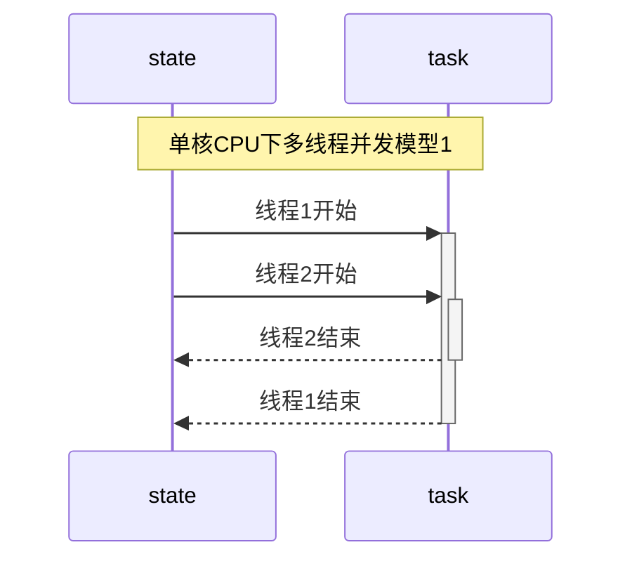
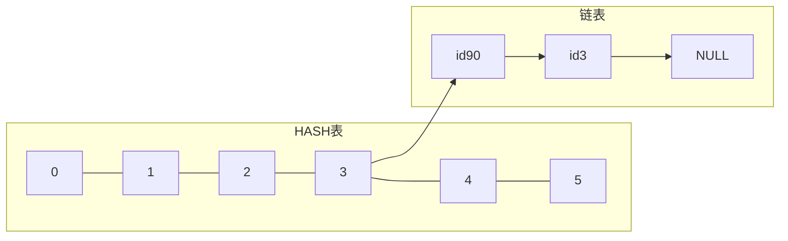

### 引言
- 在前面的学习中, 涉及最多的是进程. 进程的环境, 进程间的关系, 进程的控制等等. 不同进程之间的地址空间是隔离的, 可以通过操作系统提供的手段实现进程间的简单通讯, 也可以通过文件方式进行数据共享. 本章主要学习的是线程, 它是进程的实体. 现在操作系统的调度都是基于线程, 在1个进程中所有的线程地址空间是共享的, 这就带来了另1个问题, 若出现竞争时, 如何同步?


<br/>

### 线程的概念
- 进程出现的时间要早于线程. 典型的Unix进程可以看成只有1个控制线程: <font color=deeppink>一个进程在某一时刻只能做一件事情.</font> 也就是说进程的任务是通过分配给线程来完成的. 一个线程在某一时刻只能处理当前自己被分配的任务. 
> <font color=red>这里要强调一点, 线程和任务在时间点上是多对1[^ann-mul-cpu]的, 即多个线程可能同一时刻正在处理同1个任务, 但反过来就不行</font>. 对于单核CPU来说, 从逻辑上来说也是这样, 这种情况下, 在极短的时间内多条线程被调度去执行相同的任务



<br/>

> 如上图: 
>   1. 整个图表示1个进程下1个任务的多条线程执行
>   2. 时间的递增是以垂直方向从上往下

<br/>

> 该图呈现了最简单的多线程模型: <font color=red>图中的圆柱表示的是资源共享部分</font>. 当前对应的是 <font color=red>任务并发</font>[^ann-mul-thread1] 情景下对共享资源的访问, 这个时候若没有同步机制, 会出现资源竞争, 在逻辑上就是不正确的. 线程2的结束也可能在线程1结束之后, 这里只是简单的说明其中的1种场景

<br/>

> 若上述 <font color=red>场景变为多核CPU, 则圆柱表示的是时间点, 也表示共享资源</font>. 即在同一时刻, 不同的线程在访问同1资源, 这种情况也是竞争的一种(<font color=green>这种情况下请忽略图中线程1,2结束的部分</font>)


<br/>


### 线程特点
- 被调度的最小单位[^ann-thread-0]
- 共享进程所有资源
    - 文件描述符
    - 全局变量
    - 地址空间
- 调度开销远小于进程
- 适当的多线程技术可以大大提升CPU的执行效率
- 同步编程相对简单

> 线程的缺点: 还是存在资源抢占, 过多的线程会系统效应事倍功半

<br/>

### 线程标识
- 每1个进程都有一个ID作为标识. 和进程ID不同的是, 线程id只有在当前进程中才是唯一的. 一个进程中会存在一上表`thread-table`来管理自己所有的线程

- 标准规定的线程ID的类型是`pid_t`, 至于它内部的实现在不同的平台可能不一样, 以书籍上所说: <font color=deeppink>Linux上是一个无符号长整, Mac上是指针</font>

```cpp
#include<iostream>
#include<type_traits>

using namespace std;

int main(int args, char** argv){
    cout << "thread[" << pthread_self() << "]\n";
    cout << "size-thread:" << sizeof(pthread_t) << endl;
    cout << is_pointer<pthread_t>::value << endl;
    return 0;
}
```

<br/>

> 同样的代码运行在Mac和Linux下:

```shell
### linux中
./main
thread[281473767286192]
size-thread:8
0                               # 不是指针


### mac中:
thread[0x200281280]
size-thread:8
1                               # 是指针


### Linux中
find /usr/include -type f -name "*pthread*" | xargs -I abc grep "pthread_t;" abc
typedef unsigned long int pthread_t;


### Mac中
## 这里忽略, Mac中定义的是一个结构指针, 该结构很复杂
```

<br/>

- 因为各家实现的数据结构是不一样的, 标准规定了获取当前线程ID的接口.

```cpp
#include<pthread.h>

pthread_t pthread_self(void);

// 一定返回线程的ID
```

<br/>

- 一般情况下`pthread_self`与`pthread_equal`一起使用, 固名思意就是判断线程是不是相等

```cpp
#include<pthread.h>
int pthread_equal(pthread_t tid1, pthread_t tid2);

// 相等返回非0, 其他返回0
```

<br/>

### 创建线程

```cpp
#include<pthread.h>

int pthread_create(pthread_t* tidptr, pthread_attr_t* attr, void* (*run)(void*), void* arg);

// 成功返回0, 否则出错返回错误编号
```
> 线程是系统资源的一部分, 每个用户运行的进程可能因为限制会造成创建失败(<font color=green>当然也有其他失败的原因</font>)
>
> <br/>
>
> 需要说明的是 <font color=red>c++标准库提供的线程接口底层也是调用POSIX线程库, 在windows中则是调用Window提供的线程接口</font>, 同时该函数是库函数, 并不是系统调用. 对于返回值并不设置errno, 而是直接返回的错误码

```cpp
#include<iostream>
#include<sys/time.h>
#include<type_traits>

using namespace std;

int main(int args, char** argv){

    cout << "platform:[" << argv[1] << "]\n";
    pthread_t tid;
    if(pthread_create(&tid, nullptr, [](void* arg) -> void*{
            cout << "arg\t" << (char*)arg;
            cout << "tid[" << pthread_self() << "]\n";
            timespec st

#if defined(__clang__) && defined(__APPLE__)
            = {
                .tv_nsec = 0,
                .tv_sec = 5,
            };
            nanosleep(&st, nullptr);
#elif defined(__GNUC__) && defined(__linux__)
            = {0};
            st.tv_sec = 5;
            st.tv_nsec = 0;
            clock_nanosleep(CLOCK_REALTIME, 0, &st, nullptr);
#endif
            return nullptr;
        },const_cast<char*>("hello world\n"))){

        // 这里可以获取pthread_create的返回值当作errno
        cerr << "pthread create error\n";
        return -1;
    }

    pthread_join(tid, nullptr);

    cout << "tid dead\n";

    return 0;
}

```

<br/>

> 上述程序的流程是:
>   1. 创建线程
>   2. 阻塞等待线程
> 在子线程中主要打印对应的线程ID, 并阻塞5秒. 等待5秒后, main所在的线程才会继续执行

<br/>

```shell
### linux
./main $(uname -a | cut -d " " -f 1)
platform:[Linux]
arg	hello world
tid[281473209258432]
tid dead


### mac
./main $(uname -a | cut -d " " -f 1)
platform:[Darwin]
arg	hello world
tid[0x304fb3000]
tid dead
```

<br/>

> 关于创建线程的第2个参数`pthread_attr_t`会在后面具体的章节中详细学习. 线程创建后并不能保证新的线程先运行, 这取决于此刻内核的调度状态. 


<br/>

### 线程ID,进程ID的对比
- 线程隶属进程, 所以不同线程所对应的进程ID在实现上应该是一样的

```cpp
#include<unistd.h>
#include<sys/time.h>
#include<iostream>

using namespace std;


int main(int args, char** argv){
    cout << "main-pid[" << getpid() << "]\n";
    cout << "main-tid[" << pthread_self() << "]\n";
    cout << "main-addr[" << reinterpret_cast<void*>(main) << "]\n";


    pthread_t tid;
    auto res = pthread_create(&tid, nullptr, [](void* arg) -> void*{
        auto c = malloc(1);
        cout << "malloc-addr:[" << c << "]\n";
        cout << "child-pid[" << getpid() << "]\n" << "child-tid[" << pthread_self() << "]\n";
        return nullptr;
    }, nullptr);
    if(res){
        cerr << "pthread create: " << strerror(res) << endl;
        return -1;
    }
    
    cout << "result-tid[" << tid << "]\n";

    pthread_join(tid, nullptr);

    return 0;
}
```

<br/>

> 测试结果如下:

<br/>

```shell
./main
main-pid[30616]                         # main 所在的进程
main-tid[0x202aa9280]                   # main 所在的线程
main-addr[0x1029aa040]                  # main 函数的地址
result-tid[0x309529000]                 # 创建函数所填充的线程ID
malloc-addr:[0x600002c1c000]            # 进程中堆地址
child-pid[30616]                        # child线程所在的进程, 和main一样
child-tid[0x309529000]                  # child获取自己的线程ID
```

> 从测试可以发现, 子线程(<font color=green>child</font>)和主线程(<font color=green>main</font>)在同一个进程下. <font color=red>新创建的线程所指向的结构(`Mac`)并不在所谓的堆区, 也并未和主线程在同一区域[^ann-thread-mem]</font>.


<br/>

### 线程的终止
- 进程被终止有2类情况: <font color=deeppink>正常返回和异常终止</font>.
    1. 正常返回: 从启动流程到最后返回(`单线程中return, exit等`)
    2. 异常终止: 执行过程被异常结束(`如信号`)
    3. 关于多线程的终止, 接下的小节会详细说明
- 对应的线程的结束也分这2类情况:
    1. 正常返回: 从启动流程到最后返回(`return, pthread_exit`)
    2. 异常终止: 被其他线程直接取消(`pthread_cancel`)或被信号终止
> 需要说明的是: <font color=red>线程中若调用`exit`相关的函数后, 会直接结束整个进程. 线程结束可能并不意味着整个进程结束, 因为进程中此刻还有其他的线程在运行. 但一般情况下main函数所在的线程返回时, 即使有子进程整个进程也会结束</font>


```cpp
#include<pthread.h>
void pthread_exit(void* info_ptr);
```

<br/>

> 该函数的作用:
>   1. 手动结束当前线程
>   2. 将`info_ptr`传递给`pthread_join的第2个参数`
> 若线程是被其他线程所取消, 则`info_ptr_addr`本身会指向`PTHREAD_CANCELED`

<br/>

> <font color = red size = 5> 测试1--正常返回线程终止状态</font>

```cpp
#include<unistd.h>
#include<sys/time.h>
#include<iostream>
#include<cstdlib>
using namespace std;

int main(int args, char** argv){

    static char** tmp_argv;
    tmp_argv = argv;
    if(args < 2){
        cerr << "usage ./main <1:return 2:pthread_exit> value\n";
        return -1;
    }

    cout << "main seq[" << argv[1] << "]\n";

    pthread_t tid;
    auto res = pthread_create(&tid, nullptr, [](void* arg) -> void*{
        sleep(1);
        
        cout << "child seq[" << tmp_argv[1] << "]\n";

        if(atoi(tmp_argv[1]) == 1)
            return tmp_argv[2];

        pthread_exit(tmp_argv[2]);
    }, nullptr);

    
    if(res){
        cerr << "pthread create: " << strerror(res) << endl;
        return -1;
    }
    
    void* thread_over_parm;
    pthread_join(tid, static_cast<void**>(&thread_over_parm));
    cout << (char*)thread_over_parm << endl;

    return 0;
}
```

<br/>

> 测试如下:

```shell
for i in {1..2}; do {./main $i "$(date)--seq:$i"} done;
main seq[1]
child seq[1]
2023年 8月 9日 星期三 18时09分48秒 CST--seq:1
main seq[2]
child seq[2]
2023年 8月 9日 星期三 18时09分49秒 CST--seq:2
```

<br/>


> <font color = red size = 5> 测试2--终止进程的信号会直接终止整个进程</font>

<br/>

```cpp
#include<unistd.h>
#include<signal.h>
#include<pthread.h>
#include<iostream>


using namespace std;
int main(int args, char** argv){
    pthread_t tid;
    pthread_create(&tid, nullptr, [](void* arg) -> void*{

        int* p = nullptr;
        *p = 20;                // __code_0
        cout << "over\n";       // __code_print_0
        return nullptr;
        
    }, nullptr);

    // ignore error

       

    pthread_join(tid, nullptr);

    cout << "join over\n";      // __code_print_1
    return 0;
}
```

<br/>

> 上述程序: <font color=red>在子线程中会出现bad access(`__code_0`), 从而出现SIGSEGV信号, 导致整个进程被终止, 不管在主线程还是在子线程中, 都不会有打印出现</font>

<br/>


> <font color = red size = 5> 测试3--子线程被其他线程取消</font>

```cpp
#include<unistd.h>
#include<signal.h>
#include<pthread.h>
#include<iostream>


using namespace std;
int main(int args, char** argv){
    pthread_t tid;
    pthread_create(&tid, nullptr, [](void* arg) -> void*{
        while(1){
            cout << "ing ";       
            sleep(1);
        }
        return nullptr;
        
    }, nullptr);

    // ignore error

    sleep(2);
    pthread_cancel(tid);

    cout << "join over";
    return 0;
}
```

<br/>

> 在主线程中调用`pthread_cancel`结束子线程, 可以发现, 子线程被结束后, 并未刷新流, 最后在主线程正常返回后,标准输出的缓冲区才被冲洗(`3次打印`) 

<br/>


### `pthread_join`
```cpp
#include<pthread.h>
int pthread_join(pthread_t tid, void** info_ptr_addr);
// 成功返回0, 否则返回错误编号
```
> 该函数类似`wait`:
>   1. 若要等待的线程未结束(<font color=green>运行或睡眠等状态</font>), 则被阻塞
>   2. 若要等待的线程已经结束, 则不阻塞并直接获取到线程的返回值.
> 当调用了`pthread_join`并返回后, 线程的TCB[^ann-tcb-0]才会被回收

<br/>

```cpp
#include<unistd.h>
#include<pthread.h>
#include<sys/wait.h>
#include<iostream>

using namespace std;

int main(int args, char** argv){
    pthread_t tid;

    pthread_create(&tid, nullptr, [](void* arg)->void*{
        return const_cast<char*>("hello world");
    },nullptr);


    // ignore error 
    sleep(1);

    void* s;
    auto res = pthread_join(tid,&s);    // __code_join_1
    res ? cout << strerror(res) : (cout << res << endl, cout << reinterpret_cast<char*>(s) << endl);

    res = pthread_join(tid,&s);         // __code_join_2
    res ? cout << strerror(res) : (cout << res << endl, cout << reinterpret_cast<char*>(s) << endl);

    return 0;
}
```

<br/>

> main线程睡眠1秒后, 子线程已经结束, 此时子线程应该要被处理
> `__code_join_1`: 第1次属于正常的join, 返回为0, 并输出子线程返回的"hello world"
> `__code_join_2`: 第2次再次调用时子线程已经被清理, 此时返回错误

<br/>

```shell
./main
0
hello world         # __code_1, 打印返回码, 并打印子线程的返回值
No such process     # __code_2, 错误, 说明子线程的TCB已经被清理

# 这里出错的原因描述中是process, 并不是指进程, 而是指过程(即线程,程序)
```


### 再探进程的终止
- 前面所有的案例都是单线程环境下(`main`), 当main函数中:
    1. 主动调用`return xx`或`exit(xx)`, 整个进程会结束, 此时进程有明确的 <font color=deeppink>返回码</font>, 内核会将返回码进一步包装成 <font color=deeppink>终止码</font>
    2. 进程被异常杀死(`如信号`), 内核会将信号包装成终止码

- 若是多线程环境下, 则进程被终止的情况就很复杂了, 下面直接总结:
    1. 任何线程中调用`exit(xx)`, 整个进程都会结束. 进程有明确的返回码以及对应的终止码
    2. main函数的代码执行了`return xx`后, 不管此时有没有其他线程正在执行, 整个进程直接结束, 进程有明确的返回码以及对应的终止码
    3. 最后一个线程从启动流程返回(`return xx`).
        - 若该线程是main函数, 则进程结束的返回码为`xx`, 对应的就有终止码
        - 若该线程不是main函数, 则表示main线程已经死了, 由于子线程要返回一个指针, 标准规定, 这种情况是正常结束进程的一种, 返回码是0.
    4. 最后一个线程调用`pthread_exit`.
        - 不管该线程是不是main函数, 标准规定进程正常结束, 返回码是`0`
    5. 最后一个线程对`pthread_cancel`作出响应; 

> 上述调用`exit相关的函数, 包括 exit, _exit, _Exit`. 也就是说一个进程中可以没有主线程(`main调用pthread_exit或被其他线程pthread_cancel`), 但main一旦执行了`return xx`后, 则进程强制结束 
> 下面测试`第3, 第4, 第5`点
> <font color = red, size = 5>测试1--由子线程return</font>

<br/>

```cpp
#include<unistd.h>
#include<pthread.h>
#include<iostream>
using namespace std;

static pthread_t main_tid;

static void* child_fun(void* arg){
	cout << "child[" << pthread_self() << "]\n";
	sleep(5);                                               // __code_2
	cout << "will cancel main\n";
	pthread_cancel(main_tid);                               // __code_3
	cout << "main cancel\n";
	int a;
	while(1){
		cout << "请输入数字: ";
		cin >> a;
		if(a){
			cout << "您输入的是: " << a << endl;
			continue;
		}

		break;
	}
	return (void*)"hello world";
}


using namespace std;
int main(int args, char** argv){
	main_tid = pthread_self();
	cout << "main[" << main_tid << "]\n";

	pthread_t child;
	pthread_create(&child, nullptr, child_fun, nullptr);    // __code_0
	while(pause());                                         // __code_1

	cout << "over\n";
	return 0;
}
```

<br/>

> 上述程序的测试流程:
>   1. 创建子线程(`__code_0`)
>   2. 主线程立即阻塞(`__code_1`)
>   3. 子线程中睡眠5秒(`__code_2`), 并不一定比第2步后运行, 取决运行当前的调度情况 
>   4. 睡眠后直接结束main线程
> 这意味着main函数无法运行到`return 0`语句, main被提前结束, 只剩下子线程, 进程要想结束必须由子线程来决定. <font color=red>测试点要在`__code_2`前以及`__code_3`后查看当前进程中线程的状态</font>, 本程序在Linux中运行, 测试结果如下:

<br/>

```shell
liubo-linux% ./main
main[281473796030176]
child[281473791234496]                      # 此时在另一会话终端中查看状态
will cancel main
main cancel
请输入数字:                                 # 此时继续查看所有线程状态


## 另一终端

### 睡眠前查看所有线程
liubo-linux% ps -T -p $(ps -o pid,comm -u liubo | grep main | cut -d " " -f 3)
    PID    SPID TTY          TIME CMD
  34480   34480 pts/0    00:00:00 main      # 主线程
  34480   34481 pts/0    00:00:00 main      # 子线程


### 结束main线程后, 再次查看
liubo-linux% ps -T -p $(ps -o pid,comm -u liubo | grep main | cut -d " " -f 3)
    PID    SPID TTY          TIME CMD
  34480   34480 pts/0    00:00:00 main <defunct>    # main线程已经挂掉
  34480   34481 pts/0    00:00:00 main
liubo-linux%


### shell的命令是 获取当前 liubo用户下的main进程, 切割找出进程的id, 通过 ps -T -p pid查看该进程下的进程
```

<br/>

> 下面是gif图展示的测试过程, 重新运行的, 对应的id和上述测试是不一样的. 可以在测试5秒后输入0, 打印`echo $?`为0, 表示进程是正常结束的

---


<br/>


> <font color = red, size = 5>测试2--由子线程`pthread_exit`</font>方案和1差不多. 这里直接测试`pthread_cancel`的返回码及终止码

<br/>


```cpp
#include <sys/wait.h>
#include<unistd.h>
#include<signal.h>
#include<pthread.h>
#include<iostream>
#include<vector>
#include<string>

int main(int args, char** argv){
    
    if(args != (2 + SIGUSR2)){                      // __code_0
        std::cerr << "usage ./main <signal>[\"信号杀死\"] or <\"thread cancel\">[\"线程被取消\"] signal-list\n";
        return 0;
    }


    auto child = fork();
    // ignore error


    // main
    if(child){
        // 因为标准信号是从1开始, 但数组是从1开始, 所以这里预先占位第0个
        static std::vector<std::string> signals = {"zero"};
        
        argv += 2;
        while(*argv){
            signals.push_back(*argv);               // __code_1
            ++argv;
        }

        struct sigaction st;
        st.sa_flags = SA_SIGINFO;
        sigemptyset(&st.sa_mask);
    
        // 注册 CHLD信号
        st.sa_sigaction = [](int signo, siginfo_t* info, void* other){

            std::cout << "signal handle:\n";

            psignal(signo, "receive signal sys-descrip");   // __code_2
            std::cout << "receive signal name: " << signals[signo] << std::endl;    // __code_3
            
            int sta;
            waitpid(info->si_pid, &sta, 0);                 // __code_4

            if(WIFEXITED(sta)){
                std::cerr << "\tnormal exit code:[" << WEXITSTATUS(sta) << "]\n";   // __code_5
                return;
            }

            if(WIFSIGNALED(sta)){
                auto reason = WTERMSIG(sta);                // __code_6
                std::cerr << "\texcept exit reason-signal[" << reason << "]\n";     // __code_7
                psignal(reason, "\treason-signal sys-descrip");                     // __code_8
                std::cerr << "\treason-signal name: " << signals[reason] << "\n";   // __code_9
                return;
            }

        };
        sigaction(SIGCHLD,&st, nullptr);
        
        pause();
        std::cout << "\nprocess over\n";

        return 0;
    }

    // child
    sleep(1);


    // __code_inline_lib
    bool over_with_signal = __builtin_strncmp("signal", argv[1], std::min(__builtin_strlen("signal"), __builtin_strlen(argv[1]))) == 0;
    bool over_with_thread_cancel = __builtin_strncmp("thread cancel", argv[1], std::min(__builtin_strlen("signal"), __builtin_strlen(argv[1]))) == 0;

    // child kill self
    if(over_with_thread_cancel){
        std::cout << "will cancel thread\n";
        pthread_cancel(pthread_self());     
    }else if(over_with_signal){
        std::cout << "will send SIGTERM\n";
        kill(getpid(), SIGTERM);
    }

    return 0;
}
```

<br/>

> 上述程序的目的: <font color=red>测试信号异常结束程序 以及 `pthread_cancel`所结束的进程是不是正常结束</font>. 测试步骤:
>   1. 用户调用格式`./main signal <31个信号名的字符串> 或 ./main "thread cancel" <31个信号名的字符串>`
>   2. main函数直接`fork`
>   3. 产生的子进程(`child`), 根据命令行第1个参数来决定怎么结束自己这个进程
>   4. main进程中捕捉`SIGCHLD`信号, 并判断子进程(`child`)是不是正常结束的
> main进程的流程:
>   1. `__code_1`: 为了测试方便, 将命令行传递来的所有信号存储到数组中
>   2. `__code_2,__code_3`: 捕捉到信号后, 先打印一下信号相关的信息
>   3. `__code_4`: 处理子进程的终止状态(`避免产生僵死进程`), 这一步不会阻塞, 因为当前有子进程被等待处理
>   4. `__code_5`: 若正常结束, 则打印子进程的退出码(`注意是退出码, 类似于exit(xx)的参数xx`)
>   5. `__code_6`: 若异常结束, 则打印子进程结束的原因, 以及被什么信号所结束的(`__code_7, __code_8, __code_9`)
> 
> <br/>
>
> 需要说明的是`__code_line_lib`: <font color=red>这些`__builtin_xx`是编译器内部的内联库函数, 不用导入库函数, 功能和对应的库函数一样, 当前是在clang环境下, Mac系统中</font>, 下面是shell测试的过程, <font color=red>内部用到了zsh的脚本语法</font>

```shell
arr=("signal", "thread cancel")         # 定义数组


# 取出arr的内容, 并同步调用 main程序, 传递相关的参数
## kill -l | xargs 是将 所有的31个标准Unix信号封装成命令行参数
for i in $arr; do {echo $i; ./main $i $(kill -l | xargs); echo "\n"} done;
signal                                          # signal方式结束子进程(异常结束)
will send SIGTERM
signal handle:
receive signal sys-descrip: Child exited
receive signal name: CHLD
	except exit reason-signal[15]               # 可以发现子进程是被15号信号(TERM), 所结束
	reason-signal sys-descrip: Terminated
	reason-signal name: TERM                    # sigaction中的siginfo_t* info中的 si_signo并不是异常的原因, 而是SIGCHLD信号, 这里不说了

process over


thread cancel                                   # 以 pthread_cancel结束当前进程中的唯一线程, 即会造成整个进程的结束
will cancel thread                  
signal handle:
receive signal sys-descrip: Child exited        
receive signal name: CHLD
	normal exit code:[0]                        # 发现是正常结束

process over
```


### `pthread_cancel`
- 该函数是结束当前线程, 但并不是立即结束: <font color=deeppink>因为这样当前线程可能正在操作全局的结构, 所以若是立即结束则可能造成</font>:
    - 全局的数据结结构可能被破坏(`如malloc等`), 类似于可重入
    - 可能造成死锁(`如当前线程已经在同步区加锁, 还未来得及解开锁就被结束了`)

<br/>

> <font color = red, size = 5>测试1--延迟结束</font>

```cpp
#include<unistd.h>
#include<pthread.h>
#include<sys/wait.h>
#include<iostream>

using namespace std;

int main(int args, char** argv){
    if(args != 2){
        cerr << "usage ./main <cancel type>[0:nothing 1:yield 2:sleep(5)]\n";
        return -1;
    }
    pthread_cancel(pthread_self());

    switch(atoi(argv[1])){
        case 1:
            cout << "yield\n";
            pthread_yield_np();
            break;
        case 2: 
            cout << "sleep\n";
            sleep(5);
            break;
        default:
            cout << "nothing\n";
            break;
    }
    cout << "cancel \n";
    return 0;
}
```

<br/>

> 上述程序分别测试3种情况下调用`pthread_cancel`后会不会打印内容
```shell
### 调用后, 不做任何特殊处理
./main 0
nothing
cancel


### 调用后, 直接放弃当前的cpu
./main 1
yield
cancel


### 调用后, 直接睡眠5秒
./main 2
sleep               # 无法睡眠到5秒
```

<br/>

> 基本可以得出以下结论:
>   1. 该函数结束线程的时间点, 并不是在线程的下一次调度: <font color=red>因为当指定yield时, 再被调度时, 仍然会执行打印</font>
>   2. 睡眠时会查看是不是已经标记取消了: <font color=red>因为sleep不能睡眠到5秒</font>
> 这里yield是立即放弃当前CPU, 本身不会被信号中断, 也就是说调用该函数的过程中就会放弃, 并不是延迟放弃CPU

<br/>


> <font color = red, size = 5>测试2---死锁</font>

<br/>


```cpp
#include<unistd.h>
#include<pthread.h>
#include<sys/wait.h>
#include<iostream>

using namespace std;

static const char* tmp_file = "./a.txt";
static pthread_mutex_t m_lock;

int main(int args, char** argv){

    pthread_mutex_init(&m_lock, nullptr);

    pthread_t tid;
    pthread_create(&tid, nullptr, [](void* arg)->void*{
        cout << "child\n";
        pthread_mutex_lock(&m_lock);        // __code_child_lock
        pthread_cancel(pthread_self());     // __code_0
        sleep(5);                           // __code_1
        cout << "sleep over\n";             // __code_2
        pthread_mutex_unlock(&m_lock);      // __code_child_unlock

        return nullptr;
    },nullptr);


    int a;
    cin >> a;                           // __code_block
    cout << "a: " << a << endl;         // __code_input


    auto file = fopen(tmp_file, "r+");
    pthread_mutex_lock(&m_lock);        // __code_main_lock
    fwrite("hello", 5, 1, file);        // __code_3
    pthread_mutex_unlock(&m_lock);      // __code_main_unlock
    return 0;
}
```

<br/>

> 上述程序的流程是: 主线程会阻塞, 原因是需要子线程要确保先运行到`__code_0`结束自己.
>   1. `__code_block`导致主线程被阻塞
>   2. `__code_child_lock`: 主线程阻塞期间, 子线程先上锁
>   3. `__code_0`: 子进程调用`pthread_cancel`申请结束自己
>   4. `__code_1`: 因为调用cancel后并不是立即执行, 所以直接睡眠导致当前子线程结束
>   5. 子线程无法执行到`__code_2`, 所以子线程挂掉以后, 锁是不会释放的
>   6. 向终端输入内容结束阻塞`__code_input`
>   7. 主线程尝试拿到锁(`__code_3`), 但此时锁并未由子线程释放, 所以主线程会一直卡在这里形成死锁


<br/>

> 同样的原理, 当一个线程被cancel后, 由于延迟的机制, 若正在调用不可重入函数(`如大部分的库函数`), 都可能造成全局的数据结构被破坏.> 具体cancel后, 线程结束的代码点后面在详细学习

<br/>


### `PTHREAD_CANCELED`
- 该标识是一个 <font color=deeppink>macro</font>(`宏`), 当线程被`pthread_cancel`后, 若后续清理该线程(`pthread_join`), 则被回填的参数就是`PTHREAD_CANCELED`

```cpp
#include<unistd.h>
#include<pthread.h>
#include<sys/wait.h>
#include<iostream>

using namespace std;


int main(int args, char** argv){
    pthread_t tid;

    cout << "PTHERAD_CANCELED: " << PTHREAD_CANCELED << endl;

    pthread_create(&tid, nullptr, [](void* arg)->void*{
        pthread_cancel(pthread_self());
        sleep(1);
        cout << "never\n";
        return nullptr;
    },nullptr);

    // ignore error 
    sleep(2);

    cout << "wake up\n";
    
    void* value;
    pthread_join(tid, &value);

    cout << "value [ " << (reinterpret_cast<decltype(PTHREAD_CANCELED)>(value) == PTHREAD_CANCELED ? "==" : "!=") << " ] PTHREAD_CANCELED\n";
   
    return 0;
}
```

<br/>

> 上述程序是子线程使用cancel结束自己, 然后在main线程中清理(`pthread_join`), 发现获取到的value值是`PTHREAD_CANCEL`

<br/>

```shell
./main
PTHERAD_CANCELED: 0x1
wake up
value [ == ] PTHREAD_CANCELED
```

<br/>

### 线程退出清理
- 如同进程中的`atexit`一样, 线程也有相同的处理机制. 相关的函数如下:

```cpp
void pthread_cleanup_push(void(*fun)(void*), void* arg);

void pthread_cleanup_pop(int exec);
```
> 需要说明的是这2个函数是配套的, 并不像atexit只有一个单独的函数. 它们只是POSIX规定的接口, 实际上不同的系统实现不一样. 在Mac和Linux(<font color = green>这里平台是Ubuntu,其他发版本未看</font>)上都是使用宏实现的, 只不过Mac的宏实现并未像Linux上实现的那样炫酷,接下来会对比两家代码作赏析
> pop时所传递的参数为`0或1`, 只有指定1时, 注册的函数才会被调用

<br/>

> <font color=red, size = 5>测试1--简单使用</font>

```cpp
#include<unistd.h>
#include<pthread.h>
#include<iostream>

using namespace std;


int main(int args, char** argv){
    auto cbk = [](void* arg) -> void{
        cout << reinterpret_cast<char*>(arg) << endl;
    };
    pthread_cleanup_push(cbk, const_cast<char*>("func1"));
    pthread_cleanup_push(cbk, const_cast<char*>("func2"));
    pthread_cleanup_push(cbk, const_cast<char*>("func3"));

    cout << "working\n";

    pthread_cleanup_pop(1);
    pthread_cleanup_pop(0);
    pthread_cleanup_pop(1);


    return 0;
}
```

<br/>

> 上述程序在main线程开始时, 注册了3次函数, 每次传递的参数不一样
> 最后在结束前以栈的方式将函数取出来, 但`func2`的这1次却并不调用

<br/>

```shell
./main
working
func3
func1
```

<br/> 同样的测试, 在Linux上效果是一样的, 这里不再单独再写一遍

> <font color=red, size = 5>该配套函数在2家平台实现的代码赏析</font>. 
> 为了测试方便, 这里只作一层注册

<br/>

```cpp
#include<unistd.h>
#include<pthread.h>
#include<iostream>

using namespace std;

int main(int args, char** argv){
    auto cbk = [](void* arg) -> void{
        cout << reinterpret_cast<char*>(arg) << endl;
    };
    pthread_cleanup_push(cbk, const_cast<char*>("call back"));

    cout << "working\n";

    pthread_cleanup_pop(1);

    return 0;
}
```

<br/>

- 以上面的代码为例, 首先在Mac上:
> 因为这2个像函数的接口实际上是由宏实现, 所以直接利用编译器预编译一下, 然后查看对应的CPP代码(`当前用c++编写, 编译器为clang++`)

<br/>

```shell
# 调用 -E 选项, 指定源代码文件先将预编译指令展开(如 include, define)等
## 输出 main.e文件中代码还是cpp代码, 只不过所有的宏被展开
clang++ -E main.cpp -o main.e
```

<br/>

> 查看 main.e, 这里因为main.cpp编译完文件比较庞大, 所以直接将 main函数部分展示在文档中

```cpp
int main(int args, char** argv){
    auto cbk = [](void* arg) -> void{
        cout << reinterpret_cast<char*>(arg) << endl;
    };

    {                                                           // __code_start
        struct __darwin_pthread_handler_rec __handler;          // __code_0     
        pthread_t __self = pthread_self();                      // __code_1
        __handler.__routine = cbk;                              // __code_2
        __handler.__arg = const_cast<char*>("call back");       // __code_3
        __handler.__next = __self->__cleanup_stack;             // __code_4
        __self->__cleanup_stack = &__handler;;                  // __code_5

        cout << "working\n";                                    // __code_6

        __self->__cleanup_stack = __handler.__next;             // __code_7
        if (1)(__handler.__routine)(__handler.__arg);           // __code_8
    };                                                          // __code_end

    return 0;
}

/**
    Mac上实现简单易懂
        0. 首先:
            __code_start 到 __code_5    为  pthread_cleanup_push 整个宏定义
            __code_7     到 __code_end  为  pthread_cleanup_end  整个宏定义
        

        1. __code_0 定义局部变量 __handler
        2. __code_2 记录用户注册的函数cbk
        3. __code_3 记录用户cbk所需要的参数
        4. __code_4 形成链表, 指向下一个 __handler类型
            这里说明一点, 每1个线程都有TCB描述, 这个TCB对于
            线程来说是全局的, 通过 pthread_self可以找到线程的TCB
            再通过TCB中的__cleanup_stack存储用户指定的函数cbk
            该结构是链表实现的栈
        5. __code_5 将TCB中__cleanup_stack的栈顶指向最新的 __handler

        6. __code_6 线程工作的代码

        7. __coed_7 线程要结束前, 将栈顶指针指向下一个函数
        8. __code_8 根据用户调用 pthread_cleanup_pop(xx)中的xx来决定要不要调用该栈顶函数(__handler)
        9. __code_9 pthread_cleanup_pop的宏定义结束 


    总结:
        Mac上使用宏来实现POSIX规定的接口, 该函数必须成对出现, 否则编译不通过, 因为:
            pthread_cleanup_push 最开始有  {
            而右                           }
            被定义在pthread_cleanup_pop中, 所以会在编译期就强制用户必须写完整
        
        这样的目的是在同一区域中使用统一的代码实现栈操作, 若没有 {}, 则上述局部变量
        会因为名字不能重名的问题变得难以实现

        若是嵌套使用, 原理是一样的, 会通过 {}, 将作用域分开, 每个作用域结束后就会
        决定要不要调用用户的函数
*/
```

<br/>

> 在这里Mac将用户注册的函数以及参数信息都记录在了一个链表中. 从实现功能上来看似乎不需要这样做: <font color=red>因为`pthread_cleanup_push`配合`pthread_cleanup_pop`已经保证`_handler`被执行</font>. 举个例子若没有链入相关的代码, 则上述代码大致长这样

<br/>

```cpp

// ... 前面的代码

{                                                           // __code_start
    struct __darwin_pthread_handler_rec __handler;          // __code_0     
    __handler.__routine = cbk;                              // __code_2
    __handler.__arg = const_cast<char*>("call back");       // __code_3

    cout << "working\n";                                    // __code_6

    if (1)(__handler.__routine)(__handler.__arg);           // __code_8
};                                                          // __code_end

// ... 后面的代码
```

<br/>

> 很明显这种情况下, 功能也能实现, 若出现多层嵌套也是能保证在调用上是以栈方式逐个调用的, 但为什么Mac要多出一步(`链入函数`), 猜想:
>   - 可能POSIX有另外的规定, 导致不得不将函数记录下来
> 现在假设链入的这一步是必须的

<br/>

- 其次在Linux中, 同样的测试流程, 先以`g++ -E main.cpp -o main.e`编译

<br/>

```cpp
int main(int args, char** argv){
    auto cbk = [](void* arg) -> void{
        cout << reinterpret_cast<char*>(arg) << endl;
    };

    do{                                                                         // __code_0
        __pthread_cleanup_class __clframe(cbk,const_cast<char*>("call back"));  // __code_1
        cout << "working\n";                                                    // __code_2
        __clframe.__setdoit(1);                                                 // __code_3
    } while (0);                                                                // __code_4
    return 0;
}

/**
    上述代码是linux内核中最喜欢用的 do{...}while(0)
    至于这样写的好处这里不多说了
    
    首先:
        __coed_0 到 __code_1 为 pthread_cleanup_push 的宏定义
        __code_3 到 __code_4 为 pthread_cleanup_pop  的宏定义
    
    其次就有1个有趣的现象:
        没有出现类似Mac上TCB相关的链表连接操作(Mac中的__code_1 到 __code_5)

    现在虽然没有看到Linux中源码实现, 但通过c++语法也可推断出:
        1. __pthread_cleanup_class是C++中的类
        2. cbk函数和参数"call back"被直接构造成了 局部变量 __clframe中
            所以在构造函数中会作类似Mac中的链表连接操作
        3. 利用c++的析构, 出了作用域(__code_4)后, 编译器会调用 __clframe析构
            在该析构函数中肯定会 cbk("call back")
        4. 内核的pthread.h被C++标准库覆盖, 所以才会定义出C++下的 pthread_cleanup_push
    
        5. 因为pthread.h由内核定义, 所以一定有 C环境下的 pthread_cleanup_push定义


    现在先来找到 C++下, __pthread_cleanup_class的定义, 代码如下:    
*/

class __pthread_cleanup_class{
  void (*__cancel_routine) (void *);
  void *__cancel_arg;
  int __do_it;
  int __cancel_type;

 public:

    // __code_ctor
  __pthread_cleanup_class (void (*__fct) (void *), void *__arg)
    : __cancel_routine (__fct), __cancel_arg (__arg), __do_it (1) { }


    // __code_dctor
  ~__pthread_cleanup_class () { if (__do_it) __cancel_routine (__cancel_arg); }

    // __code_set_flag
  void __setdoit (int __newval) { __do_it = __newval; }

  void __defer () { pthread_setcanceltype (PTHREAD_CANCEL_DEFERRED,
                                           &__cancel_type); }
  void __restore () const { pthread_setcanceltype (__cancel_type, 0); }
};

/**
    很明显在构造函数(__code_ctor)中, 用户传递的ckb和"call back"会被记录下来

    在析构函数(__code_dctor)中, 会根据标识 __do_it来决定要不要调用 cbk

    用户设置标识 pthread_cleanup_pop(1), 对应的是 __code_3

    总结:
        和Mac不同的是, Linux下的编译器g++对pthread.h重新做了声明, 分为C++环境和C环境
        C++环境下, 利用类的构造和析构实现了相同的功能
        但未涉及到将用户的函数关联到TCB中. Mac因为不区分C环境及C++环境
        他的做法是必须的, 必须将函数链入到全局的结构中, 因为上下文环境
        必须从一个全局的结构中获取到,所以Mac选择了TCB.
        
        同样的, 若Linux是在C环境下, 他在实现时在逻辑上也必须将
        用户注册的函数链入到某个全局结构中.
        但事实上Linux并未这样做:
            1. 若是标准C, linux采用了sigsetjmp方式配合 pthread_register_cancel来实现Mac一样的效果
            2. 若是扩展C(-D__EXCEPTIONS)下, 
                他采用了编译器特性, 形成了如同C++类一样的效果, 这就是Linux精巧的地方
                同样的对比Mac, 并不是说Mac做的不好, Mac实现的是标准C, 而
                Linux用了编译器特性不属于标准C, 所以它在编译时要指定对应的gnuc选项

    下面看一下标准C环境下Linux的编译代码
*/
```

<br/>

> C语言代码
```c
#include<unistd.h>
#include<pthread.h>
#include<stdio.h>

static  void cbk(void* arg){
	puts((char*)arg);
}

int main(int args, char** argv){
    pthread_cleanup_push(cbk, (void*)"call back");
    puts("working");
    pthread_cleanup_pop(1);
    return 0;
}
```

<br/>

> 编译`main.c`

<br/>

```shell
gcc -pthread -E main.c -o main.e
```

<br/>


> 同样的道理, 截取主要部分的代码

<br/>

```c
static void cbk(void* arg){
    puts((char*)arg);
}

int main(int args, char** argv){

   do { 
       __pthread_unwind_buf_t __cancel_buf;             // __code_0

       void (*__cancel_routine) (void *) = cbk;         // __code_1

       void *__cancel_arg = (void*)"call back";         // __code_2

       int __not_first_call = __sigsetjmp(__cancel_buf.__cancel_jmp_buf, 0);    // __code_3

       if (__builtin_expect((__not_first_call), 0)) {   // __code_4
           __cancel_routine (__cancel_arg);             // __code_5
           __pthread_unwind_next (&__cancel_buf);       // __code_6
        } 

        __pthread_register_cancel (&__cancel_buf);      // __code_7

                                                        // __code_working_start
        do {
            puts("working");

            do { } while (0); 

       } while (0);                                     // __code_working_end

       __pthread_unregister_cancel(&__cancel_buf);      // __code__7

       if (1)__cancel_routine (__cancel_arg);           // __code_8
    } while (0);                                        // __code_9
    return 0;
}


/**
        linux(Ubuntu)中 也和Mac做了一样的事情!! 那所谓的技巧在哪里?
        先来看当前实现:
            0. __code_0 定义局部变量
            1. __code_1 记录cbk函数
            2. __code_2 记录参数"call back"
            3. __code_3 这一步的作用比较巧妙
                这里就不同于Mac的做法, Mac是在当前线程中借用TCB
                用链表将用户注册的函数链入到链表

                而Linux采用 sigsetjmp方式将当前的栈桢记录到
                    __cancel_buf.__cancel_jmp_buf
                这个局部变量中, 该变量有当前的函数栈桢的所有信息
                那从逻辑上来看, 自然就能通过该变量找到
                    __cancel_routine变量--> 关联用户注册的函数
                    __cancel_arg变量    --> 关联用户函数的参数

                所以这里很关键: Linux是怎么通过 __cancel_buf.__cancel_jmp_buf
                这个变量定位到 函数和参数呢? 我们这里并不去找寻相关的源码实现
                
                作出1个猜想:
                    Linux内部可能会通过函数空间栈变量地址来直接定位
                    如当前局部变量的顺序是:
                        __cancel_buf
                        __canecl_routine
                        __cancel_arg
                    所以通过
                        &__cancel_buf - sizeof(void*)   == &__cancel_routine
                        &__cancel_buf - 2*sizeof(void*) == $__cancel_arg
                    就能找到用户注册的函数和参数
                    
                当然这种栈空间中变量地址的布局并不是绝对的, 但这只是一种猜想
                总之Linux不管怎么实现, 它的目的是要和Mac一样, 将函数和参数
                记录下来

            4. __code_4 对应__code_3
                __builtin_expect(__note_first_call, 0)利用了编译器(gcc)特性
                告诉编译器__not_first_call 为0的概率很高, 即 sigsetjmp返回为0的概率很高
                当结合if时, 表示if(__not_first_call), 即if(0)的概率很高
                这样编译器在生成汇编代码时,尽量使得代码从上往下流水执行
                这里涉及到编译器的优化, 不理解的可以不管它, 总之为了效率
                
                linux这样做的原因是:
                    在该场景下, 根本没有地方调用siglongjmp:
                        __pthread_register_cancel内部不会出现siglongjmp, 否则会死循环
                        __pthread_unregister_cancel内部同理也不会出现siglongjmp
                    但中间用户的代码
                        __code_working_start 到 __code_working_end
                    可能出现siglongjmp调用, 但概率也是很小的
                    因为用户正常编写代码时, 不会联想到还有一个局部变量 
                        __cancel_buf.__cancel_jmp_buf
                    所以:
                        一方面保证sigsetjmp的语义, linux还是给出了if不为0的情况
                        另一方面若出现这种情况则也会出现死循环. 
                        所以这所有的一切都是必要的

            5. __code_7 如同Mac一样, pthread_register_cancel内部会做链入处理
                链入的是 __cancel_buf, 这样就可以通过它找到
                定义它所在函数中用户注册的 __cancel_routine和__cancel_arg
            
            6. 用户代码 __code_working_start, __code_working_end

            7. 删除栈桢信息, pthread_unregister_cancel内部会如同Mac一样
                将指针指向下一个用户最后注册的函数


    总结: Linux的标准C下的实现看起来稍微复杂了一点, 但本质和Mac一样, 接下来看
            Linux下的扩展C
*/
```
<br/>

> 编译`gcc -E -D__EXCEPTIONS main.c -o main.e`, 并查看相关的代码

```c
static void cbk(void* arg){
    puts((char*)arg);
}

int main(int args, char** argv){

   do { 
       // 定义结构体,记录用户的函数信息
       struct __pthread_cleanup_frame __clframe __attribute__ ((__cleanup__ (__pthread_cleanup_routine))) = { 
           .__cancel_routine = (cbk), 
           .__cancel_arg = ((void*)"call back"), 
           .__do_it = 1 
        };

        puts("working");

        __clframe.__do_it = (1); 
    } while (0);
    return 0;
}

/**
    这里用了gcc的扩展 __attribute__((__cleanup__(__pthread_cleanup_routine)))
    它用来在C环境下修饰变量, 当变量的出了所在的作用域时
    会调用 指定的__pthread_cleanup_routine(&变量地址)函数, 将变量的地址传递过去
    类似于c++下的析构函数, 所以可以肯定的是 在__pthread_cleanup_routine中
    一定有 cbk的调用, 下面是它的实现
*/
__extern_inline void
__pthread_cleanup_routine (struct __pthread_cleanup_frame *__frame){
  if (__frame->__do_it)
    __frame->__cancel_routine (__frame->__cancel_arg);
}

/**
    这种方式原理上和开始的c++一样, 不用特意记录信息, 比较简单
*/
```

<br/>


### `pthread_cancel`触发`pthread_cleanup_pop(1)`?
- 分析了Linux的实现后, 大致可以得出另一个结论:`__pthread_register_cancel `这个函数从名字上能知道, <font color=deeppink>当线程被`cancel`后, 用户注册的函数也会被调用</font>. 正因为这个原因所以Linux和Mac会多出链入的操作, 就是为了保证线程被取消时, 也能从全局的结构中找到用户注册的清理函数. 只不过Mac是用TCB记录, Linux则是通过sigsetjmp保存栈桢信息
> 下面在Mac测试, 源代码如下

```cpp
#include<unistd.h>
#include<pthread.h>
#include<stdio.h>


static void cbk(void* arg){
    puts("call");
}

int main(int args, char** argv){
    pthread_cleanup_push(cbk, NULL);

    pthread_cancel(pthread_self());
    sleep(1);

    puts("never");
    pthread_cleanup_pop(1);

    return 0;
}
```

<br/>

> 上述程序是C程序(`clang -glldb -lpthread    main.c   -o main`), 运行程序后

<br/>

```shell
./main
call

## 用户注册的函数被调用了, 也就是说 pthread_cancel内部会找到结束线程的TCB, 然后逐个调用清理函数
```

<br/>

> 同样的代码在Linux上使用`gcc`编译(`标准C`),最后运行的效果是一样的, 但Linux上存在不同条件下的优化
>   1. c++环境(<font color=green>会被调用,原因见下一小节</font>)
>   2. c扩展
> 
> <br/>
>
> 所以要对这2种情况来测试, 在测试前先要思考一个问题:
>   - C++中`pthread_cancel`作为一种异常退出线程(<font color=green>但测试时返回码是0,表示正常</font>)的方式, 那对应的类的析构函数会不会正确执行, 针对这个问题, 下面的小节来专门测试这个问题

<br/>


### `pthread_cancel`会正确处理C++类的析构吗?
- 写一个简单的程序来验证这一点

```cpp
#include<unistd.h>
#include<pthread.h>
#include<iostream>

using namespace std;

static void cbk(void* arg){
	cout << "call\n" << endl;
}

struct A{
	~A(){
		cout << "dctor\n";
	}
};
int main(int args, char** argv){
    pthread_cleanup_push(cbk, nullptr);

    A a;
    pthread_cancel(pthread_self());
    sleep(1);

    cout << "never\n";
    pthread_cleanup_pop(1);

    return 0;
}
```

<br/>

> 上述程序很简单, 这里分别在Linux和Mac上测试

<br/>

```shell
### Mac
./main
call                

        ## Mac上并未调用 A的析构函数


### Linux
./main
dctor
call    
        
        ## Linux则是保证了先调用析构
```

<br/>

> 通过这个测试就可以推断出:
>   1. 当在Linux上C++环境下`pthread_cleanup_xx`会在`pthread_cancel`后被调用
>       - 构造时, 标识指定的是1,所以会在析构时被调用
>   2. 当在Linux上`C扩展`下`pthread_cleanup_xx`会在`pthread_cancel`后被调用吗?
>       - 下面给出测试

<br/>


```cpp
#include<unistd.h>
#include<pthread.h>
#include<stdio.h>


static void cbk(void* arg){
	puts("call");
}


int main(int args, char** argv){
    pthread_cleanup_push(cbk, NULL);

    pthread_cancel(pthread_self());
    sleep(1);

    puts("never");
    pthread_cleanup_pop(1);

    return 0;
}
```

<br/>

> 编译`gcc -pthread -D__EXCEPTIONS main.c -o main`,运行

<br/>

```shell
./main
```

<br/>

> 直接结束, 所以不会调用, 同样的也可得出另一个结论: 在Mac上`pthread_cancel`不会处理函数栈中类的析构函数, 具体的这里不再详细探究

<br/>


### `pthread_cleanup_xx`并不是严格的线程析构
- 这里所说的 <font color=deeppink>线程析构</font>是作者自己定义的, 用来 <font color=deeppink>类比atexit</font>, 通过上面的学习, `pthread_cleanup_xx`被调用并不是线程在结束时被回调, 而是用户指定

> 如下面的代码, 用户指定的cbk会在 <font color=red>打印working</font>前被调用, 却不是在线程执行完所有的代码后被调用

```cpp
#include<unistd.h>
#include<pthread.h>
#include<iostream>

using namespace std;

int main(int args, char** argv){
    auto cbk = [](void* arg) -> void{
        cout << reinterpret_cast<char*>(arg) << endl;
    };
    pthread_cleanup_push(cbk, const_cast<char*>("call back"));

    pthread_cleanup_pop(1);

    cout << "working\n";

    return 0;
}
```

<br/>


### 该实现在2平台的细节(`当作高级面试`)
-  Mac的处理看上去方便简洁, 但细想起来有个致命的问题: <font color=red>野指针</font>
> 因为: <font color=red>Mac是在当前函数的栈桢中将局部变量存储起来, 若在pop前直接返回该线程, 则`pthread_exit`后会到TCB中找用户注册的函数信息, 此时找到的`__handler`已经不存在了, 所以直接内存错误</font>

```cpp
#include<unistd.h>
#include<thread>
#include<pthread/pthread.h>
#include<iostream>

using namespace std;


int main(int args, char** argv){
    auto child = []{
        auto lambda = [](void* arg){
            cout << "exit\n";
        };

        pthread_cleanup_push(lambda, nullptr);
        return;

        pthread_cleanup_pop(1);
    };

    thread(child).detach();
    pause();
    return 0;
}

/**
    将上面的宏展开

    int main(int args, char** argv){
    auto child = []{
        auto lambda = [](void* arg){
            cout << "exit\n";
        };

        { 
            struct __darwin_pthread_handler_rec __handler; 
            pthread_t __self = pthread_self(); 
            __handler.__routine = lambda; 
            __handler.__arg = nullptr; 
            __handler.__next = __self->__cleanup_stack; 
            __self->__cleanup_stack = &__handler;;          // __code_register_totcb


            return;         // __code_return

            __self->__cleanup_stack = __handler.__next; 
            if (1) 
                (__handler.__routine)(__handler.__arg); 
        };
    };

    thread(child).detach();
    pause();
    return 0;
}
*/
```

<br>

> 上述程序在`__code_return`后, 函数结束,`__handler`变量随之被销毁. 函数结束后, 线程child属于正常结束, 则会调用用户注册的函数`lambda`, 但此时去TCB中查找时, 最顶部的函数信息载体`__handler`已经不存在, 所以直接野指针
> 需要说明的是: 这种情况所谓的调用用户的注册函数并不是标准

<br/>


- 那对应的Linux中会不会存在这样的问题呢? 首先若是 <font color=deeppink>C++或ExceptionsC环境下, 不会有这个问题, 因为会在函数返回前做对应的析构处理. 所以最主要考虑的是Linux标准C环境下</font>. 虽然目前没有真正去看源码, 但可以有这样一个猜想: <font color=deeppink>对于Linux标准C下的处理也不会出现野指针问题, 因为对应的其他编译选项的情况下是正常的, 那Linux一定会保证标准C也是正常的</font>. 这里将同样的程序以标准C的形式展开在Linux中

<br/>

```cpp
#include<unistd.h>
#include<pthread.h>
#include<stdio.h>


static void lambda(void* arg){
	puts("exit");
}

static void* child(void* arg){
    pthread_cleanup_push(lambda, NULL);
    return NULL;
	puts("over\n");
    pthread_cleanup_pop(1);
	return NULL;
}


int main(int args, char** argv){
	pthread_t tid;
	pthread_create(&tid, NULL, child, NULL);
	pthread_detach(tid);
	pause();
    	return 0;
}
```

<br/>

```shell
gcc -pthread main.c -o main             # 以标准C编译

./main                      

                                        # Linux中居然没有处理用户的注册
```

<br/>

> linux在这种情况下, 并不会处理用户的注册函数. <font color=red>但决不能就认定野指针不出现的原因是这个. 下面来细说原因:</font>
> 首先展开宏

```cpp
static void lambda(void* arg){
    puts("exit");
}

static void* child(void* arg){

   do { 
       __pthread_unwind_buf_t __cancel_buf; 
       void (*__cancel_routine) (void *) = (lambda); 
       void *__cancel_arg = (((void *)0)); 
       int __not_first_call = __sigsetjmp ((struct __jmp_buf_tag *) (void *) __cancel_buf.__cancel_jmp_buf, 0); 


       if (__builtin_expect ((__not_first_call), 0)) {      // __coed_important
           __cancel_routine (__cancel_arg); 
           __pthread_unwind_next (&__cancel_buf); 
        } 
        __pthread_register_cancel (&__cancel_buf); 
        do {

            return ((void *)0);

            do { 

            } while (0); 
        } while (0); 

        __pthread_unregister_cancel (&__cancel_buf); 

        if (1) 
            __cancel_routine (__cancel_arg); 

    } while (0);
    
    return ((void *)0);
}
```

<br/>

> 这里`return`后很明显局部变量`__cancel_buf`已经被释放了, Linux最后没有回调`lambda`, 但在`return`前`register_cancel`已经将信息注册到了某个全局变量中, 以便于后续从别的地方退出(`pthread_cancel,pthread_exit`)时调用到注册函数. 当前子线程只有child函数, return就意味着函数被结束, 函数结束则当前子线程就会结束, 此时从逻辑上来讲直接清理线程相关的数据(`包括用户注册的函数`)就不会有问题(`如当前的lambda即使__cancel_buf已经不存在`). 也就是说用户只要在pop前return导致线程结束, linux内部不会处理注册函数.

<br/>

### Linux中`pthread_cleanup_xx`中为什么要有`sigsetjmp`
- 前面一直不明白在实现`pthread_cleanup_xx`时为什么Linux的标准C实现中要有`sigjmp`相关的, 当时猜想的有以下原因:
    1. 一方面保证sigsetjmp的语义, linux还是给出了if不为0的情况
    2. 另一方面若出现这种情况(`sigjmp返回非0`)则会出现死循环. 
> 现在可以断定`__code_important`(上面代码)的原因, 它一定由`pthread_cancel, pthread_exit`内部调用, 为了验证有一个简便的方法, 直接将宏展开的函数替换main.c中的函数, 然后调试


```cpp
#include<unistd.h>
#include<pthread.h>
#include<stdio.h>


static void lambda(void* arg){
	puts("exit");
}


static void* child(void* arg){

   do {
       __pthread_unwind_buf_t __cancel_buf;
       void (*__cancel_routine) (void *) = (lambda);
       void *__cancel_arg = (((void *)0));
       int __not_first_call = __sigsetjmp ((struct __jmp_buf_tag *) (void *) __cancel_buf.__cancel_jmp_buf, 0);


       if (__builtin_expect ((__not_first_call), 0)) {      // __coed_important
	       puts("second");
           __cancel_routine (__cancel_arg);
           __pthread_unwind_next (&__cancel_buf);
        }
        __pthread_register_cancel (&__cancel_buf);
        do {

		puts("first");
		pthread_exit(NULL);

            do {

            } while (0);
        } while (0);

        __pthread_unregister_cancel (&__cancel_buf);

        if (1)
            __cancel_routine (__cancel_arg);

    } while (0);

    return ((void *)0);
}


int main(int args, char** argv){
	pthread_t tid;
	pthread_create(&tid, NULL, child, NULL);
	pthread_detach(tid);
	pause();
    	return 0;
}
```

<br/>

> 编译调试

```shell
gcc -pthread -ggdb main.c -o main
./main
./test1
first
second
exit
```

<br/>

> 所以linux中sigsetjmp这种方式的非0判断处理是必须的, 而若在Mac中, 应该避免在pop前return结束线程, 应该使用`pthread_exit或pthread_cancel`. 但某些情况下: <font color=red>Linux这样处理模式也会出现野指针, 上面子线程只有1个child函数, 但若`pthread_exit`出现在另外的函数, 就会出现野指针</font>

<br/>

```cpp
#include<unistd.h>
#include<pthread.h>
#include<stdio.h>


static void lambda(void* arg){
	puts("exit");
}


static void* child(void* arg){
	pthread_cleanup_push(lambda, NULL);
	puts("first");
	return NULL;
	pthread_cleanup_pop(1);

	return NULL;
}

static void* other(void* arg){
	child(arg);
	pthread_exit(0);
	puts("over\n");
	return 0;
}

int main(int args, char** argv){
	pthread_t tid;
	pthread_create(&tid, NULL, other, NULL);
	pthread_detach(tid);
	pause();
    	return 0;
}
```

<br/>

> 上述测试中: <font color=red>子线程会调用2个函数, 而启动other函数后, 调用到child时, child内部push了注册函数, 但pop前直接退出了, 导致记录注册函数的载体`__register_cancel`被释放, 回到other后, 又手动调用`pthread_exit`结束线程, 所以内部通过`register_cancel`注册的信息去查找时, 内存已经没有了, 所以会出现内存相关的错误(`测试发现是内存不对齐, 这就说明了__register_cancel的内存被销毁了, 变成了脏数据,导致这上内存异常`)</font>

<br/>


### 线程分离1
- 默认情况下若不对线程做`join`或`detach`则线程的TCB不会被回收. 忽略线程的终止状态可以调用如下函数:

```cpp
#include<pthread.h>

int pthread_detach(pthread_t tid);

// 成功返回0, 出错返回错误编号
```

> 至于它具体的用法,会在后面的小节中详细学习, 这里先不管

<br/>


### 互斥量
- 关于线程间共享数据的不一致问题这里就不说了, 现在来看线程间同步相关的函数

```cpp
#include<pthread.h>
int pthread_mutex_init(pthread_mutex_t* mutex, const pthread_mutexattr_t* attr);

int pthread_mutex_destory(pthread_mutex_t* mutex);


// 2个函数成功返回0, 失败返回错误编号
```

<br/>

> mutex对象有2种初始化的方式
>   1. <font color=red>静态初始化</font>: `PTHREAD_MUTEX_INITIALIZER`
>   2. <font color=red>动态初始化</font>: `pthread_mutex_init`, 动态初始化后配合`pthread_mutex_destory`销毁底层的数据
> 当参数`attr`为空时, 内部会使用默认的属性值

<br/>


### `pthread_mutex_t`的结构(`Linux`)
- 这里先以Linux中的头文件来说明, 笔者将查阅到的信息整理如下:

```cpp
// Linux平台针对不同的架构对 pthread_mutex_t有不同的定义
// 当前的笔者的架构:
// 64位系统(即CPU字是64位)


typedef struct __pthread_internal_list{
  struct __pthread_internal_list *__prev;
  struct __pthread_internal_list *__next;
} __pthread_list_t;


struct __pthread_mutex_s{
  int __lock __LOCK_ALIGNMENT;      // 这里__LOCK_ALIMENT是一个空的宏
                                    // 所以相当于 int _lock;
                                    // 通过测试, 该字段记录锁的状态(锁住为1, 否则为0)

  unsigned int __count;             // 若是递归锁, 表示第几次加锁

  int __owner;                      // Linux中线程id
                                    // 注意这个id并不是POSIX中的pthread_t
                                    // 而是进程中线程的标识, 也是唯一的

  unsigned int __nusers;            
  int __kind;                       // 锁的类型(对应4种锁)
  int __spins;
  __pthread_list_t __list;
};  // 48字节

typedef union{
  struct __pthread_mutex_s __data;
  char __size[48];
  long int __align;
} pthread_mutex_t;


// kind对应锁的类型:
//      PTHREAD_MUTEX_TIMED_NP
//      PTHREAD_MUTEX_RECURSIVE_NP
//      PTHREAD_MUTEX_ERRORCHECK_NP
//      PTHREAD_MUTEX_ADAPTIVE_NP
#define __PTHREAD_MUTEX_INITIALIZER(__kind) \
  0, 0, 0, 0, __kind, 0, { 0, 0 }

// 普通锁
#define PTHREAD_MUTEX_INITIALIZER \
 { {  __PTHREAD_MUTEX_INITIALIZER (PTHREAD_MUTEX_TIMED_NP) } }


#ifdef __USE_GNU  // 该宏在GNU下一定被定义

// 递归锁
# define PTHREAD_RECURSIVE_MUTEX_INITIALIZER_NP \
 { {  __PTHREAD_MUTEX_INITIALIZER (PTHREAD_MUTEX_RECURSIVE_NP) } }


// 检错锁
# define PTHREAD_ERRORCHECK_MUTEX_INITIALIZER_NP \
 { {  __PTHREAD_MUTEX_INITIALIZER (PTHREAD_MUTEX_ERRORCHECK_NP) } }

// 适配锁
# define PTHREAD_ADAPTIVE_MUTEX_INITIALIZER_NP \
 { {  __PTHREAD_MUTEX_INITIALIZER (PTHREAD_MUTEX_ADAPTIVE_NP) } }
#endif
```

<br/>

> 从上面整理出来的信息中, 可以得出如下结论:
>   1. `pthread_mutex_t`是一个`union`, 之所以定义成联合体的原因是: <font color=red>POSIX应该限定了它的大小是48的空间(`64位系统`), 所以Linux上可以使用`__data`访问到具体的字段, 同时为了兼容POSIX才有了`__size`. 至于`__align`是8字节对应`__lock和__count`</font>
>   2. `pthread_mutex_t`可以在静态初始化时有4种类型指定: <font color=red>普通锁, 递归锁, 检错锁, 适配锁</font>

<br/>

### 字段`data.lock`
- 通过`pthread_mutex_t.__data.__lock`访问锁结构中的该字段, 它表示当前锁的状态: <font color=deeppink>若是锁住状态则为1, 否则为0</font>

> 需要说明一点: <font color=red>请不要在临界区外获取该字段, 因为多线程环境下, 该字段的空间属于共享数据. `pthread_mutex_lock`修改它时, 能保证整个过程是互斥原子的, 但用户层面不行 </font>

<br/>

```cpp
#include<unistd.h>
#include<iostream>
#include<sstream>

static pthread_mutex_t t =
#ifdef MUTEX_NOR
	PTHREAD_MUTEX_INITIALIZER;
#elif defined(MUTEX_REC)
	PTHREAD_RECURSIVE_MUTEX_INITIALIZER_NP;
#elif defined(MUTEX_ERR)
	PTHREAD_ERRORCHECK_MUTEX_INITIALIZER_NP;
#elif defined(MUTEX_ADT)
	PTHREAD_ADAPTIVE_MUTEX_INITIALIZER_NP;
#else
	PTHREAD_MUTEX_INITIALIZER;
#endif

using namespace std;


static const char* kind_name[] = {
	"普通锁",
	"递归锁",
	"检错锁",
	"适配锁",
};

static void print(const char* des){
	ostringstream str;
	str << des << endl;

	str << "kind\t\t[";
	str << kind_name[t.__data.__kind] << "]\n";
	str << "lock?\t\t[";
	str << t.__data.__lock << "]\n";

	cout << str.str() << endl;
}

static void* test(void*){
	print("will lock************");
	pthread_mutex_lock(&t);
	print("locked***************");
	pthread_mutex_unlock(&t);
	print("unlocked*************");

	return nullptr;
}

int main(int args, char** argv){
	cout << "main thread:\t" << pthread_self() << endl;
	test(nullptr);
	cout << "--------------------\n";
	return 0;
}
```

<br/>

> 上述程序在单线程中测试锁的状态, 测试结果如下:

<br/>

```shell
# 定义所以的预编译宏
arr=(MUTEX_NOR MUTEX_REC MUTEX_ERR MUTEX_ADT)

# 编译并执行, 必须指定 -pthread的库链接
for i in $arr; do {g++ -pthread -std=c++11 -D$i main.cpp -o main-$i.out; ./main-$i.out;} done;

main thread:	281472951500512
will lock************
kind		[普通锁]
lock?		[0]

locked***************
kind		[普通锁]
lock?		[1]

unlocked*************
kind		[普通锁]
lock?		[0]

--------------------
main thread:	281473167453920
will lock************
kind		[递归锁]
lock?		[0]

locked***************
kind		[递归锁]
lock?		[1]

unlocked*************
kind		[递归锁]
lock?		[0]

--------------------
main thread:	281473827233504
will lock************
kind		[检错锁]
lock?		[0]

locked***************
kind		[检错锁]
lock?		[1]

unlocked*************
kind		[检错锁]
lock?		[0]

--------------------
main thread:	281473568288480
will lock************
kind		[适配锁]
lock?		[0]

locked***************
kind		[适配锁]
lock?		[1]

unlocked*************
kind		[适配锁]
lock?		[0]

--------------------
```

<br/>

> 上述程序测试了锁的状态, 不管是什么类型的锁, 经过`pthread_mutex_lock`后, 对应的字段就会被记录

<br/>

### 字段`data.count`
- 该字段对在递归锁时, 才算是有意义.

> 编程中必须用`pthread_mutex_lock或 pthread_mutex_unlock`去修改它

```cpp
#include<unistd.h>
#include<iostream>
#include<bitset>
#include<thread>
#include<sstream>

static pthread_mutex_t t = PTHREAD_RECURSIVE_MUTEX_INITIALIZER_NP;

using namespace std;

static void print(const char* des){
	ostringstream str;
	str << des << endl;

	str << "count?\t\t[";
	str << t.__data.__count << "]\n";

	cout << str.str() << endl;
}

static void* test(void*){
	pthread_mutex_lock(&t);
	print("locked");
	if(t.__data.__count < 3)
		test(nullptr);                  // __code_recursive
	pthread_mutex_unlock(&t);
	print("unlocked");

	return nullptr;
}

int main(int args, char** argv){
	thread(test, nullptr).join();       // __code_0
	cout << "--------------------\n";
	return 0;
}
```

<br/>

> 上述程序虽然使用的是<font color = red>C++标准库的线程对象</font>(`__code_0`), 但前面也说了, 标准库在当前Unix环境下调用的是POSIX线程模型, 所以本质上来看C++中的线程就是POSIX线程. <font color=red>需要提一点的是, C++的线程对象必须明确指定线程是join还是detach,否则报异常(`是thread的析构函数处了判断处理, 若没有join或detach直接抛异常`)</font>
> 测试结果如下:

```shell
 ./main
locked
count?		[1]

locked
count?		[2]

locked
count?		[3]

unlocked
count?		[2]

unlocked
count?		[1]

unlocked
count?		[0]

--------------------
```

<br/>

### 字段`align`
- 该字段长度是8字节, 它和`__data.__lock, __data.__count`的空间是共用的

<br/>

```cpp
#include<unistd.h>
#include<iostream>
#include<bitset>
#include<thread>
#include<sstream>

static pthread_mutex_t t = PTHREAD_RECURSIVE_MUTEX_INITIALIZER_NP;

using namespace std;


static void print(const char* des){
	ostringstream str;
	str << des << endl;

	str << "count?\t\t[";
	str << t.__data.__count << "]\t";
	str << "lock?\t\t[";
	str << t.__data.__lock << "]\n";
	str << "align\t\t[";
	str << t.__align << "]\n";
	str << "bit:\n";
	str << "lock\t\t" << bitset<64>(t.__data.__lock) << "\n";
	str << "count\t\t" << bitset<32>(t.__data.__count) << "\n";
	str << "__align\t\t" << bitset<64>(t.__align) << "\n";
	cout << str.str() << endl;
}

static void* test(void*){
	pthread_mutex_lock(&t);
	print("locked");

	if(t.__data.__count < 2){
		test(nullptr);
	}
	pthread_mutex_unlock(&t);
	return nullptr;
}

int main(int args, char** argv){
	thread(test, nullptr).join();
	cout << "--------------------\n";
	pause();
	return 0;
}
```

<br/>

> 上述程序会递归锁2次, 观察对应的数据

<br/>

```shell
liubo-linux% ./main
locked
count?		[1]	lock?		[1]
align		[4294967297]
bit:
lock		0000000000000000000000000000000000000000000000000000000000000001
count		00000000000000000000000000000001
__align		0000000000000000000000000000000100000000000000000000000000000001

locked
count?		[2]	lock?		[1]
align		[8589934593]
bit:
lock		0000000000000000000000000000000000000000000000000000000000000001
count		00000000000000000000000000000010
__align		0000000000000000000000000000001000000000000000000000000000000001

--------------------
```

<br/>

> 其实通过结构也可看出来, `__align`和`__data.__lock, _data.__count`的空间是共用的


<br/>

### 强制解锁(`Linux`)
- `pthread_mutex_lock`的一个细节是 <font color=deeppink>修改锁的状态, 那当外界直接修改该锁空间的状态呢?</font>, 从效果上来看相当于锁不安全了

<br/>

```cpp
#include<unistd.h>
#include<iostream>
#include<bitset>
#include<thread>
#include<sstream>

static pthread_mutex_t t = PTHREAD_RECURSIVE_MUTEX_INITIALIZER_NP;

using namespace std;

static void print(const char* des){
	ostringstream str;
	str << des << endl;
	str << "thread\t\t[" << pthread_self() << "]\n";
	str << "count?\t\t[";
	str << t.__data.__count << "]\n";
	str << "lock?\t\t[";
	str << t.__data.__lock << "]\n";
	str << "align\t\t[";
	str << t.__align << "]\n";
	cout << str.str() << endl;
}

static void* test(void*){
	pthread_mutex_lock(&t);             // __code_lock
	print("locked");

	if(t.__data.__count < 2){           
		test(nullptr);
	}

	t.__align = 0;                      // __code_3
	t.__data.__owner = 0;               // __code_4
	while(pause());                     // __code_5
	pthread_mutex_unlock(&t);           // __code_unlock
	return nullptr;
}

int main(int args, char** argv){
	cout << "main thread[" << pthread_self() << "]\n";
	thread(test, nullptr).detach();     // __code_0          
	cout << "--------------------\n";
	sleep(1);                           // __code_1
	test(nullptr);                      // __code_2
	return 0;
}
```

<br/>

> 上述程序的功能是: <font color=red>子线程先进入临界区, 递归锁2次后, 通过不安全的操作来修改锁的状态(`__code_3,__code_4`),然后直接暂停. 目的是测试自己作修改时, 有什么现象. 最后主线程在睡眠1秒后, 直接进入了临界区</font>
> 需要说明的是: <font color=red>`__code_4`的修改是必须的, 对线程当前的拥有者也必须清零, 否则主线程进入`pthread_mutex_lock`函数时, 发现锁的状态虽然是0, 但锁被子线程持有, 就会直接抛异常结束进程</font>

<br/>

```shell
./test
main thread[281473686449888]
--------------------
locked
thread		[281473681654208]           # 子线程第1次上锁
count?		[1]
lock?		[1]
align		[4294967297]

locked
thread		[281473681654208]           # 子线程第2次上锁
count?		[2]
lock?		[1]
align		[8589934593]

                                        # 子线程清零状态状态后(`__code_3, __code_4`)后暂停

locked
thread		[281473686449888]           # 1秒后, 主线程进入了临界区, 并上锁
count?		[1]
lock?		[1]
align		[4294967297]

locked
thread		[281473686449888]           # 主线程第2次上锁
count?		[2]
lock?		[1]
align		[8589934593]
```

<br/>

> 从测试结果来看`pthread_mutex_lock`内部是非中断的比对`__lock == 0 __count == 0 __onwer == 0`来决定要不要上锁. 也可以推断出, 当是递归锁时, 对锁的状态修改只要保证`__onwer`是当前线程ID(`并不是pthread_t`)也是没有问题的
> 开发中不能这样做, 这里测试的目的仅仅是说明字段的意义, 下面这个测试只是修改`__onwer为主线程ID`, 即使不清空`__lock, __count`也能破开锁

<br/>

```cpp
#include<unistd.h>
#include<signal.h>
#include<sys/time.h>

#include<thread>
#include<iostream>
#include<sstream>
#include<fstream>
#include<cstring>

static pthread_mutex_t t = PTHREAD_RECURSIVE_MUTEX_INITIALIZER_NP;

using namespace std;

static pthread_t mthread;

static void print(const char* des){
	ostringstream str;
	str << des << endl;
	str << "thread\t\t[" << (pthread_self() == mthread ? "主线程" : "子线程")  << "]\n";
	str << "count\t[";
	str << t.__data.__count << "]\n";
	str << "lock\t[";
	str << t.__data.__lock << "]\n";
	str << "align\t[";
	str << t.__align << "]\n";
	str << "tid\t[" << t.__data.__owner << "]\n";
	cout << str.str() << endl;
}

static void* test(void*){

	if(pthread_mutex_lock(&t)){
		cerr << "lock\n";
	}else
		print("locked");


	if(t.__data.__count < 2){
		test(nullptr);
	}

    // 若是子线程, 则子线程会停留在这里
    // 永远不调用 mutex_unlock解锁
	while(pthread_self() != mthread){
		cout << "pause\n";
		pause();                            // __code_2
	}

	if(pthread_mutex_unlock(&t)){
		cerr << "unlock\n";
	}
	return nullptr;
}

int main(int args, char** argv){
	mthread = pthread_self();   
	thread(test, nullptr).detach();         // __code_0

	system(                                 // __coed_1
		"if test ! -e a.pipe; then "
			"mkfifo a.pipe ;"
		"fi"
	);

	thread([](void) -> void{                // __code_3
		cout << "will call system find main tid-num after 1 seconds\n";
		sleep(1);
		system("ps -o pid,tid,comm,state -u liubo | grep test | cut -d \" \" -f 4 > a.pipe");
	}).detach();


	ifstream infile("a.pipe", std::ios::in);// __code_4
	infile >> ::t.__data.__owner;           // __code_5
	test(nullptr);                          // __coed_6
	cout << "over\n";                       // __code_7
	return 0;
}
```

<br/>

> 上述程序的流程:
>   1. `__code_0`: 子线程输出递归锁信息
>   2. 子线程会递归2次打印锁状态信息, 并阻塞在`__code_2`, 此时锁是未解开的
>   3. `__code_1`: 利用shell创建管道文件(`a.pipe`)
>       - 这里它是一段shell脚本, 只有文件不存在时才创建
>   4. `__code_3`: 只有文件正确被创建后, 才会到这里, 又开一条线程的目的是 <font color=red>向管道中写入当前主线程的线程ID(`注意不是pthread_self`)</font>
>       - 这一步因为操作系统的机制, 可能会阻塞在这里, 若管道另一端此时没有读取, 则等待管道的读取端读取内容. 若存在读取端,则写入后立即返回
>       - 在本例中, 因为在该子线程中睡眠了1秒, 所以基本可以保证此时管道存在读取端(`__code_5`)
>   5. `__code_5`: 用C++标准的输入流文件对象, 读取管道
>       - 这一步是阻塞等待子线程写入管道后才返回, 会将管道中main线程的线程ID读取到`__data.__owner`中
>   6. `__code_6`: 因为第5步时, 锁状态被重新填写, 所以此时main线程会直接进入到`临界区中`
>   7. 因为只修改了`__owner`没有修改`__count`, 所以主线程只会进入到test函数1次
>   8. `__code_7`: main从test返回后, 直接输出最后的`over`

<br/>

```shell
./main
locked
thread		[子线程]
count	[1]
lock	[1]
align	[4294967297]
tid	[163447]

locked
thread		[子线程]
count	[2]
lock	[1]
align	[8589934593]
tid	[163447]

pause           # 睡眠1秒
will call system find main tid-num after 1 seconds
locked
thread		[主线程]
count	[3]
lock	[1]
align	[12884901889]
tid	[163446]

over
```

<br/>

--- 


<br/>


### `pthread_mutex_lock`会阻塞线程
- 上面强制开锁的前提是: <font color=deeppink>main线程不能运行到lock函数, 因为这个函数会使线程阻塞, 这样即使子线程修改对应的锁状态后, 但由main被阻塞, 没有唤醒它, 所以也不能开锁</font>

<br/>

```cpp
#include<unistd.h>
#include<thread>
#include<iostream>
#include<sstream>

static pthread_mutex_t t = PTHREAD_RECURSIVE_MUTEX_INITIALIZER_NP;

using namespace std;

static pthread_t mthread;

static void print(const char* des){
	ostringstream str;
	str << des << endl;
	str << "thread\t\t[" << (pthread_self() == mthread ? "主线程" : "子线程")  << "]\n";
	str << "tid\t[" << t.__data.__owner << "]\n";
	cout << str.str() << endl;
}

static void* test(void*){

	if(pthread_mutex_lock(&t)){
		cerr << "lock\n";
	}else
		print("locked");

	sleep(2);

	t.__align = 0;
	t.__data.__owner = 0;
	if(pthread_self() != mthread){
		pause();
	}

	if(pthread_mutex_unlock(&t)){
		cerr << "unlock\n";
	}
	return nullptr;
}

int main(int args, char** argv){
	mthread = pthread_self();
	thread(test, nullptr).detach();

	sleep(1);
	test(nullptr);
	cout << "over\n";
	return 0;
}
```

<br/>

> 该程序在运行后基本可以保证子线程在修改锁状态前, main已经调用了lock而处理阻塞状态, 此时子线程睡眠唤醒后, 即使修改了锁, main也不能被唤醒. <font color=red>所以unlock解锁函数内部会有唤醒被lock阻塞的线程操作</font>


<br/>

### `data.owner`
- 该字段表示的是线程ID, 但这个ID并不是指POSIX中规定的`pthread_t`. 在Liunx中表示内核标识的线程ID


```shell
## 查看当前firefox浏览器下的线程

ps -T -o pid,ppid,tid,comm -p $(ps -o pid,comm -u liubo | grep "firefox" | cut -d " " -f 2)
    PID    PPID     TID COMMAND
 163781    1935  163781 firefox
 163781    1935  163787 gmain
 163781    1935  163788 gdbus
 163781    1935  163789 glean.dispatche
 163781    1935  163791 IPC I/O Parent
 163781    1935  163792 Timer
 163781    1935  163793 Netlink Monitor
 163781    1935  163794 Socket Thread
 163781    1935  163795 IPDL Background
 163781    1935  163796 Backgro~Pool #1
 163781    1935  163797 HTML5 Parser
 163781    1935  163805 JS Watchdog
 163781    1935  163807 TaskCon~ller #0
 163781    1935  163808 TaskCon~ller #1
 163781    1935  163809 Cache2 I/O
 163781    1935  163810 Cookie
 163781    1935  163812 BgIOThr~Pool #1
 163781    1935  163815 Worker Launcher
 ...

```

<br/>

> 图中的`TID`就是内核标识的线程, 下面测试一下自己的线程

<br/>

```cpp
#include<unistd.h>
#include<thread>
#include<iostream>
#include<sstream>

using namespace std;
int main(int args, char** argv){
	cout << "pid[" << getpid() << "]\n";
	ostringstream st;
	st << "ps -T -o tid -p ";
	st << getpid();
	system(st.str().c_str());
	pthread_mutex_t t = PTHREAD_MUTEX_INITIALIZER;
	pthread_mutex_lock(&t);
	cout << "owner\t" << t.__data.__owner << endl;
	pthread_mutex_unlock(&t);
	return 0;
}
```

<br/>

```shell
./main
pid[166049]
    TID
 166049
owner	166049
```

<br/>

> 也就是说`pthread_self`所返回的id内部是关联的`__owner`, 目前在Linux中只能通过锁函数获取到当前线程的ID


### 尝试加锁
- `pthread_mutex_lock`可能会阻塞当前线程直到锁被解开, POSIX也规定了用户可以尝试加锁, 若当前锁是锁住状态, 则直接返回, 否则就加锁
- 定义这样的函数并不仅仅是为了提供一种不阻塞的方式, 还能解决某种死锁的问题
    - 当不同线程对多把锁进行不同的加锁顺序时, 会造成死锁

```cpp
#include<pthread.h>
int pthread_mutex_trylock(pthread_mutex_t* mutex);

// 若未加锁,则锁住返回0
// 若加锁
```

<br/>

```cpp
#include<unistd.h>
#include <pthread.h>

#include<thread>
#include<iostream>
#include<cstring>

using namespace std;


pthread_mutex_t t = PTHREAD_MUTEX_INITIALIZER;
int main(int args, char** argv){
    thread
#if 1
    child
#endif
     ([](void)->void{
        pthread_mutex_lock(&t);
        pause();
        pthread_mutex_unlock(&t);
    });

    sleep(1);
    auto res = pthread_mutex_trylock(&t);
    if(res){
        cout << "EBUSY[" << EBUSY << "]\n";
        cout << strerror(res) << endl;
    }

    cout << "over\n" << flush;
    return 0;
}
```

<br/>

```cpp
#include<unistd.h>
#include <pthread.h>

#include<thread>
#include<iostream>
#include<cstring>

using namespace std;

#define CHILD


pthread_mutex_t t = PTHREAD_MUTEX_INITIALIZER;
int main(int args, char** argv){
    thread
#ifdef CHILD
    child
#endif
     ([](void)->void{
        pthread_mutex_lock(&t);
        sleep(2);
        pthread_mutex_unlock(&t);
    })
#ifndef CHILD
    .detatch()
#endif
    ;

    sleep(1);
    auto res = pthread_mutex_trylock(&t);
    if(res){
        cout << "EBUSY[" << EBUSY << "]\n";
        cout << strerror(res) << endl;
    }

    sleep(2);
    res = pthread_mutex_trylock(&t);
    if(res){
        cout << "EBUSY[" << EBUSY << "]\n";
        cout << strerror(res) << endl;
    }
    cout << "over\n" << flush;
    return 0;
}
```

<br/>

> 首先这里有要2种测试模式: <font color=red>CHILD是否定义</font>
>   1. 若定义了它, 则整个程序最后是有异常的, 因为child变量的作用域结束(`main返回`)后, 调用它的析构函数, 由于没有`detach或join`所以抛了异常
>   2. 若未定义它, 则产生了一个临时变量, 但是随后直接detach了, 所以没有问题
> 若未定义它, 又不detach(`或join`), 则临时变量的创建后就销毁了, 导致析构立即被调用, 直接异常结束整个进程, 从而不能测试
>
> <br/>
>
> 整个程序的功能是: <font color=red>main线程尝试对t进行加锁. 第1次由于子线程还未解锁, 此时失败. 第2次加锁时, 锁已经被解开, 所以直接加锁成功</font>

<br/>

### 正确解锁(`Linux`)
- 目前为止锁对应的类型有4种:
    - 普通锁
    - 递归锁
    - 错误锁
    - 适配锁


> 以下是不同锁在非递归的情况下, 加锁和解锁的行为

<br/>

|锁|标识|加锁情况|解锁情况|
|:-:|:-:|:-|:-|
|普通锁|`PTHREAD_MUTEX_INITIALIZER`(0)|锁住时阻塞等待解锁唤醒后再加锁,否则直接加锁|未锁住解锁时不会报错. 锁住时任何线程都能解锁|
|递归锁|`PTHREAD_RECURSIVE_MUTEX_INITIALIZER`(1)|其他线程锁住时阻塞等待解锁,否则加锁|当锁被某个线程锁住, 其他线程解锁时异常. 当锁未被锁住, 则解锁也异常|
|检错锁|`PTHREAD_ERRORCHECK_MUTEX_INITIALIZER`(2)|同普通锁|同普通锁, 但当锁由某个线程锁住时, 其他线程解锁会报错|
|适配|`PTHREAD_ADAPTIVE_MUTEX_INITIALIZER`(3)|同普通锁|同普通锁|


<br/>

```cpp
#include<unistd.h>
#include<thread>
#include<iostream>
#include<cstring>


using namespace std;

pthread_mutex_t t =
#if defined(NOR)
	NOR
#elif defined(REC)
	REC
#elif defined(ERR)
	ERR
#elif defined(ADA)
	ADA
#else
	PTHREAD_MUTEX_INITIALIZER
#endif
	;

#if defined(NOR)
	#define NAME 	"NOR"
#elif defined(REC)
	#define NAME 	"REC"
#elif defined(ERR)
	#define NAME 	"ERR"
#elif defined(ADA)
	#define NAME	"ADA"
#else
	#define NAME	"NOR"
#endif


static int count = 0;

static void test(void){
	pthread_mutex_lock(&t);
	cout << "child locked\n";
	sleep(2);
	pthread_mutex_unlock(&t);
}


int main(int args, char** argv){
	cout << "**************************\n";
	cout << "pid[" << getpid() << "]\t" << NAME << endl;
	thread(test).detach();

	sleep(1);
	cout << "加锁测试----------------------\n";
	cout << "time:[" << time(0) << "]\n";
	auto res = pthread_mutex_lock(&t);
	cout << "time:[" << time(0) << "]\n";
	cout << "main locked\n";
	pthread_mutex_unlock(&t);

	cout << "\n解锁测试----------------------\n";


	thread(test).detach();

	res = pthread_mutex_unlock(&t);
	sleep(1);
	if(res){
		cerr << strerror(res) << endl;
	}

	cout << "over\n";
	cout << "**************************\n";

	return 0;
}
```

<br/>

> 测试如下:

```shell
# 定义宏
arr=("NOR=PTHREAD_MUTEX_INITIALIZER" "REC=PTHREAD_RECURSIVE_MUTEX_INITIALIZER_NP" "ERR=PTHREAD_ERRORCHECK_MUTEX_INITIALIZER_NP" "ADA=PTHREAD_ADAPTIVE_MUTEX_INITIALIZER_NP")

// 编译并运行
for i in {1..${#arr[@]}};  do { g++ -std=c++11 -pthread -ggdb -D$arr[$i] main.cpp -o main-$i.out; ./main-$i.out}; done;
**************************
pid[166905]	NOR
child locked
加锁测试----------------------
time:[1692326647]
time:[1692326648]
main locked

解锁测试----------------------
child locked
over
**************************
**************************
pid[166913]	REC
child locked
加锁测试----------------------
time:[1692326650]
time:[1692326651]
main locked

解锁测试----------------------
child locked
Operation not permitted
over
**************************
**************************
pid[166921]	ERR
child locked
加锁测试----------------------
time:[1692326653]
time:[1692326654]
main locked

解锁测试----------------------
child locked
Operation not permitted
over
**************************
**************************
pid[166929]	ADA
child locked
加锁测试----------------------
time:[1692326657]
time:[1692326658]
main locked

解锁测试----------------------
child locked
over
**************************
```


<br/>

> 以下是不同的锁, 当线程想已经上锁后, 再次递归加锁时的情况

<br/>

|锁|加锁情况|
|:-:|:-|
|普通锁|不能递归, 否则死锁|
|检错锁|可以递归|
|适配锁|不能递归, 否则死锁|

<br/>

> 这里就不测试了


### 死锁
- 这样总结来理解它: <font color=red>锁无法被解开</font>. 以上面为例: <font color=deeppink>单线程可以造成死锁(`如普通锁尝试递归`).</font>. 这里讨论另外一种死锁的情况: <font color=deeppink>多线程多把锁加锁顺序造成的死锁</font>

> 先来看出现这种情况的案例

<br/>

```cpp
#include<unistd.h>
#include<thread>
#include<iostream>
#include<cstring>

using namespace std;

pthread_mutex_t t1 = PTHREAD_MUTEX_INITIALIZER;
pthread_mutex_t t2 = PTHREAD_MUTEX_INITIALIZER;

static int count = 0;

static void test(void){
	pthread_mutex_lock(&t1);
	sleep(1);                   // __code_0
	pthread_mutex_lock(&t2);    // __code_3
	cout << "child 进入临界区\n";

	pthread_mutex_unlock(&t2);
	pthread_mutex_unlock(&t1);
	cout << "child over\n";
}


int main(int args, char** argv){
	cout << "pid[" << getpid() << "]\t" << endl;
	thread(test).detach();

	pthread_mutex_lock(&t2);    
	sleep(1);                   // __code_1
	pthread_mutex_lock(&t1);    // __code_2
	cout << "main进入临界区\n";
	pthread_mutex_unlock(&t1);
	pthread_mutex_unlock(&t2);

	cout << "main will pause\n";

	while(pause());

	return 0;
}
```

<br/>

> 上述程序因为加锁的顺序不同, 会导致死锁.代码中的`sleep`是为了造成死锁, 在开发中即使没有sleep, 也会有死锁的概率, 大致流程:
>   1. 假设子线程先被执行到`__code_0`, 此时`t1`已经被上锁, 然后子线程开始睡眠1秒
>   2. 主线程几乎同时执行到了`__coed_1`, 此时`t2`已经被上锁
>   3. 若子线程先结束睡眠被调度, 在`__code_3`处对`t2`加锁时直接阻塞等待解锁
>   4. 同时主线程结束睡眠时, 在`__code_2`处对`t1`加锁, 也是直接阻塞等待
>   5. 第3第4步直接造成2个线程等待锁被解开, 由于解锁的动作必须等待自己当前的锁被解开时才会执行, 所以就造成了死锁

<br/>

- 上述问题, 最直观的解决就是: <font color=deeppink>加锁的顺序要一致</font>, 至于解锁则没有顺序要求(<font color=green>只适合某些场景下</font>)
> 这里可能有些场景需要`try_lock`, 但原理一样, 必须保证加锁的顺序一致. 但有要注意的地方: <font color = red> 因为加锁要一致, 所以尝试加锁只有要1次失败, 就要返回重新加锁</font>(`当然可以自己编写算法回溯处理, 但很复杂`)

```cpp
#include<unistd.h>
#include<thread>
#if defined(__APPLE__)
#include<pthread/pthread.h>
#else
#include<pthread.h>
#endif
#include<iostream>
#include<string>
#include<cstring>

using namespace std;


pthread_mutex_t t1 = PTHREAD_MUTEX_INITIALIZER;
pthread_mutex_t t2 = PTHREAD_MUTEX_INITIALIZER;
pthread_mutex_t t3 = PTHREAD_MUTEX_INITIALIZER;

static int count = 0;


static void clean_mutex(void* mutex){
    if(mutex)
        pthread_mutex_unlock(reinterpret_cast<pthread_mutex_t*>(mutex));
}


static void lock_fun(void){
_LOCK_HERE:
    auto res1 = pthread_mutex_trylock(&t1);
    auto res2 = pthread_mutex_trylock(&t2);
    auto res3 = pthread_mutex_trylock(&t3);

    string info("****************\nptid[");
    info += to_string(
        #if defined(__APPLE__)
            reinterpret_cast<unsigned long long>(
        #endif

            pthread_self()

        #if defined(__APPLE__)
                                                 )
        #endif
    );

    info += ("]\t加锁:\n");
    info += to_string(res1);
    info += "\t";
    info += to_string(res2);
    info += "\t";
    info += to_string(res3);
    info += "\n********************\n";
    cout << info;

    pthread_cleanup_push(clean_mutex, &t1);
    pthread_cleanup_push(clean_mutex, &t2);
    pthread_cleanup_push(clean_mutex, &t3);

    // 返回非0时 表示加锁失败(加锁的要重新解锁), 应该返回去重新加锁(后面的 goto _LOCK_HERE);
    pthread_cleanup_pop(res1);
    pthread_cleanup_pop(res2);
    pthread_cleanup_pop(res3);


    // 为false表示 3个都返回 0, 全部顺序加锁成功, 直接返回
    if(false == (res1 && res2 && res3)){
        return;
    }
    goto _LOCK_HERE;
}


static void unlock_fun(void){
    pthread_mutex_unlock(&t2);
    pthread_mutex_unlock(&t3);
    pthread_mutex_unlock(&t1);
}


static void test(void){
    lock_fun();

    string info("ptid[");


    info += to_string(
        #if defined(__APPLE__)
            reinterpret_cast<unsigned long long>(
        #endif

            pthread_self()

        #if defined(__APPLE__)
                                                 )
        #endif
    );


    info += "]\tlocked\n";
    cout << info;

    unlock_fun();
    info = "ptid[";

    info += to_string(
        #if defined(__APPLE__)
            reinterpret_cast<unsigned long long>(
        #endif

            pthread_self()

        #if defined(__APPLE__)
                                                 )
        #endif
    );


    info += "]\tunlocked\n";
    info += "over\n";

    cout << info;
}


int main(int args, char** argv){
    chdir("/tmp/lb");
    for(int i = -1; ++i < 10;)
        thread(test).detach();

    pause();
    return 0;
}
```

<br/>


### 多锁的解锁顺序
- 在上一小节演示的范例中, 最后解锁的顺序和加锁的顺序不同是没有问题的, 但有一种情况: <font color=deeppink>若一个线程对多把锁交叉的加解锁,  这样会造成该线程实际加锁的顺序和别的线程是不一样的, 则就死锁</font>

```cpp
#include<unistd.h>
#include<pthread.h>

#include<iostream>
#include<thread>


pthread_mutex_t t1 = PTHREAD_MUTEX_INITIALIZER;
pthread_mutex_t t2 = PTHREAD_MUTEX_INITIALIZER;

int main(int args, char** argv){
    std::thread([]{
        pthread_mutex_lock(&t1);    // __code_1
        pthread_mutex_lock(&t2);    // __code_2
        pthread_mutex_unlock(&t1);  // __code_3
        sleep(2);                   // __code_4
        pthread_mutex_lock(&t1);    // __code_5
        sleep(1);                   // __code_6
        std::cout << "never\n";
        pthread_mutex_unlock(&t2);
        pthread_mutex_unlock(&t1);

    }).detach();
    

    sleep(1);                       // __code_0
    pthread_mutex_lock(&t1);        // __code_7
    std::cout << "main lock t1\n";  // __code_8
    pthread_mutex_lock(&t2);        // __code_9
    std::cout << "main lock t2\n";  // __code_10

    pthread_mutex_unlock(&t2);
    pthread_mutex_unlock(&t1);
    std::cout << "pause\n";
    pause();
    return 0;
}
```

<br/>

> 上述程序测试的是: <font color=red>子线程中交叉的加锁解导致加锁的顺序与主线程不一致, 导致死锁</font>
> 具体流程:
>   1. 主线程睡眠1秒(`__code_0`)
>   2. 由于主线程睡眠, 子线程一定 <font color=red>先对t1解锁</font>(`__code_3`), 并睡眠2秒(`__code_4`)
>   3. 主线程睡醒后 <font color=red>直接对t1上锁</font>(`__code_8`), 然后 <font color=red>对t2上锁, 但此时t2是锁住的</font>, 所以会阻塞在`__code_8`
>   4. 此时等待子线程2秒后被唤醒, 对t1加锁, 但此时t1被主线程锁住, 于是就出现了死锁

<br/>

```shell
./main
main lock t1            # 运行程序1秒后,输出, 后面就是死锁

..
```

<br/>

> 上面的案例中使用睡眠的意义是为了演示死锁的过程, 在开发中即使没有sleep也不能掩盖出现死锁的可能, 结论就是: <font color=red>加锁时按相同的顺序; 解锁时以相反的顺序操作</font>

<br/>

### 多锁的安全操作范例
- 既然多锁的使用有这么多限制, 则应该要设计出一个公共安全的函数出来解决这种问题, 下面的小案例是以兼容的C环境为主.

<br/>

<a id="mul-lock-case"/>

```cpp
//
//  main.c
//  locks
//
//  Created by lb on 2023/8/20.
//

#include <pthread.h>
#include <unistd.h>
#include <stdlib.h>
#include <stdio.h>
#include <string.h>

// 线程数量
#define LB_THREAD_MAX 20
// 共多少把锁
#define LB_LOCK_MAX 20

#pragma mark - 链表安全锁
static pthread_mutex_t lock_tinfo = PTHREAD_MUTEX_INITIALIZER;

#pragma mark - 锁管理结构
typedef struct LBLock LBLock;
struct LBLock{
    void(*deinit)(LBLock* self);
    void(*lock)(void);
    void(*unlock)(void);
    void(*clear)(void);
    void(*place_fun)(void);

    struct{
        struct _list{
            pthread_t tid;

            // 指向当前线程中 最后被锁的mutex的下标
            // 为-1, 表示未加锁
            int last_lock;
            struct _list* next;
        };
        struct {
            struct _list* next;
        }*header;
    }tinfo;

    int size;
    pthread_mutex_t* locks;
};


#pragma mark - 辅助测试函数
static void printf_list(LBLock* self){
    static pthread_mutex_t _t_ = PTHREAD_MUTEX_INITIALIZER;

    typeof(self->tinfo.header->next) iterator = self->tinfo.header->next;

    pthread_mutex_lock(&_t_);

    printf("[");
    int count = 0;
    while(iterator){
        printf("\n\taddr[%p]\ttid[%p]",iterator, iterator->tid);
        ++count;
        iterator = iterator->next;
    }
    printf("]\n");
    pthread_mutex_unlock(&_t_);
}


#pragma mark - 辅助函数
LBLock* lb_lock_init(LBLock* self, int locks){
    if(!self) return self;

    if(self){
        self->size = locks;

        // 创建所有的锁
        pthread_mutex_t* tmp_locks = malloc(sizeof(pthread_mutex_t) * locks);
        memset(tmp_locks, 0, sizeof(pthread_mutex_t) * locks);

        self->locks = tmp_locks;

        pthread_mutexattr_t att;
        pthread_mutexattr_init(&att);
        pthread_mutexattr_settype(&att, PTHREAD_MUTEX_DEFAULT);
        while(locks)
            pthread_mutex_init(&tmp_locks[--locks], NULL);


        // 创建 header
        self->tinfo.header = malloc(sizeof(void*));
        memset(self->tinfo.header, 0, sizeof(void*));

    }

    return self;
}


#pragma mark - 加锁
void lb_lock(LBLock* self){
    typeof(self->tinfo.header->next) iterator = NULL;
    pthread_mutex_lock(&lock_tinfo);
    // 第1个结点
    if(self->tinfo.header->next == NULL){
        // 这里必须写成 sizeof(struct _list), 不能写成 sizeof(self->tinfo.header->next)
        // 巨坑, 因为 iterator->tid = pthread_self()的语句正确, 但最后观察内存时, 数据是随机的
        iterator  = malloc(sizeof(struct _list));
        iterator->last_lock = -1;
        iterator->tid = pthread_self();
        iterator->next = NULL;
        self->tinfo.header->next = iterator;
        printf("new addr[%p]\t init tid[%p]\tit-tid[%p]\n",iterator, pthread_self(),iterator->tid);
        printf_list(self);
    }else{
        iterator = self->tinfo.header->next;
        typeof(iterator)  pre_iterator = iterator;
        while(iterator){
            if(pthread_equal(iterator->tid, pthread_self())){
                break;
            }
            pre_iterator = iterator;
            iterator = iterator->next;
        }
        // 没找到
        if(iterator == NULL){
            // !!!: 注意必须是 sizeof(struct _list)
            iterator  = malloc(sizeof(struct _list));
            iterator->last_lock = -1;
            iterator->tid = pthread_self();
            iterator->next = NULL;
            pre_iterator->next = iterator;
            printf("new addr[%p]\t create tid[%p]\tit-tid[%p]\n",iterator, pthread_self(),iterator->tid);
            printf_list(self);
        }
    }
    pthread_mutex_unlock(&lock_tinfo);
    int next_unlock = iterator->last_lock + 1;
    if(next_unlock < self->size){
        int res = pthread_mutex_lock(&self->locks[next_unlock]);
        if(res == 0){
            printf("tid[%p]\tidx[%d]\tlock[%p]\n",pthread_self(), next_unlock, &self->locks[next_unlock]);
            iterator->last_lock = next_unlock;

        }else{
            printf("error\n");
        }
    }
}

#pragma mark - 解锁函数
void lb_unlock(LBLock* self){
    pthread_mutex_lock(&lock_tinfo);
    if(self->tinfo.header->next == NULL){
        pthread_mutex_unlock(&lock_tinfo);
        return;
    }

    typeof(self->tinfo.header->next) iterator = self->tinfo.header->next;

    typeof(iterator)  pre_iterator = iterator;

    while(iterator){
        if(pthread_equal(iterator->tid, pthread_self())){
            break;
        }
        pre_iterator = iterator;
        iterator = iterator->next;
    }

    if(iterator->last_lock >= 0){
        int res = pthread_mutex_unlock(&self->locks[iterator->last_lock]);
        if(res == 0){
            printf("tid[%p]\tidx[%d]\tunlock[%p]\n",pthread_self(), iterator->last_lock, &self->locks[iterator->last_lock]);
            --iterator->last_lock;
        }else{
            printf("error\n");
        }
    }

    
    // 需要删除的
    if(iterator->last_lock == -1){
        printf("tid[%p]\ttid[%p]\tdel[%p]\n",pthread_self(), iterator->tid, &self->locks[iterator->last_lock]);

        if(iterator == self->tinfo.header->next){
            self->tinfo.header->next = iterator->next;
        }else{
            pre_iterator->next = iterator->next;
        }
        free(iterator);
    }
    pthread_mutex_unlock(&lock_tinfo);
}

#pragma mark - 清空
void lb_lock_clear_m(LBLock* self){
    typeof(self->tinfo.header->next) iterator = self->tinfo.header->next;

    pthread_mutex_lock(&lock_tinfo);

    int find = 0;
    typeof(iterator)  pre_iterator = iterator;
    while(iterator){
        if(pthread_equal(iterator->tid, pthread_self())){
            find = 1;
            break;
        }
        pre_iterator = iterator;
        iterator = iterator->next;
    }


    if(find){
        do{
            // 找到, 并且就是头结点
            if(iterator == self->tinfo.header->next){
                self->tinfo.header->next = iterator->next;
                break;
            }

            // 找到, 但不是头结点
            pre_iterator->next = iterator->next;
        }while(0);
    }

    pthread_mutex_unlock(&lock_tinfo);
    if(find){
        printf("tid[%p]\tit-tid[%p]\tclear[%d]\n",pthread_self(),iterator->tid,iterator->last_lock);
        while(iterator->last_lock >= 0){
            pthread_mutex_unlock(&self->locks[iterator->last_lock]);
            --iterator->last_lock;
        }
        free(iterator);
    }
}

/**
 只清空self内部的动态内存, self由外界调用 free
 因为self创建可能是 malloc, 也可能是静态的结构

 deinit中不会擅自解锁, 请自己调用 clear
 */
void lb_lock_deinit(LBLock* self){
    if(!self) return ;
    if(self->size){
        int tmp = self->size;
        while(tmp)
            pthread_mutex_destroy(&self->locks[--tmp]);
        free(self->locks);
    }
    self->size = 0;

    while(self->tinfo.header->next){
        typeof(self->tinfo.header->next) next = self->tinfo.header->next->next;
        free(self->tinfo.header->next);
        self->tinfo.header->next = next;
    }
    self->tinfo.header->next = 0;
    free(self->tinfo.header);
}


void place_fun(void){}

#define declare_1(_name)                                \
    LBLock* __tmp_lock = malloc(sizeof(LBLock));        \
    memset(__tmp_lock, 0, sizeof(LBLock));              \
    LBLock* _name =  __tmp_lock;                        \
    _name

#define declare_2(_name_ptr, _var_name)                 \
    LBLock* __tmp_lock = _name_ptr;                     \
    LBLock* _var_name = _name_ptr;                      \
    _var_name


#define DECLARE_MAX_ARG         2
#define DECLARE_ARG_LIST0       2,1


#define declare_args(args...)                           \
    declare_find_index(args, DECLARE_ARG_LIST0)

#define declare_find_index(_0,_1, args...)              \
    declare_fun(declare_, args)

#define declare_fun(Fun, F, args...)                    \
    Fun##F


#define declare(_name...)                               \
    declare_args(_name, DECLARE_ARG_LIST0)(_name)

#define init(args...)                                   \
    lb_lock_init(__tmp_lock, args)

#define deinit()                                        \
    place_fun; lb_lock_deinit(__tmp_lock)

#define lock()                                          \
    place_fun; lb_lock(__tmp_lock)

#define unlock()                                        \
    place_fun; lb_unlock(__tmp_lock)

#define clear()                                         \
    place_fun; lb_lock_clear_m(__tmp_lock)


static void* test(void* arg){
    declare(arg, tmp_arg);
    // 交叉使用, 但要保证:一个lock对应一上unlock
    // 连续 相同的动作(如2次unlock)要保证后续对应的动作(再2次lock)
#if 1
    tmp_arg->lock();        tmp_arg->lock();        tmp_arg->lock();        tmp_arg->lock();
    tmp_arg->lock();        tmp_arg->lock();        tmp_arg->lock();
    tmp_arg->lock();        tmp_arg->lock();        tmp_arg->lock();

    tmp_arg->unlock();
    tmp_arg->clear();
#elif 0

    tmp_arg->lock();    tmp_arg->lock();

    // 中间的1次unlock取消第1次lock, 后面的1次lock对应底部的lock
    tmp_arg->lock();    tmp_arg->unlock();  tmp_arg->lock();

    // 中间的2次unlock取消前2次的lock, 后面捕的2次lock是对应最底部的unlock
    tmp_arg->lock();    tmp_arg->lock();
    tmp_arg->unlock();  tmp_arg->unlock();
    tmp_arg->lock();    tmp_arg->lock();


    // 同上
    tmp_arg->lock();    tmp_arg->lock();
    tmp_arg->unlock();  tmp_arg->unlock();
    tmp_arg->lock();    tmp_arg->lock();

    tmp_arg->lock();    tmp_arg->lock();    tmp_arg->lock();


    tmp_arg->unlock();  tmp_arg->unlock();  tmp_arg->unlock();  tmp_arg->unlock();
    tmp_arg->unlock();  tmp_arg->unlock();  tmp_arg->unlock();  tmp_arg->unlock();
    tmp_arg->unlock();  tmp_arg->unlock();
#else
    // 顺序加解锁
    for(int i = -1; ++i < LB_LOCK_MAX;){
        tmp_arg->lock();
    }
    for(int i = -1; ++i < LB_LOCK_MAX;){
        tmp_arg->unlock();
    }
#endif
    printf("over[%p]\n", pthread_self());
    return NULL;
}

LBLock gt;
int main(int argc, const char * argv[]) {
    declare(&gt, tmp) = init(LB_LOCK_MAX);
    for(int i = -1; ++i < LB_THREAD_MAX;){
        pthread_t tid;
        pthread_create(&tid, NULL, test, &gt);
        pthread_detach(tid);
    }
    pause();
//    sleep(5);

    return 0;
}
```

<br/> 

> 该程序设计用到了宏的高级技巧, 在C语言中利用预编译简单实现面向对象的调用语法(`但不可能和C++中支持的OOP比`). 因为是C语法, 所以在c++中也可以使用(`最后是编译成C的动态库`)
> 程序中并未仔细的架构: <font color=red>如将相同的代码作抽取; 用到的链表结构也只是简单的单链表. 可以将其改成HASH结构, 这样内部查找线程的速度会大大加快</font>
> 上面的程序的过程就不说了, 有很多知识在里面融入, 可以认真推敲. 因为测试(`3种`)的输出内容太多, 所以还是不贴出来了

<br/>


### 书籍上的案例(`说明`)
- 书籍上分别有3个案例:
    1. `11-10`
    2. `11-11`
    3. `11-12`
    
- 首先第1个demo
> 该案例存在这样一个问题: <font color=red>函数`foo_hold`和`fool_rele`之间存在竞争, 虽然有锁机制可以同步, 但不能确定调用顺序. 就会出现`foo_hold`等待`foo_rele`, 但`foo_rele`释放了对象, 等到`foo_hold`解除阻塞时就会出现野指针</font>, 以一个简单的案例来演示这种问题(`后面以c++语言来写代码了`)


```cpp
#include<unistd.h>
#include <pthread.h>
#include<iostream>
#include<sstream>
#include<thread>


using namespace std;
struct foo {
    int id;

    static foo* make_foo(int id){
        return new foo(id);
    }

    static bool rele_foo(foo* f){
        try {
            if(f)
                delete f;
        } catch (exception e) {
            return false;
        }
        return true;
    }


    foo(int _id):id(_id), ref_count(1){
        this->m = new pthread_mutex_t();
        pthread_mutexattr_t att;
        pthread_mutexattr_init(&att);
        pthread_mutexattr_settype(&att, PTHREAD_MUTEX_ERRORCHECK);
        // 检错锁, 可以递归
        pthread_mutex_init(this->m, &att);
        pthread_mutexattr_destroy(&att);


        // ignore error
    }

    int count() const {
        pthread_mutex_lock(this->m);
        int count = this->ref_count;
        pthread_mutex_unlock(this->m);
        return count;
    }

    // 前++
    int operator ++(){
        pthread_mutex_lock(this->m);
        int count = ++this->ref_count;
        pthread_mutex_unlock(this->m);
        return count;
    }

    // 后++
    int operator ++(int){
        pthread_mutex_lock(this->m);
        int count = this->ref_count++;
        pthread_mutex_unlock(this->m);
        return count;
    }


    // 前--
    int operator --() noexcept(false){
        pthread_mutex_lock(this->m);
        int count = --this->ref_count;
        pthread_mutex_unlock(this->m);
        count ? (void)0 : clear();
        return count;
    }


    // 后--
    int operator --(int) noexcept(false){
        pthread_mutex_lock(this->m);
        auto count = this->ref_count--;
        pthread_mutex_unlock(this->m);

        count ? (void)0 : clear();
        return count;
    }

private:
    void clear(){
        try{
            foo:rele_foo(this);
        }catch(exception e){
            throw e;
        }
    }

    ~foo(){
        if(this->m){
            delete this->m;
            this->m = nullptr;
        }
        cout << "dead\n";
    }

private:
    int ref_count;
    pthread_mutex_t* m;
};


int main(int args, char** argv){
    auto gf = foo::make_foo(1);
    ostringstream str;
    str << "main alloc gf";
    str << "[" << gf->count() << "]\n";
    cout << str.str();
    str.clear();
    str.str("");


    thread([gf]{
        auto tmp_gf = gf;
        ++*tmp_gf;              // __code_child_hold
        ostringstream str;
        str << "child hold gf";
        str << "[" << tmp_gf->count() << "]\n";
        cout << str.str();
        str.clear();
        str.str("");
        if(--*tmp_gf){
            str << "child release gf";
            str << "[" << tmp_gf->count() << "]\n";
            cout << str.str();
        }
    }).detach();

    
    //sleep(1);

    if(--*gf){                  // __code_main_rele
        str << "main relese gf[" << gf->count() << "]\n";
        cout << str.str();
    }

    pause();

    cout << "over\n";
}
```

<br/>

> 该案例对应`书籍中的图11-10`, 只不过用了`C++`实现:
>   1. `foo_hold` 对应`++`和`++(int)`
>   2. `foo_rele` 对应`--`和`--(int)`
>   3. `foo_alloc`对应`foo::make_foo`
>   4. `free(fp)` 对应`foo::rel_foo`
>
> 为了测试方便, 返回了`hold`和`rele`后引用计数. 程序中用到的锁类型是`ERRORCHECK`, 这种锁可以递归, 原因是后续在foo类的内部实现其他功能时, 可能会出现递归对`m`加锁, 但所有的操作顺序必须遵从`lock-unlock`配对
> 程序基本直接异常闪退, 因为: <font color=red>主线程和子线程同时运行到`__code_main_rele`和`__code_child_hold`时, 主线程可能运行完`__code_main_rele`后释放`gf`对象, 而子线程阻塞唤醒后gf不存在, 直接野指针</font>
> 问题的根本原因在于: <font color=red>gf对象的获取不是线程安全的</font>, 所以解决方案就是: <font color=red>保证外界拿到gf的整个过程是互斥的, 即在获取gf时一定要等待其他线程对gf完成hold和rele操作后</font>

<br/>

```shell
./main
main alloc gf[1]
child hold gf[2]
child release gf[1]
dead

./main
main alloc gf[1]
dead
                        # 异常
```

<br/>

> 测试中, 程序大部分情况下会异常死掉, 因为主线程提前释放了gf对象, 子线程却还在使用该对象. 出现正常结束的原因是主线程在`__code_main_rele`前, 子线程已经执行完了所有工作, 当然这个概率还是很低的


<br/>

- 第2个demo是对第1个的改进: <font color=red>将获取foo对象的过程用函数返回,在该函数内会互斥其他线程, </font>. 书籍上的实现另人迷惑却又合理, 这里将该实现摘取出来着重学习

<br/>

> 首先是书籍上的源码
```cpp
#include<stdlib.h>
#include<pthread.h>

#define NHASH 29
#define HASH(id) (((unsigned long)id) % NHASH)


pthread_mutex_t hashlock = PTHREAD_MUTEX_INITIALIZER;


struct foo{
    int             f_count;
    pthread_mutex_t f_lock;
    int             f_id;
    struct foo*     f_next;
};

static foo* fh[NHASH];

struct foo* foo_alloc(int id){
    struct foo* fp;
    int         idx;


    if((fp = (struct foo*)malloc(sizeof(struct foo))) != NULL){
        fp->f_count = 1;
        fp->f_id = id;

        // error
        if(pthread_mutex_init(&fp->f_lock, NULL)){
            free(fp);
            return NULL;
        }
    }


    // success
    idx = HASH(id);
    pthread_mutex_lock(&hashlock);
    
    fp->f_next = fh[idx];           // __code_0
    fh[idx] = fp;                   // __code_1

    pthread_mutex_lock(&fp->f_lock);

    pthread_mutex_unlock(&hashlock);

    // other initialization
    pthread_mutex_unlock(&fp->f_lock);

    return fp;
}

void foo_hold(struct foo* fp){
    pthread_mutex_lock(&fp->f_lock);
    fp->f_count++;
    pthread_mutex_unlock(&fp->f_lock);
}

struct foo* foo_find(int id){
    struct foo* fp;

    pthread_mutex_lock(&hashlock);
    for(fp = fh[HASH(id)]; fp; fp = fp->f_next){
        if(fp->f_id == id){
            foo_hold(fp);
            break;
        }
    }
    pthread_mutex_unlock(&hashlock);
    return fp;
}

void foo_rele(struct foo* fp){
    struct foo*     tfp;
    int             idx;

    pthread_mutex_lock(&fp->f_lock);
    if(fp->f_count == 1){
        pthread_mutex_unlock(&fp->f_lock);
        pthread_mutex_lock(&hashlock);
        pthread_mutex_lock(&fp->f_lock);
        


        if(fp->f_count != 1){
            fp->f_count--;
            pthread_mutex_unlock(&fp->f_lock);
            pthread_mutex_unlock(&hashlock);
            return;
        }

        
        idx = HASH(fp->f_id);
        tfp = fh[idx];
        if(tfp == fp){
            fh[idx] = fp->f_next;
        }else{
            while(tfp->f_next != fp)
                tfp = tfp->f_next;
            tfp->f_next = fp->f_next;
        }
        
        pthread_mutex_unlock(&hashlock);
        pthread_mutex_unlock(&fp->f_lock);
        pthread_mutex_destroy(&fp->f_lock);
        free(fp);
    }else{
        fp->f_count--;
        pthread_mutex_unlock(&fp->f_lock);
    }
}
```

<br/>

> 上述程序的主要作用是: <font color=red>将id为foo对象存储在HASH表中, 用户持有foo对象的操作隐藏在find函数中, 用户释放foo对象的操作隐藏在`foo_rele`函数中</font>. 这里面有比较多的细节:
>   1. HASH表的结构
>   2. 锁的粒度(<font color=green>主要体现在HASH表和`f_count`的判断</font>)

<br/>

> <font color=red size = 5>HASH表的实现</font>

<br/>

```txt
原理:
    所有指定的id与 质数29取余


碰撞
    因为29这个质数太小, 所以绝对会有大概率产生碰撞
        如 id(3) 和 id(90)

碰撞处理方案
    同一个余数下的 foo对象再用链接串联起来
        如 id(3) 和 id(90)  
    会在 fh[3]位置指向的链接中

链表并未排序
    如: id(3)和id(90)在链表中的顺序取决于创建时的顺序
        若 id(3)先于id(90), 则 id(90)在前, id(3)在后

这一点的代码体现在
foo_alloc(int id){
    ...

    idx = HASH(id);
    pthread_mutex_lock(&hashlock);

    // 新结点的 next 指向当前 fh[idx]的第0个 foo*对象
    fp->f_next = fh[idx];

    // fh[idx], 指向新结点
    fh[idx] = fp;

    // 经过这2步, 新的结点排布在最前面, 然后将其他的串联起来
    pthread_mutex_unlock(&hashlock);
}
```

<br/>

---



<br/>

> <font color=red size = 5>foo hold</font>, 该函数不应该由外界调用, 因为它和`foo rele`的调用顺序是不确定的, 还会出现野指针. 但程序提供了`foo find`函数, 该函数互斥的从HASH表中找到指定id的foo对象, 并且返回前已经对引用计数加了1.

<br/>

> <font color=red size = 5>foo rele</font>. 该函数内部实现令人迷惑却又符合常理: <font color=red>锁粒度的控制比较精细,导致代码逻辑不好看懂</font>

<br/>

```cpp
void foo_rele(struct foo* fp){
    /**
        首先函数的参数为fp:
            从这一点来看已经很不安全了, 这意味着调用 foo_rele函数时fp是有效的
            这就要求在调用前必须:
                1. foo_find(id)的方式获取foo
                2. foo不为空后, 再调用 foo_rele

        这里可能会令人产生一个担忧: 
            若是多线程时, 多个以上的线程都同时通过 foo_find(3)拿到foo, 
            并且 if(foo){ foo_rele(foo); }判断的条件都成立了
            然后其中1个线程进入了临界区后, 会不会导致其他线程 真正执行foo_rele的代码时, 出现
    foo对象已经被释放了的情况
            当然不会, 因为foo_find查找时, 已经对引用计数+1了
    */
    
    struct foo*     tfp;
    int             idx;


    // 直接对当前 fp的引用计数判断, 这个过程必须是互斥的
    pthread_mutex_lock(&fp->f_lock);
    if(fp->f_count == 1){

        // 发现引用为1, 这里先松开锁, 并不立即对
        // f_count做减1操作
        // 注意要想实现发现引用计数为1时, 并同时删除foo在HASH表的记录
        // 则必须先 pthread_mutex_lock(&hashlock)
        // 但这里不这样做的原因是因为: foo_find函数中有多锁的加锁顺序
        //  lock(&hashlock) --> lock(&f->f_lock)
        // 所以这里不能在 解锁 f_lock前对 &hashlock上锁, 否则可能会死锁
        pthread_mutex_unlock(&fp->f_lock);
        


        // 这里才开始 真正做-1的操作, 因为可能-1后为0, 要删除结点
        // 所以要先锁住 结点的临界操作
        pthread_mutex_lock(&hashlock);
        pthread_mutex_lock(&fp->f_lock);
        

        // 这里必须重新判断, 因为在上面的 pthread_mutex_unlock(&fp->lock)后
        // f_count的内存已经不在临界区了, 可能此时 f_count的值已经被改了, 如
        // 其他线程调用了`foo_find`, 使f_count再加了1
        // 这里虽然做判断, 但只需要判断是不是为1, 不为1, 则直接-1, 释放锁返回
        // 这里不用担心 fp是不是有效的, 一定有效, 因为每个线程按 foo_find --> foo_rele
        // 做配对的操作, 加1减1的操作是互斥配对的
        if(fp->f_count != 1){
            fp->f_count--;
            pthread_mutex_unlock(&fp->f_lock);
            pthread_mutex_unlock(&hashlock);
            return;
        }

        // 若 fp->f_count 为1, 则表示当前线程是最后1个引用该对象的
        // 直接从HASH表中找到该结点, 删除它,然后先解开相应的锁, 最后再释放相关的资源
        idx = HASH(fp->f_id);
        tfp = fh[idx];
        if(tfp == fp){
            fh[idx] = fp->f_next;
        }else{

            // 这里一定会找到, 因为fp是从 foo_find从HASH表找到的
            while(tfp->f_next != fp)
                tfp = tfp->f_next;
            tfp->f_next = fp->f_next;
        }
        
        pthread_mutex_unlock(&hashlock);
        pthread_mutex_unlock(&fp->f_lock);
        pthread_mutex_destroy(&fp->f_lock);
        free(fp);
    }else{

        // 若直接发现 foo对象引用计数不为1, 就减1, 解锁返回
        fp->f_count--;
        pthread_mutex_unlock(&fp->f_lock);
    }
}

/**
    该程序锁的粒度体现在:
        判断 fp->f_count的条件是单独的
        然后释放 f_lock, 再决定对结点的操作(再对HASH表加锁hashlock)
    
    可以在粒度上稍微扩大一点, 在函数进来时, 直接对 HASH表上锁
    在函数结束时, 对HASH表解锁, 中间-1的操作相对来说也是安全的
    因为整个过程不会有其他线程对 f_count做+1的操作(foo_find中的加1操作也是在
    haslock锁住的区域进行)
    当然前提是用户不能调用`foo_hold`, 所以书籍上的第3个案例就是
    将锁的粒度扩大了, 这样在代码逻辑上实现时就很清晰了
*/
```

<br/>


- 第3个demo是对第2个的改进: <font color=red>将锁的粒度范围扩大了</font>

<br/>

```cpp
#include<stdlib.h>
#include<pthread.h>

#define NHASH 29
#define HASH(id) (((unsigned long)id) % NHASH)


pthread_mutex_t hashlock = PTHREAD_MUTEX_INITIALIZER;


struct foo{
    int             f_count;
    pthread_mutex_t f_lock;
    int             f_id;
    struct foo*     f_next;
};

static foo* fh[NHASH];

struct foo* foo_alloc(int id){
    struct foo* fp;
    int         idx;


    if((fp = (struct foo*)malloc(sizeof(struct foo))) != NULL){
        fp->f_count = 1;
        fp->f_id = id;

        // error
        if(pthread_mutex_init(&fp->f_lock, NULL)){
            free(fp);
            return NULL;
        }
    }


    // success
    idx = HASH(id);
    pthread_mutex_lock(&hashlock);
    
    fp->f_next = fh[idx];           // __code_0
    fh[idx] = fp;                   // __code_1

    pthread_mutex_lock(&fp->f_lock);

    pthread_mutex_unlock(&hashlock);

    // other initialization
    pthread_mutex_unlock(&fp->f_lock);

    return fp;
}

void foo_hold(struct foo* fp){
    // 换成hashlock
    pthread_mutex_lock(&hashlock);
    fp->f_count++;
    pthread_mutex_unlock(&hashlock);
}

struct foo* foo_find(int id){
    struct foo* fp;

    pthread_mutex_lock(&hashlock);
    for(fp = fh[HASH(id)]; fp; fp = fp->f_next){
        if(fp->f_id == id){

            // 注意这里直接在临界区对 f_count++
            // 不再调用 foo_hold, 因为若是调用
            // 会死锁(锁类型是普通锁, 递归会死锁)
            //foo_hold(fp);
            fp->f_count++;
            break;
        }
    }
    pthread_mutex_unlock(&hashlock);
    return fp;
}

void foo_rele(struct foo* fp){
    struct foo*     tfp;
    int             idx;

    // 换成 hashlock后, 整个处理逻辑就很清晰了
    pthread_mutex_lock(&hashlock);
    if(--fp->f_count == 0){
        
        idx = HASH(fp->f_id);
        tfp = fh[idx];
        if(tfp == fp){
            fh[idx] = fp->f_next;
        }else{
            while(tfp->f_next != fp)
                tfp = tfp->f_next;
            tfp->f_next = fp->f_next;
        }
        
        pthread_mutex_unlock(&hashlock);
        pthread_mutex_destroy(&fp->f_lock);
        free(fp);
    }else{
        fp->f_count--;
        pthread_mutex_unlock(&hashlock);
    }
}
```

<br/>

> 该程序也实现了功能, 但锁的粒度范围比较大, 在某些场景下可能会导致程序的效率问题, 但在该程序中是比较合适的. 对于第2个demo中锁的粒度较小, 看起来在逻辑上控制的越精细程序临界区越少, 相对的效率应该越高, 但实现起来很复杂, 有时也得看规模, 这当前的案例中其实并不需要这么细. 总结起来就是锁的粒度应该根据业务情况来客观设计. 


> 之前的 [多锁案例](#mul-lock-case)中: <font color=red>`lock_info`的作用是保护`self->tinfo`的链表结构, 但对链表中的元素项未做任何保护, 因为元素项是和线程一一对应的, 只需要保证链表的插入和删除是同步的就行了, 取出元素属于该线程自己的数据, 相当于局部变量(`局部于其他线程`), 所以不需要保护</font>


<br/>

### 阻塞时间加锁
- 可以在指定的时间内尝试加锁

```cpp
#include<pthread.h>
#include<time.h>
int pthread_mutex_timedlock(pthread_t* tid, struct timespec* t);

// 成功返回0, 出错返回错误编号
```

<br/>

```cpp

```

<br/>

### 读写锁
- 互斥锁的粒度相对来说较大: <font color=deeppink>只允许1个线程在临界区</font>, 其他线程只能阻塞等待. 如果有这样一种场景: <font color=deeppink>共享资源的修改频率较小, 访问频率很高时</font>
> 如某个电商平台推出限时活动. 这些活动会在发布的时候修改好, 后续在规定的时段海量的操作都是访问活动的内容, 并不做修改. 这种情况下使用互斥锁就不合适了

- POSIX规定了读写锁, 这种类型的锁有3种状态

|状态|描述|
|:-:|:-|
|读模式|允许多个线程同时读|
|写模式|只允许1个线程在写, 其他的线程阻塞等待读或写|
|解锁模式|同mutex的解锁模式|

<br/>

> 对于写模式, 操作系统一般会做优化. 当临界区位由多个线程正在读操作时, 又来了一个写操作和N个读操作, 则写操作和读操作都会阻塞, 等待目前正在读操作的所有线程完成, 然后下一次的调度会优先写操作, 等写操作完成后, 才会再次处理所有的读操作.

<br/>

```cpp
#include<unistd.h>
#include<pthread.h>
#include<iostream>
#include<fstream>
#include<sstream>
#include<thread>
using namespace std;

int main(int args, char** argv){
    chdir("/tmp/lb");

    static pthread_rwlock_t rw              // __code_0
#if 0
    = PTHREAD_RWLOCK_INITIALIZER;
#else
    ;
    pthread_rwlockattr_t attr;
    pthread_rwlockattr_init(&attr);
    pthread_rwlockattr_setpshared(&attr, PTHREAD_PROCESS_PRIVATE);
    pthread_rwlock_init(&rw, &attr);
    pthread_rwlockattr_destroy(&attr);
#endif

    pthread_mutex_t lock_out = PTHREAD_MUTEX_INITIALIZER;
    auto test = [&lock_out]{
        for(auto _ : {1,2,3}){
            std::thread([_, &lock_out]{
                ifstream in("./a.log", std::ios::in);   // __code_3
                in >> noskipws;                         // __code_4
                istream_iterator<char> it(in), eof;     // __code_5


                ostringstream oss;                      // __code_6
                oss << "thread[" << pthread_self() << "]\tindex[" << _ << "]\n";
                ostream_iterator<char> it_oss(oss);     // __code_7


    
                pthread_rwlock_rdlock(&rw);             // __code_8
                sleep(5);                               // __code_9
                while(it != eof)                        // __code_10
                    *it_oss++ = *it++;          
                pthread_rwlock_unlock(&rw);             // __code_11
                in.close();

                pthread_mutex_lock(&lock_out);          // __code_12
                cout << oss.str() << endl << flush;
                pthread_mutex_unlock(&lock_out);        
            }).detach();
        }
    };

    test();     // __code_0

    thread([&lock_out, &test]{                          // __code_1
        sleep(2);                                       // __code_2
        cout << "write will get lock\n";


        pthread_rwlock_wrlock(&rw);                     // __code_13

        ofstream osf("./a.log", std::ios::out);         // __code_14
        ostream_iterator<char> out(osf);                // __code_15

        cout << "input content:";                       // __code_remind
        cin >> noskipws;                                // __code_16
        istream_iterator<char> std_in(cin), eof;        // __code_17
        char ch;                                    
        do{
            ch = *std_in;                               // __code_18
            if(ch == '#')
                break;
            *out++ = ch;                                // __code_19
            osf << flush;                               // __code_20
            if(ch == '\n'){
                cout << "input content:";
                test();
            }
            ++std_in;                                   // __code_21
        }while(std_in != eof);
        cout << "over write\n";
        sleep(2);                                       // __code_22
        pthread_rwlock_unlock(&rw);                     // __code_23
        osf.close();
    }).detach();
    pause();
}
```

<br/>

> 程序功能: <font color=red>测试读写锁机制, 当读取时允许多条线程同时读, 但写线程会阻塞等待. 当写时, 所有的读线程被阻塞等待写完成</font>
> 
> <br/>
>
> 测试文件`/tmp/lb/a.log`, 内容是`hello world`
> 程序流程:
>   1. 程序运行后, 先开3个线程读文件(`__code_0`)
>   2. 因为调度, 可能写线程(`__code_1`)也同时运行起来, 但写线程会先睡眠2秒(`__code_2`), 目的是让第1步的3个子线程进入读状态
>   3. 子线程在上读锁前, 先初始化一个读文件流`in`(`__code_3`), 并设置不忽略空白(`__code_4`), 这样的目的在于从文件中读取内容时, 将空格读取出来
>       - 文件输入流(`in`)重载了`>>`, 内部会忽略空白字符, 所以必须在真正读取前设置不忽略空白字符
>   4. 定义了一个输入流跌代器(`__code_5`), 它的作用是简化文件的读取操作, 使代码看起来更简洁
>       - 重点1
>   5. 为了方便测试, 定义一个缓冲区`oss`(`__code_6`)
>   6. 读线程先输出线程相关的信息
>   7. 再定义一个输出流跌代器`it_oss`(`__code_7`), 这样的目的也是方便操作输出流oss
>   8. 读线程上锁后, 立即睡眠5秒, 此目的是在解开锁时, 写进程被阻塞在`__code_13`, 然后开始从文件读取所有的内容`__code_8 ~ __code_11`到缓冲区`oss`
>   9. 读取完文件到缓冲区, 解锁, 然后输出缓冲区的内容到屏幕
>   10. 第8步完成后, 其实写线程(`__code_1`)就已经被唤醒, 进入了临界区, 首先定义一个输出文件流`osf`(`__code_14`), 此时会直接清空文件的内容
>   11. 也是为了方便, 再定义一个输出流跌代器`out`(`__code_15`)
>   12. 将标准输入cin设置为不忽略空白(`__code_16`), 然后关联到输入流跌代器`std_in`(`__code_17`), 此时已经发生阻塞等待用户输入
>   13. 取出输入的内容到ch(`__code_18`)
>   14. 若输入`#`则终止
>   15. 将输入的内容写入到文件(`__code_19`)
>   16. 因为标准库实现机制, 是先写入到缓冲区, 所以立即刷新缓冲区, 此时内容冲洗到文件中(`__code_20`)
>   17. 若输入的是换行, 则输出提示语句, 然后开3个读线程从文件中读取内容
>       - 然后在进入阻塞前(`__code_8`), 重复了`__code_3 到 __code_7`
>       - 这里`__code_4`就是关键了, 后面细说 
>   18. 继续从标准输入读取(`__code_21`)
>   19. 若第14步成立(`用户输入了#`), 则离开循环先睡眠2秒`__code_22`, 目的是为了在屏幕上确定写锁即将被解开
>   20. 然后真正解开锁
>   21. 当解开锁时, 此时文件的内容已经在每次循环里写入了进去, 所以用户输入了2次的话, 就会并启6个读取线程, 但真正读取文件是在第20步以后, 此时按理说每个线程读取的内容应该是一样的, 但事实上却不是, 本质原因是`__code_5`
>       - 因为`__code_5`在初始化输入流跌代器关联输入流时, 会直接读取文件内容后从构造函数返回(`C++17以后`), 虽然本例中是`char`, 但因为C++背后调用的是C标准IO, 所以会直接将文件所有的内容读取到内存中, 后续再1个1个的读出来. 所以测试的结果令人很迷惑却又是十分的合理

<br/>

---


<br/>

```shell
./main
write will get lock                 # 此时写线程已经阻塞在了 __code_13
thread[0x309913000]	index[1]        # 最开始3个线程读取文件的内容
hello world

thread[0x309a19000]	index[3]
hello world

thread[0x309996000]	index[2]
hello world

input content:tierry                # __shell_input_0
input content:rui                   # __shell_input_1
input content:#                     # __shell_input_over
over write
thread[0x309a19000]	index[3]        # 所有在循环中创建的读线此时都同时进入临界区,开始将文件复制到屏幕
tierry

thread[0x309996000]	index[2]
tierry

thread[0x309ba2000]	index[2]
tierry
rui

thread[0x309913000]	index[1]
tierry

thread[0x309b1f000]	index[1]
tierry
rui

thread[0x309c25000]	index[3]
tierry
rui


# 这里解释一下为什么会出现这种输出
#   首先在输入前, 文件的内容已经被清空(__code_10)
#   1. __shell_input_0: 用户输入了 tierry, 并写入了文件, 此时文件内容是 tierry
#       接着开启3个读线程, 读线程开启后, 由于设置了跌代器 __code_5
#       直接在初始化时就将文件的内容读到了缓冲中, 所以后续即使执行到了
#       __code_10, 也不会再向文件索取内容, 所以会有3个线程输出 tierry
#           即: thread[0x309913000]	    thread[0x309a19000]	index[3]    thread[0x309996000]	
#   2. __shell_input_1: 同理输入rui, 并追加到了文件, 此时文件内容是:
#           tierry
#           rui
#       随之开启3条读线程, 也是在`__code_5`就将文件的内容读取完毕, 放在了内存中
#       所以又会有3个线程输出2行
#   
# 需要说明的是第2批读线程是先读取了当时文件中的内容, 然后等待写锁. 所以效果是
### 等待了2秒后, 同时输出
```

<br/>

> 程序中使用了c++中的高级跌代器, 相关的知识在这里稍微简明一下:

```txt
首先是输入流跌器
    在本案例中是 __code_5定义的it, 内部关联了一个输入流(in)
    这种跌代器重载了 * 和 前后++ 
    it++或++it时, 内部会调用关联的流(in)实现的 >> 方法, 
        这里就将文件的内容读取到了跌代器内部的变量中
    *it则是取出it内部变量的值, 实际也就是取出了读取的内容.

    每一次的 ++it或it++都会调用1次 in >> xx
    所以 *it++ 的含义是: 
        istream_iterator<char> next_it = it++;  
        char ch = *next_it;

    it++是抽象出来的, 处理逻辑和 int++一样, 大致是:
        auto ret_it = it;           // 拷贝一份
        *(it.stream) >> it.value    // 通过关联的流读取内容到 value成员中

        // 读取完毕后, 判断流是不是有效的, 若无效,则置空
        it.stream == *stream ? nullptr ? stream;

        return ret_it;              // 返回读取之前的拷贝
        
   
    *next_it大致是:
        return this->value
    

其次是输出流跌代器
    在本案例中是 out(__code_15)
        标准库对它重载的  ++out, out++, *out 都是直接返回 out, 不做任何处理
        所以 *out++ = ch这一步, 实际就是  out = ch
        out = ch内部会调用 out.stream << ch
        在本例中就是 将ch字符写入到文件中


最后是对标准输入关联的跌代器
    在本案例中是 std_in(`__code_17`)
    在`C++17`后, 当初始化 std_in的这类跌代器时,
    就直接开始阻塞等待用户从键盘输入了, 所以在它之前有一句提示输出`__code_remind`
    它的使用和 上面的it差不多
```


[^ann-mul-thread1]: 并发意味着任务在某一时刻只能被一条线程执行. 并行意味着多核CPU下任务在同1时刻下被多条线程同时执行

[^ann-mul-cpu]: 多核CPU

[^ann-thread-0]: 之前提到过线程库是自己实现调度算法, 因为它的TCB内核看不到. 对于如今的标准来说, POSIX线程接口已经被实现到了内核中, 所以虽然是库函数, 但事实上它的TCB由内核控制, 所以调度单位就是线程

[^ann-thread-mem]: 线程由内核创建, 可能内核并不会调用malloc库函数, 而是直接调用相关的系统调用函数(`sbrk`). 

[^ann-tcb-0]: `thread control block`线程控制块, 用来描述线程状态的数据结构. 对应的也有进程控制块(`pcb process control block`), 每个进程会有`tcb-table`的逻辑表, 用来记录当前进程中所有线程. tcb可由内核维护, 也可由用户所编写的线程库函数维护. 如今pthread的已由内核实现. 当调用`pthread_detach`后, 线程会分离不阻塞, 分离线程结束后, 自动被回收(`tcb被销毁`). 若对一个线程不做`pthread_join或pthread_detach`, 则线程的tcb不会被回收


