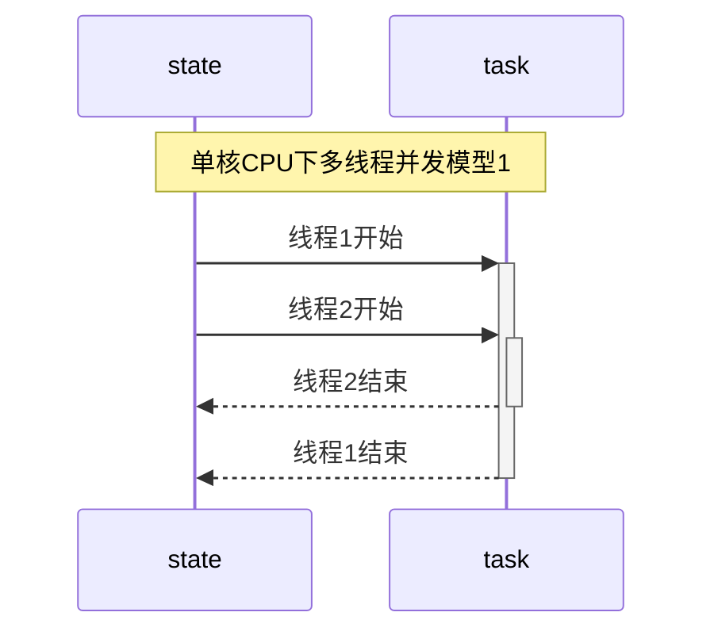

### 引言
- 在前面的学习中, 涉及最多的是进程. 进程的环境, 进程间的关系, 进程的控制等等. 不同进程之间的地址空间是隔离的, 可以通过操作系统提供的手段实现进程间的简单通讯, 也可以通过文件方式进行数据共享. 本章主要学习的是线程, 它是进程的实体. 现在操作系统的调度都是基于线程, 在1个进程中所有的线程地址空间是共享的, 这就带来了另1个问题, 若出现竞争时, 如何同步?


<br/>

### 线程的概念
- 进程出现的时间要早于线程. 典型的Unix进程可以看成只有1个控制线程: <font color=deeppink>一个进程在某一时刻只能做一件事情.</font> 也就是说进程的任务是通过分配给线程来完成的. 一个线程在某一时刻只能处理当前自己被分配的任务. 
> <font color=red>这里要强调一点, 线程和任务在时间点上是多对1[^ann-mul-cpu]的, 即多个线程可能同一时刻正在处理同1个任务, 但反过来就不行</font>. 对于单核CPU来说, 从逻辑上来说也是这样, 这种情况下, 在极短的时间内多条线程被调度去执行相同的任务



<br/>

> 如上图: 
>   1. 整个图表示1个进程下1个任务的多条线程执行
>   2. 时间的递增是以垂直方向从上往下

<br/>

> 该图呈现了最简单的多线程模型: <font color=red>图中的圆柱表示的是资源共享部分</font>. 当前对应的是 <font color=red>任务并发</font>[^ann-mul-thread1] 情景下对共享资源的访问, 这个时候若没有同步机制, 会出现资源竞争, 在逻辑上就是不正确的. 线程2的结束也可能在线程1结束之后, 这里只是简单的说明其中的1种场景

<br/>

> 若上述 <font color=red>场景变为多核CPU, 则圆柱表示的是时间点, 也表示共享资源</font>. 即在同一时刻, 不同的线程在访问同1资源, 这种情况也是竞争的一种(<font color=green>这种情况下请忽略图中线程1,2结束的部分</font>)


<br/>


### 线程特点
- 被调度的最小单位[^ann-thread-0]
- 共享进程所有资源
    - 文件描述符
    - 全局变量
    - 地址空间
- 调度开销远小于进程
- 适当的多线程技术可以大大提升CPU的执行效率
- 同步编程相对简单

> 线程的缺点: 还是存在资源抢占, 过多的线程会系统效应事倍功半

<br/>

### 线程标识
- 每1个进程都有一个ID作为标识. 和进程ID不同的是, 线程id只有在当前进程中才是唯一的. 一个进程中会存在一上表`thread-table`来管理自己所有的线程

- 标准规定的线程ID的类型是`pid_t`, 至于它内部的实现在不同的平台可能不一样, 以书籍上所说: <font color=deeppink>Linux上是一个无符号长整, Mac上是指针</font>

```cpp
#include<iostream>
#include<type_traits>

using namespace std;

int main(int args, char** argv){
    cout << "thread[" << pthread_self() << "]\n";
    cout << "size-thread:" << sizeof(pthread_t) << endl;
    cout << is_pointer<pthread_t>::value << endl;
    return 0;
}
```

<br/>

> 同样的代码运行在Mac和Linux下:

```shell
### linux中
./main
thread[281473767286192]
size-thread:8
0                               # 不是指针


### mac中:
thread[0x200281280]
size-thread:8
1                               # 是指针


### Linux中
find /usr/include -type f -name "*pthread*" | xargs -I abc grep "pthread_t;" abc
typedef unsigned long int pthread_t;


### Mac中
## 这里忽略, Mac中定义的是一个结构指针, 该结构很复杂
```

<br/>

- 因为各家实现的数据结构是不一样的, 标准规定了获取当前线程ID的接口.

```cpp
#include<pthread.h>

pthread_t pthread_self(void);

// 一定返回线程的ID
```

<br/>

- 一般情况下`pthread_self`与`pthread_equal`一起使用, 固名思意就是判断线程是不是相等

```cpp
#include<pthread.h>
int pthread_equal(pthread_t tid1, pthread_t tid2);

// 相等返回非0, 其他返回0
```

<br/>

### 创建线程

```cpp
#include<pthread.h>

int pthread_create(pthread_t* tidptr, pthread_attr_t* attr, void* (*run)(void*), void* arg);

// 成功返回0, 否则出错返回错误编号
```
> 线程是系统资源的一部分, 每个用户运行的进程可能因为限制会造成创建失败(<font color=green>当然也有其他失败的原因</font>)
>
> <br/>
>
> 需要说明的是 <font color=red>c++标准库提供的线程接口底层也是调用POSIX线程库, 在windows中则是调用Window提供的线程接口</font>, 同时该函数是库函数, 并不是系统调用. 对于返回值并不设置errno, 而是直接返回的错误码

```cpp
#include<iostream>
#include<sys/time.h>
#include<type_traits>

using namespace std;

int main(int args, char** argv){

    cout << "platform:[" << argv[1] << "]\n";
    pthread_t tid;
    if(pthread_create(&tid, nullptr, [](void* arg) -> void*{
            cout << "arg\t" << (char*)arg;
            cout << "tid[" << pthread_self() << "]\n";
            timespec st

#if defined(__clang__) && defined(__APPLE__)
            = {
                .tv_nsec = 0,
                .tv_sec = 5,
            };
            nanosleep(&st, nullptr);
#elif defined(__GNUC__) && defined(__linux__)
            = {0};
            st.tv_sec = 5;
            st.tv_nsec = 0;
            clock_nanosleep(CLOCK_REALTIME, 0, &st, nullptr);
#endif
            return nullptr;
        },const_cast<char*>("hello world\n"))){

        // 这里可以获取pthread_create的返回值当作errno
        cerr << "pthread create error\n";
        return -1;
    }

    pthread_join(tid, nullptr);

    cout << "tid dead\n";

    return 0;
}

```

<br/>

> 上述程序的流程是:
>   1. 创建线程
>   2. 阻塞等待线程
> 在子线程中主要打印对应的线程ID, 并阻塞5秒. 等待5秒后, main所在的线程才会继续执行

<br/>

```shell
### linux
./main $(uname -a | cut -d " " -f 1)
platform:[Linux]
arg	hello world
tid[281473209258432]
tid dead


### mac
./main $(uname -a | cut -d " " -f 1)
platform:[Darwin]
arg	hello world
tid[0x304fb3000]
tid dead
```

<br/>

> 关于创建线程的第2个参数`pthread_attr_t`会在后面具体的章节中详细学习. 线程创建后并不能保证新的线程先运行, 这取决于此刻内核的调度状态. 


<br/>

### 线程ID,进程ID的对比
- 线程隶属进程, 所以不同线程所对应的进程ID在实现上应该是一样的

```cpp
#include<unistd.h>
#include<sys/time.h>
#include<iostream>

using namespace std;


int main(int args, char** argv){
    cout << "main-pid[" << getpid() << "]\n";
    cout << "main-tid[" << pthread_self() << "]\n";
    cout << "main-addr[" << reinterpret_cast<void*>(main) << "]\n";


    pthread_t tid;
    auto res = pthread_create(&tid, nullptr, [](void* arg) -> void*{
        auto c = malloc(1);
        cout << "malloc-addr:[" << c << "]\n";
        cout << "child-pid[" << getpid() << "]\n" << "child-tid[" << pthread_self() << "]\n";
        return nullptr;
    }, nullptr);
    if(res){
        cerr << "pthread create: " << strerror(res) << endl;
        return -1;
    }
    
    cout << "result-tid[" << tid << "]\n";

    pthread_join(tid, nullptr);

    return 0;
}
```

<br/>

> 测试结果如下:

<br/>

```shell
./main
main-pid[30616]                         # main 所在的进程
main-tid[0x202aa9280]                   # main 所在的线程
main-addr[0x1029aa040]                  # main 函数的地址
result-tid[0x309529000]                 # 创建函数所填充的线程ID
malloc-addr:[0x600002c1c000]            # 进程中堆地址
child-pid[30616]                        # child线程所在的进程, 和main一样
child-tid[0x309529000]                  # child获取自己的线程ID
```

> 从测试可以发现, 子线程(<font color=green>child</font>)和主线程(<font color=green>main</font>)在同一个进程下. <font color=red>新创建的线程所指向的结构(`Mac`)并不在所谓的堆区, 也并未和主线程在同一区域[^ann-thread-mem]</font>.


<br/>

### 线程的终止
- 进程被终止有2类情况: <font color=deeppink>正常返回和异常终止</font>.
    1. 正常返回: 从启动流程到最后返回(`单线程中return, exit等`)
    2. 异常终止: 执行过程被异常结束(`如信号`)
    3. 关于多线程的终止, 接下的小节会详细说明
- 对应的线程的结束也分这2类情况:
    1. 正常返回: 从启动流程到最后返回(`return, pthread_exit`)
    2. 异常终止: 被其他线程直接取消(`pthread_cancel`)或被信号终止
> 需要说明的是: <font color=red>线程中若调用`exit`相关的函数后, 会直接结束整个进程. 线程结束可能并不意味着整个进程结束, 因为进程中此刻还有其他的线程在运行. 但一般情况下main函数所在的线程返回时, 即使有子进程整个进程也会结束</font>


```cpp
#include<pthread.h>
void pthread_exit(void* info_ptr);
```

<br/>

> 该函数的作用:
>   1. 手动结束当前线程
>   2. 将`info_ptr`传递给`pthread_join的第2个参数`
> 若线程是被其他线程所取消, 则`info_ptr_addr`本身会指向`PTHREAD_CANCELED`

<br/>

> <font color = red size = 5> 测试1--正常返回线程终止状态</font>

```cpp
#include<unistd.h>
#include<sys/time.h>
#include<iostream>
#include<cstdlib>
using namespace std;

int main(int args, char** argv){

    static char** tmp_argv;
    tmp_argv = argv;
    if(args < 2){
        cerr << "usage ./main <1:return 2:pthread_exit> value\n";
        return -1;
    }

    cout << "main seq[" << argv[1] << "]\n";

    pthread_t tid;
    auto res = pthread_create(&tid, nullptr, [](void* arg) -> void*{
        sleep(1);
        
        cout << "child seq[" << tmp_argv[1] << "]\n";

        if(atoi(tmp_argv[1]) == 1)
            return tmp_argv[2];

        pthread_exit(tmp_argv[2]);
    }, nullptr);

    
    if(res){
        cerr << "pthread create: " << strerror(res) << endl;
        return -1;
    }
    
    void* thread_over_parm;
    pthread_join(tid, static_cast<void**>(&thread_over_parm));
    cout << (char*)thread_over_parm << endl;

    return 0;
}
```

<br/>

> 测试如下:

```shell
for i in {1..2}; do {./main $i "$(date)--seq:$i"} done;
main seq[1]
child seq[1]
2023年 8月 9日 星期三 18时09分48秒 CST--seq:1
main seq[2]
child seq[2]
2023年 8月 9日 星期三 18时09分49秒 CST--seq:2
```

<br/>


> <font color = red size = 5> 测试2--终止进程的信号会直接终止整个进程</font>

<br/>

```cpp
#include<unistd.h>
#include<signal.h>
#include<pthread.h>
#include<iostream>


using namespace std;
int main(int args, char** argv){
    pthread_t tid;
    pthread_create(&tid, nullptr, [](void* arg) -> void*{

        int* p = nullptr;
        *p = 20;                // __code_0
        cout << "over\n";       // __code_print_0
        return nullptr;
        
    }, nullptr);

    // ignore error

       

    pthread_join(tid, nullptr);

    cout << "join over\n";      // __code_print_1
    return 0;
}
```

<br/>

> 上述程序: <font color=red>在子线程中会出现bad access(`__code_0`), 从而出现SIGSEGV信号, 导致整个进程被终止, 不管在主线程还是在子线程中, 都不会有打印出现</font>

<br/>


> <font color = red size = 5> 测试3--子线程被其他线程取消</font>

```cpp
#include<unistd.h>
#include<signal.h>
#include<pthread.h>
#include<iostream>


using namespace std;
int main(int args, char** argv){
    pthread_t tid;
    pthread_create(&tid, nullptr, [](void* arg) -> void*{
        while(1){
            cout << "ing ";       
            sleep(1);
        }
        return nullptr;
        
    }, nullptr);

    // ignore error

    sleep(2);
    pthread_cancel(tid);

    cout << "join over";
    return 0;
}
```

<br/>

> 在主线程中调用`pthread_cancel`结束子线程, 可以发现, 子线程被结束后, 并未刷新流, 最后在主线程正常返回后,标准输出的缓冲区才被冲洗(`3次打印`) 

<br/>


### `pthread_join`
```cpp
#include<pthread.h>
int pthread_join(pthread_t tid, void** info_ptr_addr);
// 成功返回0, 否则返回错误编号
```
> 该函数类似`wait`:
>   1. 若要等待的线程未结束(<font color=green>运行或睡眠等状态</font>), 则被阻塞
>   2. 若要等待的线程已经结束, 则不阻塞并直接获取到线程的返回值.
> 当调用了`pthread_join`并返回后, 线程的TCB[^ann-tcb-0]才会被回收

<br/>

```cpp
#include<unistd.h>
#include<pthread.h>
#include<sys/wait.h>
#include<iostream>

using namespace std;

int main(int args, char** argv){
    pthread_t tid;

    pthread_create(&tid, nullptr, [](void* arg)->void*{
        return const_cast<char*>("hello world");
    },nullptr);


    // ignore error 
    sleep(1);

    void* s;
    auto res = pthread_join(tid,&s);    // __code_join_1
    res ? cout << strerror(res) : (cout << res << endl, cout << reinterpret_cast<char*>(s) << endl);

    res = pthread_join(tid,&s);         // __code_join_2
    res ? cout << strerror(res) : (cout << res << endl, cout << reinterpret_cast<char*>(s) << endl);

    return 0;
}
```

<br/>

> main线程睡眠1秒后, 子线程已经结束, 此时子线程应该要被处理
> `__code_join_1`: 第1次属于正常的join, 返回为0, 并输出子线程返回的"hello world"
> `__code_join_2`: 第2次再次调用时子线程已经被清理, 此时返回错误

<br/>

```shell
./main
0
hello world         # __code_1, 打印返回码, 并打印子线程的返回值
No such process     # __code_2, 错误, 说明子线程的TCB已经被清理

# 这里出错的原因描述中是process, 并不是指进程, 而是指过程(即线程,程序)
```


### 再探进程的终止
- 前面所有的案例都是单线程环境下(`main`), 当main函数中:
    1. 主动调用`return xx`或`exit(xx)`, 整个进程会结束, 此时进程有明确的 <font color=deeppink>返回码</font>, 内核会将返回码进一步包装成 <font color=deeppink>终止码</font>
    2. 进程被异常杀死(`如信号`), 内核会将信号包装成终止码

- 若是多线程环境下, 则进程被终止的情况就很复杂了, 下面直接总结:
    1. 任何线程中调用`exit(xx)`, 整个进程都会结束. 进程有明确的返回码以及对应的终止码
    2. main函数的代码执行了`return xx`后, 不管此时有没有其他线程正在执行, 整个进程直接结束, 进程有明确的返回码以及对应的终止码
    3. 最后一个线程从启动流程返回(`return xx`).
        - 若该线程是main函数, 则进程结束的返回码为`xx`, 对应的就有终止码
        - 若该线程不是main函数, 则表示main线程已经死了, 由于子线程要返回一个指针, 标准规定, 这种情况是正常结束进程的一种, 返回码是0.
    4. 最后一个线程调用`pthread_exit`.
        - 不管该线程是不是main函数, 标准规定进程正常结束, 返回码是`0`
    5. 最后一个线程对`pthread_cancel`作出响应; 

> 上述调用`exit相关的函数, 包括 exit, _exit, _Exit`. 也就是说一个进程中可以没有主线程(`main调用pthread_exit或被其他线程pthread_cancel`), 但main一旦执行了`return xx`后, 则进程强制结束 
> 下面测试`第3, 第4, 第5`点
> <font color = red, size = 5>测试1--由子线程return</font>

<br/>

```cpp
#include<unistd.h>
#include<pthread.h>
#include<iostream>
using namespace std;

static pthread_t main_tid;

static void* child_fun(void* arg){
	cout << "child[" << pthread_self() << "]\n";
	sleep(5);                                               // __code_2
	cout << "will cancel main\n";
	pthread_cancel(main_tid);                               // __code_3
	cout << "main cancel\n";
	int a;
	while(1){
		cout << "请输入数字: ";
		cin >> a;
		if(a){
			cout << "您输入的是: " << a << endl;
			continue;
		}

		break;
	}
	return (void*)"hello world";
}


using namespace std;
int main(int args, char** argv){
	main_tid = pthread_self();
	cout << "main[" << main_tid << "]\n";

	pthread_t child;
	pthread_create(&child, nullptr, child_fun, nullptr);    // __code_0
	while(pause());                                         // __code_1

	cout << "over\n";
	return 0;
}
```

<br/>

> 上述程序的测试流程:
>   1. 创建子线程(`__code_0`)
>   2. 主线程立即阻塞(`__code_1`)
>   3. 子线程中睡眠5秒(`__code_2`), 并不一定比第2步后运行, 取决运行当前的调度情况 
>   4. 睡眠后直接结束main线程
> 这意味着main函数无法运行到`return 0`语句, main被提前结束, 只剩下子线程, 进程要想结束必须由子线程来决定. <font color=red>测试点要在`__code_2`前以及`__code_3`后查看当前进程中线程的状态</font>, 本程序在Linux中运行, 测试结果如下:

<br/>

```shell
liubo-linux% ./main
main[281473796030176]
child[281473791234496]                      # 此时在另一会话终端中查看状态
will cancel main
main cancel
请输入数字:                                 # 此时继续查看所有线程状态


## 另一终端

### 睡眠前查看所有线程
liubo-linux% ps -T -p $(ps -o pid,comm -u liubo | grep main | cut -d " " -f 3)
    PID    SPID TTY          TIME CMD
  34480   34480 pts/0    00:00:00 main      # 主线程
  34480   34481 pts/0    00:00:00 main      # 子线程


### 结束main线程后, 再次查看
liubo-linux% ps -T -p $(ps -o pid,comm -u liubo | grep main | cut -d " " -f 3)
    PID    SPID TTY          TIME CMD
  34480   34480 pts/0    00:00:00 main <defunct>    # main线程已经挂掉
  34480   34481 pts/0    00:00:00 main
liubo-linux%


### shell的命令是 获取当前 liubo用户下的main进程, 切割找出进程的id, 通过 ps -T -p pid查看该进程下的进程
```

<br/>

> 下面是gif图展示的测试过程, 重新运行的, 对应的id和上述测试是不一样的. 可以在测试5秒后输入0, 打印`echo $?`为0, 表示进程是正常结束的

---


<br/>


> <font color = red, size = 5>测试2--由子线程`pthread_exit`</font>方案和1差不多. 这里直接测试`pthread_cancel`的返回码及终止码

<br/>


```cpp
#include <sys/wait.h>
#include<unistd.h>
#include<signal.h>
#include<pthread.h>
#include<iostream>
#include<vector>
#include<string>

int main(int args, char** argv){
    
    if(args != (2 + SIGUSR2)){                      // __code_0
        std::cerr << "usage ./main <signal>[\"信号杀死\"] or <\"thread cancel\">[\"线程被取消\"] signal-list\n";
        return 0;
    }


    auto child = fork();
    // ignore error


    // main
    if(child){
        // 因为标准信号是从1开始, 但数组是从1开始, 所以这里预先占位第0个
        static std::vector<std::string> signals = {"zero"};
        
        argv += 2;
        while(*argv){
            signals.push_back(*argv);               // __code_1
            ++argv;
        }

        struct sigaction st;
        st.sa_flags = SA_SIGINFO;
        sigemptyset(&st.sa_mask);
    
        // 注册 CHLD信号
        st.sa_sigaction = [](int signo, siginfo_t* info, void* other){

            std::cout << "signal handle:\n";

            psignal(signo, "receive signal sys-descrip");   // __code_2
            std::cout << "receive signal name: " << signals[signo] << std::endl;    // __code_3
            
            int sta;
            waitpid(info->si_pid, &sta, 0);                 // __code_4

            if(WIFEXITED(sta)){
                std::cerr << "\tnormal exit code:[" << WEXITSTATUS(sta) << "]\n";   // __code_5
                return;
            }

            if(WIFSIGNALED(sta)){
                auto reason = WTERMSIG(sta);                // __code_6
                std::cerr << "\texcept exit reason-signal[" << reason << "]\n";     // __code_7
                psignal(reason, "\treason-signal sys-descrip");                     // __code_8
                std::cerr << "\treason-signal name: " << signals[reason] << "\n";   // __code_9
                return;
            }

        };
        sigaction(SIGCHLD,&st, nullptr);
        
        pause();
        std::cout << "\nprocess over\n";

        return 0;
    }

    // child
    sleep(1);


    // __code_inline_lib
    bool over_with_signal = __builtin_strncmp("signal", argv[1], std::min(__builtin_strlen("signal"), __builtin_strlen(argv[1]))) == 0;
    bool over_with_thread_cancel = __builtin_strncmp("thread cancel", argv[1], std::min(__builtin_strlen("signal"), __builtin_strlen(argv[1]))) == 0;

    // child kill self
    if(over_with_thread_cancel){
        std::cout << "will cancel thread\n";
        pthread_cancel(pthread_self());     
    }else if(over_with_signal){
        std::cout << "will send SIGTERM\n";
        kill(getpid(), SIGTERM);
    }

    return 0;
}
```

<br/>

> 上述程序的目的: <font color=red>测试信号异常结束程序 以及 `pthread_cancel`所结束的进程是不是正常结束</font>. 测试步骤:
>   1. 用户调用格式`./main signal <31个信号名的字符串> 或 ./main "thread cancel" <31个信号名的字符串>`
>   2. main函数直接`fork`
>   3. 产生的子进程(`child`), 根据命令行第1个参数来决定怎么结束自己这个进程
>   4. main进程中捕捉`SIGCHLD`信号, 并判断子进程(`child`)是不是正常结束的
> main进程的流程:
>   1. `__code_1`: 为了测试方便, 将命令行传递来的所有信号存储到数组中
>   2. `__code_2,__code_3`: 捕捉到信号后, 先打印一下信号相关的信息
>   3. `__code_4`: 处理子进程的终止状态(`避免产生僵死进程`), 这一步不会阻塞, 因为当前有子进程被等待处理
>   4. `__code_5`: 若正常结束, 则打印子进程的退出码(`注意是退出码, 类似于exit(xx)的参数xx`)
>   5. `__code_6`: 若异常结束, 则打印子进程结束的原因, 以及被什么信号所结束的(`__code_7, __code_8, __code_9`)
> 
> <br/>
>
> 需要说明的是`__code_line_lib`: <font color=red>这些`__builtin_xx`是编译器内部的内联库函数, 不用导入库函数, 功能和对应的库函数一样, 当前是在clang环境下, Mac系统中</font>, 下面是shell测试的过程, <font color=red>内部用到了zsh的脚本语法</font>

```shell
arr=("signal", "thread cancel")         # 定义数组


# 取出arr的内容, 并同步调用 main程序, 传递相关的参数
## kill -l | xargs 是将 所有的31个标准Unix信号封装成命令行参数
for i in $arr; do {echo $i; ./main $i $(kill -l | xargs); echo "\n"} done;
signal                                          # signal方式结束子进程(异常结束)
will send SIGTERM
signal handle:
receive signal sys-descrip: Child exited
receive signal name: CHLD
	except exit reason-signal[15]               # 可以发现子进程是被15号信号(TERM), 所结束
	reason-signal sys-descrip: Terminated
	reason-signal name: TERM                    # sigaction中的siginfo_t* info中的 si_signo并不是异常的原因, 而是SIGCHLD信号, 这里不说了

process over


thread cancel                                   # 以 pthread_cancel结束当前进程中的唯一线程, 即会造成整个进程的结束
will cancel thread                  
signal handle:
receive signal sys-descrip: Child exited        
receive signal name: CHLD
	normal exit code:[0]                        # 发现是正常结束

process over
```


### `pthread_cancel`
- 该函数是结束当前线程, 但并不是立即结束: <font color=deeppink>因为这样当前线程可能正在操作全局的结构, 所以若是立即结束则可能造成</font>:
    - 全局的数据结结构可能被破坏(`如malloc等`), 类似于可重入
    - 可能造成死锁(`如当前线程已经在同步区加锁, 还未来得及解开锁就被结束了`)

<br/>

> <font color = red, size = 5>测试1--延迟结束</font>

```cpp
#include<unistd.h>
#include<pthread.h>
#include<sys/wait.h>
#include<iostream>

using namespace std;

int main(int args, char** argv){
    if(args != 2){
        cerr << "usage ./main <cancel type>[0:nothing 1:yield 2:sleep(5)]\n";
        return -1;
    }
    pthread_cancel(pthread_self());

    switch(atoi(argv[1])){
        case 1:
            cout << "yield\n";
            pthread_yield_np();
            break;
        case 2: 
            cout << "sleep\n";
            sleep(5);
            break;
        default:
            cout << "nothing\n";
            break;
    }
    cout << "cancel \n";
    return 0;
}
```

<br/>

> 上述程序分别测试3种情况下调用`pthread_cancel`后会不会打印内容
```shell
### 调用后, 不做任何特殊处理
./main 0
nothing
cancel


### 调用后, 直接放弃当前的cpu
./main 1
yield
cancel


### 调用后, 直接睡眠5秒
./main 2
sleep               # 无法睡眠到5秒
```

<br/>

> 基本可以得出以下结论:
>   1. 该函数结束线程的时间点, 并不是在线程的下一次调度: <font color=red>因为当指定yield时, 再被调度时, 仍然会执行打印</font>
>   2. 睡眠时会查看是不是已经标记取消了: <font color=red>因为sleep不能睡眠到5秒</font>
> 这里yield是立即放弃当前CPU, 本身不会被信号中断, 也就是说调用该函数的过程中就会放弃, 并不是延迟放弃CPU

<br/>


> <font color = red, size = 5>测试2---死锁</font>

<br/>


```cpp
#include<unistd.h>
#include<pthread.h>
#include<sys/wait.h>
#include<iostream>

using namespace std;

static const char* tmp_file = "./a.txt";
static pthread_mutex_t m_lock;

int main(int args, char** argv){

    pthread_mutex_init(&m_lock, nullptr);

    pthread_t tid;
    pthread_create(&tid, nullptr, [](void* arg)->void*{
        cout << "child\n";
        pthread_mutex_lock(&m_lock);        // __code_child_lock
        pthread_cancel(pthread_self());     // __code_0
        sleep(5);                           // __code_1
        cout << "sleep over\n";             // __code_2
        pthread_mutex_unlock(&m_lock);      // __code_child_unlock

        return nullptr;
    },nullptr);


    int a;
    cin >> a;                           // __code_block
    cout << "a: " << a << endl;         // __code_input


    auto file = fopen(tmp_file, "r+");
    pthread_mutex_lock(&m_lock);        // __code_main_lock
    fwrite("hello", 5, 1, file);        // __code_3
    pthread_mutex_unlock(&m_lock);      // __code_main_unlock
    return 0;
}
```

<br/>

> 上述程序的流程是: 主线程会阻塞, 原因是需要子线程要确保先运行到`__code_0`结束自己.
>   1. `__code_block`导致主线程被阻塞
>   2. `__code_child_lock`: 主线程阻塞期间, 子线程先上锁
>   3. `__code_0`: 子进程调用`pthread_cancel`申请结束自己
>   4. `__code_1`: 因为调用cancel后并不是立即执行, 所以直接睡眠导致当前子线程结束
>   5. 子线程无法执行到`__code_2`, 所以子线程挂掉以后, 锁是不会释放的
>   6. 向终端输入内容结束阻塞`__code_input`
>   7. 主线程尝试拿到锁(`__code_3`), 但此时锁并未由子线程释放, 所以主线程会一直卡在这里形成死锁


<br/>

> 同样的原理, 当一个线程被cancel后, 由于延迟的机制, 若正在调用不可重入函数(`如大部分的库函数`), 都可能造成全局的数据结构被破坏.> 具体cancel后, 线程结束的代码点后面在详细学习

<br/>


### `PTHREAD_CANCELED`
- 该标识是一个 <font color=deeppink>macro</font>(`宏`), 当线程被`pthread_cancel`后, 若后续清理该线程(`pthread_join`), 则被回填的参数就是`PTHREAD_CANCELED`

```cpp
#include<unistd.h>
#include<pthread.h>
#include<sys/wait.h>
#include<iostream>

using namespace std;


int main(int args, char** argv){
    pthread_t tid;

    cout << "PTHERAD_CANCELED: " << PTHREAD_CANCELED << endl;

    pthread_create(&tid, nullptr, [](void* arg)->void*{
        pthread_cancel(pthread_self());
        sleep(1);
        cout << "never\n";
        return nullptr;
    },nullptr);

    // ignore error 
    sleep(2);

    cout << "wake up\n";
    
    void* value;
    pthread_join(tid, &value);

    cout << "value [ " << (reinterpret_cast<decltype(PTHREAD_CANCELED)>(value) == PTHREAD_CANCELED ? "==" : "!=") << " ] PTHREAD_CANCELED\n";
   
    return 0;
}
```

<br/>

> 上述程序是子线程使用cancel结束自己, 然后在main线程中清理(`pthread_join`), 发现获取到的value值是`PTHREAD_CANCEL`

<br/>

```shell
./main
PTHERAD_CANCELED: 0x1
wake up
value [ == ] PTHREAD_CANCELED
```

<br/>

### 线程退出清理
- 如同进程中的`atexit`一样, 线程也有相同的处理机制. 相关的函数如下:

```cpp
void pthread_cleanup_push(void(*fun)(void*), void* arg);

void pthread_cleanup_pop(int exec);
```
> 需要说明的是这2个函数是配套的, 并不像atexit只有一个单独的函数. 它们只是POSIX规定的接口, 实际上不同的系统实现不一样. 在Mac和Linux(<font color = green>这里平台是Ubuntu,其他发版本未看</font>)上都是使用宏实现的, 只不过Mac的宏实现并未像Linux上实现的那样炫酷,接下来会对比两家代码作赏析
> pop时所传递的参数为`0或1`, 只有指定1时, 注册的函数才会被调用

<br/>

> <font color=red, size = 5>测试1--简单使用</font>

```cpp
#include<unistd.h>
#include<pthread.h>
#include<iostream>

using namespace std;


int main(int args, char** argv){
    auto cbk = [](void* arg) -> void{
        cout << reinterpret_cast<char*>(arg) << endl;
    };
    pthread_cleanup_push(cbk, const_cast<char*>("func1"));
    pthread_cleanup_push(cbk, const_cast<char*>("func2"));
    pthread_cleanup_push(cbk, const_cast<char*>("func3"));

    cout << "working\n";

    pthread_cleanup_pop(1);
    pthread_cleanup_pop(0);
    pthread_cleanup_pop(1);


    return 0;
}
```

<br/>

> 上述程序在main线程开始时, 注册了3次函数, 每次传递的参数不一样
> 最后在结束前以栈的方式将函数取出来, 但`func2`的这1次却并不调用

<br/>

```shell
./main
working
func3
func1
```

<br/> 同样的测试, 在Linux上效果是一样的, 这里不再单独再写一遍

> <font color=red, size = 5>该配套函数在2家平台实现的代码赏析</font>. 
> 为了测试方便, 这里只作一层注册

<br/>

```cpp
#include<unistd.h>
#include<pthread.h>
#include<iostream>

using namespace std;

int main(int args, char** argv){
    auto cbk = [](void* arg) -> void{
        cout << reinterpret_cast<char*>(arg) << endl;
    };
    pthread_cleanup_push(cbk, const_cast<char*>("call back"));

    cout << "working\n";

    pthread_cleanup_pop(1);

    return 0;
}
```

<br/>

- 以上面的代码为例, 首先在Mac上:
> 因为这2个像函数的接口实际上是由宏实现, 所以直接利用编译器预编译一下, 然后查看对应的CPP代码(`当前用c++编写, 编译器为clang++`)

<br/>

```shell
# 调用 -E 选项, 指定源代码文件先将预编译指令展开(如 include, define)等
## 输出 main.e文件中代码还是cpp代码, 只不过所有的宏被展开
clang++ -E main.cpp -o main.e
```

<br/>

> 查看 main.e, 这里因为main.cpp编译完文件比较宠大, 所以直接将 main函数部分展示在文档中

```cpp
int main(int args, char** argv){
    auto cbk = [](void* arg) -> void{
        cout << reinterpret_cast<char*>(arg) << endl;
    };

    {                                                           // __code_start
        struct __darwin_pthread_handler_rec __handler;          // __code_0     
        pthread_t __self = pthread_self();                      // __code_1
        __handler.__routine = cbk;                              // __code_2
        __handler.__arg = const_cast<char*>("call back");       // __code_3
        __handler.__next = __self->__cleanup_stack;             // __code_4
        __self->__cleanup_stack = &__handler;;                  // __code_5

        cout << "working\n";                                    // __code_6

        __self->__cleanup_stack = __handler.__next;             // __code_7
        if (1)(__handler.__routine)(__handler.__arg);           // __code_8
    };                                                          // __code_end

    return 0;
}

/**
    Mac上实现简单易懂
        0. 首先:
            __code_start 到 __code_5    为  pthread_cleanup_push 整个宏定义
            __code_7     到 __code_end  为  pthread_cleanup_end  整个宏定义
        

        1. __code_0 定义局部变量 __handler
        2. __code_2 记录用户注册的函数cbk
        3. __code_3 记录用户cbk所需要的参数
        4. __code_4 形成链表, 指向下一个 __handler类型
            这里说明一点, 每1个线程都有TCB描述, 这个TCB对于
            线程来说是全局的, 通过 pthread_self可以找到线程的TCB
            再通过TCB中的__cleanup_stack存储用户指定的函数cbk
            该结构是链表实现的栈
        5. __code_5 将TCB中__cleanup_stack的栈顶指向最新的 __handler

        6. __code_6 线程工作的代码

        7. __coed_7 线程要结束前, 将栈顶指针指向下一个函数
        8. __code_8 根据用户调用 pthread_cleanup_pop(xx)中的xx来决定要不要调用该栈顶函数(__handler)
        9. __code_9 pthread_cleanup_pop的宏定义结束 


    总结:
        Mac上使用宏来实现POSIX规定的接口, 该函数必须成对出现, 否则编译不通过, 因为:
            pthread_cleanup_push 最开始有  {
            而右                           }
            被定义在pthread_cleanup_pop中, 所以会在编译期就强制用户必须写完整
        
        这样的目的是在同一区域中使用统一的代码实现栈操作, 若没有 {}, 则上述局部变量
        会因为名字不能重名的问题变得难以实现

        若是嵌套使用, 原理是一样的, 会通过 {}, 将作用域分开, 每个作用域结束后就会
        决定要不要调用用户的函数
*/
```

<br/>

- 其次在Linux中, 同样的测试流程, 先以`g++ -E main.cpp -o main.e`编译

<br/>

```cpp
int main(int args, char** argv){
    auto cbk = [](void* arg) -> void{
        cout << reinterpret_cast<char*>(arg) << endl;
    };

    do{                                                                         // __code_0
        __pthread_cleanup_class __clframe(cbk,const_cast<char*>("call back"));  // __code_1
        cout << "working\n";                                                    // __code_2
        __clframe.__setdoit(1);                                                 // __code_3
    } while (0);                                                                // __code_4
    return 0;
}

/**
    上述代码是linux内核中最喜欢用的 do{...}while(0)
    至于这样写的好处这里不多说了
    
    首先:
        __coed_0 到 __code_1 为 pthread_cleanup_push 的宏定义
        __code_3 到 __code_4 为 pthread_cleanup_pop  的宏定义
    
    其次就有1个有趣的现象:
        没有出现类似Mac上TCB相关的链表连接操作(Mac中的__code_1 到 __code_5)

    现在虽然没有看到Linux中源码实现, 但通过c++语法也可推断出:
        1. __pthread_cleanup_class是C++中的类
        2. cbk函数和参数"call back"被直接构造成了 局部变量 __clframe中
            所以在构造函数中会作类似Mac中的链表连接操作
        3. 利用c++的析构, 出了作用域(__code_4)后, 编译器会调用 __clframe析构
            在该析构函数中肯定会 cbk("call back")
        4. 内核的pthread.h被C++标准库覆盖, 所以才会定义出C++下的 pthread_cleanup_push
    
        5. 因为pthread.h由内核定义, 所以一定有 C环境下的 pthread_cleanup_push定义


    现在先来找到 C++下, __pthread_cleanup_class的定义, 代码如下:    
*/

class __pthread_cleanup_class{
  void (*__cancel_routine) (void *);
  void *__cancel_arg;
  int __do_it;
  int __cancel_type;

 public:

    // __code_ctor
  __pthread_cleanup_class (void (*__fct) (void *), void *__arg)
    : __cancel_routine (__fct), __cancel_arg (__arg), __do_it (1) { }


    // __code_dctor
  ~__pthread_cleanup_class () { if (__do_it) __cancel_routine (__cancel_arg); }

    // __code_set_flag
  void __setdoit (int __newval) { __do_it = __newval; }

  void __defer () { pthread_setcanceltype (PTHREAD_CANCEL_DEFERRED,
                                           &__cancel_type); }
  void __restore () const { pthread_setcanceltype (__cancel_type, 0); }
};

/**
    很明显在构造函数(__code_ctor)中, 用户传递的ckb和"call back"会被记录下来

    在析构函数(__code_dctor)中, 会根据标识 __do_it来决定要不要调用 cbk

    用户设置标识 pthread_cleanup_pop(1), 对应的是 __code_3

    总结:
        和Mac不同的是, Linux下的编译器g++对pthread.h重新做了声明, 分为C++环境和C环境
        C++环境下, 利用类的构造和析构实现了相同的功能
        但未涉及到将用户的函数关联到TCB中. Mac因为不区分C环境及C++环境
        他的做法是必须的, 必须将函数链入到全局的结构中, 因为上下文环境
        必须从一个全局的结构中获取到,所以Mac选择了TCB.
        
        同样的, 若Linux是在C环境下, 他在实现时在逻辑上也必须将
        用户注册的函数链入到某个全局结构中.
        但事实上Linux并未这样做:
            1. 若是标准C, linux采用了sigsetjmp方式配合 pthread_register_cancel来实现Mac一样的效果
            2. 若是扩展C(-D__EXCEPTIONS)下, 
                他采用了编译器特性, 形成了如同C++类一样的效果, 这就是Linux精巧的地方
                同样的对比Mac, 并不是说Mac做的不好, Mac实现的是标准C, 而
                Linux用了编译器特性不属于标准C, 所以它在编译时要指定对应的gnuc选项

    下面看一下标准C环境下Linux的编译代码
*/
```

<br/>

> C语言代码
```c
#include<unistd.h>
#include<pthread.h>
#include<stdio.h>

static  void cbk(void* arg){
	puts((char*)arg);
}

int main(int args, char** argv){
    pthread_cleanup_push(cbk, (void*)"call back");
    puts("working");
    pthread_cleanup_pop(1);
    return 0;
}
```

<br/>

> 编译`main.c`

<br/>

```shell
gcc -pthread -E main.c -o main.e
```

<br/>


> 同样的道理, 截取主要部分的代码

<br/>

```c
static void cbk(void* arg){
    puts((char*)arg);
}

int main(int args, char** argv){

   do { 
       __pthread_unwind_buf_t __cancel_buf;             // __code_0

       void (*__cancel_routine) (void *) = cbk;         // __code_1

       void *__cancel_arg = (void*)"call back";         // __code_2

       int __not_first_call = __sigsetjmp(__cancel_buf.__cancel_jmp_buf, 0);    // __code_3

       if (__builtin_expect((__not_first_call), 0)) {   // __code_4
           __cancel_routine (__cancel_arg);             // __code_5
           __pthread_unwind_next (&__cancel_buf);       // __code_6
        } 

        __pthread_register_cancel (&__cancel_buf);      // __code_7

                                                        // __code_working_start
        do {
            puts("working");

            do { } while (0); 

       } while (0);                                     // __code_working_end

       __pthread_unregister_cancel(&__cancel_buf);      // __code__7

       if (1)__cancel_routine (__cancel_arg);           // __code_8
    } while (0);                                        // __code_9
    return 0;
}


/**
        linux(Ubuntu)中 也和Mac做了一样的事情!! 那所谓的技巧在哪里?
        先来看当前实现:
            0. __code_0 定义局部变量
            1. __code_1 记录cbk函数
            2. __code_2 记录参数"call back"
            3. __code_3 这一步的作用比较巧妙
                这里就不同于Mac的做法, Mac是在当前线程中借用TCB
                用链表将用户注册的函数链入到链表

                而Linux采用 sigsetjmp方式将当前的栈桢记录到局部变量中
                当前栈桢内部会有用户注册的函数和参数信息, 所以
                不用借用全局的TCB, 虽然是局部变量, 但这里是合适的
                因为局部变量所记录的栈桢信息在main函数结束前都是存在的

            4. __code_4 对应__code_3
                __builtin_expect(__note_first_call, 0)利用了编译器(gcc)特性, 一种优化
                告诉编译器__not_first_call 为0的概率很高, 即 sigsetjmp返回为0的概率很高
                所以结合if时,就表示 if(__not_first_call), 但__not_first_call为0的概率高
                所以整个if就会直接跳过不执行
                
                linux这样做的原因是:
                    在该场景下, 根本没有地方调用siglongjmp:
                        __pthread_register_cancel内部不会出现siglongjmp, 否则会死循环
                        __pthread_unregister_cancel内部同理也不会出现siglongjmp
                    但中间用户的代码可能出现
                        __code_working_start 到 __code_working_end
                    出现的概率也是很小的, 因为用户正常编写代码时, 不会联想到
                    还有一个局部变量 __cancel_buf.__cancel_jmp_buf
                    所以一方面保证sigsetjmp的语义, linux还是给出了if不为0的情况
                    另一方面若出现这种情况则也会出现死循环. 所以这所有的一切都是必要的

            5. __code_7 如同Mac一样, pthread_register_cancel内部会做链入处理
            
            6. 用户代码 __code_working_start, __code_working_end

            7. 删除栈桢信息, pthread_unregister_cancel内部会如同Mac一样
                将指针指向下一个用户最后注册的函数


    总结: Linux的标准C下的实现看起来稍微复杂了一点, 但本质和Mac一样, 接下来看
            Linux下的扩展C
*/
```
<br/>

> 编译`gcc -E -D__EXCEPTIONS main.c -o main.e`, 并查看相关的代码

```c
static void cbk(void* arg){
    puts((char*)arg);
}

int main(int args, char** argv){

   do { 
       // 定义结构体,记录用户的函数信息
       struct __pthread_cleanup_frame __clframe __attribute__ ((__cleanup__ (__pthread_cleanup_routine))) = { 
           .__cancel_routine = (cbk), 
           .__cancel_arg = ((void*)"call back"), 
           .__do_it = 1 
        };

        puts("working");

        __clframe.__do_it = (1); 
    } while (0);
    return 0;
}

/**
    这里用了gcc的扩展 __attribute__((__cleanup__(__pthread_cleanup_routine)))
    它用来在C环境下修饰变量, 当变量的出了所在的作用域时
    会调用 指定的__pthread_cleanup_routine(&变量地址)函数, 将变量的地址传递过去
    类似于c++下的析构函数, 所以可以肯定的是 在__pthread_cleanup_routine中
    一定有 cbk的调用, 下面是它的实现
*/
__extern_inline void
__pthread_cleanup_routine (struct __pthread_cleanup_frame *__frame){
  if (__frame->__do_it)
    __frame->__cancel_routine (__frame->__cancel_arg);
}

/**
    这种方式原理上和开始的c++一样, 不用特意记录信息, 比较简单
*/
```


### `pthread_cleanup_xx`并不是严格的线程析构
- 这里所说的 <font color=deeppink>线程析构</font>是作者自己定义的, 用来 <font color=deeppink>类比atexit</font>, 通过上面的学习, `pthread_cleanup_xx`被调用并不是线程在结束时被回调, 而是用户指定

> 如下面的代码, 用户指定的cbk会在 <font color=red>打印working</font>前被调用, 却不是在线程执行完所有的代码后被调用

```cpp
#include<unistd.h>
#include<pthread.h>
#include<iostream>

using namespace std;

int main(int args, char** argv){
    auto cbk = [](void* arg) -> void{
        cout << reinterpret_cast<char*>(arg) << endl;
    };
    pthread_cleanup_push(cbk, const_cast<char*>("call back"));

    pthread_cleanup_pop(1);

    cout << "working\n";

    return 0;
}
```

<br/>


[^ann-mul-thread1]: 并发意味着任务在某一时刻只能被一条线程执行. 并行意味着多核CPU下任务在同1时刻下被多条线程同时执行

[^ann-mul-cpu]: 多核CPU

[^ann-thread-0]: 之前提到过线程库是自己实现调度算法, 因为它的TCB内核看不到. 对于如今的标准来说, POSIX线程接口已经被实现到了内核中, 所以虽然是库函数, 但事实上它的TCB由内核控制, 所以调度单位就是线程

[^ann-thread-mem]: 线程由内核创建, 可能内核并不会调用malloc库函数, 而是直接调用相关的系统调用函数(`sbrk`). 

[^ann-tcb-0]: `thread control block`线程控制块, 用来描述线程状态的数据结构. 对应的也有进程控制块(`pcb process control block`), 每个进程会有`tcb-table`的逻辑表, 用来记录当前进程中所有线程. tcb可由内核维护, 也可由用户所编写的线程库函数维护. 如今pthread的已由内核实现. 当调用`pthread_detach`后, 线程会分离不阻塞, 分离线程结束后, 自动被回收(`tcb被销毁`). 若对一个线程不做`pthread_join或pthread_detach`, 则线程的tcb不会被回收


