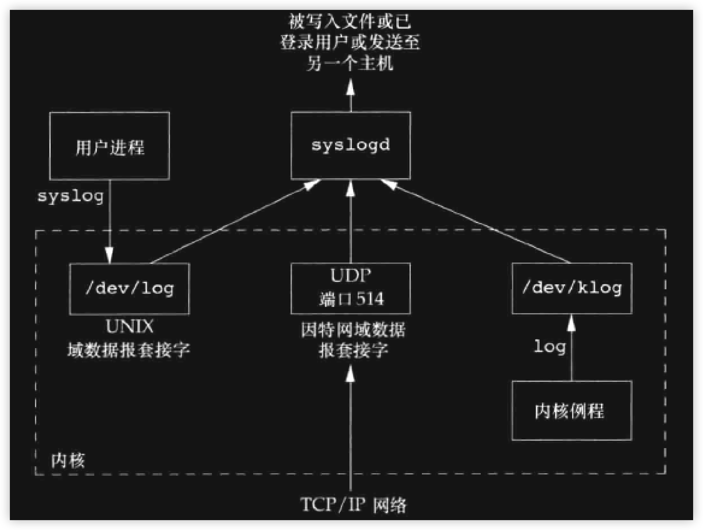
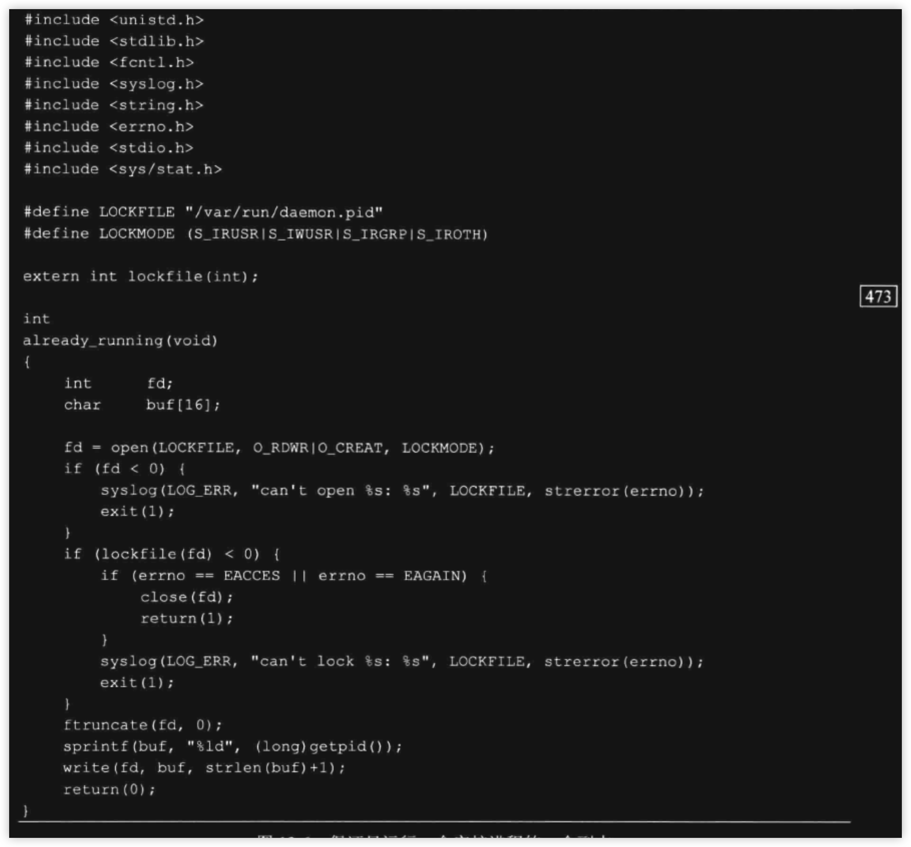

### 引言
- 守护进程(`daemon`)是生存期长的一种进程. 常常在系统引导装入时启动. 在系统关闭时才终止. 它们没有控制终端, 所以说是在后台运行的. 守护进程分为系统守护进程和用户守护进程. 系统守护进程的周期基本和OS一样, 用来执行日常的事务.

- 本章将说明守护进程的结构,以及如何编写守护进程程序. 因为守护进程没有控制终端, 所以要在出现问题时, 将错误报告到系统中指定的位置


<br/>


### 守护进程的特征
- 通过`ps`选项可以查看当前系统中的各进程状态. 下面的打印是在`Linux`中

```shell
ps -axj
PPID     PID    PGID     SID TTY        TPGID STAT   UID   TIME COMMAND
  0       1       1       1 ?             -1 Ss       0   0:04 /sbin/init splash
  0       2       0       0 ?             -1 S        0   0:00 [kthreadd]
  2       3       0       0 ?             -1 I<       0   0:00 [rcu_gp]
  2       4       0       0 ?             -1 I<       0   0:00 [rcu_par_gp]
  2       5       0       0 ?             -1 I<       0   0:00 [slub_flushwq]
  2       6       0       0 ?             -1 I<       0   0:00 [netns]
  2       8       0       0 ?             -1 I<       0   0:00 [kworker/0:0H-events_highpri]
  2      10       0       0 ?             -1 I<       0   0:00 [mm_percpu_wq]
  2      11       0       0 ?             -1 S        0   0:00 [rcu_tasks_rude_]
  2      12       0       0 ?             -1 S        0   0:00 [rcu_tasks_trace]
  2      13       0       0 ?             -1 S        0   0:00 [ksoftirqd/0]
  2      14       0       0 ?             -1 I        0   0:00 [rcu_sched]
  2      15       0       0 ?             -1 S        0   0:00 [migration/0]
  2      16       0       0 ?             -1 S        0   0:00 [idle_inject/0]
  2      18       0       0 ?             -1 S        0   0:00 [cpuhp/0]
  2      19       0       0 ?             -1 S        0   0:00 [cpuhp/1]
  2      20       0       0 ?             -1 S        0   0:00 [idle_inject/1]
  2      21       0       0 ?             -1 S        0   0:00 [migration/1]
  2      22       0       0 ?             -1 S        0   0:00 [ksoftirqd/1]
  2      24       0       0 ?             -1 I<       0   0:00 [kworker/1:0H-events_highpri]
  2      25       0       0 ?             -1 S        0   0:00 [kdevtmpfs]
  2      26       0       0 ?             -1 I<       0   0:00 [inet_frag_wq]
  2      28       0       0 ?             -1 S        0   0:00 [kauditd]
  2      29       0       0 ?             -1 S        0   0:00 [khungtaskd]
  2      30       0       0 ?             -1 S        0   0:00 [oom_reaper]
  2      31       0       0 ?             -1 I<       0   0:00 [writeback]
  2      32       0       0 ?             -1 S        0   0:01 [kcompactd0]
  2      33       0       0 ?             -1 SN       0   0:00 [ksmd]
  2      34       0       0 ?             -1 SN       0   0:00 [khugepaged]
  2      80       0       0 ?             -1 I<       0   0:00 [kintegrityd]
  2      81       0       0 ?             -1 I<       0   0:00 [kblockd]
  2      82       0       0 ?             -1 I<       0   0:00 [blkcg_punt_bio]
  2      83       0       0 ?             -1 I<       0   0:00 [tpm_dev_wq]
  2      84       0       0 ?             -1 I<       0   0:00 [ata_sff]
  2      85       0       0 ?             -1 I<       0   0:00 [md]
  2      86       0       0 ?             -1 I<       0   0:00 [edac-poller]
  2      87       0       0 ?             -1 I<       0   0:00 [devfreq_wq]
  2      88       0       0 ?             -1 S        0   0:00 [watchdogd]
  2      90       0       0 ?             -1 I<       0   0:00 [kworker/0:1H-kblockd]
  2      91       0       0 ?             -1 S        0   0:00 [kswapd0]
  2      92       0       0 ?             -1 S        0   0:00 [ecryptfs-kthrea]
  2      94       0       0 ?             -1 I<       0   0:00 [kthrotld]
  2     129       0       0 ?             -1 I<       0   0:00 [mld]
  2     130       0       0 ?             -1 I<       0   0:00 [ipv6_addrconf]
  2     139       0       0 ?             -1 I<       0   0:00 [kstrp]
  2     142       0       0 ?             -1 I<       0   0:00 [zswap-shrink]
  2     143       0       0 ?             -1 I<       0   0:00 [kworker/u5:0]
  2     150       0       0 ?             -1 I<       0   0:00 [charger_manager]
  2     173       0       0 ?             -1 I<       0   0:00 [kworker/1:1H-kblockd]
  2     196       0       0 ?             -1 I<       0   0:00 [nvme-wq]
  2     197       0       0 ?             -1 I<       0   0:00 [nvme-reset-wq]
  2     198       0       0 ?             -1 I<       0   0:00 [nvme-delete-wq]
  2     311       0       0 ?             -1 S        0   0:00 [jbd2/nvme0n1p2-]
  2     312       0       0 ?             -1 I<       0   0:00 [ext4-rsv-conver]
  1     351     351     351 ?             -1 S<s      0   0:00 /lib/systemd/systemd-journald
  1     382     382     382 ?             -1 Ss       0   0:00 /lib/systemd/systemd-udevd
  2     423       0       0 ?             -1 I        0   0:03 [kworker/1:4-events]
  2     435       0       0 ?             -1 I<       0   0:00 [ttm_swap]
  2     436       0       0 ?             -1 S        0   0:00 [irq/47-vmwgfx]
  1     668     668     668 ?             -1 Ss     101   0:00 /lib/systemd/systemd-resolved
  1     669     669     669 ?             -1 Ssl    102   0:00 /lib/systemd/systemd-timesyncd
  1     702     702     702 ?             -1 Ssl      0   0:00 /usr/lib/accountsservice/accounts-daemon
  1     705     705     705 ?             -1 Ss     115   0:02 avahi-daemon: running [liubo-linux.local]
  1     706     706     706 ?             -1 Ss       0   0:00 /usr/sbin/cron -f
  1     709     709     709 ?             -1 Ssl      0   0:01 /usr/sbin/NetworkManager --no-daemon
  1     724     724     724 ?             -1 Ssl    104   0:00 /usr/sbin/rsyslogd -n -iNONE
  1     728     728     728 ?             -1 Ssl      0   0:01 /usr/lib/snapd/snapd
  1     730     730     730 ?             -1 Ss       0   0:00 /lib/systemd/systemd-logind
  1     732     732     732 ?             -1 Ss       0   0:00 /sbin/wpa_supplicant -u -s -O /run/wpa_supplicant
705     736     705     705 ?             -1 S      115   0:00 avahi-daemon: chroot helper
  1     830     830     830 ?             -1 Ss     126   0:00 /lib/systemd/systemd --user
830     848     848     848 ?             -1 SNsl   126   0:00 /usr/libexec/tracker-miner-fs
  1     852     852     852 ?             -1 SNsl   111   0:00 /usr/libexec/rtkit-daemon
849     860     849     849 tty1         849 S+     126   0:00 dbus-run-session -- gnome-session --autostart /usr/share/gdm/greeter/autostart
860     861     849     849 tty1         849 S+     126   0:00 dbus-daemon --nofork --print-address 4 --session
830     865     865     865 ?             -1 Ssl    126   0:00 /usr/libexec/gvfsd
860     866     849     849 tty1         849 Sl+    126   0:00 /usr/libexec/gnome-session-binary --systemd --autostart /usr/share/gdm/greeter/autostart
  1     888     888     888 ?             -1 Ssl    120   0:00 /usr/bin/whoopsie -f
  1     890     890     890 ?             -1 Ss     116   0:00 /usr/sbin/kerneloops --test
  1     893     893     893 ?             -1 Ss     116   0:00 /usr/sbin/kerneloops
830     905     865     865 ?             -1 Sl     126   0:00 /usr/libexec/gvfsd-fuse /run/user/126/gvfs -f -o big_writes
830     925     925     925 ?             -1 Ssl    126   0:00 /usr/libexec/gvfs-udisks2-volume-monitor
866     942     849     849 tty1         849 Sl+    126   0:18 /usr/bin/gnome-shell
830     944     944     944 ?             -1 Ssl    126   0:00 /usr/libexec/gvfs-gphoto2-volume-monitor
830     948     948     948 ?             -1 Ssl    126   0:01 /usr/libexec/gvfs-afc-volume-monitor
830     953     953     953 ?             -1 Ssl    126   0:00 /usr/libexec/gvfs-goa-volume-monitor
830     957     851     851 ?             -1 Sl     126   0:00 /usr/libexec/goa-daemon
830     970     851     851 ?             -1 Sl     126   0:00 /usr/libexec/goa-identity-service
830     975     975     975 ?             -1 Ssl    126   0:00 /usr/libexec/gvfs-mtp-volume-monitor
  1     983     983     983 ?             -1 Ssl      0   0:00 /usr/lib/upower/upowerd
  1    1079    1079    1079 ?             -1 Ss       0   0:00 sshd: /usr/sbin/sshd -D [listener] 0 of 10-100 startups
  1    1085     849     849 tty1         849 Sl+    126   0:00 /usr/libexec/at-spi-bus-launcher
1085    1090     849     849 tty1         849 S+     126   0:00 /usr/bin/dbus-daemon --config-file=/usr/share/defaults/at-spi2/accessibility.conf --nofork --print-address 3
942    1093     849     849 tty1         849 S+     126   0:00 /usr/bin/Xwayland :1024 -rootless -noreset -accessx -core -auth /run/user/126/.mutter-Xwaylandauth.LQWTJ2 -listen 4 -listen
  1    1111     849     849 tty1         849 Sl+    126   0:00 /usr/libexec/xdg-permission-store
  1    1121     849     849 tty1         849 Sl+    126   0:00 /usr/bin/gjs /usr/share/gnome-shell/org.gnome.Shell.Notifications
  1    1123     849     849 tty1         849 Sl+    126   0:00 /usr/libexec/at-spi2-registryd --use-gnome-session
942    1242    1242     849 tty1         849 Sl     126   0:00 ibus-daemon --panel disable -r --xim
1242    1246    1242     849 tty1         849 Sl     126   0:00 /usr/libexec/ibus-dconf
  1    1249    1242     849 tty1         849 Sl     126   0:00 /usr/libexec/ibus-x11 --kill-daemon
  1    1254     849     849 tty1         849 Sl+    126   0:00 /usr/libexec/ibus-portal
1242    1264    1242     849 tty1         849 Sl     126   0:00 /usr/libexec/ibus-engine-simple
1079    1296    1296    1296 ?             -1 Ss       0   0:00 sshd: liubo [priv]
  1    1299    1299    1299 ?             -1 Ss    1000   0:00 /lib/systemd/systemd --user
1299    1300    1299    1299 ?             -1 S     1000   0:00 (sd-pam)
1296    1439    1296    1296 ?             -1 R     1000   0:04 sshd: liubo@pts/0
1439    1446    1446    1446 pts/0       3399 Ss    1000   0:00 -zsh
  1    1733    1733    1733 ?             -1 Ssl    122   0:01 /usr/bin/fwupdmgr refresh
  1    1764    1764    1764 ?             -1 Ss       0   0:00 /usr/sbin/cupsd -l
  1    1765    1765    1765 ?             -1 Ssl      0   0:00 /usr/sbin/cups-browsed
  2    1768       0       0 ?             -1 I        0   0:03 [kworker/0:0-events]
  2    3328       0       0 ?             -1 I        0   0:00 [kworker/1:0-cgroup_destroy]
  2    3336       0       0 ?             -1 I        0   0:00 [kworker/u4:0-events_unbound]
  2    3371       0       0 ?             -1 I        0   0:00 [kworker/0:2-events]
  2    3372       0       0 ?             -1 I        0   0:00 [kworker/u4:1-efi_rts_wq]
  2    3398       0       0 ?             -1 I        0   0:00 [kworker/u4:2-events_unbound]
1446    3399    3399    1446 pts/0       3399 R+    1000   0:00 ps -axj
```

> 这里以书籍上的描述来介绍.

- 内核进程, 一般是OS启动引导过程中就启动的
    - 一般父进程为0(`PPID`)或`kthread`
    - 内核进程通常存在于整个OS的生命周期. 
    - `root`权限运行
    - 没有控制终端(`TTY 为 ?`)
    - 没有命令(`COMMAND 为 [xxxxx]`)

> `kthread`(进程id为2)即为一个内核进程. 它用来创建其他内核进程, 所以有很多进程的父进程为2, 这些进程一般也是内核进程
>
> `kswapd0` 内存换页守护进程. 
>

- `init`进程, 它的父进程虽然为0, 但不是内核进程, 它属于用户级), 但它也很特殊. 详细看第9章

<br/>

- 守护进程特征:
    - 没有控制终端, 如上面`TTY`为`?`
    - 除父进程为2的内核进程外, 用户级的守护进程父进程为init
    - 守护进程的进程id(`PID`), 进程组id(PGID), 会话id(`SID`)相同
> 其实这些特征是由`setsid`函数决定的(`第9章`). 在Linux平台中查看`sedsid`函数

```txt

NAME
       setsid - creates a session and sets the process group ID
       创建会话 并且 设置进程组id

SYNOPSIS
       #include <sys/types.h>
       #include <unistd.h>

       pid_t setsid(void);

DESCRIPTION
       setsid()  creates  a new session if the calling process is not a process group leader.  The calling process is the leader of the new session (i.e., its session ID is made the same
       as its process ID).  The calling process also becomes the process group leader of a new process group in the session (i.e., its process group ID is made the same  as  its  process
       ID).

       The calling process will be the only process in the new process group and in the new session.

       Initially, the new session has no controlling terminal.  For details of how a session acquires a controlling terminal, see credentials(7).

       PS: 如果调用进程不是进程组组长则创建一个会话. 调用进程将变成会话领导者(会话id为进程id). 调用进程将成为新会话中的组长(进程组id为进程id)
```

>  该函数的前提是调用进程不是组长进程, 所以绝大多数的情况是在fork出子进程, 由子进程来调用 setsid 函数. 因为子进程一定不是组长进程. 然后父进程直接结束, 子进程的父进程就变为了init进程. 在第9章学习过, 调用setsid若有控制终端将会直接切断. 更流程化的做法是, 子进程要作为守护进程时, 直接在fork前关闭所有的文件描述符, 这样子进程创建后就没有文件描述符指向标准输入和输出.
>
> PS: 这里提出一个疑问: <font color=red>子进程调用setsid后, 明明已经切断了控制终端, 为什么还要手动关闭标准输入和输出呢? 是不是说控制终端与输入和输出不是一个东西?</font> 


### 守护进程编写规则
- 直接以书籍上的内容来做总结:
    1. 调整自己的umask. 
        > 原因是父进程(shell)的umask可能有权限屏蔽, 作为守护进程的子进程可能要创建文件来读写
    2. fork出子进程, 然后自己exit
        > 子进程调用setsid的前提
    3. 子进程调用setsid函数
        > 子进程会成为会话领导者和组长进程
    4. 切换工作目录
        > 因为父进程工作目录可能挂载了一个外设, fork后的子进程也挂载了它, 而作为守护进程的子进程要一直运行下去, 所以外设对应的文件系统无法被释放
        > 所以一般修改为`/`目录
    5. 关闭所有的文件描述符
        > 主要是断开从父进程中继承过来的文件描述符
    6. 重定文件描述符0,1,2到空设备(`/dev/null`)
        > 不与终端设备产生交互
    7. 忽略`SIGHUP`信号
    8. 记录日志到系统


### 守护进程的案例
```cpp
#include<unistd.h>
#include<signal.h>
#include<sys/types.h>
#include<sys/stat.h>
#include<fcntl.h>
#include<cstdio>
#include<cstdlib>


#define FILE_PATH "/home/liubo/code/a.txt"


static void LOG(const char* info, bool quit = true){
    // log report ?
	if(quit){
		exit(-1);
	}
}


int main(int, char**argv){
	if(fork()){// parent exit
		return 0;
	}

	// ignore fork error

	// child process


	if(setsid() < 0){
		LOG("setsid()");
	}

	for(int i = 2; ++i < 1024;){
		close(i);
	}

	signal(SIGHUP, SIG_IGN);

	auto null_fd = open("/dev/null", O_RDWR);
	if(null_fd < 0){
		LOG("open dev null");
	}

	// 将标准输入和输出定向的空设备
	dup2(null_fd, 0);
	dup2(null_fd, 1);
	dup2(null_fd, 2);

    // 上面是将 null_fd 拷贝了一份到了 0, 1, 2, 后面其实用不上它了, 所以应该关闭
    close(null_fd);

	auto fp = fopen(FILE_PATH, "w");
	if(nullptr == fp){
		LOG("open file");
	}

	auto tmp_count = 0ull;
	do{
		fprintf(fp, "%llu\n", tmp_count);
		fflush(fp);
		if(tmp_count == 1000)
			break;
		sleep(1);
	}while(++tmp_count);

    fclose(fp);     // ignore error
	return 0;
}
```

<br/>

---

---

<br/>

> 问题: 在上面的程序中, 当出现报错时调用了LOG函数, 该函数没有设计出报错打印. 原因是此时子进程已经关闭了标准输入和输出, 无法将报错信息打印在终端屏幕上. 有1种解决方案是自己创建日记文件, 然后将报错信息写入到该文件中便于以后查看. 但对于特殊的守护进程来说, 有更标准的作法, 就是将报错写入到系统指定的文件. 这样权限可以得到保证, 而且管理也很方便


<br/>

### 系统日志

---




---

> 该图是4.2BSD上的系统日志系统.  主要核心是syslogd守护进程, 它负责真正写入日志到文件中. 有3种调用它的方式
>   1. 本机用户级别的应用程序(`调用syslog函数`)
>   2. 本机或远程用户发送UDP报到端口(`514`)的syslogd进程
>   3. 本机内核调用log函数
>
> PS: 该图是BSD系统, 在Linux上可能有出入(`比如 /dev/klog 没有找到, 应该是其他路径的文件`).第3种方案是内核调用log函数向`/dev/klog`写入消息. 作为应该级别的用户,也可以通过open打开这个设备, 读取相关的内容, 但这里不讨论. 第2种方案将在后面socket网络再来演示. 第1种调用syslog并不产生数据报, 它内部连接syslogd的守护进程是通过域套接字(`本机进程间通信的一种`).

<br/>

- 相关的接口函数
```cpp
#include<syslog.h>

void openlog(const char* ID, int option, int facility);
void syslog(int priority, const char* format, ...);
void closelog(void);

// 以上3个函数没有返回值, 意味着一定调用成功

int setlogmask(int mask);
    返回上一次设置的优先级屏蔽字
```

> `openlog`的调用是可选的, 因为调用syslog请求写入日志时, 发现没有建立与syslogd的连接, 将会自动连接.
>
> `closelog`的调用也是可选的, 它的作用是关闭以前的, 用于与syslogd连接的描述符
>
> 参数说明:
>   1. `ID`: 由用户指定, 告诉syslogd记录日志的每一条信息中, 加上ID前缀. 若为NULL, 则默认使用进程名
>   2. `option`和`facility`是按位与选项.
>   3. `priority`是由`facility | level`, `level`也是选项
>   4. `format`类似`printf`的格式
>       - `%m`是syslogd内部解析, 不需要参数值, 直接以`strerror(errno)`来替换
>
>   PS: 若调用openlog时, facility已经指定(<font color=green>不为0</font>), 则调用syslog时只需要指定`level`; 若不调用openlog(<font color=green>或调用了但facility为0</font>), 直接调用syslog时,将自动连接syslogd守护进程, 但此时要指定`priority(facility | level)`. 


|option|XSI|说明|
|:-|:-|:-|
|`LOG_CONS`|`true`|如果日志不能通过域套接字发送给syslogd, 则直接将信息发送到控制台|
|`LOG_NDELAY`|`true`|让openlog函数内部立即连接到syslogd, 不要等待第1条日志消息已经被记录后才打开连接[^ann-log-nodelay]|
|`LOG_NOWAIT`|`true`|告诉syslog函数不要在记录日志的过程中所创建的子进程[^ann-log-nowait].|
|`LOG_ODELAY`|`true`|等待第1条记录时,才打开连接, 这是默认的值|
|`LOG_PERROR`|`true`|除了发送给syslogd记录到文件中外, 也同时向标准输出打印|
|`LOG_PID`|`true`|每条日志都附加进程ID|

<br/>

> `true`表示遵循XSI标准. 

|facility|XSI MAC LINUX|说明|
|:-|:-|:-|
|`LOG_AUTH`|`false true true`| 授权程序`login su getty`|
|`LOG_AUTHPRIV`|`false true true`| 同上, 但写文件时有权限限制|
|`LOG_CRON`|`false true true`| cron和at进程|
|`LOG_DAEMON`|`false true true`|守护进程时指定它|
|`LOG_FTP`|`false true true`|ftpd守护进程|
|`LOG_KERN`|`false true true`|内核产生的消息|
|`LOG_LPR`|`false true true`|等式打印机系统|
|`LOG_MAIL`|`false true true`|邮件系统|
|`LOG_NEWS`|`false true true`|Usenet网络新闻系统|
|`LOG_NTP`|`false false true`|安全子系统|
|`LOG_SECURITY`|`false false false`|网络时间协议系统|
|`LOG_SYSLOG`|`false true true`|syslogd本身|
|`LOG_USER`|`true true true`|来自其他进程的用户消息(默认)|

<br/>

> 并未按书籍上将所有的条目列出来. facility的作用是告诉syslogd不同的打印格式

<br/>

|level|bit位|说明|
|:-|:-|:-|
|`LOG_EMERG`|0| 紧急|
|`LOG_ALERT`|1| 必须立即修复|
|`LOG_GRIT`|2| 严重情况|
|`LOG_ERR`|3| 出错|
|`LOG_WARINNG`|4| 警告|
|`LOG_NOTICE`|5| 正常但重要|
|`LOG_INFO`|6| 普通|
|`LOG_DEBUG`|7| 调试|

<br/>

> 告诉syslogd的消息优先级, 像DEBUG消息可能直接被忽略写入. 以`LOG_ERR`为分界线, 是比较重要的消息, 能直接写入到文件
>
> 可以在任何进程中调用syslog函数, 不是说非要是在`守护进程中调用`. 


```cpp
#include<unistd.h>
#include<sys/stat.h>
#include<sys/types.h>
#include<fcntl.h>
#include<syslog.h>

int main(int, char**){
	openlog("main2-test", LOG_PID | LOG_PERROR, LOG_USER);
	open("/user/liubo/a.txt",O_RDONLY);
	syslog(LOG_USER | LOG_ERR, "%s%m", "error:");
	closelog();
	return 0;
}
```
> 为了便于测试, 并未做出一个守护进程, 它只是一个普通的程序, 然后调用syslog函数, 指定写入到日志文件并打印到控制台. 在Linux下测试结果:

```shell
./main2
main2-test[5879]: error:No such file or directory


## 查看日志文件
cat /var/log/syslog | grep "main2"
Mar  1 14:05:04 liubo-linux main2-test[5879]: error:No such file or directory
```

<br/>

> 修改上一小节的程序报错:

<br/>

```cpp
#include<unistd.h>
#include<signal.h>
#include<sys/types.h>
#include<sys/stat.h>
#include<fcntl.h>
#include<syslog.h>
#include<iostream>
#include<cstdio>
#include<cstdlib>


#define FILE_PATH "/home/liubo/code"


static void LOG(const char* info, bool quit = true){
	auto level = quit ? LOG_ERR :LOG_INFO;
	// 这里不要用换行符, 换行由系统决定
	syslog(level, "%s\t%m",info);

	if(quit){
		fflush(0);
		closelog();
		exit(-1);
	}

}


int main(int, char**argv){
	if(fork()){// parent exit
		return 0;
	}

	// ignore fork error

	// child process


	if(setsid() < 0){
		LOG("setsid()");
	}

	for(int i = 2; ++i < 1024;){
		close(i);
	}

	signal(SIGHUP, SIG_IGN);

	auto null_fd = open("/dev/null", O_RDWR);
	if(null_fd < 0){
		LOG("open dev null");
	}

	// 将标准输入和输出定向的空设备
	dup2(null_fd, 0);
	//dup2(null_fd, 1);
	//dup2(null_fd, 2); // 特意注释标准输出

    // 打印一个常规的日志(最后在Linux中被记录到了文件中)
	LOG("will", false);

	auto fp = fopen(FILE_PATH, "w");
	if(nullptr == fp){
        // 出错日志, 因为指定的路径是一个目录, 这里以标准IO去打开一个目录是报错的
		LOG("open file");
	}


	openlog("my-daemon", LOG_PID | LOG_PERROR, LOG_DAEMON);

	auto tmp_count = 0ull;
	do{
		fprintf(fp, "%llu\n", tmp_count);
		fflush(fp);
		if(tmp_count == 1000)
			break;
		sleep(1);
	}while(++tmp_count);


	fclose(fp);
	closelog();
	return 0;
}
```

<br/>

> 测试如下:


```shell
cat /var/log/syslog | grep main
Mar  1 14:27:45 liubo-linux main: will#011Bad file descriptor   
Mar  1 14:27:45 liubo-linux main: open file#011Is a directory
```

<br/>

> 上述程序指定了`LOG_PERROR`表示同时将信息打印到控制台, 但测试结果是没有打印, 因为子进程作为守护进程虽然未关闭标准输出, 但实际在调用setsid时, 已经切断了终端设备, 所以不会有内容写到标准输出的屏幕上. 同理若facility指定了`LOG_DAEMON`, 但自己却高有关闭标准输出, 则此刻该程序才会将错误打印到控制台


<br/>


### setlogmask
- 该函数用来设置进程的优先级. 它所需要的参数并不是简单的将level, 而是要做相应的位运算. 以下面的案例来测试 

<br/>

```cpp
#include<unistd.h>
#include<sys/stat.h>
#include<sys/types.h>
#include<fcntl.h>
#include<syslog.h>
#include<iostream>


// 声明
template<typename ...ArgsT>
auto mask(const ArgsT&... args);

template<typename ...ArgsT>
auto mask(const ArgsT&... args);


// 相当于 ==> setlogmask(0)
template<typename ...ArgsT>
auto mask() -> std::remove_cv<std::remove_reference<decltype(LOG_INFO)>::type>::type{
    return setlogmask(0);
}


// 有参数时, 结束递归的条件 
template<typename ...ArgsT>
auto mask(const decltype(LOG_INFO)& fir) -> std::remove_cv<std::remove_reference<decltype(fir)>::type>::type{
    return (1 << fir);
}

// 多个参数的递归 ==> (1 << LOG_INFO) | (1 << LOG_ERR) | ...
template<typename ...ArgsT>
auto mask(const decltype(LOG_INFO)& fir, ArgsT... args) -> std::remove_cv<std::remove_reference<decltype(fir)>::type>::type{
    return mask(fir) | mask(args...);
}


// 间接利用 mask取反, 即屏蔽指定的level
template<typename ...ArgsT>
auto filter(const decltype(LOG_INFO)& fir, ArgsT... args) -> std::remove_cv<std::remove_reference<decltype(fir)>::type>::type{
    return ~mask(fir, args...);
}


// eg: 指定LOG_INFO(bit位为6)时, 最终的结果是 [LOG_EMERG, LOG_INFO], 闭区间
static constexpr auto less_to(const decltype(LOG_INFO)& fir) -> std::remove_cv<std::remove_reference<decltype(fir)>::type>::type{
    return (1 << (fir + 1)) - 1;
}

// eg: 指定LOG_INFO(bit位是6)时, 最终的效果是 (LOG_INFO, LOG_DEBUG], 即中打印LOG_DEBUG, 开区间
static constexpr auto great_from_no_contain(const decltype(LOG_INFO)& fir) -> std::remove_cv<std::remove_reference<decltype(fir)>::type>::type{
    return ~less_to(fir);
}


int main(int, char**){
    //实际当前程序并不是真正的守护进程
    openlog("mask-test", LOG_PID | LOG_PERROR, LOG_DAEMON);
    syslog(LOG_INFO, "mask before");
    setlogmask(mask(LOG_ERR));
    syslog(LOG_INFO, "mask after");
    if(open("/user/liubo/a.txt",O_RDONLY) < 0){
        syslog(LOG_ERR, "%s%m", "error:");
    }
    closelog();
    return 0;
}
```

<br/>


```shell
liubo-linux% ./main
mask-test[6368]: mask before                                                    # 指定了输出到控制台
mask-test[6368]: error:No such file or directory
cat /var/log/syslog | grep "mask"
Mar  1 15:33:13 liubo-linux mask-test[6362]: mask before                        # 设置前有info级别的打印
Mar  1 15:33:13 liubo-linux mask-test[6362]: error:No such file or directory    # 设置后只有err级别的打印
```

<br/>

> 对于`LOG_DEBUG`选项的设置这里不再赘述, 对他指定mask是没有效果的. 程序中使用了类型萃取, 这属于泛型的高级编程. mask函数的作用就是递归设置指定的level优先级. filter则是屏蔽指定的level. `mask()`格式的调用相当于`setlogmask(0)`不做修改, 并返回之前的mask. `less_to`表示优先级最高到指定的值. 最后的`great_from_no_contain`表示从指定的值+1开始到最后. 
>
> PS: 事实上OS中定义了2个宏:
>

```cpp
#define LOG_MASK(pri)   (1 << (pri))            /* mask for one priority */
#define LOG_UPTO(pri)   ((1 << ((pri)+1)) - 1)  /* all priorities through pri */

// 这2个宏就对应上述程序中的  mask(level) 和 less_to(level)
// LOG_UPTO的原理很简单:
#if 0
    它的目的是优先级最高调到指定的值, 并且包含该值.
    eg: 指定 LOG_INFO, 它的bit位是6(从1开始计数), 调用该宏的
        最终的结果应该是  0b 00111111 ==> 0b 01000000 - 1
        即将 1 左移到第7位(LOG_INFO + 1), 然后再-1

        所以以 1来移位, 直接移位到第7个bit位: 10000000

    同理可以定义出 FROM的宏
    #difine LOG_FROM(pri) (pri ?  ~((1 << pri) - 1) : pri)      // 保证大于0
    eg: LOG_INFO ==> 1 << (6) ==> 0b00100000 - 1 ==> 0b00011111 取反后 ==> 0b11100000

    更直观的可以结合第1个宏来定义
    #difine LOG_FROM(pri) (pri ?  (LOG_MSAK(pri) && (~LOG_UPTO(pri))) : pri)
    这个就不多解释了
#endif
```

<br/>


- 可变参数的接口
```cpp
#include<syslog.h>
#include<stdarg.h>

void vsyslog(int priority, const char* format, va_list arg);

```
> 该函数的功能和syslog相同, 但它并不是标准, 不同平台下使用时要判断不同的宏, Linux的glibc版本小于`2.19`时要判断`_DEFAULT_SOURCE`, 后面的版本则要判断`_BSD_SOURCE`. 至于它的用法这里不再赘述.


<br/>

### 只创建一个进程
- 因为守护进程是后台程序, 大多数的后台程序要求只创建一个副本. 只要在运行, 就不能再以其他方式再创建它. 实现这种唯一副本的方案是通过文件锁. 
    1. 约定文件
    2. 程序启动后, 锁定文件, 加一把写锁
    3. 程序尝试向文件写入内容, 若能写入成功则表示自己是第1个持有文件的进程, 然后一直持有把锁
    4. 其他方式在启动程序时, 会写入失败, 直接退出
    5. 持有写锁文件的进程在结束后, 会自动释放锁, 这样后续再启动时又可以重复2之后的步骤

> 这里直接截取书籍上的案例, 等到后面学习到文件锁时, 笔者会给出比较全的demo


---





---

<br/>


### 守护进程的其他惯例
- 若守护进程要做唯一的副本, 则对应的锁文件一般在`/var/run/name.pid`
- 若守护进程支持配置文件, 则一般文件在`/etc/name.conf`
    > 其中name表示守护进程的名字或服务
- 守护进程可以在shell中手动启动, 但通常由系统启动时自动加载的, 并且在其终止后, 应该自动重启. 这个启动工作由init进程来处理. 因为基本所有守护进程的父进程是init, 当它终止时, init会收到信号, 然后读取系统的自动重启项配置, 再将其启动. 这里不讨论这些东西, 所以也就不将书籍中所描述的相关目录贴出来
- 守护进程应该有重新读取配置文件的功能, 利用`SIGHUP`信号来处理. 因为root用户可能修改此配置文件要求相应的守护进程能重新加载, 但又不希望守护进程重新启动, 所以可以发送SIGHUP, 守护进程收到该信号后, 重新加载配置
    > SIGHUP发生的条件是:
    >   1. 终端检测到连接断开, 将此信号发送给会话首进程(`终端的CLOCAL未设置时`)
    >   2. 会话首进程已经终止, 则会发送到前台所有的进程. 
    >   3. 当产生孤儿进程组时, 该进程组中所有的进程也会收到该信号, 并且随后收到`SIGCONT`
    > 
    > 这几种情况对于守护进程来说比较特殊. 首先第1种不会发生到守护进程, 因为标准的守护进程已经断开了与终端的连接; 第2种是守护进程本身就是会话进程, 它所在的会话中只有1个进程组, 并且进程组成员只有它自己, 所以自己终止后, 不会有其他进程收到信号; 第3种同第2种. 所以可以借用这个信号来专门为守护进程作重载配置的功能


```cpp
#include<unistd.h>
#include<sys/stat.h>
#include<sys/types.h>
#include<signal.h>
#include<fcntl.h>
#include<sys/time.h>
#include<sys/resource.h>
#include<syslog.h>
#include<iostream>
#include<thread>


// linux platform
#define LOCK_FILE_PATH         "/var/run/my-daemon.pid"
#define CONFIG_FILE_PATH     "/etc/my-daemon.conf"

using namespace std;

/** 日志处理*/
inline static void LOG(const char* info = "", bool quit = false){
    syslog(quit? LOG_ERR : LOG_INFO, "%s\t%m", info);
    quit?(closelog(), exit(-1)):static_cast<void>(0);
}


static void unique_daemon(void){
    openlog("my-daemon", LOG_CONS | LOG_PID, LOG_DAEMON);

#if 0
    // /var/run/my-daeman.pid 锁文件
    // 由于还未学习到文件锁, 这里以伪代码说明处理流程

    fd = open(LOCK_FILE_PATH, O_WRONLY | O_CREAT, S_ISUSR | S_IWUSR);

    // 上锁失败, 唯一副本判断失败, 直接退出
    if(lockfile_write(fd) < 0){
        syslog("already run");
        exit(-1);
    }

    1. 将文件长度截为0
    2. 写入pid
    3. 返回
#endif
}

/** 守护进程开始就忽略SIGHUP*/
inline static void ignore_sighup(void){
    struct sigaction ac;
    ac.sa_handler = SIG_IGN;
    sigemptyset(&ac.sa_mask);
    ac.sa_flags = 0;
    if(sigaction(SIGHUP, &ac, nullptr) < 0){
        LOG("daemaon ignore sighup:", true);
    }
}


/** 关闭除开标准相关的fd外其他所有的文件描述符*/
inline static void close_all_fd(void){
    // 第1种是编译时值. 第2种是运行时获取系统配置的值. 第3种是获取运行时当前进程所允许的资源数(本例使用这种)
    auto total_fds =
#if 0
    #ifdef OPEN_MAX
        OPEN_MAX
    #else
        sysconf(_SC_OPEN_MAX)
#endif

#else
    ({
        struct rlimit res;
        getrlimit(RLIMIT_NOFILE, &res);
        res.rlim_max = (res.rlim_max == RLIM_INFINITY) ? 1024 : res.rlim_max;
        res.rlim_max;
    })
#endif
    ;

    for(int i = 2; ++i < total_fds;)
        close(i);
}

/** 读取配置文件*/
static void read_cfg(void){
    // 读取配置的操作
    // 最好的做法是用一个线程来读取该配置, 然后通知主要业务的线程来更新, 这样保证线程安全的读取更新数据
}


/** 守护进程监听SIGHUP信号, 重读配置文件*/
static void listen_sighup(void){
    read_cfg();

#ifndef MUL_THEAD
    // 前面fork后最先忽略了sighup, 但这里要重新配置该信号, 因为接下来的子线程要
    // 监听这个信号, 在主线程中设置也相当于整个进程都监听这个信号(回顾前面1章的线程与信号)
    struct sigaction ac;
    sigemptyset(&ac.sa_mask);
    ac.sa_flags = 0;
    ac.sa_handler = SIG_DFL;
    sigaction(SIGHUP, &ac, nullptr);


    // 主线忽略所有的信号(即将所有的信号交给子线程处理)
    // 所以发生SIGHUP后, 内核会将该信号发送给子线程
    sigset_t set;
    sigfillset(&set);
    if(pthread_sigmask(SIG_BLOCK, &set, nullptr)){
        LOG("ignore all sig",true);
    };

    // 子线程等待所有的信号, 并处理SIGHUP
    std::thread([]{
        sigset_t pthread_set;
        sigfillset(&pthread_set);
        int signo = 0;
        while(1){
            sigwait(&pthread_set, &signo);
            if(signo == SIGHUP){
                // 读取配置文件
                LOG("reload config");
                read_cfg();
                continue;
            }else if(signo == SIGTERM){
                LOG("over",true);
            }else if(signo){
                // ignore other signo
            }
            signo = 0;
        }
    }).detach();


#else
    struct sigaction ac;
    sigfillset(&ac.sa_mask);
    sigdelset(&ac.sa_mask, SIGHUP);
    ac.sa_flags = 0;
    ac.sa_handler = [](int signo){
        // 读取配置文件
        LOG("reload config");
        read_cfg();
    };
    sigaction(SIGHUP, &ac, nullptr);
#endif
}


int main(int args, char** argv){
    auto child = fork();
    if(child < 0){
        perror("fork()");
        return -1;
    }

    // main over
    if(child){
        exit(0);
    }

    // child process

    unique_daemon();            

    ignore_sighup();            

    umask(0);                


    close_all_fd();                


    if(chdir("/") < 0)
        LOG("chdir", true);


    auto null_fd = open("/dev/null", O_RDWR);
    if(null_fd < 0){
        LOG("open /dev/null", true);
    }

    dup2(null_fd, 0);
    dup2(null_fd, 1);
    dup2(null_fd, 2);
    // ignore error


    // new session
    if(setsid() < 0){
        LOG("creat session",true);
        exit(-1);
    }

    listen_sighup();            

    closelog();

    return 0;
}
```

<br/>


### 客户进程-服务进程
- 守护进程的本质是提供数据服务, 其他进程可以向它请求数据. 在实际的开发中, 很多种软件架构采取的就是这种请求服务模式, 简称为CS模型(`client-->service`). 客户端通常使用socket向服务器发送数据请求. 服务器返回相应的数据. 这种架构一般都是单向的, 作为service端不会主动向客户端发送消息, 它是被动的接受请求, 然后才作出响应将数据返回. 关于这些会在后面的进程间接通讯章节详细学习, 这里不财赘述


> 本例和书籍上的实现基本一致. 分为多线程版本和单线程版本(<font color=green>是否定义了`MUL_THREAD`宏</font>). 多线程时将所有的信号交给子线程处理. 读取配置文件也由子线程进程. 这样保证对配置文件的访问是安全的. 若是单线程, 则直接注册信号处理, 在信号处理中再重新读取配置文件. 和书籍上不一样的是, 设置umask, 关闭文件描述符, 忽略信号等都是在子进程中进程, 最后创建会话后,才开始监听SIGHUP信号. 有部分的操作是在父进程, 有部分的操作是在fork后的子进程.


[^ann-log-nodelay]: 从这里可以看出openlog函数并不是直接就创建域套接字, 而是要写入时才连接
[^ann-log-nowait]: 从该选项可以推测出这样一个实现原理, syslog内部会fork出子进程, 由子进程来来向syslogd进程发送socket. 所以逻辑上syslog会调用wait来等待fork出的这个子进程. 也就是说syslog可能会阻塞住当前进程. 当在openlog中指定`LOG_NOWAIT`时, 就是告诉syslog即使创建了子进程, 也不要调用wait. 这样的目的是避免用户代码捕获的`SIGCHLD`信号处理. 因为若用户指定了该信号处理, 则syslog调用wait后会直接返回, 它就拿不到子进程的终止状态. 可能就有异常. 但这在Linux中并不起效, 因为glibc下的syslog实现不会创建子进程, 也就是说该选项在linux下没有作用


